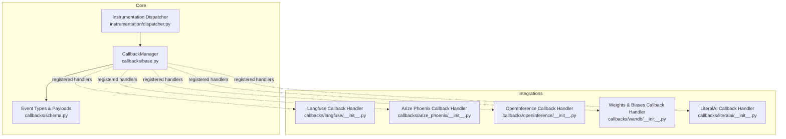
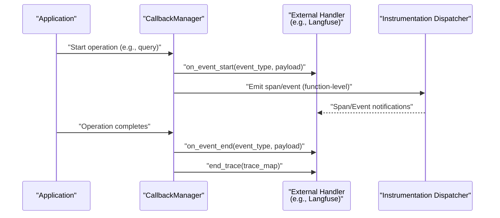
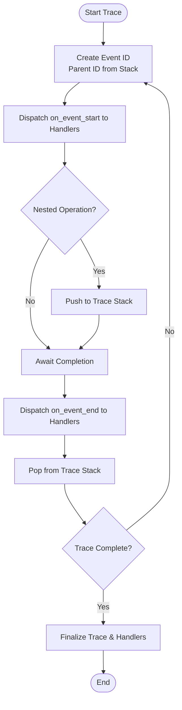
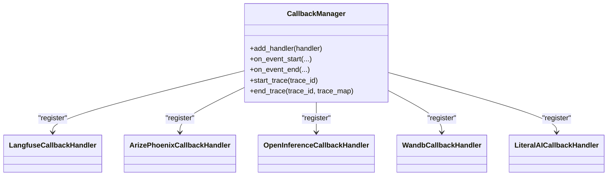
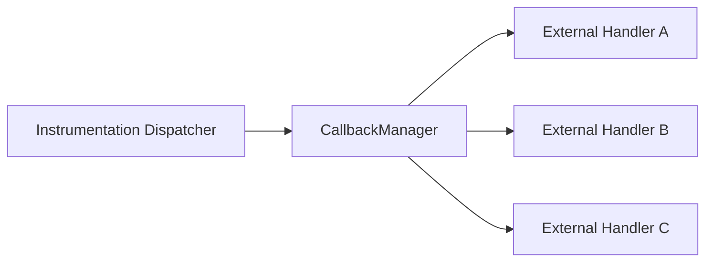

# Observability and Monitoring

<cite>
**Referenced Files in This Document**
- [base.py](file://llama-index-core/llama_index/core/callbacks/base.py)
- [schema.py](file://llama-index-core/llama_index/core/callbacks/schema.py)
- [dispatcher.py](file://llama-index-core/llama_index/core/instrumentation/dispatcher.py)
- [instrumentation_observability_rundown.ipynb](file://docs/examples/instrumentation/instrumentation_observability_rundown.ipynb)
- [__init__.py](file://llama-index-integrations/callbacks/llama-index-callbacks-langfuse/llama_index/callbacks/langfuse/__init__.py)
- [__init__.py](file://llama-index-integrations/callbacks/llama-index-callbacks-arize-phoenix/llama_index/callbacks/arize_phoenix/__init__.py)
- [__init__.py](file://llama-index-integrations/callbacks/llama-index-callbacks-openinference/llama_index/callbacks/openinference/__init__.py)
- [__init__.py](file://llama-index-integrations/callbacks/llama-index-callbacks-wandb/llama_index/callbacks/wandb/__init__.py)
- [__init__.py](file://llama-index-integrations/callbacks/llama-index-callbacks-literalai/llama_index/callbacks/literalai/__init__.py)
</cite>

## Table of Contents
1. [Introduction](#introduction)
2. [Project Structure](#project-structure)
3. [Core Components](#core-components)
4. [Architecture Overview](#architecture-overview)
5. [Detailed Component Analysis](#detailed-component-analysis)
6. [Dependency Analysis](#dependency-analysis)
7. [Performance Considerations](#performance-considerations)
8. [Troubleshooting Guide](#troubleshooting-guide)
9. [Conclusion](#conclusion)
10. [Appendices](#appendices)

## Introduction
This document explains how LlamaIndex enables observability and monitoring across LLM applications. It covers the built-in callback and instrumentation systems that capture telemetry without changing application logic, and demonstrates how to integrate with 12+ observability tools including Langfuse, Arize Phoenix, OpenInference, Weights & Biases, and others. You will learn how to set up distributed tracing, log prompts and responses, analyze performance, track costs, configure metrics collection, and integrate with existing monitoring stacks.

## Project Structure
LlamaIndex provides:
- A callback manager that emits lifecycle events for major operations (e.g., LLM calls, retrieval, synthesis).
- An instrumentation subsystem that generates spans and events for function-level operations.
- A set of callback integrations that forward LlamaIndex telemetry to external observability platforms.

**Diagram sources**
- [base.py](file://llama-index-core/llama_index/core/callbacks/base.py#L28-L303)
- [schema.py](file://llama-index-core/llama_index/core/callbacks/schema.py#L16-L102)
- [dispatcher.py](file://llama-index-core/llama_index/core/instrumentation/dispatcher.py#L1-L9)
- [__init__.py](file://llama-index-integrations/callbacks/llama-index-callbacks-langfuse/llama_index/callbacks/langfuse/__init__.py#L1-L4)
- [__init__.py](file://llama-index-integrations/callbacks/llama-index-callbacks-arize-phoenix/llama_index/callbacks/arize_phoenix/__init__.py#L1-L4)
- [__init__.py](file://llama-index-integrations/callbacks/llama-index-callbacks-openinference/llama_index/callbacks/openinference/__init__.py#L1-L4)
- [__init__.py](file://llama-index-integrations/callbacks/llama-index-callbacks-wandb/llama_index/callbacks/wandb/__init__.py#L1-L4)
- [__init__.py](file://llama-index-integrations/callbacks/llama-index-callbacks-literalai/llama_index/callbacks/literalai/__init__.py#L1-L4)

**Section sources**
- [base.py](file://llama-index-core/llama_index/core/callbacks/base.py#L28-L303)
- [schema.py](file://llama-index-core/llama_index/core/callbacks/schema.py#L16-L102)
- [dispatcher.py](file://llama-index-core/llama_index/core/instrumentation/dispatcher.py#L1-L9)
- [instrumentation_observability_rundown.ipynb](file://docs/examples/instrumentation/instrumentation_observability_rundown.ipynb#L1-L659)

## Core Components
- CallbackManager: Central orchestrator that emits start/end events for LlamaIndex operations, maintains trace stacks, and dispatches to registered handlers. It supports nested traces and exception-aware event closing.
- Event Types and Payloads: Enumerated event categories (e.g., LLM, EMBEDDING, QUERY, RETRIEVE, SYNTHESIZE) and standardized payloads (e.g., PROMPT, MESSAGES, RESPONSE, EXCEPTION).
- Instrumentation Dispatcher: Bridges LlamaIndex internals to a span/event system, enabling observation of function-level operations and their hierarchical relationships.

Key capabilities:
- Distributed tracing: Trace IDs and parent-child relationships across nested operations.
- Prompt and response logging: Access to formatted prompts, messages, and completions via payloads.
- Cost tracking: Access to provider-specific metadata and tokens via payloads and handlers.
- Exception visibility: Automatic exception events and safe event closure in error paths.

**Section sources**
- [base.py](file://llama-index-core/llama_index/core/callbacks/base.py#L28-L303)
- [schema.py](file://llama-index-core/llama_index/core/callbacks/schema.py#L16-L102)
- [dispatcher.py](file://llama-index-core/llama_index/core/instrumentation/dispatcher.py#L1-L9)

## Architecture Overview
The observability pipeline combines LlamaIndex’s callback manager and instrumentation dispatcher with external integrations.

**Diagram sources**
- [base.py](file://llama-index-core/llama_index/core/callbacks/base.py#L88-L143)
- [dispatcher.py](file://llama-index-core/llama_index/core/instrumentation/dispatcher.py#L1-L9)

## Detailed Component Analysis

### CallbackManager and Event Lifecycle
- Manages a per-thread context stack of active events and builds a parent-child trace map.
- Emits on_event_start/on_event_end to all registered handlers.
- Supports nested traces and automatic cleanup on exceptions.

**Diagram sources**
- [base.py](file://llama-index-core/llama_index/core/callbacks/base.py#L88-L143)

**Section sources**
- [base.py](file://llama-index-core/llama_index/core/callbacks/base.py#L28-L303)

### Event Types and Payloads
- Event categories: CHUNKING, NODE_PARSING, EMBEDDING, LLM, QUERY, RETRIEVE, SYNTHESIZE, TREE, SUB_QUESTION, TEMPLATING, FUNCTION_CALL, RERANKING, EXCEPTION, AGENT_STEP.
- Common payloads: PROMPT, MESSAGES, RESPONSE, QUERY_STR, NODES, TOP_K, MODEL_NAME, TEMPLATE, TEMPLATE_VARS, SYSTEM_PROMPT, EXCEPTION.

These enable consistent extraction of prompts, messages, responses, and metadata across providers.

**Section sources**
- [schema.py](file://llama-index-core/llama_index/core/callbacks/schema.py#L16-L102)

### Instrumentation Dispatcher
- Provides span and event hooks for function-level operations.
- Enables building custom handlers to collect timing, payloads, and errors.

**Section sources**
- [dispatcher.py](file://llama-index-core/llama_index/core/instrumentation/dispatcher.py#L1-L9)

### Observability Integrations Overview
LlamaIndex offers callback integrations for multiple observability platforms. Each integration registers a handler with the CallbackManager to export telemetry.

**Diagram sources**
- [base.py](file://llama-index-core/llama_index/core/callbacks/base.py#L144-L154)
- [__init__.py](file://llama-index-integrations/callbacks/llama-index-callbacks-langfuse/llama_index/callbacks/langfuse/__init__.py#L1-L4)
- [__init__.py](file://llama-index-integrations/callbacks/llama-index-callbacks-arize-phoenix/llama_index/callbacks/arize_phoenix/__init__.py#L1-L4)
- [__init__.py](file://llama-index-integrations/callbacks/llama-index-callbacks-openinference/llama_index/callbacks/openinference/__init__.py#L1-L4)
- [__init__.py](file://llama-index-integrations/callbacks/llama-index-callbacks-wandb/llama_index/callbacks/wandb/__init__.py#L1-L4)
- [__init__.py](file://llama-index-integrations/callbacks/llama-index-callbacks-literalai/llama_index/callbacks/literalai/__init__.py#L1-L4)

### Practical Setup Examples
- Use the notebook to understand how to attach event and span handlers to the instrumentation dispatcher and observe real-time spans and events.
- Register platform-specific callback handlers with the CallbackManager to export telemetry automatically.

References:
- [instrumentation_observability_rundown.ipynb](file://docs/examples/instrumentation/instrumentation_observability_rundown.ipynb#L1-L659)
- [__init__.py](file://llama-index-integrations/callbacks/llama-index-callbacks-langfuse/llama_index/callbacks/langfuse/__init__.py#L1-L4)
- [__init__.py](file://llama-index-integrations/callbacks/llama-index-callbacks-arize-phoenix/llama_index/callbacks/arize_phoenix/__init__.py#L1-L4)
- [__init__.py](file://llama-index-integrations/callbacks/llama-index-callbacks-openinference/llama_index/callbacks/openinference/__init__.py#L1-L4)
- [__init__.py](file://llama-index-integrations/callbacks/llama-index-callbacks-wandb/llama_index/callbacks/wandb/__init__.py#L1-L4)
- [__init__.py](file://llama-index-integrations/callbacks/llama-index-callbacks-literalai/llama_index/callbacks/literalai/__init__.py#L1-L4)

**Section sources**
- [instrumentation_observability_rundown.ipynb](file://docs/examples/instrumentation/instrumentation_observability_rundown.ipynb#L1-L659)
- [__init__.py](file://llama-index-integrations/callbacks/llama-index-callbacks-langfuse/llama_index/callbacks/langfuse/__init__.py#L1-L4)
- [__init__.py](file://llama-index-integrations/callbacks/llama-index-callbacks-arize-phoenix/llama_index/callbacks/arize_phoenix/__init__.py#L1-L4)
- [__init__.py](file://llama-index-integrations/callbacks/llama-index-callbacks-openinference/llama_index/callbacks/openinference/__init__.py#L1-L4)
- [__init__.py](file://llama-index-integrations/callbacks/llama-index-callbacks-wandb/llama_index/callbacks/wandb/__init__.py#L1-L4)
- [__init__.py](file://llama-index-integrations/callbacks/llama-index-callbacks-literalai/llama_index/callbacks/literalai/__init__.py#L1-L4)

### Distributed Tracing
- Trace IDs and parent-child relationships are maintained by the CallbackManager.
- Use start_trace/end_trace to group end-to-end operations.
- Combine with instrumentation spans to visualize full call graphs.

**Section sources**
- [base.py](file://llama-index-core/llama_index/core/callbacks/base.py#L213-L243)
- [dispatcher.py](file://llama-index-core/llama_index/core/instrumentation/dispatcher.py#L1-L9)

### Prompt Logging and Response Analysis
- Capture formatted prompts and messages via payloads (PROMPT, MESSAGES).
- Extract responses and completions for downstream analysis.
- Use instrumentation events to correlate streaming deltas and final outputs.

**Section sources**
- [schema.py](file://llama-index-core/llama_index/core/callbacks/schema.py#L49-L72)
- [instrumentation_observability_rundown.ipynb](file://docs/examples/instrumentation/instrumentation_observability_rundown.ipynb#L160-L196)

### Cost Tracking Across Providers
- Access provider metadata and token usage via payloads and handler-specific exports.
- Aggregate costs per query or per operation using handler-provided metrics.

**Section sources**
- [schema.py](file://llama-index-core/llama_index/core/callbacks/schema.py#L66-L71)
- [__init__.py](file://llama-index-integrations/callbacks/llama-index-callbacks-wandb/llama_index/callbacks/wandb/__init__.py#L1-L4)

### Choosing an Observability Tool
- Langfuse: Full LLM observability with prompt/response logging, latency, and cost tracking.
- Arize Phoenix: Open-source LLM observability with tracing and drift detection.
- OpenInference: Standardized LLM instrumentation schema for interoperability.
- Weights & Biases: Experiment tracking and metrics with LLM-friendly integrations.
- LiteralAI: Prompt analytics and model performance dashboards.
- Others: Aim, Argilla, HoneyHive, Opik, PromptLayer, UpTrain.

Guidance:
- Prefer OpenInference for standardized, schema-aligned telemetry.
- Choose platform-specific handlers (e.g., Langfuse, Arize Phoenix, Wandb) for richer UIs and domain-specific features.
- Ensure your chosen tool supports the payload fields you need (PROMPT, MESSAGES, RESPONSE, EXCEPTION).

**Section sources**
- [__init__.py](file://llama-index-integrations/callbacks/llama-index-callbacks-langfuse/llama_index/callbacks/langfuse/__init__.py#L1-L4)
- [__init__.py](file://llama-index-integrations/callbacks/llama-index-callbacks-arize-phoenix/llama_index/callbacks/arize_phoenix/__init__.py#L1-L4)
- [__init__.py](file://llama-index-integrations/callbacks/llama-index-callbacks-openinference/llama_index/callbacks/openinference/__init__.py#L1-L4)
- [__init__.py](file://llama-index-integrations/callbacks/llama-index-callbacks-wandb/llama_index/callbacks/wandb/__init__.py#L1-L4)
- [__init__.py](file://llama-index-integrations/callbacks/llama-index-callbacks-literalai/llama_index/callbacks/literalai/__init__.py#L1-L4)

### Setting Up Alerting and Integrations
- Use handler-provided metrics and logs to define alerts (latency p95, error rates, cost thresholds).
- Export traces and spans to your existing monitoring stack via OpenInference-compatible handlers or platform-specific exporters.
- Correlate application-level queries with underlying LLM calls and retrievals using shared trace IDs.

[No sources needed since this section provides general guidance]

## Dependency Analysis
The callback system is decoupled from integrations. Handlers are registered with the CallbackManager, which forwards events to all registered handlers without application code changes.

**Diagram sources**
- [base.py](file://llama-index-core/llama_index/core/callbacks/base.py#L107-L136)
- [dispatcher.py](file://llama-index-core/llama_index/core/instrumentation/dispatcher.py#L1-L9)

**Section sources**
- [base.py](file://llama-index-core/llama_index/core/callbacks/base.py#L88-L143)
- [dispatcher.py](file://llama-index-core/llama_index/core/instrumentation/dispatcher.py#L1-L9)

## Performance Considerations
- Keep handler logic lightweight to avoid overhead on hot paths.
- Use batching where supported by external platforms.
- Filter or sample events selectively if generating high-volume telemetry.
- Prefer OpenInference-compatible handlers for standardized, efficient telemetry.

[No sources needed since this section provides general guidance]

## Troubleshooting Guide
- Exceptions: The CallbackManager ensures events are closed even on exceptions by adding exception payloads and marking them safely.
- Missing telemetry: Verify handlers are registered with the CallbackManager and that instrumentation is enabled.
- Duplicate handlers: The manager prevents adding multiple handlers of the same type.

**Section sources**
- [base.py](file://llama-index-core/llama_index/core/callbacks/base.py#L180-L191)
- [base.py](file://llama-index-core/llama_index/core/callbacks/base.py#L64-L74)

## Conclusion
LlamaIndex’s callback and instrumentation systems provide a robust foundation for observability. By registering platform-specific handlers, teams can gain deep insights into LLM performance, latency, costs, and user interactions—without altering application logic. Combine standardized telemetry with distributed tracing and prompt/response logging to build comprehensive monitoring and alerting strategies.

[No sources needed since this section summarizes without analyzing specific files]

## Appendices
- Explore the notebook example to see how to attach event and span handlers and visualize trace trees and span durations.
- Review handler init files to locate the exact handler classes for each integration.

**Section sources**
- [instrumentation_observability_rundown.ipynb](file://docs/examples/instrumentation/instrumentation_observability_rundown.ipynb#L1-L659)
- [__init__.py](file://llama-index-integrations/callbacks/llama-index-callbacks-langfuse/llama_index/callbacks/langfuse/__init__.py#L1-L4)
- [__init__.py](file://llama-index-integrations/callbacks/llama-index-callbacks-arize-phoenix/llama_index/callbacks/arize_phoenix/__init__.py#L1-L4)
- [__init__.py](file://llama-index-integrations/callbacks/llama-index-callbacks-openinference/llama_index/callbacks/openinference/__init__.py#L1-L4)
- [__init__.py](file://llama-index-integrations/callbacks/llama-index-callbacks-wandb/llama_index/callbacks/wandb/__init__.py#L1-L4)
- [__init__.py](file://llama-index-integrations/callbacks/llama-index-callbacks-literalai/llama_index/callbacks/literalai/__init__.py#L1-L4)