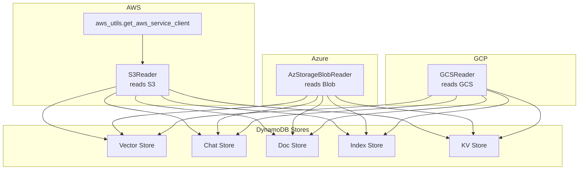
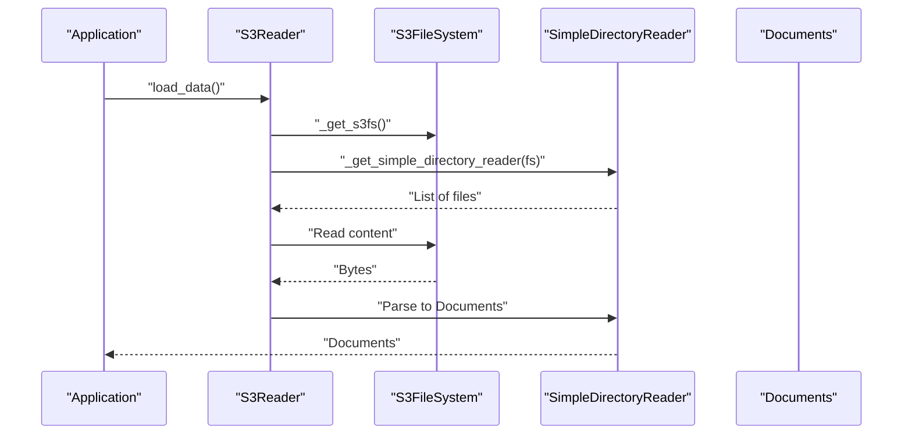
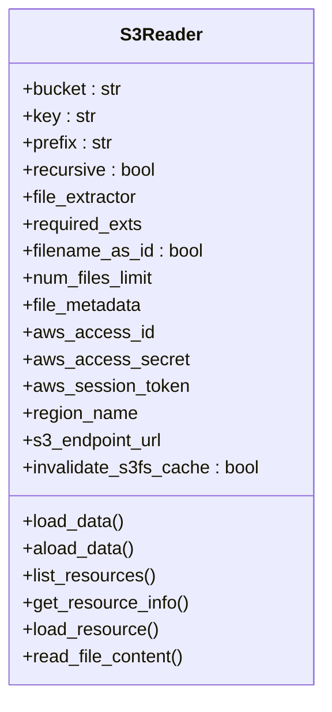
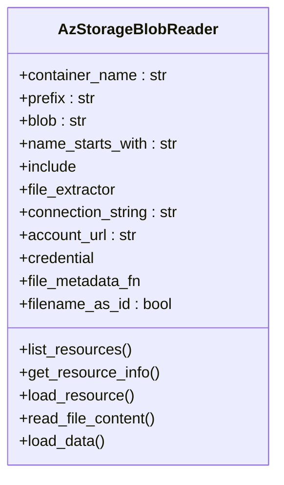
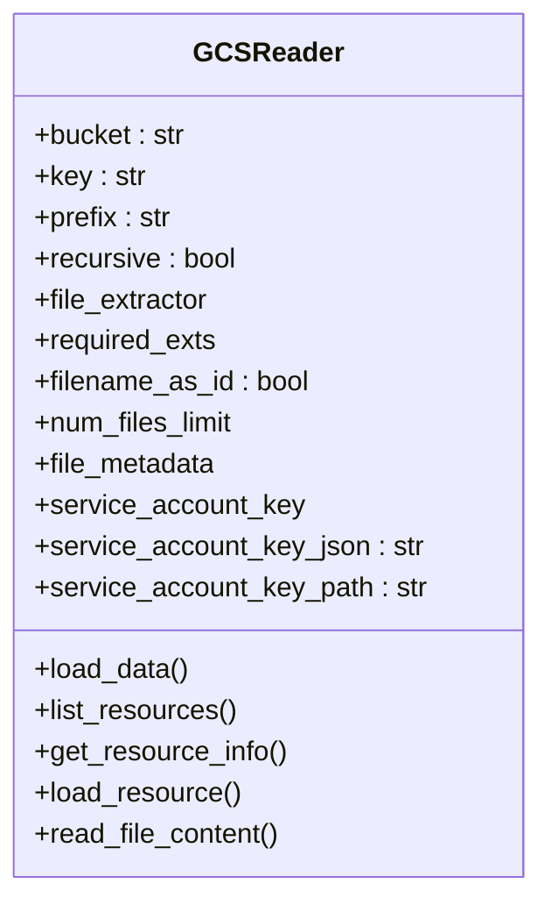
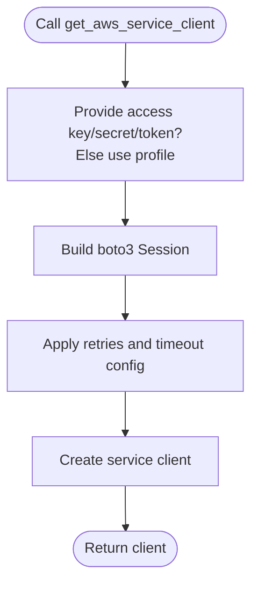
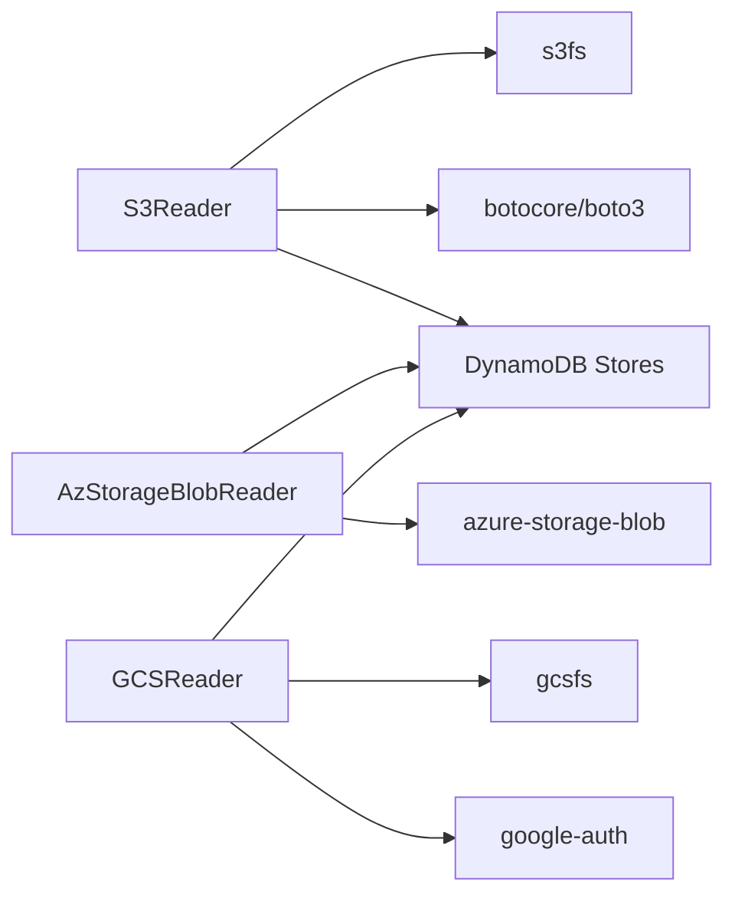

# Cloud Infrastructure

<cite>
**Referenced Files in This Document**
- [aws_utils.py](file://llama-index-core/llama_index/core/utilities/aws_utils.py)
- [s3/base.py](file://llama-index-integrations/readers/llama-index-readers-s3/llama_index/readers/s3/base.py)
- [s3/__init__.py](file://llama-index-integrations/readers/llama-index-readers-s3/llama_index/readers/s3/__init__.py)
- [azstorage_blob/base.py](file://llama-index-integrations/readers/llama-index-readers-azstorage-blob/llama_index/readers/azstorage_blob/base.py)
- [azstorage_blob/__init__.py](file://llama-index-integrations/readers/llama-index-readers-azstorage-blob/llama_index/readers/azstorage_blob/__init__.py)
- [gcs/base.py](file://llama-index-integrations/readers/llama-index-readers-gcs/llama_index/readers/gcs/base.py)
- [gcs/__init__.py](file://llama-index-integrations/readers/llama-index-readers-gcs/llama_index/readers/gcs/__init__.py)
- [dynamodb.md](file://docs/api_reference/api_reference/storage/vector_store/dynamodb.md)
- [dynamodb.md](file://docs/api_reference/api_reference/storage/chat_store/dynamodb.md)
- [dynamodb.md](file://docs/api_reference/api_reference/storage/docstore/dynamodb.md)
- [dynamodb.md](file://docs/api_reference/api_reference/storage/index_store/dynamodb.md)
- [dynamodb.md](file://docs/api_reference/api_reference/storage/kvstore/dynamodb.md)
</cite>

## Table of Contents
1. [Introduction](#introduction)
2. [Project Structure](#project-structure)
3. [Core Components](#core-components)
4. [Architecture Overview](#architecture-overview)
5. [Detailed Component Analysis](#detailed-component-analysis)
6. [Dependency Analysis](#dependency-analysis)
7. [Performance Considerations](#performance-considerations)
8. [Troubleshooting Guide](#troubleshooting-guide)
9. [Conclusion](#conclusion)
10. [Appendices](#appendices)

## Introduction
This document explains how to integrate cloud infrastructure services with LlamaIndex readers and storage components. It focuses on:
- AWS: S3 access, IAM configuration, cross-account considerations
- Azure: Blob storage, managed identity, service principals
- GCP: Cloud Storage, service accounts, workload identity
It also covers building serverless data pipelines, regional deployment, encryption at rest, compliance, cost optimization, resource tagging, and monitoring integration.

## Project Structure
The relevant cloud integrations are implemented as reader packages and documented in the API reference:
- AWS S3 reader: [S3Reader](file://llama-index-integrations/readers/llama-index-readers-s3/llama_index/readers/s3/base.py#L30-L227)
- Azure Blob storage reader: [AzStorageBlobReader](file://llama-index-integrations/readers/llama-index-readers-azstorage-blob/llama_index/readers/azstorage_blob/base.py#L61-L284)
- GCS reader: [GCSReader](file://llama-index-integrations/readers/llama-index-readers-gcs/llama_index/readers/gcs/base.py#L38-L284)
- AWS utilities for clients: [get_aws_service_client](file://llama-index-core/llama_index/core/utilities/aws_utils.py#L7-L53)
- DynamoDB-backed stores (vector, chat store, docstore, index store, kvstore): [DynamoDB docs](file://docs/api_reference/api_reference/storage/vector_store/dynamodb.md)

**Diagram sources**
- [s3/base.py](file://llama-index-integrations/readers/llama-index-readers-s3/llama_index/readers/s3/base.py#L30-L227)
- [aws_utils.py](file://llama-index-core/llama_index/core/utilities/aws_utils.py#L7-L53)
- [azstorage_blob/base.py](file://llama-index-integrations/readers/llama-index-readers-azstorage-blob/llama_index/readers/azstorage_blob/base.py#L61-L284)
- [gcs/base.py](file://llama-index-integrations/readers/llama-index-readers-gcs/llama_index/readers/gcs/base.py#L38-L284)
- [dynamodb.md](file://docs/api_reference/api_reference/storage/vector_store/dynamodb.md)

**Section sources**
- [s3/base.py](file://llama-index-integrations/readers/llama-index-readers-s3/llama_index/readers/s3/base.py#L30-L227)
- [azstorage_blob/base.py](file://llama-index-integrations/readers/llama-index-readers-azstorage-blob/llama_index/readers/azstorage_blob/base.py#L61-L284)
- [gcs/base.py](file://llama-index-integrations/readers/llama-index-readers-gcs/llama_index/readers/gcs/base.py#L38-L284)
- [aws_utils.py](file://llama-index-core/llama_index/core/utilities/aws_utils.py#L7-L53)
- [dynamodb.md](file://docs/api_reference/api_reference/storage/vector_store/dynamodb.md)

## Core Components
- S3Reader: Reads files or directories from Amazon S3, supporting credentials, region, endpoint override, and file extraction.
- AzStorageBlobReader: Reads files or lists blobs from Azure Blob storage, supporting connection string, account URL, and credentials.
- GCSReader: Reads files or directories from Google Cloud Storage, supporting service account key variants and default credentials.
- AWS client utility: Provides a reusable helper to construct AWS service clients with retries and timeouts.
- DynamoDB-backed stores: Vector store, chat store, docstore, index store, and KV store are documented in the API reference.

**Section sources**
- [s3/base.py](file://llama-index-integrations/readers/llama-index-readers-s3/llama_index/readers/s3/base.py#L30-L227)
- [azstorage_blob/base.py](file://llama-index-integrations/readers/llama-index-readers-azstorage-blob/llama_index/readers/azstorage_blob/base.py#L61-L284)
- [gcs/base.py](file://llama-index-integrations/readers/llama-index-readers-gcs/llama_index/readers/gcs/base.py#L38-L284)
- [aws_utils.py](file://llama-index-core/llama_index/core/utilities/aws_utils.py#L7-L53)
- [dynamodb.md](file://docs/api_reference/api_reference/storage/vector_store/dynamodb.md)

## Architecture Overview
The readers act as cloud-native data sources, materializing remote content locally via filesystem abstractions and then parsing into Documents. These Documents feed downstream components such as vector stores and chat/doc stores backed by managed databases.

**Diagram sources**
- [s3/base.py](file://llama-index-integrations/readers/llama-index-readers-s3/llama_index/readers/s3/base.py#L87-L138)

**Section sources**
- [s3/base.py](file://llama-index-integrations/readers/llama-index-readers-s3/llama_index/readers/s3/base.py#L87-L138)

## Detailed Component Analysis

### AWS S3 Reader
- Purpose: Access S3 buckets and prefixes, support credentials and region, and parse files via extractors.
- Key capabilities:
  - Credentials: access key/secret/session token, region, endpoint override
  - Listing and metadata: list_resources(), get_resource_info()
  - Async support: aload_data()
- Security and cross-account:
  - Prefer IAM roles or instance profiles when running in AWS environments
  - For cross-account access, grant cross-account trust and least-privilege permissions to the target bucket
- Regional deployment:
  - Set region_name to align with bucket location
- Cost optimization:
  - Use prefix filtering to limit traversal
  - Limit num_files_limit
- Monitoring:
  - Enable S3 server access logging and CloudWatch metrics for the bucket

**Diagram sources**
- [s3/base.py](file://llama-index-integrations/readers/llama-index-readers-s3/llama_index/readers/s3/base.py#L30-L227)

**Section sources**
- [s3/base.py](file://llama-index-integrations/readers/llama-index-readers-s3/llama_index/readers/s3/base.py#L30-L227)

### Azure Blob Storage Reader
- Purpose: Read blobs from a container, optionally filtered by name prefix, with metadata extraction.
- Key capabilities:
  - Authentication: connection string, account URL, or credential object
  - Listing and metadata: list_resources(), get_resource_info()
  - Managed identity: supply a TokenCredential-compatible credential
  - Service principal: supply a credential with tenant and client IDs
- Regional deployment:
  - Align client region/account URL with target container
- Cost optimization:
  - Use name_starts_with to narrow scope
  - Download to temporary directory and process in-memory
- Monitoring:
  - Enable Azure Storage logging and metric alerts

**Diagram sources**
- [azstorage_blob/base.py](file://llama-index-integrations/readers/llama-index-readers-azstorage-blob/llama_index/readers/azstorage_blob/base.py#L61-L284)

**Section sources**
- [azstorage_blob/base.py](file://llama-index-integrations/readers/llama-index-readers-azstorage-blob/llama_index/readers/azstorage_blob/base.py#L61-L284)

### GCS Reader
- Purpose: Read files from GCS buckets, supporting service account keys and default credentials.
- Key capabilities:
  - Authentication: service_account_key, service_account_key_json, service_account_key_path, or default credentials
  - Listing and metadata: list_resources(), get_resource_info()
- Regional deployment:
  - Use appropriate project and bucket location
- Cost optimization:
  - Filter by prefix and limit files processed
- Monitoring:
  - Enable Cloud Storage access logs and Cloud Monitoring metrics

**Diagram sources**
- [gcs/base.py](file://llama-index-integrations/readers/llama-index-readers-gcs/llama_index/readers/gcs/base.py#L38-L284)

**Section sources**
- [gcs/base.py](file://llama-index-integrations/readers/llama-index-readers-gcs/llama_index/readers/gcs/base.py#L38-L284)

### AWS Utilities
- Purpose: Construct AWS service clients with configurable retries and timeouts.
- Usage: Supply credentials or use default credential chain; set region as needed.

**Diagram sources**
- [aws_utils.py](file://llama-index-core/llama_index/core/utilities/aws_utils.py#L7-L53)

**Section sources**
- [aws_utils.py](file://llama-index-core/llama_index/core/utilities/aws_utils.py#L7-L53)

### DynamoDB-backed Stores
- Vector store, chat store, docstore, index store, and KV store are supported and documented in the API reference.
- Use these stores to persist RAG artifacts and state in managed DynamoDB tables.

**Section sources**
- [dynamodb.md](file://docs/api_reference/api_reference/storage/vector_store/dynamodb.md)
- [dynamodb.md](file://docs/api_reference/api_reference/storage/chat_store/dynamodb.md)
- [dynamodb.md](file://docs/api_reference/api_reference/storage/docstore/dynamodb.md)
- [dynamodb.md](file://docs/api_reference/api_reference/storage/index_store/dynamodb.md)
- [dynamodb.md](file://docs/api_reference/api_reference/storage/kvstore/dynamodb.md)

## Dependency Analysis
- Readers depend on cloud SDKs and filesystem abstractions:
  - S3Reader depends on s3fs and boto3/botocore
  - AzStorageBlobReader depends on azure-storage-blob
  - GCSReader depends on gcsfs and google-auth
- DynamoDB stores integrate with AWS SDKs and rely on table schemas defined in the API reference.

**Diagram sources**
- [s3/base.py](file://llama-index-integrations/readers/llama-index-readers-s3/llama_index/readers/s3/base.py#L87-L104)
- [azstorage_blob/base.py](file://llama-index-integrations/readers/llama-index-readers-azstorage-blob/llama_index/readers/azstorage_blob/base.py#L116-L124)
- [gcs/base.py](file://llama-index-integrations/readers/llama-index-readers-gcs/llama_index/readers/gcs/base.py#L97-L118)
- [dynamodb.md](file://docs/api_reference/api_reference/storage/vector_store/dynamodb.md)

**Section sources**
- [s3/base.py](file://llama-index-integrations/readers/llama-index-readers-s3/llama_index/readers/s3/base.py#L87-L104)
- [azstorage_blob/base.py](file://llama-index-integrations/readers/llama-index-readers-azstorage-blob/llama_index/readers/azstorage_blob/base.py#L116-L124)
- [gcs/base.py](file://llama-index-integrations/readers/llama-index-readers-gcs/llama_index/readers/gcs/base.py#L97-L118)
- [dynamodb.md](file://docs/api_reference/api_reference/storage/vector_store/dynamodb.md)

## Performance Considerations
- Filtering and limits:
  - Use prefix filters and num_files_limit to reduce traversal and parsing overhead
- Streaming and caching:
  - S3Reader supports cache invalidation; tune invalidate_s3fs_cache per workload
- Batch operations:
  - Prefer listing and batch processing where supported by the underlying SDK
- Retry and timeout:
  - Configure retries and timeouts via the AWS client utility for resilient connectivity

[No sources needed since this section provides general guidance]

## Troubleshooting Guide
- AWS credentials and regions:
  - Verify credentials and region; use the AWS client utility to validate client construction
- Azure authentication:
  - Ensure the credential type matches the configured authentication method (connection string, account URL, or TokenCredential)
- GCS authentication:
  - Confirm service account key configuration or fallback to default credentials
- Resource metadata:
  - Use list_resources() and get_resource_info() to inspect available resources and metadata

**Section sources**
- [aws_utils.py](file://llama-index-core/llama_index/core/utilities/aws_utils.py#L7-L53)
- [s3/base.py](file://llama-index-integrations/readers/llama-index-readers-s3/llama_index/readers/s3/base.py#L188-L227)
- [azstorage_blob/base.py](file://llama-index-integrations/readers/llama-index-readers-azstorage-blob/llama_index/readers/azstorage_blob/base.py#L211-L234)
- [gcs/base.py](file://llama-index-integrations/readers/llama-index-readers-gcs/llama_index/readers/gcs/base.py#L174-L235)

## Conclusion
LlamaIndex provides first-class readers for AWS S3, Azure Blob, and GCS, enabling serverless ingestion of cloud-native data. Combined with DynamoDB-backed stores, teams can build scalable, managed RAG pipelines. Secure deployments rely on IAM roles, managed identities, service principals, and service account keys. Regional alignment, encryption at rest, compliance controls, cost optimization, tagging, and monitoring should be integrated into operational procedures.

[No sources needed since this section summarizes without analyzing specific files]

## Appendices

### Example Workflows

- AWS S3 to Vector Store
  - Use S3Reader to list and load files from a bucket/prefix
  - Parse into Documents and insert into a DynamoDB-backed vector store

- Azure Blob to Chat/Doc Store
  - Use AzStorageBlobReader to list blobs and load content
  - Persist conversations and documents in DynamoDB-backed chat/doc stores

- GCS to Index/KV Store
  - Use GCSReader to enumerate and read files
  - Persist index metadata and key-value pairs in DynamoDB-backed stores

[No sources needed since this section provides general guidance]

### Regional Deployment, Encryption, and Compliance
- Regional deployment:
  - Align reader region/account URL with target bucket/container/location
- Encryption at rest:
  - Rely on provider defaults for S3, Azure Storage, and GCS
- Compliance:
  - Enforce retention policies and audit logs per provider guidelines
- Cost optimization:
  - Apply prefix filters, limit file counts, and use lifecycle policies
- Resource tagging:
  - Tag buckets/containers/tables consistently for cost allocation
- Monitoring:
  - Enable provider-side logs and metrics; integrate with CloudWatch, Azure Monitor, or Cloud Monitoring

[No sources needed since this section provides general guidance]