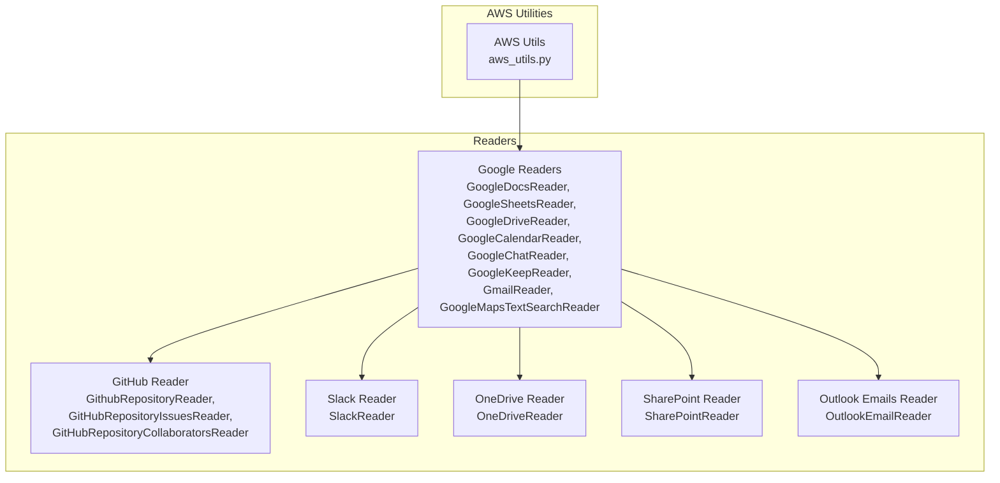
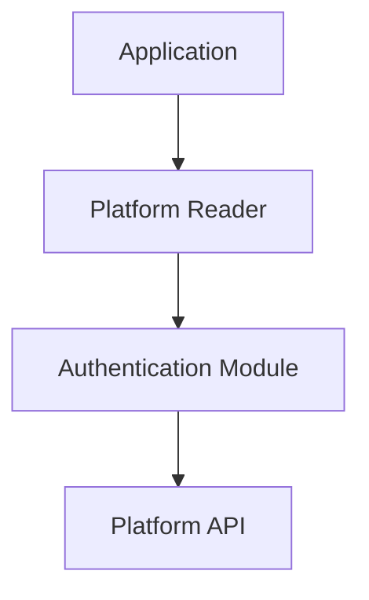
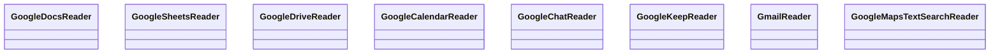
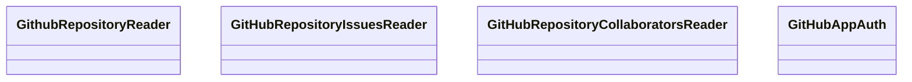
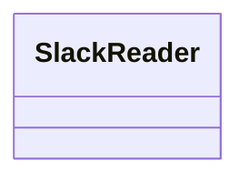
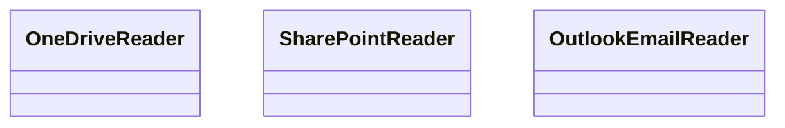
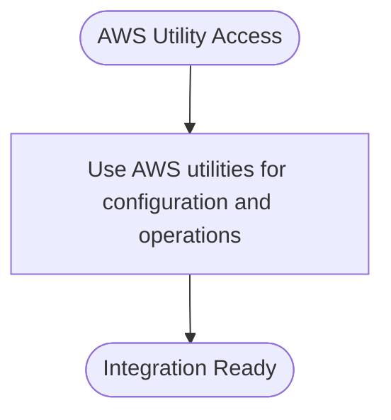
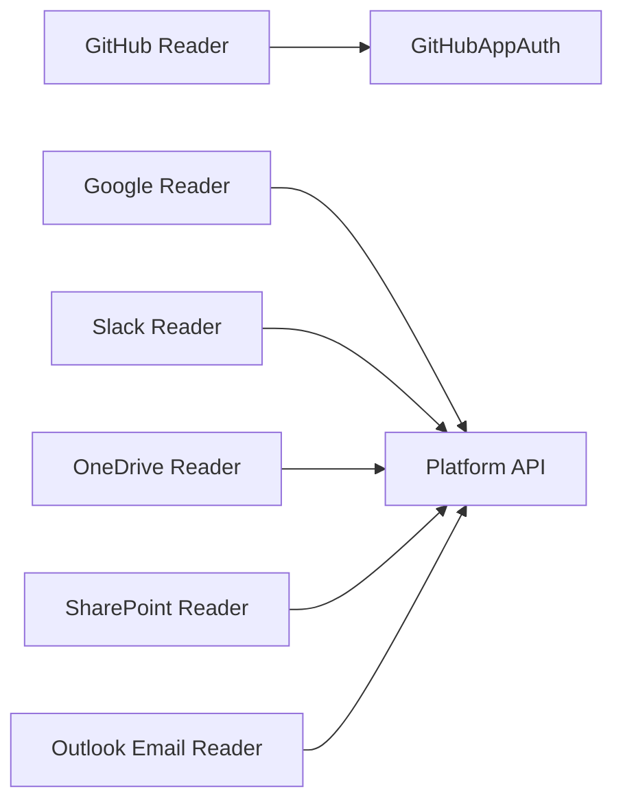

# Cloud Service Connectors

<cite>
**Referenced Files in This Document**
- [google/__init__.py](file://llama-index-integrations/readers/llama-index-readers-google/llama_index/readers/google/__init__.py)
- [github/__init__.py](file://llama-index-integrations/readers/llama-index-readers-github/llama_index/readers/github/__init__.py)
- [slack/__init__.py](file://llama-index-integrations/readers/llama-index-readers-slack/llama_index/readers/slack/__init__.py)
- [onedrive/__init__.py](file://llama-index-integrations/readers/llama-index-readers-microsoft-onedrive/llama_index/readers/microsoft_onedrive/__init__.py)
- [sharepoint/__init__.py](file://llama-index-integrations/readers/llama-index-readers-microsoft-sharepoint/llama_index/readers/microsoft_sharepoint/__init__.py)
- [outlook_emails/__init__.py](file://llama-index-integrations/readers/llama-index-readers-microsoft-outlook-emails/llama_index/readers/microsoft_outlook_emails/__init__.py)
- [aws_utils.py](file://llama-index-core/llama_index/core/utilities/aws_utils.py)
- [test_readers_google_drive.py](file://llama-index-integrations/readers/llama-index-readers-google/tests/test_readers_google_drive.py)
- [test_github_repository_reader.py](file://llama-index-integrations/readers/llama-index-readers-github/tests/test_github_repository_reader.py)
- [test_readers_slack.py](file://llama-index-integrations/readers/llama-index-readers-slack/tests/test_readers_slack.py)
- [test_readers_microsoft_sharepoint.py](file://llama-index-integrations/readers/llama-index-readers-microsoft-sharepoint/tests/test_readers_microsoft_sharepoint.py)
- [test_readers_microsoft_onedrive.py](file://llama-index-integrations/readers/llama-index-readers-microsoft-onedrive/tests/test_readers_microsoft_onedrive.py)
- [test_readers_microsoft_outlook_mails.py](file://llama-index-integrations/readers/llama-index-readers-microsoft-outlook-emails/tests/test_readers_microsoft_outlook_mails.py)
- [google_calendar.ipynb](file://llama-index-integrations/tools/llama-index-tools-google/examples/google_calendar.ipynb)
- [github_app_example.py](file://llama-index-integrations/readers/llama-index-readers-github/examples/github_app_example.py)
- [multi_tenancy_rag_pack](file://llama-index-packs/llama-index-packs-multi-tenancy-rag/README.md)
</cite>

## Table of Contents
1. [Introduction](#introduction)
2. [Project Structure](#project-structure)
3. [Core Components](#core-components)
4. [Architecture Overview](#architecture-overview)
5. [Detailed Component Analysis](#detailed-component-analysis)
6. [Dependency Analysis](#dependency-analysis)
7. [Performance Considerations](#performance-considerations)
8. [Troubleshooting Guide](#troubleshooting-guide)
9. [Conclusion](#conclusion)
10. [Appendices](#appendices)

## Introduction
This document describes cloud service connectors available in LlamaIndex, focusing on reader and tool integrations for major cloud platforms. It covers Google Workspace (Drive, Docs, Sheets, Calendar, Chat, Keep, Gmail, Maps), GitHub (repositories, issues, collaborators, app authentication), Slack (channels, messages, files), Microsoft 365 (OneDrive, SharePoint, Outlook emails), and AWS utilities. It explains authentication patterns, configuration options, and operational guidance for scalable ingestion, incremental updates, and enterprise-grade deployments.

## Project Structure
Connectors are organized under dedicated integration packages. Each platform exposes a primary reader or tool class with supporting clients and authentication helpers. Tests and examples demonstrate usage patterns and configuration.

**Diagram sources**
- [google/__init__.py](file://llama-index-integrations/readers/llama-index-readers-google/llama_index/readers/google/__init__.py#L1-L20)
- [github/__init__.py](file://llama-index-integrations/readers/llama-index-readers-github/llama_index/readers/github/__init__.py#L1-L40)
- [slack/__init__.py](file://llama-index-integrations/readers/llama-index-readers-slack/llama_index/readers/slack/__init__.py#L1-L4)
- [onedrive/__init__.py](file://llama-index-integrations/readers/llama-index-readers-microsoft-onedrive/llama_index/readers/microsoft_onedrive/__init__.py#L1-L4)
- [sharepoint/__init__.py](file://llama-index-integrations/readers/llama-index-readers-microsoft-sharepoint/llama_index/readers/microsoft_sharepoint/__init__.py#L1-L4)
- [outlook_emails/__init__.py](file://llama-index-integrations/readers/llama-index-readers-microsoft-outlook-emails/llama_index/readers/microsoft_outlook_emails/__init__.py#L1-L4)
- [aws_utils.py](file://llama-index-core/llama_index/core/utilities/aws_utils.py)

**Section sources**
- [google/__init__.py](file://llama-index-integrations/readers/llama-index-readers-google/llama_index/readers/google/__init__.py#L1-L20)
- [github/__init__.py](file://llama-index-integrations/readers/llama-index-readers-github/llama_index/readers/github/__init__.py#L1-L40)
- [slack/__init__.py](file://llama-index-integrations/readers/llama-index-readers-slack/llama_index/readers/slack/__init__.py#L1-L4)
- [onedrive/__init__.py](file://llama-index-integrations/readers/llama-index-readers-microsoft-onedrive/llama_index/readers/microsoft_onedrive/__init__.py#L1-L4)
- [sharepoint/__init__.py](file://llama-index-integrations/readers/llama-index-readers-microsoft-sharepoint/llama_index/readers/microsoft_sharepoint/__init__.py#L1-L4)
- [outlook_emails/__init__.py](file://llama-index-integrations/readers/llama-index-readers-microsoft-outlook-emails/llama_index/readers/microsoft_outlook_emails/__init__.py#L1-L4)
- [aws_utils.py](file://llama-index-core/llama_index/core/utilities/aws_utils.py)

## Core Components
- Google Workspace Readers: GoogleDocsReader, GoogleSheetsReader, GoogleDriveReader, GoogleCalendarReader, GoogleChatReader, GoogleKeepReader, GmailReader, GoogleMapsTextSearchReader.
- GitHub Readers: GithubRepositoryReader, GitHubRepositoryIssuesReader, GitHubRepositoryCollaboratorsReader; optional GitHubAppAuth for app-based authentication.
- Slack Reader: SlackReader for channels, messages, and files.
- Microsoft 365 Readers: OneDriveReader, SharePointReader, OutlookEmailReader.
- AWS Utilities: aws_utils.py provides AWS-related helper utilities.

These components expose consistent reader interfaces for ingestion and can be combined with LlamaIndex ingestion and query engines.

**Section sources**
- [google/__init__.py](file://llama-index-integrations/readers/llama-index-readers-google/llama_index/readers/google/__init__.py#L1-L20)
- [github/__init__.py](file://llama-index-integrations/readers/llama-index-readers-github/llama_index/readers/github/__init__.py#L1-L40)
- [slack/__init__.py](file://llama-index-integrations/readers/llama-index-readers-slack/llama_index/readers/slack/__init__.py#L1-L4)
- [onedrive/__init__.py](file://llama-index-integrations/readers/llama-index-readers-microsoft-onedrive/llama_index/readers/microsoft_onedrive/__init__.py#L1-L4)
- [sharepoint/__init__.py](file://llama-index-integrations/readers/llama-index-readers-microsoft-sharepoint/llama_index/readers/microsoft_sharepoint/__init__.py#L1-L4)
- [outlook_emails/__init__.py](file://llama-index-integrations/readers/llama-index-readers-microsoft-outlook-emails/llama_index/readers/microsoft_outlook_emails/__init__.py#L1-L4)

## Architecture Overview
Connectors follow a modular pattern:
- Reader classes encapsulate platform-specific logic for fetching and parsing data.
- Optional authentication modules (e.g., GitHubAppAuth) integrate with platform APIs.
- Example notebooks and scripts demonstrate configuration and usage.
- Tests validate basic functionality and help identify configuration issues.

[No sources needed since this diagram shows conceptual workflow, not actual code structure]

## Detailed Component Analysis

### Google Workspace Connectors
- Exposed via google/__init__.py, which re-exports GoogleDocsReader, GoogleSheetsReader, GoogleDriveReader, GoogleCalendarReader, GoogleChatReader, GoogleKeepReader, GmailReader, GoogleMapsTextSearchReader.
- Typical usage involves initializing a reader with credentials and specifying resource identifiers (e.g., folder IDs, document IDs).
- Tests validate drive access and parsing behavior.

**Diagram sources**
- [google/__init__.py](file://llama-index-integrations/readers/llama-index-readers-google/llama_index/readers/google/__init__.py#L1-L20)

**Section sources**
- [google/__init__.py](file://llama-index-integrations/readers/llama-index-readers-google/llama_index/readers/google/__init__.py#L1-L20)
- [test_readers_google_drive.py](file://llama-index-integrations/readers/llama-index-readers-google/tests/test_readers_google_drive.py)

### GitHub Connectors
- Exposed via github/__init__.py, including GithubRepositoryReader, GitHubRepositoryIssuesReader, GitHubRepositoryCollaboratorsReader, and optional GitHubAppAuth.
- Authentication can leverage GitHub App tokens for fine-grained permissions and scalability.
- Example demonstrates GitHub App configuration.

**Diagram sources**
- [github/__init__.py](file://llama-index-integrations/readers/llama-index-readers-github/llama_index/readers/github/__init__.py#L1-L40)

**Section sources**
- [github/__init__.py](file://llama-index-integrations/readers/llama-index-readers-github/llama_index/readers/github/__init__.py#L1-L40)
- [github_app_example.py](file://llama-index-integrations/readers/llama-index-readers-github/examples/github_app_example.py)
- [test_github_repository_reader.py](file://llama-index-integrations/readers/llama-index-readers-github/tests/test_github_repository_reader.py)

### Slack Connector
- Exposed via slack/__init__.py, providing SlackReader for channels, messages, and files.
- Tests confirm reader behavior and help diagnose configuration issues.

**Diagram sources**
- [slack/__init__.py](file://llama-index-integrations/readers/llama-index-readers-slack/llama_index/readers/slack/__init__.py#L1-L4)

**Section sources**
- [slack/__init__.py](file://llama-index-integrations/readers/llama-index-readers-slack/llama_index/readers/slack/__init__.py#L1-L4)
- [test_readers_slack.py](file://llama-index-integrations/readers/llama-index-readers-slack/tests/test_readers_slack.py)

### Microsoft 365 Connectors
- OneDrive: exposed via onedrive/__init__.py, OneDriveReader.
- SharePoint: exposed via sharepoint/__init__.py, SharePointReader.
- Outlook Emails: exposed via outlook_emails/__init__.py, OutlookEmailReader.
- Tests validate platform-specific readers.

**Diagram sources**
- [onedrive/__init__.py](file://llama-index-integrations/readers/llama-index-readers-microsoft-onedrive/llama_index/readers/microsoft_onedrive/__init__.py#L1-L4)
- [sharepoint/__init__.py](file://llama-index-integrations/readers/llama-index-readers-microsoft-sharepoint/llama_index/readers/microsoft_sharepoint/__init__.py#L1-L4)
- [outlook_emails/__init__.py](file://llama-index-integrations/readers/llama-index-readers-microsoft-outlook-emails/llama_index/readers/microsoft_outlook_emails/__init__.py#L1-L4)

**Section sources**
- [onedrive/__init__.py](file://llama-index-integrations/readers/llama-index-readers-microsoft-onedrive/llama_index/readers/microsoft_onedrive/__init__.py#L1-L4)
- [sharepoint/__init__.py](file://llama-index-integrations/readers/llama-index-readers-microsoft-sharepoint/llama_index/readers/microsoft_sharepoint/__init__.py#L1-L4)
- [outlook_emails/__init__.py](file://llama-index-integrations/readers/llama-index-readers-microsoft-outlook-emails/llama_index/readers/microsoft_outlook_emails/__init__.py#L1-L4)
- [test_readers_microsoft_sharepoint.py](file://llama-index-integrations/readers/llama-index-readers-microsoft-sharepoint/tests/test_readers_microsoft_sharepoint.py)
- [test_readers_microsoft_onedrive.py](file://llama-index-integrations/readers/llama-index-readers-microsoft-onedrive/tests/test_readers_microsoft_onedrive.py)
- [test_readers_microsoft_outlook_mails.py](file://llama-index-integrations/readers/llama-index-readers-microsoft-outlook-emails/tests/test_readers_microsoft_outlook_mails.py)

### AWS Utilities
- aws_utils.py provides AWS-related helper utilities used across integrations and applications.

**Diagram sources**
- [aws_utils.py](file://llama-index-core/llama_index/core/utilities/aws_utils.py)

**Section sources**
- [aws_utils.py](file://llama-index-core/llama_index/core/utilities/aws_utils.py)

### Conceptual Overview
- OAuth and App Authentication: Many platforms support OAuth tokens or app-based authentication. GitHub App Auth enables server-to-server access with granular permissions.
- API Rate Limits and Permissions: Connectors should respect platform rate limits and operate within granted scopes. Use pagination and backoff strategies.
- Incremental Sync and Change Notifications: Prefer change detection and incremental ingestion to reduce load. Some platforms offer webhooks or watch mechanisms; configure accordingly.
- Real-time Streaming: Where supported, use streaming or polling intervals aligned with rate limits.
- Large-scale Ingestion: Batch, parallelize, and cache results. Use checkpoints for resumability.
- Multi-tenant Environments: Isolate tenant data and credentials. Use per-tenant readers and storage.
- Compliance: Encrypt secrets, audit access, and adhere to data residency requirements.

[No sources needed since this section doesn't analyze specific source files]

## Dependency Analysis
Connectors depend on platform SDKs and authentication libraries. The Google and GitHub integrations expose optional authentication modules (e.g., GitHubAppAuth) that may require additional dependencies.

**Diagram sources**
- [github/__init__.py](file://llama-index-integrations/readers/llama-index-readers-github/llama_index/readers/github/__init__.py#L1-L40)
- [google/__init__.py](file://llama-index-integrations/readers/llama-index-readers-google/llama_index/readers/google/__init__.py#L1-L20)
- [slack/__init__.py](file://llama-index-integrations/readers/llama-index-readers-slack/llama_index/readers/slack/__init__.py#L1-L4)
- [onedrive/__init__.py](file://llama-index-integrations/readers/llama-index-readers-microsoft-onedrive/llama_index/readers/microsoft_onedrive/__init__.py#L1-L4)
- [sharepoint/__init__.py](file://llama-index-integrations/readers/llama-index-readers-microsoft-sharepoint/llama_index/readers/microsoft_sharepoint/__init__.py#L1-L4)
- [outlook_emails/__init__.py](file://llama-index-integrations/readers/llama-index-readers-microsoft-outlook-emails/llama_index/readers/microsoft_outlook_emails/__init__.py#L1-L4)

**Section sources**
- [github/__init__.py](file://llama-index-integrations/readers/llama-index-readers-github/llama_index/readers/github/__init__.py#L1-L40)
- [google/__init__.py](file://llama-index-integrations/readers/llama-index-readers-google/llama_index/readers/google/__init__.py#L1-L20)
- [slack/__init__.py](file://llama-index-integrations/readers/llama-index-readers-slack/llama_index/readers/slack/__init__.py#L1-L4)
- [onedrive/__init__.py](file://llama-index-integrations/readers/llama-index-readers-microsoft-onedrive/llama_index/readers/microsoft_onedrive/__init__.py#L1-L4)
- [sharepoint/__init__.py](file://llama-index-integrations/readers/llama-index-readers-microsoft-sharepoint/llama_index/readers/microsoft_sharepoint/__init__.py#L1-L4)
- [outlook_emails/__init__.py](file://llama-index-integrations/readers/llama-index-readers-microsoft-outlook-emails/llama_index/readers/microsoft_outlook_emails/__init__.py#L1-L4)

## Performance Considerations
- Respect platform rate limits and implement exponential backoff.
- Use incremental ingestion with change detection and checkpoints.
- Parallelize reads across resources and apply batching where supported.
- Cache metadata and parsed content to avoid redundant API calls.
- Monitor token lifetimes and refresh tokens proactively.

[No sources needed since this section provides general guidance]

## Troubleshooting Guide
- Verify credentials and scopes for each platform. Tests for each reader can help isolate configuration issues.
- For Google Drive, confirm folder/document IDs and sharing permissions.
- For GitHub, ensure GitHub App installation and permissions are set correctly.
- For Slack, validate bot tokens and channel access.
- For Microsoft 365, confirm app registration and delegated/admin consent scopes.
- For AWS, ensure proper credential resolution and region configuration.

**Section sources**
- [test_readers_google_drive.py](file://llama-index-integrations/readers/llama-index-readers-google/tests/test_readers_google_drive.py)
- [test_github_repository_reader.py](file://llama-index-integrations/readers/llama-index-readers-github/tests/test_github_repository_reader.py)
- [test_readers_slack.py](file://llama-index-integrations/readers/llama-index-readers-slack/tests/test_readers_slack.py)
- [test_readers_microsoft_sharepoint.py](file://llama-index-integrations/readers/llama-index-readers-microsoft-sharepoint/tests/test_readers_microsoft_sharepoint.py)
- [test_readers_microsoft_onedrive.py](file://llama-index-integrations/readers/llama-index-readers-microsoft-onedrive/tests/test_readers_microsoft_onedrive.py)
- [test_readers_microsoft_outlook_mails.py](file://llama-index-integrations/readers/llama-index-readers-microsoft-outlook-emails/tests/test_readers_microsoft_outlook_mails.py)

## Conclusion
LlamaIndex provides a comprehensive set of cloud service connectors for Google Workspace, GitHub, Slack, Microsoft 365, and AWS utilities. By leveraging platform-specific readers, optional authentication modules, and best practices for rate limiting, incremental sync, and multi-tenancy, teams can build robust, scalable data ingestion pipelines tailored to enterprise needs.

## Appendices

### Practical Examples and Patterns
- Google Calendar Tooling: See example notebook for calendar integration patterns.
- GitHub App Authentication: Refer to the GitHub App example script for configuring app-based access.

**Section sources**
- [google_calendar.ipynb](file://llama-index-integrations/tools/llama-index-tools-google/examples/google_calendar.ipynb)
- [github_app_example.py](file://llama-index-integrations/readers/llama-index-readers-github/examples/github_app_example.py)

### Multi-tenancy Guidance
- Use the multi-tenancy RAG pack to separate tenant contexts and data streams.

**Section sources**
- [multi_tenancy_rag_pack](file://llama-index-packs/llama-index-packs-multi-tenancy-rag/README.md)