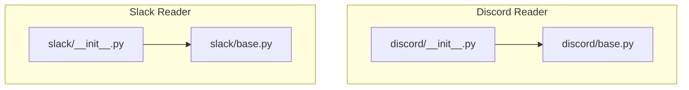
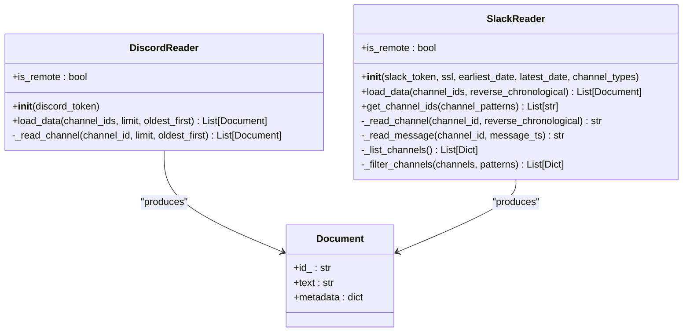
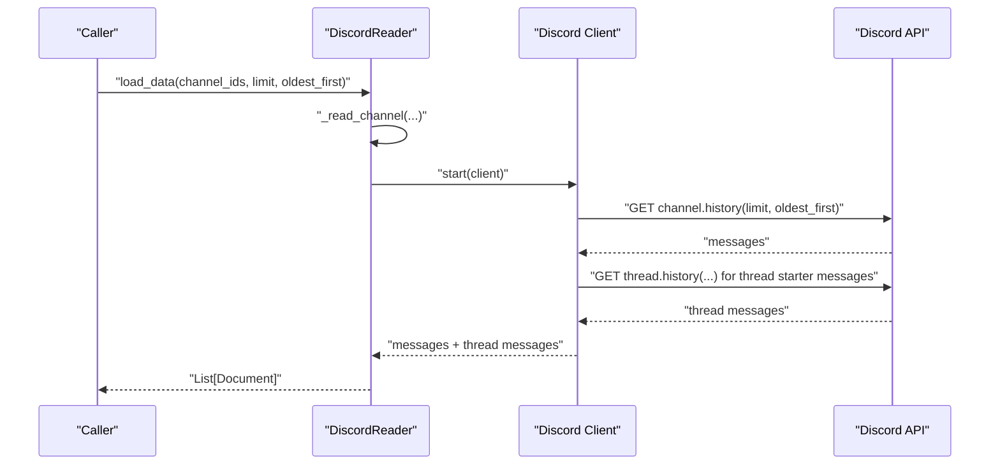
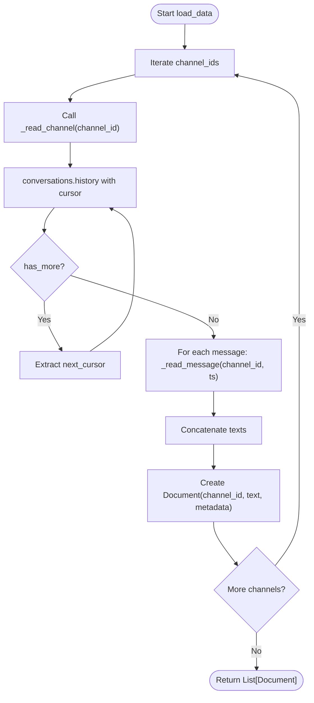
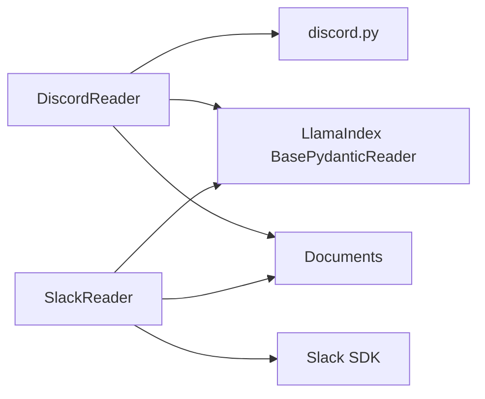

# Communication Platforms

<cite>
**Referenced Files in This Document**
- [discord/base.py](file://llama-index-integrations/readers/llama-index-readers-discord/llama_index/readers/discord/base.py)
- [discord/__init__.py](file://llama-index-integrations/readers/llama-index-readers-discord/llama_index/readers/discord/__init__.py)
- [discord/README.md](file://llama-index-integrations/readers/llama-index-readers-discord/README.md)
- [slack/base.py](file://llama-index-integrations/readers/llama-index-readers-slack/llama_index/readers/slack/base.py)
- [slack/__init__.py](file://llama-index-integrations/readers/llama-index-readers-slack/llama_index/readers/slack/__init__.py)
- [slack/README.md](file://llama-index-integrations/readers/llama-index-readers-slack/README.md)
- [slack tests](file://llama-index-integrations/readers/llama-index-readers-slack/tests/test_readers_slack.py)
- [discord tests](file://llama-index-integrations/readers/llama-index-readers-discord/tests/test_readers_discord_reader.py)
</cite>

## Table of Contents
1. [Introduction](#introduction)
2. [Project Structure](#project-structure)
3. [Core Components](#core-components)
4. [Architecture Overview](#architecture-overview)
5. [Detailed Component Analysis](#detailed-component-analysis)
6. [Dependency Analysis](#dependency-analysis)
7. [Performance Considerations](#performance-considerations)
8. [Troubleshooting Guide](#troubleshooting-guide)
9. [Conclusion](#conclusion)
10. [Appendices](#appendices)

## Introduction
This document explains the communication platform connectors for Slack and Discord within LlamaIndex. It focuses on how to ingest messages and threads from these platforms, configure authentication, filter channels, handle pagination and rate limits, and integrate with downstream RAG pipelines. It also outlines practical usage patterns for monitoring team discussions, extracting project updates, processing attachments, and building chatbot integrations.

## Project Structure
The Slack and Discord readers live under the integrations package as separate reader modules. Each module exposes a single primary class that implements the LlamaIndex reader interface and integrates with the respective platform SDK.

**Diagram sources**
- [discord/__init__.py](file://llama-index-integrations/readers/llama-index-readers-discord/llama_index/readers/discord/__init__.py#L1-L4)
- [discord/base.py](file://llama-index-integrations/readers/llama-index-readers-discord/llama_index/readers/discord/base.py#L1-L176)
- [slack/__init__.py](file://llama-index-integrations/readers/llama-index-readers-slack/llama_index/readers/slack/__init__.py#L1-L4)
- [slack/base.py](file://llama-index-integrations/readers/llama-index-readers-slack/llama_index/readers/slack/base.py#L1-L338)

**Section sources**
- [discord/__init__.py](file://llama-index-integrations/readers/llama-index-readers-discord/llama_index/readers/discord/__init__.py#L1-L4)
- [slack/__init__.py](file://llama-index-integrations/readers/llama-index-readers-slack/llama_index/readers/slack/__init__.py#L1-L4)

## Core Components
- DiscordReader: Loads messages from Discord channels and threads. Supports token-based authentication and returns Documents with message metadata.
- SlackReader: Loads messages from Slack channels, supports date-range filtering, pagination, and channel filtering by exact names or regex patterns. Provides rate-limit handling and “not in channel” protection.

Key capabilities:
- Authentication via tokens (environment variables or constructor parameters)
- Message history retrieval with pagination
- Thread-aware message aggregation (Discord)
- Channel filtering (Slack)
- Rate limiting and transient error handling
- Metadata enrichment (author, timestamps, IDs)

**Section sources**
- [discord/base.py](file://llama-index-integrations/readers/llama-index-readers-discord/llama_index/readers/discord/base.py#L90-L176)
- [slack/base.py](file://llama-index-integrations/readers/llama-index-readers-slack/llama_index/readers/slack/base.py#L19-L338)

## Architecture Overview
Both readers implement a common reader interface and wrap around their platform SDKs. They transform platform-specific message objects into LlamaIndex Documents.

**Diagram sources**
- [discord/base.py](file://llama-index-integrations/readers/llama-index-readers-discord/llama_index/readers/discord/base.py#L90-L176)
- [slack/base.py](file://llama-index-integrations/readers/llama-index-readers-slack/llama_index/readers/slack/base.py#L19-L338)

## Detailed Component Analysis

### Discord Reader
- Purpose: Fetch messages from Discord channels and threads.
- Authentication: Accepts a token via constructor or DISCORD_TOKEN environment variable.
- Behavior:
  - Connects to Discord using a minimal client with message content intent.
  - Iterates channel history up to a limit and oldest-first ordering.
  - Detects threads originating from initial messages and fetches their histories.
  - Wraps each message into a Document with message ID, author, creation/edit timestamps, and content.
- Usage notes:
  - Only text channels are supported in current implementation.
  - Requires installation of the discord.py package.

**Diagram sources**
- [discord/base.py](file://llama-index-integrations/readers/llama-index-readers-discord/llama_index/readers/discord/base.py#L20-L87)

**Section sources**
- [discord/base.py](file://llama-index-integrations/readers/llama-index-readers-discord/llama_index/readers/discord/base.py#L90-L176)
- [discord/README.md](file://llama-index-integrations/readers/llama-index-readers-discord/README.md#L1-L26)

### Slack Reader
- Purpose: Fetch messages from Slack channels with robust pagination and optional date filters.
- Authentication: Accepts a token via constructor or SLACK_BOT_TOKEN environment variable.
- Filtering:
  - Channel listing supports filtering by channel types (defaults to public and private channels).
  - Channel IDs can be resolved from exact names or regex patterns.
- Pagination:
  - Uses cursors to iterate conversations.history and conversations.replies.
- Rate limiting and errors:
  - Detects rate limit errors and sleeps for the suggested duration.
  - Handles “not in channel” errors gracefully.
- Output:
  - Returns a single concatenated text per channel plus metadata indicating the channel ID.

**Diagram sources**
- [slack/base.py](file://llama-index-integrations/readers/llama-index-readers-slack/llama_index/readers/slack/base.py#L160-L221)

**Section sources**
- [slack/base.py](file://llama-index-integrations/readers/llama-index-readers-slack/llama_index/readers/slack/base.py#L19-L338)
- [slack/README.md](file://llama-index-integrations/readers/llama-index-readers-slack/README.md#L1-L40)

## Dependency Analysis
- DiscordReader depends on the discord.py library and requires message content intent.
- SlackReader depends on the Slack SDK and performs API calls to conversations.history, conversations.replies, and conversations.list.
- Both readers depend on the LlamaIndex reader base class and produce Documents for downstream use.

**Diagram sources**
- [discord/base.py](file://llama-index-integrations/readers/llama-index-readers-discord/llama_index/readers/discord/base.py#L108-L121)
- [slack/base.py](file://llama-index-integrations/readers/llama-index-readers-slack/llama_index/readers/slack/base.py#L59-L98)

**Section sources**
- [discord/base.py](file://llama-index-integrations/readers/llama-index-readers-discord/llama_index/readers/discord/base.py#L108-L121)
- [slack/base.py](file://llama-index-integrations/readers/llama-index-readers-slack/llama_index/readers/slack/base.py#L59-L98)

## Performance Considerations
- Pagination: Both readers use cursor-based pagination to handle large histories. Slack’s default page size is 100; expect multiple requests for long histories.
- Rate limiting: Slack reader detects rate limit headers and retries after the indicated interval. Plan polling intervals accordingly.
- Message volume: Large channels and thread-heavy conversations increase API calls. Consider narrowing by date ranges and channel filtering.
- Memory: Slack reader concatenates all messages into a single text per channel; consider chunking downstream if needed.

[No sources needed since this section provides general guidance]

## Troubleshooting Guide
Common issues and resolutions:
- Authentication failures:
  - Ensure the appropriate environment variable is set or passed to the constructor.
  - Verify the token has required scopes/intents (message content for Discord; bot scopes for Slack).
- “Not in channel” errors (Slack):
  - Add the bot to the target private channels or adjust channel types and filtering.
- Rate limit exceeded (Slack):
  - The reader automatically sleeps and retries. Consider reducing request frequency or batching.
- Wrong channel type (Discord):
  - Only text channels are supported; thread starter messages are included but threads themselves are not fetched independently.
- Channel filtering yields empty results (Slack):
  - Confirm channel names and regex patterns match actual channel names.

**Section sources**
- [slack/base.py](file://llama-index-integrations/readers/llama-index-readers-slack/llama_index/readers/slack/base.py#L139-L156)
- [slack/base.py](file://llama-index-integrations/readers/llama-index-readers-slack/llama_index/readers/slack/base.py#L200-L215)
- [discord/base.py](file://llama-index-integrations/readers/llama-index-readers-discord/llama_index/readers/discord/base.py#L44-L48)

## Conclusion
The Slack and Discord readers provide straightforward ingestion of team communications into LlamaIndex. They support essential features like pagination, rate-limit handling, channel filtering, and thread-aware message collection. With proper authentication and channel configuration, they enable practical use cases such as monitoring discussions, extracting updates, and powering chatbot integrations.

[No sources needed since this section summarizes without analyzing specific files]

## Appendices

### Practical Usage Patterns
- Monitoring team discussions:
  - Use SlackReader with date windows to continuously poll recent activity and feed a RAG index.
- Extracting project updates:
  - Filter channels by regex patterns and concatenate messages to build a timeline of updates.
- Processing file attachments:
  - The current readers focus on text content. For file attachments, consider downstream parsers or external integrations to extract text from uploaded files.
- Chatbot integrations:
  - Combine reader outputs with a query engine to power contextual chatbots over recent messages.

[No sources needed since this section provides general guidance]

### Enterprise and Compliance Notes
- Multi-team environments:
  - Slack: Use distinct credentials per workspace or manage tokens securely. Limit channel types to reduce scope.
  - Discord: Manage separate bots per server and restrict token scopes.
- Private channel access:
  - Ensure bots are invited to private channels or adjust channel types and filtering to include private channels.
- Compliance:
  - Respect privacy and retention policies. Consider anonymizing or redacting sensitive information before indexing.

[No sources needed since this section provides general guidance]