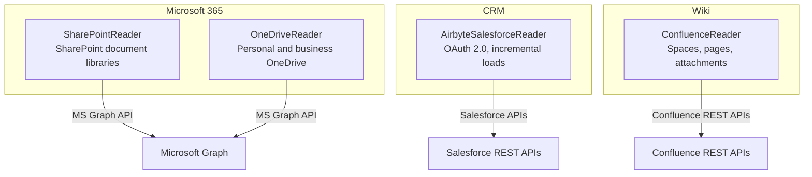
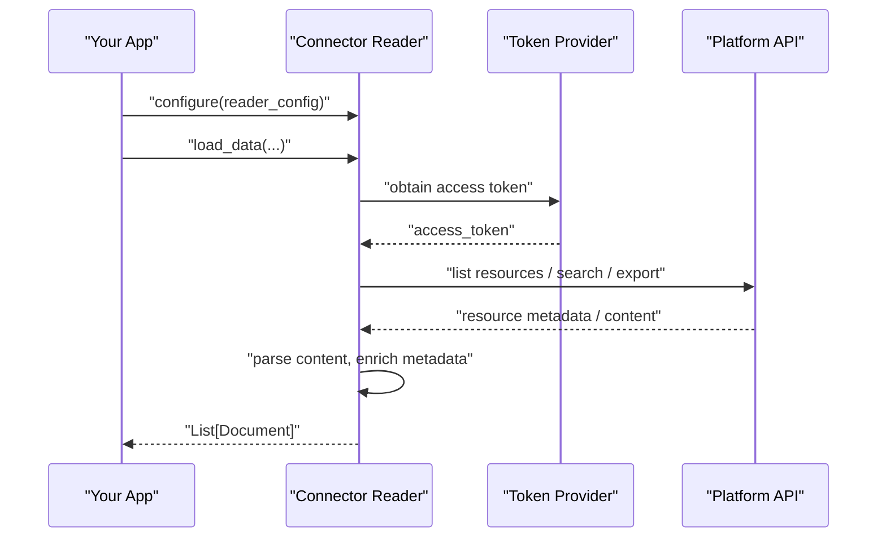
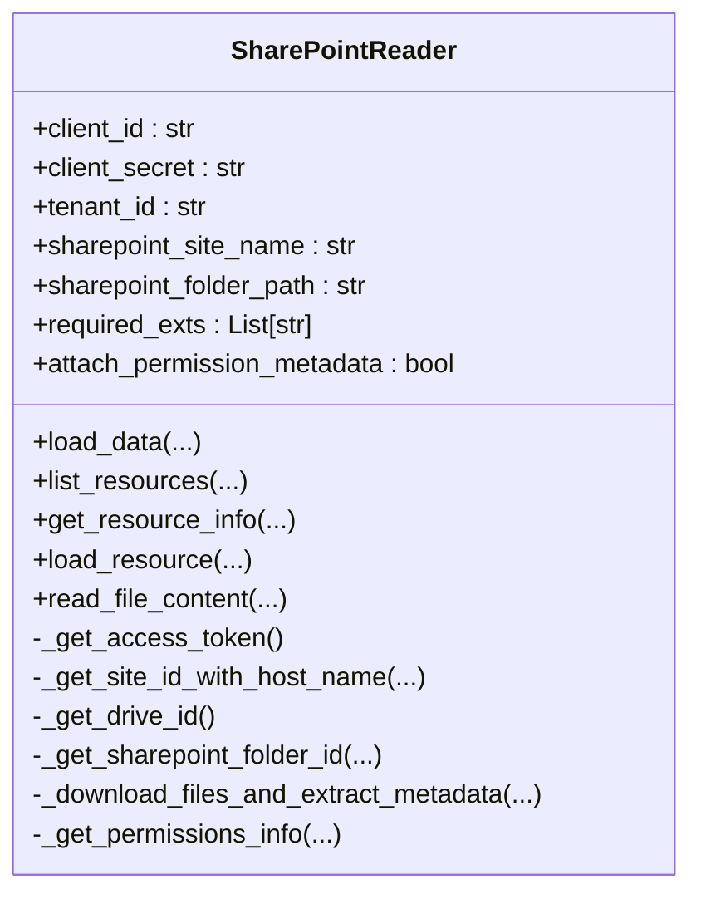
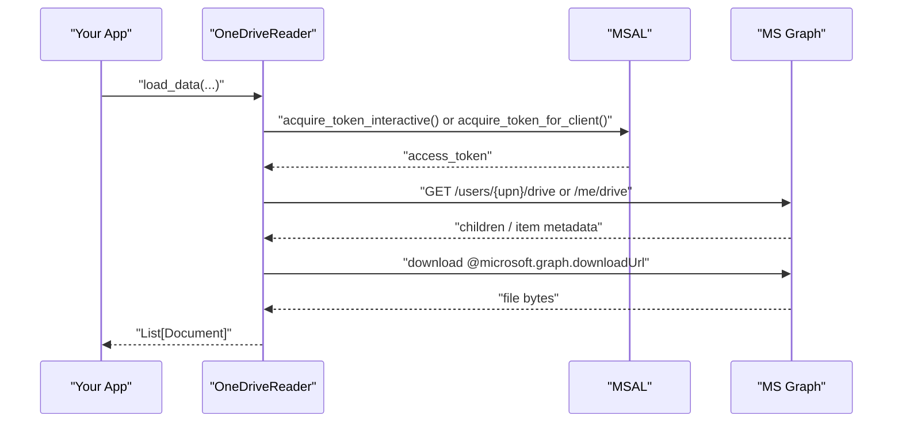
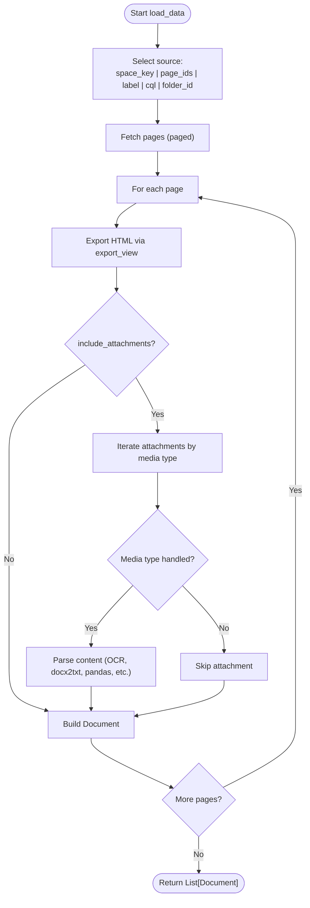
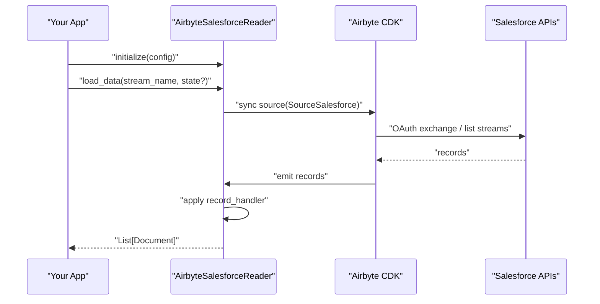
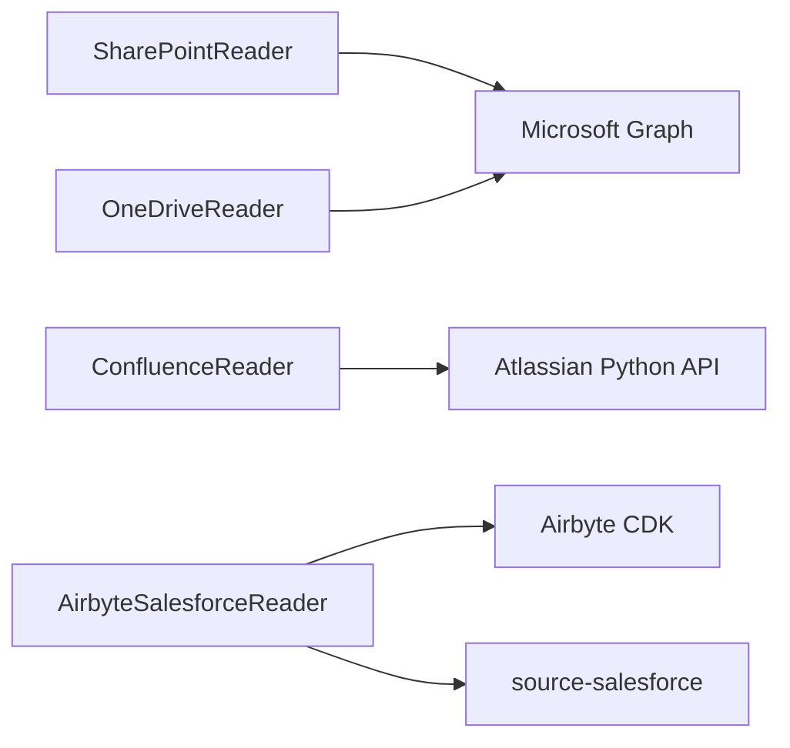

# Enterprise Platforms

<cite>
**Referenced Files in This Document**
- [base.py](file://llama-index-integrations/readers/llama-index-readers-microsoft-sharepoint/llama_index/readers/microsoft_sharepoint/base.py)
- [__init__.py](file://llama-index-integrations/readers/llama-index-readers-microsoft-sharepoint/llama_index/readers/microsoft_sharepoint/__init__.py)
- [base.py](file://llama-index-integrations/readers/llama-index-readers-microsoft-onedrive/llama_index/readers/microsoft_onedrive/base.py)
- [__init__.py](file://llama-index-integrations/readers/llama-index-readers-microsoft-onedrive/llama_index/readers/microsoft_onedrive/__init__.py)
- [base.py](file://llama-index-integrations/readers/llama-index-readers-confluence/llama_index/readers/confluence/base.py)
- [__init__.py](file://llama-index-integrations/readers/llama-index-readers-confluence/llama_index/readers/confluence/__init__.py)
- [base.py](file://llama-index-integrations/readers/llama-index-readers-airbyte-salesforce/llama_index/readers/airbyte_salesforce/base.py)
- [README.md](file://llama-index-integrations/readers/llama-index-readers-airbyte-salesforce/README.md)
</cite>

## Table of Contents
1. [Introduction](#introduction)
2. [Project Structure](#project-structure)
3. [Core Components](#core-components)
4. [Architecture Overview](#architecture-overview)
5. [Detailed Component Analysis](#detailed-component-analysis)
6. [Dependency Analysis](#dependency-analysis)
7. [Performance Considerations](#performance-considerations)
8. [Troubleshooting Guide](#troubleshooting-guide)
9. [Conclusion](#conclusion)
10. [Appendices](#appendices)

## Introduction
This document describes enterprise platform connectors in LlamaIndex with a focus on Microsoft 365 (SharePoint document libraries, OneDrive, Exchange/Outlook mailboxes via SharePoint), Salesforce CRM, and Atlassian Confluence. It explains authentication flows, supported capabilities, and operational patterns for enterprise-grade ingestion, compliance, and cross-platform content synchronization. It also covers multi-tenant considerations, delegated access patterns, and integration with enterprise identity systems.

## Project Structure
The enterprise connectors are implemented as reader modules under the LlamaIndex integrations package. Each connector encapsulates authentication, resource discovery, content extraction, and document creation.

**Diagram sources**
- [base.py](file://llama-index-integrations/readers/llama-index-readers-microsoft-sharepoint/llama_index/readers/microsoft_sharepoint/base.py#L100-L136)
- [base.py](file://llama-index-integrations/readers/llama-index-readers-microsoft-onedrive/llama_index/readers/microsoft_onedrive/base.py#L112-L151)
- [base.py](file://llama-index-integrations/readers/llama-index-readers-airbyte-salesforce/llama_index/readers/airbyte_salesforce/base.py#L6-L30)
- [base.py](file://llama-index-integrations/readers/llama-index-readers-confluence/llama_index/readers/confluence/base.py#L173-L226)

**Section sources**
- [base.py](file://llama-index-integrations/readers/llama-index-readers-microsoft-sharepoint/llama_index/readers/microsoft_sharepoint/base.py#L23-L62)
- [base.py](file://llama-index-integrations/readers/llama-index-readers-microsoft-onedrive/llama_index/readers/microsoft_onedrive/base.py#L34-L76)
- [base.py](file://llama-index-integrations/readers/llama-index-readers-confluence/llama_index/readers/confluence/base.py#L75-L129)
- [base.py](file://llama-index-integrations/readers/llama-index-readers-airbyte-salesforce/llama_index/readers/airbyte_salesforce/base.py#L6-L30)

## Core Components
- SharePointReader: Reads SharePoint document libraries via Microsoft Graph, supporting site/drive selection, folder traversal, and optional permission metadata attachment.
- OneDriveReader: Reads OneDrive content via Microsoft Graph, supporting both interactive and app (client credential) flows, with permission retrieval and MIME-type filtering.
- ConfluenceReader: Reads Confluence spaces/pages and attachments, supporting OAuth 2.0, basic auth, API tokens, and cookies, with pluggable custom parsers and event instrumentation.
- AirbyteSalesforceReader: Loads Salesforce objects via the Airbyte CDK, supporting OAuth 2.0 with refresh tokens, incremental loads, and configurable record handling.

**Section sources**
- [base.py](file://llama-index-integrations/readers/llama-index-readers-microsoft-sharepoint/llama_index/readers/microsoft_sharepoint/base.py#L23-L98)
- [base.py](file://llama-index-integrations/readers/llama-index-readers-microsoft-onedrive/llama_index/readers/microsoft_onedrive/base.py#L34-L111)
- [base.py](file://llama-index-integrations/readers/llama-index-readers-confluence/llama_index/readers/confluence/base.py#L75-L149)
- [base.py](file://llama-index-integrations/readers/llama-index-readers-airbyte-salesforce/llama_index/readers/airbyte_salesforce/base.py#L6-L30)

## Architecture Overview
The connectors follow a consistent pattern:
- Authentication: Obtain an access token using platform-specific flows (OAuth 2.0, client credentials, or API tokens).
- Resource Discovery: Query platform APIs to enumerate sites, drives, spaces, pages, or objects.
- Content Extraction: Download content (files or export views), apply parsers, and build Documents.
- Metadata Enrichment: Attach permission and provenance metadata to support governance and compliance.

**Diagram sources**
- [base.py](file://llama-index-integrations/readers/llama-index-readers-microsoft-sharepoint/llama_index/readers/microsoft_sharepoint/base.py#L100-L136)
- [base.py](file://llama-index-integrations/readers/llama-index-readers-microsoft-onedrive/llama_index/readers/microsoft_onedrive/base.py#L112-L151)
- [base.py](file://llama-index-integrations/readers/llama-index-readers-confluence/llama_index/readers/confluence/base.py#L173-L226)
- [base.py](file://llama-index-integrations/readers/llama-index-readers-airbyte-salesforce/llama_index/readers/airbyte_salesforce/base.py#L23-L29)

## Detailed Component Analysis

### SharePoint Connector
- Authentication: Uses client credentials grant against Microsoft identity to obtain an access token for Microsoft Graph.
- Resource Discovery: Resolves site ID by name or ID, discovers drive ID, enumerates folder contents recursively, and lists resources.
- Content Extraction: Downloads files via download URLs, applies file extractors, and builds Documents.
- Permissions: Optionally attaches permission metadata derived from item permissions endpoints.
- Delegated Access: Supports site-level and drive-level targeting; folder path or ID selection.

**Diagram sources**
- [base.py](file://llama-index-integrations/readers/llama-index-readers-microsoft-sharepoint/llama_index/readers/microsoft_sharepoint/base.py#L23-L98)
- [base.py](file://llama-index-integrations/readers/llama-index-readers-microsoft-sharepoint/llama_index/readers/microsoft_sharepoint/base.py#L584-L634)

**Section sources**
- [base.py](file://llama-index-integrations/readers/llama-index-readers-microsoft-sharepoint/llama_index/readers/microsoft_sharepoint/base.py#L100-L136)
- [base.py](file://llama-index-integrations/readers/llama-index-readers-microsoft-sharepoint/llama_index/readers/microsoft_sharepoint/base.py#L172-L276)
- [base.py](file://llama-index-integrations/readers/llama-index-readers-microsoft-sharepoint/llama_index/readers/microsoft_sharepoint/base.py#L301-L485)
- [base.py](file://llama-index-integrations/readers/llama-index-readers-microsoft-sharepoint/llama_index/readers/microsoft_sharepoint/base.py#L487-L582)
- [base.py](file://llama-index-integrations/readers/llama-index-readers-microsoft-sharepoint/llama_index/readers/microsoft_sharepoint/base.py#L702-L769)
- [base.py](file://llama-index-integrations/readers/llama-index-readers-microsoft-sharepoint/llama_index/readers/microsoft_sharepoint/base.py#L809-L841)

### OneDrive Connector
- Authentication: Supports interactive public client flow and app (confidential client) credential flow against Microsoft identity.
- Resource Discovery: Resolves drive endpoints for a user principal, lists folder contents, and supports root, folder ID, folder path, or file path selection.
- Content Extraction: Downloads files via download URLs, applies file extractors, and builds Documents.
- Permissions: Retrieves and attaches permission metadata for items.
- Multi-tenant: Supports consumer tenant ID for personal accounts; business scenarios require org-provided UPN and tenant context.

**Diagram sources**
- [base.py](file://llama-index-integrations/readers/llama-index-readers-microsoft-onedrive/llama_index/readers/microsoft_onedrive/base.py#L112-L151)
- [base.py](file://llama-index-integrations/readers/llama-index-readers-microsoft-onedrive/llama_index/readers/microsoft_onedrive/base.py#L152-L198)
- [base.py](file://llama-index-integrations/readers/llama-index-readers-microsoft-onedrive/llama_index/readers/microsoft_onedrive/base.py#L200-L252)
- [base.py](file://llama-index-integrations/readers/llama-index-readers-microsoft-onedrive/llama_index/readers/microsoft_onedrive/base.py#L254-L280)
- [base.py](file://llama-index-integrations/readers/llama-index-readers-microsoft-onedrive/llama_index/readers/microsoft_onedrive/base.py#L378-L447)
- [base.py](file://llama-index-integrations/readers/llama-index-readers-microsoft-onedrive/llama_index/readers/microsoft_onedrive/base.py#L448-L553)
- [base.py](file://llama-index-integrations/readers/llama-index-readers-microsoft-onedrive/llama_index/readers/microsoft_onedrive/base.py#L630-L677)
- [base.py](file://llama-index-integrations/readers/llama-index-readers-microsoft-onedrive/llama_index/readers/microsoft_onedrive/base.py#L678-L757)

**Section sources**
- [base.py](file://llama-index-integrations/readers/llama-index-readers-microsoft-onedrive/llama_index/readers/microsoft_onedrive/base.py#L34-L111)
- [base.py](file://llama-index-integrations/readers/llama-index-readers-microsoft-onedrive/llama_index/readers/microsoft_onedrive/base.py#L112-L151)
- [base.py](file://llama-index-integrations/readers/llama-index-readers-microsoft-onedrive/llama_index/readers/microsoft_onedrive/base.py#L630-L677)
- [base.py](file://llama-index-integrations/readers/llama-index-readers-microsoft-onedrive/llama_index/readers/microsoft_onedrive/base.py#L758-L863)

### Confluence Connector
- Authentication: Supports OAuth 2.0, API token, cookies, or basic auth; integrates with the Atlassian Python API.
- Resource Discovery: Enumerates pages by space key, page IDs, label, CQL, or folder ID; supports DFS traversal for children.
- Content Extraction: Converts export view HTML to text and processes attachments by media type (PDF, images, Word, Excel, PowerPoint, CSV, MSG, HTML, TXT, SVG).
- Extensibility: Custom parsers per file type and temporary file handling; instrumentation events for observability.
- Compliance: Callback hooks to skip or process pages/attachments selectively.

**Diagram sources**
- [base.py](file://llama-index-integrations/readers/llama-index-readers-confluence/llama_index/readers/confluence/base.py#L240-L421)
- [base.py](file://llama-index-integrations/readers/llama-index-readers-confluence/llama_index/readers/confluence/base.py#L549-L616)
- [base.py](file://llama-index-integrations/readers/llama-index-readers-confluence/llama_index/readers/confluence/base.py#L617-L802)
- [base.py](file://llama-index-integrations/readers/llama-index-readers-confluence/llama_index/readers/confluence/base.py#L804-L1185)

**Section sources**
- [base.py](file://llama-index-integrations/readers/llama-index-readers-confluence/llama_index/readers/confluence/base.py#L75-L149)
- [base.py](file://llama-index-integrations/readers/llama-index-readers-confluence/llama_index/readers/confluence/base.py#L240-L421)
- [base.py](file://llama-index-integrations/readers/llama-index-readers-confluence/llama_index/readers/confluence/base.py#L617-L802)
- [base.py](file://llama-index-integrations/readers/llama-index-readers-confluence/llama_index/readers/confluence/base.py#L804-L1185)

### Salesforce Connector (Airbyte)
- Authentication: OAuth 2.0 with client credentials and refresh token; supports sandbox environments.
- Streams: Configurable by name or pattern; supports incremental loads with state persistence.
- Record Handling: Pluggable record handler to customize document text and metadata.

**Diagram sources**
- [base.py](file://llama-index-integrations/readers/llama-index-readers-airbyte-salesforce/llama_index/readers/airbyte_salesforce/base.py#L6-L30)
- [README.md](file://llama-index-integrations/readers/llama-index-readers-airbyte-salesforce/README.md#L30-L46)
- [README.md](file://llama-index-integrations/readers/llama-index-readers-airbyte-salesforce/README.md#L66-L78)

**Section sources**
- [base.py](file://llama-index-integrations/readers/llama-index-readers-airbyte-salesforce/llama_index/readers/airbyte_salesforce/base.py#L6-L30)
- [README.md](file://llama-index-integrations/readers/llama-index-readers-airbyte-salesforce/README.md#L30-L46)
- [README.md](file://llama-index-integrations/readers/llama-index-readers-airbyte-salesforce/README.md#L66-L78)

## Dependency Analysis
- Microsoft Graph: SharePointReader and OneDriveReader depend on Microsoft Graph endpoints for site/drive enumeration, item metadata, and download URLs.
- Atlassian Confluence: ConfluenceReader depends on the Atlassian Python API for REST calls and export views.
- Salesforce: AirbyteSalesforceReader depends on the Airbyte CDK and the source-salesforce connector for OAuth and incremental sync.
- Parsing Dependencies: ConfluenceReader relies on optional packages for OCR, image processing, office formats, and CSV parsing.

**Diagram sources**
- [base.py](file://llama-index-integrations/readers/llama-index-readers-microsoft-sharepoint/llama_index/readers/microsoft_sharepoint/base.py#L199-L202)
- [base.py](file://llama-index-integrations/readers/llama-index-readers-microsoft-onedrive/llama_index/readers/microsoft_onedrive/base.py#L179-L195)
- [base.py](file://llama-index-integrations/readers/llama-index-readers-confluence/llama_index/readers/confluence/base.py#L173-L226)
- [base.py](file://llama-index-integrations/readers/llama-index-readers-airbyte-salesforce/llama_index/readers/airbyte_salesforce/base.py#L23-L29)

**Section sources**
- [base.py](file://llama-index-integrations/readers/llama-index-readers-microsoft-sharepoint/llama_index/readers/microsoft_sharepoint/base.py#L100-L136)
- [base.py](file://llama-index-integrations/readers/llama-index-readers-microsoft-onedrive/llama_index/readers/microsoft_onedrive/base.py#L112-L151)
- [base.py](file://llama-index-integrations/readers/llama-index-readers-confluence/llama_index/readers/confluence/base.py#L173-L226)
- [base.py](file://llama-index-integrations/readers/llama-index-readers-airbyte-salesforce/llama_index/readers/airbyte_salesforce/base.py#L23-L29)

## Performance Considerations
- Pagination and Batching: ConfluenceReader uses paged retrieval and batching to manage large result sets.
- Retry and Backoff: OneDriveReader implements retry with exponential backoff for rate-limit and server errors.
- Temporary Storage: SharePointReader and OneDriveReader use temporary directories to stage downloads before parsing.
- Incremental Loads: AirbyteSalesforceReader supports incremental loads to minimize repeated work.
- Permission Metadata: Attaching permission metadata adds API calls; disable when not needed or when metadata schema does not support nested fields.

[No sources needed since this section provides general guidance]

## Troubleshooting Guide
- SharePoint
  - Missing permissions: Ensure the app registration has the required Microsoft Graph permissions and admin consent where applicable.
  - Site/drive resolution: Verify site name or ID and folder path; the reader raises explicit errors if not found.
  - Token expiry: The reader refreshes tokens automatically on 401 responses.

- OneDrive
  - Interactive vs app flow: Interactive requires a redirect URI; app flow requires client secret and user principal name.
  - Rate limiting: Expect 429/5xx responses; the reader retries with backoff.

- Confluence
  - Authentication precedence: OAuth, API token, cookies, or basic auth; environment variables are supported.
  - Unsupported attachments: Media types not handled are skipped with logs; add custom parsers if needed.

- Salesforce
  - OAuth configuration: Ensure client ID, client secret, refresh token, and date range are correctly set.
  - Incremental loads: Persist and reuse state to avoid reprocessing unchanged records.

**Section sources**
- [base.py](file://llama-index-integrations/readers/llama-index-readers-microsoft-sharepoint/llama_index/readers/microsoft_sharepoint/base.py#L137-L163)
- [base.py](file://llama-index-integrations/readers/llama-index-readers-microsoft-onedrive/llama_index/readers/microsoft_onedrive/base.py#L112-L151)
- [base.py](file://llama-index-integrations/readers/llama-index-readers-microsoft-onedrive/llama_index/readers/microsoft_onedrive/base.py#L234-L252)
- [base.py](file://llama-index-integrations/readers/llama-index-readers-confluence/llama_index/readers/confluence/base.py#L173-L226)
- [README.md](file://llama-index-integrations/readers/llama-index-readers-airbyte-salesforce/README.md#L30-L46)
- [README.md](file://llama-index-integrations/readers/llama-index-readers-airbyte-salesforce/README.md#L66-L78)

## Conclusion
These enterprise connectors provide robust, production-ready pathways to ingest content from Microsoft 365, Salesforce, and Confluence. They support secure authentication, scalable discovery, flexible parsing, and governance-aware metadata. For compliance and cross-platform synchronization, combine connector outputs with LlamaIndex indexing and retrieval pipelines, and leverage incremental loads and permission metadata to meet enterprise requirements.

[No sources needed since this section summarizes without analyzing specific files]

## Appendices

### Authentication and Identity Integration Notes
- Microsoft 365
  - Tenant authentication: Use tenant-scoped app registrations with appropriate Microsoft Graph permissions.
  - Delegated access: Use app-only flows for service accounts; interactive flows for user-driven scenarios.
  - Identity systems: Integrate with enterprise identity providers via Microsoft Entra ID (Azure AD) and conditional access policies.

- Confluence
  - OAuth 2.0: Configure client credentials and scopes; use the Atlassian Python API’s OAuth support.
  - Basic auth/API token: Supported for backward compatibility; prefer OAuth in modern deployments.

- Salesforce
  - OAuth 2.0: Use refresh tokens for long-lived access; sandbox environments supported.
  - Incremental loads: Use state to track last sync and reduce API usage.

**Section sources**
- [base.py](file://llama-index-integrations/readers/llama-index-readers-microsoft-sharepoint/llama_index/readers/microsoft_sharepoint/base.py#L30-L46)
- [base.py](file://llama-index-integrations/readers/llama-index-readers-microsoft-onedrive/llama_index/readers/microsoft_onedrive/base.py#L40-L61)
- [base.py](file://llama-index-integrations/readers/llama-index-readers-confluence/llama_index/readers/confluence/base.py#L85-L98)
- [README.md](file://llama-index-integrations/readers/llama-index-readers-airbyte-salesforce/README.md#L30-L46)

### Example Workflows
- Enterprise data aggregation
  - Use SharePointReader to crawl document libraries, OneDriveReader to pull personal/business files, ConfluenceReader to extract wiki content, and AirbyteSalesforceReader to load CRM objects. Combine outputs into a unified index.

- Compliance data extraction
  - Enable permission metadata attachment in SharePointReader and OneDriveReader to tag Documents with allowed identities. Apply record_handler in AirbyteSalesforceReader to include audit-relevant fields.

- Cross-platform content synchronization
  - Use incremental loads in AirbyteSalesforceReader and pagination/backoff in ConfluenceReader to align ingestion cadence with upstream changes. Store state to resume from last sync.

[No sources needed since this section provides general guidance]