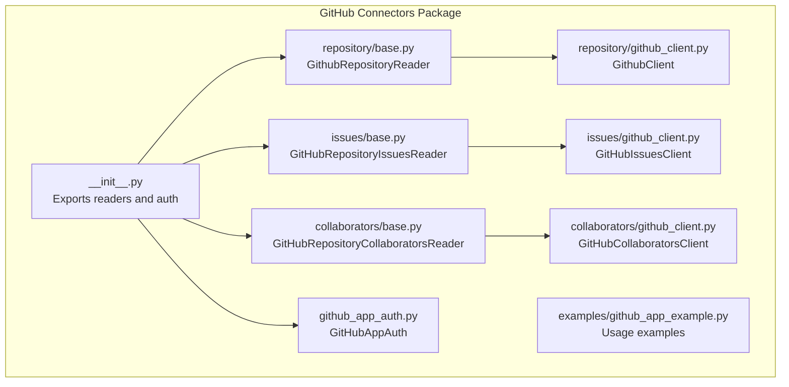
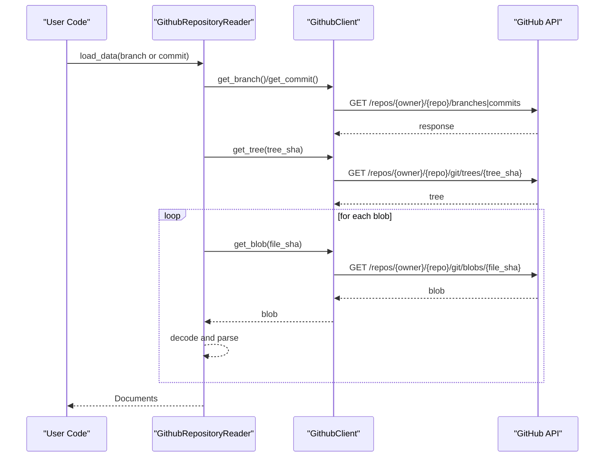
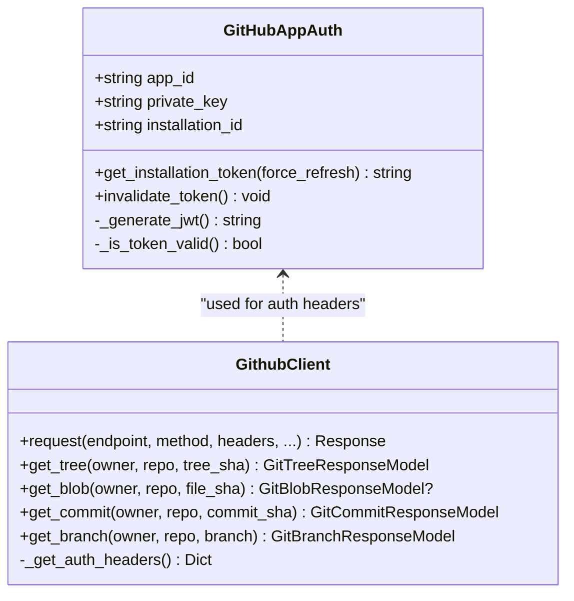
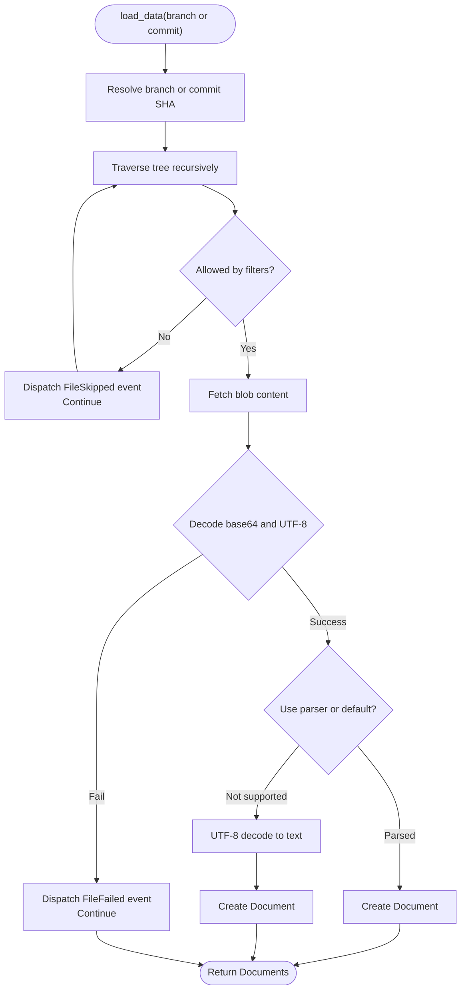
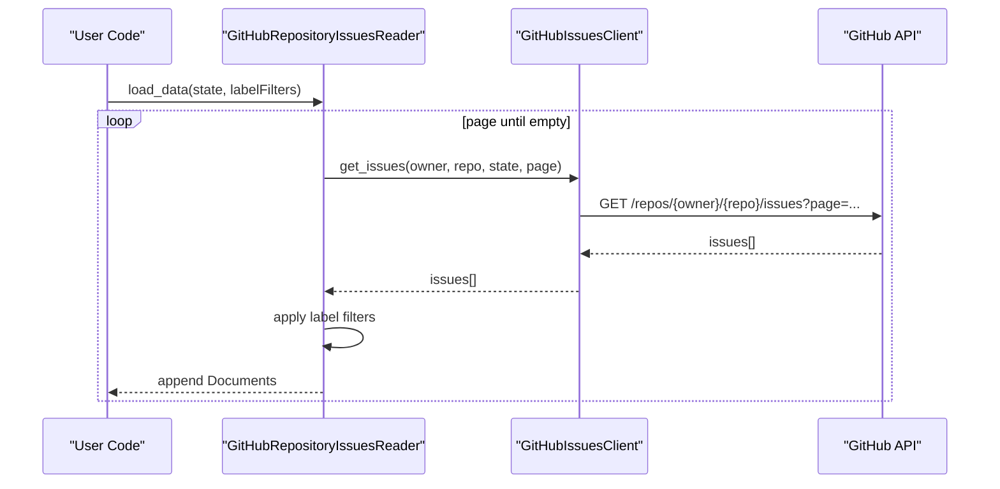
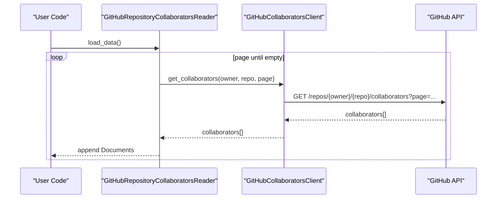
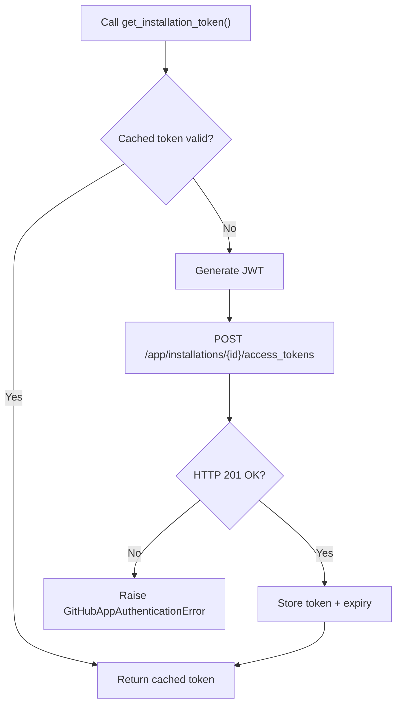
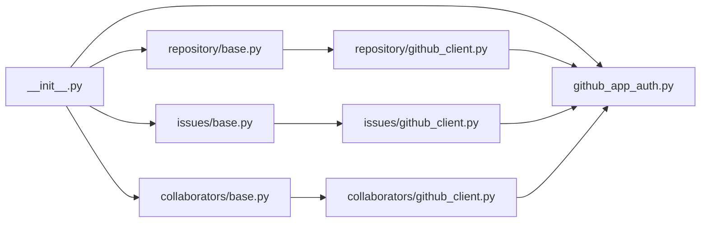

# GitHub Connectors

<cite>
**Referenced Files in This Document**
- [README.md](file://llama-index-integrations/readers/llama-index-readers-github/README.md)
- [__init__.py](file://llama-index-integrations/readers/llama-index-readers-github/llama_index/readers/github/__init__.py)
- [github_client.py](file://llama-index-integrations/readers/llama-index-readers-github/llama_index/readers/github/repository/github_client.py)
- [base.py](file://llama-index-integrations/readers/llama-index-readers-github/llama_index/readers/github/repository/base.py)
- [github_client.py](file://llama-index-integrations/readers/llama-index-readers-github/llama_index/readers/github/issues/github_client.py)
- [base.py](file://llama-index-integrations/readers/llama-index-readers-github/llama_index/readers/github/issues/base.py)
- [github_client.py](file://llama-index-integrations/readers/llama-index-readers-github/llama_index/readers/github/collaborators/github_client.py)
- [base.py](file://llama-index-integrations/readers/llama-index-readers-github/llama_index/readers/github/collaborators/base.py)
- [github_app_auth.py](file://llama-index-integrations/readers/llama-index-readers-github/llama_index/readers/github/github_app_auth.py)
- [github_app_example.py](file://llama-index-integrations/readers/llama-index-readers-github/examples/github_app_example.py)
</cite>

## Table of Contents
1. [Introduction](#introduction)
2. [Project Structure](#project-structure)
3. [Core Components](#core-components)
4. [Architecture Overview](#architecture-overview)
5. [Detailed Component Analysis](#detailed-component-analysis)
6. [Dependency Analysis](#dependency-analysis)
7. [Performance Considerations](#performance-considerations)
8. [Troubleshooting Guide](#troubleshooting-guide)
9. [Conclusion](#conclusion)
10. [Appendices](#appendices)

## Introduction
This document explains the GitHub connectors in LlamaIndex that enable reading repositories, issues, collaborators, and related Git metadata from GitHub. It covers authentication methods (personal access tokens, fine-grained tokens, and app-based authentication), repository scanning patterns, branch and commit traversal, filtering options, pagination handling, rate-limit considerations, and practical usage scenarios such as monitoring repository activity, extracting code documentation, processing issue trackers, and integrating with CI/CD pipelines. Enterprise and organization access patterns for private repositories are addressed with security considerations.

## Project Structure
The GitHub connectors are implemented as a dedicated integration package with three primary readers:
- Repository Reader: traverses branches or commits, filters by directories/extensions/paths, decodes blobs, and optionally parses files into Documents.
- Issues Reader: lists issues and pull requests with label-based filtering and pagination.
- Collaborators Reader: enumerates repository collaborators with metadata.

Authentication is supported via:
- Personal Access Token (PAT) via environment variable or constructor parameter.
- GitHub App authentication with automatic JWT generation and installation access token caching.

**Diagram sources**
- [__init__.py](file://llama-index-integrations/readers/llama-index-readers-github/llama_index/readers/github/__init__.py#L1-L40)
- [base.py](file://llama-index-integrations/readers/llama-index-readers-github/llama_index/readers/github/repository/base.py#L52-L123)
- [github_client.py](file://llama-index-integrations/readers/llama-index-readers-github/llama_index/readers/github/repository/github_client.py#L206-L324)
- [base.py](file://llama-index-integrations/readers/llama-index-readers-github/llama_index/readers/github/issues/base.py#L43-L90)
- [github_client.py](file://llama-index-integrations/readers/llama-index-readers-github/llama_index/readers/github/issues/github_client.py#L35-L136)
- [base.py](file://llama-index-integrations/readers/llama-index-readers-github/llama_index/readers/github/collaborators/base.py#L42-L90)
- [github_client.py](file://llama-index-integrations/readers/llama-index-readers-github/llama_index/readers/github/collaborators/github_client.py#L34-L132)
- [github_app_auth.py](file://llama-index-integrations/readers/llama-index-readers-github/llama_index/readers/github/github_app_auth.py#L22-L102)
- [github_app_example.py](file://llama-index-integrations/readers/llama-index-readers-github/examples/github_app_example.py#L1-L180)

**Section sources**
- [README.md](file://llama-index-integrations/readers/llama-index-readers-github/README.md#L1-L67)
- [__init__.py](file://llama-index-integrations/readers/llama-index-readers-github/llama_index/readers/github/__init__.py#L1-L40)

## Core Components
- GithubClient: Asynchronous client for core Git API endpoints (trees, blobs, commits, branches) with PAT or GitHub App auth.
- GithubRepositoryReader: Traverses repository trees, applies filters, decodes blobs, and produces Documents (optionally parsed).
- GitHubIssuesClient and GitHubRepositoryIssuesReader: Paginate issues and PRs, apply state and label filters.
- GitHubCollaboratorsClient and GitHubRepositoryCollaboratorsReader: Enumerate collaborators with metadata.
- GitHubAppAuth: Manages JWT creation and installation access token lifecycle with caching and refresh.

Key capabilities:
- Authentication: PAT via constructor/environment; GitHub App via GitHubAppAuth.
- Scanning: Branch or commit traversal; recursive tree traversal; blob retrieval.
- Filtering: Directory inclusion/exclusion, file extension inclusion/exclusion, explicit file path inclusion/exclusion, and custom callbacks.
- Parsing: Optional file parsing via built-in readers; fallback to UTF-8 decoding.
- Pagination: Built-in pagination for issues and collaborators.
- Events: Instrumentation events for repository processing and file-level events.

**Section sources**
- [github_client.py](file://llama-index-integrations/readers/llama-index-readers-github/llama_index/readers/github/repository/github_client.py#L206-L324)
- [base.py](file://llama-index-integrations/readers/llama-index-readers-github/llama_index/readers/github/repository/base.py#L52-L123)
- [github_client.py](file://llama-index-integrations/readers/llama-index-readers-github/llama_index/readers/github/issues/github_client.py#L35-L136)
- [base.py](file://llama-index-integrations/readers/llama-index-readers-github/llama_index/readers/github/issues/base.py#L43-L90)
- [github_client.py](file://llama-index-integrations/readers/llama-index-readers-github/llama_index/readers/github/collaborators/github_client.py#L34-L132)
- [base.py](file://llama-index-integrations/readers/llama-index-readers-github/llama_index/readers/github/collaborators/base.py#L42-L90)
- [github_app_auth.py](file://llama-index-integrations/readers/llama-index-readers-github/llama_index/readers/github/github_app_auth.py#L22-L102)

## Architecture Overview
The connectors follow a layered design:
- Clients encapsulate HTTP interactions with GitHub APIs.
- Readers orchestrate traversal, filtering, and document generation.
- Authentication handlers manage token acquisition and caching.
- Instrumentation dispatches events for observability.

**Diagram sources**
- [base.py](file://llama-index-integrations/readers/llama-index-readers-github/llama_index/readers/github/repository/base.py#L438-L534)
- [github_client.py](file://llama-index-integrations/readers/llama-index-readers-github/llama_index/readers/github/repository/github_client.py#L411-L582)

## Detailed Component Analysis

### Authentication Methods
- Personal Access Token (PAT)
  - Provided via constructor parameter or GITHUB_TOKEN environment variable.
  - Used directly in Authorization header for clients.
- GitHub App Authentication
  - Uses GitHubAppAuth to generate JWTs and obtain installation access tokens.
  - Tokens are cached and refreshed automatically (with a safety buffer).
  - Supports manual invalidation and forced refresh.

**Diagram sources**
- [github_app_auth.py](file://llama-index-integrations/readers/llama-index-readers-github/llama_index/readers/github/github_app_auth.py#L22-L218)
- [github_client.py](file://llama-index-integrations/readers/llama-index-readers-github/llama_index/readers/github/repository/github_client.py#L206-L346)

**Section sources**
- [README.md](file://llama-index-integrations/readers/llama-index-readers-github/README.md#L11-L67)
- [github_app_auth.py](file://llama-index-integrations/readers/llama-index-readers-github/llama_index/readers/github/github_app_auth.py#L22-L102)
- [github_client.py](file://llama-index-integrations/readers/llama-index-readers-github/llama_index/readers/github/repository/github_client.py#L237-L346)

### Repository Reader
Responsibilities:
- Traverse a branch or commit’s tree recursively.
- Apply filters: directories, file extensions, explicit file paths, and a custom callback.
- Decode blob content and produce Documents; optionally parse via file readers.
- Emit instrumentation events for repository and file processing.

**Diagram sources**
- [base.py](file://llama-index-integrations/readers/llama-index-readers-github/llama_index/readers/github/repository/base.py#L535-L772)
- [github_client.py](file://llama-index-integrations/readers/llama-index-readers-github/llama_index/readers/github/repository/github_client.py#L457-L582)

**Section sources**
- [base.py](file://llama-index-integrations/readers/llama-index-readers-github/llama_index/readers/github/repository/base.py#L52-L123)
- [base.py](file://llama-index-integrations/readers/llama-index-readers-github/llama_index/readers/github/repository/base.py#L208-L376)
- [base.py](file://llama-index-integrations/readers/llama-index-readers-github/llama_index/readers/github/repository/base.py#L535-L772)
- [README.md](file://llama-index-integrations/readers/llama-index-readers-github/README.md#L68-L242)

### Issues Reader
Capabilities:
- List issues and pull requests with state filtering (open, closed, all).
- Apply label-based include/exclude filters.
- Paginate through results.

**Diagram sources**
- [base.py](file://llama-index-integrations/readers/llama-index-readers-github/llama_index/readers/github/issues/base.py#L120-L199)
- [github_client.py](file://llama-index-integrations/readers/llama-index-readers-github/llama_index/readers/github/issues/github_client.py#L205-L249)

**Section sources**
- [base.py](file://llama-index-integrations/readers/llama-index-readers-github/llama_index/readers/github/issues/base.py#L43-L90)
- [base.py](file://llama-index-integrations/readers/llama-index-readers-github/llama_index/readers/github/issues/base.py#L120-L199)
- [github_client.py](file://llama-index-integrations/readers/llama-index-readers-github/llama_index/readers/github/issues/github_client.py#L205-L249)

### Collaborators Reader
Capabilities:
- Enumerate collaborators with metadata (login, type, role, permissions, name, email).
- Paginate through results.

**Diagram sources**
- [base.py](file://llama-index-integrations/readers/llama-index-readers-github/llama_index/readers/github/collaborators/base.py#L102-L167)
- [github_client.py](file://llama-index-integrations/readers/llama-index-readers-github/llama_index/readers/github/collaborators/github_client.py#L201-L232)

**Section sources**
- [base.py](file://llama-index-integrations/readers/llama-index-readers-github/llama_index/readers/github/collaborators/base.py#L42-L90)
- [base.py](file://llama-index-integrations/readers/llama-index-readers-github/llama_index/readers/github/collaborators/base.py#L102-L167)
- [github_client.py](file://llama-index-integrations/readers/llama-index-readers-github/llama_index/readers/github/collaborators/github_client.py#L201-L232)

### GitHub App Authentication Details
- Automatic token caching with expiry buffer.
- JWT generation for app authentication.
- Installation access token exchange with retry and error handling.
- Manual invalidation and forced refresh.

**Diagram sources**
- [github_app_auth.py](file://llama-index-integrations/readers/llama-index-readers-github/llama_index/readers/github/github_app_auth.py#L129-L191)

**Section sources**
- [github_app_auth.py](file://llama-index-integrations/readers/llama-index-readers-github/llama_index/readers/github/github_app_auth.py#L22-L102)
- [github_app_auth.py](file://llama-index-integrations/readers/llama-index-readers-github/llama_index/readers/github/github_app_auth.py#L129-L191)

## Dependency Analysis
- Exports: The package exports readers and GitHubAppAuth conditionally depending on availability of PyJWT.
- Internal dependencies:
  - Readers depend on their respective clients.
  - Clients depend on httpx for async HTTP requests.
  - GitHubAppAuth depends on PyJWT and httpx.
- Instrumentation: Repository reader emits events via the global dispatcher.

**Diagram sources**
- [__init__.py](file://llama-index-integrations/readers/llama-index-readers-github/llama_index/readers/github/__init__.py#L1-L40)
- [base.py](file://llama-index-integrations/readers/llama-index-readers-github/llama_index/readers/github/repository/base.py#L34-L45)
- [github_client.py](file://llama-index-integrations/readers/llama-index-readers-github/llama_index/readers/github/repository/github_client.py#L16-L19)

**Section sources**
- [__init__.py](file://llama-index-integrations/readers/llama-index-readers-github/llama_index/readers/github/__init__.py#L1-L40)

## Performance Considerations
- Concurrency and buffering:
  - Repository reader uses a buffered iterator to fetch blobs concurrently up to a configured limit.
  - Adjust concurrent_requests to balance throughput and rate limits.
- Timeouts and retries:
  - Per-request timeout and retries are configurable on clients.
- Filtering reduces API load:
  - Use directory, extension, and path filters to minimize traversal and blob fetches.
- Token caching:
  - GitHub App tokens are cached and reused until expiry, reducing overhead.

[No sources needed since this section provides general guidance]

## Troubleshooting Guide
Common issues and resolutions:
- Import failures for PyJWT or httpx:
  - Install optional extras for GitHub App support.
- Authentication errors:
  - PAT: ensure token is set via constructor or environment variable.
  - GitHub App: verify app ID, installation ID, and private key; confirm app installation on the repository.
- Token-related errors:
  - Use manual invalidation or forced refresh if tokens are revoked or misconfigured.
- HTTP errors:
  - Review client-side error handling and consider enabling fail_on_http_error.

**Section sources**
- [README.md](file://llama-index-integrations/readers/llama-index-readers-github/README.md#L417-L437)
- [github_app_auth.py](file://llama-index-integrations/readers/llama-index-readers-github/llama_index/readers/github/github_app_auth.py#L184-L191)

## Conclusion
The LlamaIndex GitHub connectors provide a robust, extensible way to ingest repository content, issues, and collaborators from GitHub. They support secure authentication modes, efficient traversal and filtering, and rich observability through instrumentation. With careful configuration of concurrency, timeouts, and filters—and by leveraging GitHub App authentication—the connectors can reliably scale to large repositories and enterprise environments.

## Appendices

### Practical Usage Scenarios
- Monitoring repository activity:
  - Use Issues Reader to enumerate issues and PRs with label filters and pagination.
- Extracting code documentation:
  - Use Repository Reader with filters to target documentation files and parsers for specific formats.
- Processing issue trackers:
  - Use Issues Reader to convert issues into Documents with metadata for downstream analysis.
- CI/CD integration:
  - Configure authentication via environment variables and run readers as part of pipeline steps.

[No sources needed since this section provides general guidance]

### Security and Enterprise Notes
- Prefer GitHub App authentication for higher rate limits and fine-grained permissions.
- Store secrets in environment variables or secret managers; avoid hardcoding tokens.
- Limit repository access to only what is necessary; use installation-level permissions.

[No sources needed since this section provides general guidance]