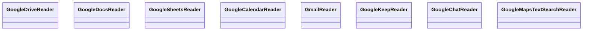

# Google Workspace Connectors

<cite>
**Referenced Files in This Document**
- [llama_index/readers/google/__init__.py](file://llama-index-integrations/readers/llama-index-readers-google/llama_index/readers/google/__init__.py)
- [drive/base.py](file://llama-index-integrations/readers/llama-index-readers-google/llama_index/readers/google/drive/base.py)
- [docs/base.py](file://llama-index-integrations/readers/llama-index-readers-google/llama_index/readers/google/docs/base.py)
- [sheets/base.py](file://llama-index-integrations/readers/llama-index-readers-google/llama_index/readers/google/sheets/base.py)
- [calendar/base.py](file://llama-index-integrations/readers/llama-index-readers-google/llama_index/readers/google/calendar/base.py)
- [gmail/base.py](file://llama-index-integrations/readers/llama-index-readers-google/llama_index/readers/google/gmail/base.py)
- [keep/base.py](file://llama-index-integrations/readers/llama-index-readers-google/llama_index/readers/google/keep/base.py)
- [chat/base.py](file://llama-index-integrations/readers/llama-index-readers-google/llama_index/readers/google/chat/base.py)
- [maps/base.py](file://llama-index-integrations/readers/llama-index-readers-google/llama_index/readers/google/maps/base.py)
- [test_readers_google_drive.py](file://llama-index-integrations/readers/llama-index-readers-google/tests/test_readers_google_drive.py)
- [google_calendar.ipynb](file://llama-index-integrations/tools/llama-index-tools-google/examples/google_calendar.ipynb)
</cite>

## Table of Contents
1. [Introduction](#introduction)
2. [Project Structure](#project-structure)
3. [Core Components](#core-components)
4. [Architecture Overview](#architecture-overview)
5. [Detailed Component Analysis](#detailed-component-analysis)
6. [Dependency Analysis](#dependency-analysis)
7. [Performance Considerations](#performance-considerations)
8. [Troubleshooting Guide](#troubleshooting-guide)
9. [Conclusion](#conclusion)
10. [Appendices](#appendices)

## Introduction
This document provides comprehensive documentation for Google Workspace connectors in LlamaIndex. It focuses on the Google Drive, Google Docs, Google Sheets, and Google Calendar integrations exposed via readers and tools. It explains authentication mechanisms (OAuth 2.0 and service accounts), configuration options, file type detection and metadata extraction, document conversion processes, incremental sync considerations, and practical usage patterns. It also covers permission scopes, domain-wide delegation, batch processing, and error handling strategies for API rate limits and network failures.

## Project Structure
The Google Workspace connectors are organized under the Google readers package, with dedicated modules for Drive, Docs, Sheets, Calendar, Gmail, Keep, Chat, and Maps. The package exports public reader classes for external consumption. Tests demonstrate authentication flows and file operations.

**Diagram sources**
- [llama_index/readers/google/__init__.py](file://llama-index-integrations/readers/llama-index-readers-google/llama_index/readers/google/__init__.py#L1-L20)
- [drive/base.py](file://llama-index-integrations/readers/llama-index-readers-google/llama_index/readers/google/drive/base.py)
- [docs/base.py](file://llama-index-integrations/readers/llama-index-readers-google/llama_index/readers/google/docs/base.py)
- [sheets/base.py](file://llama-index-integrations/readers/llama-index-readers-google/llama_index/readers/google/sheets/base.py)
- [calendar/base.py](file://llama-index-integrations/readers/llama-index-readers-google/llama_index/readers/google/calendar/base.py)
- [gmail/base.py](file://llama-index-integrations/readers/llama-index-readers-google/llama_index/readers/google/gmail/base.py)
- [keep/base.py](file://llama-index-integrations/readers/llama-index-readers-google/llama_index/readers/google/keep/base.py)
- [chat/base.py](file://llama-index-integrations/readers/llama-index-readers-google/llama_index/readers/google/chat/base.py)
- [maps/base.py](file://llama-index-integrations/readers/llama-index-readers-google/llama_index/readers/google/maps/base.py)

**Section sources**
- [llama_index/readers/google/__init__.py](file://llama-index-integrations/readers/llama-index-readers-google/llama_index/readers/google/__init__.py#L1-L20)

## Core Components
- GoogleDriveReader: Access files and folders in Google Drive, supporting OAuth 2.0 and service account authentication, credential serialization, and file download with metadata preservation.
- GoogleDocsReader: Retrieve documents from Google Docs, handling document conversion and metadata extraction.
- GoogleSheetsReader: Extract structured data from Google Sheets, enabling spreadsheet parsing and tabular data retrieval.
- GoogleCalendarReader: Interact with Google Calendar events, allowing queries and event creation via a tool specification.

These components are exported from the Google readers package and are the primary entry points for integrating Google Workspace data into LlamaIndex workflows.

**Section sources**
- [llama_index/readers/google/__init__.py](file://llama-index-integrations/readers/llama-index-readers-google/llama_index/readers/google/__init__.py#L1-L20)

## Architecture Overview
The Google connectors integrate with Google APIs through credentials and service clients. Authentication supports:
- OAuth 2.0 installed application flow with local server token acquisition and optional cloud environments.
- Service account key-based authentication for server-to-server scenarios.

**Diagram sources**
- [drive/base.py](file://llama-index-integrations/readers/llama-index-readers-google/llama_index/readers/google/drive/base.py)
- [test_readers_google_drive.py](file://llama-index-integrations/readers/llama-index-readers-google/tests/test_readers_google_drive.py#L66-L95)

## Detailed Component Analysis

### Google Drive Integration
GoogleDriveReader enables discovery and retrieval of files and folders from Google Drive. It supports:
- OAuth 2.0 with client configuration and token persistence.
- Service account key-based authentication.
- Shared drive access via drive_id parameter.
- Relative path computation for hierarchical folder navigation.
- File download with MIME type handling and temporary file writing.

Key behaviors validated by tests:
- Serialization of reader configuration and reconstruction from JSON.
- Credential acquisition without writing tokens to disk in cloud environments.
- Relative path resolution traversing parent hierarchy up to a root folder.
- File download with media downloader and file extension handling.

**Diagram sources**
- [test_readers_google_drive.py](file://llama-index-integrations/readers/llama-index-readers-google/tests/test_readers_google_drive.py#L66-L95)
- [test_readers_google_drive.py](file://llama-index-integrations/readers/llama-index-readers-google/tests/test_readers_google_drive.py#L124-L160)
- [test_readers_google_drive.py](file://llama-index-integrations/readers/llama-index-readers-google/tests/test_readers_google_drive.py#L161-L200)

**Section sources**
- [drive/base.py](file://llama-index-integrations/readers/llama-index-readers-google/llama_index/readers/google/drive/base.py)
- [test_readers_google_drive.py](file://llama-index-integrations/readers/llama-index-readers-google/tests/test_readers_google_drive.py#L1-L200)

### Google Docs Integration
GoogleDocsReader retrieves documents from Google Docs. Typical usage involves:
- Authenticating via OAuth 2.0 or service accounts.
- Fetching document content and converting it to text.
- Extracting metadata such as title, last modified time, and author information.

**Diagram sources**
- [docs/base.py](file://llama-index-integrations/readers/llama-index-readers-google/llama_index/readers/google/docs/base.py)

**Section sources**
- [docs/base.py](file://llama-index-integrations/readers/llama-index-readers-google/llama_index/readers/google/docs/base.py)

### Google Sheets Integration
GoogleSheetsReader extracts structured data from Google Sheets. Typical usage includes:
- Authenticating via OAuth 2.0 or service accounts.
- Reading sheet ranges and converting them into structured arrays or tables.
- Handling cell formatting and value rendering for downstream processing.

**Diagram sources**
- [sheets/base.py](file://llama-index-integrations/readers/llama-index-readers-google/llama_index/readers/google/sheets/base.py)

**Section sources**
- [sheets/base.py](file://llama-index-integrations/readers/llama-index-readers-google/llama_index/readers/google/sheets/base.py)

### Google Calendar Integration
GoogleCalendarReader integrates with Google Calendar for event scheduling data. A tool specification is available for agent workflows.

**Diagram sources**
- [google_calendar.ipynb](file://llama-index-integrations/tools/llama-index-tools-google/examples/google_calendar.ipynb#L26-L72)
- [calendar/base.py](file://llama-index-integrations/readers/llama-index-readers-google/llama_index/readers/google/calendar/base.py)

**Section sources**
- [google_calendar.ipynb](file://llama-index-integrations/tools/llama-index-tools-google/examples/google_calendar.ipynb#L1-L96)
- [calendar/base.py](file://llama-index-integrations/readers/llama-index-readers-google/llama_index/readers/google/calendar/base.py)

### Additional Google Workspace Readers
The package also exposes readers for Gmail, Keep, Chat, and Maps, enabling broader integration with Google Workspace data sources.

**Diagram sources**
- [llama_index/readers/google/__init__.py](file://llama-index-integrations/readers/llama-index-readers-google/llama_index/readers/google/__init__.py#L1-L20)

**Section sources**
- [llama_index/readers/google/__init__.py](file://llama-index-integrations/readers/llama-index-readers-google/llama_index/readers/google/__init__.py#L1-L20)

## Dependency Analysis
The Google readers depend on Google’s official libraries for authentication and API access. The tests demonstrate mocking of credentials, service builds, and media downloads, indicating strong separation of concerns and testability.

**Diagram sources**
- [test_readers_google_drive.py](file://llama-index-integrations/readers/llama-index-readers-google/tests/test_readers_google_drive.py#L161-L200)
- [drive/base.py](file://llama-index-integrations/readers/llama-index-readers-google/llama_index/readers/google/drive/base.py)

**Section sources**
- [test_readers_google_drive.py](file://llama-index-integrations/readers/llama-index-readers-google/tests/test_readers_google_drive.py#L1-L200)

## Performance Considerations
- Batch processing: Use range-based reads for Sheets and paginated listing for Drive to minimize API calls.
- Incremental sync: Track last modified timestamps and use filters to fetch only changed items.
- Concurrency: Parallelize downloads and value retrievals where safe and supported by quotas.
- Caching: Persist downloaded files and parsed values to reduce redundant API calls.
- Rate limiting: Implement exponential backoff and retry strategies for 429/5xx responses.

## Troubleshooting Guide
Common issues and resolutions:
- Missing authentication arguments: Ensure either OAuth client config or service account key is provided.
- Token persistence in cloud: When running in cloud environments, avoid writing tokens to disk; rely on in-memory credentials.
- Permission errors: Verify required scopes are granted and domain-wide delegation is configured if impersonating users.
- API quota exceeded: Implement retry with backoff and consider batching requests.
- Network failures: Add retry logic around transient failures and validate connectivity.

**Section sources**
- [test_readers_google_drive.py](file://llama-index-integrations/readers/llama-index-readers-google/tests/test_readers_google_drive.py#L62-L65)
- [test_readers_google_drive.py](file://llama-index-integrations/readers/llama-index-readers-google/tests/test_readers_google_drive.py#L96-L123)

## Conclusion
The Google Workspace connectors in LlamaIndex provide robust, modular access to Drive, Docs, Sheets, and Calendar. They support flexible authentication modes, structured data extraction, and integration with agents and workflows. By following best practices for batching, caching, and rate limiting, teams can build scalable solutions that leverage Google Workspace data effectively.

## Appendices

### Practical Examples Index
- Drive access with shared drives and folder traversal.
- Docs retrieval and metadata extraction.
- Sheets structured data extraction from spreadsheets.
- Calendar event listing and creation via agent tools.

**Section sources**
- [test_readers_google_drive.py](file://llama-index-integrations/readers/llama-index-readers-google/tests/test_readers_google_drive.py#L66-L95)
- [google_calendar.ipynb](file://llama-index-integrations/tools/llama-index-tools-google/examples/google_calendar.ipynb#L50-L72)