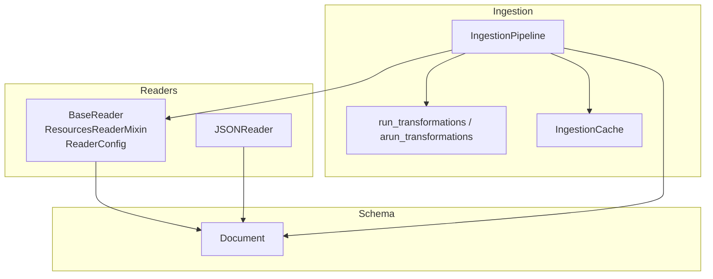
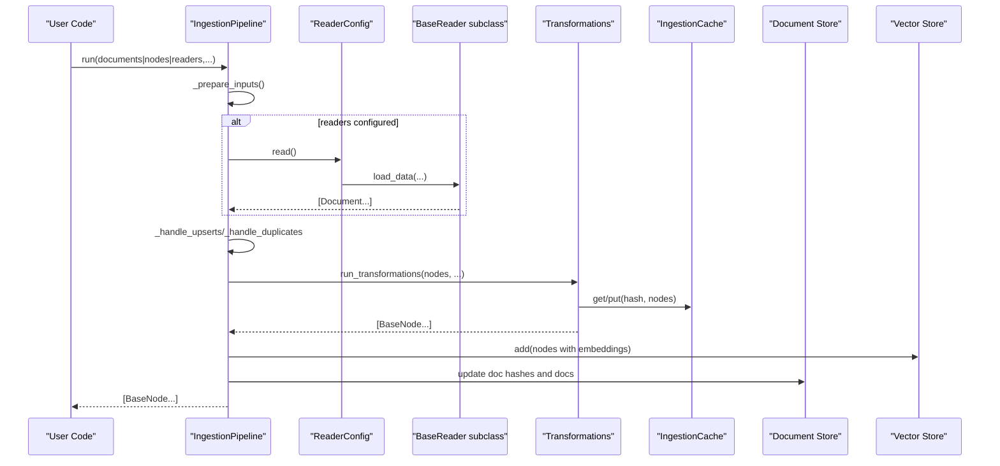
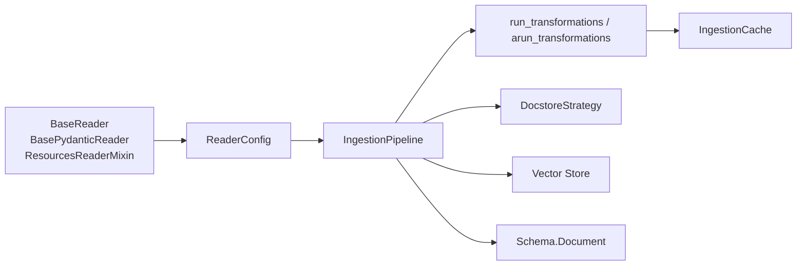

# Custom Connector Development

<cite>
**Referenced Files in This Document**
- [base.py](file://llama-index-core/llama_index/core/readers/base.py)
- [__init__.py](file://llama-index-core/llama_index/core/readers/__init__.py)
- [json.py](file://llama-index-core/llama_index/core/readers/json.py)
- [pipeline.py](file://llama-index-core/llama_index/core/ingestion/pipeline.py)
- [__init__.py](file://llama-index-core/llama_index/core/ingestion/__init__.py)
- [transformations.py](file://llama-index-core/llama_index/core/ingestion/transformations.py)
- [schema.py](file://llama-index-core/llama_index/core/schema.py)
- [README.md](file://llama-index-integrations/readers/README.md)
</cite>

## Table of Contents
1. [Introduction](#introduction)
2. [Project Structure](#project-structure)
3. [Core Components](#core-components)
4. [Architecture Overview](#architecture-overview)
5. [Detailed Component Analysis](#detailed-component-analysis)
6. [Dependency Analysis](#dependency-analysis)
7. [Performance Considerations](#performance-considerations)
8. [Troubleshooting Guide](#troubleshooting-guide)
9. [Conclusion](#conclusion)
10. [Appendices](#appendices)

## Introduction
This document explains how to develop custom data connectors for LlamaIndex using the unified reader interface and ingestion pipeline. It covers the Reader protocol, the document processing pipeline, and data transformation patterns. It also provides implementation requirements for authentication, error handling, pagination, and metadata preservation, along with step-by-step examples for proprietary formats, internal systems, and specialized sources. Guidance is included for testing, performance optimization, packaging, publishing, and maintaining compatibility across LlamaIndex versions.

## Project Structure
LlamaIndex organizes connectors and ingestion under core modules:
- Readers define the unified interface for loading data into Document objects.
- Ingestion pipelines orchestrate transformations, caching, de-duplication, and vector store persistence.
- Transformations enumerate supported transformation categories and components.

**Diagram sources**
- [base.py](file://llama-index-core/llama_index/core/readers/base.py#L19-L250)
- [json.py](file://llama-index-core/llama_index/core/readers/json.py#L53-L155)
- [pipeline.py](file://llama-index-core/llama_index/core/ingestion/pipeline.py#L193-L575)
- [transformations.py](file://llama-index-core/llama_index/core/ingestion/transformations.py#L77-L379)
- [schema.py](file://llama-index-core/llama_index/core/schema.py#L1-L200)

**Section sources**
- [__init__.py](file://llama-index-core/llama_index/core/readers/__init__.py#L1-L33)
- [__init__.py](file://llama-index-core/llama_index/core/ingestion/__init__.py#L1-L16)

## Core Components
- BaseReader and BasePydanticReader: Define synchronous and asynchronous loading APIs, plus LangChain interoperability helpers.
- ResourcesReaderMixin: Adds resource listing, permission info, and resource-specific loading for granular access patterns.
- ReaderConfig: Encapsulates a reader instance and its arguments for use in pipelines.
- IngestionPipeline: Orchestrates preparation, de-duplication, transformations, caching, and persistence.
- Transformations: Defines transformation categories and configurable components (e.g., node parsers, embeddings).
- Document: The canonical data structure representing loaded content and metadata.

Key capabilities:
- Lazy vs eager loading via sync/async methods.
- Resource-centric operations for systems with hierarchical or paginated data.
- Pluggable transformations and caching to optimize repeated runs.
- De-duplication strategies using document stores and optional vector stores.

**Section sources**
- [base.py](file://llama-index-core/llama_index/core/readers/base.py#L19-L250)
- [pipeline.py](file://llama-index-core/llama_index/core/ingestion/pipeline.py#L193-L575)
- [transformations.py](file://llama-index-core/llama_index/core/ingestion/transformations.py#L77-L379)
- [schema.py](file://llama-index-core/llama_index/core/schema.py#L1-L200)

## Architecture Overview
The ingestion pipeline integrates readers, transformations, caching, and persistence:

**Diagram sources**
- [pipeline.py](file://llama-index-core/llama_index/core/ingestion/pipeline.py#L467-L575)
- [base.py](file://llama-index-core/llama_index/core/readers/base.py#L247-L250)
- [transformations.py](file://llama-index-core/llama_index/core/ingestion/transformations.py#L71-L143)

## Detailed Component Analysis

### Unified Reader Interface
- BaseReader defines:
  - Synchronous and asynchronous load_data and lazy_load_data.
  - LangChain interop via load_langchain_documents.
- BasePydanticReader extends BaseReader and BaseComponent for serialization and remote hints.
- ResourcesReaderMixin adds:
  - list_resources and async alist_resources.
  - get_permission_info and get_resource_info with async variants.
  - load_resource, load_resources, and async counterparts.
- ReaderConfig encapsulates a reader instance and its arguments for pipeline use.

Implementation guidance:
- Implement load_data to return a list of Document objects.
- Use extra_info or metadata kwargs to preserve provenance and context.
- For streaming or paginated sources, implement lazy_load_data to yield iteratively.
- For remote sources, set is_remote appropriately to inform caching and persistence strategies.

**Section sources**
- [base.py](file://llama-index-core/llama_index/core/readers/base.py#L19-L250)

### Example Reader: JSONReader
JSONReader demonstrates:
- Depth-first traversal with levels_back and collapse_length controls.
- Clean vs raw JSON formatting modes.
- Handling JSONL vs single JSON objects.
- Safe recursion with error handling.

Usage patterns:
- Use levels_back to guide semantic chunking by nesting levels.
- Use collapse_length to compact small subtrees.
- Use clean_json to remove formatting-only lines when levels_back is unset.

**Section sources**
- [json.py](file://llama-index-core/llama_index/core/readers/json.py#L53-L155)

### Ingestion Pipeline
Key behaviors:
- Preparation: Merges documents, nodes, and reader outputs.
- De-duplication: Supports upserts, duplicates-only, and upserts-and-delete strategies.
- Transformations: Applies a sequence of TransformComponent instances with caching.
- Persistence: Supports persist/load of cache and document store.

Concurrency:
- Parallel processing via multiprocessing with batching.
- Async variants for IO-bound steps.

Caching:
- Uses transformation hash to avoid recomputation.
- Supports disabling cache per run.

**Section sources**
- [pipeline.py](file://llama-index-core/llama_index/core/ingestion/pipeline.py#L193-L575)
- [transformations.py](file://llama-index-core/llama_index/core/ingestion/transformations.py#L71-L143)

### Transformations and Categories
- Transformation categories include node parsing and embeddings.
- Configurable components enumerate available transformers.
- ConfiguredTransformation binds a component to a named transformation.

Common patterns:
- SentenceSplitter and TokenTextSplitter for text segmentation.
- Embedding models (OpenAI, Azure, Cohere, Bedrock, etc.) as configured components.

**Section sources**
- [transformations.py](file://llama-index-core/llama_index/core/ingestion/transformations.py#L60-L379)

### Document Model and Metadata Preservation
- Document is the core schema for content and metadata.
- BaseComponent and TransformComponent provide serialization hooks and spans for observability.
- MetadataMode controls how metadata is rendered during hashing and transformations.

Best practices:
- Populate metadata with source URIs, timestamps, and resource IDs.
- Use extra_info in readers to propagate context consistently.

**Section sources**
- [schema.py](file://llama-index-core/llama_index/core/schema.py#L1-L200)

### Step-by-Step: Creating a Custom Reader
Follow these steps to implement a custom connector:

1. Choose a base class:
   - Use BaseReader for minimal implementation.
   - Use BasePydanticReader if your reader supports serialization and remote hints.
   - Mix in ResourcesReaderMixin for resource-aware loaders (list/list info/get info/load resource).

2. Implement load_data:
   - Parse your data source (file, API, database).
   - Yield Document objects with text and metadata.
   - Support lazy_load_data for streaming or large datasets.

3. Add async support:
   - Override alazy_load_data or aload_data if your backend supports async.
   - Prefer true async implementations over threaded wrappers.

4. Integrate with external systems:
   - Authentication: Accept credentials via constructor/environment variables.
   - Pagination: Implement iterative fetching and yield results incrementally.
   - Error handling: Wrap network/database errors and return empty lists or raise controlled exceptions.

5. Preserve metadata:
   - Pass extra_info/metadata kwargs to Document constructors.
   - Include source identifiers, timestamps, and resource paths.

6. Test your reader:
   - Unit tests for happy paths and edge cases.
   - Integration tests against a sandboxed endpoint or fixture data.

7. Package and publish:
   - Create a separate package with a clear namespace (e.g., llama-index-readers-<source>).
   - Include installation instructions and usage examples.
   - Reference the unified reader interface and ingestion pipeline.

8. Compatibility:
   - Pin compatible LlamaIndex versions in pyproject.toml.
   - Keep ReaderConfig usage and Document metadata fields stable.

**Section sources**
- [base.py](file://llama-index-core/llama_index/core/readers/base.py#L19-L250)
- [__init__.py](file://llama-index-core/llama_index/core/readers/__init__.py#L14-L32)
- [README.md](file://llama-index-integrations/readers/README.md#L1-L21)

### Step-by-Step: Integrating with the Ingestion Pipeline
After building a reader:

1. Wrap with ReaderConfig:
   - Provide reader instance and arguments for reproducibility.

2. Configure transformations:
   - Choose node parsers and embeddings appropriate for your content type.

3. Run the pipeline:
   - Supply documents, nodes, or readers.
   - Enable caching and de-duplication as needed.
   - Persist cache and document store for incremental runs.

4. Monitor and iterate:
   - Use observability spans and logs.
   - Adjust chunk sizes, overlap, and embedding models.

**Section sources**
- [pipeline.py](file://llama-index-core/llama_index/core/ingestion/pipeline.py#L193-L575)
- [transformations.py](file://llama-index-core/llama_index/core/ingestion/transformations.py#L77-L379)

### Implementation Requirements Checklist
- Authentication handling:
  - Accept tokens/secrets via constructor or environment.
  - Validate credentials early and fail fast.
- Error management:
  - Catch transient errors and retry with backoff.
  - Normalize exceptions to LlamaIndex-compatible errors.
- Pagination support:
  - Implement cursor-based or page-based iteration.
  - Respect rate limits and concurrency caps.
- Metadata preservation:
  - Attach source identifiers, timestamps, and lineage.
  - Avoid leaking sensitive fields in metadata.
- Streaming data:
  - Prefer lazy_load_data for large or infinite streams.
  - Use async methods for IO-bound backends.
- Incremental updates:
  - Use docstore strategies (upserts/upserts_and_delete) with vector store.
  - Compute stable hashes for unchanged content.

**Section sources**
- [base.py](file://llama-index-core/llama_index/core/readers/base.py#L19-L250)
- [pipeline.py](file://llama-index-core/llama_index/core/ingestion/pipeline.py#L382-L438)

### Testing Strategies
- Unit tests:
  - Mock external dependencies (HTTP, databases).
  - Verify Document counts and metadata correctness.
- Integration tests:
  - Use fixtures or sandbox endpoints.
  - Validate ingestion pipeline stages (read, transform, cache).
- Performance tests:
  - Measure throughput and latency for lazy vs eager loading.
  - Benchmark parallel vs sequential transformations.

**Section sources**
- [pipeline.py](file://llama-index-core/llama_index/core/ingestion/pipeline.py#L530-L575)

### Packaging and Publishing
- Package naming:
  - Use llama-index-readers-<source> convention.
- Dependencies:
  - Keep optional dependencies explicit; readers should remain usable with minimal extras.
- Examples:
  - Include a README with pip install and basic usage.
- Distribution:
  - Publish to PyPI; link to LlamaIndex documentation and changelog.

**Section sources**
- [README.md](file://llama-index-integrations/readers/README.md#L1-L21)

## Dependency Analysis
The reader and ingestion modules form a cohesive pipeline with clear boundaries:

**Diagram sources**
- [base.py](file://llama-index-core/llama_index/core/readers/base.py#L19-L250)
- [pipeline.py](file://llama-index-core/llama_index/core/ingestion/pipeline.py#L193-L575)
- [transformations.py](file://llama-index-core/llama_index/core/ingestion/transformations.py#L71-L143)
- [schema.py](file://llama-index-core/llama_index/core/schema.py#L1-L200)

**Section sources**
- [__init__.py](file://llama-index-core/llama_index/core/readers/__init__.py#L14-L32)
- [__init__.py](file://llama-index-core/llama_index/core/ingestion/__init__.py#L1-L16)

## Performance Considerations
- Use lazy loading for large or streaming sources to reduce memory pressure.
- Leverage parallel workers in the ingestion pipeline for CPU-bound transformations.
- Enable caching to avoid recomputation across runs.
- Tune chunk size and overlap for downstream retrieval quality.
- Prefer async implementations for IO-bound readers.

[No sources needed since this section provides general guidance]

## Troubleshooting Guide
Common issues and remedies:
- Empty results:
  - Verify credentials and permissions; confirm resource existence.
  - Check pagination logic and rate limits.
- Slow ingestion:
  - Switch to lazy loading and parallel workers.
  - Reduce chunk size or disable heavy transformations temporarily.
- Duplicate documents:
  - Confirm docstore strategy and hashes.
  - Ensure stable Document.hash generation.
- Caching not applied:
  - Validate transformation hash stability.
  - Disable cache only for debugging.

**Section sources**
- [pipeline.py](file://llama-index-core/llama_index/core/ingestion/pipeline.py#L382-L438)
- [transformations.py](file://llama-index-core/llama_index/core/ingestion/transformations.py#L71-L143)

## Conclusion
By adhering to the unified reader interface and leveraging the ingestion pipeline, developers can build robust, efficient, and maintainable connectors for diverse data sources. Focus on resource-aware designs, metadata preservation, and incremental updates to integrate seamlessly with LlamaIndex’s caching and de-duplication mechanisms.

[No sources needed since this section summarizes without analyzing specific files]

## Appendices

### A. Reader Protocol Summary
- Required: load_data returning [Document].
- Recommended: lazy_load_data for streaming.
- Optional: load_langchain_documents for interoperability.
- Resource-aware: list_resources, get_resource_info, load_resource.

**Section sources**
- [base.py](file://llama-index-core/llama_index/core/readers/base.py#L22-L46)

### B. Ingestion Pipeline Controls
- De-duplication strategies: upserts, duplicates_only, upserts_and_delete.
- Parallelism: num_workers with process pool batching.
- Caching: enabled by default; can be disabled per run.

**Section sources**
- [pipeline.py](file://llama-index-core/llama_index/core/ingestion/pipeline.py#L173-L191)
- [pipeline.py](file://llama-index-core/llama_index/core/ingestion/pipeline.py#L530-L575)