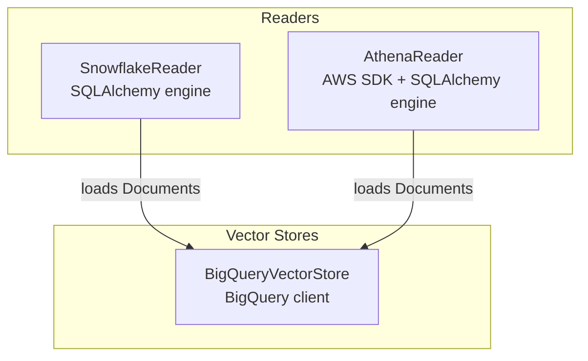
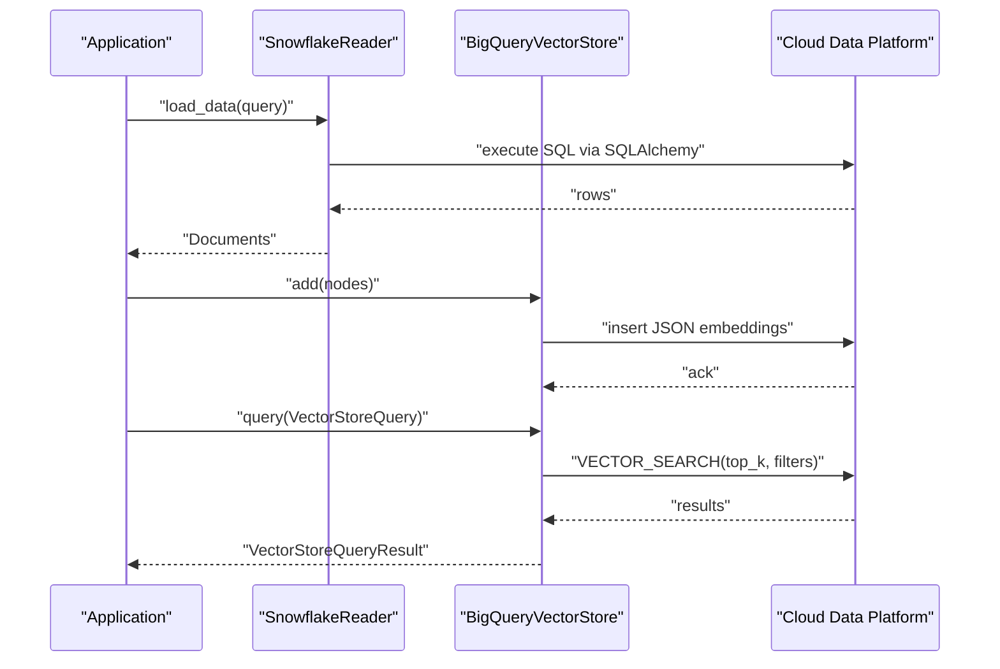
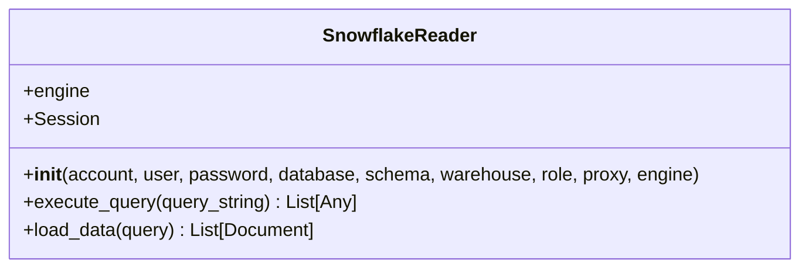
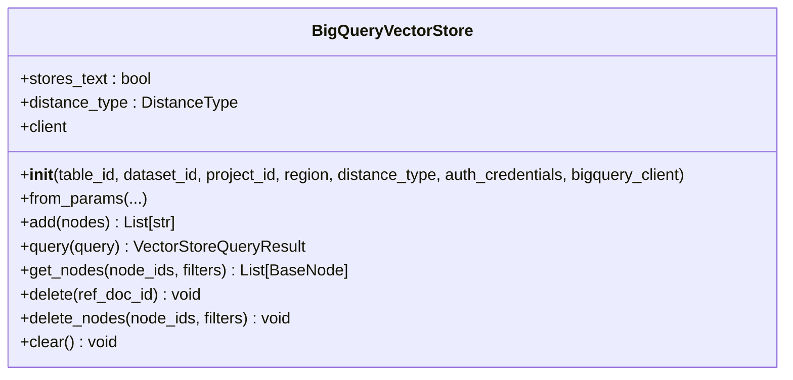
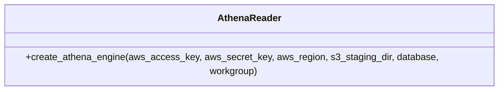
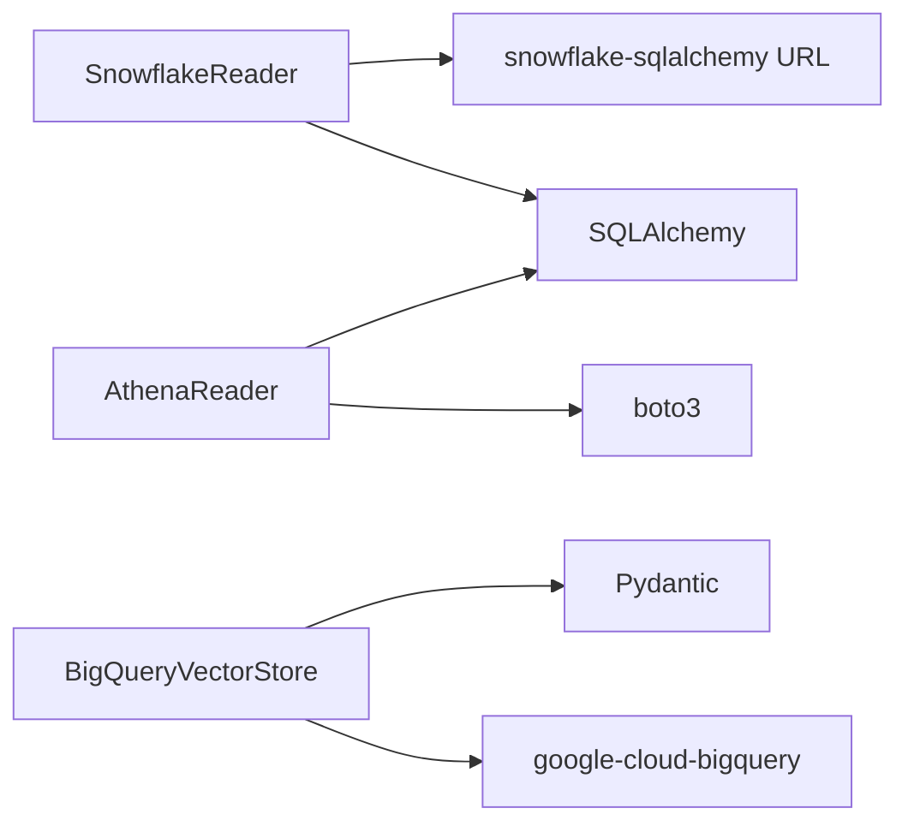

# Cloud Database Services

<cite>
**Referenced Files in This Document**
- [snowflake/base.py](file://llama-index-integrations/readers/llama-index-readers-snowflake/llama_index/readers/snowflake/base.py)
- [snowflake/__init__.py](file://llama-index-integrations/readers/llama-index-readers-snowflake/llama_index/readers/snowflake/__init__.py)
- [bigquery/base.py](file://llama-index-integrations/vector_stores/llama-index-vector-stores-bigquery/llama_index/vector_stores/bigquery/base.py)
- [bigquery/__init__.py](file://llama-index-integrations/vector_stores/llama-index-vector-stores-bigquery/llama_index/vector_stores/bigquery/__init__.py)
- [athena/base.py](file://llama-index-integrations/readers/llama-index-readers-athena/llama_index/readers/athena/base.py)
- [snowflake_query_engine.md](file://docs/api_reference/api_reference/packs/snowflake_query_engine.md)
- [snowflake.md](file://docs/api_reference/api_reference/readers/snowflake.md)
- [bigquery.md](file://docs/api_reference/api_reference/storage/vector_store/bigquery.md)
</cite>

## Table of Contents
1. [Introduction](#introduction)
2. [Project Structure](#project-structure)
3. [Core Components](#core-components)
4. [Architecture Overview](#architecture-overview)
5. [Detailed Component Analysis](#detailed-component-analysis)
6. [Dependency Analysis](#dependency-analysis)
7. [Performance Considerations](#performance-considerations)
8. [Troubleshooting Guide](#troubleshooting-guide)
9. [Conclusion](#conclusion)
10. [Appendices](#appendices)

## Introduction
This document explains how LlamaIndex integrates with major cloud data platforms through dedicated connectors and vector stores. It focuses on:
- BigQuery vector search integration for scalable similarity search
- Snowflake reader for SQL-based analytics data ingestion
- Athena reader for federated query execution against S3-backed data
It also covers cloud authentication patterns, query execution strategies optimized for scale, and operational guidance for cost, performance, and governance.

## Project Structure
The relevant cloud database integrations are organized under:
- Readers: SQL-based ingestion from cloud data warehouses
- Vector Stores: Managed vector storage and search backed by cloud data platforms

**Diagram sources**
- [snowflake/base.py](file://llama-index-integrations/readers/llama-index-readers-snowflake/llama_index/readers/snowflake/base.py#L15-L138)
- [athena/base.py](file://llama-index-integrations/readers/llama-index-readers-athena/llama_index/readers/athena/base.py#L11-L87)
- [bigquery/base.py](file://llama-index-integrations/vector_stores/llama-index-vector-stores-bigquery/llama_index/vector_stores/bigquery/base.py#L50-L548)

**Section sources**
- [snowflake/base.py](file://llama-index-integrations/readers/llama-index-readers-snowflake/llama_index/readers/snowflake/base.py#L1-L138)
- [bigquery/base.py](file://llama-index-integrations/vector_stores/llama-index-vector-stores-bigquery/llama_index/vector_stores/bigquery/base.py#L1-L548)
- [athena/base.py](file://llama-index-integrations/readers/llama-index-readers-athena/llama_index/readers/athena/base.py#L1-L87)

## Core Components
- SnowflakeReader: Connects to Snowflake via SQLAlchemy, executes queries, and returns LlamaIndex Documents.
- BigQueryVectorStore: Manages vector embeddings in BigQuery, supports similarity search, filtering, and CRUD operations.
- AthenaReader: Builds an AWS Athena SQLAlchemy engine for federated queries and result staging in S3.

Key responsibilities:
- Authentication and connection management
- Query execution and result materialization
- Vector indexing and retrieval (BigQuery)
- Operational best practices for cost and performance

**Section sources**
- [snowflake/base.py](file://llama-index-integrations/readers/llama-index-readers-snowflake/llama_index/readers/snowflake/base.py#L37-L88)
- [bigquery/base.py](file://llama-index-integrations/vector_stores/llama-index-vector-stores-bigquery/llama_index/vector_stores/bigquery/base.py#L87-L130)
- [athena/base.py](file://llama-index-integrations/readers/llama-index-readers-athena/llama_index/readers/athena/base.py#L23-L86)

## Architecture Overview
High-level flow for each connector:
- SnowflakeReader: Initialize with credentials or engine → execute SQL → return Documents
- BigQueryVectorStore: Initialize client and table → add/delete/query vectors → return nodes/results
- AthenaReader: Build engine with region/staging/workgroup → execute federated queries

**Diagram sources**
- [snowflake/base.py](file://llama-index-integrations/readers/llama-index-readers-snowflake/llama_index/readers/snowflake/base.py#L90-L138)
- [bigquery/base.py](file://llama-index-integrations/vector_stores/llama-index-vector-stores-bigquery/llama_index/vector_stores/bigquery/base.py#L285-L439)

## Detailed Component Analysis

### SnowflakeReader
SnowflakeReader encapsulates:
- Constructor options for account, user, password, database, schema, warehouse, role, proxy, or reuse an existing SQLAlchemy Engine
- Session-based query execution with proper resource cleanup
- Document creation from query results

**Diagram sources**
- [snowflake/base.py](file://llama-index-integrations/readers/llama-index-readers-snowflake/llama_index/readers/snowflake/base.py#L15-L138)

Operational notes:
- Uses SQLAlchemy URL builder for connection composition
- Creates a session per query and closes it deterministically
- Converts each row into a single Document string

**Section sources**
- [snowflake/base.py](file://llama-index-integrations/readers/llama-index-readers-snowflake/llama_index/readers/snowflake/base.py#L37-L88)
- [snowflake/base.py](file://llama-index-integrations/readers/llama-index-readers-snowflake/llama_index/readers/snowflake/base.py#L90-L138)
- [snowflake/__init__.py](file://llama-index-integrations/readers/llama-index-readers-snowflake/llama_index/readers/snowflake/__init__.py#L1-L4)

### BigQueryVectorStore
BigQueryVectorStore provides:
- Initialization with project, dataset, table, optional client or credentials
- Automatic dataset/table creation with a standardized schema
- Vector insertions via JSON load jobs
- Similarity search using BigQuery VECTOR_SEARCH with configurable distance metrics
- Filtering via metadata and node IDs
- Deletion and clearing operations

**Diagram sources**
- [bigquery/base.py](file://llama-index-integrations/vector_stores/llama-index-vector-stores-bigquery/llama_index/vector_stores/bigquery/base.py#L50-L130)
- [bigquery/base.py](file://llama-index-integrations/vector_stores/llama-index-vector-stores-bigquery/llama_index/vector_stores/bigquery/base.py#L285-L548)

Key behaviors:
- Distance metrics supported: Euclidean, Cosine, Dot Product
- Pre/post-filtering considerations for VECTOR_SEARCH performance
- JSON metadata stored and queried with SAFE.JSON_VALUE semantics

**Section sources**
- [bigquery/base.py](file://llama-index-integrations/vector_stores/llama-index-vector-stores-bigquery/llama_index/vector_stores/bigquery/base.py#L87-L130)
- [bigquery/base.py](file://llama-index-integrations/vector_stores/llama-index-vector-stores-bigquery/llama_index/vector_stores/bigquery/base.py#L341-L439)
- [bigquery/base.py](file://llama-index-integrations/vector_stores/llama-index-vector-stores-bigquery/llama_index/vector_stores/bigquery/base.py#L441-L500)
- [bigquery/base.py](file://llama-index-integrations/vector_stores/llama-index-vector-stores-bigquery/llama_index/vector_stores/bigquery/base.py#L502-L539)
- [bigquery/base.py](file://llama-index-integrations/vector_stores/llama-index-vector-stores-bigquery/llama_index/vector_stores/bigquery/base.py#L540-L548)

### AthenaReader
AthenaReader builds an AWS Athena SQLAlchemy engine with:
- Region, S3 staging directory, database, and workgroup
- Optional explicit AWS credentials (with a deprecation warning)
- Recommends IAM roles and environment-based credentials

**Diagram sources**
- [athena/base.py](file://llama-index-integrations/readers/llama-index-readers-athena/llama_index/readers/athena/base.py#L11-L87)

Security guidance:
- Avoid embedding credentials in code
- Prefer IAM roles and environment variables
- Use workgroups and least-privilege permissions

**Section sources**
- [athena/base.py](file://llama-index-integrations/readers/llama-index-readers-athena/llama_index/readers/athena/base.py#L23-L86)

### Snowflake Query Engine Pack
LlamaIndex provides a Snowflake-specific query engine pack for higher-level orchestration and retrieval patterns. Refer to the official documentation for usage and configuration.

**Section sources**
- [snowflake_query_engine.md](file://docs/api_reference/api_reference/packs/snowflake_query_engine.md)
- [snowflake.md](file://docs/api_reference/api_reference/readers/snowflake.md)

## Dependency Analysis
- SnowflakeReader depends on SQLAlchemy and Snowflake SQLAlchemy dialect for connectivity
- BigQueryVectorStore depends on google-cloud-bigquery and Pydantic models for vector storage
- AthenaReader depends on boto3 and SQLAlchemy’s awsathena driver

**Diagram sources**
- [snowflake/base.py](file://llama-index-integrations/readers/llama-index-readers-snowflake/llama_index/readers/snowflake/base.py#L6-L84)
- [bigquery/base.py](file://llama-index-integrations/vector_stores/llama-index-vector-stores-bigquery/llama_index/vector_stores/bigquery/base.py#L14-L28)
- [athena/base.py](file://llama-index-integrations/readers/llama-index-readers-athena/llama_index/readers/athena/base.py#L6-L86)

**Section sources**
- [snowflake/base.py](file://llama-index-integrations/readers/llama-index-readers-snowflake/llama_index/readers/snowflake/base.py#L6-L84)
- [bigquery/base.py](file://llama-index-integrations/vector_stores/llama-index-vector-stores-bigquery/llama_index/vector_stores/bigquery/base.py#L14-L28)
- [athena/base.py](file://llama-index-integrations/readers/llama-index-readers-athena/llama_index/readers/athena/base.py#L6-L86)

## Performance Considerations
- BigQuery vector search
  - Choose appropriate distance metric based on normalized embeddings
  - Use metadata filters aligned with indexes to enable pre-filtering and reduce post-filtering overhead
  - Increase similarity_top_k when expecting post-filtering to meet result targets
- Snowflake
  - Use warehouse and role appropriate for workload
  - Leverage schema-level access controls and virtual warehouses for cost isolation
- Athena
  - Optimize S3 partitioning and compression for scanned data volume
  - Use workgroups and execution groups to enforce concurrency limits and cost caps

[No sources needed since this section provides general guidance]

## Troubleshooting Guide
Common issues and remedies:
- SnowflakeReader
  - Missing query argument raises a validation error; ensure a non-null query is provided
  - Session lifecycle: sessions are opened and closed per query; ensure network stability and retry on transient failures
- BigQueryVectorStore
  - Permission errors: verify BigQuery Data Editor or Data Owner roles on dataset/table
  - Schema mismatches: table is auto-created with a fixed schema; avoid altering it externally
  - VECTOR_SEARCH filtering: if filters do not match indexes, expect fewer results; adjust filters or add indexes
- AthenaReader
  - Credential warnings: prefer IAM roles and environment variables over embedded keys
  - Engine creation: ensure region, S3 staging directory, and database are correctly configured

**Section sources**
- [snowflake/base.py](file://llama-index-integrations/readers/llama-index-readers-snowflake/llama_index/readers/snowflake/base.py#L123-L138)
- [bigquery/base.py](file://llama-index-integrations/vector_stores/llama-index-vector-stores-bigquery/llama_index/vector_stores/bigquery/base.py#L341-L352)
- [athena/base.py](file://llama-index-integrations/readers/llama-index-readers-athena/llama_index/readers/athena/base.py#L63-L65)

## Conclusion
LlamaIndex offers production-ready connectors for Snowflake, BigQuery, and Athena. By leveraging SQLAlchemy engines, BigQuery client libraries, and AWS SDKs, these components support robust, scalable analytics and vector workloads. Follow the authentication and operational guidance to ensure secure, cost-effective, and high-performance deployments.

[No sources needed since this section summarizes without analyzing specific files]

## Appendices

### Cloud Authentication Methods
- Snowflake
  - Username/password or reuse an existing SQLAlchemy Engine
  - Optional role and proxy configuration
- BigQuery
  - Accepts an existing BigQuery client or constructs one from project, region, and credentials
  - Supports default application credentials or explicit credentials
- Athena
  - Prefer IAM roles and environment variables
  - Explicit credentials are supported but discouraged

**Section sources**
- [snowflake/base.py](file://llama-index-integrations/readers/llama-index-readers-snowflake/llama_index/readers/snowflake/base.py#L66-L85)
- [bigquery/base.py](file://llama-index-integrations/vector_stores/llama-index-vector-stores-bigquery/llama_index/vector_stores/bigquery/base.py#L176-L199)
- [athena/base.py](file://llama-index-integrations/readers/llama-index-readers-athena/llama_index/readers/athena/base.py#L47-L86)

### Query Execution Patterns and Best Practices
- Federated queries and external tables
  - Use Athena with S3 staging to query external data sources efficiently
- Materialized views and precomputed aggregations
  - Store frequently accessed results in managed tables to reduce compute costs
- Time-partitioned tables
  - Filter by partition keys to minimize scanned data
- Cross-database joins
  - Normalize schemas and leverage workgroups to control concurrency and cost

[No sources needed since this section provides general guidance]

### Cost Optimization Strategies
- Right-size compute resources (warehouses, BigQuery slots, Athena execution capacity)
- Use compression and columnar formats in S3
- Apply predicate pushdown and partition pruning
- Monitor and cap concurrent query execution via workgroups

[No sources needed since this section provides general guidance]

### Data Governance, Security, and Compliance
- Least privilege IAM roles and service accounts
- Audit logs for data access and modifications
- Encryption at rest and in transit
- Data loss prevention and retention policies

[No sources needed since this section provides general guidance]