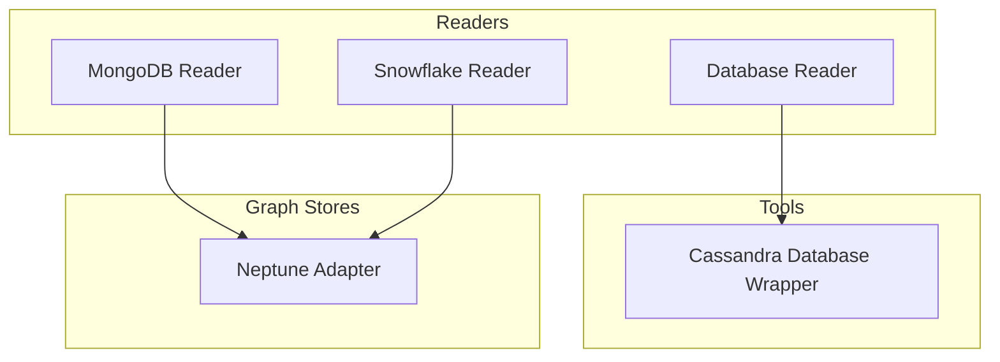
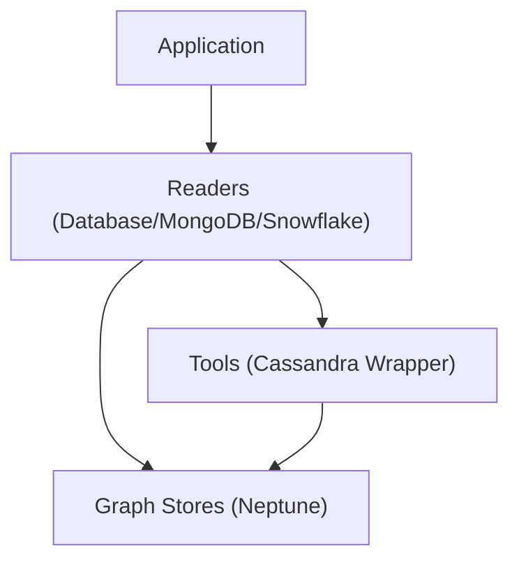
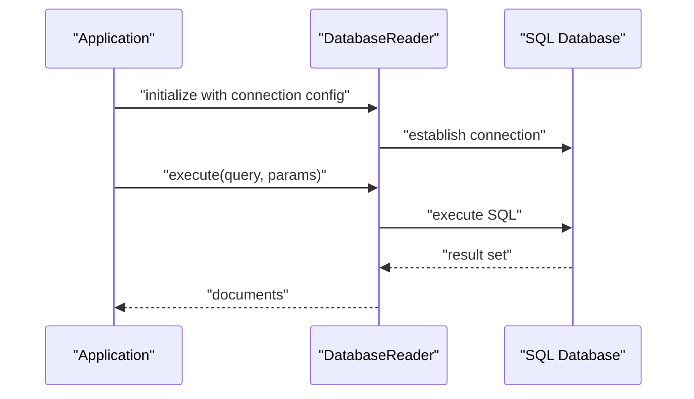
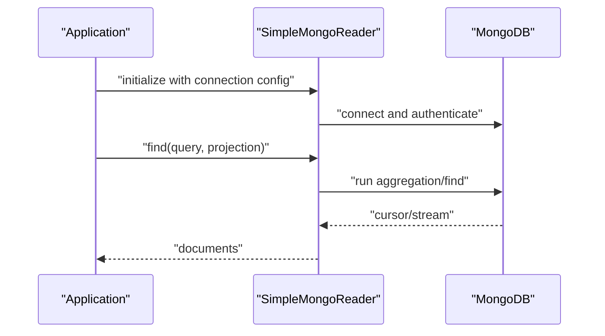
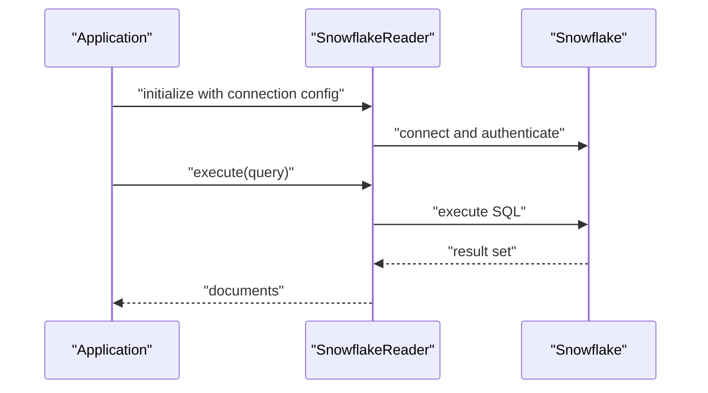
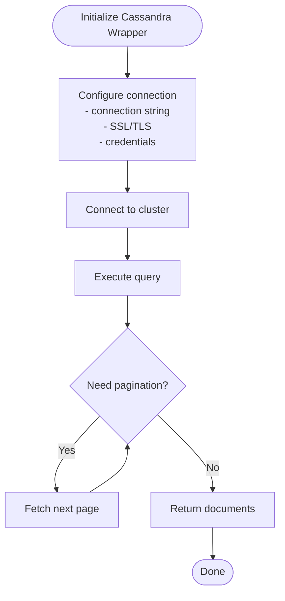
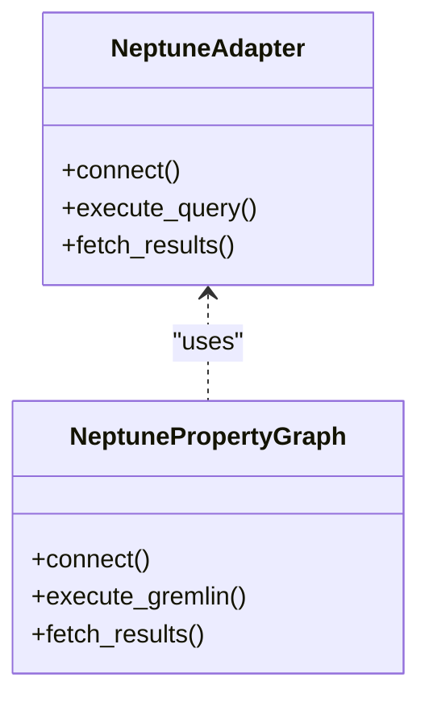
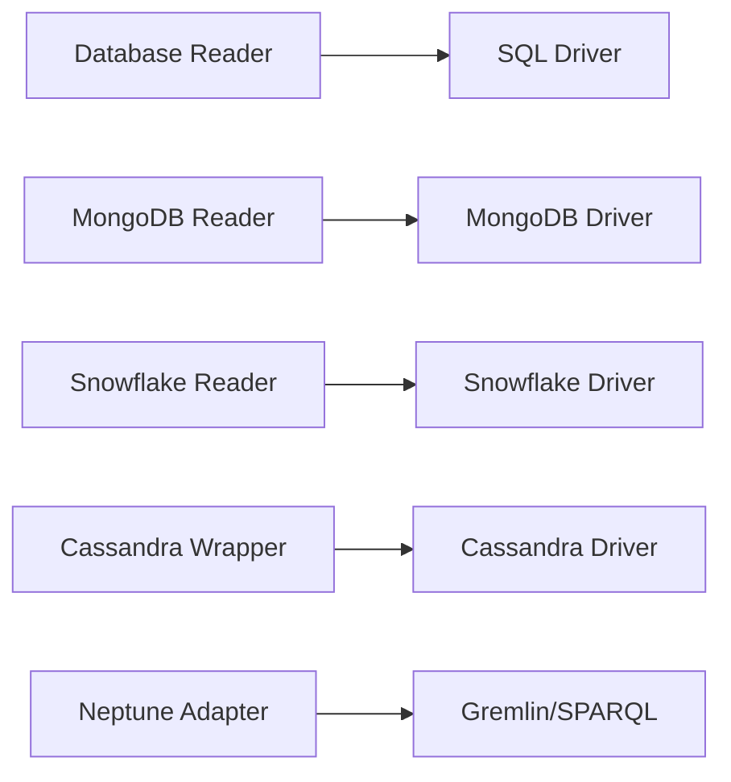

# Database Connectors

<cite>
**Referenced Files in This Document**
- [README.md](file://README.md)
- [llama-index-integrations/readers/llama-index-readers-database/llama_index/readers/database/__init__.py](file://llama-index-integrations/readers/llama-index-readers-database/llama_index/readers/database/__init__.py)
- [llama-index-integrations/readers/llama-index-readers-mongodb/llama_index/readers/mongodb/__init__.py](file://llama-index-integrations/readers/llama-index-readers-mongodb/llama_index/readers/mongodb/__init__.py)
- [llama-index-integrations/readers/llama-index-readers-snowflake/llama_index/readers/snowflake/__init__.py](file://llama-index-integrations/readers/llama-index-readers-snowflake/llama_index/readers/snowflake/__init__.py)
- [llama-index-integrations/tools/llama-index-tools-cassandra/llama_index/tools/cassandra/cassandra_database_wrapper.py](file://llama-index-integrations/tools/llama-index-tools-cassandra/llama_index/tools/cassandra/cassandra_database_wrapper.py)
- [llama-index-integrations/tools/llama-index-tools-database/tests/test_tools_database.py](file://llama-index-integrations/tools/llama-index-tools-database/tests/test_tools_database.py)
- [llama-index-integrations/readers/llama-index-readers-database/tests/test_readers_database.py](file://llama-index-integrations/readers/llama-index-readers-database/tests/test_readers_database.py)
- [llama-index-integrations/readers/llama-index-readers-mongodb/tests/test_readers_mongodb.py](file://llama-index-integrations/readers/llama-index-readers-mongodb/tests/test_readers_mongodb.py)
- [llama-index-integrations/readers/llama-index-readers-snowflake/tests/test_readers_snowflake.py](file://llama-index-integrations/readers/llama-index-readers-snowflake/tests/test_readers_snowflake.py)
- [llama-index-integrations/graph_stores/llama-index-graph-stores-neptune/llama_index/graph_stores/neptune/database.py](file://llama-index-integrations/graph_stores/llama-index-graph-stores-neptune/llama_index/graph_stores/neptune/database.py)
- [llama-index-integrations/graph_stores/llama-index-graph-stores-neptune/llama_index/graph_stores/neptune/database_property_graph.py](file://llama-index-integrations/graph_stores/llama-index-graph-stores-neptune/llama_index/graph_stores/neptune/database_property_graph.py)
</cite>

## Table of Contents
1. [Introduction](#introduction)
2. [Project Structure](#project-structure)
3. [Core Components](#core-components)
4. [Architecture Overview](#architecture-overview)
5. [Detailed Component Analysis](#detailed-component-analysis)
6. [Dependency Analysis](#dependency-analysis)
7. [Performance Considerations](#performance-considerations)
8. [Troubleshooting Guide](#troubleshooting-guide)
9. [Conclusion](#conclusion)
10. [Appendices](#appendices)

## Introduction
This document describes database connectors available in LlamaIndex, focusing on the integrations that enable reading from SQL and NoSQL systems, and leveraging cloud data platforms. It covers connection management, authentication, query optimization, pagination, connector-specific configuration (connection strings, SSL/TLS, credentials, connection pooling), and practical usage patterns for relational queries, joins, document store extraction, and time-series processing. Guidance is also provided for incremental data loading, change data capture, and real-time synchronization, along with performance optimization strategies for large datasets and integration with database-specific features such as full-text search and vector extensions.

## Project Structure
The database connectors in LlamaIndex are primarily distributed across:
- Readers: specialized loaders for various data sources, including SQL databases, NoSQL databases, and cloud platforms.
- Tools: wrappers and utilities that expose database capabilities for retrieval and orchestration tasks.
- Graph Stores: adapters for graph databases that integrate with LlamaIndex’s graph indexing and retrieval.

Key areas relevant to database connectors:
- Readers for SQL and NoSQL databases
- Tools for Cassandra database operations
- Graph Store adapters for Neptune
- Tests validating reader and tool behavior

**Diagram sources**
- [llama-index-integrations/readers/llama-index-readers-database/llama_index/readers/database/__init__.py](file://llama-index-integrations/readers/llama-index-readers-database/llama_index/readers/database/__init__.py#L1-L4)
- [llama-index-integrations/readers/llama-index-readers-mongodb/llama_index/readers/mongodb/__init__.py](file://llama-index-integrations/readers/llama-index-readers-mongodb/llama_index/readers/mongodb/__init__.py#L1-L4)
- [llama-index-integrations/readers/llama-index-readers-snowflake/llama_index/readers/snowflake/__init__.py](file://llama-index-integrations/readers/llama-index-readers-snowflake/llama_index/readers/snowflake/__init__.py#L1-L4)
- [llama-index-integrations/tools/llama-index-tools-cassandra/llama_index/tools/cassandra/cassandra_database_wrapper.py](file://llama-index-integrations/tools/llama-index-tools-cassandra/llama_index/tools/cassandra/cassandra_database_wrapper.py)
- [llama-index-integrations/graph_stores/llama-index-graph-stores-neptune/llama_index/graph_stores/neptune/database.py](file://llama-index-integrations/graph_stores/llama-index-graph-stores-neptune/llama_index/graph_stores/neptune/database.py)
- [llama-index-integrations/graph_stores/llama-index-graph-stores-neptune/llama_index/graph_stores/neptune/database_property_graph.py](file://llama-index-integrations/graph_stores/llama-index-graph-stores-neptune/llama_index/graph_stores/neptune/database_property_graph.py)

**Section sources**
- [README.md](file://README.md)

## Core Components
This section outlines the primary database connector components present in the repository and their roles.

- Database Reader
  - Provides a unified interface for reading from SQL databases via a generic database reader.
  - Exposed through an explicit init module for consumers.

- MongoDB Reader
  - Offers a dedicated reader for MongoDB collections and documents.
  - Exposed through an explicit init module for consumers.

- Snowflake Reader
  - Provides a reader tailored for Snowflake data warehouse environments.
  - Exposed through an explicit init module for consumers.

- Cassandra Database Wrapper
  - A tool wrapper enabling database operations against Cassandra clusters.
  - Useful for retrieval and orchestration tasks.

- Neptune Graph Store Adapters
  - Adapters for Amazon Neptune graph database, supporting both core database operations and property graph semantics.

**Section sources**
- [llama-index-integrations/readers/llama-index-readers-database/llama_index/readers/database/__init__.py](file://llama-index-integrations/readers/llama-index-readers-database/llama_index/readers/database/__init__.py#L1-L4)
- [llama-index-integrations/readers/llama-index-readers-mongodb/llama_index/readers/mongodb/__init__.py](file://llama-index-integrations/readers/llama-index-readers-mongodb/llama_index/readers/mongodb/__init__.py#L1-L4)
- [llama-index-integrations/readers/llama-index-readers-snowflake/llama_index/readers/snowflake/__init__.py](file://llama-index-integrations/readers/llama-index-readers-snowflake/llama_index/readers/snowflake/__init__.py#L1-L4)
- [llama-index-integrations/tools/llama-index-tools-cassandra/llama_index/tools/cassandra/cassandra_database_wrapper.py](file://llama-index-integrations/tools/llama-index-tools-cassandra/llama_index/tools/cassandra/cassandra_database_wrapper.py)
- [llama-index-integrations/graph_stores/llama-index-graph-stores-neptune/llama_index/graph_stores/neptune/database.py](file://llama-index-integrations/graph_stores/llama-index-graph-stores-neptune/llama_index/graph_stores/neptune/database.py)
- [llama-index-integrations/graph_stores/llama-index-graph-stores-neptune/llama_index/graph_stores/neptune/database_property_graph.py](file://llama-index-integrations/graph_stores/llama-index-graph-stores-neptune/llama_index/graph_stores/neptune/database_property_graph.py)

## Architecture Overview
The database connectors follow a layered architecture:
- Reader Layer: Encapsulates data source specifics (SQL, NoSQL, cloud platforms).
- Tool Layer: Provides operational wrappers for advanced database tasks.
- Graph Store Layer: Integrates graph databases for semantic and relationship-aware retrieval.

**Diagram sources**
- [llama-index-integrations/readers/llama-index-readers-database/llama_index/readers/database/__init__.py](file://llama-index-integrations/readers/llama-index-readers-database/llama_index/readers/database/__init__.py#L1-L4)
- [llama-index-integrations/readers/llama-index-readers-mongodb/llama_index/readers/mongodb/__init__.py](file://llama-index-integrations/readers/llama-index-readers-mongodb/llama_index/readers/mongodb/__init__.py#L1-L4)
- [llama-index-integrations/readers/llama-index-readers-snowflake/llama_index/readers/snowflake/__init__.py](file://llama-index-integrations/readers/llama-index-readers-snowflake/llama_index/readers/snowflake/__init__.py#L1-L4)
- [llama-index-integrations/tools/llama-index-tools-cassandra/llama_index/tools/cassandra/cassandra_database_wrapper.py](file://llama-index-integrations/tools/llama-index-tools-cassandra/llama_index/tools/cassandra/cassandra_database_wrapper.py)
- [llama-index-integrations/graph_stores/llama-index-graph-stores-neptune/llama_index/graph_stores/neptune/database.py](file://llama-index-integrations/graph_stores/llama-index-graph-stores-neptune/llama_index/graph_stores/neptune/database.py)
- [llama-index-integrations/graph_stores/llama-index-graph-stores-neptune/llama_index/graph_stores/neptune/database_property_graph.py](file://llama-index-integrations/graph_stores/llama-index-graph-stores-neptune/llama_index/graph_stores/neptune/database_property_graph.py)

## Detailed Component Analysis

### Database Reader
- Purpose: Unified SQL data access via a generic database reader.
- Key responsibilities:
  - Connection management and authentication
  - Query execution and result pagination
  - Connector-specific configuration (connection strings, SSL/TLS, credentials, connection pooling)
- Practical usage patterns:
  - Relational table queries
  - Complex joins
  - Incremental loads and change data capture
  - Real-time synchronization patterns
  - Query planning and optimization for large datasets
  - Integration with database-specific features (full-text search, vector extensions)

**Diagram sources**
- [llama-index-integrations/readers/llama-index-readers-database/llama_index/readers/database/__init__.py](file://llama-index-integrations/readers/llama-index-readers-database/llama_index/readers/database/__init__.py#L1-L4)
- [llama-index-integrations/readers/llama-index-readers-database/tests/test_readers_database.py](file://llama-index-integrations/readers/llama-index-readers-database/tests/test_readers_database.py)

**Section sources**
- [llama-index-integrations/readers/llama-index-readers-database/llama_index/readers/database/__init__.py](file://llama-index-integrations/readers/llama-index-readers-database/llama_index/readers/database/__init__.py#L1-L4)
- [llama-index-integrations/readers/llama-index-readers-database/tests/test_readers_database.py](file://llama-index-integrations/readers/llama-index-readers-database/tests/test_readers_database.py)

### MongoDB Reader
- Purpose: Extract and process data from MongoDB collections and documents.
- Key responsibilities:
  - Connection management and authentication
  - Query execution and aggregation pipeline support
  - Pagination and streaming for large collections
  - Connector-specific configuration (connection strings, SSL/TLS, credentials)
- Practical usage patterns:
  - Document store extraction
  - Aggregation pipelines for analytics
  - Incremental loads using change streams
  - Real-time synchronization with MongoDB change data capture

**Diagram sources**
- [llama-index-integrations/readers/llama-index-readers-mongodb/llama_index/readers/mongodb/__init__.py](file://llama-index-integrations/readers/llama-index-readers-mongodb/llama_index/readers/mongodb/__init__.py#L1-L4)
- [llama-index-integrations/readers/llama-index-readers-mongodb/tests/test_readers_mongodb.py](file://llama-index-integrations/readers/llama-index-readers-mongodb/tests/test_readers_mongodb.py)

**Section sources**
- [llama-index-integrations/readers/llama-index-readers-mongodb/llama_index/readers/mongodb/__init__.py](file://llama-index-integrations/readers/llama-index-readers-mongodb/llama_index/readers/mongodb/__init__.py#L1-L4)
- [llama-index-integrations/readers/llama-index-readers-mongodb/tests/test_readers_mongodb.py](file://llama-index-integrations/readers/llama-index-readers-mongodb/tests/test_readers_mongodb.py)

### Snowflake Reader
- Purpose: Access and query data from Snowflake data warehouse.
- Key responsibilities:
  - Connection management and authentication
  - Query execution and result pagination
  - Connector-specific configuration (connection strings, SSL/TLS, credentials)
- Practical usage patterns:
  - Relational queries and joins
  - Time-series data processing
  - Incremental loads and change data capture
  - Real-time synchronization patterns
  - Query planning and optimization for large datasets

**Diagram sources**
- [llama-index-integrations/readers/llama-index-readers-snowflake/llama_index/readers/snowflake/__init__.py](file://llama-index-integrations/readers/llama-index-readers-snowflake/llama_index/readers/snowflake/__init__.py#L1-L4)
- [llama-index-integrations/readers/llama-index-readers-snowflake/tests/test_readers_snowflake.py](file://llama-index-integrations/readers/llama-index-readers-snowflake/tests/test_readers_snowflake.py)

**Section sources**
- [llama-index-integrations/readers/llama-index-readers-snowflake/llama_index/readers/snowflake/__init__.py](file://llama-index-integrations/readers/llama-index-readers-snowflake/llama_index/readers/snowflake/__init__.py#L1-L4)
- [llama-index-integrations/readers/llama-index-readers-snowflake/tests/test_readers_snowflake.py](file://llama-index-integrations/readers/llama-index-readers-snowflake/tests/test_readers_snowflake.py)

### Cassandra Database Wrapper
- Purpose: Provide a database wrapper for Cassandra operations.
- Key responsibilities:
  - Connection management and authentication
  - Query execution and result pagination
  - Connector-specific configuration (connection strings, SSL/TLS, credentials)
- Practical usage patterns:
  - Relational and wide-column queries
  - Complex joins (via application-side joins or CQL limitations)
  - Incremental loads and change data capture
  - Real-time synchronization patterns

**Diagram sources**
- [llama-index-integrations/tools/llama-index-tools-cassandra/llama_index/tools/cassandra/cassandra_database_wrapper.py](file://llama-index-integrations/tools/llama-index-tools-cassandra/llama_index/tools/cassandra/cassandra_database_wrapper.py)

**Section sources**
- [llama-index-integrations/tools/llama-index-tools-cassandra/llama_index/tools/cassandra/cassandra_database_wrapper.py](file://llama-index-integrations/tools/llama-index-tools-cassandra/llama_index/tools/cassandra/cassandra_database_wrapper.py)
- [llama-index-integrations/tools/llama-index-tools-database/tests/test_tools_database.py](file://llama-index-integrations/tools/llama-index-tools-database/tests/test_tools_database.py)

### Neptune Graph Store Adapters
- Purpose: Integrate with Amazon Neptune for graph-based retrieval and reasoning.
- Key responsibilities:
  - Core database operations
  - Property graph semantics
  - Connector-specific configuration (connection strings, SSL/TLS, credentials)
- Practical usage patterns:
  - Graph traversal and pattern matching
  - Integration with retrieval engines for semantic search
  - Incremental graph updates and synchronization

**Diagram sources**
- [llama-index-integrations/graph_stores/llama-index-graph-stores-neptune/llama_index/graph_stores/neptune/database.py](file://llama-index-integrations/graph_stores/llama-index-graph-stores-neptune/llama_index/graph_stores/neptune/database.py)
- [llama-index-integrations/graph_stores/llama-index-graph-stores-neptune/llama_index/graph_stores/neptune/database_property_graph.py](file://llama-index-integrations/graph_stores/llama-index-graph-stores-neptune/llama_index/graph_stores/neptune/database_property_graph.py)

**Section sources**
- [llama-index-integrations/graph_stores/llama-index-graph-stores-neptune/llama_index/graph_stores/neptune/database.py](file://llama-index-integrations/graph_stores/llama-index-graph-stores-neptune/llama_index/graph_stores/neptune/database.py)
- [llama-index-integrations/graph_stores/llama-index-graph-stores-neptune/llama_index/graph_stores/neptune/database_property_graph.py](file://llama-index-integrations/graph_stores/llama-index-graph-stores-neptune/llama_index/graph_stores/neptune/database_property_graph.py)

## Dependency Analysis
The connectors exhibit clear separation of concerns:
- Readers depend on underlying database drivers and authentication mechanisms.
- Tools encapsulate operational logic for advanced tasks.
- Graph Store adapters integrate with graph databases for semantic retrieval.

**Diagram sources**
- [llama-index-integrations/readers/llama-index-readers-database/llama_index/readers/database/__init__.py](file://llama-index-integrations/readers/llama-index-readers-database/llama_index/readers/database/__init__.py#L1-L4)
- [llama-index-integrations/readers/llama-index-readers-mongodb/llama_index/readers/mongodb/__init__.py](file://llama-index-integrations/readers/llama-index-readers-mongodb/llama_index/readers/mongodb/__init__.py#L1-L4)
- [llama-index-integrations/readers/llama-index-readers-snowflake/llama_index/readers/snowflake/__init__.py](file://llama-index-integrations/readers/llama-index-readers-snowflake/llama_index/readers/snowflake/__init__.py#L1-L4)
- [llama-index-integrations/tools/llama-index-tools-cassandra/llama_index/tools/cassandra/cassandra_database_wrapper.py](file://llama-index-integrations/tools/llama-index-tools-cassandra/llama_index/tools/cassandra/cassandra_database_wrapper.py)
- [llama-index-integrations/graph_stores/llama-index-graph-stores-neptune/llama_index/graph_stores/neptune/database.py](file://llama-index-integrations/graph_stores/llama-index-graph-stores-neptune/llama_index/graph_stores/neptune/database.py)
- [llama-index-integrations/graph_stores/llama-index-graph-stores-neptune/llama_index/graph_stores/neptune/database_property_graph.py](file://llama-index-integrations/graph_stores/llama-index-graph-stores-neptune/llama_index/graph_stores/neptune/database_property_graph.py)

**Section sources**
- [llama-index-integrations/readers/llama-index-readers-database/llama_index/readers/database/__init__.py](file://llama-index-integrations/readers/llama-index-readers-database/llama_index/readers/database/__init__.py#L1-L4)
- [llama-index-integrations/readers/llama-index-readers-mongodb/llama_index/readers/mongodb/__init__.py](file://llama-index-integrations/readers/llama-index-readers-mongodb/llama_index/readers/mongodb/__init__.py#L1-L4)
- [llama-index-integrations/readers/llama-index-readers-snowflake/llama_index/readers/snowflake/__init__.py](file://llama-index-integrations/readers/llama-index-readers-snowflake/llama_index/readers/snowflake/__init__.py#L1-L4)
- [llama-index-integrations/tools/llama-index-tools-cassandra/llama_index/tools/cassandra/cassandra_database_wrapper.py](file://llama-index-integrations/tools/llama-index-tools-cassandra/llama_index/tools/cassandra/cassandra_database_wrapper.py)
- [llama-index-integrations/graph_stores/llama-index-graph-stores-neptune/llama_index/graph_stores/neptune/database.py](file://llama-index-integrations/graph_stores/llama-index-graph-stores-neptune/llama_index/graph_stores/neptune/database.py)
- [llama-index-integrations/graph_stores/llama-index-graph-stores-neptune/llama_index/graph_stores/neptune/database_property_graph.py](file://llama-index-integrations/graph_stores/llama-index-graph-stores-neptune/llama_index/graph_stores/neptune/database_property_graph.py)

## Performance Considerations
- Connection management
  - Reuse connections and implement connection pooling to reduce overhead.
  - Apply SSL/TLS appropriately to secure connections without degrading performance.
- Authentication
  - Prefer token-based or environment-based credentials to avoid repeated prompt cycles.
- Query optimization
  - Use targeted queries with appropriate filters and projections.
  - Leverage pagination to process large result sets incrementally.
- Large datasets
  - Batch operations where supported.
  - Use indexes and partitioning strategies aligned with query patterns.
- Database-specific features
  - Utilize native full-text search and vector extensions when available to offload work to the database engine.

[No sources needed since this section provides general guidance]

## Troubleshooting Guide
- Connection failures
  - Verify connection strings, credentials, and SSL/TLS settings.
  - Confirm network reachability and firewall rules.
- Authentication errors
  - Ensure credentials are correctly configured and not expired.
  - Check driver-specific authentication modes.
- Query timeouts
  - Adjust timeout settings and consider pagination.
  - Optimize queries with proper indexing.
- Pagination issues
  - Implement cursor-based pagination for large result sets.
  - Validate page sizes and iteration logic.
- Tool and reader validation
  - Run existing tests to confirm expected behavior and catch regressions.

**Section sources**
- [llama-index-integrations/tools/llama-index-tools-database/tests/test_tools_database.py](file://llama-index-integrations/tools/llama-index-tools-database/tests/test_tools_database.py)
- [llama-index-integrations/readers/llama-index-readers-database/tests/test_readers_database.py](file://llama-index-integrations/readers/llama-index-readers-database/tests/test_readers_database.py)
- [llama-index-integrations/readers/llama-index-readers-mongodb/tests/test_readers_mongodb.py](file://llama-index-integrations/readers/llama-index-readers-mongodb/tests/test_readers_mongodb.py)
- [llama-index-integrations/readers/llama-index-readers-snowflake/tests/test_readers_snowflake.py](file://llama-index-integrations/readers/llama-index-readers-snowflake/tests/test_readers_snowflake.py)

## Conclusion
LlamaIndex provides a robust set of database connectors spanning SQL, NoSQL, and graph databases, along with tools for advanced operations. By following sound connection management, authentication, query optimization, and pagination practices, users can efficiently ingest and process data from diverse data sources. Leveraging database-specific features and implementing incremental and real-time synchronization patterns further enhances performance and reliability for production workloads.

[No sources needed since this section summarizes without analyzing specific files]

## Appendices
- Practical examples
  - Relational table queries and joins: Use the Database Reader to execute targeted SQL statements and paginate results.
  - Document store extraction: Use the MongoDB Reader to fetch collections and apply aggregation pipelines.
  - Time-series data processing: Use the Snowflake Reader to query time-series tables and apply windowing functions.
  - Incremental data loading and change data capture: Implement periodic polling or change streams depending on the data source.
  - Real-time synchronization: Combine readers with change data capture mechanisms to keep indices up to date.
- Connector-specific configuration
  - Connection strings, SSL/TLS settings, credential management, and connection pooling are handled per connector; consult the respective reader/tool initialization for details.

[No sources needed since this section provides general guidance]