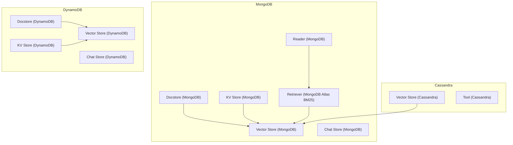
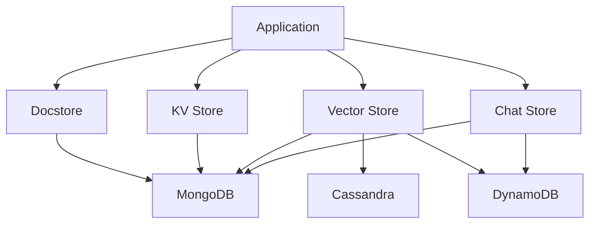
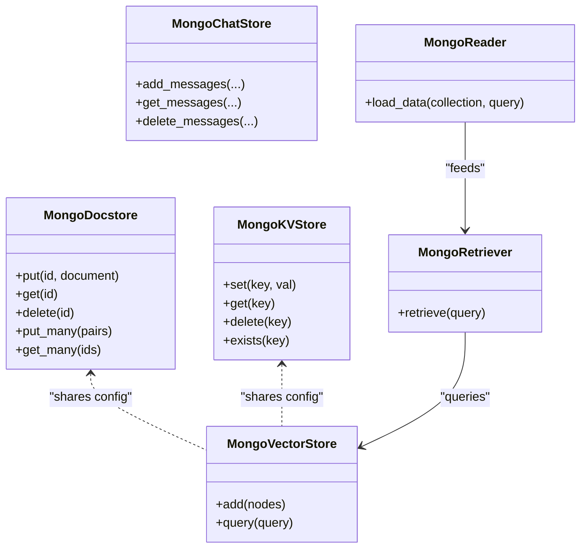
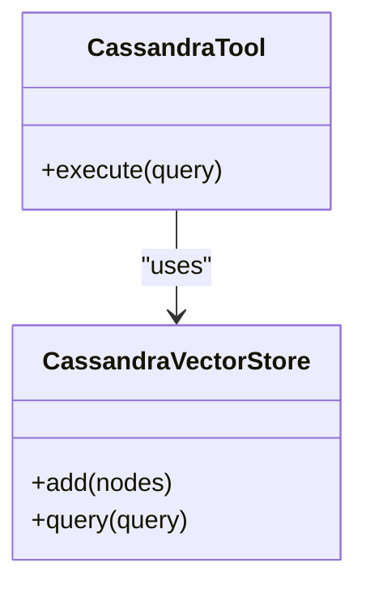
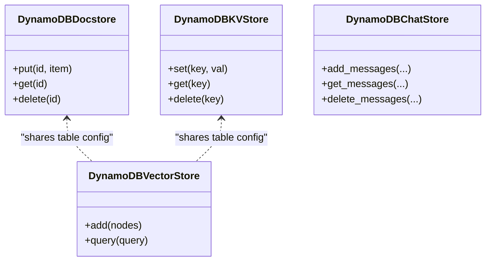
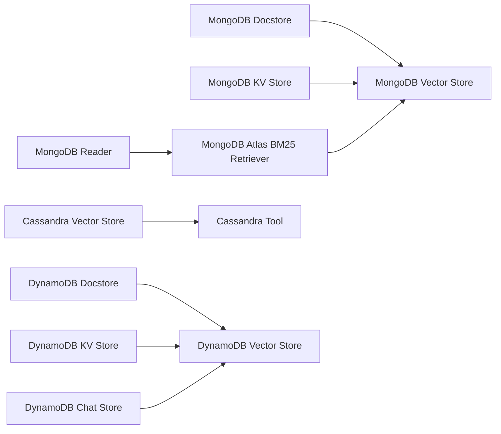

# NoSQL Databases

<cite>
**Referenced Files in This Document**
- [mongodb_docstore_base.py](file://llama-index-integrations/storage/docstore/llama-index-storage-docstore-mongodb/llama_index/storage/docstore/mongodb/base.py)
- [mongodb_kvstore_base.py](file://llama-index-integrations/storage/kvstore/llama-index-storage-kvstore-mongodb/llama_index/storage/kvstore/mongodb/base.py)
- [mongodb_vector_store_base.py](file://llama-index-integrations/vector_stores/llama-index-vector-stores-mongodb/llama_index/vector_stores/mongodb/base.py)
- [mongodb_chat_store_base.py](file://llama-index-integrations/storage/chat_store/llama-index-storage-chat-store-mongo/llama_index/storage/chat_store/mongo/base.py)
- [mongodb_reader_base.py](file://llama-index-integrations/readers/llama-index-readers-mongodb/llama_index/readers/mongodb/base.py)
- [mongodb_retriever_base.py](file://llama-index-integrations/retrievers/llama-index-retrievers-mongodb-atlas-bm25-retriever/llama_index/retrievers/mongodb_atlas_bm25/base.py)
- [mongodb_api_ref.md](file://docs/api_reference/api_reference/storage/docstore/mongodb.md)
- [mongodb_cookbook.md](file://docs/examples/cookbooks/mongodb_retrieval_strategies.ipynb)
- [cassandra_vs_base.py](file://llama-index-integrations/vector_stores/llama-index-vector-stores-cassandra/llama_index/vector_stores/cassandra/base.py)
- [cassandra_tool_base.py](file://llama-index-integrations/tools/llama-index-tools-cassandra/llama_index/tools/cassandra/cassandra_database_wrapper.py)
- [cassandra_api_ref.md](file://docs/api_reference/api_reference/storage/vector_store/cassandra.md)
- [dynamodb_docstore_base.py](file://llama-index-integrations/storage/docstore/llama-index-storage-docstore-dynamodb/llama_index/storage/docstore/dynamodb/base.py)
- [dynamodb_kvstore_base.py](file://llama-index-integrations/storage/kvstore/llama-index-storage-kvstore-dynamodb/llama_index/storage/kvstore/dynamodb/base.py)
- [dynamodb_vs_base.py](file://llama-index-integrations/vector_stores/llama-index-vector-stores-dynamodb/llama_index/vector_stores/dynamodb/base.py)
- [dynamodb_chat_store_base.py](file://llama-index-integrations/storage/chat_store/llama-index-storage-chat-store-dynamodb/llama_index/storage/chat_store/dynamodb/base.py)
- [dynamodb_api_ref.md](file://docs/api_reference/api_reference/storage/vector_store/dynamodb.md)
- [docstores_overview.md](file://docs/src/content/docs/framework/module_guides/storing/docstores.md)
</cite>

## Table of Contents
1. [Introduction](#introduction)
2. [Project Structure](#project-structure)
3. [Core Components](#core-components)
4. [Architecture Overview](#architecture-overview)
5. [Detailed Component Analysis](#detailed-component-analysis)
6. [Dependency Analysis](#dependency-analysis)
7. [Performance Considerations](#performance-considerations)
8. [Troubleshooting Guide](#troubleshooting-guide)
9. [Conclusion](#conclusion)

## Introduction
This document explains how LlamaIndex integrates with NoSQL databases through dedicated connectors for MongoDB, Cassandra, and DynamoDB. It covers connection configuration, query patterns, and practical usage for retrieving document collections, handling nested JSON, time-series data, and range queries. It also outlines performance considerations, indexing and partitioning strategies, and how these NoSQL stores integrate into LlamaIndex’s document processing pipeline.

## Project Structure
LlamaIndex provides official integrations under the storage, retrievers, readers, tools, and vector_stores namespaces. For each NoSQL provider, there are separate packages for:
- Document store: persistent storage of documents
- KV store: key-value operations
- Vector store: embedding-backed similarity search
- Chat store: conversational history persistence
- Reader: ingestion from external sources
- Retriever: retrieval strategies (e.g., MongoDB Atlas BM25)

**Diagram sources**
- [mongodb_docstore_base.py](file://llama-index-integrations/storage/docstore/llama-index-storage-docstore-mongodb/llama_index/storage/docstore/mongodb/base.py#L1-L200)
- [mongodb_kvstore_base.py](file://llama-index-integrations/storage/kvstore/llama-index-storage-kvstore-mongodb/llama_index/storage/kvstore/mongodb/base.py#L1-L200)
- [mongodb_vector_store_base.py](file://llama-index-integrations/vector_stores/llama-index-vector-stores-mongodb/llama_index/vector_stores/mongodb/base.py#L1-L200)
- [mongodb_chat_store_base.py](file://llama-index-integrations/storage/chat_store/llama-index-storage-chat-store-mongo/llama_index/storage/chat_store/mongo/base.py#L1-L200)
- [mongodb_reader_base.py](file://llama-index-integrations/readers/llama-index-readers-mongodb/llama_index/readers/mongodb/base.py#L1-L200)
- [mongodb_retriever_base.py](file://llama-index-integrations/retrievers/llama-index-retrievers-mongodb-atlas-bm25-retriever/llama_index/retrievers/mongodb_atlas_bm25/base.py#L1-L200)
- [cassandra_vs_base.py](file://llama-index-integrations/vector_stores/llama-index-vector-stores-cassandra/llama_index/vector_stores/cassandra/base.py#L1-L200)
- [cassandra_tool_base.py](file://llama-index-integrations/tools/llama-index-tools-cassandra/llama_index/tools/cassandra/cassandra_database_wrapper.py#L1-L200)
- [dynamodb_docstore_base.py](file://llama-index-integrations/storage/docstore/llama-index-storage-docstore-dynamodb/llama_index/storage/docstore/dynamodb/base.py#L1-L200)
- [dynamodb_kvstore_base.py](file://llama-index-integrations/storage/kvstore/llama-index-storage-kvstore-dynamodb/llama_index/storage/kvstore/dynamodb/base.py#L1-L200)
- [dynamodb_vs_base.py](file://llama-index-integrations/vector_stores/llama-index-vector-stores-dynamodb/llama_index/vector_stores/dynamodb/base.py#L1-L200)
- [dynamodb_chat_store_base.py](file://llama-index-integrations/storage/chat_store/llama-index-storage-chat-store-dynamodb/llama_index/storage/chat_store/dynamodb/base.py#L1-L200)

**Section sources**
- [mongodb_docstore_base.py](file://llama-index-integrations/storage/docstore/llama-index-storage-docstore-mongodb/llama_index/storage/docstore/mongodb/base.py#L1-L200)
- [mongodb_kvstore_base.py](file://llama-index-integrations/storage/kvstore/llama-index-storage-kvstore-mongodb/llama_index/storage/kvstore/mongodb/base.py#L1-L200)
- [mongodb_vector_store_base.py](file://llama-index-integrations/vector_stores/llama-index-vector-stores-mongodb/llama_index/vector_stores/mongodb/base.py#L1-L200)
- [mongodb_chat_store_base.py](file://llama-index-integrations/storage/chat_store/llama-index-storage-chat-store-mongo/llama_index/storage/chat_store/mongo/base.py#L1-L200)
- [mongodb_reader_base.py](file://llama-index-integrations/readers/llama-index-readers-mongodb/llama_index/readers/mongodb/base.py#L1-L200)
- [mongodb_retriever_base.py](file://llama-index-integrations/retrievers/llama-index-retrievers-mongodb-atlas-bm25-retriever/llama_index/retrievers/mongodb_atlas_bm25/base.py#L1-L200)
- [cassandra_vs_base.py](file://llama-index-integrations/vector_stores/llama-index-vector-stores-cassandra/llama_index/vector_stores/cassandra/base.py#L1-L200)
- [cassandra_tool_base.py](file://llama-index-integrations/tools/llama-index-tools-cassandra/llama_index/tools/cassandra/cassandra_database_wrapper.py#L1-L200)
- [dynamodb_docstore_base.py](file://llama-index-integrations/storage/docstore/llama-index-storage-docstore-dynamodb/llama_index/storage/docstore/dynamodb/base.py#L1-L200)
- [dynamodb_kvstore_base.py](file://llama-index-integrations/storage/kvstore/llama-index-storage-kvstore-dynamodb/llama_index/storage/kvstore/dynamodb/base.py#L1-L200)
- [dynamodb_vs_base.py](file://llama-index-integrations/vector_stores/llama-index-vector-stores-dynamodb/llama_index/vector_stores/dynamodb/base.py#L1-L200)
- [dynamodb_chat_store_base.py](file://llama-index-integrations/storage/chat_store/llama-index-storage-chat-store-dynamodb/llama_index/storage/chat_store/dynamodb/base.py#L1-L200)

## Core Components
- MongoDB
  - Docstore: stores documents with support for nested JSON and metadata.
  - KV Store: key-value operations for arbitrary payloads.
  - Vector Store: embedding-backed similarity search with collection-level configuration.
  - Chat Store: conversation history persistence.
  - Reader: ingests data from MongoDB collections.
  - Retriever: MongoDB Atlas BM25-based retrieval.
- Cassandra
  - Vector Store: CQL-based vector search and similarity.
  - Tool: wraps Cassandra operations for tool usage.
- DynamoDB
  - Docstore: document persistence with partitioning-friendly keys.
  - KV Store: key-value operations optimized for DynamoDB’s model.
  - Vector Store: embedding-backed search with GSI/LSI considerations.
  - Chat Store: conversation history persistence.

**Section sources**
- [mongodb_docstore_base.py](file://llama-index-integrations/storage/docstore/llama-index-storage-docstore-mongodb/llama_index/storage/docstore/mongodb/base.py#L1-L200)
- [mongodb_kvstore_base.py](file://llama-index-integrations/storage/kvstore/llama-index-storage-kvstore-mongodb/llama_index/storage/kvstore/mongodb/base.py#L1-L200)
- [mongodb_vector_store_base.py](file://llama-index-integrations/vector_stores/llama-index-vector-stores-mongodb/llama_index/vector_stores/mongodb/base.py#L1-L200)
- [mongodb_chat_store_base.py](file://llama-index-integrations/storage/chat_store/llama-index-storage-chat-store-mongo/llama_index/storage/chat_store/mongo/base.py#L1-L200)
- [mongodb_reader_base.py](file://llama-index-integrations/readers/llama-index-readers-mongodb/llama_index/readers/mongodb/base.py#L1-L200)
- [mongodb_retriever_base.py](file://llama-index-integrations/retrievers/llama-index-retrievers-mongodb-atlas-bm25-retriever/llama_index/retrievers/mongodb_atlas_bm25/base.py#L1-L200)
- [cassandra_vs_base.py](file://llama-index-integrations/vector_stores/llama-index-vector-stores-cassandra/llama_index/vector_stores/cassandra/base.py#L1-L200)
- [cassandra_tool_base.py](file://llama-index-integrations/tools/llama-index-tools-cassandra/llama_index/tools/cassandra/cassandra_database_wrapper.py#L1-L200)
- [dynamodb_docstore_base.py](file://llama-index-integrations/storage/docstore/llama-index-storage-docstore-dynamodb/llama_index/storage/docstore/dynamodb/base.py#L1-L200)
- [dynamodb_kvstore_base.py](file://llama-index-integrations/storage/kvstore/llama-index-storage-kvstore-dynamodb/llama_index/storage/kvstore/dynamodb/base.py#L1-L200)
- [dynamodb_vs_base.py](file://llama-index-integrations/vector_stores/llama-index-vector-stores-dynamodb/llama_index/vector_stores/dynamodb/base.py#L1-L200)
- [dynamodb_chat_store_base.py](file://llama-index-integrations/storage/chat_store/llama-index-storage-chat-store-dynamodb/llama_index/storage/chat_store/dynamodb/base.py#L1-L200)

## Architecture Overview
The connectors expose consistent APIs for document, key-value, vector, and chat persistence. They translate LlamaIndex abstractions into provider-specific operations.

**Diagram sources**
- [mongodb_docstore_base.py](file://llama-index-integrations/storage/docstore/llama-index-storage-docstore-mongodb/llama_index/storage/docstore/mongodb/base.py#L1-L200)
- [mongodb_kvstore_base.py](file://llama-index-integrations/storage/kvstore/llama-index-storage-kvstore-mongodb/llama_index/storage/kvstore/mongodb/base.py#L1-L200)
- [mongodb_vector_store_base.py](file://llama-index-integrations/vector_stores/llama-index-vector-stores-mongodb/llama_index/vector_stores/mongodb/base.py#L1-L200)
- [mongodb_chat_store_base.py](file://llama-index-integrations/storage/chat_store/llama-index-storage-chat-store-mongo/llama_index/storage/chat_store/mongo/base.py#L1-L200)
- [cassandra_vs_base.py](file://llama-index-integrations/vector_stores/llama-index-vector-stores-cassandra/llama_index/vector_stores/cassandra/base.py#L1-L200)
- [dynamodb_docstore_base.py](file://llama-index-integrations/storage/docstore/llama-index-storage-docstore-dynamodb/llama_index/storage/docstore/dynamodb/base.py#L1-L200)
- [dynamodb_kvstore_base.py](file://llama-index-integrations/storage/kvstore/llama-index-storage-kvstore-dynamodb/llama_index/storage/kvstore/dynamodb/base.py#L1-L200)
- [dynamodb_vs_base.py](file://llama-index-integrations/vector_stores/llama-index-vector-stores-dynamodb/llama_index/vector_stores/dynamodb/base.py#L1-L200)
- [dynamodb_chat_store_base.py](file://llama-index-integrations/storage/chat_store/llama-index-storage-chat-store-dynamodb/llama_index/storage/chat_store/dynamodb/base.py#L1-L200)

## Detailed Component Analysis

### MongoDB Integration
MongoDB connectors provide:
- Docstore: supports nested JSON documents and metadata; retrieval via filters and projections.
- KV Store: flexible key-value mapping suitable for arbitrary payloads.
- Vector Store: embedding similarity search with collection configuration.
- Chat Store: conversation history stored as documents.
- Reader: ingestion from MongoDB collections.
- Retriever: MongoDB Atlas BM25 retrieval for hybrid search.

**Diagram sources**
- [mongodb_docstore_base.py](file://llama-index-integrations/storage/docstore/llama-index-storage-docstore-mongodb/llama_index/storage/docstore/mongodb/base.py#L1-L200)
- [mongodb_kvstore_base.py](file://llama-index-integrations/storage/kvstore/llama-index-storage-kvstore-mongodb/llama_index/storage/kvstore/mongodb/base.py#L1-L200)
- [mongodb_vector_store_base.py](file://llama-index-integrations/vector_stores/llama-index-vector-stores-mongodb/llama_index/vector_stores/mongodb/base.py#L1-L200)
- [mongodb_chat_store_base.py](file://llama-index-integrations/storage/chat_store/llama-index-storage-chat-store-mongo/llama_index/storage/chat_store/mongo/base.py#L1-L200)
- [mongodb_reader_base.py](file://llama-index-integrations/readers/llama-index-readers-mongodb/llama_index/readers/mongodb/base.py#L1-L200)
- [mongodb_retriever_base.py](file://llama-index-integrations/retrievers/llama-index-retrievers-mongodb-atlas-bm25-retriever/llama_index/retrievers/mongodb_atlas_bm25/base.py#L1-L200)

Key usage patterns:
- Retrieving document collections: use the reader to load data from a collection with optional filters.
- Handling nested JSON: documents are stored as-is; nested fields can be queried via dot notation.
- Time-series data: store timestamps as native date types; query with date-range filters.
- Range queries: leverage MongoDB’s comparison operators and aggregation pipelines for advanced filtering.

Connection configuration highlights:
- Authentication: username/password or URI-based connections.
- Cluster setup: replica set or sharded cluster URIs.
- SSL/TLS: enable TLS via URI parameters or client options.

**Section sources**
- [mongodb_docstore_base.py](file://llama-index-integrations/storage/docstore/llama-index-storage-docstore-mongodb/llama_index/storage/docstore/mongodb/base.py#L1-L200)
- [mongodb_kvstore_base.py](file://llama-index-integrations/storage/kvstore/llama-index-storage-kvstore-mongodb/llama_index/storage/kvstore/mongodb/base.py#L1-L200)
- [mongodb_vector_store_base.py](file://llama-index-integrations/vector_stores/llama-index-vector-stores-mongodb/llama_index/vector_stores/mongodb/base.py#L1-L200)
- [mongodb_chat_store_base.py](file://llama-index-integrations/storage/chat_store/llama-index-storage-chat-store-mongo/llama_index/storage/chat_store/mongo/base.py#L1-L200)
- [mongodb_reader_base.py](file://llama-index-integrations/readers/llama-index-readers-mongodb/llama_index/readers/mongodb/base.py#L1-L200)
- [mongodb_retriever_base.py](file://llama-index-integrations/retrievers/llama-index-retrievers-mongodb-atlas-bm25-retriever/llama_index/retrievers/mongodb_atlas_bm25/base.py#L1-L200)
- [mongodb_api_ref.md](file://docs/api_reference/api_reference/storage/docstore/mongodb.md#L1-L200)
- [mongodb_cookbook.md](file://docs/examples/cookbooks/mongodb_retrieval_strategies.ipynb#L1-L200)

### Cassandra Integration
Cassandra connectors provide:
- Vector Store: CQL-based vector search and similarity ranking.
- Tool: wraps Cassandra operations for tool usage.

**Diagram sources**
- [cassandra_vs_base.py](file://llama-index-integrations/vector_stores/llama-index-vector-stores-cassandra/llama_index/vector_stores/cassandra/base.py#L1-L200)
- [cassandra_tool_base.py](file://llama-index-integrations/tools/llama-index-tools-cassandra/llama_index/tools/cassandra/cassandra_database_wrapper.py#L1-L200)

Key usage patterns:
- Retrieving document collections: use CQL SELECT statements with appropriate WHERE clauses.
- Handling nested JSON: store compact JSON strings or normalize into table columns depending on query patterns.
- Time-series data: model by time-based partition keys and clustering columns.
- Range queries: leverage CQL range scans with proper partitioning.

Connection configuration highlights:
- Authentication: SASL mechanisms and credentials.
- Cluster setup: contact points and load balancing policies.
- SSL/TLS: enable encryption for secure connections.

**Section sources**
- [cassandra_vs_base.py](file://llama-index-integrations/vector_stores/llama-index-vector-stores-cassandra/llama_index/vector_stores/cassandra/base.py#L1-L200)
- [cassandra_tool_base.py](file://llama-index-integrations/tools/llama-index-tools-cassandra/llama_index/tools/cassandra/cassandra_database_wrapper.py#L1-L200)
- [cassandra_api_ref.md](file://docs/api_reference/api_reference/storage/vector_store/cassandra.md#L1-L200)

### DynamoDB Integration
DynamoDB connectors provide:
- Docstore: document persistence with partition and sort key design.
- KV Store: key-value operations optimized for DynamoDB’s model.
- Vector Store: embedding-backed search with GSI/LI considerations.
- Chat Store: conversation history persistence.

**Diagram sources**
- [dynamodb_docstore_base.py](file://llama-index-integrations/storage/docstore/llama-index-storage-docstore-dynamodb/llama_index/storage/docstore/dynamodb/base.py#L1-L200)
- [dynamodb_kvstore_base.py](file://llama-index-integrations/storage/kvstore/llama-index-storage-kvstore-dynamodb/llama_index/storage/kvstore/dynamodb/base.py#L1-L200)
- [dynamodb_vs_base.py](file://llama-index-integrations/vector_stores/llama-index-vector-stores-dynamodb/llama_index/vector_stores/dynamodb/base.py#L1-L200)
- [dynamodb_chat_store_base.py](file://llama-index-integrations/storage/chat_store/llama-index-storage-chat-store-dynamodb/llama_index/storage/chat_store/dynamodb/base.py#L1-L200)

Key usage patterns:
- Retrieving document collections: use Scan or Query with filter expressions.
- Handling nested JSON: store as DynamoDB JSON values or flatten into attributes.
- Time-series data: use composite keys with timestamp as sort key.
- Range queries: use Query with KeyConditionExpression and FilterExpression.

Connection configuration highlights:
- Authentication: AWS credentials and region configuration.
- Cluster setup: endpoint configuration for local/emulators if applicable.
- SSL/TLS: enabled by default via boto3 clients.

**Section sources**
- [dynamodb_docstore_base.py](file://llama-index-integrations/storage/docstore/llama-index-storage-docstore-dynamodb/llama_index/storage/docstore/dynamodb/base.py#L1-L200)
- [dynamodb_kvstore_base.py](file://llama-index-integrations/storage/kvstore/llama-index-storage-kvstore-dynamodb/llama_index/storage/kvstore/dynamodb/base.py#L1-L200)
- [dynamodb_vs_base.py](file://llama-index-integrations/vector_stores/llama-index-vector-stores-dynamodb/llama_index/vector_stores/dynamodb/base.py#L1-L200)
- [dynamodb_chat_store_base.py](file://llama-index-integrations/storage/chat_store/llama-index-storage-chat-store-dynamodb/llama_index/storage/chat_store/dynamodb/base.py#L1-L200)
- [dynamodb_api_ref.md](file://docs/api_reference/api_reference/storage/vector_store/dynamodb.md#L1-L200)

## Dependency Analysis
- MongoDB
  - Docstore depends on PyMongo-style collection operations.
  - KV Store depends on collection-level key mapping.
  - Vector Store depends on collection configuration and index setup.
  - Reader and Retriever depend on Atlas Search or aggregation pipelines.
- Cassandra
  - Vector Store depends on CQL schema and UDTs for vectors.
  - Tool depends on cqlsh-compatible query execution.
- DynamoDB
  - Docstore/KV Store depend on table schema and GSI/LSI.
  - Vector Store depends on vector attribute names and index configuration.

**Diagram sources**
- [mongodb_docstore_base.py](file://llama-index-integrations/storage/docstore/llama-index-storage-docstore-mongodb/llama_index/storage/docstore/mongodb/base.py#L1-L200)
- [mongodb_kvstore_base.py](file://llama-index-integrations/storage/kvstore/llama-index-storage-kvstore-mongodb/llama_index/storage/kvstore/mongodb/base.py#L1-L200)
- [mongodb_vector_store_base.py](file://llama-index-integrations/vector_stores/llama-index-vector-stores-mongodb/llama_index/vector_stores/mongodb/base.py#L1-L200)
- [mongodb_reader_base.py](file://llama-index-integrations/readers/llama-index-readers-mongodb/llama_index/readers/mongodb/base.py#L1-L200)
- [mongodb_retriever_base.py](file://llama-index-integrations/retrievers/llama-index-retrievers-mongodb-atlas-bm25-retriever/llama_index/retrievers/mongodb_atlas_bm25/base.py#L1-L200)
- [cassandra_vs_base.py](file://llama-index-integrations/vector_stores/llama-index-vector-stores-cassandra/llama_index/vector_stores/cassandra/base.py#L1-L200)
- [cassandra_tool_base.py](file://llama-index-integrations/tools/llama-index-tools-cassandra/llama_index/tools/cassandra/cassandra_database_wrapper.py#L1-L200)
- [dynamodb_docstore_base.py](file://llama-index-integrations/storage/docstore/llama-index-storage-docstore-dynamodb/llama_index/storage/docstore/dynamodb/base.py#L1-L200)
- [dynamodb_kvstore_base.py](file://llama-index-integrations/storage/kvstore/llama-index-storage-kvstore-dynamodb/llama_index/storage/kvstore/dynamodb/base.py#L1-L200)
- [dynamodb_vs_base.py](file://llama-index-integrations/vector_stores/llama-index-vector-stores-dynamodb/llama_index/vector_stores/dynamodb/base.py#L1-L200)
- [dynamodb_chat_store_base.py](file://llama-index-integrations/storage/chat_store/llama-index-storage-chat-store-dynamodb/llama_index/storage/chat_store/dynamodb/base.py#L1-L200)

**Section sources**
- [mongodb_docstore_base.py](file://llama-index-integrations/storage/docstore/llama-index-storage-docstore-mongodb/llama_index/storage/docstore/mongodb/base.py#L1-L200)
- [mongodb_kvstore_base.py](file://llama-index-integrations/storage/kvstore/llama-index-storage-kvstore-mongodb/llama_index/storage/kvstore/mongodb/base.py#L1-L200)
- [mongodb_vector_store_base.py](file://llama-index-integrations/vector_stores/llama-index-vector-stores-mongodb/llama_index/vector_stores/mongodb/base.py#L1-L200)
- [mongodb_reader_base.py](file://llama-index-integrations/readers/llama-index-readers-mongodb/llama_index/readers/mongodb/base.py#L1-L200)
- [mongodb_retriever_base.py](file://llama-index-integrations/retrievers/llama-index-retrievers-mongodb-atlas-bm25-retriever/llama_index/retrievers/mongodb_atlas_bm25/base.py#L1-L200)
- [cassandra_vs_base.py](file://llama-index-integrations/vector_stores/llama-index-vector-stores-cassandra/llama_index/vector_stores/cassandra/base.py#L1-L200)
- [cassandra_tool_base.py](file://llama-index-integrations/tools/llama-index-tools-cassandra/llama_index/tools/cassandra/cassandra_database_wrapper.py#L1-L200)
- [dynamodb_docstore_base.py](file://llama-index-integrations/storage/docstore/llama-index-storage-docstore-dynamodb/llama_index/storage/docstore/dynamodb/base.py#L1-L200)
- [dynamodb_kvstore_base.py](file://llama-index-integrations/storage/kvstore/llama-index-storage-kvstore-dynamodb/llama_index/storage/kvstore/dynamodb/base.py#L1-L200)
- [dynamodb_vs_base.py](file://llama-index-integrations/vector_stores/llama-index-vector-stores-dynamodb/llama_index/vector_stores/dynamodb/base.py#L1-L200)
- [dynamodb_chat_store_base.py](file://llama-index-integrations/storage/chat_store/llama-index-storage-chat-store-dynamodb/llama_index/storage/chat_store/dynamodb/base.py#L1-L200)

## Performance Considerations
- Indexing strategies
  - MongoDB: create compound indexes on frequently filtered fields and text indexes for Atlas Search; ensure vector index alignment with embedding dimensions.
  - Cassandra: choose partition keys to distribute load evenly; use appropriate clustering order for time-series.
  - DynamoDB: provisioned throughput with GSI/LSI aligned to query patterns; optimize for read/write capacity units.
- Partitioning schemes
  - MongoDB: shard by partition key; use hashed or ranged sharding depending on workload.
  - Cassandra: partition by time or entity ID; avoid hotspots.
  - DynamoDB: use composite keys to minimize hot partitions.
- Read/write consistency levels
  - MongoDB: majority write concern; eventual consistency for reads.
  - Cassandra: tunable consistency (ONE/QUORUM/SERIALIZABLE); trade-off between latency and consistency.
  - DynamoDB: eventually consistent reads by default; strongly consistent reads when needed.
- Data modeling patterns
  - Prefer flattened schemas for frequent queries; denormalize selectively for read-heavy workloads.
  - Use time-based partitioning for time-series data.
  - Normalize nested JSON only when updates occur at nested granularity.

[No sources needed since this section provides general guidance]

## Troubleshooting Guide
Common issues and resolutions:
- Authentication failures
  - Verify credentials and IAM permissions for DynamoDB.
  - Confirm TLS settings and CA bundles for MongoDB and Cassandra.
- Connection timeouts
  - Increase socket timeouts and retry policies.
  - Use connection pooling and keep-alive settings.
- Query performance
  - Add missing indexes for filters and sort keys.
  - Optimize aggregation pipelines and CQL queries.
- Data shape mismatches
  - Ensure embedding dimensions match vector index configuration.
  - Validate JSON schema compatibility across stores.

**Section sources**
- [mongodb_docstore_base.py](file://llama-index-integrations/storage/docstore/llama-index-storage-docstore-mongodb/llama_index/storage/docstore/mongodb/base.py#L1-L200)
- [mongodb_vector_store_base.py](file://llama-index-integrations/vector_stores/llama-index-vector-stores-mongodb/llama_index/vector_stores/mongodb/base.py#L1-L200)
- [cassandra_vs_base.py](file://llama-index-integrations/vector_stores/llama-index-vector-stores-cassandra/llama_index/vector_stores/cassandra/base.py#L1-L200)
- [dynamodb_vs_base.py](file://llama-index-integrations/vector_stores/llama-index-vector-stores-dynamodb/llama_index/vector_stores/dynamodb/base.py#L1-L200)

## Conclusion
LlamaIndex’s NoSQL connectors offer robust, provider-specific integrations for document, key-value, vector, and chat persistence. By aligning data models with provider strengths—aggregation pipelines for MongoDB, CQL for Cassandra, and GSI/LSI for DynamoDB—you can build scalable retrieval and RAG systems. Proper indexing, partitioning, and consistency tuning are essential for production-grade performance.