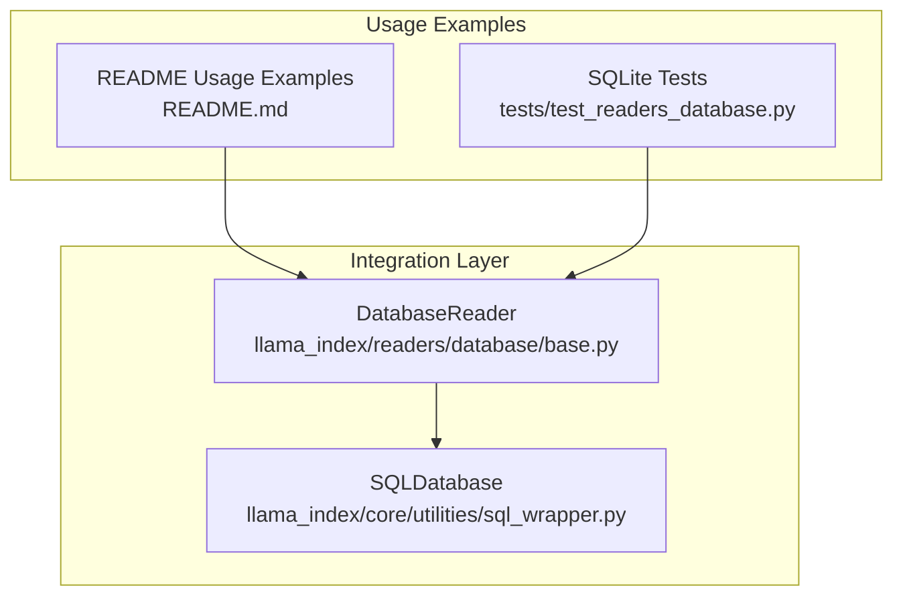
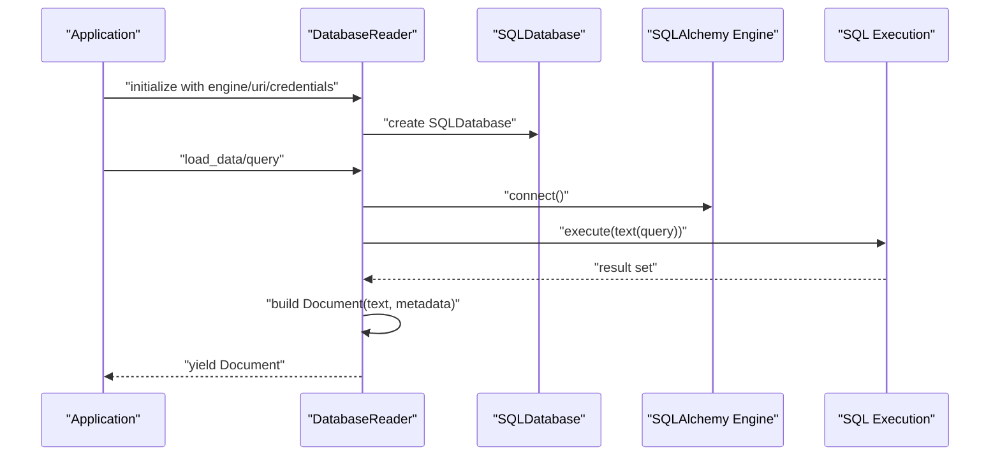
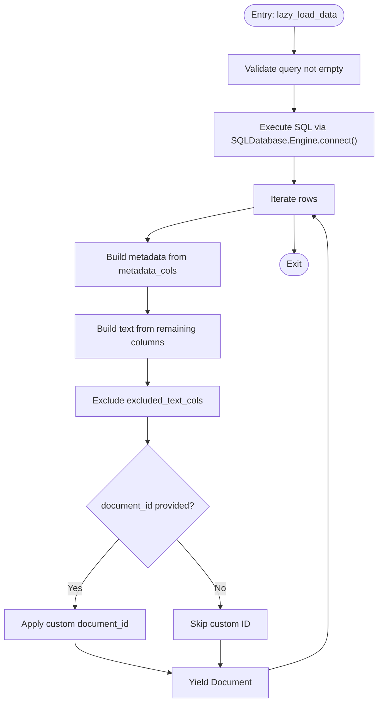
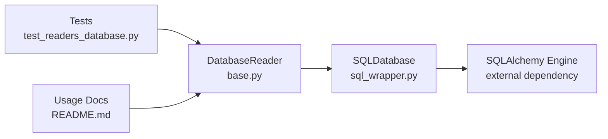

# Relational Databases

<cite>
**Referenced Files in This Document**
- [base.py](file://llama-index-integrations/readers/llama-index-readers-database/llama_index/readers/database/base.py)
- [README.md](file://llama-index-integrations/readers/llama-index-readers-database/README.md)
- [test_readers_database.py](file://llama-index-integrations/readers/llama-index-readers-database/tests/test_readers_database.py)
- [sql_wrapper.py](file://llama-index-core/llama_index/core/utilities/sql_wrapper.py)
- [test_sql_wrapper.py](file://llama-index-core/tests/utilities/test_sql_wrapper.py)
- [database.md](file://docs/api_reference/api_reference/readers/database.md)
- [database.md](file://docs/api_reference/api_reference/tools/database.md)
</cite>

## Table of Contents
1. [Introduction](#introduction)
2. [Project Structure](#project-structure)
3. [Core Components](#core-components)
4. [Architecture Overview](#architecture-overview)
5. [Detailed Component Analysis](#detailed-component-analysis)
6. [Dependency Analysis](#dependency-analysis)
7. [Performance Considerations](#performance-considerations)
8. [Troubleshooting Guide](#troubleshooting-guide)
9. [Conclusion](#conclusion)
10. [Appendices](#appendices)

## Introduction
This document explains how to integrate relational databases with LlamaIndex using the Database Reader and related utilities. It covers connection patterns (SQLAlchemy Engine, connection URIs, and discrete credentials), authentication and SSL considerations, connection pooling, SQL execution patterns, parameter binding, result handling, and practical usage patterns for querying tables, filtering with WHERE clauses, and pagination. It also provides guidance on performance optimization, database-specific features, and troubleshooting.

## Project Structure
The relational database integration centers around a dedicated reader and shared SQL utilities:
- Reader: DatabaseReader for querying relational databases and producing LlamaIndex Documents
- Utilities: SQLDatabase wrapper for connection management and dialect support
- Tests: SQLite-based tests validating basic loading, metadata mapping, exclusions, and async behavior

**Diagram sources**
- [base.py](file://llama-index-integrations/readers/llama-index-readers-database/llama_index/readers/database/base.py#L26-L246)
- [sql_wrapper.py](file://llama-index-core/llama_index/core/utilities/sql_wrapper.py)
- [README.md](file://llama-index-integrations/readers/llama-index-readers-database/README.md#L1-L89)
- [test_readers_database.py](file://llama-index-integrations/readers/llama-index-readers-database/tests/test_readers_database.py#L1-L145)

**Section sources**
- [base.py](file://llama-index-integrations/readers/llama-index-readers-database/llama_index/readers/database/base.py#L1-L246)
- [README.md](file://llama-index-integrations/readers/llama-index-readers-database/README.md#L1-L89)
- [test_readers_database.py](file://llama-index-integrations/readers/llama-index-readers-database/tests/test_readers_database.py#L1-L145)
- [sql_wrapper.py](file://llama-index-core/llama_index/core/utilities/sql_wrapper.py)
- [database.md](file://docs/api_reference/api_reference/readers/database.md#L1-L4)
- [database.md](file://docs/api_reference/api_reference/tools/database.md#L1-L4)

## Core Components
- DatabaseReader: A reader that accepts a SQLDatabase, SQLAlchemy Engine, connection URI, or discrete credentials. It executes SQL queries and yields Documents with configurable metadata and text content.
- SQLDatabase: A wrapper that encapsulates SQLAlchemy connectivity and dialect support, enabling unified connection handling across drivers.

Key capabilities:
- Connection modes: prebuilt SQLDatabase, Engine, URI, or scheme/host/port/user/password/dbname
- Lazy streaming via lazy_load_data and async via aload_data
- Metadata mapping and text exclusions per column
- Custom document ID generation from row data

**Section sources**
- [base.py](file://llama-index-integrations/readers/llama-index-readers-database/llama_index/readers/database/base.py#L26-L246)
- [README.md](file://llama-index-integrations/readers/llama-index-readers-database/README.md#L1-L89)
- [sql_wrapper.py](file://llama-index-core/llama_index/core/utilities/sql_wrapper.py)

## Architecture Overview
The DatabaseReader composes a SQLDatabase for connectivity and executes SQL queries against the target database. It streams results and constructs Documents with optional metadata and text content.

**Diagram sources**
- [base.py](file://llama-index-integrations/readers/llama-index-readers-database/llama_index/readers/database/base.py#L132-L246)
- [sql_wrapper.py](file://llama-index-core/llama_index/core/utilities/sql_wrapper.py)

## Detailed Component Analysis

### DatabaseReader
Responsibilities:
- Accept multiple connection forms (SQLDatabase, Engine, URI, or discrete credentials)
- Execute SQL queries and stream results
- Build Documents with configurable metadata and text content
- Support async and lazy loading

Connection modes and behavior:
- Prebuilt SQLDatabase: Honors schema if present on the object
- Engine: Creates SQLDatabase with optional schema
- URI: Uses SQLDatabase.from_uri with optional schema
- Discrete credentials: Builds a URI and calls from_uri with optional schema
- Schema handling: Only honored when constructing a new SQLDatabase internally

Execution pipeline:
- Validates non-empty query
- Executes via SQLAlchemy text(query)
- Iterates over rows and builds metadata and text content
- Applies excluded text columns and metadata column mapping
- Supports custom document_id derived from row data

**Diagram sources**
- [base.py](file://llama-index-integrations/readers/llama-index-readers-database/llama_index/readers/database/base.py#L132-L246)

**Section sources**
- [base.py](file://llama-index-integrations/readers/llama-index-readers-database/llama_index/readers/database/base.py#L26-L246)
- [README.md](file://llama-index-integrations/readers/llama-index-readers-database/README.md#L23-L89)

### SQLDatabase Wrapper
- Provides unified connection handling across SQLAlchemy engines and dialects
- Used internally by DatabaseReader to manage connections and schema
- Enables from_uri creation and Engine wrapping

Operational notes:
- Connection reuse is implicit through the Engine lifecycle
- Schema selection is honored when constructing SQLDatabase from external parameters

**Section sources**
- [sql_wrapper.py](file://llama-index-core/llama_index/core/utilities/sql_wrapper.py)
- [base.py](file://llama-index-integrations/readers/llama-index-readers-database/llama_index/readers/database/base.py#L114-L130)

### API Reference Pointers
- Reader API: DatabaseReader
- Tool API: DatabaseToolSpec

**Section sources**
- [database.md](file://docs/api_reference/api_reference/readers/database.md#L1-L4)
- [database.md](file://docs/api_reference/api_reference/tools/database.md#L1-L4)

## Dependency Analysis
- DatabaseReader depends on SQLDatabase for connectivity and dialect support
- SQLDatabase relies on SQLAlchemy Engine and text() for query execution
- Tests demonstrate SQLite usage with URI and Engine patterns

**Diagram sources**
- [base.py](file://llama-index-integrations/readers/llama-index-readers-database/llama_index/readers/database/base.py#L17-L21)
- [sql_wrapper.py](file://llama-index-core/llama_index/core/utilities/sql_wrapper.py)
- [test_readers_database.py](file://llama-index-integrations/readers/llama-index-readers-database/tests/test_readers_database.py#L1-L145)
- [README.md](file://llama-index-integrations/readers/llama-index-readers-database/README.md#L1-L89)

**Section sources**
- [base.py](file://llama-index-integrations/readers/llama-index-readers-database/llama_index/readers/database/base.py#L17-L21)
- [sql_wrapper.py](file://llama-index-core/llama_index/core/utilities/sql_wrapper.py)
- [test_readers_database.py](file://llama-index-integrations/readers/llama-index-readers-database/tests/test_readers_database.py#L1-L145)
- [README.md](file://llama-index-integrations/readers/llama-index-readers-database/README.md#L1-L89)

## Performance Considerations
- Connection reuse: Leverage a single Engine/SQLDatabase instance across reads to minimize overhead
- Streaming: Use lazy_load_data to process results incrementally and reduce memory footprint
- Batch processing: For bulk writes or updates, group operations and commit in batches; note that the reader focuses on SELECT queries
- Query indexing: Ensure appropriate indexes on columns frequently used in WHERE clauses and JOIN keys
- Pagination: Use LIMIT and OFFSET for large result sets; consider cursor-based pagination for ordered datasets
- Parameter binding: Use bound parameters in queries to avoid re-parsing and potential injection risks
- Metadata minimization: Exclude non-essential columns from text content to reduce token usage

[No sources needed since this section provides general guidance]

## Troubleshooting Guide
Common issues and resolutions:
- Empty query: The reader raises an error if no query is provided
- Missing columns in metadata mapping: Warnings are logged when specified metadata columns are absent from the result set
- Invalid metadata items: Non-string tuples or malformed entries are skipped with warnings
- Custom document_id failures: Exceptions are caught and logged; ensure the function returns a string
- Connection errors: Verify credentials, URI format, and network access; confirm the target database is reachable
- Timeout handling: Configure SQLAlchemy pool and statement timeouts at the Engine level; adjust query complexity or add indexes
- Large result sets: Use LIMIT/OFFSET or streaming to avoid memory pressure

Validation and behavior are demonstrated in tests using an in-memory SQLite database.

**Section sources**
- [base.py](file://llama-index-integrations/readers/llama-index-readers-database/llama_index/readers/database/base.py#L175-L246)
- [test_readers_database.py](file://llama-index-integrations/readers/llama-index-readers-database/tests/test_readers_database.py#L84-L145)

## Conclusion
The DatabaseReader provides a flexible, efficient pathway to ingest relational data into LlamaIndex. By supporting multiple connection modes, streaming, and customizable metadata/text composition, it accommodates diverse relational schemas and workloads. Combined with SQLDatabase’s unified connectivity and SQLAlchemy’s robust execution model, it enables scalable and maintainable data retrieval patterns.

[No sources needed since this section summarizes without analyzing specific files]

## Appendices

### Connection Patterns and Authentication
- Connection via SQLDatabase: Pass a preconfigured object; schema is honored if present
- Connection via Engine: Supply an Engine; optional schema can be provided
- Connection via URI: Provide a full connection URI; optional schema can be provided
- Connection via discrete credentials: Provide scheme, host, port, user, password, dbname; a URI is constructed internally
- Authentication and SSL: Configure SSL parameters at the Engine level; pass credentials securely and avoid embedding secrets in code

**Section sources**
- [base.py](file://llama-index-integrations/readers/llama-index-readers-database/llama_index/readers/database/base.py#L71-L88)
- [base.py](file://llama-index-integrations/readers/llama-index-readers-database/llama_index/readers/database/base.py#L114-L130)

### SQL Query Execution and Result Handling
- Query execution: Queries are executed via SQLAlchemy text(query) using the underlying Engine
- Parameter binding: Use bound parameters in application code; the reader executes the prepared statement
- Result handling: Rows are iterated and transformed into Documents with configurable metadata and text content
- Metadata mapping: Map DB columns to metadata keys and optionally rename them
- Text exclusions: Exclude specific columns from the Document text content

**Section sources**
- [base.py](file://llama-index-integrations/readers/llama-index-readers-database/llama_index/readers/database/base.py#L175-L246)

### Practical Usage Patterns
- Querying relational tables: Use SELECT statements; apply WHERE clauses for filtering
- JOIN operations: Compose JOIN queries as needed; ensure proper indexes on join keys
- Pagination: Use LIMIT and OFFSET for controlled fetching; iterate through pages
- Example patterns: Refer to the README usage examples for URI-based initialization, schema selection, metadata mapping, and streaming

**Section sources**
- [README.md](file://llama-index-integrations/readers/llama-index-readers-database/README.md#L23-L89)

### Testing and Validation
- SQLite in-memory database: Demonstrates table creation, insertion, and query execution
- Behavior coverage: Tests validate basic loading, metadata mapping, text exclusions, custom document IDs, and async loading

**Section sources**
- [test_readers_database.py](file://llama-index-integrations/readers/llama-index-readers-database/tests/test_readers_database.py#L15-L58)
- [test_readers_database.py](file://llama-index-integrations/readers/llama-index-readers-database/tests/test_readers_database.py#L84-L145)