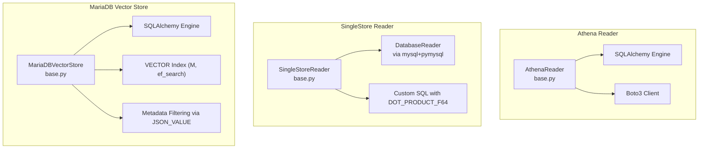
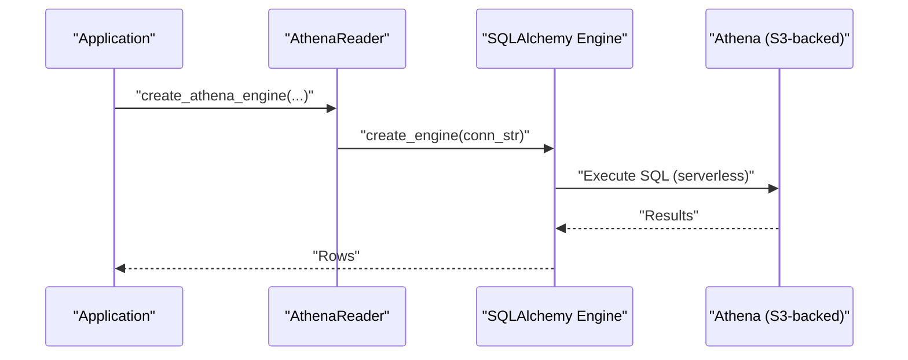
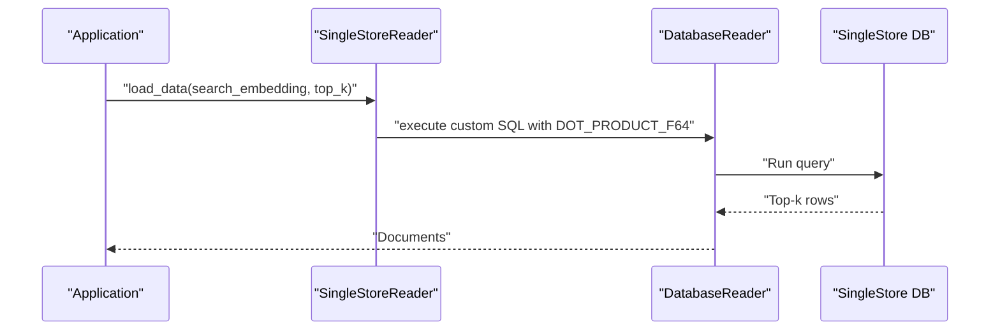
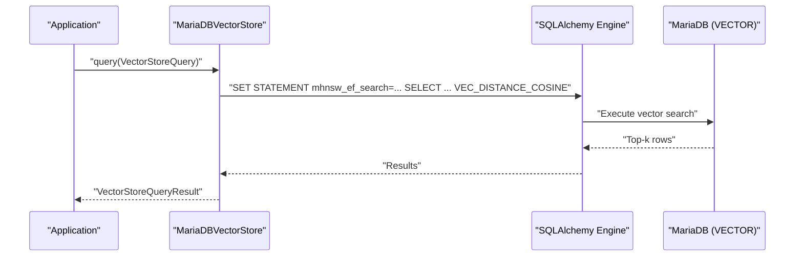
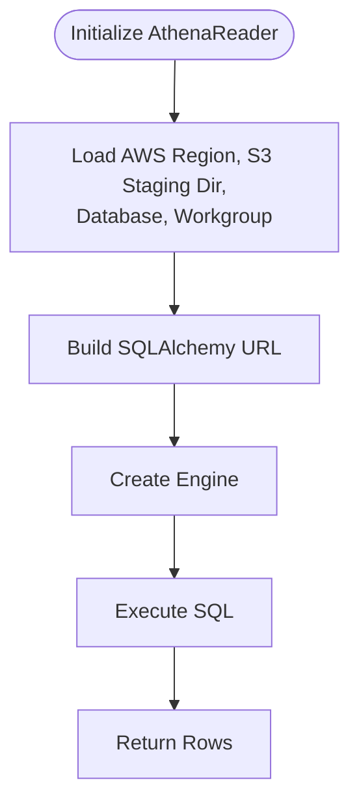
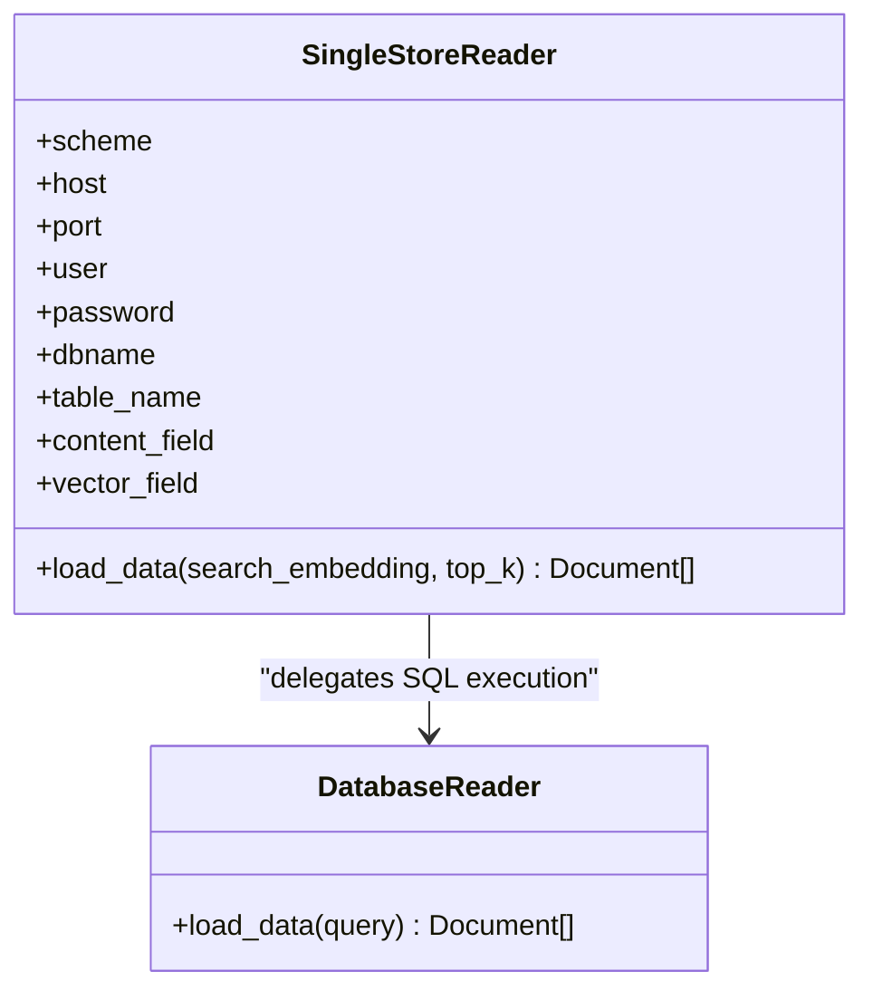
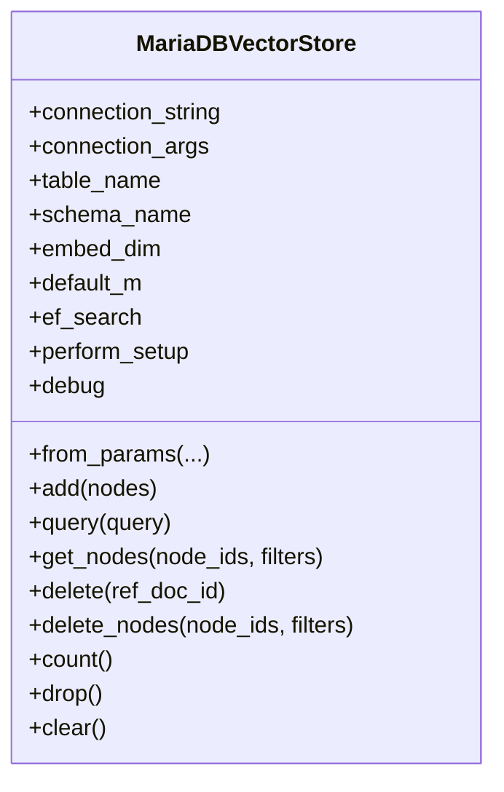
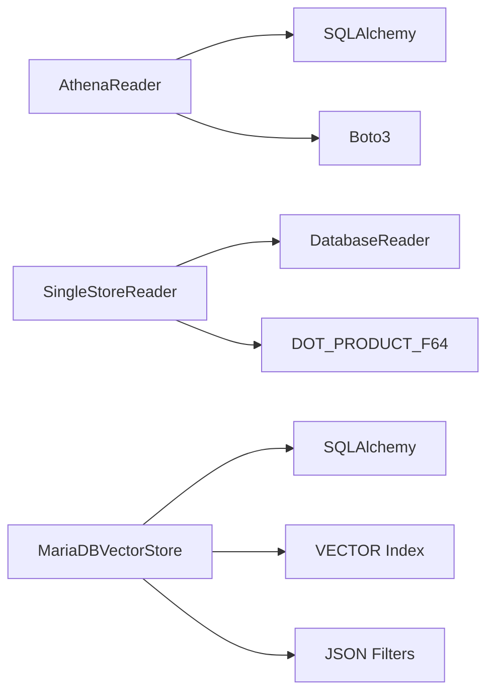

# Specialized Connectors

<cite>
**Referenced Files in This Document**
- [base.py](file://llama-index-integrations/readers/llama-index-readers-athena/llama_index/readers/athena/base.py)
- [README.md](file://llama-index-integrations/readers/llama-index-readers-athena/README.md)
- [base.py](file://llama-index-integrations/readers/llama-index-readers-singlestore/llama_index/readers/singlestore/base.py)
- [README.md](file://llama-index-integrations/readers/llama-index-readers-singlestore/README.md)
- [base.py](file://llama-index-integrations/vector_stores/llama-index-vector-stores-mariadb/llama_index/vector_stores/mariadb/base.py)
- [README.md](file://llama-index-integrations/vector_stores/llama-index-vector-stores-mariadb/README.md)
- [docker-compose.yaml](file://llama-index-integrations/vector_stores/llama-index-vector-stores-mariadb/tests/docker-compose.yaml)
</cite>

## Table of Contents
1. [Introduction](#introduction)
2. [Project Structure](#project-structure)
3. [Core Components](#core-components)
4. [Architecture Overview](#architecture-overview)
5. [Detailed Component Analysis](#detailed-component-analysis)
6. [Dependency Analysis](#dependency-analysis)
7. [Performance Considerations](#performance-considerations)
8. [Troubleshooting Guide](#troubleshooting-guide)
9. [Conclusion](#conclusion)
10. [Appendices](#appendices)

## Introduction
This document provides a deep dive into three specialized database connectors in LlamaIndex:
- Amazon Athena for serverless analytics
- SingleStore for HTAP (Hybrid Transactional/Analytical Processing)
- MariaDB for vector search and high-performance MySQL-compatible storage

It explains connection patterns, query optimization techniques, and practical guidance for analytical workloads, real-time transaction processing, and mixed scenarios. It also covers performance tuning, resource allocation, cost optimization, and integration challenges such as data format compatibility and query language differences.

## Project Structure
The connectors are implemented as separate packages under the integrations tree. Each package exposes a reader or vector store class and includes usage examples and tests.

**Diagram sources**
- [base.py](file://llama-index-integrations/readers/llama-index-readers-athena/llama_index/readers/athena/base.py#L11-L87)
- [base.py](file://llama-index-integrations/readers/llama-index-readers-singlestore/llama_index/readers/singlestore/base.py#L10-L87)
- [base.py](file://llama-index-integrations/vector_stores/llama-index-vector-stores-mariadb/llama_index/vector_stores/mariadb/base.py#L37-L509)

**Section sources**
- [base.py](file://llama-index-integrations/readers/llama-index-readers-athena/llama_index/readers/athena/base.py#L1-L87)
- [base.py](file://llama-index-integrations/readers/llama-index-readers-singlestore/llama_index/readers/singlestore/base.py#L1-L87)
- [base.py](file://llama-index-integrations/vector_stores/llama-index-vector-stores-mariadb/llama_index/vector_stores/mariadb/base.py#L1-L509)

## Core Components
- AthenaReader: Creates a serverless SQL engine against AWS Athena using SQLAlchemy and PyAthena, configured via environment variables and IAM best practices.
- SingleStoreReader: Wraps DatabaseReader to execute vector similarity queries using SingleStore’s native dot product function.
- MariaDBVectorStore: Provides a vector store backed by MariaDB’s VECTOR type with configurable index parameters and metadata filtering.

Key capabilities:
- Athena: serverless query execution with S3 staging and workgroups
- SingleStore: HTAP with vector similarity search using native SQL
- MariaDB: vector search with M and ef_search parameters, metadata filtering, and table lifecycle management

**Section sources**
- [base.py](file://llama-index-integrations/readers/llama-index-readers-athena/llama_index/readers/athena/base.py#L23-L87)
- [base.py](file://llama-index-integrations/readers/llama-index-readers-singlestore/llama_index/readers/singlestore/base.py#L27-L87)
- [base.py](file://llama-index-integrations/vector_stores/llama-index-vector-stores-mariadb/llama_index/vector_stores/mariadb/base.py#L79-L191)

## Architecture Overview
The connectors integrate with LlamaIndex abstractions:
- Readers implement BaseReader and return Documents
- Vector stores implement BasePydanticVectorStore and support vector search and metadata filtering

**Diagram sources**
- [base.py](file://llama-index-integrations/readers/llama-index-readers-athena/llama_index/readers/athena/base.py#L28-L87)

**Diagram sources**
- [base.py](file://llama-index-integrations/readers/llama-index-readers-singlestore/llama_index/readers/singlestore/base.py#L67-L87)

**Diagram sources**
- [base.py](file://llama-index-integrations/vector_stores/llama-index-vector-stores-mariadb/llama_index/vector_stores/mariadb/base.py#L398-L437)

## Detailed Component Analysis

### Amazon Athena Connector
- Purpose: Serverless analytics over S3-staged results with workgroup scoping
- Connection pattern:
  - Uses SQLAlchemy with an AWS Athena dialect
  - Supports IAM roles and environment-based credentials
  - Requires region, S3 staging directory, database, and workgroup
- Security and best practices:
  - Prefer IAM roles over embedded credentials
  - Use environment variables for sensitive configuration
- Query optimization:
  - Leverage partition pruning via table partitioning and predicate pushdown
  - Use workgroups to isolate and throttle concurrency
  - Optimize S3 staging location proximity to data
- Operational complexity:
  - Requires AWS permissions and workgroup setup
  - Costs driven by query bytes scanned and S3 storage costs
- Example usage:
  - See the reader’s README for end-to-end NL-to-SQL workflow with a query engine

**Diagram sources**
- [base.py](file://llama-index-integrations/readers/llama-index-readers-athena/llama_index/readers/athena/base.py#L28-L87)

**Section sources**
- [base.py](file://llama-index-integrations/readers/llama-index-readers-athena/llama_index/readers/athena/base.py#L11-L87)
- [README.md](file://llama-index-integrations/readers/llama-index-readers-athena/README.md#L1-L64)

### SingleStore Connector
- Purpose: Hybrid Transactional/Analytical Processing with vector similarity
- Connection pattern:
  - Uses mysql+pymysql via DatabaseReader
  - Exposes content and vector fields for retrieval
- Query optimization:
  - Uses native DOT_PRODUCT_F64 for efficient similarity scoring
  - Leverages SingleStore’s distributed architecture for analytical joins and aggregations
- Operational complexity:
  - Requires SingleStore cluster connectivity and table schema with embeddings
  - Suitable for real-time retrieval augmented generation (RAG) with vector similarity
- Example usage:
  - See the reader’s README for initializing the reader and performing similarity search

**Diagram sources**
- [base.py](file://llama-index-integrations/readers/llama-index-readers-singlestore/llama_index/readers/singlestore/base.py#L10-L87)

**Section sources**
- [base.py](file://llama-index-integrations/readers/llama-index-readers-singlestore/llama_index/readers/singlestore/base.py#L10-L87)
- [README.md](file://llama-index-integrations/readers/llama-index-readers-singlestore/README.md#L1-L38)

### MariaDB Connector
- Purpose: Vector store with native vector search and metadata filtering
- Connection pattern:
  - Uses SQLAlchemy with mysql+pymysql
  - Validates MariaDB version and creates a table with a VECTOR index
  - Configurable parameters: embed_dim, default_m, ef_search
- Query optimization:
  - Vector index creation with cosine distance and M parameter
  - ef_search controls recall/cost trade-offs during search
  - Metadata filtering via JSON_VALUE with supported operators
- Operational complexity:
  - Requires MariaDB 11.7.1+ for VECTOR support
  - Provides lifecycle methods: add, query, delete, count, drop, clear
- Example usage:
  - See the README for initialization and from_params usage
  - Integration tests include a docker-compose example for local development

**Diagram sources**
- [base.py](file://llama-index-integrations/vector_stores/llama-index-vector-stores-mariadb/llama_index/vector_stores/mariadb/base.py#L37-L191)

**Section sources**
- [base.py](file://llama-index-integrations/vector_stores/llama-index-vector-stores-mariadb/llama_index/vector_stores/mariadb/base.py#L37-L509)
- [README.md](file://llama-index-integrations/vector_stores/llama-index-vector-stores-mariadb/README.md#L1-L51)
- [docker-compose.yaml](file://llama-index-integrations/vector_stores/llama-index-vector-stores-mariadb/tests/docker-compose.yaml)

## Dependency Analysis
- AthenaReader depends on:
  - SQLAlchemy engine creation
  - Boto3 client for credential configuration
- SingleStoreReader depends on:
  - DatabaseReader (mysql+pymysql)
  - Native SQL with DOT_PRODUCT_F64
- MariaDBVectorStore depends on:
  - SQLAlchemy engine
  - MariaDB VECTOR type and vector index parameters
  - JSON-based metadata filtering

**Diagram sources**
- [base.py](file://llama-index-integrations/readers/llama-index-readers-athena/llama_index/readers/athena/base.py#L6-L8)
- [base.py](file://llama-index-integrations/readers/llama-index-readers-singlestore/llama_index/readers/singlestore/base.py#L7)
- [base.py](file://llama-index-integrations/vector_stores/llama-index-vector-stores-mariadb/llama_index/vector_stores/mariadb/base.py#L8-L24)

**Section sources**
- [base.py](file://llama-index-integrations/readers/llama-index-readers-athena/llama_index/readers/athena/base.py#L1-L87)
- [base.py](file://llama-index-integrations/readers/llama-index-readers-singlestore/llama_index/readers/singlestore/base.py#L1-L87)
- [base.py](file://llama-index-integrations/vector_stores/llama-index-vector-stores-mariadb/llama_index/vector_stores/mariadb/base.py#L1-L509)

## Performance Considerations
- Athena
  - Cost optimization: minimize partitions scanned by structuring partitions and pushing predicates; choose appropriate workgroup capacity
  - Performance: use S3 staging near data; leverage compression; batch queries where possible
- SingleStore
  - Cost optimization: leverage HTAP to reduce ETL; tune query execution plans; use appropriate indexes
  - Performance: vector similarity via native dot product; distribute data across cluster nodes
- MariaDB
  - Cost optimization: adjust ef_search and M to balance recall and latency; consolidate connections
  - Performance: ensure VECTOR index alignment with cosine distance; optimize metadata filters; monitor server version compatibility

[No sources needed since this section provides general guidance]

## Troubleshooting Guide
- Athena
  - Verify AWS credentials and IAM permissions; prefer roles over keys
  - Confirm region, S3 staging directory, database, and workgroup configuration
  - Check query syntax and table visibility
- SingleStore
  - Ensure mysql+pymysql is installed and available
  - Validate table schema and presence of content and vector fields
  - Confirm cluster connectivity and network access
- MariaDB
  - Confirm MariaDB version meets the minimum requirement
  - Validate VECTOR index creation and parameters (M, ef_search)
  - Review metadata filter syntax and supported operators

**Section sources**
- [base.py](file://llama-index-integrations/readers/llama-index-readers-athena/llama_index/readers/athena/base.py#L11-L87)
- [base.py](file://llama-index-integrations/readers/llama-index-readers-singlestore/llama_index/readers/singlestore/base.py#L10-L87)
- [base.py](file://llama-index-integrations/vector_stores/llama-index-vector-stores-mariadb/llama_index/vector_stores/mariadb/base.py#L204-L241)

## Conclusion
These specialized connectors enable powerful analytics and vector workloads:
- Athena for serverless, scalable analytics
- SingleStore for HTAP and vector similarity
- MariaDB for modern vector search with robust metadata filtering

Adopt the recommended connection patterns, query optimizations, and operational practices to achieve strong performance, cost control, and maintainability.

[No sources needed since this section summarizes without analyzing specific files]

## Appendices
- Example usage patterns and end-to-end workflows are documented in each connector’s README.

**Section sources**
- [README.md](file://llama-index-integrations/readers/llama-index-readers-athena/README.md#L1-L64)
- [README.md](file://llama-index-integrations/readers/llama-index-readers-singlestore/README.md#L1-L38)
- [README.md](file://llama-index-integrations/vector_stores/llama-index-vector-stores-mariadb/README.md#L1-L51)