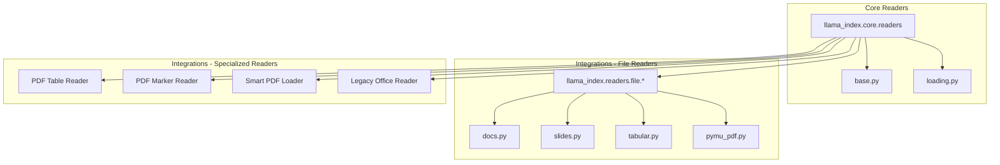
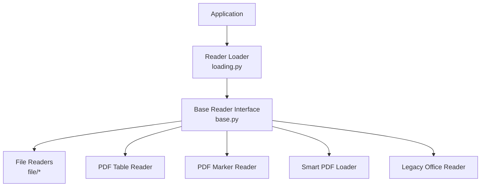
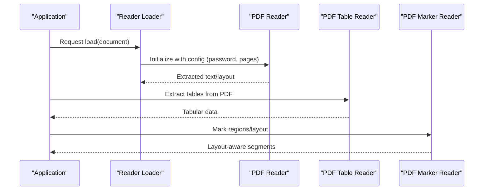
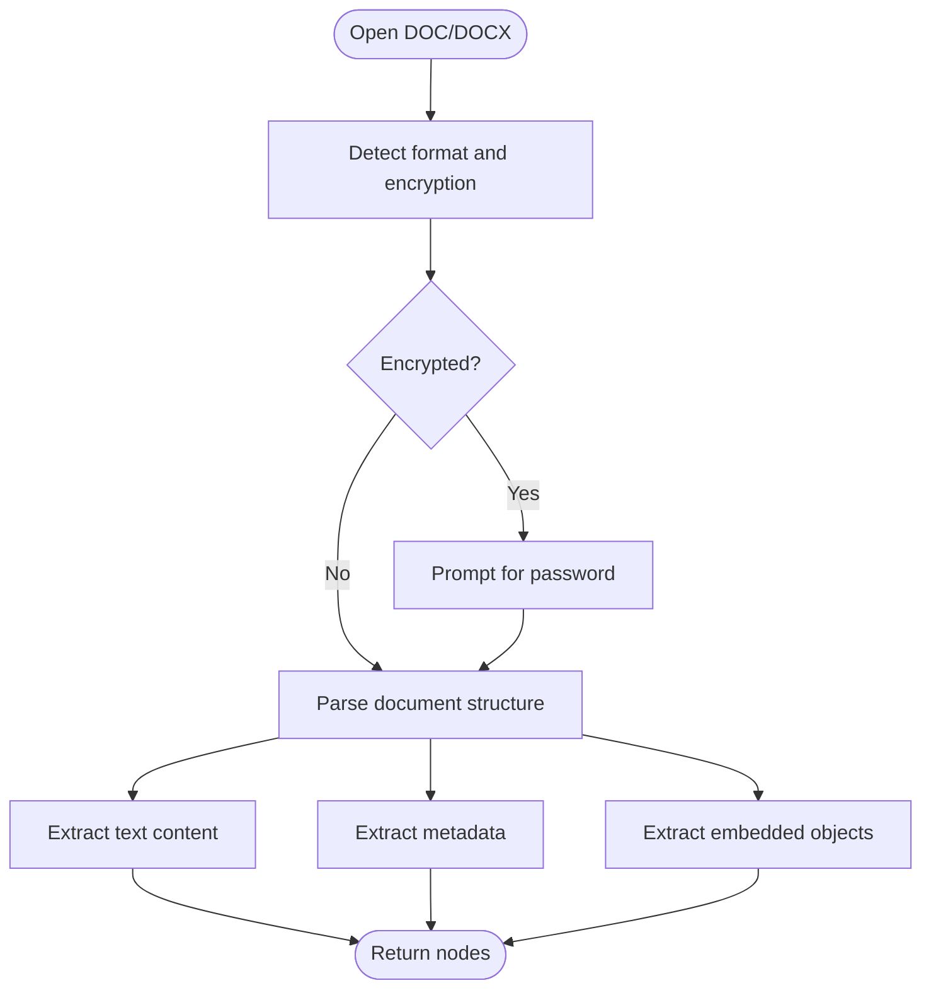
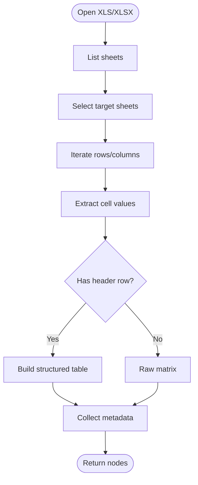
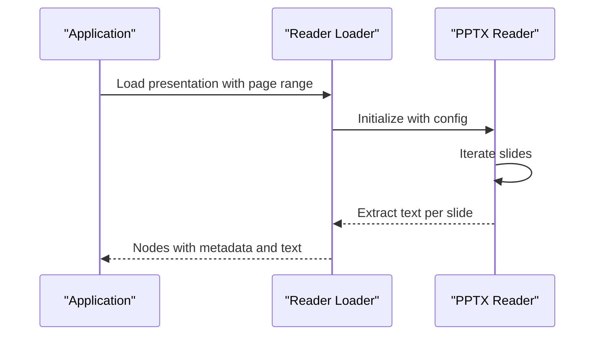
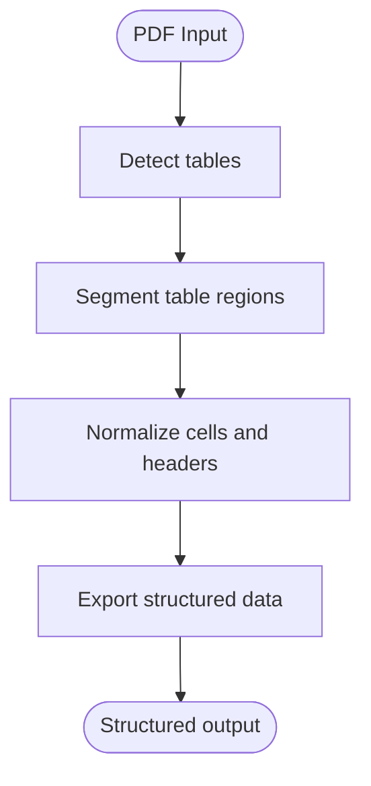
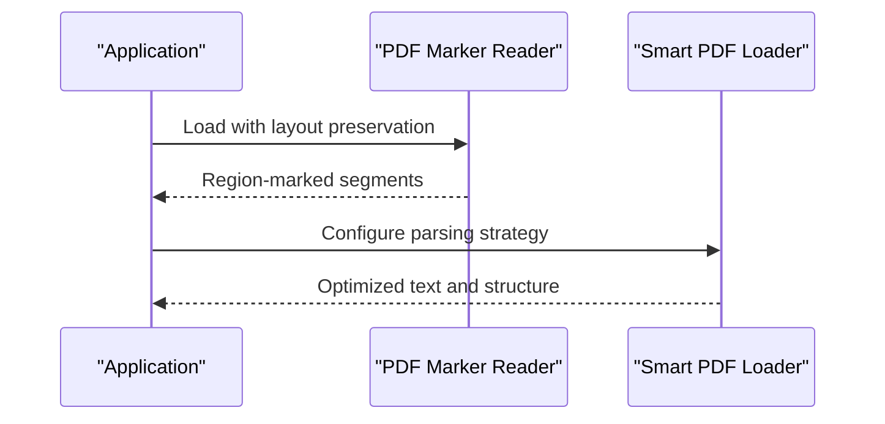
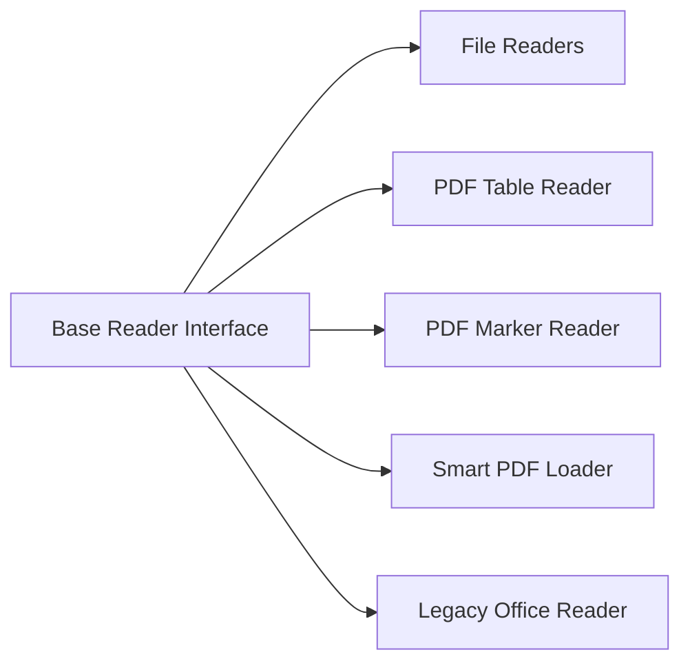

# Document Formats

<cite>
**Referenced Files in This Document**
- [__init__.py](file://llama-index-integrations/readers/llama-index-readers-file/llama_index/readers/file/__init__.py)
- [base.py](file://llama-index-core/llama_index/core/readers/base.py)
- [loading.py](file://llama-index-core/llama_index/core/readers/loading.py)
- [__init__.py](file://llama-index-integrations/readers/llama-index-readers-legacy-office/llama_index/readers/legacy_office/__init__.py)
- [__init__.py](file://llama-index-integrations/readers/llama-index-readers-pdf-table/llama_index/readers/pdf_table/__init__.py)
- [__init__.py](file://llama-index-integrations/readers/llama-index-readers-pdf-marker/llama_index/readers/pdf_marker/__init__.py)
- [__init__.py](file://llama-index-integrations/readers/llama-index-readers-smart-pdf-loader/llama_index/readers/smart_pdf_loader/__init__.py)
- [test_readers_pdf_table.py](file://llama-index-integrations/readers/llama-index-readers-pdf-table/tests/test_readers_pdf_table.py)
- [generate_test_ppt.py](file://llama-index-integrations/readers/llama-index-readers-file/tests/generate_test_ppt.py)
</cite>

## Table of Contents
1. [Introduction](#introduction)
2. [Project Structure](#project-structure)
3. [Core Components](#core-components)
4. [Architecture Overview](#architecture-overview)
5. [Detailed Component Analysis](#detailed-component-analysis)
6. [Dependency Analysis](#dependency-analysis)
7. [Performance Considerations](#performance-considerations)
8. [Troubleshooting Guide](#troubleshooting-guide)
9. [Conclusion](#conclusion)
10. [Appendices](#appendices)

## Introduction
This document explains how LlamaIndex supports reading various document formats, focusing on PDF, DOC/DOCX, XLS/XLSX, and PPTX. It covers configuration options such as password protection, page ranges, table extraction, metadata handling, and layout preservation. It also describes file-specific parsing techniques, text extraction methods, structured data recovery, performance optimization for large documents, memory management strategies, error handling for corrupted files, and guidance on customizing extraction parameters and integrating with external document processing libraries.

## Project Structure
LlamaIndex organizes readers primarily under the core readers module and extends functionality via integrations. The file-based readers expose a broad set of format-specific readers, while specialized readers (e.g., PDF table extraction, PDF marker, smart PDF loader, legacy office) live in dedicated integration packages.

**Diagram sources**
- [base.py](file://llama-index-core/llama_index/core/readers/base.py)
- [loading.py](file://llama-index-core/llama_index/core/readers/loading.py)
- [__init__.py](file://llama-index-integrations/readers/llama-index-readers-file/llama_index/readers/file/__init__.py)
- [__init__.py](file://llama-index-integrations/readers/llama-index-readers-pdf-table/llama_index/readers/pdf_table/__init__.py)
- [__init__.py](file://llama-index-integrations/readers/llama-index-readers-pdf-marker/llama_index/readers/pdf_marker/__init__.py)
- [__init__.py](file://llama-index-integrations/readers/llama-index-readers-smart-pdf-loader/llama_index/readers/smart_pdf_loader/__init__.py)
- [__init__.py](file://llama-index-integrations/readers/llama-index-readers-legacy-office/llama_index/readers/legacy_office/__init__.py)

**Section sources**
- [__init__.py](file://llama-index-integrations/readers/llama-index-readers-file/llama_index/readers/file/__init__.py)
- [base.py](file://llama-index-core/llama_index/core/readers/base.py)
- [loading.py](file://llama-index-core/llama_index/core/readers/loading.py)

## Core Components
- File-based readers: Provide format-specific loaders for PDF, DOC/DOCX, XLS/XLSX, PPTX, CSV, HTML, images, notebooks, EPUB, RTF, XML, and more.
- Specialized readers:
  - PDF Table Reader: Extracts tabular data from PDFs.
  - PDF Marker Reader: Preserves layout and marks regions for downstream processing.
  - Smart PDF Loader: Advanced PDF parsing with configurable strategies.
  - Legacy Office Reader: Handles older Microsoft Office formats.

These components are exported via their respective package __init__.py files and are discoverable through the unified readers namespace.

**Section sources**
- [__init__.py](file://llama-index-integrations/readers/llama-index-readers-file/llama_index/readers/file/__init__.py)
- [__init__.py](file://llama-index-integrations/readers/llama-index-readers-pdf-table/llama_index/readers/pdf_table/__init__.py)
- [__init__.py](file://llama-index-integrations/readers/llama-index-readers-pdf-marker/llama_index/readers/pdf_marker/__init__.py)
- [__init__.py](file://llama-index-integrations/readers/llama-index-readers-smart-pdf-loader/llama_index/readers/smart_pdf_loader/__init__.py)
- [__init__.py](file://llama-index-integrations/readers/llama-index-readers-legacy-office/llama_index/readers/legacy_office/__init__.py)

## Architecture Overview
The reader ecosystem follows a layered architecture:
- Core readers define the base interface and loading utilities.
- Integrations encapsulate format-specific logic and third-party dependencies.
- Specialized readers augment capabilities for advanced scenarios (tables, layout, OCR).

**Diagram sources**
- [loading.py](file://llama-index-core/llama_index/core/readers/loading.py)
- [base.py](file://llama-index-core/llama_index/core/readers/base.py)
- [__init__.py](file://llama-index-integrations/readers/llama-index-readers-file/llama_index/readers/file/__init__.py)
- [__init__.py](file://llama-index-integrations/readers/llama-index-readers-pdf-table/llama_index/readers/pdf_table/__init__.py)
- [__init__.py](file://llama-index-integrations/readers/llama-index-readers-pdf-marker/llama_index/readers/pdf_marker/__init__.py)
- [__init__.py](file://llama-index-integrations/readers/llama-index-readers-smart-pdf-loader/llama_index/readers/smart_pdf_loader/__init__.py)
- [__init__.py](file://llama-index-integrations/readers/llama-index-readers-legacy-office/llama_index/readers/legacy_office/__init__.py)

## Detailed Component Analysis

### PDF Reader
- Supported via file-based readers and specialized PDF tools.
- Capabilities:
  - Text extraction with optional page range selection.
  - Password-protected PDF handling through underlying libraries.
  - Layout preservation and region marking via PDF Marker.
  - Structured table extraction via PDF Table Reader.
  - Advanced parsing strategies via Smart PDF Loader.

**Diagram sources**
- [loading.py](file://llama-index-core/llama_index/core/readers/loading.py)
- [__init__.py](file://llama-index-integrations/readers/llama-index-readers-pdf-table/llama_index/readers/pdf_table/__init__.py)
- [__init__.py](file://llama-index-integrations/readers/llama-index-readers-pdf-marker/llama_index/readers/pdf_marker/__init__.py)

**Section sources**
- [__init__.py](file://llama-index-integrations/readers/llama-index-readers-file/llama_index/readers/file/__init__.py)
- [__init__.py](file://llama-index-integrations/readers/llama-index-readers-pdf-table/llama_index/readers/pdf_table/__init__.py)
- [__init__.py](file://llama-index-integrations/readers/llama-index-readers-pdf-marker/llama_index/readers/pdf_marker/__init__.py)
- [__init__.py](file://llama-index-integrations/readers/llama-index-readers-smart-pdf-loader/llama_index/readers/smart_pdf_loader/__init__.py)

### DOC/DOCX Reader
- Provided by file-based readers.
- Capabilities:
  - Text extraction from Microsoft Word documents.
  - Metadata handling (author, title, subject, creation date).
  - Embedded object extraction (images, charts) via underlying libraries.
  - Page-range selection for large documents.

**Diagram sources**
- [__init__.py](file://llama-index-integrations/readers/llama-index-readers-file/llama_index/readers/file/__init__.py)

**Section sources**
- [__init__.py](file://llama-index-integrations/readers/llama-index-readers-file/llama_index/readers/file/__init__.py)

### XLS/XLSX Reader
- Provided by file-based readers with pandas-backed support.
- Capabilities:
  - Cell-level extraction with row/column indexing.
  - Sheet selection and iteration.
  - Table extraction with headers and alignment.
  - Metadata handling (creator, last modified, sheet names).
  - Handling of formulas and rich formatting.

**Diagram sources**
- [__init__.py](file://llama-index-integrations/readers/llama-index-readers-file/llama_index/readers/file/__init__.py)

**Section sources**
- [__init__.py](file://llama-index-integrations/readers/llama-index-readers-file/llama_index/readers/file/__init__.py)

### PPTX Reader
- Provided by file-based readers.
- Capabilities:
  - Slide-level extraction with page-range selection.
  - Text extraction from shapes and text frames.
  - Metadata handling (title, author, slide count).
  - Embedded media extraction (images, videos) via underlying libraries.

**Diagram sources**
- [loading.py](file://llama-index-core/llama_index/core/readers/loading.py)
- [__init__.py](file://llama-index-integrations/readers/llama-index-readers-file/llama_index/readers/file/__init__.py)

**Section sources**
- [__init__.py](file://llama-index-integrations/readers/llama-index-readers-file/llama_index/readers/file/__init__.py)
- [generate_test_ppt.py](file://llama-index-integrations/readers/llama-index-readers-file/tests/generate_test_ppt.py)

### PDF Table Extraction
- Dedicated reader for robust table detection and recovery.
- Capabilities:
  - Table detection and segmentation.
  - Header inference and column alignment.
  - Export to structured formats (e.g., DataFrame-ready).
  - Integration with downstream parsers and node parsers.

**Diagram sources**
- [__init__.py](file://llama-index-integrations/readers/llama-index-readers-pdf-table/llama_index/readers/pdf_table/__init__.py)
- [test_readers_pdf_table.py](file://llama-index-integrations/readers/llama-index-readers-pdf-table/tests/test_readers_pdf_table.py)

**Section sources**
- [__init__.py](file://llama-index-integrations/readers/llama-index-readers-pdf-table/llama_index/readers/pdf_table/__init__.py)
- [test_readers_pdf_table.py](file://llama-index-integrations/readers/llama-index-readers-pdf-table/tests/test_readers_pdf_table.py)

### PDF Marker and Smart PDF Loader
- PDF Marker preserves layout and marks regions for downstream processing.
- Smart PDF Loader offers advanced parsing strategies and configuration options.

**Diagram sources**
- [__init__.py](file://llama-index-integrations/readers/llama-index-readers-pdf-marker/llama_index/readers/pdf_marker/__init__.py)
- [__init__.py](file://llama-index-integrations/readers/llama-index-readers-smart-pdf-loader/llama_index/readers/smart_pdf_loader/__init__.py)

**Section sources**
- [__init__.py](file://llama-index-integrations/readers/llama-index-readers-pdf-marker/llama_index/readers/pdf_marker/__init__.py)
- [__init__.py](file://llama-index-integrations/readers/llama-index-readers-smart-pdf-loader/llama_index/readers/smart_pdf_loader/__init__.py)

### Legacy Office Reader
- Supports older Microsoft Office formats.
- Capabilities:
  - Text extraction from legacy formats.
  - Metadata handling and basic layout awareness.

**Section sources**
- [__init__.py](file://llama-index-integrations/readers/llama-index-readers-legacy-office/llama_index/readers/legacy_office/__init__.py)

## Dependency Analysis
- Readers depend on the core base interface and loading utilities.
- File-based readers aggregate multiple format-specific loaders.
- Specialized readers depend on external libraries for advanced parsing and table extraction.
- There are no circular dependencies among the readers; they are decoupled and composable.

**Diagram sources**
- [base.py](file://llama-index-core/llama_index/core/readers/base.py)
- [__init__.py](file://llama-index-integrations/readers/llama-index-readers-file/llama_index/readers/file/__init__.py)
- [__init__.py](file://llama-index-integrations/readers/llama-index-readers-pdf-table/llama_index/readers/pdf_table/__init__.py)
- [__init__.py](file://llama-index-integrations/readers/llama-index-readers-pdf-marker/llama_index/readers/pdf_marker/__init__.py)
- [__init__.py](file://llama-index-integrations/readers/llama-index-readers-smart-pdf-loader/llama_index/readers/smart_pdf_loader/__init__.py)
- [__init__.py](file://llama-index-integrations/readers/llama-index-readers-legacy-office/llama_index/readers/legacy_office/__init__.py)

**Section sources**
- [base.py](file://llama-index-core/llama_index/core/readers/base.py)
- [loading.py](file://llama-index-core/llama_index/core/readers/loading.py)
- [__init__.py](file://llama-index-integrations/readers/llama-index-readers-file/llama_index/readers/file/__init__.py)

## Performance Considerations
- Memory management:
  - Process documents in chunks (page ranges, sheet subsets).
  - Stream large files when possible to reduce peak memory usage.
  - Dispose of intermediate objects promptly after parsing.
- Parallelism:
  - Use concurrent readers for independent documents.
  - Batch process multiple pages/sheets where supported.
- Caching:
  - Cache extracted tables and layout markers for repeated queries.
- I/O optimization:
  - Prefer local copies for frequent access.
  - Use efficient serialization formats for intermediate results.

## Troubleshooting Guide
- Corrupted or encrypted files:
  - Verify password-protection and supply correct credentials.
  - Attempt fallback extraction strategies (e.g., layout-preserving vs. plain text).
- Large documents:
  - Limit page/sheet ranges to reduce memory footprint.
  - Enable incremental processing and streaming.
- Table extraction failures:
  - Adjust detection sensitivity and header inference settings.
  - Validate table boundaries and re-run extraction.
- Metadata loss:
  - Confirm metadata extraction is enabled for the specific reader.
  - Use readers that preserve richer metadata when available.

## Conclusion
LlamaIndex provides a comprehensive, extensible set of document readers covering PDF, DOC/DOCX, XLS/XLSX, and PPTX. With specialized readers for tables, layout preservation, and smart parsing, users can tailor extraction to their needs. By leveraging configuration options, performance strategies, and robust error handling, teams can reliably process diverse document formats at scale.

## Appendices
- Practical examples:
  - PDF table extraction and layout-aware processing are demonstrated in the integration tests and examples.
  - PPTX generation utilities help create test slides for validation.

**Section sources**
- [test_readers_pdf_table.py](file://llama-index-integrations/readers/llama-index-readers-pdf-table/tests/test_readers_pdf_table.py)
- [generate_test_ppt.py](file://llama-index-integrations/readers/llama-index-readers-file/tests/generate_test_ppt.py)