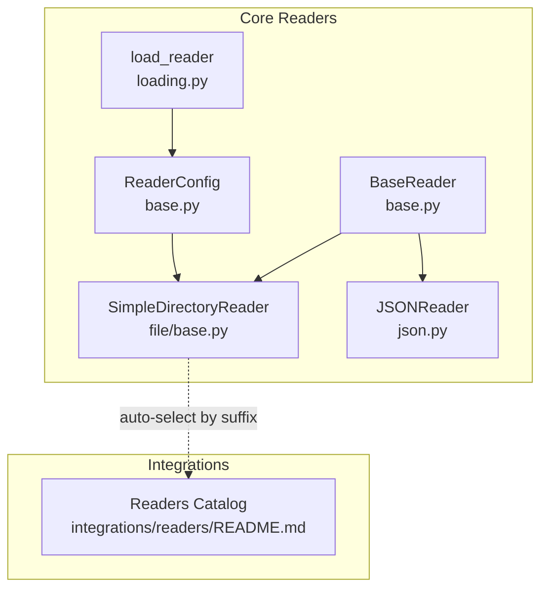
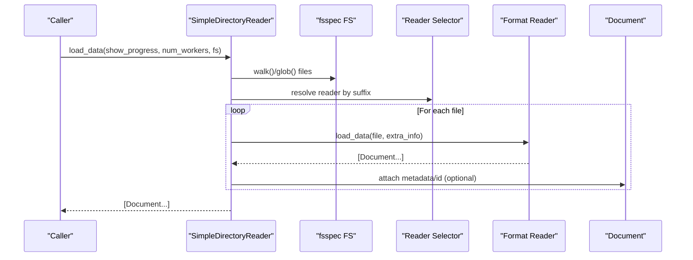
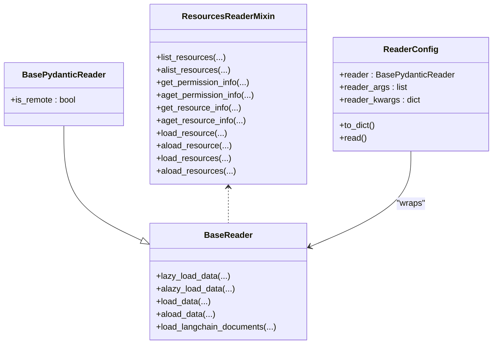
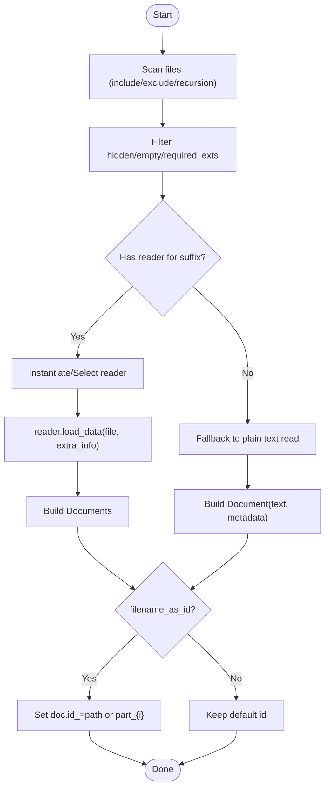
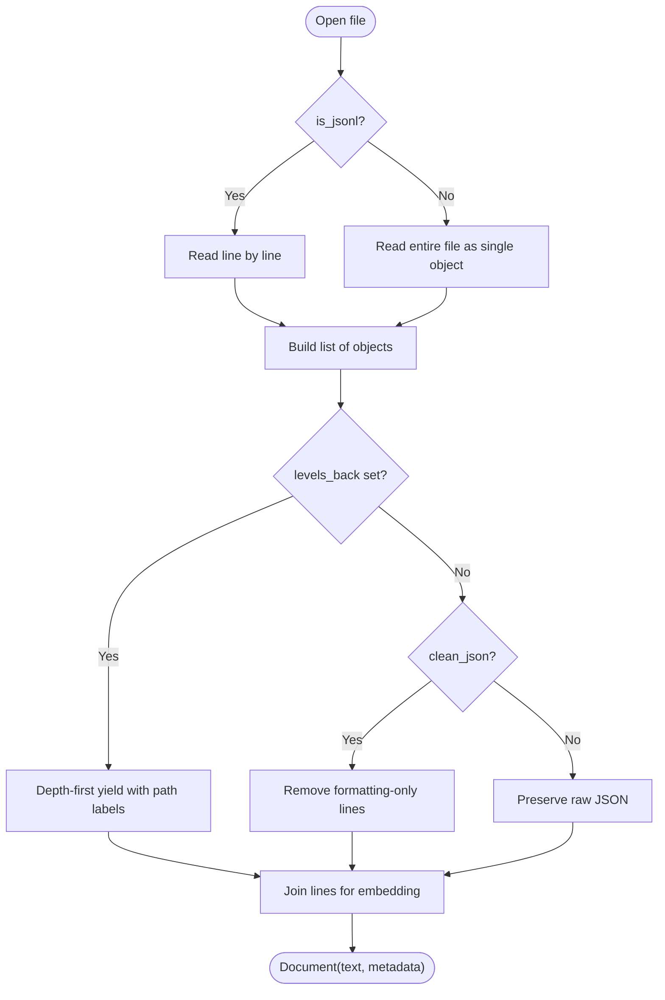
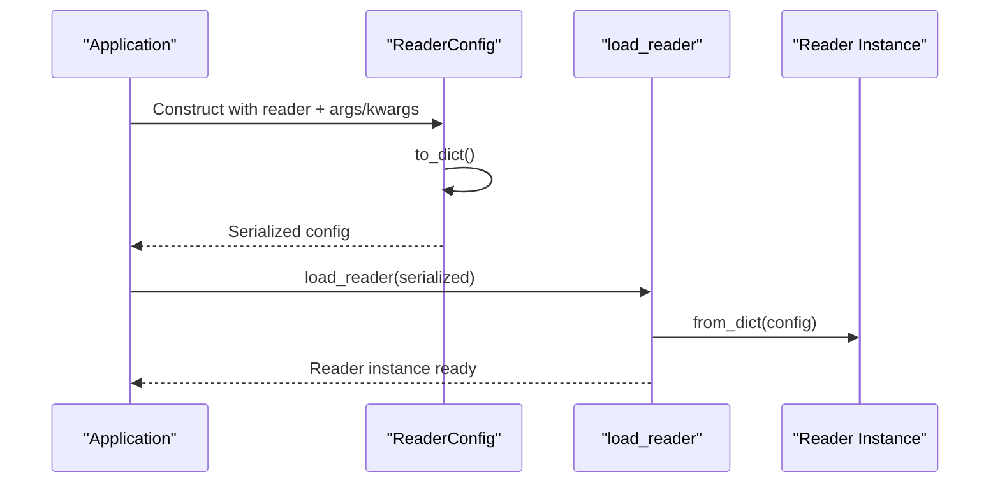
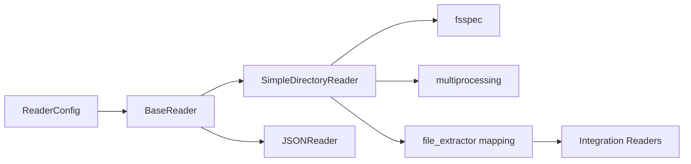

# File and Document Readers

<cite>
**Referenced Files in This Document**
- [base.py](file://llama-index-core/llama_index/core/readers/base.py)
- [__init__.py](file://llama-index-core/llama_index/core/readers/__init__.py)
- [base.py](file://llama-index-core/llama_index/core/readers/file/base.py)
- [json.py](file://llama-index-core/llama_index/core/readers/json.py)
- [loading.py](file://llama-index-core/llama_index/core/readers/loading.py)
- [README.md](file://llama-index-integrations/readers/README.md)
</cite>

## Table of Contents
1. [Introduction](#introduction)
2. [Project Structure](#project-structure)
3. [Core Components](#core-components)
4. [Architecture Overview](#architecture-overview)
5. [Detailed Component Analysis](#detailed-component-analysis)
6. [Dependency Analysis](#dependency-analysis)
7. [Performance Considerations](#performance-considerations)
8. [Troubleshooting Guide](#troubleshooting-guide)
9. [Conclusion](#conclusion)
10. [Appendices](#appendices)

## Introduction
This document explains how LlamaIndex handles file and document readers across diverse formats. It covers the unified BaseReader interface, the SimpleDirectoryReader that automatically selects appropriate readers per file extension, and the configuration options available for encoding, metadata, error handling, and parallel processing. It also outlines how to process encrypted or protected documents, extract structured data from spreadsheets, and manage large file ingestion. Guidance is included for building custom readers and integrating external libraries.

## Project Structure
LlamaIndex organizes readers under a core module and extends capabilities through optional integrations. The core provides:
- A base abstraction for readers
- A directory-based loader that selects readers by file suffix
- Specialized readers for formats such as JSON
- Utilities for loading and serializing readers

The integrations directory hosts community-contributed readers for many external systems and formats.

**Diagram sources**
- [base.py](file://llama-index-core/llama_index/core/readers/base.py#L19-L47)
- [base.py](file://llama-index-core/llama_index/core/readers/file/base.py#L208-L248)
- [json.py](file://llama-index-core/llama_index/core/readers/json.py#L53-L96)
- [base.py](file://llama-index-core/llama_index/core/readers/base.py#L223-L250)
- [loading.py](file://llama-index-core/llama_index/core/readers/loading.py#L6-L27)
- [README.md](file://llama-index-integrations/readers/README.md)

**Section sources**
- [__init__.py](file://llama-index-core/llama_index/core/readers/__init__.py#L14-L32)
- [base.py](file://llama-index-core/llama_index/core/readers/base.py#L19-L47)
- [base.py](file://llama-index-core/llama_index/core/readers/file/base.py#L68-L113)
- [json.py](file://llama-index-core/llama_index/core/readers/json.py#L53-L96)
- [loading.py](file://llama-index-core/llama_index/core/readers/loading.py#L6-L27)
- [README.md](file://llama-index-integrations/readers/README.md)

## Core Components
- BaseReader: Defines synchronous and asynchronous loading APIs, plus LangChain interoperability helpers.
- SimpleDirectoryReader: Scans directories or lists of files, auto-selects readers by file suffix, supports encoding, metadata, filtering, and parallel loading.
- JSONReader: Reads JSON and JSONL, with options to flatten hierarchy, collapse nodes, and clean formatting artifacts.
- ReaderConfig: Encapsulates a reader instance and its arguments for serialization and deserialization.
- load_reader: Utility to reconstruct readers from serialized configuration.

Key capabilities:
- Unified interface across formats
- Metadata injection via file stats and custom functions
- Error handling and skipping with configurable verbosity
- Async and parallel loading paths
- Extensible reader selection via file suffix mapping

**Section sources**
- [base.py](file://llama-index-core/llama_index/core/readers/base.py#L19-L47)
- [base.py](file://llama-index-core/llama_index/core/readers/base.py#L223-L250)
- [base.py](file://llama-index-core/llama_index/core/readers/file/base.py#L208-L248)
- [base.py](file://llama-index-core/llama_index/core/readers/file/base.py#L547-L716)
- [json.py](file://llama-index-core/llama_index/core/readers/json.py#L53-L96)
- [loading.py](file://llama-index-core/llama_index/core/readers/loading.py#L6-L27)

## Architecture Overview
The file reading pipeline centers on SimpleDirectoryReader, which:
- Discovers files (local or remote via fsspec)
- Applies filters (hidden, empty, required extensions, globs)
- Selects a reader by file suffix
- Loads content into Document objects
- Optionally attaches metadata and IDs
- Supports parallel and async execution

**Diagram sources**
- [base.py](file://llama-index-core/llama_index/core/readers/file/base.py#L718-L785)
- [base.py](file://llama-index-core/llama_index/core/readers/file/base.py#L590-L646)
- [base.py](file://llama-index-core/llama_index/core/readers/file/base.py#L648-L716)

## Detailed Component Analysis

### Unified Reader Interface
All readers implement a consistent contract:
- Synchronous: load_data(...)
- Asynchronous: aload_data(...)
- Lazy iteration: lazy_load_data(...) and alazy_load_data(...)
- LangChain interop: load_langchain_documents(...)

These methods enable uniform processing regardless of the underlying format.

**Diagram sources**
- [base.py](file://llama-index-core/llama_index/core/readers/base.py#L19-L47)
- [base.py](file://llama-index-core/llama_index/core/readers/base.py#L49-L57)
- [base.py](file://llama-index-core/llama_index/core/readers/base.py#L59-L221)
- [base.py](file://llama-index-core/llama_index/core/readers/base.py#L223-L250)

**Section sources**
- [base.py](file://llama-index-core/llama_index/core/readers/base.py#L19-L47)
- [base.py](file://llama-index-core/llama_index/core/readers/base.py#L49-L57)
- [base.py](file://llama-index-core/llama_index/core/readers/base.py#L59-L221)
- [base.py](file://llama-index-core/llama_index/core/readers/base.py#L223-L250)

### SimpleDirectoryReader: Auto-Selection and Configuration
Key features:
- File discovery with include/exclude globs, recursion, hidden/empty file filtering
- Automatic reader selection by file suffix
- Encoding and error policy controls
- Metadata extraction via default or custom functions
- Parallel loading with worker limits
- Async support

Supported formats (selected by suffix):
- PDF, DOC/DOCX, PPT/PPTX/PPTM, Images (GIF/JPEG/JPG/PNG/WEBP), Audio/Video (MP3/MP4), CSV, Excel (.xls/.xlsx), EPUB, MBOX, IPYNB

**Diagram sources**
- [base.py](file://llama-index-core/llama_index/core/readers/file/base.py#L346-L432)
- [base.py](file://llama-index-core/llama_index/core/readers/file/base.py#L590-L646)
- [base.py](file://llama-index-core/llama_index/core/readers/file/base.py#L648-L716)

**Section sources**
- [base.py](file://llama-index-core/llama_index/core/readers/file/base.py#L208-L248)
- [base.py](file://llama-index-core/llama_index/core/readers/file/base.py#L346-L432)
- [base.py](file://llama-index-core/llama_index/core/readers/file/base.py#L590-L646)
- [base.py](file://llama-index-core/llama_index/core/readers/file/base.py#L648-L716)

### JSONReader: Structured Content Extraction
Capabilities:
- Read JSON or JSONL
- Tree traversal with levels_back to build contextual embeddings
- Collapse long subtrees when under a length threshold
- Clean formatting-only lines when levels_back is not used

**Diagram sources**
- [json.py](file://llama-index-core/llama_index/core/readers/json.py#L97-L155)

**Section sources**
- [json.py](file://llama-index-core/llama_index/core/readers/json.py#L53-L96)
- [json.py](file://llama-index-core/llama_index/core/readers/json.py#L97-L155)

### Reader Serialization and Loading
ReaderConfig encapsulates a reader instance and its arguments. load_reader reconstructs readers from serialized data, enabling persistence and transport of reader configurations.

**Diagram sources**
- [base.py](file://llama-index-core/llama_index/core/readers/base.py#L223-L250)
- [loading.py](file://llama-index-core/llama_index/core/readers/loading.py#L6-L27)

**Section sources**
- [base.py](file://llama-index-core/llama_index/core/readers/base.py#L223-L250)
- [loading.py](file://llama-index-core/llama_index/core/readers/loading.py#L6-L27)

### Practical Examples and Workflows
Note: The following describe typical usage patterns. Replace placeholder values with your environment specifics.

- Basic directory ingestion
  - Use SimpleDirectoryReader with input_dir and optional required_exts to scan and load supported files.
  - Configure encoding and errors to handle malformed text gracefully.

- Plain text fallback
  - For unsupported suffixes, SimpleDirectoryReader falls back to reading the file as text with the configured encoding and error policy.

- Metadata enrichment
  - Supply a custom file_metadata function to inject extra_info into each Document.
  - Default metadata includes filesystem-derived fields such as path, name, type, size, and timestamps.

- Parallel processing
  - Set num_workers > 1 to parallelize file loading. The implementation bounds the worker count to CPU cores and uses multiprocessing.

- Async ingestion
  - Use aload_data to process files concurrently without blocking the main thread.

- JSON/JSONL processing
  - Use JSONReader with levels_back to produce contextual embeddings from nested structures.
  - Use is_jsonl for streaming line-delimited JSON.

- Remote filesystems
  - Pass an fsspec AbstractFileSystem to read from cloud or network-backed storage.

- Resource enumeration and targeted loading
  - Use list_resources and load_resource to enumerate and load specific files programmatically.

**Section sources**
- [base.py](file://llama-index-core/llama_index/core/readers/file/base.py#L208-L248)
- [base.py](file://llama-index-core/llama_index/core/readers/file/base.py#L547-L716)
- [base.py](file://llama-index-core/llama_index/core/readers/file/base.py#L718-L785)
- [json.py](file://llama-index-core/llama_index/core/readers/json.py#L53-L96)

### Handling Encrypted or Protected Documents
- Password-protected Office files (DOCX/PPTX/XLSX) are not handled by the core SimpleDirectoryReader. Use external readers from the integrations catalog that support password decryption and pass them via file_extractor to SimpleDirectoryReader.
- For PDFs, some integrations provide password handling; supply them through file_extractor.

Guidance:
- Identify a compatible reader in the integrations catalog.
- Provide a mapping from suffix to the reader class via file_extractor.
- Ensure dependencies for the chosen reader are installed.

**Section sources**
- [base.py](file://llama-index-core/llama_index/core/readers/file/base.py#L590-L646)
- [README.md](file://llama-index-integrations/readers/README.md)

### Extracting Structured Data from Spreadsheets
- CSV and Excel readers are selected automatically by suffix.
- For advanced table extraction, use specialized readers from the integrations catalog and configure them via file_extractor.

Guidance:
- Choose a reader that exposes tabular data as structured content.
- Provide custom parsing options (e.g., sheet selection, header handling) through the reader’s constructor arguments.

**Section sources**
- [base.py](file://llama-index-core/llama_index/core/readers/file/base.py#L68-L113)
- [base.py](file://llama-index-core/llama_index/core/readers/file/base.py#L590-L646)
- [README.md](file://llama-index-integrations/readers/README.md)

### Managing Large File Ingestion
- Limit total files processed with num_files_limit.
- Use parallel workers judiciously; the implementation caps workers to CPU count.
- Prefer async APIs for non-blocking throughput.
- Use file_metadata to avoid heavy metadata computation when unnecessary.

**Section sources**
- [base.py](file://llama-index-core/llama_index/core/readers/file/base.py#L258-L265)
- [base.py](file://llama-index-core/llama_index/core/readers/file/base.py#L751-L758)
- [base.py](file://llama-index-core/llama_index/core/readers/file/base.py#L718-L785)

### Custom Reader Development and Integration
- Implement BaseReader or BasePydanticReader to define load_data and/or aload_data.
- Register your reader for a specific suffix by passing a file_extractor mapping to SimpleDirectoryReader.
- Serialize/deserialize readers using ReaderConfig and load_reader for portability.

Best practices:
- Support async where feasible.
- Normalize metadata into the Document metadata field.
- Handle encoding and error policies consistently.
- Integrate with external libraries by wrapping their APIs inside load_data.

**Section sources**
- [base.py](file://llama-index-core/llama_index/core/readers/base.py#L19-L47)
- [base.py](file://llama-index-core/llama_index/core/readers/base.py#L49-L57)
- [base.py](file://llama-index-core/llama_index/core/readers/base.py#L223-L250)
- [loading.py](file://llama-index-core/llama_index/core/readers/loading.py#L6-L27)
- [base.py](file://llama-index-core/llama_index/core/readers/file/base.py#L590-L646)

## Dependency Analysis
- Core readers depend on BaseReader and Document schema.
- SimpleDirectoryReader depends on fsspec for filesystem abstraction and multiprocessing for parallelism.
- ReaderConfig depends on BasePydanticReader for serialization.
- Integrations provide additional readers selectable via file_extractor.

**Diagram sources**
- [base.py](file://llama-index-core/llama_index/core/readers/base.py#L19-L47)
- [base.py](file://llama-index-core/llama_index/core/readers/file/base.py#L208-L248)
- [base.py](file://llama-index-core/llama_index/core/readers/file/base.py#L718-L785)
- [base.py](file://llama-index-core/llama_index/core/readers/base.py#L223-L250)
- [README.md](file://llama-index-integrations/readers/README.md)

**Section sources**
- [base.py](file://llama-index-core/llama_index/core/readers/base.py#L19-L47)
- [base.py](file://llama-index-core/llama_index/core/readers/file/base.py#L208-L248)
- [base.py](file://llama-index-core/llama_index/core/readers/file/base.py#L718-L785)
- [base.py](file://llama-index-core/llama_index/core/readers/base.py#L223-L250)
- [README.md](file://llama-index-integrations/readers/README.md)

## Performance Considerations
- Parallelization: Use num_workers to parallelize file loading; the implementation bounds workers to CPU count.
- Async execution: Prefer aload_data for non-blocking workflows.
- Metadata cost: Avoid expensive metadata computations; use defaults or lightweight custom functions.
- Encoding and errors: Choose appropriate encoding and error policies to minimize retries and fallbacks.
- Filtering: Use required_exts, exclude globs, and num_files_limit to reduce workload.

[No sources needed since this section provides general guidance]

## Troubleshooting Guide
Common issues and resolutions:
- Unsupported file suffix
  - Symptom: Plain text fallback occurs.
  - Resolution: Install an integration reader or register a custom reader via file_extractor.

- Import errors for optional dependencies
  - Symptom: ImportError during reader instantiation.
  - Resolution: Install the required third-party libraries for the chosen reader.

- Corrupted or unreadable files
  - Symptom: Skipped files with printed messages.
  - Resolution: Enable raise_on_error to surface exceptions, or adjust error policy.

- Large file memory usage
  - Symptom: High memory during ingestion.
  - Resolution: Use parallel workers, limit file counts, and avoid heavy metadata.

- Remote filesystem connectivity
  - Symptom: Failures accessing cloud storage.
  - Resolution: Ensure fsspec-compatible filesystem is configured and credentials are available.

**Section sources**
- [base.py](file://llama-index-core/llama_index/core/readers/file/base.py#L614-L626)
- [base.py](file://llama-index-core/llama_index/core/readers/file/base.py#L684-L696)
- [base.py](file://llama-index-core/llama_index/core/readers/file/base.py#L751-L758)

## Conclusion
LlamaIndex provides a robust, extensible framework for reading diverse file formats through a unified BaseReader interface. SimpleDirectoryReader simplifies ingestion by auto-selecting readers by suffix, while offering rich configuration for encoding, metadata, filtering, and parallel processing. For advanced scenarios—such as encrypted documents, structured spreadsheet extraction, and integration with external libraries—the integrations catalog and custom reader patterns offer scalable solutions.

[No sources needed since this section summarizes without analyzing specific files]

## Appendices

### Supported Formats and Selection
- Core automatic selection includes PDF, DOC/DOCX, PPT/PPTX/PPTM, images, audio/video, CSV, Excel, EPUB, MBOX, IPYNB.
- For additional formats, install integrations and register readers via file_extractor.

**Section sources**
- [base.py](file://llama-index-core/llama_index/core/readers/file/base.py#L68-L113)
- [README.md](file://llama-index-integrations/readers/README.md)