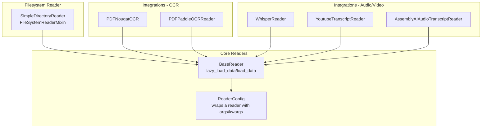
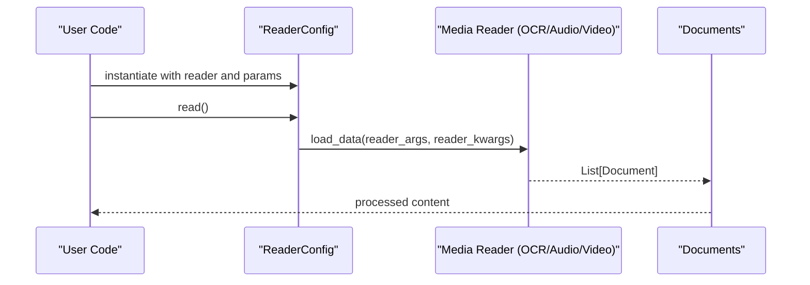
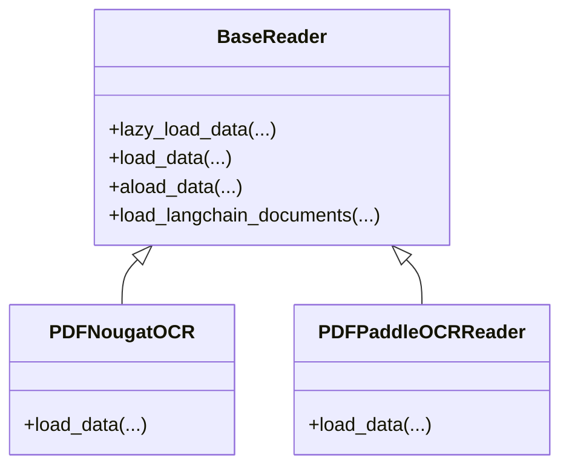
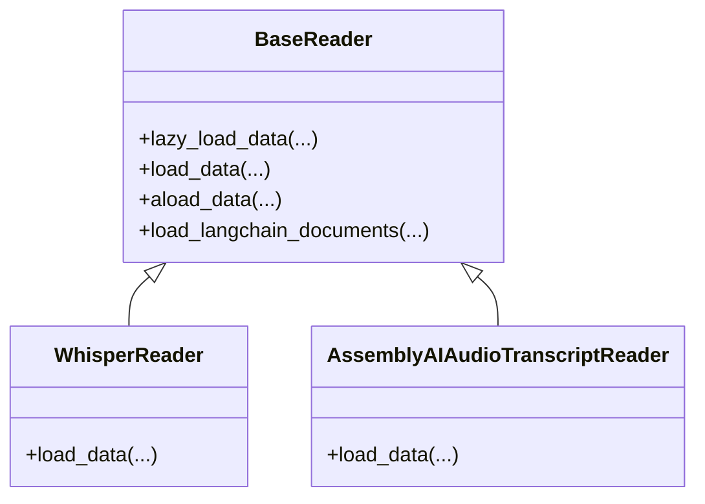
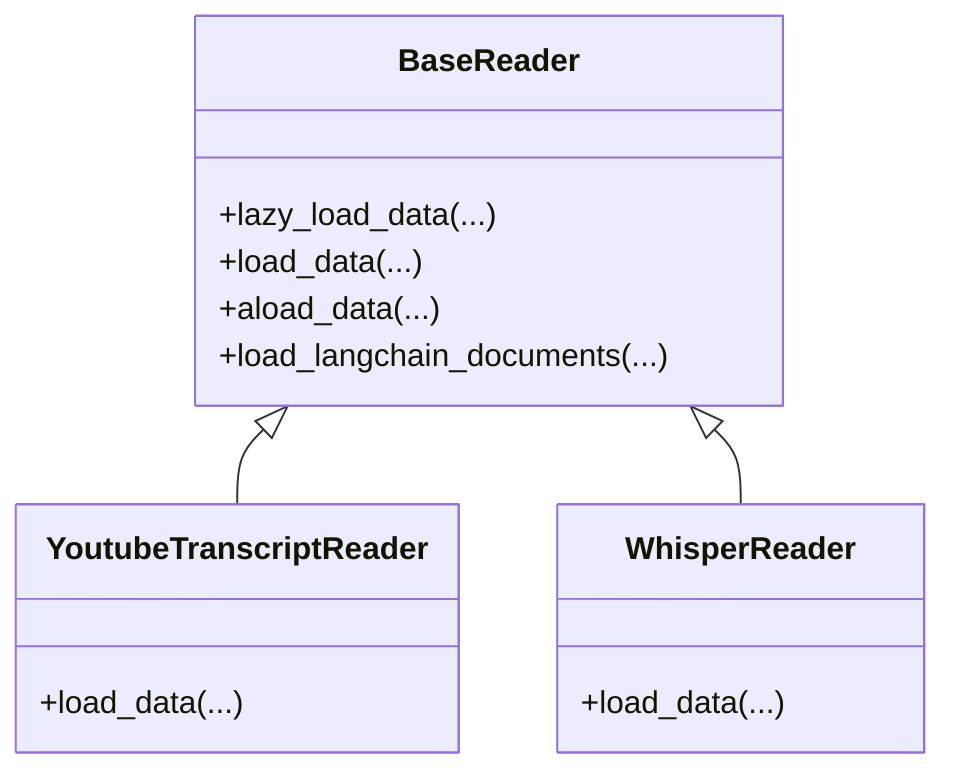
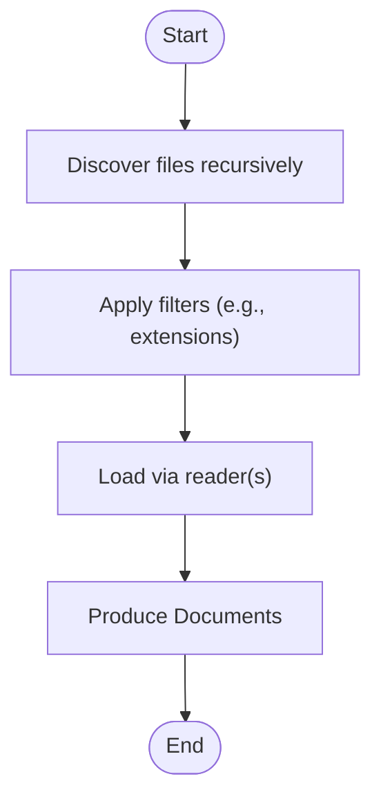
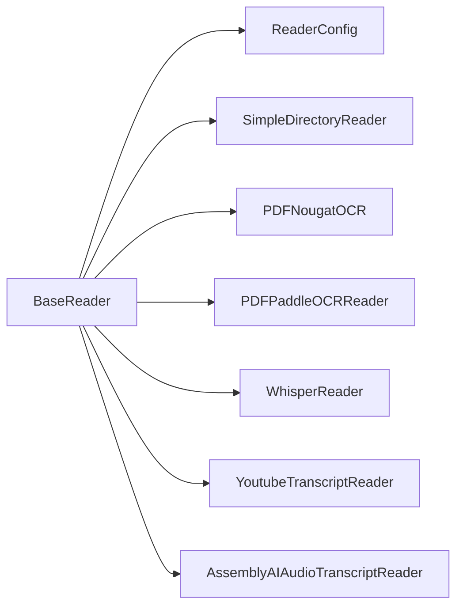

# Media File Readers

<cite>
**Referenced Files in This Document**
- [__init__.py](file://llama-index-core/llama_index/core/readers/__init__.py)
- [base.py](file://llama-index-core/llama_index/core/readers/base.py)
- [file/base.py](file://llama-index-core/llama_index/core/readers/file/base.py)
- [nougat_ocr/__init__.py](file://llama-index-integrations/readers/llama-index-readers-nougat-ocr/llama_index/readers/nougat_ocr/__init__.py)
- [paddle_ocr/__init__.py](file://llama-index-integrations/readers/llama-index-readers-paddle-ocr/llama_index/readers/paddle_ocr/__init__.py)
- [whisper/__init__.py](file://llama-index-integrations/readers/llama-index-readers-whisper/llama_index/readers/whisper/__init__.py)
- [youtube_transcript/__init__.py](file://llama-index-integrations/readers/llama-index-readers-youtube-transcript/llama_index/readers/youtube_transcript/__init__.py)
- [assemblyai/__init__.py](file://llama-index-integrations/readers/llama-index-readers-assemblyai/llama_index/readers/assemblyai/__init__.py)
- [nougat_ocr/base.py](file://llama-index-integrations/readers/llama-index-readers-nougat-ocr/llama_index/readers/nougat_ocr/base.py)
- [paddle_ocr/base.py](file://llama-index-integrations/readers/llama-index-readers-paddle-ocr/llama_index/readers/paddle_ocr/base.py)
- [whisper/base.py](file://llama-index-integrations/readers/llama-index-readers-whisper/llama_index/readers/whisper/base.py)
- [youtube_transcript/base.py](file://llama-index-integrations/readers/llama-index-readers-youtube-transcript/llama_index/readers/youtube_transcript/base.py)
- [assemblyai/base.py](file://llama-index-integrations/readers/llama-index-readers-assemblyai/llama_index/readers/assemblyai/base.py)
- [file_reader_examples.py](file://examples/file_reader_examples.py)
- [README.md](file://README.md)
</cite>

## Table of Contents
1. [Introduction](#introduction)
2. [Project Structure](#project-structure)
3. [Core Components](#core-components)
4. [Architecture Overview](#architecture-overview)
5. [Detailed Component Analysis](#detailed-component-analysis)
6. [Dependency Analysis](#dependency-analysis)
7. [Performance Considerations](#performance-considerations)
8. [Troubleshooting Guide](#troubleshooting-guide)
9. [Conclusion](#conclusion)
10. [Appendices](#appendices)

## Introduction
This document explains how to build robust media file readers for images, audio, and video within the LlamaIndex ecosystem. It covers:
- Text extraction from images via OCR (Nougat and PaddleOCR)
- Speech recognition for audio (Whisper and AssemblyAI)
- Video transcription and timestamp extraction (YouTube Transcript and Whisper)
- Configuration options for quality, resolution, format-specific parameters, and metadata
- Practical examples for processing multimedia content, handling different codecs, extracting timestamps, and managing large media files
- Performance optimization strategies including GPU acceleration and memory management
- Guidance on customizing extraction parameters and integrating with external media processing services

## Project Structure
The media readers are organized around a unified BaseReader interface and specialized reader implementations:
- Core reader abstractions live under llama_index.core.readers
- Specialized media readers are provided as separate integration packages under llama-index-integrations/readers

**Diagram sources**
- [base.py](file://llama-index-core/llama_index/core/readers/base.py#L19-L47)
- [__init__.py](file://llama-index-core/llama_index/core/readers/__init__.py#L18-L22)
- [file/base.py](file://llama-index-core/llama_index/core/readers/file/base.py)
- [nougat_ocr/__init__.py](file://llama-index-integrations/readers/llama-index-readers-nougat-ocr/llama_index/readers/nougat_ocr/__init__.py#L1-L4)
- [paddle_ocr/__init__.py](file://llama-index-integrations/readers/llama-index-readers-paddle-ocr/llama_index/readers/paddle_ocr/__init__.py#L1-L4)
- [whisper/__init__.py](file://llama-index-integrations/readers/llama-index-readers-whisper/llama_index/readers/whisper/__init__.py#L1-L4)
- [youtube_transcript/__init__.py](file://llama-index-integrations/readers/llama-index-readers-youtube-transcript/llama_index/readers/youtube_transcript/__init__.py#L1-L4)
- [assemblyai/__init__.py](file://llama-index-integrations/readers/llama-index-readers-assemblyai/llama_index/readers/assemblyai/__init__.py#L1-L7)

**Section sources**
- [__init__.py](file://llama-index-core/llama_index/core/readers/__init__.py#L1-L33)
- [base.py](file://llama-index-core/llama_index/core/readers/base.py#L19-L47)

## Core Components
- BaseReader: Defines the standard contract for loading Documents, including synchronous and asynchronous variants, and optional LangChain compatibility.
- BasePydanticReader: Extends BaseReader with serialization support and a flag indicating whether data is fetched remotely.
- ResourcesReaderMixin: Adds capability to enumerate and fetch specific resources (files, channels, etc.) and to query resource info and permissions.
- ReaderConfig: Encapsulates a reader instance along with positional and keyword arguments for reproducible, serializable reads.
- SimpleDirectoryReader and FileSystemReaderMixin: Provide filesystem-based ingestion with filtering and recursive traversal.

Key capabilities:
- Lazy loading and async support enable streaming large datasets
- Resource enumeration and targeted loading for fine-grained control
- Serializable configuration for reproducibility and orchestration

**Section sources**
- [base.py](file://llama-index-core/llama_index/core/readers/base.py#L19-L47)
- [base.py](file://llama-index-core/llama_index/core/readers/base.py#L49-L57)
- [base.py](file://llama-index-core/llama_index/core/readers/base.py#L59-L134)
- [base.py](file://llama-index-core/llama_index/core/readers/base.py#L164-L221)
- [base.py](file://llama-index-core/llama_index/core/readers/base.py#L223-L250)
- [__init__.py](file://llama-index-core/llama_index/core/readers/__init__.py#L18-L22)

## Architecture Overview
The media ingestion pipeline follows a consistent pattern:
- A reader implements BaseReader
- ReaderConfig can wrap the reader with specific parameters
- Documents are produced as the output of load_data/load_langchain_documents
- For filesystem sources, SimpleDirectoryReader orchestrates discovery and loading

**Diagram sources**
- [base.py](file://llama-index-core/llama_index/core/readers/base.py#L223-L250)
- [__init__.py](file://llama-index-core/llama_index/core/readers/__init__.py#L14-L16)

## Detailed Component Analysis

### OCR Readers for Images and PDFs
Two primary OCR readers are available:
- Nougat-based PDF OCR
- Paddle-based PDF OCR

Both conform to BaseReader and produce Documents containing extracted text.

**Diagram sources**
- [base.py](file://llama-index-core/llama_index/core/readers/base.py#L19-L47)
- [nougat_ocr/__init__.py](file://llama-index-integrations/readers/llama-index-readers-nougat-ocr/llama_index/readers/nougat_ocr/__init__.py#L1-L4)
- [paddle_ocr/__init__.py](file://llama-index-integrations/readers/llama-index-readers-paddle-ocr/llama_index/readers/paddle_ocr/__init__.py#L1-L4)

Implementation notes:
- OCR readers accept media inputs (images/PDFs) and return Documents
- Quality and layout preservation depend on underlying engine defaults and parameters exposed by each reader’s implementation
- For large PDFs, consider chunking strategies and page ranges to manage memory and latency

**Section sources**
- [nougat_ocr/__init__.py](file://llama-index-integrations/readers/llama-index-readers-nougat-ocr/llama_index/readers/nougat_ocr/__init__.py#L1-L4)
- [paddle_ocr/__init__.py](file://llama-index-integrations/readers/llama-index-readers-paddle-ocr/llama_index/readers/paddle_ocr/__init__.py#L1-L4)

### Speech Recognition for Audio
Two audio transcription readers are available:
- Whisper-based transcription
- AssemblyAI-based transcription

**Diagram sources**
- [base.py](file://llama-index-core/llama_index/core/readers/base.py#L19-L47)
- [whisper/__init__.py](file://llama-index-integrations/readers/llama-index-readers-whisper/llama_index/readers/whisper/__init__.py#L1-L4)
- [assemblyai/__init__.py](file://llama-index-integrations/readers/llama-index-readers-assemblyai/llama_index/readers/assemblyai/__init__.py#L1-L7)

Implementation notes:
- WhisperReader supports multiple audio formats and can be configured for quality and language
- AssemblyAIReader leverages external APIs and exposes transcript formats and timing information

**Section sources**
- [whisper/__init__.py](file://llama-index-integrations/readers/llama-index-readers-whisper/llama_index/readers/whisper/__init__.py#L1-L4)
- [assemblyai/__init__.py](file://llama-index-integrations/readers/llama-index-readers-assemblyai/llama_index/readers/assemblyai/__init__.py#L1-L7)

### Video Transcription and Timestamp Extraction
YouTube transcripts and Whisper-based video transcription readers enable text extraction and timestamp retrieval.

**Diagram sources**
- [base.py](file://llama-index-core/llama_index/core/readers/base.py#L19-L47)
- [youtube_transcript/__init__.py](file://llama-index-integrations/readers/llama-index-readers-youtube-transcript/llama_index/readers/youtube_transcript/__init__.py#L1-L4)
- [whisper/__init__.py](file://llama-index-integrations/readers/llama-index-readers-whisper/llama_index/readers/whisper/__init__.py#L1-L4)

Timestamp extraction:
- YouTubeTranscriptReader returns per-segment timings alongside text
- WhisperReader can provide segment-level timestamps when enabled in configuration

**Section sources**
- [youtube_transcript/__init__.py](file://llama-index-integrations/readers/llama-index-readers-youtube-transcript/llama_index/readers/youtube_transcript/__init__.py#L1-L4)
- [whisper/__init__.py](file://llama-index-integrations/readers/llama-index-readers-whisper/llama_index/readers/whisper/__init__.py#L1-L4)

### Filesystem-Based Media Ingestion
SimpleDirectoryReader integrates with BaseReader semantics to traverse directories, filter files, and produce Documents.

**Diagram sources**
- [file/base.py](file://llama-index-core/llama_index/core/readers/file/base.py)

**Section sources**
- [__init__.py](file://llama-index-core/llama_index/core/readers/__init__.py#L18-L22)

## Dependency Analysis
- Readers depend on BaseReader for a uniform interface
- ReaderConfig composes a reader with arguments for reproducibility
- Filesystem readers depend on BaseReader and filesystem utilities
- Media-specific readers depend on third-party libraries (OCR engines, Whisper, YouTube Transcript APIs, AssemblyAI)

**Diagram sources**
- [base.py](file://llama-index-core/llama_index/core/readers/base.py#L19-L47)
- [base.py](file://llama-index-core/llama_index/core/readers/base.py#L223-L250)
- [__init__.py](file://llama-index-core/llama_index/core/readers/__init__.py#L18-L22)
- [nougat_ocr/__init__.py](file://llama-index-integrations/readers/llama-index-readers-nougat-ocr/llama_index/readers/nougat_ocr/__init__.py#L1-L4)
- [paddle_ocr/__init__.py](file://llama-index-integrations/readers/llama-index-readers-paddle-ocr/llama_index/readers/paddle_ocr/__init__.py#L1-L4)
- [whisper/__init__.py](file://llama-index-integrations/readers/llama-index-readers-whisper/llama_index/readers/whisper/__init__.py#L1-L4)
- [youtube_transcript/__init__.py](file://llama-index-integrations/readers/llama-index-readers-youtube-transcript/llama_index/readers/youtube_transcript/__init__.py#L1-L4)
- [assemblyai/__init__.py](file://llama-index-integrations/readers/llama-index-readers-assemblyai/llama_index/readers/assemblyai/__init__.py#L1-L7)

**Section sources**
- [base.py](file://llama-index-core/llama_index/core/readers/base.py#L19-L47)
- [base.py](file://llama-index-core/llama_index/core/readers/base.py#L223-L250)
- [__init__.py](file://llama-index-core/llama_index/core/readers/__init__.py#L18-L22)

## Performance Considerations
- Asynchronous loading: Prefer async methods (aload_data, alazy_load_data) to overlap I/O and processing
- Batch and chunk: Process media in chunks (pages, segments, or time windows) to reduce peak memory
- Codec selection: Choose efficient codecs and container formats appropriate for downstream tasks
- GPU acceleration: Enable GPU where supported by OCR and Whisper implementations to accelerate inference
- Memory management:
  - Stream large files and avoid loading entire media into memory
  - Use lazy loading to process items one at a time
  - Dispose of temporary buffers and close handles promptly
- Caching: Cache OCR layouts and transcripts when reprocessing similar content
- Parallelism: Use concurrent readers for independent files; coordinate rate limits for external services

[No sources needed since this section provides general guidance]

## Troubleshooting Guide
Common issues and remedies:
- Missing dependencies: Install optional extras for OCR engines and Whisper
- Authentication failures: Verify credentials for external services (AssemblyAI, YouTube APIs)
- Large file timeouts: Increase timeouts and consider chunked processing
- Memory spikes: Reduce batch sizes, disable high-resolution preprocessing, and free intermediate tensors
- Codec errors: Ensure codecs are supported by installed libraries; transcode if necessary

**Section sources**
- [README.md](file://README.md)

## Conclusion
By leveraging BaseReader and ReaderConfig, you can compose OCR, audio transcription, and video transcription readers into a cohesive ingestion pipeline. Use filesystem readers for local media, integrate external services for advanced features, and apply performance and memory strategies to scale reliably.

[No sources needed since this section summarizes without analyzing specific files]

## Appendices

### Example Workflows
- OCR PDFs: Wrap a PDF OCR reader in ReaderConfig and call read() to produce Documents
- Audio transcription: Use WhisperReader or AssemblyAIAudioTranscriptReader with appropriate codec/format
- Video transcription: Use YoutubeTranscriptReader for YouTube content or WhisperReader for local video files
- Timestamp extraction: Enable segment-level timestamps in WhisperReader or rely on YouTube transcript timings
- Large media handling: Chunk inputs (by page or time window), stream via lazy loading, and leverage async APIs

**Section sources**
- [base.py](file://llama-index-core/llama_index/core/readers/base.py#L223-L250)
- [nougat_ocr/__init__.py](file://llama-index-integrations/readers/llama-index-readers-nougat-ocr/llama_index/readers/nougat_ocr/__init__.py#L1-L4)
- [paddle_ocr/__init__.py](file://llama-index-integrations/readers/llama-index-readers-paddle-ocr/llama_index/readers/paddle_ocr/__init__.py#L1-L4)
- [whisper/__init__.py](file://llama-index-integrations/readers/llama-index-readers-whisper/llama_index/readers/whisper/__init__.py#L1-L4)
- [youtube_transcript/__init__.py](file://llama-index-integrations/readers/llama-index-readers-youtube-transcript/llama_index/readers/youtube_transcript/__init__.py#L1-L4)
- [assemblyai/__init__.py](file://llama-index-integrations/readers/llama-index-readers-assemblyai/llama_index/readers/assemblyai/__init__.py#L1-L7)