# Specialized Format Readers

<cite>
**Referenced Files in This Document**
- [__init__.py](file://llama-index-integrations/readers/llama-index-readers-markitdown/llama_index/readers/markitdown/__init__.py)
- [base.py](file://llama-index-integrations/readers/llama-index-readers-markitdown/llama_index/readers/markitdown/base.py)
- [__init__.py](file://llama-index-integrations/readers/llama-index-readers-docling/llama_index/readers/docling/__init__.py)
- [base.py](file://llama-index-integrations/readers/llama-index-readers-docling/llama_index/readers/docling/base.py)
- [__init__.py](file://llama-index-integrations/readers/llama-index-readers-llama-parse/llama_index/readers/llama_parse/__init__.py)
- [__init__.py](file://llama-index-integrations/readers/llama-index-readers-file/llama_index/readers/file/__init__.py)
- [html_parser.py](file://llama-index-integrations/readers/llama-index-readers-confluence/llama_index/readers/confluence/html_parser.py)
- [test_load_reader.py](file://llama-index-core/tests/readers/test_load_reader.py)
</cite>

## Table of Contents
1. [Introduction](#introduction)
2. [Project Structure](#project-structure)
3. [Core Components](#core-components)
4. [Architecture Overview](#architecture-overview)
5. [Detailed Component Analysis](#detailed-component-analysis)
6. [Dependency Analysis](#dependency-analysis)
7. [Performance Considerations](#performance-considerations)
8. [Troubleshooting Guide](#troubleshooting-guide)
9. [Conclusion](#conclusion)

## Introduction
This document focuses on specialized format readers within the repository, particularly for EPUB, Markdown, and HTML, along with related niche formats. It explains parsing techniques for markup languages, semantic content extraction, and formatting preservation. It also covers configuration options for content filtering, CSS handling, link extraction, and embedded resource processing. Practical examples are provided for processing e-books, Markdown documents with code blocks, HTML pages with complex layouts, and specialized document formats. Guidance is included for performance optimization, handling large documents, error recovery for malformed content, and customizing parsing rules for emerging formats.

## Project Structure
The specialized readers are organized primarily under the integrations readers module. Key areas include:
- MarkItDownReader for Markdown parsing and conversion
- DoclingReader for advanced document parsing
- LlamaParse for structured extraction and layout-aware parsing
- File-based readers for EPUB, Markdown, HTML, and other formats via a unified file reader interface
- Confluence-specific HTML-to-Markdown conversion utilities

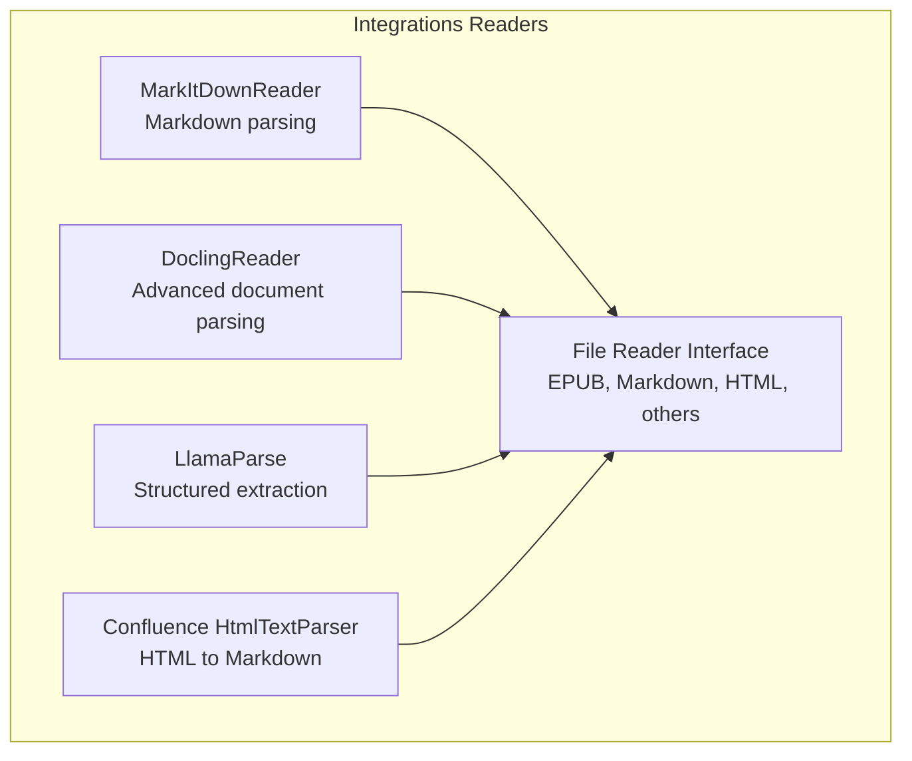

**Diagram sources**
- [__init__.py](file://llama-index-integrations/readers/llama-index-readers-markitdown/llama_index/readers/markitdown/__init__.py#L1-L4)
- [__init__.py](file://llama-index-integrations/readers/llama-index-readers-docling/llama_index/readers/docling/__init__.py#L1-L5)
- [__init__.py](file://llama-index-integrations/readers/llama-index-readers-llama-parse/llama_index/readers/llama_parse/__init__.py#L1-L5)
- [__init__.py](file://llama-index-integrations/readers/llama-index-readers-file/llama_index/readers/file/__init__.py#L1-L50)
- [html_parser.py](file://llama-index-integrations/readers/llama-index-readers-confluence/llama_index/readers/confluence/html_parser.py#L1-L22)

**Section sources**
- [__init__.py](file://llama-index-integrations/readers/llama-index-readers-markitdown/llama_index/readers/markitdown/__init__.py#L1-L4)
- [__init__.py](file://llama-index-integrations/readers/llama-index-readers-docling/llama_index/readers/docling/__init__.py#L1-L5)
- [__init__.py](file://llama-index-integrations/readers/llama-index-readers-llama-parse/llama_index/readers/llama_parse/__init__.py#L1-L5)
- [__init__.py](file://llama-index-integrations/readers/llama-index-readers-file/llama_index/readers/file/__init__.py#L1-L50)
- [html_parser.py](file://llama-index-integrations/readers/llama-index-readers-confluence/llama_index/readers/confluence/html_parser.py#L1-L22)

## Core Components
- MarkItDownReader: Provides Markdown parsing and conversion capabilities, suitable for extracting readable text from Markdown while preserving structure.
- DoclingReader: Offers advanced document parsing for complex formats, enabling semantic extraction and formatting preservation.
- LlamaParse: Structured extraction and layout-aware parsing for documents, supporting robust content filtering and resource handling.
- File Reader Interface: Centralized exports for EPUB, Markdown, HTML, and other formats, enabling unified access patterns across diverse document types.
- Confluence HtmlTextParser: Converts HTML content to Markdown with configurable stripping of script/style tags and Markdownify options.

These components collectively support specialized parsing workflows for e-books, Markdown documents with code blocks, HTML pages with complex layouts, and other niche document formats.

**Section sources**
- [__init__.py](file://llama-index-integrations/readers/llama-index-readers-markitdown/llama_index/readers/markitdown/__init__.py#L1-L4)
- [__init__.py](file://llama-index-integrations/readers/llama-index-readers-docling/llama_index/readers/docling/__init__.py#L1-L5)
- [__init__.py](file://llama-index-integrations/readers/llama-index-readers-llama-parse/llama_index/readers/llama_parse/__init__.py#L1-L5)
- [__init__.py](file://llama-index-integrations/readers/llama-index-readers-file/llama_index/readers/file/__init__.py#L1-L50)
- [html_parser.py](file://llama-index-integrations/readers/llama-index-readers-confluence/llama_index/readers/confluence/html_parser.py#L1-L22)

## Architecture Overview
The specialized readers integrate with a layered architecture:
- Reader Layer: Exposes specialized readers (MarkItDown, Docling, LlamaParse, File-based, Confluence HTML parser)
- Parsing Engine: Handles markup parsing, semantic extraction, and formatting preservation
- Configuration Layer: Manages content filtering, CSS handling, link extraction, and embedded resource processing
- Output Layer: Produces normalized content suitable for downstream ingestion and retrieval

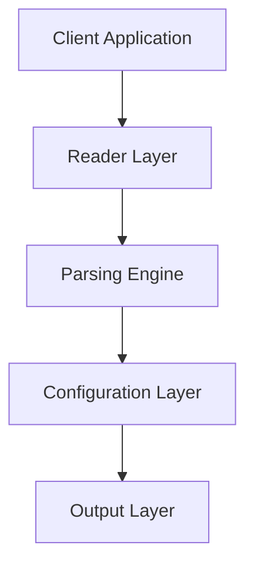

[No sources needed since this diagram shows conceptual workflow, not actual code structure]

## Detailed Component Analysis

### MarkItDownReader
MarkItDownReader enables Markdown parsing and conversion. It supports:
- Conversion of Markdown to plain text with preserved structure
- Configuration options for headings, bullet styles, and tag stripping
- Integration with the file reader interface for Markdown documents

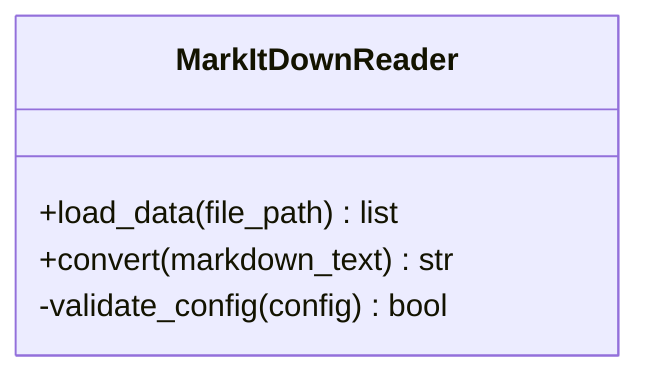

**Diagram sources**
- [__init__.py](file://llama-index-integrations/readers/llama-index-readers-markitdown/llama_index/readers/markitdown/__init__.py#L1-L4)
- [base.py](file://llama-index-integrations/readers/llama-index-readers-markitdown/llama_index/readers/markitdown/base.py)

**Section sources**
- [__init__.py](file://llama-index-integrations/readers/llama-index-readers-markitdown/llama_index/readers/markitdown/__init__.py#L1-L4)
- [base.py](file://llama-index-integrations/readers/llama-index-readers-markitdown/llama_index/readers/markitdown/base.py)

### DoclingReader
DoclingReader provides advanced document parsing for complex formats. Capabilities include:
- Semantic extraction and formatting preservation
- Support for structured content from various document types
- Integration with the file reader interface for broader format coverage

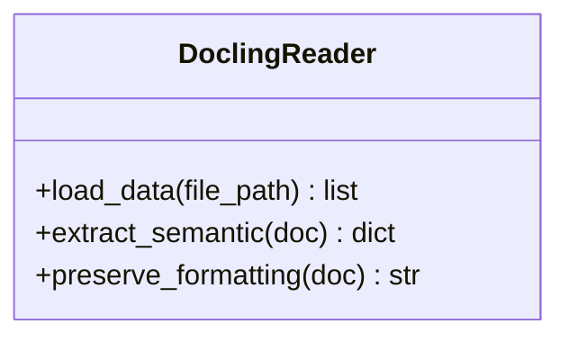

**Diagram sources**
- [__init__.py](file://llama-index-integrations/readers/llama-index-readers-docling/llama_index/readers/docling/__init__.py#L1-L5)
- [base.py](file://llama-index-integrations/readers/llama-index-readers-docling/llama_index/readers/docling/base.py)

**Section sources**
- [__init__.py](file://llama-index-integrations/readers/llama-index-readers-docling/llama_index/readers/docling/__init__.py#L1-L5)
- [base.py](file://llama-index-integrations/readers/llama-index-readers-docling/llama_index/readers/docling/base.py)

### LlamaParse
LlamaParse offers structured extraction and layout-aware parsing. It supports:
- Content filtering and resource handling
- Extraction of semantic elements with formatting preservation
- Configuration for links, embedded resources, and CSS processing

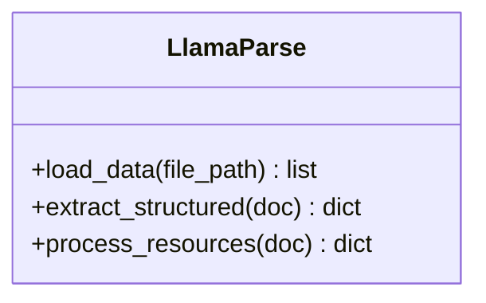

**Diagram sources**
- [__init__.py](file://llama-index-integrations/readers/llama-index-readers-llama-parse/llama_index/readers/llama_parse/__init__.py#L1-L5)

**Section sources**
- [__init__.py](file://llama-index-integrations/readers/llama-index-readers-llama-parse/llama_index/readers/llama_parse/__init__.py#L1-L5)

### File Reader Interface (EPUB, Markdown, HTML)
The file reader interface centralizes access to multiple formats:
- EPUB: EpubReader for e-book content
- Markdown: MarkdownReader for Markdown documents
- HTML: HTMLTagReader for HTML pages
- Others: Additional readers for slides, CSV, XML, RTF, and more

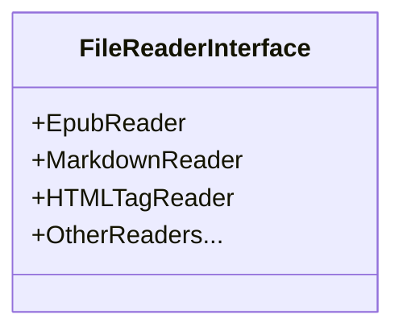

**Diagram sources**
- [__init__.py](file://llama-index-integrations/readers/llama-index-readers-file/llama_index/readers/file/__init__.py#L1-L50)

**Section sources**
- [__init__.py](file://llama-index-integrations/readers/llama-index-readers-file/llama_index/readers/file/__init__.py#L1-L50)

### Confluence HtmlTextParser
Converts HTML content to Markdown with configurable options:
- Strips script and style tags for security
- Uses Markdownify with ATX headings and asterisk bullets
- Returns sanitized Markdown text

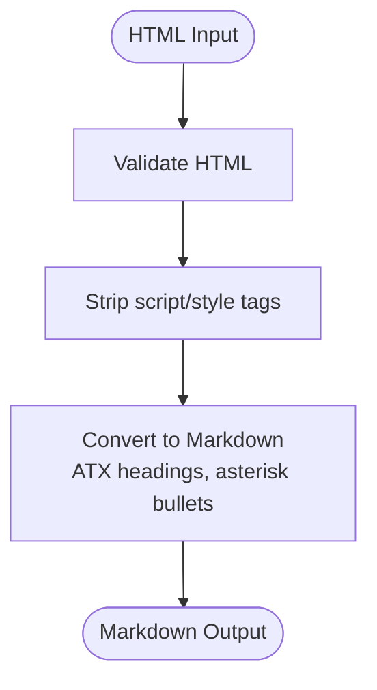

**Diagram sources**
- [html_parser.py](file://llama-index-integrations/readers/llama-index-readers-confluence/llama_index/readers/confluence/html_parser.py#L1-L22)

**Section sources**
- [html_parser.py](file://llama-index-integrations/readers/llama-index-readers-confluence/llama_index/readers/confluence/html_parser.py#L1-L22)

### Example Workflows

#### Processing an EPUB (e-book)
- Use EpubReader from the file reader interface
- Extract chapters and metadata
- Normalize content for downstream processing

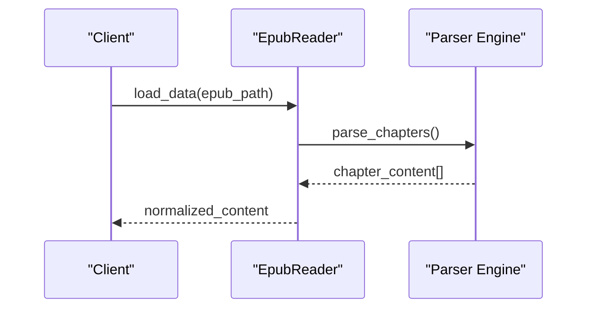

[No sources needed since this diagram shows conceptual workflow, not actual code structure]

#### Processing a Markdown Document with Code Blocks
- Use MarkItDownReader or MarkdownReader
- Preserve code block formatting during conversion
- Apply content filtering to remove unwanted sections

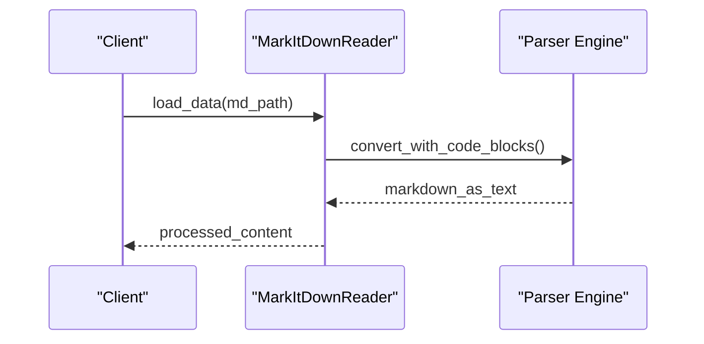

[No sources needed since this diagram shows conceptual workflow, not actual code structure]

#### Processing an HTML Page with Complex Layouts
- Use HTMLTagReader for raw tag extraction
- Apply HtmlTextParser for HTML-to-Markdown conversion
- Configure tag stripping and Markdownify options

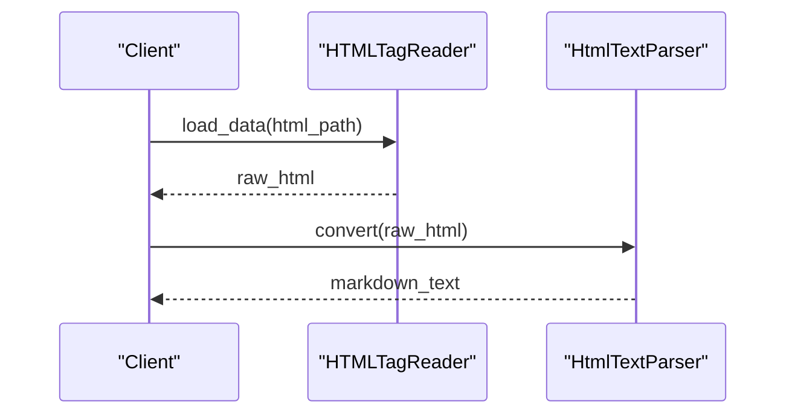

**Diagram sources**
- [__init__.py](file://llama-index-integrations/readers/llama-index-readers-file/llama_index/readers/file/__init__.py#L1-L50)
- [html_parser.py](file://llama-index-integrations/readers/llama-index-readers-confluence/llama_index/readers/confluence/html_parser.py#L1-L22)

**Section sources**
- [__init__.py](file://llama-index-integrations/readers/llama-index-readers-file/llama_index/readers/file/__init__.py#L1-L50)
- [html_parser.py](file://llama-index-integrations/readers/llama-index-readers-confluence/llama_index/readers/confluence/html_parser.py#L1-L22)

## Dependency Analysis
The specialized readers depend on external libraries and internal parsing engines:
- MarkItDownReader depends on Markdown parsing libraries
- DoclingReader integrates with advanced document parsing backends
- LlamaParse relies on structured extraction and layout-aware parsing
- File Reader Interface aggregates multiple readers under a single namespace
- Confluence HtmlTextParser depends on Markdownify for HTML-to-Markdown conversion

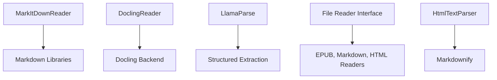

[No sources needed since this diagram shows conceptual relationships, not actual code structure]

**Section sources**
- [__init__.py](file://llama-index-integrations/readers/llama-index-readers-markitdown/llama_index/readers/markitdown/__init__.py#L1-L4)
- [__init__.py](file://llama-index-integrations/readers/llama-index-readers-docling/llama_index/readers/docling/__init__.py#L1-L5)
- [__init__.py](file://llama-index-integrations/readers/llama-index-readers-llama-parse/llama_index/readers/llama_parse/__init__.py#L1-L5)
- [__init__.py](file://llama-index-integrations/readers/llama-index-readers-file/llama_index/readers/file/__init__.py#L1-L50)
- [html_parser.py](file://llama-index-integrations/readers/llama-index-readers-confluence/llama_index/readers/confluence/html_parser.py#L1-L22)

## Performance Considerations
- Prefer layout-aware parsers (DoclingReader, LlamaParse) for complex documents to reduce reprocessing overhead
- Use content filtering early to minimize downstream processing costs
- For large EPUBs, process chapters incrementally and stream content where possible
- Optimize Markdown parsing by disabling unnecessary transformations and leveraging caching for repeated conversions
- For HTML pages, pre-process and sanitize content to avoid expensive cleanup later

[No sources needed since this section provides general guidance]

## Troubleshooting Guide
Common issues and resolutions:
- Missing dependencies: Ensure required packages are installed for each reader (e.g., Markdownify for HtmlTextParser)
- Malformed content: Implement fallbacks and graceful degradation; log warnings for recoverable errors
- Large documents: Break content into chunks and process incrementally; monitor memory usage
- Formatting inconsistencies: Normalize outputs to a common representation; apply consistent content filters

**Section sources**
- [html_parser.py](file://llama-index-integrations/readers/llama-index-readers-confluence/llama_index/readers/confluence/html_parser.py#L1-L22)

## Conclusion
The specialized format readers provide a robust foundation for parsing EPUB, Markdown, HTML, and other niche formats. By leveraging MarkItDownReader, DoclingReader, LlamaParse, the File Reader Interface, and Confluence’s HtmlTextParser, applications can achieve accurate semantic extraction, formatting preservation, and efficient processing of complex documents. Proper configuration, performance tuning, and error recovery strategies enable reliable ingestion across diverse document types.