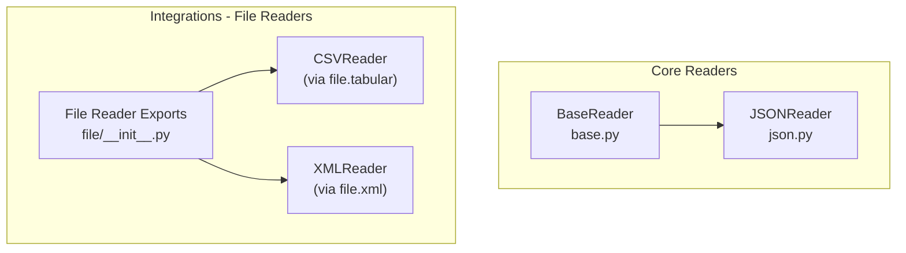
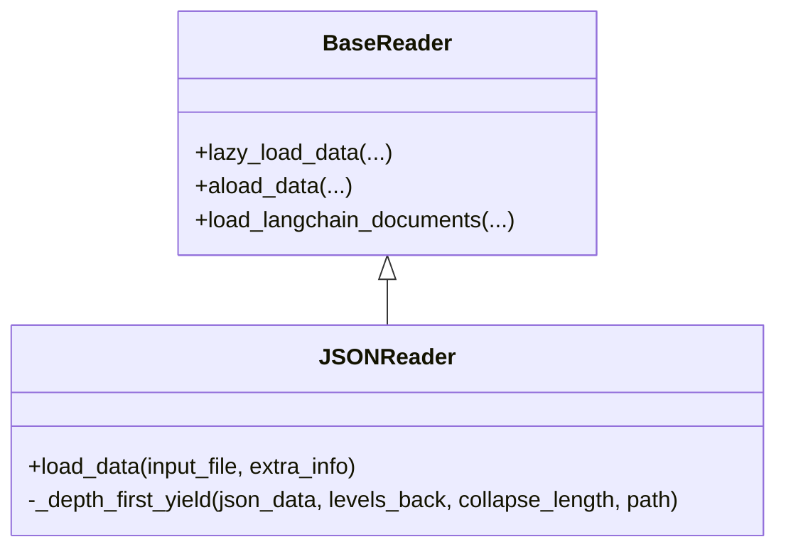
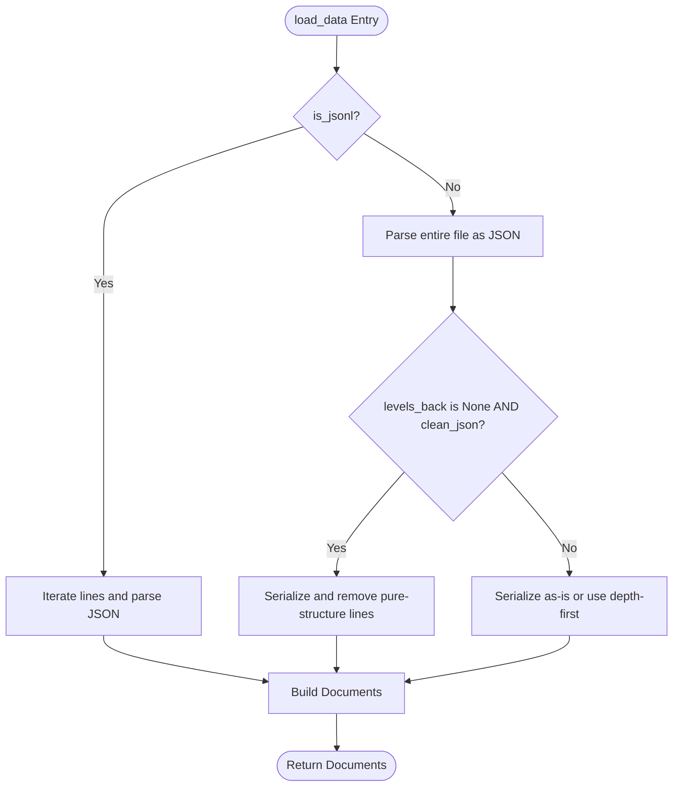
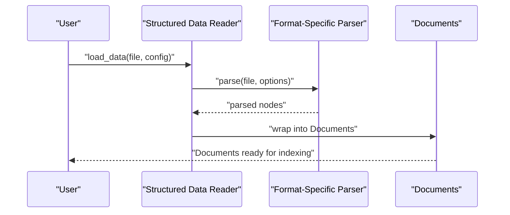
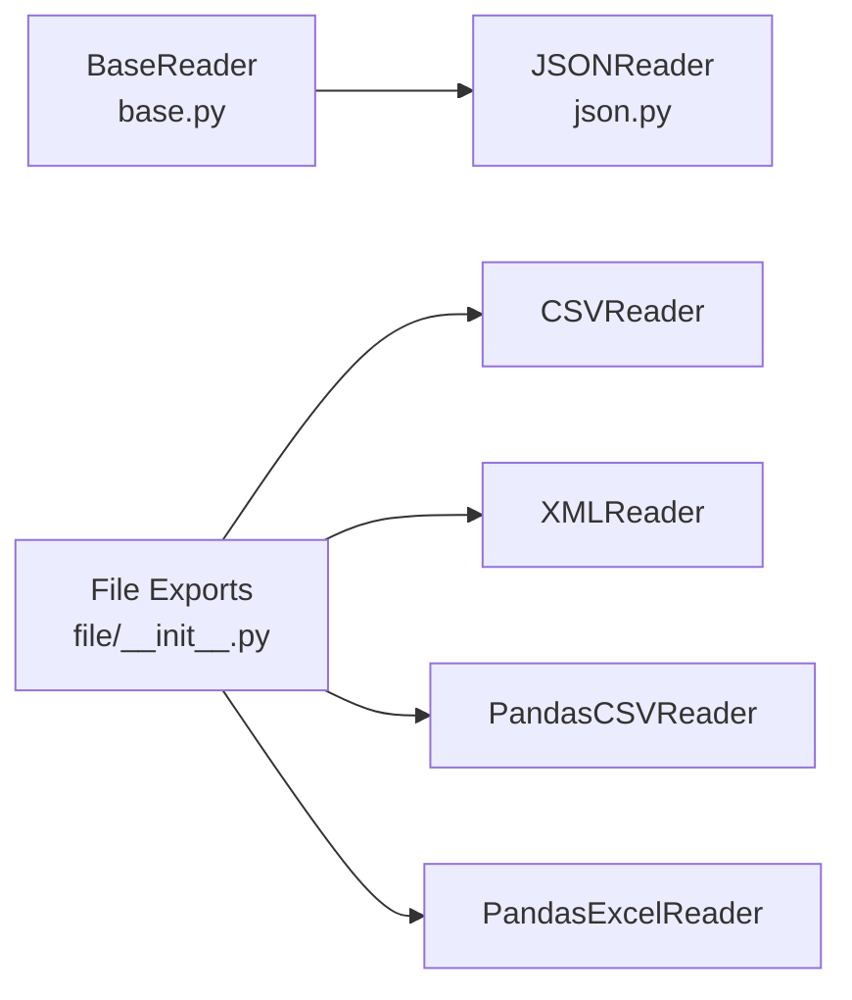

# Structured Data Readers

<cite>
**Referenced Files in This Document**
- [base.py](file://llama-index-core/llama_index/core/readers/base.py)
- [json.py](file://llama-index-core/llama_index/core/readers/json.py)
- [__init__.py](file://llama-index-core/llama_index/core/readers/__init__.py)
- [__init__.py](file://llama-index-integrations/readers/llama-index-readers-file/llama_index/readers/file/__init__.py)
- [test_xml.py](file://llama-index-integrations/readers/llama-index-readers-file/tests/test_xml.py)
- [nl_csv_retriever.py](file://llama-index-experimental/llama_index/experimental/retrievers/natural_language/nl_csv_retriever.py)
- [querying_csvs.md](file://docs/src/content/docs/framework/use_cases/querying_csvs.md)
</cite>

## Table of Contents
1. [Introduction](#introduction)
2. [Project Structure](#project-structure)
3. [Core Components](#core-components)
4. [Architecture Overview](#architecture-overview)
5. [Detailed Component Analysis](#detailed-component-analysis)
6. [Dependency Analysis](#dependency-analysis)
7. [Performance Considerations](#performance-considerations)
8. [Troubleshooting Guide](#troubleshooting-guide)
9. [Conclusion](#conclusion)
10. [Appendices](#appendices)

## Introduction
This document provides a comprehensive guide to structured data readers in the repository, focusing on CSV, JSON, and XML formats. It explains parsing techniques for hierarchical data, arrays, nested objects, and attribute extraction. It also covers configuration options such as delimiter detection, encoding handling, schema inference, and data type conversion. Practical guidance is included for processing large datasets, handling missing values, extracting specific fields, transforming data formats, optimizing performance for bulk processing, streaming large files efficiently, and handling malformed data. Finally, it outlines how to customize parsing parameters and extend readers for specialized structured formats.

## Project Structure
The structured data readers are organized across core readers and integrations:
- Core readers define the foundational abstractions and JSON reader.
- Integrations provide CSV, XML, and related structured data readers under the file reader ecosystem.

**Diagram sources**
- [base.py](file://llama-index-core/llama_index/core/readers/base.py#L19-L47)
- [json.py](file://llama-index-core/llama_index/core/readers/json.py#L53-L155)
- [__init__.py](file://llama-index-integrations/readers/llama-index-readers-file/llama_index/readers/file/__init__.py#L16-L23)

**Section sources**
- [base.py](file://llama-index-core/llama_index/core/readers/base.py#L1-L250)
- [json.py](file://llama-index-core/llama_index/core/readers/json.py#L1-L155)
- [__init__.py](file://llama-index-integrations/readers/llama-index-readers-file/llama_index/readers/file/__init__.py#L1-L50)

## Core Components
- BaseReader: Defines the interface for synchronous and asynchronous loading, plus convenience methods for converting to LangChain document format.
- JSONReader: Implements JSON and JSONL loading with configurable depth-first traversal, collapsing options, and ASCII handling.
- Reader exports: The file reader module exposes CSVReader, PandasCSVReader, PandasExcelReader, and XMLReader among others.

Key capabilities:
- Asynchronous loading via thread-backed async wrappers.
- Lazy loading interface for memory-efficient consumption.
- LangChain interoperability for downstream pipelines.

**Section sources**
- [base.py](file://llama-index-core/llama_index/core/readers/base.py#L19-L47)
- [json.py](file://llama-index-core/llama_index/core/readers/json.py#L53-L155)
- [__init__.py](file://llama-index-integrations/readers/llama-index-readers-file/llama_index/readers/file/__init__.py#L16-L23)

## Architecture Overview
The readers follow a layered architecture:
- Abstraction: BaseReader defines the contract for loading data.
- Implementation: JSONReader demonstrates hierarchical traversal and formatting strategies.
- Integration: File reader exports expose CSV and XML readers for structured tabular and XML content.

**Diagram sources**
- [base.py](file://llama-index-core/llama_index/core/readers/base.py#L19-L47)
- [json.py](file://llama-index-core/llama_index/core/readers/json.py#L53-L155)

## Detailed Component Analysis

### JSON Reader
The JSON reader supports:
- Loading JSON and JSONL formats.
- Hierarchical traversal with configurable levels back and collapsing thresholds.
- Cleaning options to remove pure-structure lines when levels_back is not used.
- ASCII handling for character encoding.

Parsing techniques:
- Depth-first traversal yields leaf values with optional collapsing for compact embeddings.
- For JSONL, each line is parsed independently.
- For JSON, the entire file is parsed into a single document.

Configuration options:
- levels_back: Controls how many parent keys are included in the output path for leaf nodes.
- collapse_length: Collapses small subtrees into a single line when total serialized length is under threshold.
- is_jsonl: Enables JSONL mode.
- clean_json: Removes empty-structure lines when levels_back is not used.
- ensure_ascii: Controls ASCII-only output during serialization.

Error handling:
- Recursion errors are caught and warned; returns an empty list to prevent crashes.

**Diagram sources**
- [json.py](file://llama-index-core/llama_index/core/readers/json.py#L97-L155)

**Section sources**
- [json.py](file://llama-index-core/llama_index/core/readers/json.py#L53-L155)

### CSV Reader (via file.tabular)
The file reader module exposes CSV-related readers:
- CSVReader: Basic CSV parsing.
- PandasCSVReader: Uses pandas for robust parsing, including dtype inference and missing value handling.
- PandasExcelReader: Excel parsing via pandas.

Processing techniques:
- Delimiter detection and quoting rules are handled by underlying parsers.
- Schema inference and dtype conversion are supported via pandas when used.
- Missing values can be represented consistently and transformed as needed.

Examples and guidance:
- Use CSVReader for lightweight parsing.
- Use PandasCSVReader/PandasExcelReader for advanced schema inference and data type conversion.
- For large CSVs, consider chunked processing and column selection to reduce memory usage.

Note: The natural language CSV retriever demonstrates practical usage patterns for CSV retrieval and querying.

**Section sources**
- [__init__.py](file://llama-index-integrations/readers/llama-index-readers-file/llama_index/readers/file/__init__.py#L16-L20)
- [nl_csv_retriever.py](file://llama-index-experimental/llama_index/experimental/retrievers/natural_language/nl_csv_retriever.py#L1-L200)
- [querying_csvs.md](file://docs/src/content/docs/framework/use_cases/querying_csvs.md#L1-L200)

### XML Reader (via file.xml)
The file reader module exports XMLReader for structured XML parsing.

Processing techniques:
- Attribute extraction and element traversal are supported by the underlying XML parser.
- Nested elements are preserved, enabling hierarchical transformations.

Configuration options:
- Encoding handling is determined by the underlying XML parser.
- Customization can be achieved by configuring the XML parser used internally.

Testing:
- XML reader tests validate parsing behavior and error handling for malformed XML.

**Section sources**
- [__init__.py](file://llama-index-integrations/readers/llama-index-readers-file/llama_index/readers/file/__init__.py#L23-L23)
- [test_xml.py](file://llama-index-integrations/readers/llama-index-readers-file/tests/test_xml.py#L1-L200)

### Conceptual Overview
The following conceptual workflow illustrates how structured data readers fit into a typical ingestion pipeline:

[No sources needed since this diagram shows conceptual workflow, not actual code structure]

## Dependency Analysis
The structured data readers depend on:
- Core BaseReader for the unified loading interface.
- File reader exports for CSV and XML readers.
- Optional pandas-based readers for advanced schema inference and data type conversion.

**Diagram sources**
- [base.py](file://llama-index-core/llama_index/core/readers/base.py#L19-L47)
- [json.py](file://llama-index-core/llama_index/core/readers/json.py#L53-L155)
- [__init__.py](file://llama-index-integrations/readers/llama-index-readers-file/llama_index/readers/file/__init__.py#L16-L23)

**Section sources**
- [base.py](file://llama-index-core/llama_index/core/readers/base.py#L1-L250)
- [json.py](file://llama-index-core/llama_index/core/readers/json.py#L1-L155)
- [__init__.py](file://llama-index-integrations/readers/llama-index-readers-file/llama_index/readers/file/__init__.py#L1-L50)

## Performance Considerations
- Prefer lazy loading for large datasets to reduce peak memory usage.
- Use chunked processing for CSV and JSONL to stream records incrementally.
- Limit columns and rows when possible to minimize memory footprint.
- Choose pandas-based readers for efficient dtype inference and conversion.
- Avoid deep recursion in hierarchical structures; adjust levels_back and collapse_length to control output size.
- For XML, validate and normalize input to reduce parsing overhead.

[No sources needed since this section provides general guidance]

## Troubleshooting Guide
Common issues and resolutions:
- Malformed JSON: The JSON reader catches recursion errors and warns, returning an empty list. Validate input or preprocess JSON to avoid deeply nested structures.
- Large JSON payloads: Use levels_back and collapse_length to reduce output size and improve embedding efficiency.
- CSV parsing failures: Verify delimiters, quoting, and encoding. Consider pandas-based readers for robustness.
- XML parsing errors: Ensure well-formed XML and appropriate encoding. Use XML reader tests as a reference for expected behavior.

**Section sources**
- [json.py](file://llama-index-core/llama_index/core/readers/json.py#L152-L155)
- [test_xml.py](file://llama-index-integrations/readers/llama-index-readers-file/tests/test_xml.py#L1-L200)

## Conclusion
Structured data readers in this repository provide flexible, extensible mechanisms for ingesting CSV, JSON, and XML data. By leveraging BaseReader abstractions, hierarchical traversal options, and integration-specific parsers, users can tailor ingestion pipelines to handle diverse formats, large volumes, and complex schemas. Applying the recommended configurations and performance strategies ensures reliable, efficient processing across varied workloads.

## Appendices
- Extending readers: Implement BaseReader or BasePydanticReader to integrate new structured formats. Use ReaderConfig to encapsulate reader instances and arguments for reproducible pipelines.
- Customizing parameters: Adjust levels_back, collapse_length, is_jsonl, clean_json, and ensure_ascii for JSON; select CSV/Excel readers for advanced schema inference; configure XML parser encoding and attributes.

**Section sources**
- [base.py](file://llama-index-core/llama_index/core/readers/base.py#L223-L250)
- [json.py](file://llama-index-core/llama_index/core/readers/json.py#L81-L96)
- [__init__.py](file://llama-index-integrations/readers/llama-index-readers-file/llama_index/readers/file/__init__.py#L16-L23)