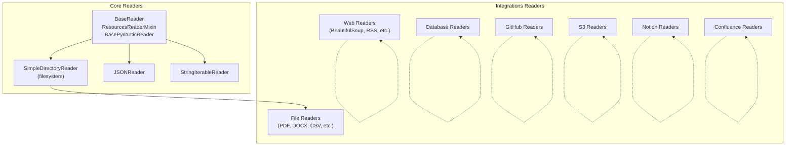
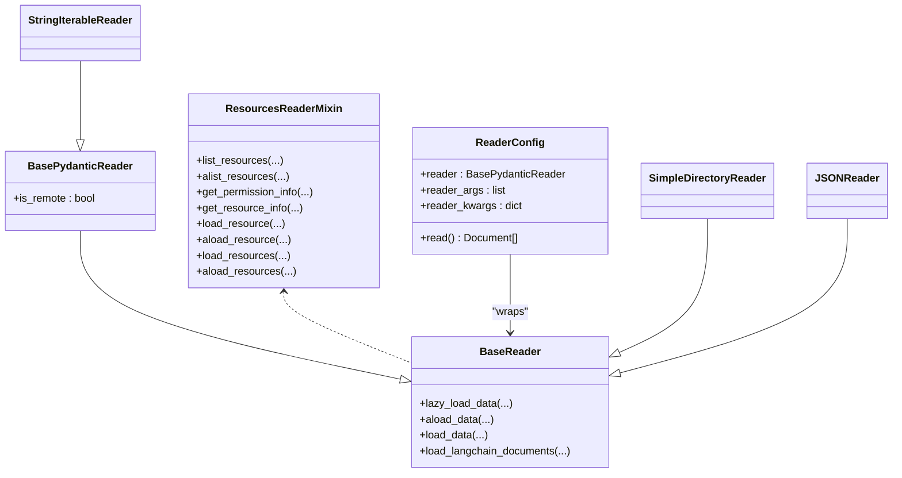
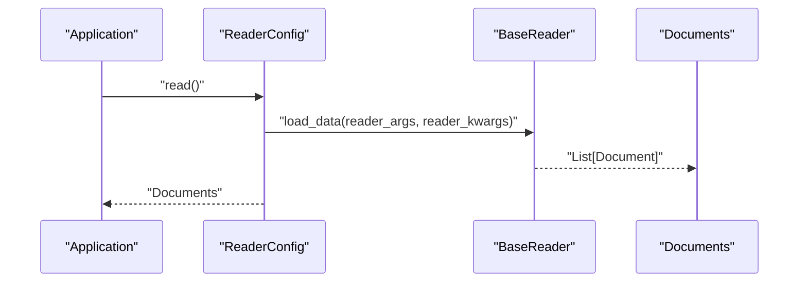
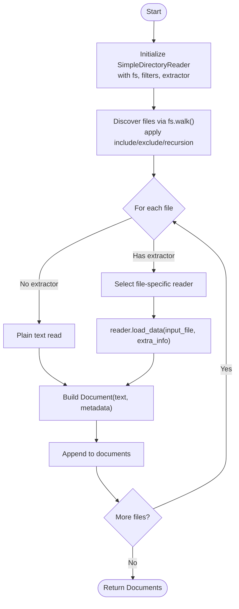
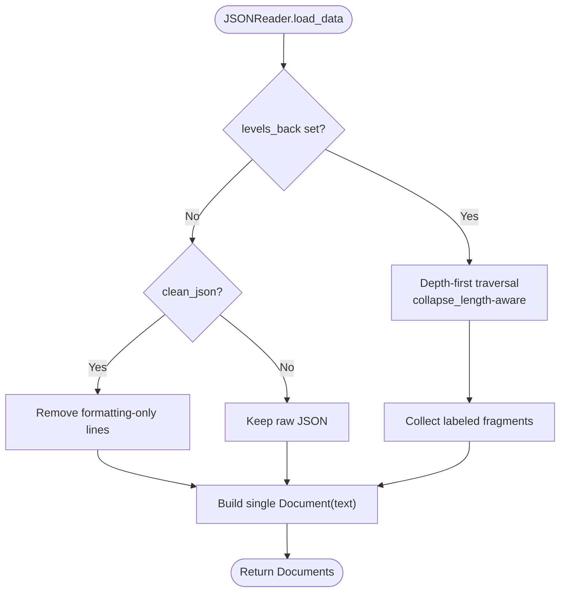
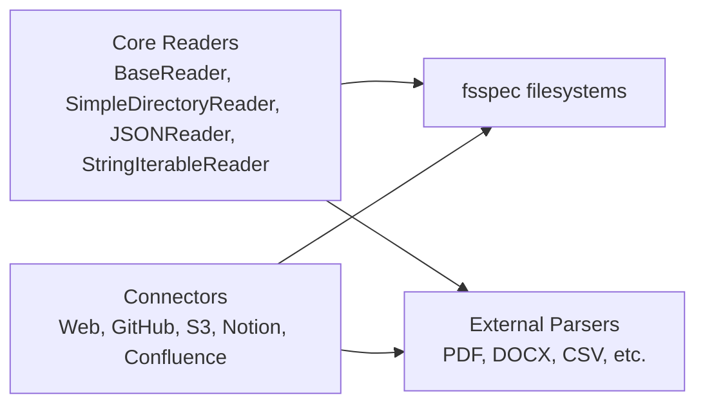

# Readers and Data Connectors

<cite>
**Referenced Files in This Document**
- [base.py](file://llama-index-core/llama_index/core/readers/base.py)
- [__init__.py](file://llama-index-core/llama_index/core/readers/__init__.py)
- [base.py](file://llama-index-core/llama_index/core/readers/file/base.py)
- [json.py](file://llama-index-core/llama_index/core/readers/json.py)
- [string_iterable.py](file://llama-index-core/llama_index/core/readers/string_iterable.py)
- [__init__.py](file://llama-index-integrations/readers/llama-index-readers-file/llama_index/readers/file/__init__.py)
- [__init__.py](file://llama-index-integrations/readers/llama-index-readers-web/llama_index/readers/web/__init__.py)
- [__init__.py](file://llama-index-integrations/readers/llama-index-readers-database/llama_index/readers/database/__init__.py)
- [__init__.py](file://llama-index-integrations/readers/llama-index-readers-github/llama_index/readers/github/__init__.py)
- [__init__.py](file://llama-index-integrations/readers/llama-index-readers-s3/llama_index/readers/s3/__init__.py)
- [__init__.py](file://llama-index-integrations/readers/llama-index-readers-notion/llama_index/readers/notion/__init__.py)
- [__init__.py](file://llama-index-integrations/readers/llama-index-readers-confluence/llama_index/readers/confluence/__init__.py)
</cite>

## Table of Contents
1. [Introduction](#introduction)
2. [Project Structure](#project-structure)
3. [Core Components](#core-components)
4. [Architecture Overview](#architecture-overview)
5. [Detailed Component Analysis](#detailed-component-analysis)
6. [Dependency Analysis](#dependency-analysis)
7. [Performance Considerations](#performance-considerations)
8. [Troubleshooting Guide](#troubleshooting-guide)
9. [Conclusion](#conclusion)
10. [Appendices](#appendices)

## Introduction
This document explains how LlamaIndex unifies diverse data sources into a consistent ingestion pipeline through a shared reader interface. It covers:
- The unified BaseReader abstraction and supporting mixins
- Core built-in readers for files, JSON, and string iterables
- The extensible ecosystem of over 150 data connectors across file systems, databases, web scrapers, APIs, and cloud services
- Connector-specific configuration patterns for authentication, pagination, filtering, and transformation
- Practical examples for multi-source ingestion, incremental updates, validation, and performance optimization
- Guidance for building custom readers and integrating with external data platforms

## Project Structure
LlamaIndex organizes readers across two primary layers:
- Core readers: lightweight, foundational readers and the unified interface
- Integrations readers: community-maintained packages that expose specialized connectors for databases, web, cloud, and enterprise systems

**Diagram sources**
- [base.py](file://llama-index-core/llama_index/core/readers/base.py#L19-L250)
- [base.py](file://llama-index-core/llama_index/core/readers/file/base.py#L208-L800)
- [json.py](file://llama-index-core/llama_index/core/readers/json.py#L53-L155)
- [string_iterable.py](file://llama-index-core/llama_index/core/readers/string_iterable.py#L9-L44)
- [__init__.py](file://llama-index-integrations/readers/llama-index-readers-file/llama_index/readers/file/__init__.py#L1-L50)
- [__init__.py](file://llama-index-integrations/readers/llama-index-readers-web/llama_index/readers/web/__init__.py#L1-L89)
- [__init__.py](file://llama-index-integrations/readers/llama-index-readers-database/llama_index/readers/database/__init__.py#L1-L4)
- [__init__.py](file://llama-index-integrations/readers/llama-index-readers-github/llama_index/readers/github/__init__.py#L1-L40)
- [__init__.py](file://llama-index-integrations/readers/llama-index-readers-s3/llama_index/readers/s3/__init__.py#L1-L4)
- [__init__.py](file://llama-index-integrations/readers/llama-index-readers-notion/llama_index/readers/notion/__init__.py#L1-L4)
- [__init__.py](file://llama-index-integrations/readers/llama-index-readers-confluence/llama_index/readers/confluence/__init__.py#L1-L4)

**Section sources**
- [__init__.py](file://llama-index-core/llama_index/core/readers/__init__.py#L1-L33)

## Core Components
This section describes the unified reader interface and core readers that form the foundation for all connectors.

- BaseReader: Defines synchronous and asynchronous loading methods and bridges to LangChain documents.
- BasePydanticReader: Adds serializability and a flag indicating remote vs local data sources.
- ResourcesReaderMixin: Provides resource listing, permission info, and resource-specific loading for connectors that operate on named entities (e.g., files, channels, pages).
- ReaderConfig: Encapsulates a reader instance and its arguments for reproducible ingestion.

Key capabilities:
- Lazy and eager loading
- Async variants for scalable ingestion
- LangChain interoperability
- Resource-centric operations for connectors that manage collections of entities

**Section sources**
- [base.py](file://llama-index-core/llama_index/core/readers/base.py#L19-L250)

### Filesystem Reader: SimpleDirectoryReader
SimpleDirectoryReader discovers and loads files from local or remote filesystems via fsspec, automatically selecting appropriate file-specific readers based on suffixes. It supports:
- Directory traversal with include/exclude patterns and recursion
- Custom file metadata extraction
- Parallel loading with configurable workers
- Filename-as-id and error handling policies

It integrates with the broader reader ecosystem by delegating to specialized file readers when available and falling back to plain text reading otherwise.

**Section sources**
- [base.py](file://llama-index-core/llama_index/core/readers/file/base.py#L208-L800)

### JSON Reader
JSONReader converts JSON/JSONL into Documents with flexible strategies:
- Depth-first extraction with configurable levels and collapsing
- Cleaning to remove formatting-only lines
- Support for JSONL streaming

These options enable structured data to be transformed into embeddings-friendly text while preserving hierarchical relationships.

**Section sources**
- [json.py](file://llama-index-core/llama_index/core/readers/json.py#L53-L155)

### String Iterable Reader
StringIterableReader accepts an iterable of strings and produces Documents, enabling quick ingestion of preprocessed or synthetic text.

**Section sources**
- [string_iterable.py](file://llama-index-core/llama_index/core/readers/string_iterable.py#L9-L44)

## Architecture Overview
The unified reader interface ensures all connectors share a consistent contract, while integrations encapsulate connector-specific logic behind the same API.

**Diagram sources**
- [base.py](file://llama-index-core/llama_index/core/readers/base.py#L19-L250)
- [base.py](file://llama-index-core/llama_index/core/readers/file/base.py#L208-L800)
- [json.py](file://llama-index-core/llama_index/core/readers/json.py#L53-L155)
- [string_iterable.py](file://llama-index-core/llama_index/core/readers/string_iterable.py#L9-L44)

## Detailed Component Analysis

### Unified Reader Interface
- Methods:
  - load_data/aload_data: synchronous and asynchronous batch loading
  - lazy_load_data/alazy_load_data: lazy iteration for memory efficiency
  - load_langchain_documents: interop with LangChain Document format
- Async pattern: Default async implementation runs sync methods in threads; connectors should override with true async I/O where possible.

**Diagram sources**
- [base.py](file://llama-index-core/llama_index/core/readers/base.py#L35-L47)
- [base.py](file://llama-index-core/llama_index/core/readers/base.py#L247-L250)

**Section sources**
- [base.py](file://llama-index-core/llama_index/core/readers/base.py#L19-L250)

### Filesystem Ingestion Pipeline
SimpleDirectoryReader orchestrates discovery and loading across heterogeneous file formats, delegating to specialized readers when present.

**Diagram sources**
- [base.py](file://llama-index-core/llama_index/core/readers/file/base.py#L554-L716)

Connector-specific configuration highlights:
- Authentication: Provided by the underlying fsspec filesystem (e.g., S3 credentials via environment or explicit client)
- Pagination/Filtering: Controlled via fs.walk(), include/exclude patterns, recursion depth, and required extensions
- Transformation: Custom file_metadata function and filename_as_id; per-reader transformers via file_extractor mapping

**Section sources**
- [base.py](file://llama-index-core/llama_index/core/readers/file/base.py#L208-L800)

### JSON Ingestion Strategy
JSONReader offers multiple strategies to balance semantic richness and noise reduction.

**Diagram sources**
- [json.py](file://llama-index-core/llama_index/core/readers/json.py#L97-L155)

**Section sources**
- [json.py](file://llama-index-core/llama_index/core/readers/json.py#L53-L155)

### String Iterable Ingestion
Directly converts a list of strings into Documents for rapid prototyping or preprocessed content.

**Section sources**
- [string_iterable.py](file://llama-index-core/llama_index/core/readers/string_iterable.py#L9-L44)

### Web Scrapers and RSS Readers
The integrations package exposes a wide range of web scrapers and RSS readers, each tailored to specific extraction strategies (e.g., BeautifulSoup, Trafilatura, Scrapy, Zyte, Oxylabs).

Common configuration patterns:
- Authentication: API keys or session cookies for sites requiring login
- Pagination: URL patterns or pagination helpers provided by the connector
- Filtering: Selective element extraction, XPath/CSS selectors, or domain/site-wide constraints
- Rate limiting and retries: Built-in controls to respect robots and avoid throttling

Examples of available readers:
- BeautifulSoupWebReader, TrafilaturaWebReader, ZyteWebReader, OxylabsWebReader, ScrapyWebReader, RssReader, RssNewsReader, SitemapReader, WholeSiteReader

**Section sources**
- [__init__.py](file://llama-index-integrations/readers/llama-index-readers-web/llama_index/readers/web/__init__.py#L1-L89)

### Database Connectors
DatabaseReader provides a unified entry point for relational and document databases. Typical configuration includes:
- Connection parameters (host, port, credentials)
- Query or collection selection
- Filtering predicates and pagination
- Data transformation hooks to normalize schema and column names

**Section sources**
- [__init__.py](file://llama-index-integrations/readers/llama-index-readers-database/llama_index/readers/database/__init__.py#L1-L4)

### Cloud and Enterprise Services
Connectors for popular platforms are organized under dedicated packages:
- GitHub: Repository, issues, collaborators, and optional GitHub App authentication
- S3: Object listing and reading with fsspec-compatible credentials
- Notion: Page-level extraction
- Confluence: Space/page retrieval

Configuration patterns:
- Authentication: Tokens, OAuth, or service account credentials
- Resource scoping: Repository, bucket, space, or site identifiers
- Incremental updates: Last-modified filters and cursor-based pagination
- Transformation: Metadata enrichment and content normalization

**Section sources**
- [__init__.py](file://llama-index-integrations/readers/llama-index-readers-github/llama_index/readers/github/__init__.py#L1-L40)
- [__init__.py](file://llama-index-integrations/readers/llama-index-readers-s3/llama_index/readers/s3/__init__.py#L1-L4)
- [__init__.py](file://llama-index-integrations/readers/llama-index-readers-notion/llama_index/readers/notion/__init__.py#L1-L4)
- [__init__.py](file://llama-index-integrations/readers/llama-index-readers-confluence/llama_index/readers/confluence/__init__.py#L1-L4)

### File-Specific Readers (Selected)
The file readers package includes readers for PDF, DOCX, CSV, Excel, images, notebooks, EPUB, mbox, and more. These are integrated automatically by SimpleDirectoryReader when available.

Configuration highlights:
- OCR and layout parsing for images/PDFs
- Column selection and schema inference for tabular formats
- Notebook cell extraction and language filtering

**Section sources**
- [__init__.py](file://llama-index-integrations/readers/llama-index-readers-file/llama_index/readers/file/__init__.py#L1-L50)

## Dependency Analysis
The reader ecosystem exhibits clear separation of concerns:
- Core readers define the interface and common behaviors
- Integrations encapsulate connector-specific logic and third-party dependencies
- Readers may depend on fsspec for filesystem abstraction and on external libraries for parsing/format-specific logic

**Diagram sources**
- [base.py](file://llama-index-core/llama_index/core/readers/file/base.py#L208-L800)
- [__init__.py](file://llama-index-integrations/readers/llama-index-readers-web/llama_index/readers/web/__init__.py#L1-L89)
- [__init__.py](file://llama-index-integrations/readers/llama-index-readers-github/llama_index/readers/github/__init__.py#L1-L40)
- [__init__.py](file://llama-index-integrations/readers/llama-index-readers-s3/llama_index/readers/s3/__init__.py#L1-L4)
- [__init__.py](file://llama-index-integrations/readers/llama-index-readers-notion/llama_index/readers/notion/__init__.py#L1-L4)
- [__init__.py](file://llama-index-integrations/readers/llama-index-readers-confluence/llama_index/readers/confluence/__init__.py#L1-L4)

**Section sources**
- [base.py](file://llama-index-core/llama_index/core/readers/file/base.py#L208-L800)

## Performance Considerations
- Prefer asynchronous loaders where available; override default thread-based async wrappers with true async I/O
- Use parallel loading with SimpleDirectoryReader when dealing with large directories; cap workers to CPU count
- Leverage resource listing and targeted loading (ResourcesReaderMixin) to avoid scanning entire repositories or buckets
- Apply include/exclude patterns and required extensions to minimize unnecessary work
- For JSON ingestion, tune levels_back and collapse_length to balance recall and embedding quality
- Use file_metadata functions to precompute expensive metadata and cache results when possible

[No sources needed since this section provides general guidance]

## Troubleshooting Guide
Common issues and remedies:
- Missing dependencies for specialized readers: Install the corresponding integration package (e.g., file readers) to unlock automatic format detection
- Permission errors on remote filesystems: Verify credentials and IAM roles for S3/GCS; ensure API tokens for web scrapers
- Large file timeouts: Increase timeout settings in connector clients; consider chunking or streaming
- Unexpected empty documents: Enable raise_on_error or inspect logs to identify parsing failures; adjust encoding and error handling
- Excessive metadata: Use excluded_embed_metadata_keys and excluded_llm_metadata_keys to reduce noise

**Section sources**
- [base.py](file://llama-index-core/llama_index/core/readers/file/base.py#L614-L626)
- [base.py](file://llama-index-core/llama_index/core/readers/file/base.py#L688-L696)

## Conclusion
LlamaIndex’s reader interface provides a consistent, extensible foundation for ingesting data from virtually any source. By combining core readers with a rich ecosystem of connectors, teams can build robust ingestion pipelines that support multi-source workflows, incremental updates, and advanced transformations—while maintaining a uniform developer experience across file formats, databases, web platforms, and cloud services.

[No sources needed since this section summarizes without analyzing specific files]

## Appendices

### Practical Examples Index
- Multi-source ingestion: Combine SimpleDirectoryReader with web scrapers and database connectors using ReaderConfig to unify outputs
- Incremental updates: Use resource listing and last-modified filters to process only changed items
- Data validation: Add pre-load checks for required metadata and enforce schema constraints during transformation
- Custom reader development: Subclass BasePydanticReader, implement load_data/aload_data, and register in a file_extractor mapping

[No sources needed since this section provides general guidance]