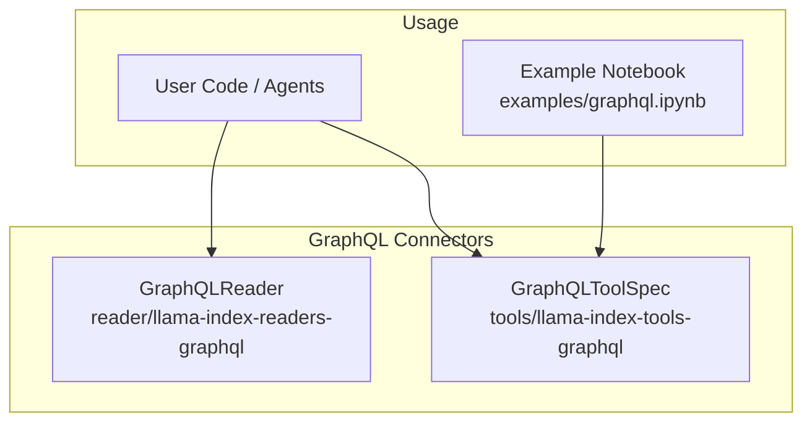
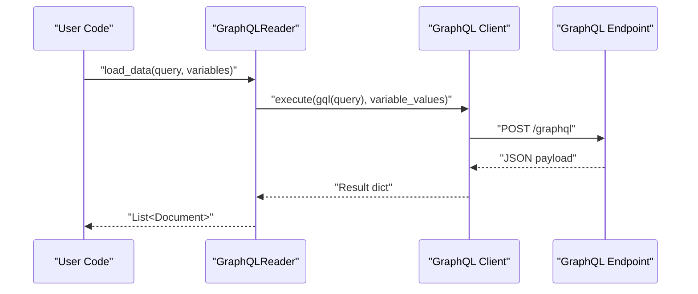
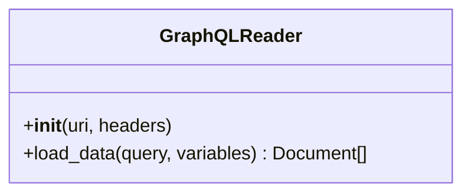
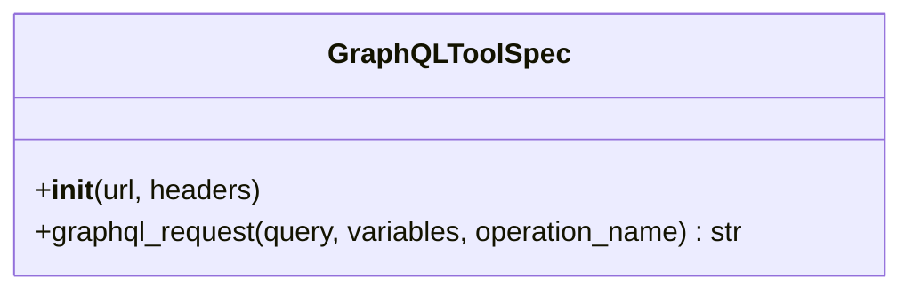
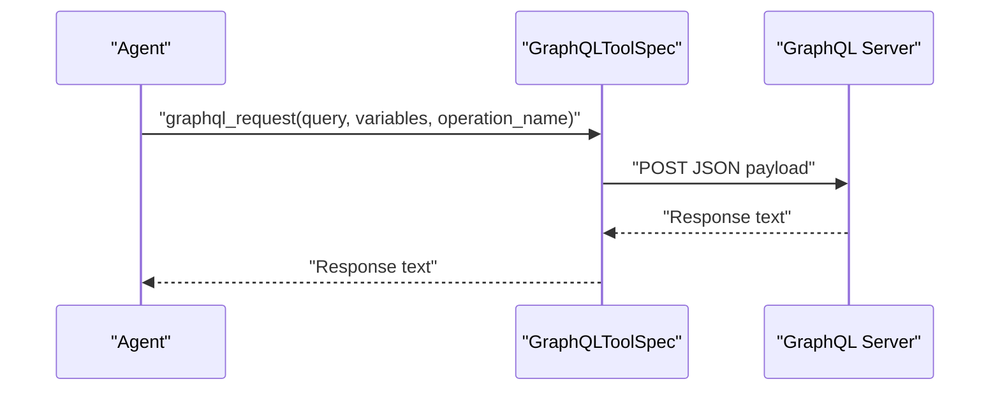
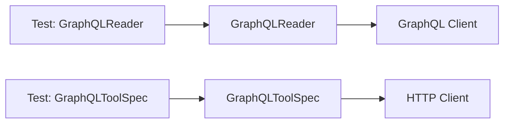

# GraphQL Connectors

<cite>
**Referenced Files in This Document**
- [base.py](file://llama-index-integrations/readers/llama-index-readers-graphql/llama_index/readers/graphql/base.py)
- [base.py](file://llama-index-integrations/tools/llama-index-tools-graphql/llama_index/tools/graphql/base.py)
- [graphql.ipynb](file://llama-index-integrations/tools/llama-index-tools-graphql/examples/graphql.ipynb)
- [test_readers_graphql.py](file://llama-index-integrations/readers/llama-index-readers-graphql/tests/test_readers_graphql.py)
- [test_tools_graphql.py](file://llama-index-integrations/tools/llama-index-tools-graphql/tests/test_tools_graphql.py)
- [graphql.md](file://docs/api_reference/api_reference/readers/graphql.md)
- [graphql.md](file://docs/api_reference/api_reference/tools/graphql.md)
</cite>

## Table of Contents
1. [Introduction](#introduction)
2. [Project Structure](#project-structure)
3. [Core Components](#core-components)
4. [Architecture Overview](#architecture-overview)
5. [Detailed Component Analysis](#detailed-component-analysis)
6. [Dependency Analysis](#dependency-analysis)
7. [Performance Considerations](#performance-considerations)
8. [Troubleshooting Guide](#troubleshooting-guide)
9. [Conclusion](#conclusion)
10. [Appendices](#appendices)

## Introduction
This document explains the GraphQL connectors available in LlamaIndex, focusing on how to construct queries, substitute variables, and produce Documents from GraphQL responses. It covers the reader and tool implementations present in the repository, along with usage patterns demonstrated in the included example notebooks. It also outlines areas where advanced features such as mutations, subscriptions, schema introspection, and real-time updates are not currently implemented in the referenced code, and provides guidance on extending the connectors to support those capabilities.

## Project Structure
The GraphQL connectors are implemented as:
- A reader that executes GraphQL queries and converts results into LlamaIndex Documents
- A tool specification that exposes a GraphQL request capability via a tool interface

**Diagram sources**
- [base.py](file://llama-index-integrations/readers/llama-index-readers-graphql/llama_index/readers/graphql/base.py#L10-L74)
- [base.py](file://llama-index-integrations/tools/llama-index-tools-graphql/llama_index/tools/graphql/base.py#L9-L43)
- [graphql.ipynb](file://llama-index-integrations/tools/llama-index-tools-graphql/examples/graphql.ipynb#L1-L126)

**Section sources**
- [base.py](file://llama-index-integrations/readers/llama-index-readers-graphql/llama_index/readers/graphql/base.py#L1-L74)
- [base.py](file://llama-index-integrations/tools/llama-index-tools-graphql/llama_index/tools/graphql/base.py#L1-L43)
- [graphql.ipynb](file://llama-index-integrations/tools/llama-index-tools-graphql/examples/graphql.ipynb#L1-L126)

## Core Components
- GraphQLReader: Executes a GraphQL query with optional variables against a configured endpoint and returns a list of Documents. It initializes a client with schema fetching enabled and supports custom HTTP headers.
- GraphQLToolSpec: Provides a tool method to send a GraphQL request to a URL with headers, returning the raw response text.

Key behaviors:
- Query execution uses a GraphQL client with schema fetched from the transport.
- Variables are passed as a dictionary to the execution call.
- Results are transformed into Documents by serializing the returned data structures.

**Section sources**
- [base.py](file://llama-index-integrations/readers/llama-index-readers-graphql/llama_index/readers/graphql/base.py#L22-L74)
- [base.py](file://llama-index-integrations/tools/llama-index-tools-graphql/llama_index/tools/graphql/base.py#L14-L43)

## Architecture Overview
The connectors integrate with LlamaIndex’s reader and tool ecosystems. The reader fits into ingestion pipelines, while the tool integrates with agents and workflows.

**Diagram sources**
- [base.py](file://llama-index-integrations/readers/llama-index-readers-graphql/llama_index/readers/graphql/base.py#L42-L74)

## Detailed Component Analysis

### GraphQLReader
Responsibilities:
- Initialize a GraphQL client with a given URI and headers
- Execute a GraphQL query with optional variables
- Convert the result into a list of Documents

Implementation highlights:
- Validates presence of required dependencies and raises informative errors if missing
- Accepts optional headers and passes them to the transport
- Serializes result entries to YAML and wraps them into Documents

**Diagram sources**
- [base.py](file://llama-index-integrations/readers/llama-index-readers-graphql/llama_index/readers/graphql/base.py#L10-L74)

**Section sources**
- [base.py](file://llama-index-integrations/readers/llama-index-readers-graphql/llama_index/readers/graphql/base.py#L22-L74)

### GraphQLToolSpec
Responsibilities:
- Expose a tool method to perform a GraphQL request against a configured URL
- Support custom headers and pass JSON payload with query, variables, and operation name

Usage pattern:
- Construct the tool with a URL and headers
- Invoke the tool method to send the request and receive textual response

**Diagram sources**
- [base.py](file://llama-index-integrations/tools/llama-index-tools-graphql/llama_index/tools/graphql/base.py#L9-L43)

**Section sources**
- [base.py](file://llama-index-integrations/tools/llama-index-tools-graphql/llama_index/tools/graphql/base.py#L14-L43)

### Example Usage (Agent + Tool)
The example notebook demonstrates:
- Using the tool with an unauthenticated public endpoint
- Configuring headers and invoking the tool from an agent
- Performing authenticated requests using a dedicated header (e.g., an access token)

**Diagram sources**
- [base.py](file://llama-index-integrations/tools/llama-index-tools-graphql/llama_index/tools/graphql/base.py#L18-L42)
- [graphql.ipynb](file://llama-index-integrations/tools/llama-index-tools-graphql/examples/graphql.ipynb#L48-L102)

**Section sources**
- [graphql.ipynb](file://llama-index-integrations/tools/llama-index-tools-graphql/examples/graphql.ipynb#L48-L102)

## Dependency Analysis
- Both components depend on external libraries for GraphQL operations:
  - Reader uses a GraphQL client with HTTP transport and schema fetching
  - Tool uses a standard HTTP client for making requests
- Tests confirm that both classes inherit from the expected base classes used by LlamaIndex

**Diagram sources**
- [base.py](file://llama-index-integrations/readers/llama-index-readers-graphql/llama_index/readers/graphql/base.py#L28-L40)
- [base.py](file://llama-index-integrations/tools/llama-index-tools-graphql/llama_index/tools/graphql/base.py#L5-L16)
- [test_readers_graphql.py](file://llama-index-integrations/readers/llama-index-readers-graphql/tests/test_readers_graphql.py#L5-L8)
- [test_tools_graphql.py](file://llama-index-integrations/tools/llama-index-tools-graphql/tests/test_tools_graphql.py#L5-L8)

**Section sources**
- [test_readers_graphql.py](file://llama-index-integrations/readers/llama-index-readers-graphql/tests/test_readers_graphql.py#L5-L8)
- [test_tools_graphql.py](file://llama-index-integrations/tools/llama-index-tools-graphql/tests/test_tools_graphql.py#L5-L8)

## Performance Considerations
- The current implementation does not include explicit batching or caching mechanisms. For high-throughput scenarios, consider:
  - Implementing a caching layer around repeated queries
  - Aggregating multiple small queries into fewer larger requests where feasible
  - Prefetching frequently accessed top-level fields to reduce round trips
- Serialization to YAML introduces overhead; if raw data is sufficient, consider bypassing serialization to improve throughput.

[No sources needed since this section provides general guidance]

## Troubleshooting Guide
Common issues and resolutions:
- Missing GraphQL client dependency:
  - The reader raises an informative error if the GraphQL client is not installed. Install the required package to enable functionality.
- Invalid or missing URI:
  - The reader validates that a URI is provided during initialization. Ensure the endpoint is reachable and accessible.
- Authentication failures:
  - For authenticated endpoints, configure appropriate headers in the tool or reader. Verify token validity and permissions.
- Unexpected response formats:
  - The tool returns raw response text. Parse or wrap the response according to your needs after receiving it.

**Section sources**
- [base.py](file://llama-index-integrations/readers/llama-index-readers-graphql/llama_index/readers/graphql/base.py#L32-L40)
- [base.py](file://llama-index-integrations/tools/llama-index-tools-graphql/llama_index/tools/graphql/base.py#L33-L42)

## Conclusion
The repository provides two complementary GraphQL connectors:
- A reader that executes queries and produces Documents
- A tool that exposes a GraphQL request method for agents and workflows

While the current implementation focuses on query execution and response conversion, advanced features such as mutations, subscriptions, schema introspection, and real-time updates are not present in the referenced code. The existing components serve as a foundation for building more sophisticated integrations, including adding support for fragments, variable substitution, and authentication patterns demonstrated in the example notebook.

[No sources needed since this section summarizes without analyzing specific files]

## Appendices

### API References
- Reader API reference: [readers/graphql.md](file://docs/api_reference/api_reference/readers/graphql.md#L1-L4)
- Tool API reference: [tools/graphql.md](file://docs/api_reference/api_reference/tools/graphql.md#L1-L4)

**Section sources**
- [graphql.md](file://docs/api_reference/api_reference/readers/graphql.md#L1-L4)
- [graphql.md](file://docs/api_reference/api_reference/tools/graphql.md#L1-L4)