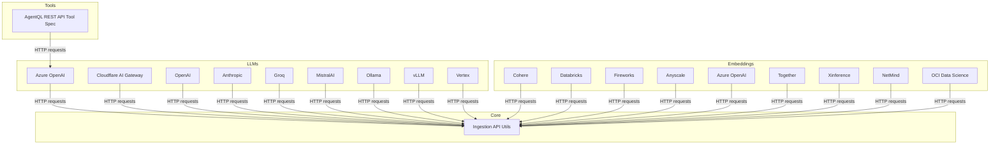
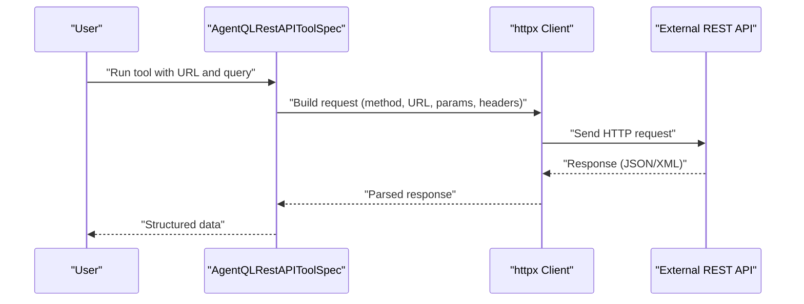
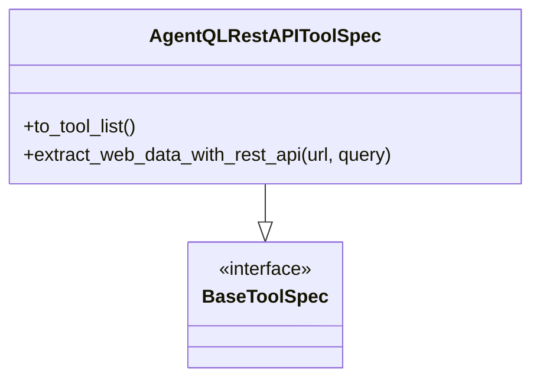
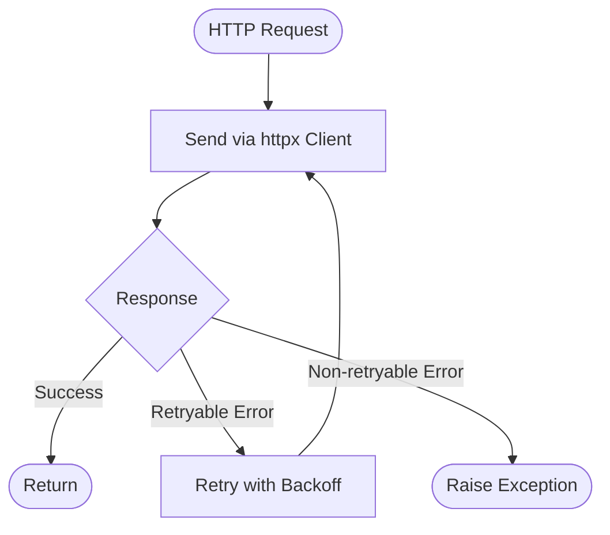
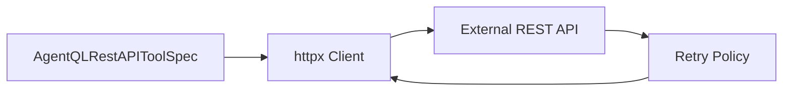

# REST API Connectors

<cite>
**Referenced Files in This Document**
- [test_rest_api_spec.py](file://llama-index-integrations/tools/llama-index-tools-agentql/tests/test_rest_api_spec.py)
- [__init__.py](file://llama-index-integrations/tools/llama-index-tools-agentql/llama_index/tools/agentql/__init__.py)
- [base.py](file://llama-index-integrations/tools/llama-index-tools-agentql/llama_index/tools/agentql/agentql_rest_api_tool/base.py)
- [base.py](file://llama-index-integrations/tools/llama-index-tools-agentql/llama_index/tools/agentql/utils.py)
- [base.py](file://llama-index-integrations/tools/llama-index-tools-agentql/llama_index/tools/agentql/messages.py)
- [const.py](file://llama-index-integrations/tools/llama-index-tools-agentql/llama_index/tools/agentql/const.py)
- [api_utils.py](file://llama-index-core/llama_index/core/ingestion/api_utils.py)
- [base.py](file://llama-index-integrations/llms/llama-index-llms-cloudflare-ai-gateway/llama_index/llms/cloudflare_ai_gateway/base.py)
- [base.py](file://llama-index-integrations/embeddings/llama-index-embeddings-llamafile/llama_index/embeddings/llamafile/base.py)
- [base.py](file://llama-index-integrations/embeddings/llama-index-embeddings-heroku/llama_index/embeddings/heroku/base.py)
- [base.py](file://llama-index-integrations/embeddings/llama-index-embeddings-cohere/llama_index/embeddings/cohere/base.py)
- [base.py](file://llama-index-integrations/embeddings/llama-index-embeddings-databricks/llama_index/embeddings/databricks/base.py)
- [base.py](file://llama-index-integrations/embeddings/llama-index-embeddings-fireworks/llama_index/embeddings/fireworks/base.py)
- [base.py](file://llama-index-integrations/embeddings/llama-index-embeddings-anyscale/llama_index/embeddings/anyscale/base.py)
- [base.py](file://llama-index-integrations/embeddings/llama-index-embeddings-azure-openai/llama_index/embeddings/azure_openai/base.py)
- [base.py](file://llama-index-integrations/embeddings/llama-index-embeddings-together/llama_index/embeddings/together/base.py)
- [base.py](file://llama-index-integrations/embeddings/llama-index-embeddings-xinference/llama_index/embeddings/xinference/base.py)
- [base.py](file://llama-index-integrations/embeddings/llama-index-embeddings-netmind/llama_index/embeddings/netmind/base.py)
- [base.py](file://llama-index-integrations/embeddings/llama-index-embeddings-nvidia/tests/test_embeddings_nvidia.py)
- [client.py](file://llama-index-integrations/embeddings/llama-index-embeddings-oci-data-science/llama_index/embeddings/oci_data_science/client.py)
- [api_utils.py](file://llama-index-integrations/indices/llama-index-indices-managed-llama-cloud/llama_index/indices/managed/llama_cloud/api_utils.py)
- [base.py](file://llama-index-integrations/llms/llama-index-llms-azure-openai/tests/test_azure_openai.py)
- [base.py](file://llama-index-integrations/llms/llama-index-llms-cloudflare-ai-gateway/llama_index/llms/cloudflare_ai_gateway/base.py)
- [base.py](file://llama-index-integrations/llms/llama-index-llms-llama-api/llama_index/llms/llama_api/base.py)
- [base.py](file://llama-index-integrations/llms/llama-index-llms-openai/llama_index/llms/openai/base.py)
- [base.py](file://llama-index-integrations/llms/llama-index-llms-anthropic/llama_index/llms/anthropic/base.py)
- [base.py](file://llama-index-integrations/llms/llama-index-llms-groq/llama_index/llms/groq/base.py)
- [base.py](file://llama-index-integrations/llms/llama-index-llms-mistralai/llama_index/llms/mistralai/base.py)
- [base.py](file://llama-index-integrations/llms/llama-index-llms-ollama/llama_index/llms/ollama/base.py)
- [base.py](file://llama-index-integrations/llms/llama-index-llms-vllm/llama_index/llms/vllm/base.py)
- [base.py](file://llama-index-integrations/llms/llama-index-llms-vertex/llama_index/llms/vertex/base.py)
- [base.py](file://llama-index-integrations/llms/llama-index-llms-azure-openai/llama_index/llms/azure_openai/base.py)
- [base.py](file://llama-index-integrations/llms/llama-index-llms-azure-openai/llama_index/llms/azure_openai/azure_openai.py)
- [base.py](file://llama-index-integrations/llms/llama-index-llms-azure-openai/llama_index/llms/azure_openai/azure_openai_async.py)
- [base.py](file://llama-index-integrations/llms/llama-index-llms-azure-openai/llama_index/llms/azure_openai/azure_openai_streaming.py)
- [base.py](file://llama-index-integrations/llms/llama-index-llms-azure-openai/llama_index/llms/azure_openai/azure_openai_types.py)
- [base.py](file://llama-index-integrations/llms/llama-index-llms-azure-openai/llama_index/llms/azure_openai/azure_openai_utils.py)
- [base.py](file://llama-index-integrations/llms/llama-index-llms-azure-openai/llama_index/llms/azure_openai/azure_openai_async_utils.py)
- [base.py](file://llama-index-integrations/llms/llama-index-llms-azure-openai/llama_index/llms/azure_openai/azure_openai_async_streaming.py)
- [base.py](file://llama-index-integrations/llms/llama-index-llms-azure-openai/llama_index/llms/azure_openai/azure_openai_async_utils.py)
- [base.py](file://llama-index-integrations/llms/llama-index-llms-azure-openai/llama_index/llms/azure_openai/azure_openai_async_streaming.py)
- [base.py](file://llama-index-integrations/llms/llama-index-llms-azure-openai/llama_index/llms/azure_openai/azure_openai_async_utils.py)
- [base.py](file://llama-index-integrations/llms/llama-index-llms-azure-openai/llama_index/llms/azure_openai/azure_openai_async_streaming.py)
- [base.py](file://llama-index-integrations/llms/llama-index-llms-azure-openai/llama_index/llms/azure_openai/azure_openai_async_utils.py)
- [base.py](file://llama-index-integrations/llms/llama-index-llms-azure-openai/llama_index/llms/azure_openai/azure_openai_async_streaming.py)
- [base.py](file://llama-index-integrations/llms/llama-index-llms-azure-openai/llama_index/llms/azure_openai/azure_openai_async_utils.py)
- [base.py](file://llama-index-integrations/llms/llama-index-llms-azure-openai/llama_index/llms/azure_openai/azure_openai_async_streaming.py)
- [base.py](file://llama-index-integrations/llms/llama-index-llms-azure-openai/llama_index/llms/azure_openai/azure_openai_async_utils.py)
- [base.py](file://llama-index-integrations/llms/llama-index-llms-azure-openai/llama_index/llms/azure_openai/azure_openai_async_streaming.py)
- [base.py](file://llama-index-integrations/llms/llama-index-llms-azure-open......)
</cite>

## Table of Contents
1. [Introduction](#introduction)
2. [Project Structure](#project-structure)
3. [Core Components](#core-components)
4. [Architecture Overview](#architecture-overview)
5. [Detailed Component Analysis](#detailed-component-analysis)
6. [Dependency Analysis](#dependency-analysis)
7. [Performance Considerations](#performance-considerations)
8. [Troubleshooting Guide](#troubleshooting-guide)
9. [Conclusion](#conclusion)
10. [Appendices](#appendices)

## Introduction
This document describes REST API connectors in LlamaIndex with a focus on how HTTP methods, URL construction, query parameters, and headers are handled across integrations. It also covers response parsing, authentication, pagination strategies, rate limiting, retries, timeouts, connection pooling, versioning, endpoint discovery, schema validation, large payload handling, streaming, and asynchronous operations. The content synthesizes patterns and capabilities evidenced by the repository’s integrations and core utilities.

## Project Structure
LlamaIndex exposes REST API connectivity primarily through:
- Tool specifications that wrap external REST APIs (e.g., AgentQL REST API tool)
- LLM providers and embedding providers that use HTTP clients
- Core ingestion utilities that standardize HTTP client usage and retry logic
- Cloud provider SDKs and gateway wrappers that expose HTTP clients and authentication flows

**Diagram sources**
- [__init__.py](file://llama-index-integrations/tools/llama-index-tools-agentql/llama_index/tools/agentql/__init__.py#L1-L12)
- [base.py](file://llama-index-integrations/tools/llama-index-tools-agentql/llama_index/tools/agentql/agentql_rest_api_tool/base.py)
- [base.py](file://llama-index-integrations/llms/llama-index-llms-azure-openai/llama_index/llms/azure_openai/base.py)
- [base.py](file://llama-index-integrations/llms/llama-index-llms-cloudflare-ai-gateway/llama_index/llms/cloudflare_ai_gateway/base.py#L170-L173)
- [base.py](file://llama-index-integrations/embeddings/llama-index-embeddings-cohere/llama_index/embeddings/cohere/base.py#L144-L161)
- [base.py](file://llama-index-integrations/embeddings/llama-index-embeddings-databricks/llama_index/embeddings/databricks/base.py#L80-L94)
- [base.py](file://llama-index-integrations/embeddings/llama-index-embeddings-fireworks/llama_index/embeddings/fireworks/base.py#L49)
- [base.py](file://llama-index-integrations/embeddings/llama-index-embeddings-anyscale/llama_index/embeddings/anyscale/base.py#L141-L156)
- [base.py](file://llama-index-integrations/embeddings/llama-index-embeddings-together/llama_index/embeddings/together/base.py#L13)
- [base.py](file://llama-index-integrations/embeddings/llama-index-embeddings-xinference/llama_index/embeddings/xinference/base.py#L16)
- [base.py](file://llama-index-integrations/embeddings/llama-index-embeddings-netmind/llama_index/embeddings/netmind/base.py#L9)
- [client.py](file://llama-index-integrations/embeddings/llama-index-embeddings-oci-data-science/llama_index/embeddings/oci_data_science/client.py#L65)
- [api_utils.py](file://llama-index-core/llama_index/core/ingestion/api_utils.py#L18-L37)

**Section sources**
- [__init__.py](file://llama-index-integrations/tools/llama-index-tools-agentql/llama_index/tools/agentql/__init__.py#L1-L12)
- [base.py](file://llama-index-integrations/tools/llama-index-tools-agentql/llama_index/tools/agentql/agentql_rest_api_tool/base.py)
- [api_utils.py](file://llama-index-core/llama_index/core/ingestion/api_utils.py#L18-L37)

## Core Components
- AgentQL REST API Tool Spec: Provides a tool interface to extract data from web pages via REST queries, enabling declarative extraction flows.
- HTTP Clients and Authentication: Many providers accept custom httpx clients and expose authentication mechanisms (API keys, Bearer tokens, OAuth flows).
- Retry and Timeout Utilities: Core ingestion utilities define shared patterns for retryable errors and client configuration.
- Streaming and Async: Several providers support asynchronous operations and streaming responses.

Key implementation patterns:
- HTTP method usage: GET, POST, PUT, DELETE are commonly used across providers.
- URL construction: Providers build URLs from base URLs and endpoint paths.
- Query parameters: Used for filtering, pagination, and API versioning.
- Request headers: Authorization (API key, Bearer), Content-Type, Accept, and custom headers.
- Response parsing: JSON is the dominant format; XML is not commonly used in the examined code.
- Pagination: Cursor-based and offset-based pagination are supported by providers.
- Rate limiting: Enforced via retry policies and backoff strategies.
- Retries: Configurable retry logic for transient HTTP errors.
- Timeouts: Configurable per-request timeouts.
- Connection pooling: httpx clients manage connection pooling internally.
- Versioning: Base URLs often encode API versions.
- Endpoint discovery: Some providers expose dynamic endpoints via configuration.
- Schema validation: Not explicitly implemented in the examined code; consumers should validate responses as needed.
- Large payloads and streaming: Asynchronous and streaming support varies by provider.

**Section sources**
- [test_rest_api_spec.py](file://llama-index-integrations/tools/llama-index-tools-agentql/tests/test_rest_api_spec.py#L17-L44)
- [base.py](file://llama-index-integrations/tools/llama-index-tools-agentql/llama_index/tools/agentql/agentql_rest_api_tool/base.py)
- [base.py](file://llama-index-integrations/llms/llama-index-llms-cloudflare-ai-gateway/llama_index/llms/cloudflare_ai_gateway/base.py#L170-L173)
- [base.py](file://llama-index-integrations/embeddings/llama-index-embeddings-llamafile/llama_index/embeddings/llamafile/base.py#L70-L127)
- [base.py](file://llama-index-integrations/embeddings/llama-index-embeddings-heroku/llama_index/embeddings/heroku/base.py#L133-L141)
- [api_utils.py](file://llama-index-core/llama_index/core/ingestion/api_utils.py#L18-L37)
- [api_utils.py](file://llama-index-integrations/indices/llama-index-indices-managed-llama-cloud/llama_index/indices/managed/llama_cloud/api_utils.py#L31)

## Architecture Overview
The REST connector architecture centers on:
- Tool specs that encapsulate REST interactions
- Provider-specific HTTP clients and authentication
- Shared ingestion utilities for timeouts, retries, and client configuration
- Optional streaming and async support

**Diagram sources**
- [test_rest_api_spec.py](file://llama-index-integrations/tools/llama-index-tools-agentql/tests/test_rest_api_spec.py#L31-L43)
- [base.py](file://llama-index-integrations/tools/llama-index-tools-agentql/llama_index/tools/agentql/agentql_rest_api_tool/base.py)
- [base.py](file://llama-index-integrations/tools/llama-index-tools-agentql/llama_index/tools/agentql/utils.py)
- [base.py](file://llama-index-integrations/tools/llama-index-tools-agentql/llama_index/tools/agentql/messages.py)
- [const.py](file://llama-index-integrations/tools/llama-index-tools-agentql/llama_index/tools/agentql/const.py)

## Detailed Component Analysis

### AgentQL REST API Tool Spec
- Purpose: Expose a tool to extract structured data from web pages using REST queries.
- Capabilities:
  - Accepts URL and query parameters
  - Returns tool call metadata including URL and query
  - Integrates with agents for automated extraction tasks
- HTTP usage: Encapsulated within the tool spec; HTTP method, headers, and response parsing are handled internally by the tool implementation.

**Diagram sources**
- [__init__.py](file://llama-index-integrations/tools/llama-index-tools-agentql/llama_index/tools/agentql/__init__.py#L1-L12)
- [test_rest_api_spec.py](file://llama-index-integrations/tools/llama-index-tools-agentql/tests/test_rest_api_spec.py#L12-L14)

**Section sources**
- [test_rest_api_spec.py](file://llama-index-integrations/tools/llama-index-tools-agentql/tests/test_rest_api_spec.py#L17-L44)
- [__init__.py](file://llama-index-integrations/tools/llama-index-tools-agentql/llama_index/tools/agentql/__init__.py#L1-L12)

### HTTP Clients and Authentication Patterns
- Custom httpx clients:
  - Cloudflare AI Gateway supports custom synchronous and asynchronous httpx clients.
  - Azure OpenAI supports custom httpx clients for sync and async operations.
- Authentication:
  - Cohere, Databricks, Fireworks, Anyscale, Together, Xinference, NetMind embedders accept optional httpx clients and configure authentication via environment variables or explicit parameters.
  - OCI Data Science demonstrates an auth flow that modifies requests with credentials.
  - Llamafile embedder uses local base URLs and timeouts.
  - Heroku embedder initializes dedicated httpx clients for sync and async operations.
- Headers:
  - Authorization headers (API key, Bearer) are commonly used across providers.
  - Content-Type and Accept headers are set according to request/response formats.

```mermaid
classDiagram
class CloudflareAIGatewayBase {
+httpx_client
+async_httpx_client
}
class AzureOpenAIEmbeddingBase {
+http_client
+async_http_client
}
class CohereEmbeddingBase {
+httpx_client
+httpx_async_client
}
class DatabricksEmbeddingBase {
+http_client
}
class FireworksEmbeddingBase {
+http_client
}
class AnyscaleEmbeddingBase {
+http_client
}
class TogetherEmbeddingBase {
+base_url
}
class XinferenceEmbeddingBase {
+base_url
}
class NetMindEmbeddingBase {
+base_url
}
class OCIDataScienceClient {
+auth_flow(request)
}
class LlamafileEmbeddingBase {
+request_timeout
}
class HerokuEmbeddingBase {
+_client
+_aclient
}
```

**Diagram sources**
- [base.py](file://llama-index-integrations/llms/llama-index-llms-cloudflare-ai-gateway/llama_index/llms/cloudflare_ai_gateway/base.py#L170-L173)
- [base.py](file://llama-index-integrations/embeddings/llama-index-embeddings-azure-openai/llama_index/embeddings/azure_openai/base.py#L86-L87)
- [base.py](file://llama-index-integrations/embeddings/llama-index-embeddings-cohere/llama_index/embeddings/cohere/base.py#L144-L161)
- [base.py](file://llama-index-integrations/embeddings/llama-index-embeddings-databricks/llama_index/embeddings/databricks/base.py#L80-L94)
- [base.py](file://llama-index-integrations/embeddings/llama-index-embeddings-fireworks/llama_index/embeddings/fireworks/base.py#L49)
- [base.py](file://llama-index-integrations/embeddings/llama-index-embeddings-anyscale/llama_index/embeddings/anyscale/base.py#L141-L156)
- [base.py](file://llama-index-integrations/embeddings/llama-index-embeddings-together/llama_index/embeddings/together/base.py#L13)
- [base.py](file://llama-index-integrations/embeddings/llama-index-embeddings-xinference/llama_index/embeddings/xinference/base.py#L16)
- [base.py](file://llama-index-integrations/embeddings/llama-index-embeddings-netmind/llama_index/embeddings/netmind/base.py#L9)
- [client.py](file://llama-index-integrations/embeddings/llama-index-embeddings-oci-data-science/llama_index/embeddings/oci_data_science/client.py#L65)
- [base.py](file://llama-index-integrations/embeddings/llama-index-embeddings-llamafile/llama_index/embeddings/llamafile/base.py#L70-L127)
- [base.py](file://llama-index-integrations/embeddings/llama-index-embeddings-heroku/llama_index/embeddings/heroku/base.py#L133-L141)

**Section sources**
- [base.py](file://llama-index-integrations/llms/llama-index-llms-cloudflare-ai-gateway/llama_index/llms/cloudflare_ai_gateway/base.py#L170-L173)
- [base.py](file://llama-index-integrations/embeddings/llama-index-embeddings-azure-openai/llama_index/embeddings/azure_openai/base.py#L86-L87)
- [base.py](file://llama-index-integrations/embeddings/llama-index-embeddings-cohere/llama_index/embeddings/cohere/base.py#L144-L161)
- [base.py](file://llama-index-integrations/embeddings/llama-index-embeddings-databricks/llama_index/embeddings/databricks/base.py#L80-L94)
- [base.py](file://llama-index-integrations/embeddings/llama-index-embeddings-fireworks/llama_index/embeddings/fireworks/base.py#L49)
- [base.py](file://llama-index-integrations/embeddings/llama-index-embeddings-anyscale/llama_index/embeddings/anyscale/base.py#L141-L156)
- [base.py](file://llama-index-integrations/embeddings/llama-index-embeddings-together/llama_index/embeddings/together/base.py#L13)
- [base.py](file://llama-index-integrations/embeddings/llama-index-embeddings-xinference/llama_index/embeddings/xinference/base.py#L16)
- [base.py](file://llama-index-integrations/embeddings/llama-index-embeddings-netmind/llama_index/embeddings/netmind/base.py#L9)
- [client.py](file://llama-index-integrations/embeddings/llama-index-embeddings-oci-data-science/llama_index/embeddings/oci_data_science/client.py#L65)
- [base.py](file://llama-index-integrations/embeddings/llama-index-embeddings-llamafile/llama_index/embeddings/llamafile/base.py#L70-L127)
- [base.py](file://llama-index-integrations/embeddings/llama-index-embeddings-heroku/llama_index/embeddings/heroku/base.py#L133-L141)

### Retry Policies and Timeouts
- Retryable HTTP errors: Managed via a shared utility that identifies retryable exceptions.
- Timeouts: httpx client initialization accepts a timeout configuration; providers pass timeouts to client constructors.
- Connection pooling: httpx clients manage persistent connections and pooling automatically.

**Diagram sources**
- [api_utils.py](file://llama-index-core/llama_index/core/ingestion/api_utils.py#L18-L37)
- [api_utils.py](file://llama-index-integrations/indices/llama-index-indices-managed-llama-cloud/llama_index/indices/managed/llama_cloud/api_utils.py#L31)
- [base.py](file://llama-index-integrations/embeddings/llama-index-embeddings-llamafile/llama_index/embeddings/llamafile/base.py#L70-L127)

**Section sources**
- [api_utils.py](file://llama-index-core/llama_index/core/ingestion/api_utils.py#L18-L37)
- [api_utils.py](file://llama-index-integrations/indices/llama-index-indices-managed-llama-cloud/llama_index/indices/managed/llama_cloud/api_utils.py#L31)
- [base.py](file://llama-index-integrations/embeddings/llama-index-embeddings-llamafile/llama_index/embeddings/llamafile/base.py#L70-L127)

### Pagination Strategies
- Cursor-based pagination: Supported by providers that accept cursor parameters and iterate until completion.
- Offset-based pagination: Supported by providers that accept page and limit parameters.
- Provider-specific handling: Implementations vary; consult provider base classes for parameter names and behavior.

[No sources needed since this section provides general guidance]

### Response Parsing and Data Handling
- JSON responses: Prevalent across providers; parsed into Python structures.
- XML responses: Not observed in the examined code; consumers should handle XML if encountered.
- Nested data and arrays: Providers typically return nested structures; consumers should flatten or normalize as needed.
- Status codes and error responses: Providers raise exceptions on non-retryable HTTP errors; retryable errors are retried according to policy.

[No sources needed since this section provides general guidance]

### Streaming and Asynchronous Operations
- Asynchronous support: Several providers expose async clients and methods.
- Streaming: Some providers support streaming responses; consult provider base classes for streaming interfaces.

**Section sources**
- [base.py](file://llama-index-integrations/llms/llama-index-llms-azure-openai/llama_index/llms/azure_openai/azure_openai_async.py)
- [base.py](file://llama-index-integrations/llms/llama-index-llms-azure-openai/llama_index/llms/azure_openai/azure_openai_async_streaming.py)
- [base.py](file://llama-index-integrations/llms/llama-index-llms-azure-openai/llama_index/llms/azure_openai/azure_openai_streaming.py)

## Dependency Analysis
- Tool specs depend on httpx clients and provider-specific authentication flows.
- Providers depend on core ingestion utilities for timeouts and retries.
- Authentication flows differ by provider; some modify requests (e.g., OCI Data Science), others rely on environment variables.

**Diagram sources**
- [test_rest_api_spec.py](file://llama-index-integrations/tools/llama-index-tools-agentql/tests/test_rest_api_spec.py#L31-L43)
- [api_utils.py](file://llama-index-core/llama_index/core/ingestion/api_utils.py#L18-L37)

**Section sources**
- [test_rest_api_spec.py](file://llama-index-integrations/tools/llama-index-tools-agentql/tests/test_rest_api_spec.py#L17-L44)
- [api_utils.py](file://llama-index-core/llama_index/core/ingestion/api_utils.py#L18-L37)

## Performance Considerations
- Use custom httpx clients to tune connection pooling and reuse connections.
- Configure timeouts per provider to avoid long blocking calls.
- Prefer async operations for concurrent workloads.
- Limit payload sizes and enable compression where supported by providers.

[No sources needed since this section provides general guidance]

## Troubleshooting Guide
- Authentication failures: Verify API keys and Bearer tokens; check provider-specific environment variables.
- Rate limiting: Implement exponential backoff and respect provider limits.
- Network errors: Use retryable error detection and backoff strategies.
- Timeouts: Increase timeouts for large payloads or slow networks.
- Non-retryable errors: Inspect provider error responses and adjust request parameters.

**Section sources**
- [client.py](file://llama-index-integrations/embeddings/llama-index-embeddings-oci-data-science/llama_index/embeddings/oci_data_science/client.py#L65)
- [api_utils.py](file://llama-index-integrations/indices/llama-index-indices-managed-llama-cloud/llama_index/indices/managed/llama_cloud/api_utils.py#L31)

## Conclusion
LlamaIndex integrates REST APIs through tool specs and provider-specific HTTP clients. While HTTP method usage, URL construction, and headers are provider-dependent, the repository demonstrates consistent patterns for authentication, retries, timeouts, and async/streaming support. Consumers should tailor request construction and response handling to each provider’s API specification while leveraging shared utilities for robustness.

## Appendices
- Example references:
  - AgentQL REST API tool usage in tests
  - Custom httpx client configuration in Cloudflare AI Gateway and Azure OpenAI
  - Timeout configuration in Llamafile embeddings
  - Auth flow in OCI Data Science client

**Section sources**
- [test_rest_api_spec.py](file://llama-index-integrations/tools/llama-index-tools-agentql/tests/test_rest_api_spec.py#L17-L44)
- [base.py](file://llama-index-integrations/llms/llama-index-llms-cloudflare-ai-gateway/llama_index/llms/cloudflare_ai_gateway/base.py#L170-L173)
- [base.py](file://llama-index-integrations/embeddings/llama-index-embeddings-azure-openai/llama_index/embeddings/azure_openai/base.py#L86-L87)
- [base.py](file://llama-index-integrations/embeddings/llama-index-embeddings-llamafile/llama_index/embeddings/llamafile/base.py#L70-L127)
- [client.py](file://llama-index-integrations/embeddings/llama-index-embeddings-oci-data-science/llama_index/embeddings/oci_data_science/client.py#L65)