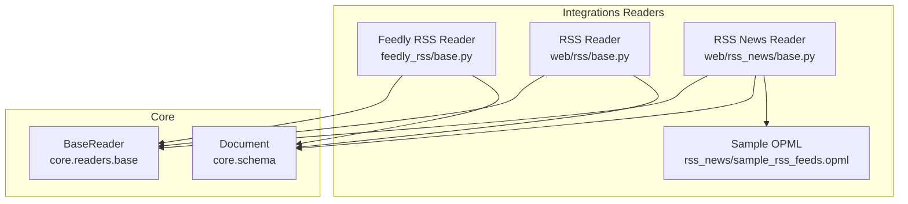
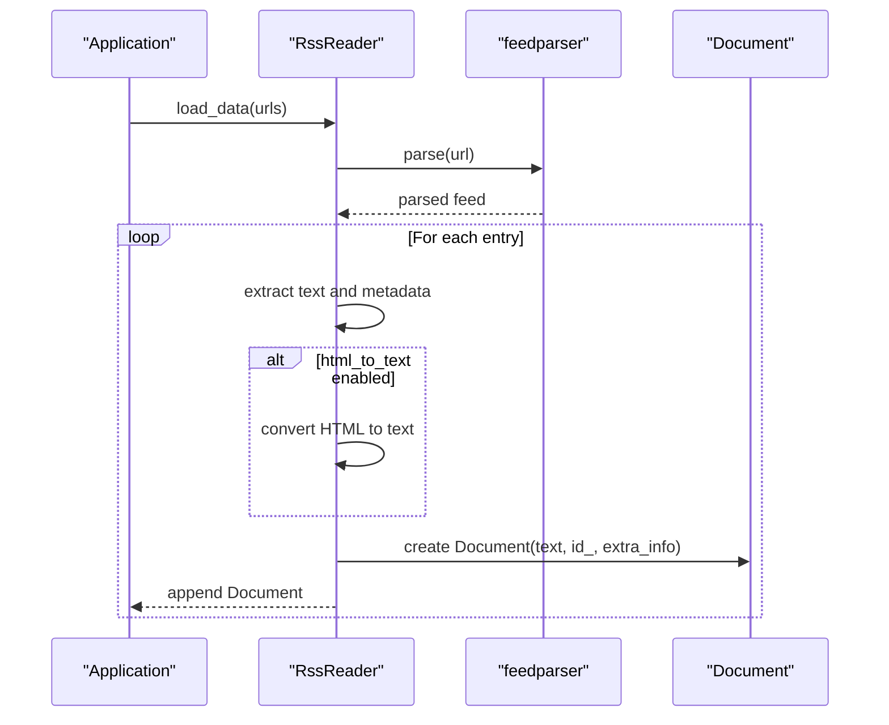
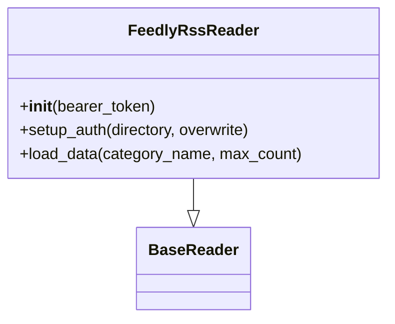
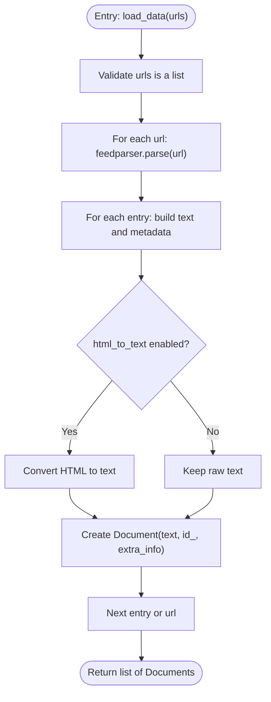
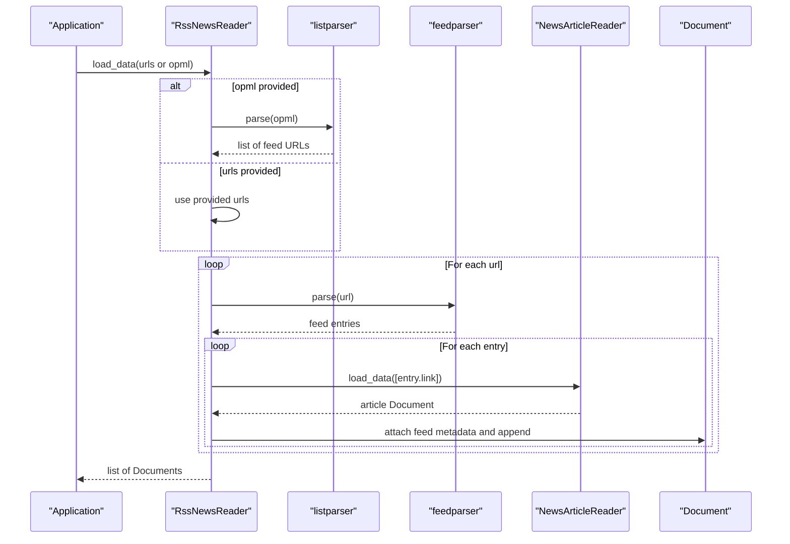
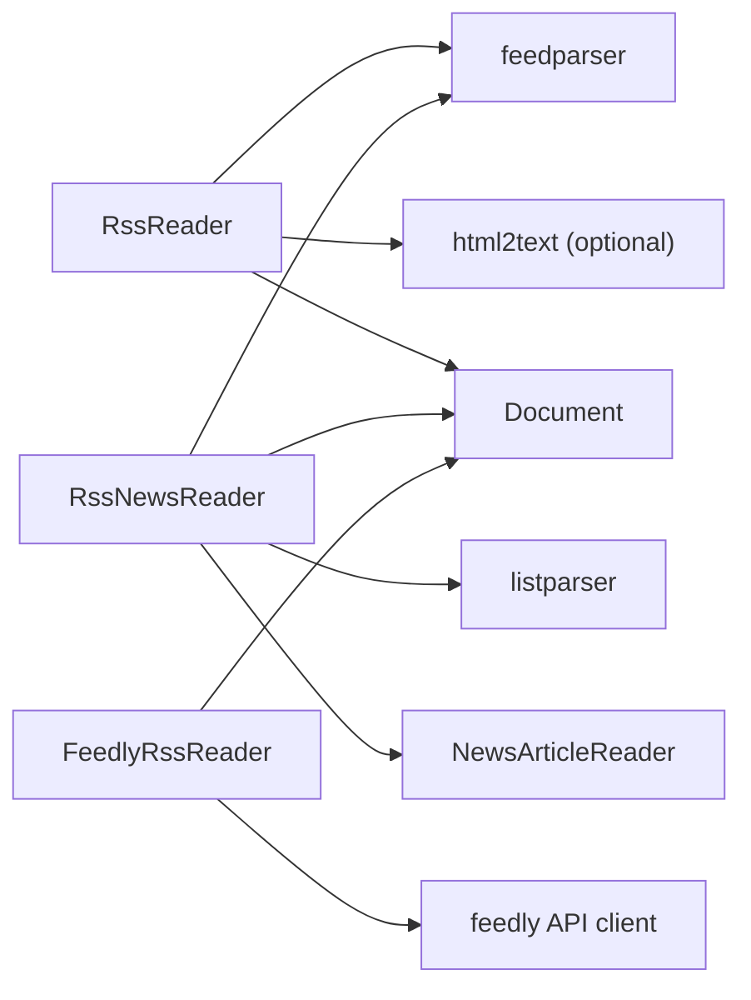

# RSS Feed Connectors

<cite>
**Referenced Files in This Document**
- [base.py](file://llama-index-integrations/readers/llama-index-readers-feedly-rss/llama_index/readers/feedly_rss/base.py)
- [base.py](file://llama-index-integrations/readers/llama-index-readers-web/llama_index/readers/web/rss/base.py)
- [base.py](file://llama-index-integrations/readers/llama-index-readers-web/llama_index/readers/web/rss_news/base.py)
- [sample_rss_feeds.opml](file://llama-index-integrations/readers/llama-index-readers-web/llama_index/readers/web/rss_news/sample_rss_feeds.opml)
- [test_readers_feedly_rss.py](file://llama-index-integrations/readers/llama-index-readers-feedly-rss/tests/test_readers_feedly_rss.py)
- [test_readers_rss.py](file://llama-index-integrations/readers/llama-index-readers-web/tests/test_readers_rss.py)
</cite>

## Table of Contents
1. [Introduction](#introduction)
2. [Project Structure](#project-structure)
3. [Core Components](#core-components)
4. [Architecture Overview](#architecture-overview)
5. [Detailed Component Analysis](#detailed-component-analysis)
6. [Dependency Analysis](#dependency-analysis)
7. [Performance Considerations](#performance-considerations)
8. [Troubleshooting Guide](#troubleshooting-guide)
9. [Conclusion](#conclusion)
10. [Appendices](#appendices)

## Introduction
This document provides comprehensive documentation for RSS and Atom feed connectors in LlamaIndex. It focuses on the available readers, their capabilities, and recommended patterns for robust ingestion of syndicated content. The covered readers include:
- Feedly RSS Reader: retrieves categorized articles via the Feedly API client.
- RSS Reader: parses RSS/Atom feeds locally using feedparser and optionally converts HTML content to plain text.
- RSS News Reader: extends RSS ingestion by enriching each entry with a dedicated news article parser.

The documentation covers feed discovery (OPML), validation, integrity checks, item processing, content sanitization, and operational guidance for scheduling, incremental updates, and error recovery. Guidance is also provided for handling enclosures/media, Dublin Core metadata, and enrichment strategies.

## Project Structure
The RSS-related readers are organized under the integrations module:
- Feedly RSS Reader: feedly_rss reader under llama-index-readers-feedly-rss.
- RSS Reader and RSS News Reader: web/rss and web/rss_news readers under llama-index-readers-web.

**Diagram sources**
- [base.py](file://llama-index-integrations/readers/llama-index-readers-feedly-rss/llama_index/readers/feedly_rss/base.py#L1-L67)
- [base.py](file://llama-index-integrations/readers/llama-index-readers-web/llama_index/readers/web/rss/base.py#L1-L90)
- [base.py](file://llama-index-integrations/readers/llama-index-readers-web/llama_index/readers/web/rss_news/base.py#L1-L111)
- [sample_rss_feeds.opml](file://llama-index-integrations/readers/llama-index-readers-web/llama_index/readers/web/rss_news/sample_rss_feeds.opml#L1-L14)

**Section sources**
- [base.py](file://llama-index-integrations/readers/llama-index-readers-feedly-rss/llama_index/readers/feedly_rss/base.py#L1-L67)
- [base.py](file://llama-index-integrations/readers/llama-index-readers-web/llama_index/readers/web/rss/base.py#L1-L90)
- [base.py](file://llama-index-integrations/readers/llama-index-readers-web/llama_index/readers/web/rss_news/base.py#L1-L111)
- [sample_rss_feeds.opml](file://llama-index-integrations/readers/llama-index-readers-web/llama_index/readers/web/rss_news/sample_rss_feeds.opml#L1-L14)

## Core Components
- FeedlyRssReader
  - Purpose: Retrieve articles from a Feedly user category using the official Feedly API client.
  - Authentication: Stores a bearer token and writes it to a local config file for session initialization.
  - Output: Documents containing normalized fields (title, published, summary, author, content, keywords, commonTopics).
- RssReader
  - Purpose: Parse RSS/Atom feeds from provided URLs using feedparser.
  - Options: user_agent override, optional HTML-to-text conversion.
  - Output: Documents per entry with id_, text, and extra_info (title, link, date).
- RssNewsReader
  - Purpose: Discover feeds via OPML or explicit URLs, then parse each entry with a news article reader.
  - Discovery: Supports OPML parsing via listparser to derive feed URLs.
  - Output: Documents enriched with article metadata and a feed source indicator.

**Section sources**
- [base.py](file://llama-index-integrations/readers/llama-index-readers-feedly-rss/llama_index/readers/feedly_rss/base.py#L10-L67)
- [base.py](file://llama-index-integrations/readers/llama-index-readers-web/llama_index/readers/web/rss/base.py#L12-L90)
- [base.py](file://llama-index-integrations/readers/llama-index-readers-web/llama_index/readers/web/rss_news/base.py#L13-L111)

## Architecture Overview
The readers follow a layered pattern:
- Reader classes implement BaseReader or BasePydanticReader.
- Feed parsing is delegated to external libraries (feedparser, listparser, feedly API client).
- Documents are produced with standardized metadata and optional content sanitization.

**Diagram sources**
- [base.py](file://llama-index-integrations/readers/llama-index-readers-web/llama_index/readers/web/rss/base.py#L33-L80)

## Detailed Component Analysis

### Feedly RSS Reader
- Responsibilities
  - Authenticate via a bearer token stored in a local configuration file.
  - Fetch a user’s category stream and produce Documents with normalized fields.
- Key behaviors
  - setup_auth creates a directory and writes the token to a file.
  - load_data iterates over stream contents up to a configurable count and builds Documents.
- Output characteristics
  - Text payload is a JSON-like serialization of selected article fields.
  - Suitable for downstream enrichment or vectorization.

**Diagram sources**
- [base.py](file://llama-index-integrations/readers/llama-index-readers-feedly-rss/llama_index/readers/feedly_rss/base.py#L10-L67)

**Section sources**
- [base.py](file://llama-index-integrations/readers/llama-index-readers-feedly-rss/llama_index/readers/feedly_rss/base.py#L10-L67)
- [test_readers_feedly_rss.py](file://llama-index-integrations/readers/llama-index-readers-feedly-rss/tests/test_readers_feedly_rss.py#L1-L8)

### RSS Reader
- Responsibilities
  - Parse RSS/Atom feeds from a list of URLs.
  - Optionally convert HTML content to plain text.
- Key behaviors
  - Validates input type (must be a list).
  - Builds extra_info from entry fields (title, link, published).
  - Uses entry id or link as document id when available.
- Output characteristics
  - Documents with text content and metadata suitable for indexing.

**Diagram sources**
- [base.py](file://llama-index-integrations/readers/llama-index-readers-web/llama_index/readers/web/rss/base.py#L33-L80)

**Section sources**
- [base.py](file://llama-index-integrations/readers/llama-index-readers-web/llama_index/readers/web/rss/base.py#L12-L90)

### RSS News Reader
- Responsibilities
  - Discover feeds via OPML or direct URL list.
  - For each entry, fetch and parse the article link with a news article reader.
- Key behaviors
  - Validates exclusive use of urls or opml arguments.
  - Parses OPML to derive feed URLs using listparser.
  - Logs and skips errors per feed URL.
- Output characteristics
  - Documents enriched with article metadata and a feed source field.

**Diagram sources**
- [base.py](file://llama-index-integrations/readers/llama-index-readers-web/llama_index/readers/web/rss_news/base.py#L46-L101)

**Section sources**
- [base.py](file://llama-index-integrations/readers/llama-index-readers-web/llama_index/readers/web/rss_news/base.py#L13-L111)
- [sample_rss_feeds.opml](file://llama-index-integrations/readers/llama-index-readers-web/llama_index/readers/web/rss_news/sample_rss_feeds.opml#L1-L14)

## Dependency Analysis
- External libraries
  - feedparser: core feed parsing for RSS/Atom.
  - listparser: OPML parsing for feed discovery.
  - feedly API client: Feedly integration.
  - html2text: optional HTML-to-text conversion.
- Internal dependencies
  - BaseReader and BasePydanticReader for reader interface.
  - Document for standardized output.

**Diagram sources**
- [base.py](file://llama-index-integrations/readers/llama-index-readers-web/llama_index/readers/web/rss/base.py#L44-L65)
- [base.py](file://llama-index-integrations/readers/llama-index-readers-web/llama_index/readers/web/rss_news/base.py#L65-L95)
- [base.py](file://llama-index-integrations/readers/llama-index-readers-feedly-rss/llama_index/readers/feedly_rss/base.py#L41-L66)

**Section sources**
- [base.py](file://llama-index-integrations/readers/llama-index-readers-web/llama_index/readers/web/rss/base.py#L44-L65)
- [base.py](file://llama-index-integrations/readers/llama-index-readers-web/llama_index/readers/web/rss_news/base.py#L65-L95)
- [base.py](file://llama-index-integrations/readers/llama-index-readers-feedly-rss/llama_index/readers/feedly_rss/base.py#L41-L66)

## Performance Considerations
- Concurrency and batching
  - Parallelize feed URL processing externally (e.g., using thread/process pools) to improve throughput.
- Rate limiting and retries
  - Respect robots.txt and feed provider rate limits; implement retry/backoff for transient failures.
- Memory footprint
  - Process feeds incrementally and avoid loading entire streams into memory when possible.
- Content normalization
  - Prefer plain text conversion for downstream embedding to reduce noise and improve retrieval quality.

## Troubleshooting Guide
- Validation and integrity
  - Ensure urls is a list; otherwise, a ValueError is raised.
  - Verify feed URLs are reachable and return valid RSS/Atom content.
- Authentication and configuration
  - For FeedlyRssReader, confirm the bearer token is set and persisted to the expected config location.
- Error handling
  - RssNewsReader logs exceptions per feed URL and continues processing others.
- Testing
  - Unit tests confirm reader classes inherit from the appropriate base classes.

**Section sources**
- [base.py](file://llama-index-integrations/readers/llama-index-readers-web/llama_index/readers/web/rss/base.py#L49-L50)
- [base.py](file://llama-index-integrations/readers/llama-index-readers-web/llama_index/readers/web/rss_news/base.py#L58-L63)
- [base.py](file://llama-index-integrations/readers/llama-index-readers-web/llama_index/readers/web/rss_news/base.py#L97-L99)
- [test_readers_feedly_rss.py](file://llama-index-integrations/readers/llama-index-readers-feedly-rss/tests/test_readers_feedly_rss.py#L5-L8)

## Conclusion
LlamaIndex provides three complementary RSS/Atom ingestion pathways:
- FeedlyRssReader for curated, categorized content via the Feedly API.
- RssReader for straightforward feed parsing with optional HTML sanitization.
- RssNewsReader for enriched article parsing and feed discovery via OPML.

These readers integrate cleanly with LlamaIndex’s Document model and can be combined with downstream processors for enrichment, filtering, and retrieval.

## Appendices

### Feed Discovery and Validation
- OPML-based discovery
  - Use RssNewsReader with an OPML source to derive feed URLs automatically.
  - Sample OPML demonstrates expected structure for feed subscriptions.
- Validation
  - Validate feed URLs and handle malformed or unreachable feeds gracefully.

**Section sources**
- [base.py](file://llama-index-integrations/readers/llama-index-readers-web/llama_index/readers/web/rss_news/base.py#L72-L82)
- [sample_rss_feeds.opml](file://llama-index-integrations/readers/llama-index-readers-web/llama_index/readers/web/rss_news/sample_rss_feeds.opml#L1-L14)

### Item Processing and Content Sanitization
- RSS Reader supports optional HTML-to-text conversion for cleaner content.
- RssNewsReader delegates content extraction to a news article reader, enabling deeper parsing and metadata enrichment.

**Section sources**
- [base.py](file://llama-index-integrations/readers/llama-index-readers-web/llama_index/readers/web/rss/base.py#L62-L65)
- [base.py](file://llama-index-integrations/readers/llama-index-readers-web/llama_index/readers/web/rss_news/base.py#L87-L95)

### Multimedia Attachments and Enclosures
- feedparser exposes entry content and related fields; enclosures and media links are typically available in entry attributes.
- Recommended approach
  - Inspect entry fields for enclosure/media metadata and attach as extra_info or metadata for downstream processing.

**Section sources**
- [base.py](file://llama-index-integrations/readers/llama-index-readers-web/llama_index/readers/web/rss/base.py#L56-L60)

### Dublin Core Metadata Extraction
- While feedparser does not automatically map to Dublin Core fields, typical RSS/Atom fields (title, description/summary, published, author, link) can be mapped to DC equivalents during Document creation.

**Section sources**
- [base.py](file://llama-index-integrations/readers/llama-index-readers-web/llama_index/readers/web/rss/base.py#L67-L71)

### Scheduling, Incremental Updates, and Change Detection
- Scheduling
  - Use external schedulers to trigger ingestion runs at desired cadence.
- Incremental updates
  - Track last processed entry timestamps or identifiers and fetch newer items only.
- Change detection
  - Compare entry ids or lastBuildDate/pubDates to detect updates.

[No sources needed since this section provides general guidance]

### Feed Health Monitoring, Error Recovery, and Fallback Strategies
- Health monitoring
  - Log feed parse errors and track success rates per feed URL.
- Error recovery
  - Implement retry with exponential backoff for transient network errors.
- Fallback strategies
  - If feedparser fails, attempt alternate feed URLs or use cached content.

**Section sources**
- [base.py](file://llama-index-integrations/readers/llama-index-readers-web/llama_index/readers/web/rss_news/base.py#L97-L99)

### Feed Quality Assessment, Spam Detection, and Content Filtering
- Quality assessment
  - Filter out entries with missing titles, empty content, or suspicious domains.
- Spam detection
  - Apply domain blacklists and keyword filters.
- Content filtering
  - Use metadata (author, categories) to filter irrelevant content.

[No sources needed since this section provides general guidance]

### Feed Normalization, Categorization, and Enrichment
- Normalization
  - Standardize fields (title, summary, date) across different feed formats.
- Categorization
  - Use keywords/commonTopics (Feedly) or entry categories to tag content.
- Enrichment
  - Combine with external data sources (e.g., entity extraction, summarization) for richer metadata.

**Section sources**
- [base.py](file://llama-index-integrations/readers/llama-index-readers-feedly-rss/llama_index/readers/feedly_rss/base.py#L53-L61)
- [base.py](file://llama-index-integrations/readers/llama-index-readers-web/llama_index/readers/web/rss_news/base.py#L91-L95)