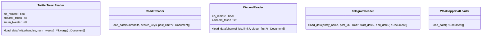

# Social Media Connectors

<cite>
**Referenced Files in This Document**
- [twitter/__init__.py](file://llama-index-integrations/readers/llama-index-readers-twitter/llama_index/readers/twitter/__init__.py)
- [twitter/base.py](file://llama-index-integrations/readers/llama-index-readers-twitter/llama_index/readers/twitter/base.py)
- [README.md](file://llama-index-integrations/readers/llama-index-readers-twitter/README.md)
- [reddit/__init__.py](file://llama-index-integrations/readers/llama-index-readers-reddit/llama_index/readers/reddit/__init__.py)
- [reddit/base.py](file://llama-index-integrations/readers/llama-index-readers-reddit/llama_index/readers/reddit/base.py)
- [README.md](file://llama-index-integrations/readers/llama-index-readers-reddit/README.md)
- [discord/__init__.py](file://llama-index-integrations/readers/llama-index-readers-discord/llama_index/readers/discord/__init__.py)
- [discord/base.py](file://llama-index-integrations/readers/llama-index-readers-discord/llama_index/readers/discord/base.py)
- [telegram/__init__.py](file://llama-index-integrations/readers/llama-index-readers-telegram/llama_index/readers/telegram/__init__.py)
- [telegram/base.py](file://llama-index-integrations/readers/llama-index-readers-telegram/llama_index/readers/telegram/base.py)
- [whatsapp/base.py](file://llama-index-integrations/readers/llama-index-readers-whatsapp/llama_index/readers/whatsapp/base.py)
</cite>

## Table of Contents
1. [Introduction](#introduction)
2. [Project Structure](#project-structure)
3. [Core Components](#core-components)
4. [Architecture Overview](#architecture-overview)
5. [Detailed Component Analysis](#detailed-component-analysis)
6. [Dependency Analysis](#dependency-analysis)
7. [Performance Considerations](#performance-considerations)
8. [Troubleshooting Guide](#troubleshooting-guide)
9. [Conclusion](#conclusion)
10. [Appendices](#appendices)

## Introduction
This document describes social media connectors available in the LlamaIndex ecosystem, focusing on platform-specific APIs, authentication flows, rate-limiting considerations, and data access patterns. It covers:
- Twitter (tweet retrieval)
- Reddit (posts and top-level comments)
- Discord (channels and threads)
- Telegram (channels/chats and optional comment replies)
- WhatsApp (local chat logs parsing)

It also outlines content filtering, language detection, sentiment analysis integration, media handling, real-time streaming, webhooks, event-driven ingestion, platform-specific features (hashtags, mentions, reactions, sharing), privacy, content moderation, compliance, API versioning and deprecation handling, fallback strategies, and managing multiple integrations with cross-platform correlation.

## Project Structure
The social media connectors are implemented as separate packages under the readers integration namespace. Each connector exposes a reader class and is initialized with platform-specific credentials or tokens.

**Diagram sources**
- [twitter/__init__.py](file://llama-index-integrations/readers/llama-index-readers-twitter/llama_index/readers/twitter/__init__.py#L1-L4)
- [twitter/base.py](file://llama-index-integrations/readers/llama-index-readers-twitter/llama_index/readers/twitter/base.py#L1-L78)
- [reddit/__init__.py](file://llama-index-integrations/readers/llama-index-readers-reddit/llama_index/readers/reddit/__init__.py#L1-L4)
- [reddit/base.py](file://llama-index-integrations/readers/llama-index-readers-reddit/llama_index/readers/reddit/base.py#L1-L58)
- [discord/__init__.py](file://llama-index-integrations/readers/llama-index-readers-discord/llama_index/readers/discord/__init__.py#L1-L4)
- [discord/base.py](file://llama-index-integrations/readers/llama-index-readers-discord/llama_index/readers/discord/base.py#L1-L176)
- [telegram/__init__.py](file://llama-index-integrations/readers/llama-index-readers-telegram/llama_index/readers/telegram/__init__.py#L1-L4)
- [telegram/base.py](file://llama-index-integrations/readers/llama-index-readers-telegram/llama_index/readers/telegram/base.py#L1-L153)
- [whatsapp/base.py](file://llama-index-integrations/readers/llama-index-readers-whatsapp/llama_index/readers/whatsapp/base.py#L1-L64)

**Section sources**
- [twitter/__init__.py](file://llama-index-integrations/readers/llama-index-readers-twitter/llama_index/readers/twitter/__init__.py#L1-L4)
- [reddit/__init__.py](file://llama-index-integrations/readers/llama-index-readers-reddit/llama_index/readers/reddit/__init__.py#L1-L4)
- [discord/__init__.py](file://llama-index-integrations/readers/llama-index-readers-discord/llama_index/readers/discord/__init__.py#L1-L4)
- [telegram/__init__.py](file://llama-index-integrations/readers/llama-index-readers-telegram/llama_index/readers/telegram/__init__.py#L1-L4)
- [whatsapp/base.py](file://llama-index-integrations/readers/llama-index-readers-whatsapp/llama_index/readers/whatsapp/base.py#L1-L64)

## Core Components
- TwitterTweetReader: Fetches tweets for specified Twitter handles using the Twitter API v2 client with a bearer token. Returns documents aggregated per user.
- RedditReader: Searches subreddits for posts matching keywords and extracts post text and top-level comments.
- DiscordReader: Retrieves messages from specified channels and threads using the discord.py library with a bot token. Supports chronological ordering and wraps messages into documents with metadata.
- TelegramReader: Loads posts/messages from Telegram channels/chats using Telethon with API credentials and optional date-range filtering. Removes URLs by default.
- WhatsappChatLoader: Parses local WhatsApp chat log files (.txt) exported via the app and converts them into documents with author and timestamp metadata.

Key characteristics:
- Authentication: Platform-specific tokens/credentials are required.
- Rate limits: Not explicitly handled in code; consult platform APIs for quotas and backoff strategies.
- Data access: Tweets, posts, comments, messages, and parsed chat logs.
- Content filtering: Basic sanitization (URL removal in Telegram), plus user-defined filters.
- Media handling: Not implemented in these readers; consider downstream processors for images/audio/video.

**Section sources**
- [twitter/base.py](file://llama-index-integrations/readers/llama-index-readers-twitter/llama_index/readers/twitter/base.py#L9-L78)
- [reddit/base.py](file://llama-index-integrations/readers/llama-index-readers-reddit/llama_index/readers/reddit/base.py#L9-L58)
- [discord/base.py](file://llama-index-integrations/readers/llama-index-readers-discord/llama_index/readers/discord/base.py#L90-L176)
- [telegram/base.py](file://llama-index-integrations/readers/llama-index-readers-telegram/llama_index/readers/telegram/base.py#L12-L153)
- [whatsapp/base.py](file://llama-index-integrations/readers/llama-index-readers-whatsapp/llama_index/readers/whatsapp/base.py#L11-L64)

## Architecture Overview
The connectors follow a consistent pattern:
- A reader class implements a load_data method returning a list of Documents.
- Credentials are injected via constructor parameters or environment variables.
- Underlying libraries are imported lazily or during initialization.
- Documents encapsulate text and metadata for downstream processing.

**Diagram sources**
- [twitter/base.py](file://llama-index-integrations/readers/llama-index-readers-twitter/llama_index/readers/twitter/base.py#L9-L78)
- [reddit/base.py](file://llama-index-integrations/readers/llama-index-readers-reddit/llama_index/readers/reddit/base.py#L9-L58)
- [discord/base.py](file://llama-index-integrations/readers/llama-index-readers-discord/llama_index/readers/discord/base.py#L90-L176)
- [telegram/base.py](file://llama-index-integrations/readers/llama-index-readers-telegram/llama_index/readers/telegram/base.py#L12-L153)
- [whatsapp/base.py](file://llama-index-integrations/readers/llama-index-readers-whatsapp/llama_index/readers/whatsapp/base.py#L11-L64)

## Detailed Component Analysis

### Twitter Connector
- Purpose: Retrieve tweets for a list of Twitter handles.
- Authentication: Bearer token passed to the client.
- Data access: Uses the Twitter API v2 client to fetch user tweets and aggregates into a single document per user.
- Rate limiting: Not handled in code; apply throttling and exponential backoff externally.
- Filtering: No built-in content filtering; apply downstream filters.
- Media: Not extracted; consider extending to include attachments via API fields.
- Platform features: Mentions, hashtags, links are present in tweet text; downstream NLP can extract them.

**Diagram sources**
- [twitter/base.py](file://llama-index-integrations/readers/llama-index-readers-twitter/llama_index/readers/twitter/base.py#L45-L78)

**Section sources**
- [twitter/base.py](file://llama-index-integrations/readers/llama-index-readers-twitter/llama_index/readers/twitter/base.py#L9-L78)
- [README.md](file://llama-index-integrations/readers/llama-index-readers-twitter/README.md#L1-L34)

### Reddit Connector
- Purpose: Search subreddits for posts matching keywords and collect post text and top-level comments.
- Authentication: Requires environment variables for client credentials and user agent.
- Data access: Uses PRAW to search subreddits and iterate over posts and comments.
- Rate limiting: Not handled in code; adhere to Reddit API limits.
- Filtering: Extracts only top-level comments; additional filtering can be applied.
- Media: Not extracted; focus is on text content.

**Diagram sources**
- [reddit/base.py](file://llama-index-integrations/readers/llama-index-readers-reddit/llama_index/readers/reddit/base.py#L14-L58)

**Section sources**
- [reddit/base.py](file://llama-index-integrations/readers/llama-index-readers-reddit/llama_index/readers/reddit/base.py#L9-L58)
- [README.md](file://llama-index-integrations/readers/llama-index-readers-reddit/README.md#L1-L78)

### Discord Connector
- Purpose: Read messages from specified channels and threads.
- Authentication: Bot token via constructor or DISCORD_TOKEN environment variable.
- Data access: Uses discord.py client to fetch channel history and thread histories; wraps each message into a Document with metadata.
- Rate limiting: Not handled in code; implement backoff and retry.
- Filtering: Messages are filtered by type; only text channels are supported in current implementation.
- Media: Not extracted; metadata includes timestamps and author info.

**Diagram sources**
- [discord/base.py](file://llama-index-integrations/readers/llama-index-readers-discord/llama_index/readers/discord/base.py#L20-L88)
- [discord/base.py](file://llama-index-integrations/readers/llama-index-readers-discord/llama_index/readers/discord/base.py#L138-L168)

**Section sources**
- [discord/base.py](file://llama-index-integrations/readers/llama-index-readers-discord/llama_index/readers/discord/base.py#L90-L176)

### Telegram Connector
- Purpose: Load posts/messages from Telegram channels/chats; optionally fetch comments for a specific post.
- Authentication: API credentials (API ID/hash) and phone number; starts a client session.
- Data access: Uses Telethon to iterate messages; supports date range filtering; removes URLs by default.
- Rate limiting: Not handled in code; apply external throttling.
- Filtering: URL removal via regex; additional filters can be applied.
- Media: Not extracted; focus is on text content.

**Diagram sources**
- [telegram/base.py](file://llama-index-integrations/readers/llama-index-readers-telegram/llama_index/readers/telegram/base.py#L93-L142)

**Section sources**
- [telegram/base.py](file://llama-index-integrations/readers/llama-index-readers-telegram/llama_index/readers/telegram/base.py#L12-L153)

### WhatsApp Connector
- Purpose: Parse exported WhatsApp chat logs and convert them into Documents with metadata.
- Authentication: None required; reads from a local file path.
- Data access: Uses chatminer to parse .txt logs and constructs Documents with author and timestamp.
- Rate limiting: N/A.
- Filtering: Aggregates all messages; downstream filters can be applied.
- Media: Not extracted; focus is on textual chat logs.

**Diagram sources**
- [whatsapp/base.py](file://llama-index-integrations/readers/llama-index-readers-whatsapp/llama_index/readers/whatsapp/base.py#L24-L64)

**Section sources**
- [whatsapp/base.py](file://llama-index-integrations/readers/llama-index-readers-whatsapp/llama_index/readers/whatsapp/base.py#L11-L64)

## Dependency Analysis
- External libraries:
  - Twitter: tweepy
  - Reddit: praw
  - Discord: discord.py
  - Telegram: telethon
  - WhatsApp: chatminer
- Coupling:
  - Each reader is self-contained with minimal coupling to other readers.
  - Cohesion: Each reader focuses on a single platform’s data model and access patterns.
- Potential circular dependencies: None observed among the readers.

**Diagram sources**
- [twitter/base.py](file://llama-index-integrations/readers/llama-index-readers-twitter/llama_index/readers/twitter/base.py#L59-L63)
- [reddit/base.py](file://llama-index-integrations/readers/llama-index-readers-reddit/llama_index/readers/reddit/base.py#L31-L40)
- [discord/base.py](file://llama-index-integrations/readers/llama-index-readers-discord/llama_index/readers/discord/base.py#L34-L71)
- [telegram/base.py](file://llama-index-integrations/readers/llama-index-readers-telegram/llama_index/readers/telegram/base.py#L114-L118)
- [whatsapp/base.py](file://llama-index-integrations/readers/llama-index-readers-whatsapp/llama_index/readers/whatsapp/base.py#L28-L34)

**Section sources**
- [twitter/base.py](file://llama-index-integrations/readers/llama-index-readers-twitter/llama_index/readers/twitter/base.py#L59-L63)
- [reddit/base.py](file://llama-index-integrations/readers/llama-index-readers-reddit/llama_index/readers/reddit/base.py#L31-L40)
- [discord/base.py](file://llama-index-integrations/readers/llama-index-readers-discord/llama_index/readers/discord/base.py#L34-L71)
- [telegram/base.py](file://llama-index-integrations/readers/llama-index-readers-telegram/llama_index/readers/telegram/base.py#L114-L118)
- [whatsapp/base.py](file://llama-index-integrations/readers/llama-index-readers-whatsapp/llama_index/readers/whatsapp/base.py#L28-L34)

## Performance Considerations
- Batch sizes: Control num_tweets or post_limit to balance throughput and quota usage.
- Concurrency: Current readers are synchronous; consider batching requests and implementing retries with exponential backoff.
- Pagination: Respect platform pagination and rate limits; implement jittered delays.
- Memory: For large datasets, process incrementally and stream to downstream stores.
- Caching: Cache user metadata and recent results to reduce redundant API calls.

[No sources needed since this section provides general guidance]

## Troubleshooting Guide
Common issues and remedies:
- Missing dependencies:
  - Install required packages for each platform as indicated by import errors.
- Authentication failures:
  - Verify tokens/credentials are correct and not expired.
  - For Reddit, ensure environment variables are set.
  - For Discord, ensure the bot token is configured and the bot has proper permissions.
  - For Telegram, ensure API credentials and phone number are correct.
- Rate limiting:
  - Implement retry with exponential backoff and respect platform quotas.
- Unsupported channel types:
  - Discord reader only supports text channels; skip non-text channels.
- Timeouts and network errors:
  - Wrap API calls with timeouts and retry logic.
- Content filtering:
  - Apply additional filters (language detection, sentiment, toxicity) downstream.

**Section sources**
- [twitter/base.py](file://llama-index-integrations/readers/llama-index-readers-twitter/llama_index/readers/twitter/base.py#L60-L63)
- [reddit/base.py](file://llama-index-integrations/readers/llama-index-readers-reddit/llama_index/readers/reddit/base.py#L34-L40)
- [discord/base.py](file://llama-index-integrations/readers/llama-index-readers-discord/llama_index/readers/discord/base.py#L107-L119)
- [telegram/base.py](file://llama-index-integrations/readers/llama-index-readers-telegram/llama_index/readers/telegram/base.py#L114-L118)
- [whatsapp/base.py](file://llama-index-integrations/readers/llama-index-readers-whatsapp/llama_index/readers/whatsapp/base.py#L28-L34)

## Conclusion
The LlamaIndex social media connectors provide straightforward, focused readers for popular platforms. They expose a uniform interface for loading documents and can be composed with downstream processors for advanced analytics (filtering, language detection, sentiment, moderation). Production deployments should incorporate robust rate-limiting strategies, retries, and privacy/compliance controls.

[No sources needed since this section summarizes without analyzing specific files]

## Appendices

### Platform-Specific Features and Examples
- Twitter
  - Hashtags and mentions: Extract via downstream NLP on tweet text.
  - Reactions/sharing: Not exposed in current reader; extend to include engagement metrics via API fields.
- Reddit
  - Hashtags: Not applicable; focus on keywords.
  - Mentions: Not applicable; use search keys to target topics.
- Discord
  - Reactions: Not fetched; consider extending to include reaction counts.
  - Threads: Supported; messages from threads are included.
- Telegram
  - Mentions/links: Handled by URL removal; mentions can be detected via regex.
  - Reactions: Not fetched.
- WhatsApp
  - Mentions: Not applicable; focus on authored messages.

[No sources needed since this section provides general guidance]

### Real-Time Streaming, Webhooks, and Event-Driven Ingestion
- Current readers are pull-based; they do not implement real-time streaming or webhooks.
- Recommendations:
  - Use platform webhooks (where available) to trigger ingestion pipelines.
  - Implement periodic polling with incremental cursors to minimize duplication.
  - Combine with queue systems for event-driven ingestion.

[No sources needed since this section provides general guidance]

### Privacy, Content Moderation, and Compliance
- Data minimization: Only fetch necessary fields and limit batch sizes.
- Consent and policy: Ensure compliance with platform ToS and data protection regulations.
- Moderation: Integrate content safety filters and human review workflows.
- Logging: Avoid logging sensitive credentials; use secure vaults.

[No sources needed since this section provides general guidance]

### API Versioning and Deprecation Handling
- Monitor platform API changelogs and update dependencies accordingly.
- Maintain backward-compatible wrappers and graceful degradation.
- Implement fallback strategies when endpoints change.

[No sources needed since this section provides general guidance]

### Managing Multiple Integrations and Cross-Platform Correlation
- Normalize documents with shared metadata (e.g., author, timestamp, platform).
- Use a unified schema to correlate events across platforms.
- Apply cross-platform deduplication and enrichment.

[No sources needed since this section provides general guidance]