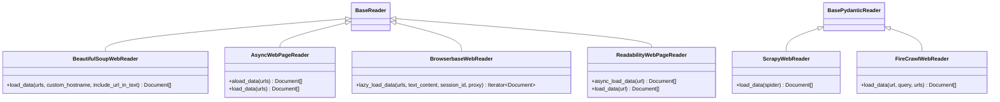

# Web Scraping Connectors

<cite>
**Referenced Files in This Document**
- [beautiful_soup_web/base.py](file://llama-index-integrations/readers/llama-index-readers-web/llama_index/readers/web/beautiful_soup_web/base.py)
- [scrapy_web/base.py](file://llama-index-integrations/readers/llama-index-readers-web/llama_index/readers/web/scrapy_web/base.py)
- [scrapy_web/utils.py](file://llama-index-integrations/readers/llama-index-readers-web/llama_index/readers/web/scrapy_web/utils.py)
- [firecrawl_web/base.py](file://llama-index-integrations/readers/llama-index-readers-web/llama_index/readers/web/firecrawl_web/base.py)
- [async_web/base.py](file://llama-index-integrations/readers/llama-index-readers-web/llama_index/readers/web/async_web/base.py)
- [browserbase_web/base.py](file://llama-index-integrations/readers/llama-index-readers-web/llama_index/readers/web/browserbase_web/base.py)
- [readability_web/base.py](file://llama-index-integrations/readers/llama-index-readers-web/llama_index/readers/web/readability_web/base.py)
- [readability_web/Readability.js](file://llama-index-integrations/readers/llama-index-readers-web/llama_index/readers/web/readability_web/Readability.js)
- [__init__.py](file://llama-index-integrations/readers/llama-index-readers-web/llama_index/readers/web/__init__.py)
- [simple_web/base.py](file://llama-index-integrations/readers/llama-index-readers-web/llama_index/readers/web/simple_web/base.py)
- [sitemap/base.py](file://llama-index-integrations/readers/llama-index-readers-web/llama_index/readers/web/sitemap/base.py)
- [rss/base.py](file://llama-index-integrations/readers/llama-index-readers-web/llama_index/readers/web/rss/base.py)
- [rss_news/base.py](file://llama-index-integrations/readers/llama-index-readers-web/llama_index/readers/web/rss_news/base.py)
- [unstructured_web/base.py](file://llama-index-integrations/readers/llama-index-readers-web/llama_index/readers/web/unstructured_web/base.py)
- [trafilatura_web/base.py](file://llama-index-integrations/readers/llama-index-readers-web/llama_index/readers/web/trafilatura_web/base.py)
- [whole_site/base.py](file://llama-index-integrations/readers/llama-index-readers-web/llama_index/readers/web/whole_site/base.py)
- [spider_web/base.py](file://llama-index-integrations/readers/llama-index-readers-web/llama_index/readers/web/spider_web/base.py)
- [news/base.py](file://llama-index-integrations/readers/llama-index-readers-web/llama_index/readers/web/news/base.py)
- [knowledge_base/base.py](file://llama-index-integrations/readers/llama-index-readers-web/llama_index/readers/web/knowledge_base/base.py)
- [main_content_extractor/base.py](file://llama-index-integrations/readers/llama-index-readers-web/llama_index/readers/web/main_content_extractor/base.py)
- [zyte_web/base.py](file://llama-index-integrations/readers/llama-index-readers-web/llama_index/readers/web/zyte_web/base.py)
- [zenrows_web/base.py](file://llama-index-integrations/readers/llama-index-readers-web/llama_index/readers/web/zenrows_web/base.py)
- [oxylabs_web/base.py](file://llama-index-integrations/readers/llama-index-readers-web/llama_index/readers/web/oxylabs_web/base.py)
- [hyperbrowser_web/base.py](file://llama-index-integrations/readers/llama-index-readers-web/llama_index/readers/web/hyperbrowser_web/base.py)
- [olostep_web/base.py](file://llama-index-integrations/readers/llama-index-readers-web/llama_index/readers/web/olostep_web/base.py)
- [agentql_web/base.py](file://llama-index-integrations/readers/llama-index-readers-web/llama_index/readers/web/agentql_web/base.py)
- [examples/parallel_web_systems.ipynb](file://llama-index-integrations/tools/llama-index-tools-parallel-web-systems/examples/parallel_web_systems.ipynb)
</cite>

## Table of Contents
1. [Introduction](#introduction)
2. [Project Structure](#project-structure)
3. [Core Components](#core-components)
4. [Architecture Overview](#architecture-overview)
5. [Detailed Component Analysis](#detailed-component-analysis)
6. [Dependency Analysis](#dependency-analysis)
7. [Performance Considerations](#performance-considerations)
8. [Troubleshooting Guide](#troubleshooting-guide)
9. [Conclusion](#conclusion)
10. [Appendices](#appendices)

## Introduction
This document explains the web scraping connectors available in LlamaIndex integrations, focusing on HTML parsing, CSS selectors, XPath expressions, and DOM traversal techniques. It also covers authentication methods (form login, API keys, session cookies), JavaScript rendering for dynamic content using headless browsers, anti-scraping mitigation strategies, and practical guidance for handling redirects, managing sessions, and processing different content types (HTML, PDF, images). Finally, it outlines data extraction patterns, cleaning techniques, error handling for broken links and malformed content, and ethical scraping practices including robots.txt compliance and rate limiting considerations.

## Project Structure
The web readers are organized as modular components under a unified namespace. Each reader encapsulates a distinct strategy: static HTML parsing, asynchronous fetching, headless browser rendering, third-party APIs, and specialized domain extractors.

**Diagram sources**
- [__init__.py](file://llama-index-integrations/readers/llama-index-readers-web/llama_index/readers/web/__init__.py#L1-L89)

**Section sources**
- [__init__.py](file://llama-index-integrations/readers/llama-index-readers-web/llama_index/readers/web/__init__.py#L1-L89)

## Core Components
- BeautifulSoupWebReader: Parses HTML and applies site-specific extractors using CSS selectors and DOM traversal. Supports custom hostname mapping and per-site extraction functions.
- ScrapyWebReader: Runs Scrapy spiders in isolated processes to collect structured data with configurable metadata keys and project settings.
- FireCrawlWebReader: Integrates with Firecrawl’s API supporting modes: scrape, crawl, map, search, and extract. Handles varied response formats robustly.
- AsyncWebPageReader: Asynchronously fetches pages with concurrency limits, optional HTML-to-text conversion, deduplication, and strict/fail-on-error policies.
- BrowserbaseWebReader: Loads pre-rendered pages using Browserbase’s hosted headless browser with optional proxy and session controls.
- ReadabilityWebPageReader: Renders pages with Playwright and extracts main content using Mozilla’s Readability.js.
- Specialized Readers: RSS, Sitemap, News, Knowledge Base, Main Content Extractor, Trafilatura, Unstructured, Zyte, ZenRows, Oxylabs, HyperBrowser, Olostep, AgentQL.

**Section sources**
- [beautiful_soup_web/base.py](file://llama-index-integrations/readers/llama-index-readers-web/llama_index/readers/web/beautiful_soup_web/base.py#L136-L213)
- [scrapy_web/base.py](file://llama-index-integrations/readers/llama-index-readers-web/llama_index/readers/web/scrapy_web/base.py#L12-L94)
- [firecrawl_web/base.py](file://llama-index-integrations/readers/llama-index-readers-web/llama_index/readers/web/firecrawl_web/base.py#L10-L921)
- [async_web/base.py](file://llama-index-integrations/readers/llama-index-readers-web/llama_index/readers/web/async_web/base.py#L11-L141)
- [browserbase_web/base.py](file://llama-index-integrations/readers/llama-index-readers-web/llama_index/readers/web/browserbase_web/base.py#L10-L55)
- [readability_web/base.py](file://llama-index-integrations/readers/llama-index-readers-web/llama_index/readers/web/readability_web/base.py#L23-L160)

## Architecture Overview
The readers follow a consistent interface pattern and can be composed into pipelines. Some readers integrate external services (APIs), others use local libraries (BeautifulSoup, Scrapy, Playwright), and a few wrap third-party SDKs.

**Diagram sources**
- [beautiful_soup_web/base.py](file://llama-index-integrations/readers/llama-index-readers-web/llama_index/readers/web/beautiful_soup_web/base.py#L136-L213)
- [scrapy_web/base.py](file://llama-index-integrations/readers/llama-index-readers-web/llama_index/readers/web/scrapy_web/base.py#L12-L94)
- [firecrawl_web/base.py](file://llama-index-integrations/readers/llama-index-readers-web/llama_index/readers/web/firecrawl_web/base.py#L10-L921)
- [async_web/base.py](file://llama-index-integrations/readers/llama-index-readers-web/llama_index/readers/web/async_web/base.py#L11-L141)
- [browserbase_web/base.py](file://llama-index-integrations/readers/llama-index-readers-web/llama_index/readers/web/browserbase_web/base.py#L10-L55)
- [readability_web/base.py](file://llama-index-integrations/readers/llama-index-readers-web/llama_index/readers/web/readability_web/base.py#L23-L160)

## Detailed Component Analysis

### HTML Parsing and CSS Selectors
- Uses BeautifulSoup to parse HTML and extract text and metadata.
- Site-specific extractors demonstrate CSS selector usage and DOM traversal patterns.
- Provides a mapping of hostnames to extractor functions for specialized sites.

**Diagram sources**
- [beautiful_soup_web/base.py](file://llama-index-integrations/readers/llama-index-readers-web/llama_index/readers/web/beautiful_soup_web/base.py#L162-L213)

**Section sources**
- [beautiful_soup_web/base.py](file://llama-index-integrations/readers/llama-index-readers-web/llama_index/readers/web/beautiful_soup_web/base.py#L15-L213)

### XPath Expressions
- XPath is not used in the referenced implementations. CSS selectors and BeautifulSoup methods are the primary DOM traversal mechanisms.

[No sources needed since this section clarifies absence of XPath usage]

### DOM Traversal Techniques
- BeautifulSoup methods are used to locate elements, iterate descendants, and build cleaned text.
- Example patterns include finding elements by class, iterating children, and joining text content.

**Section sources**
- [beautiful_soup_web/base.py](file://llama-index-integrations/readers/llama-index-readers-web/llama_index/readers/web/beautiful_soup_web/base.py#L26-L124)

### Authentication Methods
- Form login: Not implemented in the referenced readers; use external session management and pass cookies to readers that accept session parameters.
- API keys: Supported by several readers (Firecrawl, Browserbase, Zyte, ZenRows, Oxylabs, HyperBrowser, Olostep, AgentQL).
- Session cookies: Supported by readers that expose session or cookie parameters; ensure cookies are attached to requests.

**Section sources**
- [firecrawl_web/base.py](file://llama-index-integrations/readers/llama-index-readers-web/llama_index/readers/web/firecrawl_web/base.py#L31-L57)
- [browserbase_web/base.py](file://llama-index-integrations/readers/llama-index-readers-web/llama_index/readers/web/browserbase_web/base.py#L19-L32)
- [zyte_web/base.py](file://llama-index-integrations/readers/llama-index-readers-web/llama_index/readers/web/zyte_web/base.py)
- [zenrows_web/base.py](file://llama-index-integrations/readers/llama-index-readers-web/llama_index/readers/web/zenrows_web/base.py)
- [oxylabs_web/base.py](file://llama-index-integrations/readers/llama-index-readers-web/llama_index/readers/web/oxylabs_web/base.py)
- [hyperbrowser_web/base.py](file://llama-index-integrations/readers/llama-index-readers-web/llama_index/readers/web/hyperbrowser_web/base.py)
- [olostep_web/base.py](file://llama-index-integrations/readers/llama-index-readers-web/llama_index/readers/web/olostep_web/base.py)
- [agentql_web/base.py](file://llama-index-integrations/readers/llama-index-readers-web/llama_index/readers/web/agentql_web/base.py)

### JavaScript Rendering for Dynamic Content
- BrowserbaseWebReader: Uses a hosted headless browser to render pages and return text or HTML.
- ReadabilityWebPageReader: Launches a Chromium browser via Playwright, injects Readability.js, and extracts main content.

**Diagram sources**
- [readability_web/base.py](file://llama-index-integrations/readers/llama-index-readers-web/llama_index/readers/web/readability_web/base.py#L62-L160)
- [readability_web/Readability.js](file://llama-index-integrations/readers/llama-index-readers-web/llama_index/readers/web/readability_web/Readability.js)

**Section sources**
- [browserbase_web/base.py](file://llama-index-integrations/readers/llama-index-readers-web/llama_index/readers/web/browserbase_web/base.py#L33-L55)
- [readability_web/base.py](file://llama-index-integrations/readers/llama-index-readers-web/llama_index/readers/web/readability_web/base.py#L23-L160)

### Anti-Scraping Mitigation Strategies
- Concurrency control: AsyncWebPageReader uses semaphores to limit concurrent requests.
- Fail-on-error policy: Option to raise exceptions on non-200 responses.
- Deduplication: Removes duplicate URLs before fetching.
- Headless rendering: Browser-based readers reduce detection risk for dynamic sites.
- Proxies: Browserbase supports proxy configuration.

**Section sources**
- [async_web/base.py](file://llama-index-integrations/readers/llama-index-readers-web/llama_index/readers/web/async_web/base.py#L69-L127)
- [browserbase_web/base.py](file://llama-index-integrations/readers/llama-index-readers-web/llama_index/readers/web/browserbase_web/base.py#L33-L49)

### Handling Redirects, Sessions, and Cookies
- Redirects: HTTP clients handle redirects automatically; inspect response URLs and statuses for anomalies.
- Sessions: Use persistent sessions to maintain state across requests; attach cookies to requests.
- Cookies: Supply cookies via request headers or session objects depending on the reader’s capabilities.

[No sources needed since this section provides general guidance]

### Processing Different Content Types
- HTML: All readers produce Documents containing text and metadata.
- PDF: Use readers designed for PDF extraction (e.g., Unstructured, Trafilatura) when applicable.
- Images: Some readers return raw HTML or metadata; image extraction requires dedicated loaders.

**Section sources**
- [unstructured_web/base.py](file://llama-index-integrations/readers/llama-index-readers-web/llama_index/readers/web/unstructured_web/base.py)
- [trafilatura_web/base.py](file://llama-index-integrations/readers/llama-index-readers-web/llama_index/readers/web/trafilatura_web/base.py)

### Data Extraction Patterns and Cleaning
- Site-specific extractors apply CSS selectors and DOM traversal to isolate relevant content.
- Normalization and splitting: ReadabilityWebPageReader supports text normalization and optional splitting.

**Section sources**
- [beautiful_soup_web/base.py](file://llama-index-integrations/readers/llama-index-readers-web/llama_index/readers/web/beautiful_soup_web/base.py#L15-L133)
- [readability_web/base.py](file://llama-index-integrations/readers/llama-index-readers-web/llama_index/readers/web/readability_web/base.py#L14-L105)

### Error Handling for Broken Links and Malformed Content
- AsyncWebPageReader logs warnings and optionally raises errors on non-200 responses.
- FireCrawlWebReader handles various response formats and populates metadata with warnings or errors.

**Section sources**
- [async_web/base.py](file://llama-index-integrations/readers/llama-index-readers-web/llama_index/readers/web/async_web/base.py#L96-L127)
- [firecrawl_web/base.py](file://llama-index-integrations/readers/llama-index-readers-web/llama_index/readers/web/firecrawl_web/base.py#L218-L251)

### Ethical Scraping Practices
- Robots.txt compliance: Respect robots.txt directives; avoid scraping disallowed paths.
- Rate limiting: Use concurrency limits and delays to minimize server impact.
- User-Agent rotation: Configure appropriate headers to mimic real browsers.
- IP rotation: Use proxies or rotating IP providers when necessary.

[No sources needed since this section provides general guidance]

## Dependency Analysis
- BeautifulSoupWebReader depends on requests and BeautifulSoup for parsing.
- ScrapyWebReader depends on Scrapy and runs spiders in isolated processes.
- FireCrawlWebReader depends on the Firecrawl SDK and supports multiple modes.
- AsyncWebPageReader depends on aiohttp and html2text.
- BrowserbaseWebReader depends on the Browserbase SDK.
- ReadabilityWebPageReader depends on Playwright and Readability.js.

**Diagram sources**
- [beautiful_soup_web/base.py](file://llama-index-integrations/readers/llama-index-readers-web/llama_index/readers/web/beautiful_soup_web/base.py#L181-L195)
- [scrapy_web/base.py](file://llama-index-integrations/readers/llama-index-readers-web/llama_index/readers/web/scrapy_web/base.py#L1-L10)
- [firecrawl_web/base.py](file://llama-index-integrations/readers/llama-index-readers-web/llama_index/readers/web/firecrawl_web/base.py#L42-L56)
- [async_web/base.py](file://llama-index-integrations/readers/llama-index-readers-web/llama_index/readers/web/async_web/base.py#L35-L46)
- [browserbase_web/base.py](file://llama-index-integrations/readers/llama-index-readers-web/llama_index/readers/web/browserbase_web/base.py#L24-L29)
- [readability_web/base.py](file://llama-index-integrations/readers/llama-index-readers-web/llama_index/readers/web/readability_web/base.py#L73-L76)

**Section sources**
- [beautiful_soup_web/base.py](file://llama-index-integrations/readers/llama-index-readers-web/llama_index/readers/web/beautiful_soup_web/base.py#L181-L195)
- [scrapy_web/base.py](file://llama-index-integrations/readers/llama-index-readers-web/llama_index/readers/web/scrapy_web/base.py#L1-L10)
- [firecrawl_web/base.py](file://llama-index-integrations/readers/llama-index-readers-web/llama_index/readers/web/firecrawl_web/base.py#L42-L56)
- [async_web/base.py](file://llama-index-integrations/readers/llama-index-readers-web/llama_index/readers/web/async_web/base.py#L35-L46)
- [browserbase_web/base.py](file://llama-index-integrations/readers/llama-index-readers-web/llama_index/readers/web/browserbase_web/base.py#L24-L29)
- [readability_web/base.py](file://llama-index-integrations/readers/llama-index-readers-web/llama_index/readers/web/readability_web/base.py#L73-L76)

## Performance Considerations
- Concurrency: Control maximum concurrent requests to balance speed and server load.
- Deduplication: Remove duplicate URLs to avoid redundant work.
- HTML-to-text conversion: Enable only when needed to reduce processing overhead.
- Headless rendering: Prefer for dynamic content; consider caching rendered snapshots.
- Mode selection: Use targeted modes (scrape vs. crawl vs. search) to minimize unnecessary data transfer.

[No sources needed since this section provides general guidance]

## Troubleshooting Guide
- Non-200 responses: Inspect status codes and response bodies; enable fail-on-error for strict checks.
- Empty or malformed content: Verify selectors and extraction logic; add fallbacks.
- Timeout issues: Increase timeouts or reduce concurrency.
- Missing dependencies: Install required packages indicated by import errors.

**Section sources**
- [async_web/base.py](file://llama-index-integrations/readers/llama-index-readers-web/llama_index/readers/web/async_web/base.py#L96-L127)
- [firecrawl_web/base.py](file://llama-index-integrations/readers/llama-index-readers-web/llama_index/readers/web/firecrawl_web/base.py#L218-L251)

## Conclusion
LlamaIndex integrates a broad set of web scraping connectors, from basic HTML parsing to advanced headless rendering and third-party APIs. Choose the right reader for your target content type and environment, configure authentication and anti-detection measures appropriately, and apply robust error handling and ethical practices.

[No sources needed since this section summarizes without analyzing specific files]

## Appendices

### Reader Modes and Capabilities
- BeautifulSoupWebReader: Static HTML parsing with site-specific extractors.
- ScrapyWebReader: Structured extraction via Scrapy spiders.
- FireCrawlWebReader: Multi-mode API (scrape, crawl, map, search, extract).
- AsyncWebPageReader: Asynchronous fetching with concurrency control.
- BrowserbaseWebReader: Hosted headless rendering.
- ReadabilityWebPageReader: Readability-based extraction via Playwright.

**Section sources**
- [beautiful_soup_web/base.py](file://llama-index-integrations/readers/llama-index-readers-web/llama_index/readers/web/beautiful_soup_web/base.py#L136-L213)
- [scrapy_web/base.py](file://llama-index-integrations/readers/llama-index-readers-web/llama_index/readers/web/scrapy_web/base.py#L12-L94)
- [firecrawl_web/base.py](file://llama-index-integrations/readers/llama-index-readers-web/llama_index/readers/web/firecrawl_web/base.py#L10-L921)
- [async_web/base.py](file://llama-index-integrations/readers/llama-index-readers-web/llama_index/readers/web/async_web/base.py#L11-L141)
- [browserbase_web/base.py](file://llama-index-integrations/readers/llama-index-readers-web/llama_index/readers/web/browserbase_web/base.py#L10-L55)
- [readability_web/base.py](file://llama-index-integrations/readers/llama-index-readers-web/llama_index/readers/web/readability_web/base.py#L23-L160)

### Parallel Web Systems Example
- Explore parallel web systems usage in the example notebook.

**Section sources**
- [examples/parallel_web_systems.ipynb](file://llama-index-integrations/tools/llama-index-tools-parallel-web-systems/examples/parallel_web_systems.ipynb)