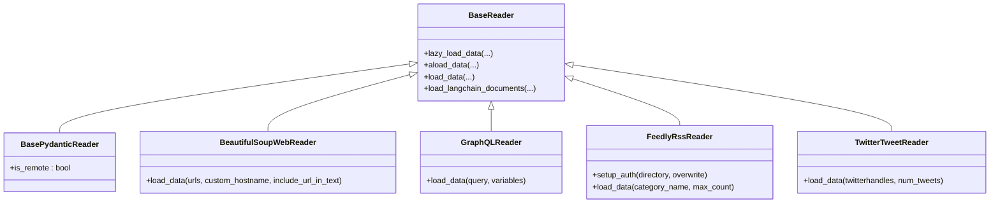

# Web and API Connectors

<cite>
**Referenced Files in This Document**
- [base.py](file://llama-index-core/llama_index/core/readers/base.py)
- [beautiful_soup_web/base.py](file://llama-index-integrations/readers/llama-index-readers-web/llama_index/readers/web/beautiful_soup_web/base.py)
- [graphql/base.py](file://llama-index-integrations/readers/llama-index-readers-graphql/llama_index/readers/graphql/base.py)
- [feedly_rss/base.py](file://llama-index-integrations/readers/llama-index-readers-feedly-rss/llama_index/readers/feedly_rss/base.py)
- [twitter/base.py](file://llama-index-integrations/readers/llama-index-readers-twitter/llama_index/readers/twitter/base.py)
- [reddit/base.py](file://llama-index-integrations/readers/llama-index-readers-reddit/llama_index/readers/reddit/base.py)
- [web/__init__.py](file://llama-index-integrations/readers/llama-index-readers-web/llama_index/readers/web/__init__.py)
- [graphql/__init__.py](file://llama-index-integrations/readers/llama-index-readers-graphql/llama_index/readers/graphql/__init__.py)
- [feedly_rss/__init__.py](file://llama-index-integrations/readers/llama-index-readers-feedly-rss/llama_index/readers/feedly_rss/__init__.py)
- [twitter/__init__.py](file://llama-index-integrations/readers/llama-index-readers-twitter/llama_index/readers/twitter/__init__.py)
- [reddit/__init__.py](file://llama-index-integrations/readers/llama-index-readers-reddit/llama_index/readers/reddit/__init__.py)
- [test_async_web.py](file://llama-index-integrations/readers/llama-index-readers-web/tests/test_async_web.py)
- [test_firecrawl_web_reader.py](file://llama-index-integrations/readers/llama-index-readers-web/tests/test_firecrawl_web_reader.py)
- [test_scrapy_web_reader.py](file://llama-index-integrations/readers/llama-index-readers-web/tests/test_scrapy_web_reader.py)
- [test_simple_webreader.py](file://llama-index-integrations/readers/llama-index-readers-web/tests/test_simple_webreader.py)
- [test_zenrows_web.py](file://llama-index-integrations/readers/llama-index-readers-web/tests/test_zenrows_web.py)
- [test_readers_graphql.py](file://llama-index-integrations/readers/llama-index-readers-graphql/tests/test_readers_graphql.py)
- [test_readers_rss.py](file://llama-index-integrations/readers/llama-index-readers-feedly-rss/tests/test_readers_rss.py)
- [test_readers_twitter.py](file://llama-index-integrations/readers/llama-index-readers-twitter/tests/test_readers_twitter.py)
- [test_readers_reddit.py](file://llama-index-integrations/readers/llama-index-readers-reddit/tests/test_readers_reddit.py)
</cite>

## Table of Contents
1. [Introduction](#introduction)
2. [Project Structure](#project-structure)
3. [Core Components](#core-components)
4. [Architecture Overview](#architecture-overview)
5. [Detailed Component Analysis](#detailed-component-analysis)
6. [Dependency Analysis](#dependency-analysis)
7. [Performance Considerations](#performance-considerations)
8. [Troubleshooting Guide](#troubleshooting-guide)
9. [Conclusion](#conclusion)
10. [Appendices](#appendices)

## Introduction
This document describes the web and API connectors available in LlamaIndex, focusing on:
- Web scraping readers for static and dynamic content
- REST and GraphQL API readers
- RSS readers for feeds
- Social media readers for public feeds
- Authentication, rate limiting, pagination, and error recovery patterns
- Connector configuration (headers, timeouts, retries)
- Practical usage patterns and anti-scraping mitigation
- Performance optimization and real-time integration guidance

The goal is to help users select and configure the right connector for their data sources while following best practices for reliability, scalability, and compliance.

## Project Structure
The connectors are organized primarily under the integrations readers module, with core abstractions in the core readers module. The web connectors include multiple specialized readers for different providers and extraction strategies. GraphQL, RSS, and social media readers are provided as separate modules.

**Diagram sources**
- [base.py](file://llama-index-core/llama_index/core/readers/base.py#L19-L250)
- [beautiful_soup_web/base.py](file://llama-index-integrations/readers/llama-index-readers-web/llama_index/readers/web/beautiful_soup_web/base.py#L136-L213)
- [graphql/base.py](file://llama-index-integrations/readers/llama-index-readers-graphql/llama_index/readers/graphql/base.py#L10-L74)
- [feedly_rss/base.py](file://llama-index-integrations/readers/llama-index-readers-feedly-rss/llama_index/readers/feedly_rss/base.py#L10-L67)
- [twitter/base.py](file://llama-index-integrations/readers/llama-index-readers-twitter/llama_index/readers/twitter/base.py#L9-L78)
- [reddit/base.py](file://llama-index-integrations/readers/llama-index-readers-reddit/llama_index/readers/reddit/base.py#L1-L200)

**Section sources**
- [base.py](file://llama-index-core/llama_index/core/readers/base.py#L19-L250)
- [web/__init__.py](file://llama-index-integrations/readers/llama-index-readers-web/llama_index/readers/web/__init__.py#L1-L200)
- [graphql/__init__.py](file://llama-index-integrations/readers/llama-index-readers-graphql/llama_index/readers/graphql/__init__.py#L1-L200)
- [feedly_rss/__init__.py](file://llama-index-integrations/readers/llama-index-readers-feedly-rss/llama_index/readers/feedly_rss/__init__.py#L1-L200)
- [twitter/__init__.py](file://llama-index-integrations/readers/llama-index-readers-twitter/llama_index/readers/twitter/__init__.py#L1-L200)
- [reddit/__init__.py](file://llama-index-integrations/readers/llama-index-readers-reddit/llama_index/readers/reddit/__init__.py#L1-L200)

## Core Components
- BaseReader and BasePydanticReader define the contract for synchronous/asynchronous data loading, resource listing, and serialization. They also mark whether a reader accesses remote APIs.
- ReaderConfig encapsulates a reader instance and its arguments for reproducible ingestion.

Key capabilities:
- Lazy and eager loading
- Async variants for IO-bound workloads
- Resource-centric APIs for listing and loading specific entities
- Serialization-friendly Pydantic-backed reader base

**Section sources**
- [base.py](file://llama-index-core/llama_index/core/readers/base.py#L19-L250)

## Architecture Overview
Connectors follow a consistent pattern:
- Implement BaseReader or BasePydanticReader
- Accept configuration via constructor parameters (e.g., headers, tokens)
- Expose load_data and optionally async variants
- Return a list of Documents with extracted text and metadata

**Diagram sources**
- [base.py](file://llama-index-core/llama_index/core/readers/base.py#L19-L250)
- [beautiful_soup_web/base.py](file://llama-index-integrations/readers/llama-index-readers-web/llama_index/readers/web/beautiful_soup_web/base.py#L136-L213)
- [graphql/base.py](file://llama-index-integrations/readers/llama-index-readers-graphql/llama_index/readers/graphql/base.py#L10-L74)
- [feedly_rss/base.py](file://llama-index-integrations/readers/llama-index-readers-feedly-rss/llama_index/readers/feedly_rss/base.py#L10-L67)
- [twitter/base.py](file://llama-index-integrations/readers/llama-index-readers-twitter/llama_index/readers/twitter/base.py#L9-L78)

## Detailed Component Analysis

### Web Scraping Readers
- BeautifulSoupWebReader: Loads pages via HTTP, parses HTML with BeautifulSoup, supports custom hostname extractors, and returns Documents with URL metadata. It demonstrates per-site extraction strategies and URL normalization.

Connector-specific configuration:
- website_extractor: Map hostnames to extractor functions for domain-specific parsing
- include_url_in_text: Whether to include reference URLs in extracted text
- custom_hostname: Override hostname detection for custom domains

Anti-scraping mitigation:
- Respect robots.txt and rate limits
- Add realistic headers and user agents
- Rotate IPs and sessions when using proxy services
- Introduce jittered delays between requests

Data cleaning:
- Remove extraneous whitespace and empty lines
- Normalize relative links to absolute URLs
- Extract main content areas and strip navigation

Practical example patterns:
- Scrape documentation sites with built-in extractors
- Batch URLs with per-domain strategies
- Combine with caching to avoid repeated downloads

**Section sources**
- [beautiful_soup_web/base.py](file://llama-index-integrations/readers/llama-index-readers-web/llama_index/readers/web/beautiful_soup_web/base.py#L136-L213)

### REST and GraphQL API Readers
- GraphQLReader: Initializes a client with URI and headers, executes queries with variables, and converts results to Documents. It requires the gql package and supports YAML serialization of result sets.

Connector-specific configuration:
- uri: GraphQL endpoint
- headers: Optional HTTP headers (e.g., Authorization)
- variables: Query parameters

Error handling:
- Import-time checks for gql
- Execution errors propagate as exceptions
- Ensure proper schema fetching and variable typing

Practical example patterns:
- Fetch paginated nodes with variables
- Serialize nested structures for downstream processing
- Combine with caching for frequently accessed schemas

**Section sources**
- [graphql/base.py](file://llama-index-integrations/readers/llama-index-readers-graphql/llama_index/readers/graphql/base.py#L10-L74)

### RSS Readers
- FeedlyRssReader: Authenticates via bearer token, lists categories, and streams articles up to a configurable count. Articles are serialized to JSON for Document creation.

Connector-specific configuration:
- bearer_token: Required for Feedly API access
- category_name: Target category to stream
- max_count: Limit number of items returned

Practical example patterns:
- Periodic ingestion of top stories by category
- Deduplicate by article ID or URL
- Store last-seen timestamps for incremental updates

**Section sources**
- [feedly_rss/base.py](file://llama-index-integrations/readers/llama-index-readers-feedly-rss/llama_index/readers/feedly_rss/base.py#L10-L67)

### Social Media Readers
- TwitterTweetReader: Uses a bearer token to fetch recent tweets for given handles, concatenating tweet texts into Documents keyed by username.

Connector-specific configuration:
- bearer_token: Twitter API bearer token
- num_tweets: Max tweets per user

Practical example patterns:
- Batch user handles for efficient retrieval
- Apply rate limits and backoff
- Filter sensitive content if needed

Note: A Reddit reader exists in the same structure; similar patterns apply for API-based ingestion with appropriate credentials and rate controls.

**Section sources**
- [twitter/base.py](file://llama-index-integrations/readers/llama-index-readers-twitter/llama_index/readers/twitter/base.py#L9-L78)
- [reddit/base.py](file://llama-index-integrations/readers/llama-index-readers-reddit/llama_index/readers/reddit/base.py#L1-L200)

## Dependency Analysis
Connectors depend on external libraries and services:
- Web readers commonly rely on requests, BeautifulSoup, and provider SDKs
- GraphQLReader depends on gql
- RSS readers depend on provider SDKs (e.g., feedly)
- Social media readers depend on respective SDKs (e.g., tweepy)

**Diagram sources**
- [base.py](file://llama-index-core/llama_index/core/readers/base.py#L19-L250)
- [beautiful_soup_web/base.py](file://llama-index-integrations/readers/llama-index-readers-web/llama_index/readers/web/beautiful_soup_web/base.py#L136-L213)
- [graphql/base.py](file://llama-index-integrations/readers/llama-index-readers-graphql/llama_index/readers/graphql/base.py#L10-L74)
- [feedly_rss/base.py](file://llama-index-integrations/readers/llama-index-readers-feedly-rss/llama_index/readers/feedly_rss/base.py#L10-L67)
- [twitter/base.py](file://llama-index-integrations/readers/llama-index-readers-twitter/llama_index/readers/twitter/base.py#L9-L78)

**Section sources**
- [base.py](file://llama-index-core/llama_index/core/readers/base.py#L19-L250)
- [beautiful_soup_web/base.py](file://llama-index-integrations/readers/llama-index-readers-web/llama_index/readers/web/beautiful_soup_web/base.py#L136-L213)
- [graphql/base.py](file://llama-index-integrations/readers/llama-index-readers-graphql/llama_index/readers/graphql/base.py#L10-L74)
- [feedly_rss/base.py](file://llama-index-integrations/readers/llama-index-readers-feedly-rss/llama_index/readers/feedly_rss/base.py#L10-L67)
- [twitter/base.py](file://llama-index-integrations/readers/llama-index-readers-twitter/llama_index/readers/twitter/base.py#L9-L78)

## Performance Considerations
- Concurrency: Prefer async loading paths where available; batch requests with controlled concurrency to avoid throttling.
- Caching: Cache responses for static pages and RSS streams; use ETags or last-modified headers when supported.
- Retries: Implement exponential backoff for transient failures; distinguish between client and server errors.
- Pagination: Use provider cursors or page tokens; enforce safe limits to prevent runaway queries.
- Rate limiting: Respect provider quotas; queue or delay requests when nearing limits.
- Anti-scraping: Rotate user agents, rotate proxies, and simulate human-like behavior.

[No sources needed since this section provides general guidance]

## Troubleshooting Guide
Common issues and remedies:
- Missing dependencies: Install required packages (e.g., gql, feedly-sdk, tweepy) as indicated by import-time checks.
- Authentication failures: Verify tokens and scopes; check provider quotas and expiration.
- Network errors: Add retry logic with jitter; handle timeouts gracefully.
- Parsing errors: Validate HTML/JSON; handle missing fields; log malformed records.
- Rate limiting: Implement backoff; reduce concurrency; cache results.

Validation references:
- Async web tests demonstrate async loading patterns and error handling.
- GraphQL, RSS, Twitter, and Reddit readers include unit tests validating basic functionality.

**Section sources**
- [test_async_web.py](file://llama-index-integrations/readers/llama-index-readers-web/tests/test_async_web.py#L1-L200)
- [test_readers_graphql.py](file://llama-index-integrations/readers/llama-index-readers-graphql/tests/test_readers_graphql.py#L1-L200)
- [test_readers_rss.py](file://llama-index-integrations/readers/llama-index-readers-feedly-rss/tests/test_readers_rss.py#L1-L200)
- [test_readers_twitter.py](file://llama-index-integrations/readers/llama-index-readers-twitter/tests/test_readers_twitter.py#L1-L200)
- [test_readers_reddit.py](file://llama-index-integrations/readers/llama-index-readers-reddit/tests/test_readers_reddit.py#L1-L200)

## Conclusion
LlamaIndex provides a robust set of web and API connectors that follow a consistent reader interface. By leveraging BaseReader abstractions, configuring authentication and headers, implementing retries and pagination, and applying anti-scraping and caching strategies, users can reliably ingest data from diverse sources. Select the connector that matches your target platform, tune its configuration, and integrate it into a resilient ingestion pipeline.

[No sources needed since this section summarizes without analyzing specific files]

## Appendices

### Practical Usage Patterns
- Web scraping: Use BeautifulSoupWebReader for static pages; combine with caching and jittered delays.
- REST/GraphQL: Use GraphQLReader for structured queries; pass variables and headers; serialize results.
- RSS: Use FeedlyRssReader for curated feeds; stream by category and limit counts.
- Social media: Use TwitterTweetReader for public tweets; manage rate limits and batching.

[No sources needed since this section provides general guidance]