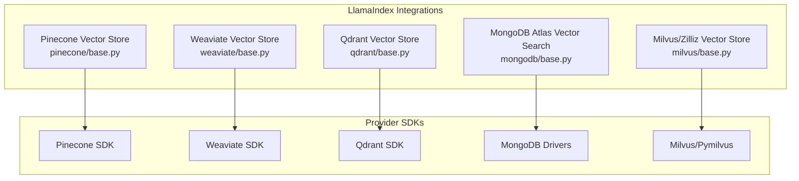
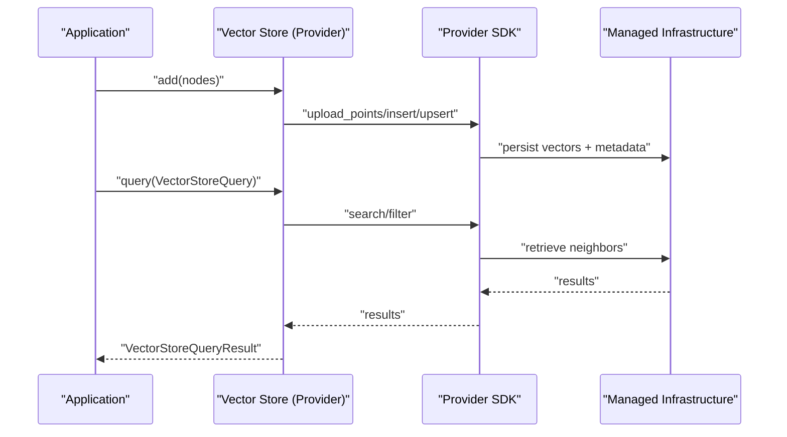
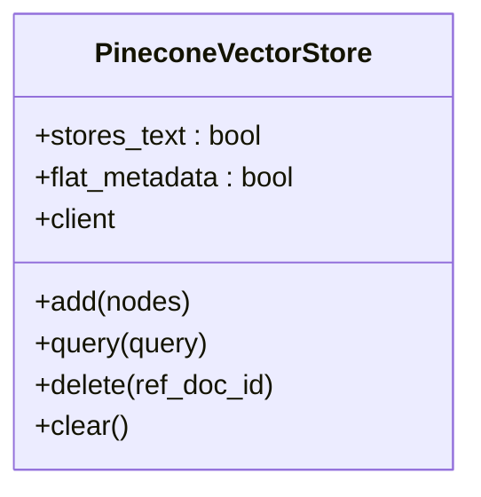
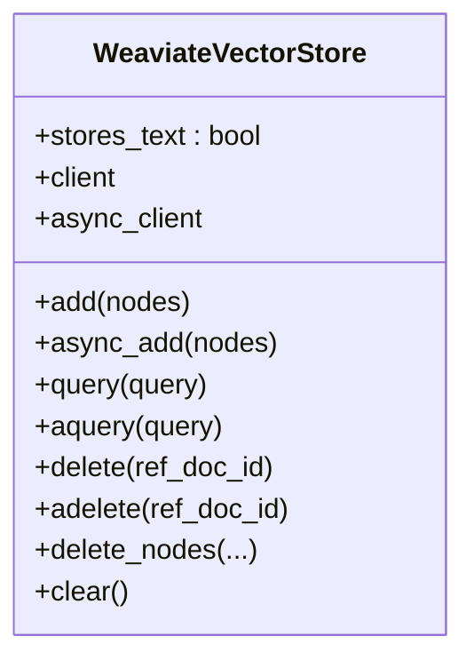
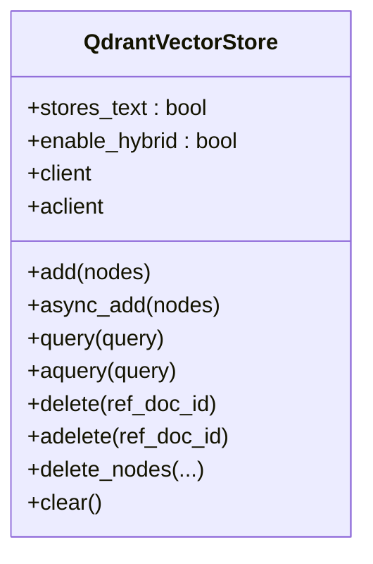
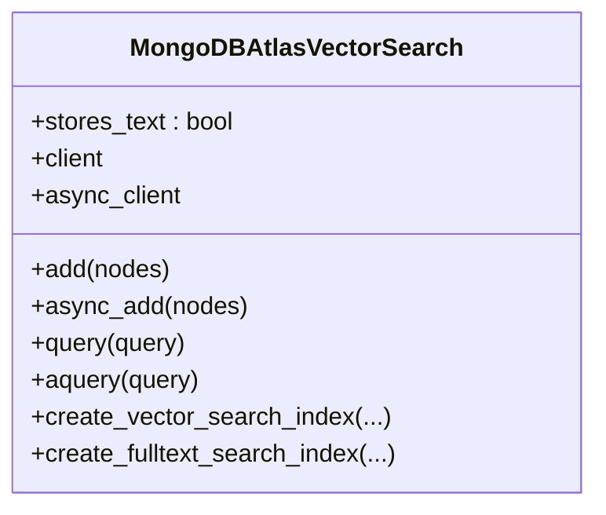
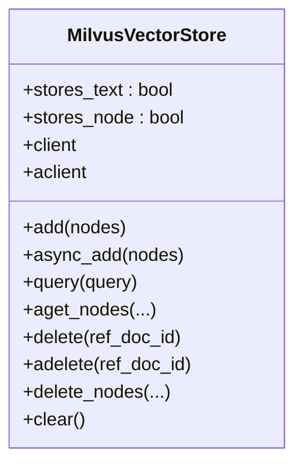
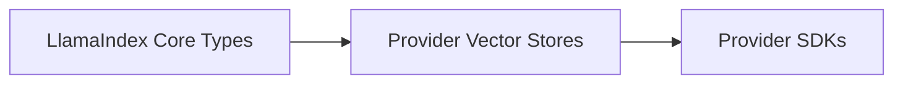

# Cloud Vector Databases

<cite>
**Referenced Files in This Document**
- [pinecone/base.py](file://llama-index-integrations/vector_stores/llama-index-vector-stores-pinecone/llama_index/vector_stores/pinecone/base.py)
- [pinecone/__init__.py](file://llama-index-integrations/vector_stores/llama-index-vector-stores-pinecone/llama_index/vector_stores/pinecone/__init__.py)
- [weaviate/base.py](file://llama-index-integrations/vector_stores/llama-index-vector-stores-weaviate/llama_index/vector_stores/weaviate/base.py)
- [weaviate/__init__.py](file://llama-index-integrations/vector_stores/llama-index-vector-stores-weaviate/llama_index/vector_stores/weaviate/__init__.py)
- [qdrant/base.py](file://llama-index-integrations/vector_stores/llama-index-vector-stores-qdrant/llama_index/vector_stores/qdrant/base.py)
- [qdrant/__init__.py](file://llama-index-integrations/vector_stores/llama-index-vector-stores-qdrant/llama_index/vector_stores/qdrant/__init__.py)
- [mongodb/base.py](file://llama-index-integrations/vector_stores/llama-index-vector-stores-mongodb/llama_index/vector_stores/mongodb/base.py)
- [mongodb/__init__.py](file://llama-index-integrations/vector_stores/llama-index-vector-stores-mongodb/llama_index/vector_stores/mongodb/__init__.py)
- [milvus/base.py](file://llama-index-integrations/vector_stores/llama-index-vector-stores-milvus/llama_index/vector_stores/milvus/base.py)
- [milvus/__init__.py](file://llama-index-integrations/vector_stores/llama-index-vector-stores-milvus/llama_index/vector_stores/milvus/__init__.py)
</cite>

## Table of Contents
1. [Introduction](#introduction)
2. [Project Structure](#project-structure)
3. [Core Components](#core-components)
4. [Architecture Overview](#architecture-overview)
5. [Detailed Component Analysis](#detailed-component-analysis)
6. [Dependency Analysis](#dependency-analysis)
7. [Performance Considerations](#performance-considerations)
8. [Troubleshooting Guide](#troubleshooting-guide)
9. [Conclusion](#conclusion)
10. [Appendices](#appendices)

## Introduction
This document explains how to integrate cloud vector databases with LlamaIndex using official community packages. It focuses on Pinecone, Weaviate Cloud, Qdrant Cloud, Zilliz Cloud, and MongoDB Atlas Vector Search. For each provider, we cover:
- Cloud-specific features such as managed infrastructure, automatic scaling, backup and recovery, and multi-region deployments
- Authentication and configuration options
- Practical deployment steps, collection/index management, metadata filtering, and query optimization
- Cost optimization, monitoring, and disaster recovery guidance
- Choosing between managed and self-hosted solutions based on scalability, compliance, and budget

## Project Structure
The repository organizes cloud vector store integrations under dedicated packages. Each provider exposes a vector store class that implements the LlamaIndex vector store interface and integrates with the provider’s SDK.

**Diagram sources**
- [pinecone/base.py](file://llama-index-integrations/vector_stores/llama-index-vector-stores-pinecone/llama_index/vector_stores/pinecone/base.py#L114-L552)
- [weaviate/base.py](file://llama-index-integrations/vector_stores/llama-index-vector-stores-weaviate/llama_index/vector_stores/weaviate/base.py#L113-L556)
- [qdrant/base.py](file://llama-index-integrations/vector_stores/llama-index-vector-stores-qdrant/llama_index/vector_stores/qdrant/base.py#L72-L800)
- [mongodb/base.py](file://llama-index-integrations/vector_stores/llama-index-vector-stores-mongodb/llama_index/vector_stores/mongodb/base.py#L52-L902)
- [milvus/base.py](file://llama-index-integrations/vector_stores/llama-index-vector-stores-milvus/llama_index/vector_stores/milvus/base.py#L119-L800)

**Section sources**
- [pinecone/__init__.py](file://llama-index-integrations/vector_stores/llama-index-vector-stores-pinecone/llama_index/vector_stores/pinecone/__init__.py#L1-L4)
- [weaviate/__init__.py](file://llama-index-integrations/vector_stores/llama-index-vector-stores-weaviate/llama_index/vector_stores/weaviate/__init__.py#L1-L12)
- [qdrant/__init__.py](file://llama-index-integrations/vector_stores/llama-index-vector-stores-qdrant/llama_index/vector_stores/qdrant/__init__.py#L1-L4)
- [mongodb/__init__.py](file://llama-index-integrations/vector_stores/llama-index-vector-stores-mongodb/llama_index/vector_stores/mongodb/__init__.py#L1-L4)
- [milvus/__init__.py](file://llama-index-integrations/vector_stores/llama-index-vector-stores-milvus/llama_index/vector_stores/milvus/__init__.py#L1-L4)

## Core Components
- PineconeVectorStore: Adds, queries, deletes, and clears records backed by Pinecone indexes. Supports sparse/dense hybrid and namespace scoping.
- WeaviateVectorStore: Manages Weaviate collections, supports hybrid search, batch inserts, and async operations.
- QdrantVectorStore: Manages Qdrant collections, supports dense/sparse vectors, hybrid fusion, sharding, replication, and payload indexing.
- MongoDBAtlasVectorSearch: Uses MongoDB Atlas Vector Search and full-text search with aggregation pipelines and optional hybrid fusion.
- MilvusVectorStore: Supports dense/sparse embeddings, configurable index/search parameters, hybrid ranking, and collection properties.

**Section sources**
- [pinecone/base.py](file://llama-index-integrations/vector_stores/llama-index-vector-stores-pinecone/llama_index/vector_stores/pinecone/base.py#L114-L552)
- [weaviate/base.py](file://llama-index-integrations/vector_stores/llama-index-vector-stores-weaviate/llama_index/vector_stores/weaviate/base.py#L113-L556)
- [qdrant/base.py](file://llama-index-integrations/vector_stores/llama-index-vector-stores-qdrant/llama_index/vector_stores/qdrant/base.py#L72-L800)
- [mongodb/base.py](file://llama-index-integrations/vector_stores/llama-index-vector-stores-mongodb/llama_index/vector_stores/mongodb/base.py#L52-L902)
- [milvus/base.py](file://llama-index-integrations/vector_stores/llama-index-vector-stores-milvus/llama_index/vector_stores/milvus/base.py#L119-L800)

## Architecture Overview
The integrations follow a consistent pattern:
- Initialize a provider client (SDK) with credentials and endpoint
- Configure index/collection settings (dimensions, metrics, sharding, replication)
- Insert nodes with embeddings and metadata
- Query with vector similarity, full-text, or hybrid modes
- Manage deletions and index lifecycle

**Diagram sources**
- [pinecone/base.py](file://llama-index-integrations/vector_stores/llama-index-vector-stores-pinecone/llama_index/vector_stores/pinecone/base.py#L294-L351)
- [weaviate/base.py](file://llama-index-integrations/vector_stores/llama-index-vector-stores-weaviate/llama_index/vector_stores/weaviate/base.py#L259-L284)
- [qdrant/base.py](file://llama-index-integrations/vector_stores/llama-index-vector-stores-qdrant/llama_index/vector_stores/qdrant/base.py#L520-L561)
- [mongodb/base.py](file://llama-index-integrations/vector_stores/llama-index-vector-stores-mongodb/llama_index/vector_stores/mongodb/base.py#L309-L353)
- [milvus/base.py](file://llama-index-integrations/vector_stores/llama-index-vector-stores-milvus/llama_index/vector_stores/milvus/base.py#L421-L486)

## Detailed Component Analysis

### Pinecone
- Managed infrastructure: Serverless and dedicated clusters; automatic scaling handled by Pinecone.
- Authentication: API key; optional environment variable usage.
- Index management: Namespace support; upsert, query, delete operations; sparse/dense hybrid.
- Metadata filtering: Provider-specific filter translation; supports logical conditions and operators.
- Deployment example: Create index with dimension, metric, and cloud/region spec; initialize vector store with index reference.
- Query optimization: Hybrid mode with alpha; sparse encoder optional; batch upsert.

**Diagram sources**
- [pinecone/base.py](file://llama-index-integrations/vector_stores/llama-index-vector-stores-pinecone/llama_index/vector_stores/pinecone/base.py#L114-L180)

**Section sources**
- [pinecone/base.py](file://llama-index-integrations/vector_stores/llama-index-vector-stores-pinecone/llama_index/vector_stores/pinecone/base.py#L114-L552)

### Weaviate Cloud
- Managed infrastructure: Fully managed Weaviate instances; auto-scaling and high availability configured by provider.
- Authentication: API key or resource owner password flow; client creation supports auth config and client kwargs.
- Collections: Automatic schema creation; supports hybrid search; batch insert; async operations.
- Metadata filtering: Translates standard filters to Weaviate Filter DSL; supports AND/OR and various operators.
- Deployment example: Initialize client with URL and auth; create vector store with index name; insert and query.
- Query optimization: Hybrid search with alpha; supports doc/node id filters; robust error handling.

**Diagram sources**
- [weaviate/base.py](file://llama-index-integrations/vector_stores/llama-index-vector-stores-weaviate/llama_index/vector_stores/weaviate/base.py#L113-L258)

**Section sources**
- [weaviate/base.py](file://llama-index-integrations/vector_stores/llama-index-vector-stores-weaviate/llama_index/vector_stores/weaviate/base.py#L113-L556)

### Qdrant Cloud
- Managed infrastructure: Cloud-hosted clusters; sharding, replication, and write consistency configurable.
- Authentication: API key and URL; supports both sync and async clients.
- Collections: Named dense/sparse vector fields; hybrid search with fusion; payload indexing; sharding and replication factors.
- Metadata filtering: Converts standard filters to Qdrant Filter model; supports complex conditions.
- Deployment example: Initialize client with URL/API key; optionally create collection with vector params; enable hybrid if needed.
- Query optimization: Dense/sparse hybrid; configurable fusion; parallel uploads; retry logic.

**Diagram sources**
- [qdrant/base.py](file://llama-index-integrations/vector_stores/llama-index-vector-stores-qdrant/llama_index/vector_stores/qdrant/base.py#L72-L169)

**Section sources**
- [qdrant/base.py](file://llama-index-integrations/vector_stores/llama-index-vector-stores-qdrant/llama_index/vector_stores/qdrant/base.py#L72-L800)

### MongoDB Atlas Vector Search
- Managed infrastructure: Fully managed Atlas clusters; automatic backups and point-in-time recovery; multi-region deployments supported by Atlas.
- Authentication: Connection string via environment variable or direct client; async client supported.
- Index management: Vector search index and full-text search index creation/update; hybrid search via aggregation with reciprocal rank fusion.
- Metadata filtering: Aggregation pipeline filters; supports doc_id-based deletion and metadata-based filters.
- Deployment example: Provide URI; initialize vector store; optionally create indexes; run DEFAULT, TEXT_SEARCH, or HYBRID queries.
- Query optimization: Oversampling factor for HNSW; configurable output fields; embedding exclusion in projections.

**Diagram sources**
- [mongodb/base.py](file://llama-index-integrations/vector_stores/llama-index-vector-stores-mongodb/llama_index/vector_stores/mongodb/base.py#L52-L138)

**Section sources**
- [mongodb/base.py](file://llama-index-integrations/vector_stores/llama-index-vector-stores-mongodb/llama_index/vector_stores/mongodb/base.py#L52-L902)

### Milvus/Zilliz Cloud
- Managed infrastructure: Zilliz Cloud offers fully managed Milvus; supports auto-scaling and multi-zone deployments.
- Authentication: Token-based RBAC; supports local and remote URIs.
- Collections: Dense/sparse embeddings; configurable index/search parameters; hybrid ranking (RRF/Weighted); collection properties (TTL, mmap).
- Metadata filtering: Translates standard filters to Milvus filter expressions; supports scalar filters.
- Deployment example: Initialize Milvus client with URI/token; create collection/schema; insert and query with hybrid ranking.
- Query optimization: Consistency levels; prefetch and batch sizes; sparse/dense hybrid with configurable ranker parameters.

**Diagram sources**
- [milvus/base.py](file://llama-index-integrations/vector_stores/llama-index-vector-stores-milvus/llama_index/vector_stores/milvus/base.py#L119-L257)

**Section sources**
- [milvus/base.py](file://llama-index-integrations/vector_stores/llama-index-vector-stores-milvus/llama_index/vector_stores/milvus/base.py#L119-L800)

## Dependency Analysis
- Each provider integrates via its official SDK/client.
- Vector stores depend on LlamaIndex vector store abstractions and utilities for metadata conversion and batching.
- Cross-provider differences lie in filter DSLs, index creation APIs, and hybrid capabilities.

**Diagram sources**
- [pinecone/base.py](file://llama-index-integrations/vector_stores/llama-index-vector-stores-pinecone/llama_index/vector_stores/pinecone/base.py#L14-L30)
- [weaviate/base.py](file://llama-index-integrations/vector_stores/llama-index-vector-stores-weaviate/llama_index/vector_stores/weaviate/base.py#L14-L34)
- [qdrant/base.py](file://llama-index-integrations/vector_stores/llama-index-vector-stores-qdrant/llama_index/vector_stores/qdrant/base.py#L17-L37)
- [mongodb/base.py](file://llama-index-integrations/vector_stores/llama-index-vector-stores-mongodb/llama_index/vector_stores/mongodb/base.py#L15-L25)
- [milvus/base.py](file://llama-index-integrations/vector_stores/llama-index-vector-stores-milvus/llama_index/vector_stores/milvus/base.py#L27-L42)

**Section sources**
- [pinecone/base.py](file://llama-index-integrations/vector_stores/llama-index-vector-stores-pinecone/llama_index/vector_stores/pinecone/base.py#L14-L30)
- [weaviate/base.py](file://llama-index-integrations/vector_stores/llama-index-vector-stores-weaviate/llama_index/vector_stores/weaviate/base.py#L14-L34)
- [qdrant/base.py](file://llama-index-integrations/vector_stores/llama-index-vector-stores-qdrant/llama_index/vector_stores/qdrant/base.py#L17-L37)
- [mongodb/base.py](file://llama-index-integrations/vector_stores/llama-index-vector-stores-mongodb/llama_index/vector_stores/mongodb/base.py#L15-L25)
- [milvus/base.py](file://llama-index-integrations/vector_stores/llama-index-vector-stores-milvus/llama_index/vector_stores/milvus/base.py#L27-L42)

## Performance Considerations
- Batch sizes: Tune batch_size and parallelism for upload throughput (Qdrant, Milvus).
- Hybrid search: Use alpha to balance dense and sparse contributions; choose fusion strategy carefully (Qdrant, Milvus).
- Index tuning: Select similarity metrics and index parameters aligned with workload (Milvus).
- Filtering: Prefer indexed payload fields and efficient filter expressions (Weaviate, Qdrant).
- Query limits: Control top_k and projection fields to reduce payload size (MongoDB, Weaviate).
- Async operations: Use async clients for high concurrency workloads (Weaviate, Qdrant, MongoDB).

[No sources needed since this section provides general guidance]

## Troubleshooting Guide
- Missing SDK: Ensure the provider SDK is installed; vector store constructors include import checks and messages.
- Authentication failures: Verify API keys, tokens, and connection strings; confirm environment variables for MongoDB.
- Filter errors: Translate filters to provider-specific DSL; check operator support and logical grouping.
- Index creation: Confirm collection existence and schema alignment; recreate or update indexes when dimensions or metrics change.
- Async client usage: Ensure async client is provided when using async methods; otherwise, exceptions are raised.

**Section sources**
- [pinecone/base.py](file://llama-index-integrations/vector_stores/llama-index-vector-stores-pinecone/llama_index/vector_stores/pinecone/base.py#L109-L111)
- [weaviate/base.py](file://llama-index-integrations/vector_stores/llama-index-vector-stores-weaviate/llama_index/vector_stores/weaviate/base.py#L31-L34)
- [qdrant/base.py](file://llama-index-integrations/vector_stores/llama-index-vector-stores-qdrant/llama_index/vector_stores/qdrant/base.py#L58-L60)
- [mongodb/base.py](file://llama-index-integrations/vector_stores/llama-index-vector-stores-mongodb/llama_index/vector_stores/mongodb/base.py#L49)
- [milvus/base.py](file://llama-index-integrations/vector_stores/llama-index-vector-stores-milvus/llama_index/vector_stores/milvus/base.py#L43-L51)

## Conclusion
LlamaIndex provides robust, provider-specific integrations for cloud vector databases. Choose a managed solution (Pinecone, Weaviate Cloud, Qdrant Cloud, Zilliz Cloud, MongoDB Atlas) when you want automatic scaling, backup/recovery, and reduced operational overhead. Self-hosted options (Milvus) offer deeper customization and control. Align configuration choices with workload characteristics: hybrid search, payload indexing, and index parameters are key levers for performance and cost.

[No sources needed since this section summarizes without analyzing specific files]

## Appendices

### Practical Deployment Playbooks

- Pinecone
  - Create index with desired cloud region and spec; initialize vector store with index reference; use namespaces for isolation.
  - Enable sparse vectors for hybrid search; tune batch size for upserts.

- Weaviate Cloud
  - Initialize client with URL and API key; create collection with hybrid configuration; use batch insert for ingestion.
  - Apply metadata filters using standard filter spec; leverage async client for concurrent queries.

- Qdrant Cloud
  - Initialize client with URL and API key; create collection with named vector fields; enable hybrid with fusion.
  - Configure sharding and replication; use payload indexes for frequent filters.

- MongoDB Atlas
  - Provide connection string via environment variable; create vector and full-text indexes in Atlas.
  - Run DEFAULT, TEXT_SEARCH, or HYBRID queries; tune oversampling factor and alpha.

- Milvus/Zilliz Cloud
  - Initialize client with URI and token; create schema and indexes; insert with dense/sparse embeddings.
  - Configure hybrid ranker and consistency levels; monitor index load state.

[No sources needed since this section provides general guidance]