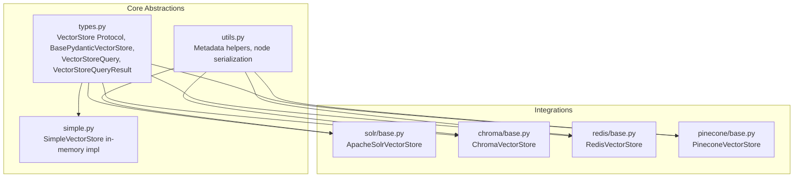
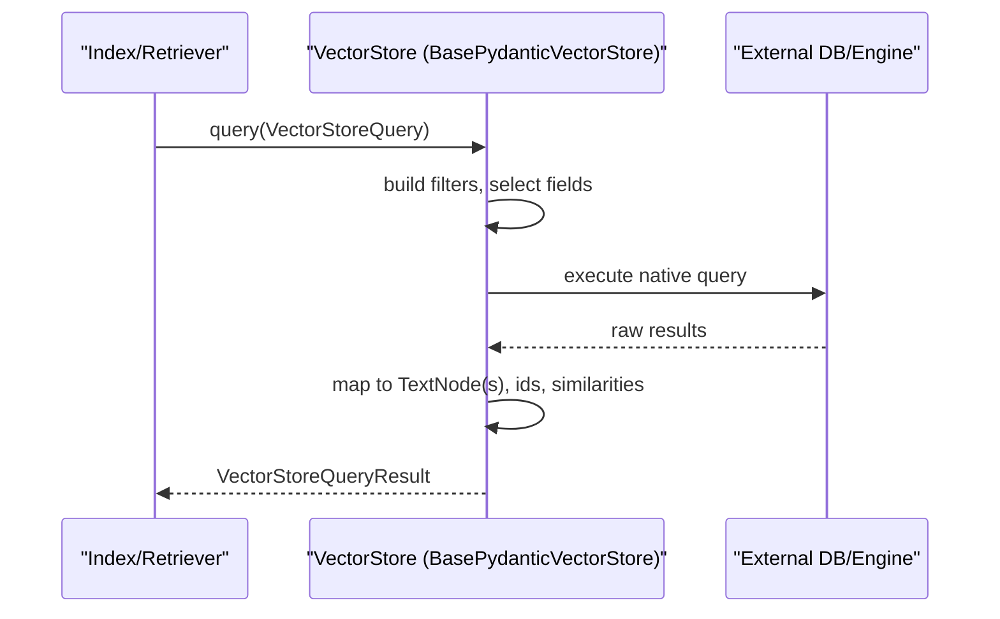
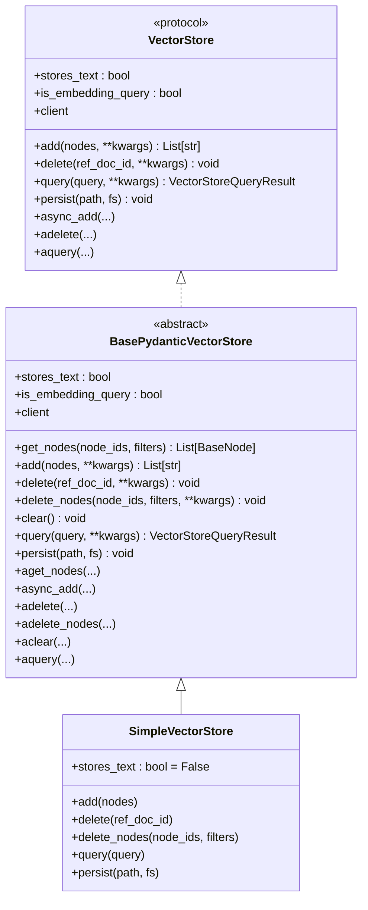
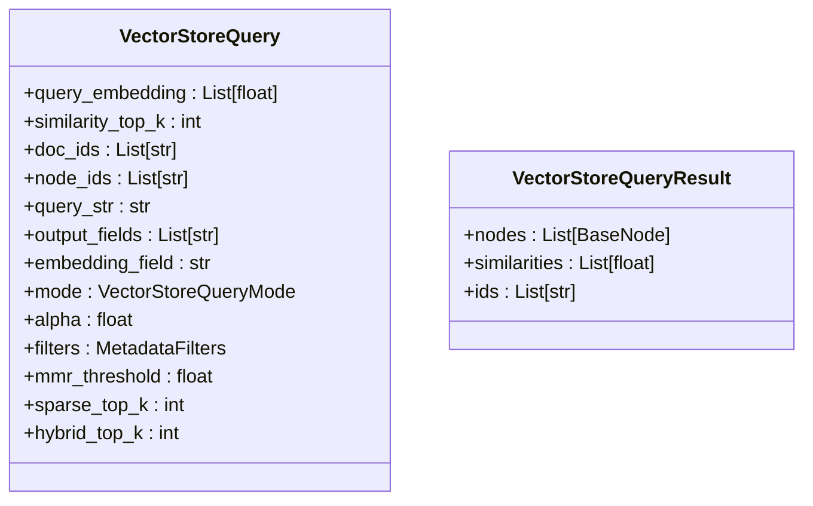
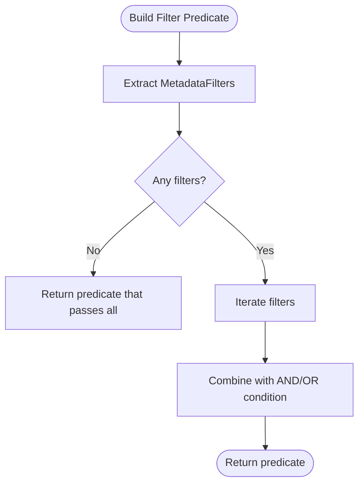
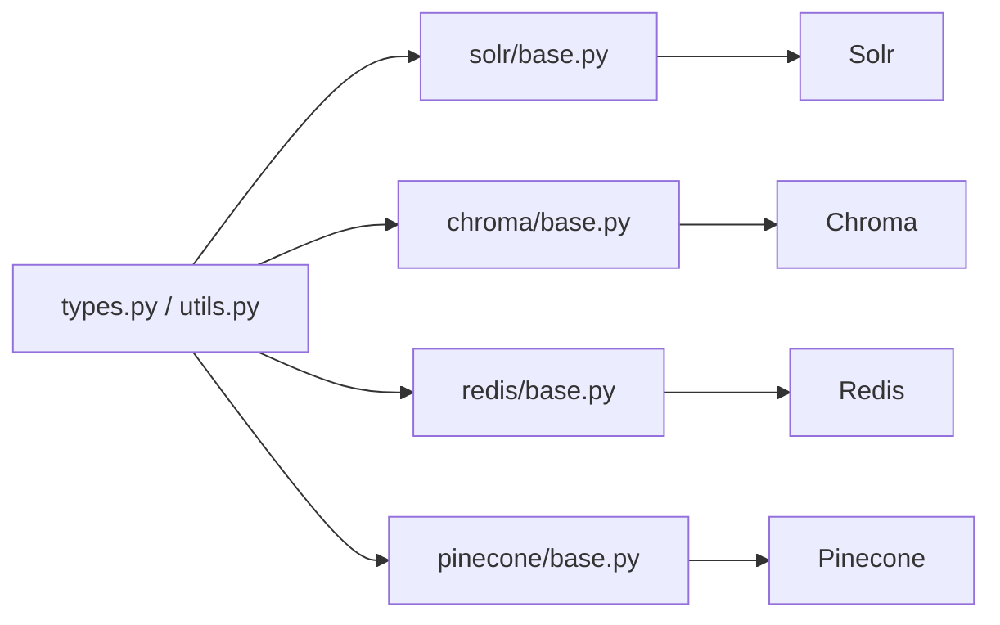

# Custom Vector Store Development

<cite>
**Referenced Files in This Document**
- [types.py](file://llama-index-core/llama_index/core/vector_stores/types.py)
- [simple.py](file://llama-index-core/llama_index/core/vector_stores/simple.py)
- [utils.py](file://llama-index-core/llama_index/core/vector_stores/utils.py)
- [vector_store.ipynb](file://docs/examples/low_level/vector_store.ipynb)
- [solr/base.py](file://llama-index-integrations/vector_stores/llama-index-vector-stores-solr/llama_index/vector_stores/solr/base.py)
- [chroma/base.py](file://llama-index-integrations/vector_stores/llama-index-vector-stores-chroma/llama_index/vector_stores/chroma/base.py)
- [redis/base.py](file://llama-index-integrations/vector_stores/llama-index-vector-stores-redis/llama_index/vector_stores/redis/base.py)
- [pinecone/base.py](file://llama-index-integrations/vector_stores/llama-index-vector-stores-pinecone/llama_index/vector_stores/pinecone/base.py)
</cite>

## Table of Contents
1. [Introduction](#introduction)
2. [Project Structure](#project-structure)
3. [Core Components](#core-components)
4. [Architecture Overview](#architecture-overview)
5. [Detailed Component Analysis](#detailed-component-analysis)
6. [Dependency Analysis](#dependency-analysis)
7. [Performance Considerations](#performance-considerations)
8. [Troubleshooting Guide](#troubleshooting-guide)
9. [Conclusion](#conclusion)
10. [Appendices](#appendices)

## Introduction
This document explains how to develop custom vector store integrations for LlamaIndex. It covers the VectorStore interface and abstract base classes, required methods and data structures, and the end-to-end lifecycle of implementing index creation, data insertion, querying, and deletion. It also provides guidance on handling metadata, vector normalization, similarity calculations, batch operations, testing, benchmarking, and deployment. Practical examples are drawn from real integrations in the repository.

## Project Structure
LlamaIndex’s vector store ecosystem consists of:
- Core abstractions and utilities under the vector_stores module
- Reference implementations (e.g., in-memory SimpleVectorStore)
- Real integrations with external systems (e.g., Solr, Chroma, Redis, Pinecone)

**Diagram sources**
- [types.py](file://llama-index-core/llama_index/core/vector_stores/types.py#L268-L437)
- [utils.py](file://llama-index-core/llama_index/core/vector_stores/utils.py#L1-L235)
- [simple.py](file://llama-index-core/llama_index/core/vector_stores/simple.py#L64-L355)
- [solr/base.py](file://llama-index-integrations/vector_stores/llama-index-vector-stores-solr/llama_index/vector_stores/solr/base.py#L36-L866)
- [chroma/base.py](file://llama-index-integrations/vector_stores/llama-index-vector-stores-chroma/llama_index/vector_stores/chroma/base.py#L120-L709)
- [redis/base.py](file://llama-index-integrations/vector_stores/llama-index-vector-stores-redis/llama_index/vector_stores/redis/base.py#L81-L777)
- [pinecone/base.py](file://llama-index-integrations/vector_stores/llama-index-vector-stores-pinecone/llama_index/vector_stores/pinecone/base.py#L114-L552)

**Section sources**
- [types.py](file://llama-index-core/llama_index/core/vector_stores/types.py#L1-L439)
- [simple.py](file://llama-index-core/llama_index/core/vector_stores/simple.py#L1-L355)
- [utils.py](file://llama-index-core/llama_index/core/vector_stores/utils.py#L1-L235)

## Core Components
- VectorStore Protocol and BasePydanticVectorStore define the contract for all vector stores. Implementations must provide:
  - Properties: stores_text, is_embedding_query, client
  - Methods: add, delete, query, persist (and async variants)
  - Optional: get_nodes, delete_nodes, clear
- VectorStoreQuery and VectorStoreQueryResult encapsulate query intent and results.
- Utilities support metadata handling, node serialization, and filter building.

Key responsibilities:
- Add nodes with embeddings
- Query by vector similarity, text, or hybrid modes
- Apply metadata filters
- Delete by document or node identifiers
- Persist and restore state

**Section sources**
- [types.py](file://llama-index-core/llama_index/core/vector_stores/types.py#L268-L437)
- [simple.py](file://llama-index-core/llama_index/core/vector_stores/simple.py#L64-L355)
- [utils.py](file://llama-index-core/llama_index/core/vector_stores/utils.py#L1-L235)

## Architecture Overview
The vector store layer sits between the indexing/retrieval pipeline and the underlying storage system. Implementations translate LlamaIndex’s query abstractions into native queries and return standardized results.

**Diagram sources**
- [types.py](file://llama-index-core/llama_index/core/vector_stores/types.py#L268-L437)
- [solr/base.py](file://llama-index-integrations/vector_stores/llama-index-vector-stores-solr/llama_index/vector_stores/solr/base.py#L413-L543)
- [chroma/base.py](file://llama-index-integrations/vector_stores/llama-index-vector-stores-chroma/llama_index/vector_stores/chroma/base.py#L120-L709)
- [redis/base.py](file://llama-index-integrations/vector_stores/llama-index-vector-stores-redis/llama_index/vector_stores/redis/base.py#L81-L777)
- [pinecone/base.py](file://llama-index-integrations/vector_stores/llama-index-vector-stores-pinecone/llama_index/vector_stores/pinecone/base.py#L114-L552)

## Detailed Component Analysis

### VectorStore Abstractions
- VectorStore Protocol: defines the minimal interface for vector stores.
- BasePydanticVectorStore: abstract base class with richer APIs, async support, and optional node retrieval/deletion/clear.

**Diagram sources**
- [types.py](file://llama-index-core/llama_index/core/vector_stores/types.py#L268-L437)
- [simple.py](file://llama-index-core/llama_index/core/vector_stores/simple.py#L64-L355)

**Section sources**
- [types.py](file://llama-index-core/llama_index/core/vector_stores/types.py#L268-L437)
- [simple.py](file://llama-index-core/llama_index/core/vector_stores/simple.py#L64-L355)

### VectorStoreQuery and Results
- VectorStoreQuery carries query intent: embedding, text, filters, top-k, mode, and optional fields.
- VectorStoreQueryResult carries nodes, similarities, and ids.

**Diagram sources**
- [types.py](file://llama-index-core/llama_index/core/vector_stores/types.py#L240-L267)
- [types.py](file://llama-index-core/llama_index/core/vector_stores/types.py#L37-L43)

**Section sources**
- [types.py](file://llama-index-core/llama_index/core/vector_stores/types.py#L240-L267)
- [types.py](file://llama-index-core/llama_index/core/vector_stores/types.py#L37-L43)

### Metadata Handling and Filters
- MetadataFilters and MetadataFilter define filter semantics and operators.
- Utility functions build filter predicates and serialize node metadata.

**Diagram sources**
- [utils.py](file://llama-index-core/llama_index/core/vector_stores/utils.py#L101-L175)

**Section sources**
- [utils.py](file://llama-index-core/llama_index/core/vector_stores/utils.py#L101-L175)

### Implementing a Custom Vector Store
Follow this pattern to implement a custom vector store:

- Extend BasePydanticVectorStore and implement required methods:
  - add(nodes): ingest nodes with embeddings; return node ids
  - delete(ref_doc_id): remove by document id
  - delete_nodes(node_ids, filters): remove by node ids and/or filters
  - query(query): execute query and return VectorStoreQueryResult
  - clear(): remove all nodes (optional)
  - persist(path, fs): serialize state (optional)
  - get_nodes(node_ids, filters): fetch nodes (optional)
- Configure stores_text and flat_metadata appropriately.
- Map LlamaIndex query modes to native operations (e.g., DEFAULT to vector similarity, TEXT_SEARCH to BM25).
- Handle metadata filters by translating to native filter syntax.

Reference implementations:
- ApacheSolrVectorStore demonstrates field mapping, query construction, and result processing.
- ChromaVectorStore shows batching, MMR, and metadata translation.
- RedisVectorStore illustrates schema-driven indexing and async support.
- PineconeVectorStore covers sparse/dense hybrid and batch upsert.

**Section sources**
- [solr/base.py](file://llama-index-integrations/vector_stores/llama-index-vector-stores-solr/llama_index/vector_stores/solr/base.py#L36-L866)
- [chroma/base.py](file://llama-index-integrations/vector_stores/llama-index-vector-stores-chroma/llama_index/vector_stores/chroma/base.py#L120-L709)
- [redis/base.py](file://llama-index-integrations/vector_stores/llama-index-vector-stores-redis/llama_index/vector_stores/redis/base.py#L81-L777)
- [pinecone/base.py](file://llama-index-integrations/vector_stores/llama-index-vector-stores-pinecone/llama_index/vector_stores/pinecone/base.py#L114-L552)

### Example: Building a Simple Vector Store from Scratch
The low-level notebook demonstrates:
- Defining a minimal BasePydanticVectorStore subclass
- Implementing add/get/delete
- Implementing query with semantic search and metadata filtering
- Returning VectorStoreQueryResult

This is a great starting point for custom implementations.

**Section sources**
- [vector_store.ipynb](file://docs/examples/low_level/vector_store.ipynb#L1-L916)

## Dependency Analysis
Vector store implementations depend on:
- Core abstractions (types.py)
- Node and metadata utilities (utils.py)
- External libraries (e.g., redisvl, chromadb, pinecone, solr clients)

**Diagram sources**
- [types.py](file://llama-index-core/llama_index/core/vector_stores/types.py#L1-L439)
- [utils.py](file://llama-index-core/llama_index/core/vector_stores/utils.py#L1-L235)
- [solr/base.py](file://llama-index-integrations/vector_stores/llama-index-vector-stores-solr/llama_index/vector_stores/solr/base.py#L1-L868)
- [chroma/base.py](file://llama-index-integrations/vector_stores/llama-index-vector-stores-chroma/llama_index/vector_stores/chroma/base.py#L1-L709)
- [redis/base.py](file://llama-index-integrations/vector_stores/llama-index-vector-stores-redis/llama_index/vector_stores/redis/base.py#L1-L777)
- [pinecone/base.py](file://llama-index-integrations/vector_stores/llama-index-vector-stores-pinecone/llama_index/vector_stores/pinecone/base.py#L1-L552)

**Section sources**
- [types.py](file://llama-index-core/llama_index/core/vector_stores/types.py#L1-L439)
- [utils.py](file://llama-index-core/llama_index/core/vector_stores/utils.py#L1-L235)

## Performance Considerations
- Prefer native vector similarity (e.g., KNN) and text search (e.g., BM25) provided by the backend.
- Use batch operations for insertions and deletions where supported.
- Optimize metadata filters by pushing them to the backend when possible.
- Normalize vectors if required by the backend (e.g., cosine vs. dot product).
- Tune top-k and alpha parameters for hybrid search.
- Use async APIs for high-throughput scenarios.

[No sources needed since this section provides general guidance]

## Troubleshooting Guide
Common issues and resolutions:
- Missing embedding field: Ensure embedding_field is configured or provided in the query.
- Metadata filtering errors: Verify supported operators and field names.
- Empty results: Confirm query embedding is not None for vector search.
- Persistence failures: Check persist path permissions and fs compatibility.

**Section sources**
- [solr/base.py](file://llama-index-integrations/vector_stores/llama-index-vector-stores-solr/llama_index/vector_stores/solr/base.py#L179-L218)
- [utils.py](file://llama-index-core/llama_index/core/vector_stores/utils.py#L101-L175)

## Conclusion
By adhering to the BasePydanticVectorStore contract and leveraging the provided abstractions and utilities, you can implement custom vector stores that integrate seamlessly with LlamaIndex. Use real integrations as templates, handle metadata and similarity carefully, and optimize for your backend’s strengths.

[No sources needed since this section summarizes without analyzing specific files]

## Appendices

### Practical Implementation Checklist
- Define stores_text and flat_metadata flags
- Implement add, delete, query, and persist
- Translate VectorStoreQuery to native operations
- Support async variants where feasible
- Handle metadata filters and node retrieval
- Batch operations for throughput
- Testing and benchmarking against reference stores

### Testing and Benchmarking Guidance
- Unit tests for add/query/delete with synthetic nodes
- Integration tests against a local backend instance
- Benchmark top-k retrieval latency and throughput
- Compare similarity metrics across backends
- Validate metadata filtering correctness

### Deployment and Contribution Tips
- Package as a separate distribution with clear dependencies
- Provide README with setup, configuration, and usage examples
- Follow repository contribution guidelines and code style
- Include tests and benchmarks
- Document supported query modes and filters

[No sources needed since this section provides general guidance]