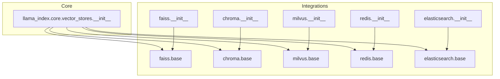
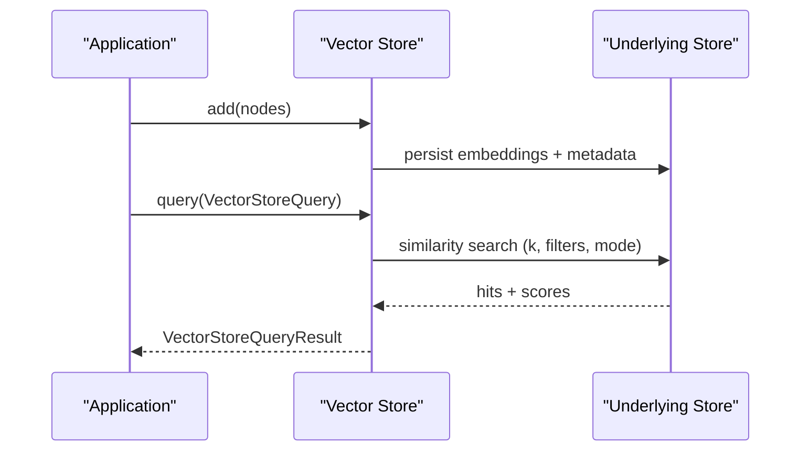
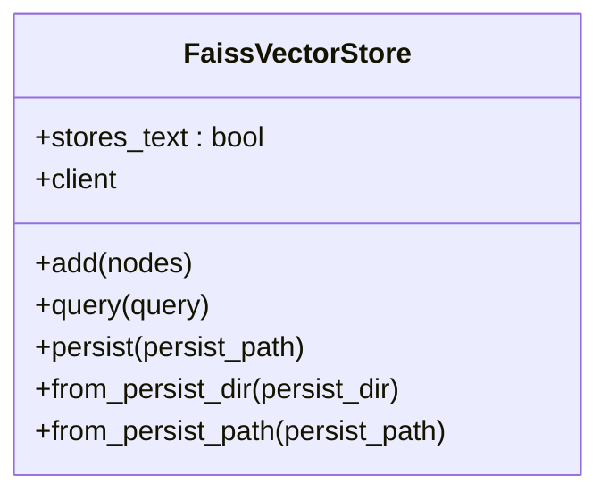
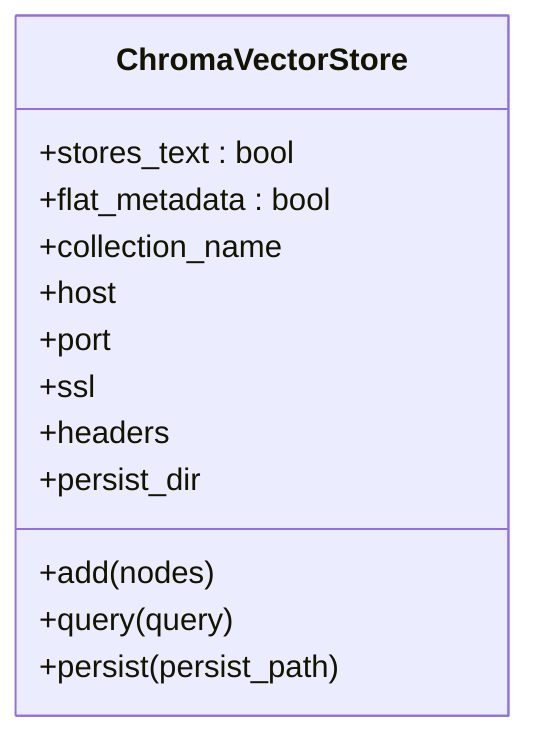
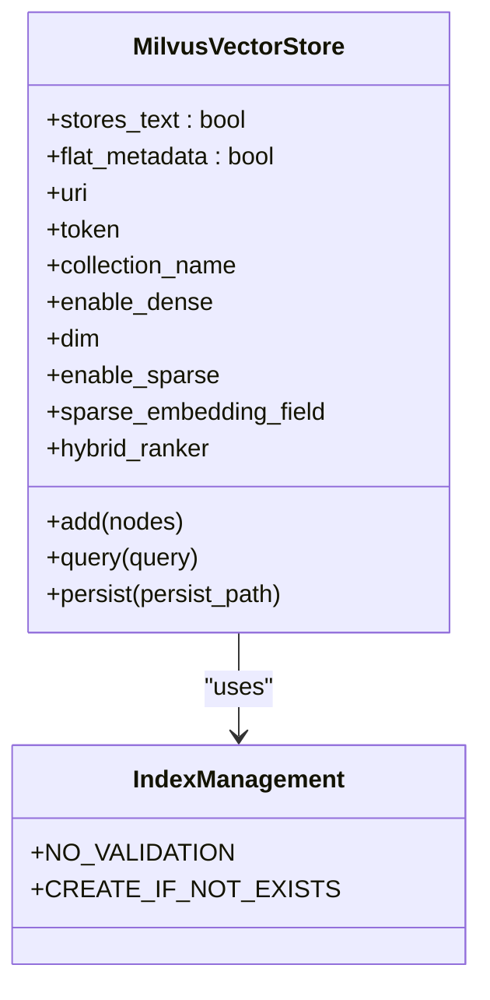
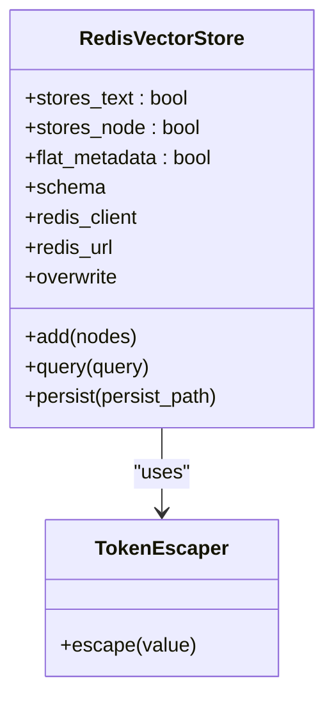
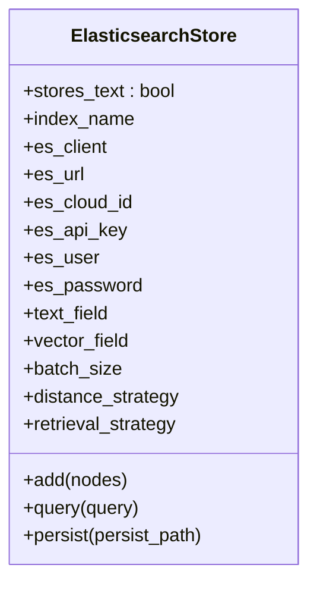
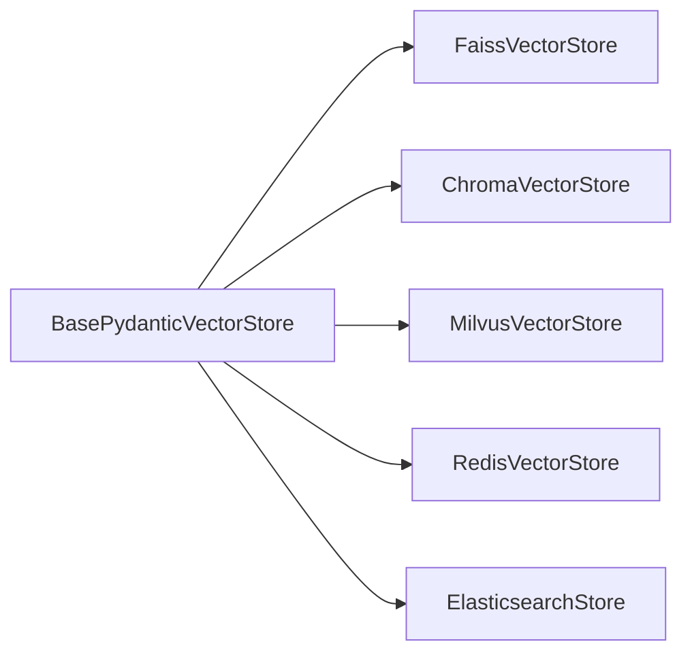

# Self-Hosted Vector Stores

<cite>
**Referenced Files in This Document**
- [faiss/base.py](file://llama-index-integrations/vector_stores/llama-index-vector-stores-faiss/llama_index/vector_stores/faiss/base.py)
- [faiss/__init__.py](file://llama-index-integrations/vector_stores/llama-index-vector-stores-faiss/llama_index/vector_stores/faiss/__init__.py)
- [chroma/base.py](file://llama-index-integrations/vector_stores/llama-index-vector-stores-chroma/llama_index/vector_stores/chroma/base.py)
- [chroma/__init__.py](file://llama-index-integrations/vector_stores/llama-index-vector-stores-chroma/llama_index/vector_stores/chroma/__init__.py)
- [milvus/base.py](file://llama-index-integrations/vector_stores/llama-index-vector-stores-milvus/llama_index/vector_stores/milvus/base.py)
- [milvus/__init__.py](file://llama-index-integrations/vector_stores/llama-index-vector-stores-milvus/llama_index/vector_stores/milvus/__init__.py)
- [redis/base.py](file://llama-index-integrations/vector_stores/llama-index-vector-stores-redis/llama_index/vector_stores/redis/base.py)
- [redis/__init__.py](file://llama-index-integrations/vector_stores/llama-index-vector-stores-redis/llama_index/vector_stores/redis/__init__.py)
- [elasticsearch/base.py](file://llama-index-integrations/vector_stores/llama-index-vector-stores-elasticsearch/llama_index/vector_stores/elasticsearch/base.py)
- [elasticsearch/__init__.py](file://llama-index-integrations/vector_stores/llama-index-vector-stores-elasticsearch/llama_index/vector_stores/elasticsearch/__init__.py)
- [core vector_stores __init__.py](file://llama-index-core/llama_index/core/vector_stores/__init__.py)
</cite>

## Table of Contents
1. [Introduction](#introduction)
2. [Project Structure](#project-structure)
3. [Core Components](#core-components)
4. [Architecture Overview](#architecture-overview)
5. [Detailed Component Analysis](#detailed-component-analysis)
6. [Dependency Analysis](#dependency-analysis)
7. [Performance Considerations](#performance-considerations)
8. [Troubleshooting Guide](#troubleshooting-guide)
9. [Conclusion](#conclusion)
10. [Appendices](#appendices)

## Introduction
This document provides a comprehensive guide to deploying and operating self-hosted vector stores with LlamaIndex. It focuses on five popular solutions: FAISS, Chroma, Milvus, Redis, and Elasticsearch. For each, we explain deployment architectures, hardware considerations, installation and configuration, performance tuning, index creation and ingestion, query optimization, backup/recovery, monitoring, maintenance, capacity planning, scaling, troubleshooting, and security.

## Project Structure
LlamaIndex organizes vector store integrations as separate packages under the integrations tree. Each provider exposes a dedicated module implementing the BasePydanticVectorStore interface. Core abstractions live in the core vector_stores package.

**Diagram sources**
- [core vector_stores __init__.py](file://llama-index-core/llama_index/core/vector_stores/__init__.py#L1-L28)
- [faiss/base.py](file://llama-index-integrations/vector_stores/llama-index-vector-stores-faiss/llama_index/vector_stores/faiss/base.py#L33-L83)
- [chroma/base.py](file://llama-index-integrations/vector_stores/llama-index-vector-stores-chroma/llama_index/vector_stores/chroma/base.py#L120-L200)
- [milvus/base.py](file://llama-index-integrations/vector_stores/llama-index-vector-stores-milvus/llama_index/vector_stores/milvus/base.py#L119-L200)
- [redis/base.py](file://llama-index-integrations/vector_stores/llama-index-vector-stores-redis/llama_index/vector_stores/redis/base.py#L81-L152)
- [elasticsearch/base.py](file://llama-index-integrations/vector_stores/llama-index-vector-stores-elasticsearch/llama_index/vector_stores/elasticsearch/base.py#L124-L200)

**Section sources**
- [core vector_stores __init__.py](file://llama-index-core/llama_index/core/vector_stores/__init__.py#L1-L28)

## Core Components
- BasePydanticVectorStore: The foundational interface implemented by all vector stores. It defines query, add, persist, and related capabilities via typed query/result structures and metadata filtering primitives.
- Provider-specific stores:
  - FAISS: Embeddings persisted in FAISS index files; designed for CPU-based similarity search.
  - Chroma: Embeddings stored in Chroma collections; supports MMR and metadata filtering.
  - Milvus: Rich schema and hybrid (dense/sparse) search; supports advanced index management and rankers.
  - Redis: Full-text, vector, and metadata search via RedisVL; supports custom schemas and filters.
  - Elasticsearch: Dense, sparse, BM25, and hybrid retrieval strategies; integrates with AsyncVectorStore.

Key abstractions and types are exported from the core vector_stores package.

**Section sources**
- [core vector_stores __init__.py](file://llama-index-core/llama_index/core/vector_stores/__init__.py#L4-L27)

## Architecture Overview
The runtime architecture is consistent across providers: applications construct a vector store instance, ingest nodes with embeddings, and query for nearest neighbors. Providers differ in persistence model, indexing strategy, and query-time features.

[No sources needed since this diagram shows conceptual workflow, not actual code structure]

## Detailed Component Analysis

### FAISS
FAISS is a CPU-optimized library for similarity search. The FAISS vector store wraps a FAISS index and persists it to disk.

- Persistence and loading:
  - Persist to a local path; loading reads the FAISS index file.
  - Local filesystem only; remote filesystems are not supported.
- Query behavior:
  - Accepts query embeddings; returns top-k matches.
  - Metadata filters are not implemented.
- Typical usage:
  - Construct a FAISS index (e.g., L2), wrap with FaissVectorStore, persist, and reuse.

**Diagram sources**
- [faiss/base.py](file://llama-index-integrations/vector_stores/llama-index-vector-stores-faiss/llama_index/vector_stores/faiss/base.py#L33-L83)

**Section sources**
- [faiss/base.py](file://llama-index-integrations/vector_stores/llama-index-vector-stores-faiss/llama_index/vector_stores/faiss/base.py#L84-L118)
- [faiss/base.py](file://llama-index-integrations/vector_stores/llama-index-vector-stores-faiss/llama_index/vector_stores/faiss/base.py#L119-L141)
- [faiss/base.py](file://llama-index-integrations/vector_stores/llama-index-vector-stores-faiss/llama_index/vector_stores/faiss/base.py#L173-L182)
- [faiss/base.py](file://llama-index-integrations/vector_stores/llama-index-vector-stores-faiss/llama_index/vector_stores/faiss/base.py#L183-L200)
- [faiss/__init__.py](file://llama-index-integrations/vector_stores/llama-index-vector-stores-faiss/llama_index/vector_stores/faiss/__init__.py#L1-L5)

### Chroma
Chroma is a lightweight vector database with optional persistence and HTTP client support. It supports MMR and robust metadata filtering.

- Features:
  - Stores text and metadata; supports MMR for diversity.
  - Converts standard filters to Chroma-specific operators and conditions.
  - Chunked insertions to respect Chroma limits.
- Query:
  - Uses Chroma client to retrieve top-k; supports MMR mode and thresholds.

**Diagram sources**
- [chroma/base.py](file://llama-index-integrations/vector_stores/llama-index-vector-stores-chroma/llama_index/vector_stores/chroma/base.py#L120-L200)

**Section sources**
- [chroma/base.py](file://llama-index-integrations/vector_stores/llama-index-vector-stores-chroma/llama_index/vector_stores/chroma/base.py#L64-L95)
- [chroma/base.py](file://llama-index-integrations/vector_stores/llama-index-vector-stores-chroma/llama_index/vector_stores/chroma/base.py#L102-L118)
- [chroma/base.py](file://llama-index-integrations/vector_stores/llama-index-vector-stores-chroma/llama_index/vector_stores/chroma/base.py#L172-L200)
- [chroma/__init__.py](file://llama-index-integrations/vector_stores/llama-index-vector-stores-chroma/llama_index/vector_stores/chroma/__init__.py#L1-L4)

### Milvus
Milvus offers advanced schema, dense/sparse embeddings, hybrid search, and configurable index management.

- Capabilities:
  - Dense and/or sparse embedding support; configurable metrics (IP/COSINE/L2).
  - Hybrid search with rankers (RRFRanker, WeightedRanker).
  - Index management modes and batched inserts.
  - Rich metadata filtering translation to Milvus expressions.
- Query:
  - Supports MMR and hybrid modes; translates filters and rankers.

**Diagram sources**
- [milvus/base.py](file://llama-index-integrations/vector_stores/llama-index-vector-stores-milvus/llama_index/vector_stores/milvus/base.py#L119-L200)
- [milvus/base.py](file://llama-index-integrations/vector_stores/llama-index-vector-stores-milvus/llama_index/vector_stores/milvus/base.py#L67-L73)

**Section sources**
- [milvus/base.py](file://llama-index-integrations/vector_stores/llama-index-vector-stores-milvus/llama_index/vector_stores/milvus/base.py#L74-L100)
- [milvus/base.py](file://llama-index-integrations/vector_stores/llama-index-vector-stores-milvus/llama_index/vector_stores/milvus/base.py#L102-L117)
- [milvus/base.py](file://llama-index-integrations/vector_stores/llama-index-vector-stores-milvus/llama_index/vector_stores/milvus/base.py#L119-L200)
- [milvus/__init__.py](file://llama-index-integrations/vector_stores/llama-index-vector-stores-milvus/llama_index/vector_stores/milvus/__init__.py#L1-L4)

### Redis
Redis-backed vector store leverages RedisVL for schema, indexing, and querying. It supports custom schemas and rich metadata filters.

- Schema and indexing:
  - Optional custom IndexSchema; default schema includes required fields.
  - Supports vector field configuration and index algorithms.
- Query:
  - Uses RedisVL SearchIndex and Filter/Vector queries; supports tag/text filters and vector similarity.

**Diagram sources**
- [redis/base.py](file://llama-index-integrations/vector_stores/llama-index-vector-stores-redis/llama_index/vector_stores/redis/base.py#L81-L152)
- [redis/base.py](file://llama-index-integrations/vector_stores/llama-index-vector-stores-redis/llama_index/vector_stores/redis/base.py#L58-L79)

**Section sources**
- [redis/base.py](file://llama-index-integrations/vector_stores/llama-index-vector-stores-redis/llama_index/vector_stores/redis/base.py#L153-L200)
- [redis/base.py](file://llama-index-integrations/vector_stores/llama-index-vector-stores-redis/llama_index/vector_stores/redis/base.py#L81-L152)
- [redis/__init__.py](file://llama-index-integrations/vector_stores/llama-index-vector-stores-redis/llama_index/vector_stores/redis/__init__.py#L1-L4)

### Elasticsearch
Elasticsearch vector store integrates with AsyncVectorStore and supports multiple retrieval strategies.

- Strategies:
  - Dense vector, sparse vector, BM25, and hybrid retrieval.
  - Distance metrics and compatibility checks per mode.
- Query:
  - Translates standard filters to Elasticsearch term/bool filters.
  - Normalizes similarity scores and validates strategy-mode compatibility.

**Diagram sources**
- [elasticsearch/base.py](file://llama-index-integrations/vector_stores/llama-index-vector-stores-elasticsearch/llama_index/vector_stores/elasticsearch/base.py#L124-L200)

**Section sources**
- [elasticsearch/base.py](file://llama-index-integrations/vector_stores/llama-index-vector-stores-elasticsearch/llama_index/vector_stores/elasticsearch/base.py#L44-L89)
- [elasticsearch/base.py](file://llama-index-integrations/vector_stores/llama-index-vector-stores-elasticsearch/llama_index/vector_stores/elasticsearch/base.py#L91-L122)
- [elasticsearch/base.py](file://llama-index-integrations/vector_stores/llama-index-vector-stores-elasticsearch/llama_index/vector_stores/elasticsearch/base.py#L124-L200)
- [elasticsearch/__init__.py](file://llama-index-integrations/vector_stores/llama-index-vector-stores-elasticsearch/llama_index/vector_stores/elasticsearch/__init__.py#L1-L17)

## Dependency Analysis
All provider stores inherit from BasePydanticVectorStore and rely on the core vector store types for query semantics and metadata filtering. Each provider adds its own persistence and retrieval logic.

**Diagram sources**
- [core vector_stores __init__.py](file://llama-index-core/llama_index/core/vector_stores/__init__.py#L4-L27)
- [faiss/base.py](file://llama-index-integrations/vector_stores/llama-index-vector-stores-faiss/llama_index/vector_stores/faiss/base.py#L33-L83)
- [chroma/base.py](file://llama-index-integrations/vector_stores/llama-index-vector-stores-chroma/llama_index/vector_stores/chroma/base.py#L120-L200)
- [milvus/base.py](file://llama-index-integrations/vector_stores/llama-index-vector-stores-milvus/llama_index/vector_stores/milvus/base.py#L119-L200)
- [redis/base.py](file://llama-index-integrations/vector_stores/llama-index-vector-stores-redis/llama_index/vector_stores/redis/base.py#L81-L152)
- [elasticsearch/base.py](file://llama-index-integrations/vector_stores/llama-index-vector-stores-elasticsearch/llama_index/vector_stores/elasticsearch/base.py#L124-L200)

**Section sources**
- [core vector_stores __init__.py](file://llama-index-core/llama_index/core/vector_stores/__init__.py#L4-L27)

## Performance Considerations
- FAISS
  - Choose appropriate index types (e.g., Flat vs. IVF/PQ) based on dataset size and latency targets.
  - Persist to local SSD/NVMe for faster load/save.
  - Avoid metadata filters; pre-filter documents before ingestion.
- Chroma
  - Tune chunk sizes to respect internal limits; use batched inserts.
  - Enable MMR for diverse results when quality matters more than speed.
- Milvus
  - Select similarity metric aligned with embedding normalization.
  - Configure hybrid ranker parameters (RRF k or weighted components) for balanced recall/precision.
  - Use batched inserts and tune index parameters for large-scale datasets.
- Redis
  - Define efficient vector index algorithms and dimensions in schema.
  - Use tag/text filters judiciously; avoid overly broad queries.
- Elasticsearch
  - Align retrieval strategy with indexing choices; ensure mode-strategy compatibility.
  - Use appropriate distance metrics and tune batch sizes for bulk indexing.

[No sources needed since this section provides general guidance]

## Troubleshooting Guide
- FAISS
  - Import errors indicate missing FAISS package; install the required bindings.
  - Local-only persistence; remote filesystems are unsupported.
  - Metadata filters not implemented; remove filters or switch providers.
- Chroma
  - Missing chromadb dependency blocks initialization; install the client.
  - Excessive metadata or oversized payloads may trigger chunking; adjust chunk sizes.
- Milvus
  - Missing pymilvus indicates missing client; install the driver.
  - Index creation/validation failures often relate to schema mismatches; verify field names/types.
- Redis
  - RedisVL requires Redis with search and JSON modules enabled; confirm server configuration.
  - Connection timeouts or invalid schema lead to initialization errors; validate URL and schema.
- Elasticsearch
  - Client connectivity issues arise from incorrect credentials or URLs; verify cloud ID/API key or user/password.
  - Mode-strategy mismatch raises explicit errors; align query mode with configured retrieval strategy.

**Section sources**
- [faiss/base.py](file://llama-index-integrations/vector_stores/llama-index-vector-stores-faiss/llama_index/vector_stores/faiss/base.py#L70-L79)
- [faiss/base.py](file://llama-index-integrations/vector_stores/llama-index-vector-stores-faiss/llama_index/vector_stores/faiss/base.py#L94-L97)
- [faiss/base.py](file://llama-index-integrations/vector_stores/llama-index-vector-stores-faiss/llama_index/vector_stores/faiss/base.py#L196-L198)
- [chroma/base.py](file://llama-index-integrations/vector_stores/llama-index-vector-stores-chroma/llama_index/vector_stores/chroma/base.py#L97-L97)
- [milvus/base.py](file://llama-index-integrations/vector_stores/llama-index-vector-stores-milvus/llama_index/vector_stores/milvus/base.py#L196-L199)
- [redis/base.py](file://llama-index-integrations/vector_stores/llama-index-vector-stores-redis/llama_index/vector_stores/redis/base.py#L106-L110)
- [elasticsearch/base.py](file://llama-index-integrations/vector_stores/llama-index-vector-stores-elasticsearch/llama_index/vector_stores/elasticsearch/base.py#L146-L149)
- [elasticsearch/base.py](file://llama-index-integrations/vector_stores/llama-index-vector-stores-elasticsearch/llama_index/vector_stores/elasticsearch/base.py#L114-L118)

## Conclusion
Each vector store offers distinct strengths: FAISS for CPU-centric performance, Chroma for simplicity and MMR, Milvus for advanced hybrid search and schema control, Redis for integrated caching and filtering, and Elasticsearch for enterprise search and hybrid strategies. Select the provider based on workload characteristics, scale, and operational constraints, and apply the tuning and operational guidance herein for reliable deployments.

[No sources needed since this section summarizes without analyzing specific files]

## Appendices

### Deployment Architectures and Infrastructure Considerations
- FAISS
  - Deployment: Bare metal or containerized with persistent local volumes.
  - Hardware: Prefer NVMe/SATA SSD for index persistence; CPU-bound workloads.
  - Networking: Local-only persistence; no network mounts.
- Chroma
  - Deployment: Docker/Kubernetes with persistent volumes; optional HTTP client for remote access.
  - Hardware: Balanced CPU/RAM; storage IOPS for frequent writes.
  - Networking: Use secure client connections; consider reverse proxies.
- Milvus
  - Deployment: Kubernetes with stateful sets; external etcd/MinIO recommended for production.
  - Hardware: Sufficient RAM for loaded segments; fast disks for index files.
  - Networking: Secure RBAC/TLS; expose only necessary ports.
- Redis
  - Deployment: Redis Stack with search and JSON; containerized with persistent volumes.
  - Hardware: Sufficient RAM for dataset plus search indexes; CPU for indexing.
  - Networking: TLS-enabled instances; restrict access via firewalls.
- Elasticsearch
  - Deployment: Self-managed cluster or cloud with security enabled; persistent data volumes.
  - Hardware: CPU/RAM for indexing and search; fast disks for translog and Lucene segments.
  - Networking: API keys/TLS; restrict administrative endpoints.

[No sources needed since this section provides general guidance]

### Installation and Configuration
- FAISS
  - Install FAISS bindings; initialize with a FAISS index; persist/load via local paths.
- Chroma
  - Install chromadb; configure ephemeral or persistent mode; set collection options.
- Milvus
  - Install pymilvus; configure URI/token; define collection schema and index parameters.
- Redis
  - Install Redis Stack; configure RedisVL schema; connect via URL or client.
- Elasticsearch
  - Install Elasticsearch; configure AsyncVectorStore; select retrieval strategy and distance metric.

[No sources needed since this section provides general guidance]

### Index Creation, Ingestion Pipelines, and Query Optimization
- Index Creation
  - FAISS: Build FAISS index with desired metric and algorithm; wrap in store.
  - Chroma: Create collection with schema; configure metadata fields.
  - Milvus: Define collection schema with dense/sparse fields; create index.
  - Redis: Define IndexSchema with vector field and filters; create index.
  - Elasticsearch: Configure index mapping for text and vector fields; choose strategy.
- Ingestion
  - Use batched add operations; respect provider limits (e.g., chunk sizes).
  - FAISS: Local persistence; ensure write permissions.
  - Milvus/Redis/Elasticsearch: Tune batch sizes and consistency levels.
- Query Optimization
  - FAISS: Avoid metadata filters; leverage top-k tuning.
  - Chroma: Use MMR for diversity; optimize chunk sizes.
  - Milvus: Adjust hybrid ranker parameters; choose similarity metric.
  - Redis: Narrow filters; limit returned fields.
  - Elasticsearch: Align mode with strategy; normalize scores if needed.

[No sources needed since this section provides general guidance]

### Backup and Recovery
- FAISS
  - Back up persisted index files; restore by loading at startup.
- Chroma
  - Back up collection data directory; restore by pointing to persisted path.
- Milvus
  - Back up collection snapshots or WAL; restore via Milvus client.
- Redis
  - Back up RDB/AOF; restore Redis instance; recreate schema and re-ingest if needed.
- Elasticsearch
  - Use snapshot repositories; restore indices after failure.

[No sources needed since this section provides general guidance]

### Monitoring and Maintenance
- FAISS: Track index file sizes and load times; monitor disk I/O.
- Chroma: Monitor collection sizes and query latencies; watch chunking behavior.
- Milvus: Observe segment sizes, index progress, and query latency; manage compaction.
- Redis: Monitor memory usage, hit rates, and query latency; watch schema updates.
- Elasticsearch: Track shard health, refresh and merge rates; monitor index sizes.

[No sources needed since this section provides general guidance]

### Capacity Planning and Scaling
- FAISS: Scale out by sharding datasets across nodes; maintain separate indexes per tenant.
- Chroma: Scale horizontally with multiple instances and shared storage; tune chunk sizes.
- Milvus: Scale out via distributed Milvus; use partitioning and sharding; manage replicas.
- Redis: Scale out with Redis Cluster; ensure adequate memory per node.
- Elasticsearch: Scale out with data tiers; use dedicated coordinating nodes; monitor resource utilization.

[No sources needed since this section provides general guidance]

### Security Considerations
- Network Isolation
  - Place vector stores in private subnets; restrict ingress/egress.
- Authentication and Authorization
  - Enable RBAC/TLS for Milvus and Redis; use API keys for Elasticsearch; secure Chroma HTTP endpoints.
- Data Protection
  - Encrypt at rest (disk, snapshots); encrypt in transit (TLS).
  - Limit metadata exposure; sanitize sensitive fields.

[No sources needed since this section provides general guidance]