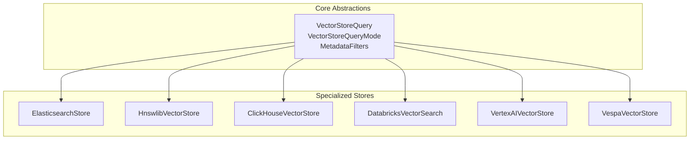
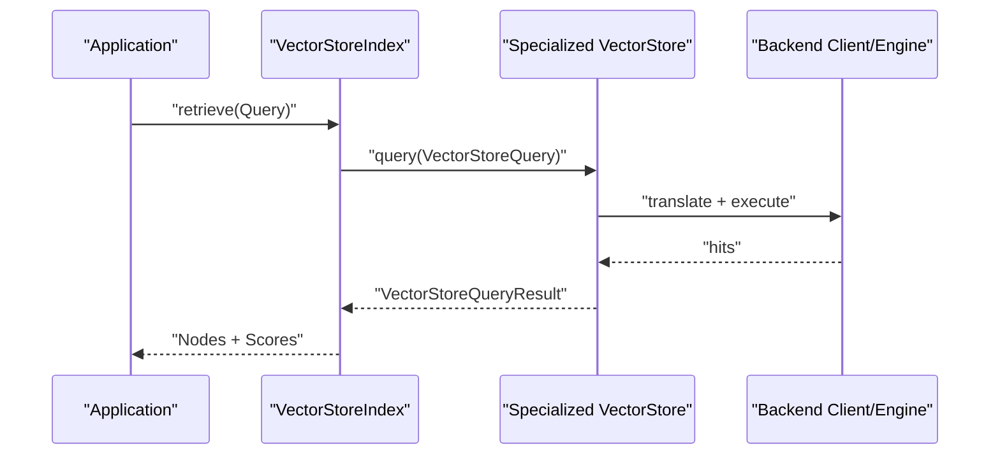
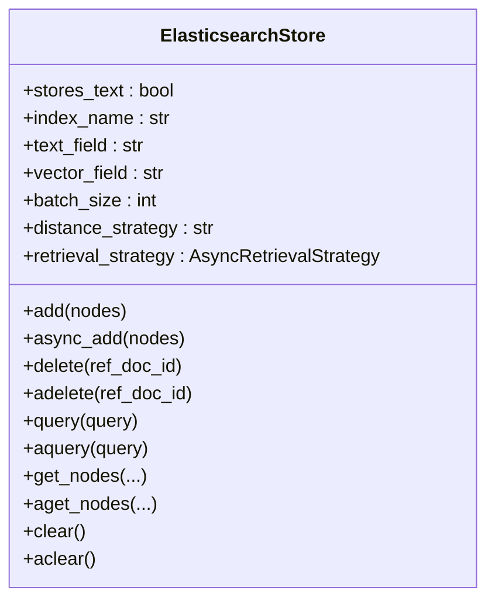
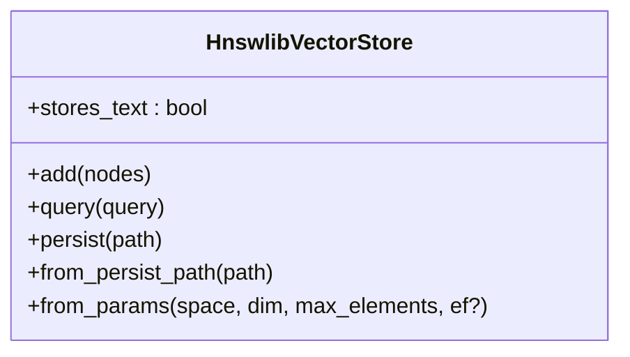
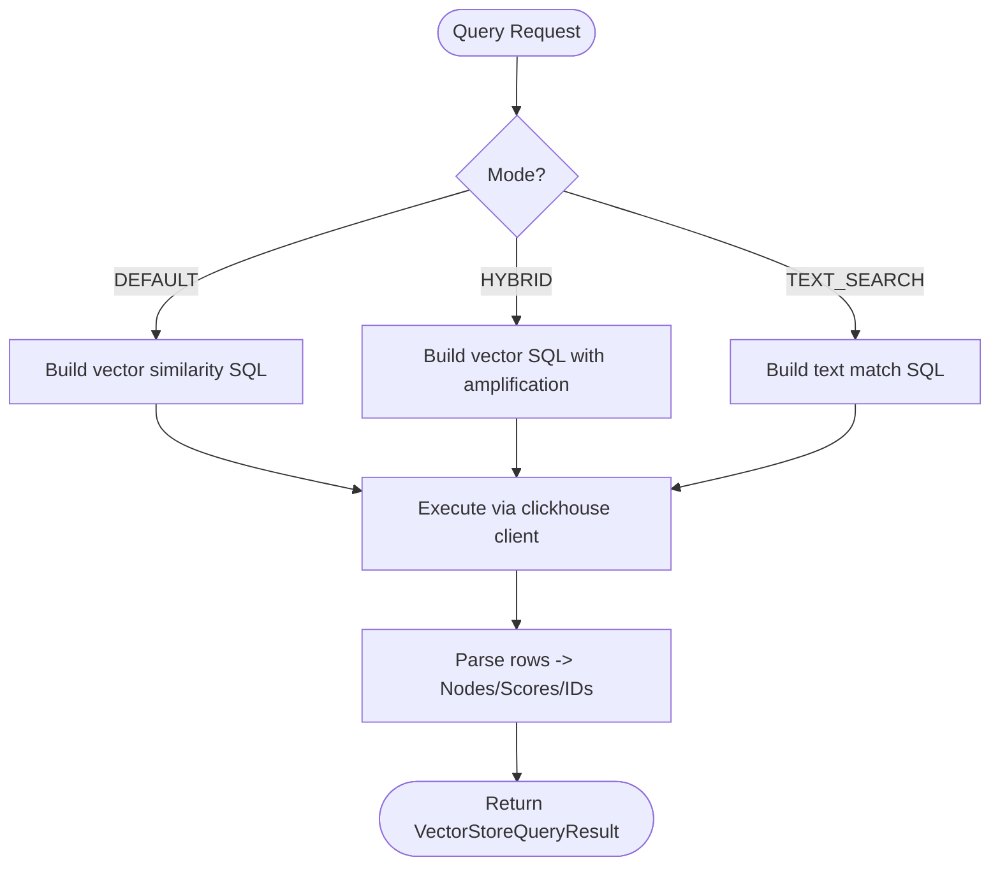
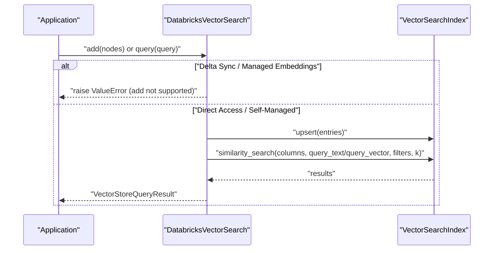
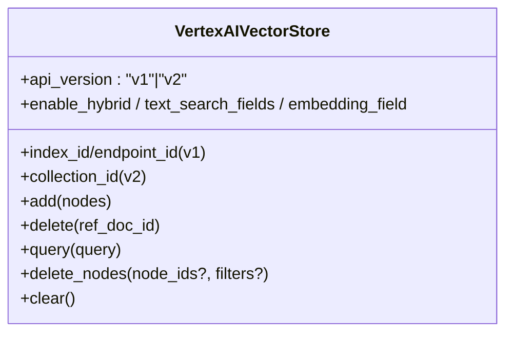
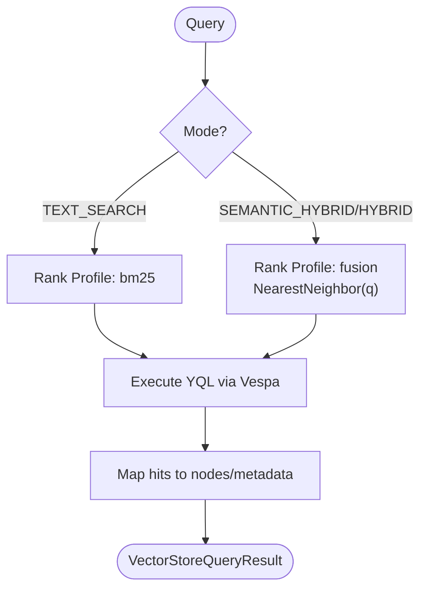
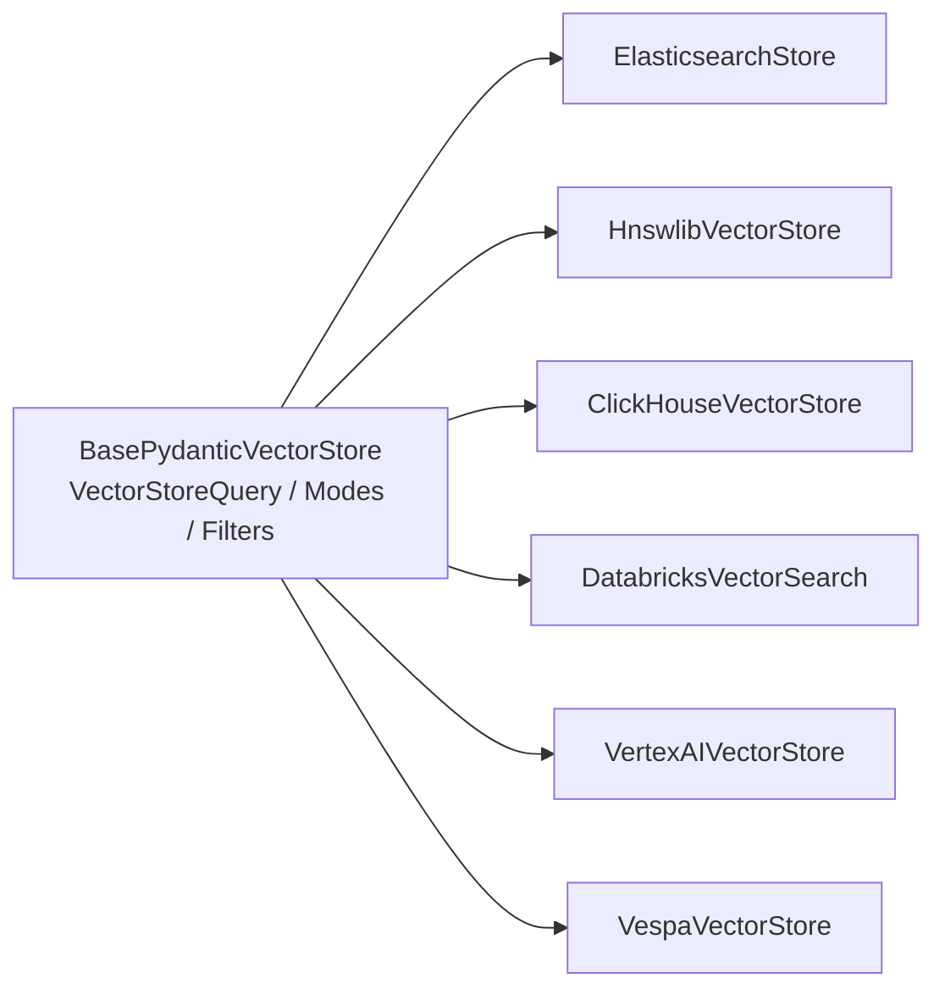

# Specialized Vector Stores

<cite>
**Referenced Files in This Document**
- [base.py](file://llama-index-integrations/vector_stores/llama-index-vector-stores-elasticsearch/llama_index/vector_stores/elasticsearch/base.py)
- [base.py](file://llama-index-integrations/vector_stores/llama-index-vector-stores-hnswlib/llama_index/vector_stores/hnswlib/base.py)
- [base.py](file://llama-index-integrations/vector_stores/llama-index-vector-stores-clickhouse/llama_index/vector_stores/clickhouse/base.py)
- [base.py](file://llama-index-integrations/vector_stores/llama-index-vector-stores-databricks/llama_index/vector_stores/databricks/base.py)
- [base.py](file://llama-index-integrations/vector_stores/llama-index-vector-stores-vertexaivectorsearch/llama_index/vector_stores/vertexaivectorsearch/base.py)
- [base.py](file://llama-index-integrations/vector_stores/llama-index-vector-stores-vespa/llama_index/vector_stores/vespa/base.py)
- [types.py](file://llama-index-core/llama_index/core/vector_stores/types.py)
- [vector_stores.md](file://docs/src/content/docs/framework/module_guides/storing/vector_stores.md)
</cite>

## Table of Contents
1. [Introduction](#introduction)
2. [Project Structure](#project-structure)
3. [Core Components](#core-components)
4. [Architecture Overview](#architecture-overview)
5. [Detailed Component Analysis](#detailed-component-analysis)
6. [Dependency Analysis](#dependency-analysis)
7. [Performance Considerations](#performance-considerations)
8. [Troubleshooting Guide](#troubleshooting-guide)
9. [Conclusion](#conclusion)
10. [Appendices](#appendices)

## Introduction
This document explains specialized vector store integrations in LlamaIndex and how to use them effectively. It focuses on Elasticsearch, HNSWLib, ClickHouse, Databricks Vector Search, and other specialized databases. For each, we describe use cases, configuration, indexing strategies, query optimization, and operational trade-offs. Practical integration steps are provided, along with guidance on choosing specialized stores versus general-purpose alternatives and migration strategies.

## Project Structure
The specialized vector stores are implemented as separate packages under the vector_stores directory. Each package implements a BasePydanticVectorStore subclass and exposes a public constructor/class for integration with LlamaIndex’s VectorStoreIndex and retrievers. The core vector store abstractions live in the core package, while feature matrices and examples are documented in the docs.

**Diagram sources**
- [types.py](file://llama-index-core/llama_index/core/vector_stores/types.py#L240-L439)
- [base.py](file://llama-index-integrations/vector_stores/llama-index-vector-stores-elasticsearch/llama_index/vector_stores/elasticsearch/base.py#L124-L645)
- [base.py](file://llama-index-integrations/vector_stores/llama-index-vector-stores-hnswlib/llama_index/vector_stores/hnswlib/base.py#L46-L268)
- [base.py](file://llama-index-integrations/vector_stores/llama-index-vector-stores-clickhouse/llama_index/vector_stores/clickhouse/base.py#L120-L538)
- [base.py](file://llama-index-integrations/vector_stores/llama-index-vector-stores-databricks/llama_index/vector_stores/databricks/base.py#L96-L418)
- [base.py](file://llama-index-integrations/vector_stores/llama-index-vector-stores-vertexaivectorsearch/llama_index/vector_stores/vertexaivectorsearch/base.py#L48-L589)
- [base.py](file://llama-index-integrations/vector_stores/llama-index-vector-stores-vespa/llama_index/vector_stores/vespa/base.py#L48-L535)

**Section sources**
- [types.py](file://llama-index-core/llama_index/core/vector_stores/types.py#L1-L439)
- [vector_stores.md](file://docs/src/content/docs/framework/module_guides/storing/vector_stores.md#L1-L135)

## Core Components
- VectorStoreQuery encapsulates query intent, embeddings, filters, and modes (DEFAULT, SPARSE, HYBRID, TEXT_SEARCH, SEMANTIC_HYBRID).
- VectorStoreQueryMode defines supported retrieval modes.
- MetadataFilters define typed, composable filters for filtering during retrieval.
- BasePydanticVectorStore defines the contract for add/delete/query operations and persistence hooks.

These abstractions unify how specialized stores integrate with LlamaIndex’s retrieval pipeline.

**Section sources**
- [types.py](file://llama-index-core/llama_index/core/vector_stores/types.py#L240-L439)

## Architecture Overview
Each specialized store wraps a backend client or engine and translates LlamaIndex’s VectorStoreQuery into backend-specific operations. Stores may:
- Persist embeddings and optionally text content.
- Support metadata filtering and hybrid search.
- Provide asynchronous APIs where available.
- Offer specialized indexing strategies (e.g., HNSW, ANN, BM25, dense/sparse vectors).

**Diagram sources**
- [types.py](file://llama-index-core/llama_index/core/vector_stores/types.py#L240-L439)
- [base.py](file://llama-index-integrations/vector_stores/llama-index-vector-stores-elasticsearch/llama_index/vector_stores/elasticsearch/base.py#L466-L562)
- [base.py](file://llama-index-integrations/vector_stores/llama-index-vector-stores-clickhouse/llama_index/vector_stores/clickhouse/base.py#L444-L537)
- [base.py](file://llama-index-integrations/vector_stores/llama-index-vector-stores-databricks/llama_index/vector_stores/databricks/base.py#L292-L348)

## Detailed Component Analysis

### Elasticsearch
- Purpose: Enterprise search-grade vector search with BM25, sparse vectors, and hybrid capabilities.
- Key features:
  - Dense vector similarity with configurable distance metrics.
  - Sparse vector and BM25 strategies via AsyncRetrievalStrategy.
  - Metadata filtering translation to Elasticsearch DSL.
  - Async client integration with nested event loop support.
- Configuration highlights:
  - index_name, es_client/es_url/es_cloud_id, auth (api_key/user/password).
  - text_field, vector_field, batch_size, distance_strategy, retrieval_strategy.
- Indexing strategies:
  - Dense vectors: embed locally and upload; store text and metadata.
  - Sparse/BM25: rely on server-side ELSER; disable query-time embedding.
- Query optimization:
  - Use retrieval_strategy alignment with query.mode.
  - Prefer num_candidates scaling for hybrid to improve recall.
- Operational notes:
  - Supports async_add and async_delete.
  - Provides clear/cleanup by recreating index.

**Diagram sources**
- [base.py](file://llama-index-integrations/vector_stores/llama-index-vector-stores-elasticsearch/llama_index/vector_stores/elasticsearch/base.py#L124-L645)

**Section sources**
- [base.py](file://llama-index-integrations/vector_stores/llama-index-vector-stores-elasticsearch/llama_index/vector_stores/elasticsearch/base.py#L124-L645)

### HNSWLib
- Purpose: Fast in-memory approximate nearest neighbor search using HNSW.
- Key features:
  - Hierarchical Navigable Small World graph for sub-linear query time.
  - Local-only persistence to disk via hnswlib index save/load.
  - No metadata filters or delete support yet.
- Configuration highlights:
  - space ("cosine", "ip", "l2"), dimension, max_elements, ef.
- Indexing strategies:
  - Add vectors directly; supports resizing.
- Query optimization:
  - Tune ef (higher ef improves accuracy but slows search).
- Operational notes:
  - No async APIs; designed for in-memory scenarios.

**Diagram sources**
- [base.py](file://llama-index-integrations/vector_stores/llama-index-vector-stores-hnswlib/llama_index/vector_stores/hnswlib/base.py#L46-L268)

**Section sources**
- [base.py](file://llama-index-integrations/vector_stores/llama-index-vector-stores-hnswlib/llama_index/vector_stores/hnswlib/base.py#L46-L268)

### ClickHouse
- Purpose: Scalable analytical vector store with native ANN indexes and SQL.
- Key features:
  - Native vector similarity index (HNSW) with quantization and construction parameters.
  - Hybrid search combining vector similarity and full-text matching.
  - SQL-based filtering and metadata extraction via JSON.
- Configuration highlights:
  - table, database, engine ("MergeTree"/"Memory"), index_type ("HNSW"/"NONE"), metric ("cosine"/"l2").
  - index_params (quantization, connections per layer, candidate list size).
  - search_params and batch_size.
- Indexing strategies:
  - Create table with vector column and optional index; enforce dimension constraint.
  - Upload batches via client insert.
- Query optimization:
  - Use HNSW for large-scale vector search; NONE for brute-force KNN.
  - Hybrid amplification ratios scale candidates to improve precision-recall balance.
- Operational notes:
  - Supports delete by doc_id; drop/create for cleanup.

**Diagram sources**
- [base.py](file://llama-index-integrations/vector_stores/llama-index-vector-stores-clickhouse/llama_index/vector_stores/clickhouse/base.py#L444-L537)

**Section sources**
- [base.py](file://llama-index-integrations/vector_stores/llama-index-vector-stores-clickhouse/llama_index/vector_stores/clickhouse/base.py#L120-L538)

### Databricks Vector Search
- Purpose: Managed vector search on Databricks with Delta Sync and Direct Access indexes.
- Key features:
  - Supports Databricks-managed embeddings (no add) and self-managed embeddings (add via upsert).
  - Rich metadata filtering with operator mapping.
  - Hybrid search support for DEFAULT/HYBRID modes.
- Configuration highlights:
  - VectorSearchIndex client; text_column; columns to fetch.
  - Validates schema and primary key alignment.
- Indexing strategies:
  - Delta Sync: managed embeddings; add not supported.
  - Direct Access: self-managed embeddings; upsert entries.
- Query optimization:
  - Translate standard filters to Databricks filter expressions.
  - Use hybrid search when combining BM25 and vector similarity.
- Operational notes:
  - Delete by ref_doc_id maps to primary keys and removes entries.
  - Columns validation ensures compatibility with index schema.

**Diagram sources**
- [base.py](file://llama-index-integrations/vector_stores/llama-index-vector-stores-databricks/llama_index/vector_stores/databricks/base.py#L96-L418)

**Section sources**
- [base.py](file://llama-index-integrations/vector_stores/llama-index-vector-stores-databricks/llama_index/vector_stores/databricks/base.py#L96-L418)

### Vertex AI Vector Search
- Purpose: Managed vector search on Google Cloud with batch/stream updates and optional hybrid ranking.
- Key features:
  - API v1/v2 variants with distinct parameters and capabilities.
  - Hybrid search support (v2) with rankers and configurable alpha.
  - Stream vs batch update modes based on index metadata.
- Configuration highlights:
  - Project/Region, index_id/endpoint_id (v1) or collection_id (v2).
  - Enable hybrid, text_search_fields, embedding_field, ranker selection.
- Indexing strategies:
  - Batch update with staged GCS bucket (v1).
  - Stream update for real-time ingestion (v1).
  - v2 operations delegated to internal modules.
- Query optimization:
  - Use semantic task type and hybrid rankers to improve relevance.
  - Respect API version constraints and feature flags.
- Operational notes:
  - Clear not supported in v1; v2 has dedicated clear operation.

**Diagram sources**
- [base.py](file://llama-index-integrations/vector_stores/llama-index-vector-stores-vertexaivectorsearch/llama_index/vector_stores/vertexaivectorsearch/base.py#L48-L589)

**Section sources**
- [base.py](file://llama-index-integrations/vector_stores/llama-index-vector-stores-vertexaivectorsearch/llama_index/vector_stores/vertexaivectorsearch/base.py#L48-L589)

### Vespa
- Purpose: Unified semantic + text hybrid search with flexible rank profiles.
- Key features:
  - Built-in bm25, semantic, and fusion rank profiles.
  - Embeddings can be computed inside or outside Vespa.
  - Async feeding and query support.
- Configuration highlights:
  - ApplicationPackage with schema and rank profiles.
  - Deployment targets: local Docker or cloud.
  - Optional streaming mode and token-based auth.
- Indexing strategies:
  - Feed documents with optional external embeddings.
  - Supports async feeding with concurrency limits.
- Query optimization:
  - Choose rank profile per mode; hybrid uses nearestNeighbor with vector_top_k tuning.
- Operational notes:
  - Persist not implemented; supports delete by data_id and async delete fallback.

**Diagram sources**
- [base.py](file://llama-index-integrations/vector_stores/llama-index-vector-stores-vespa/llama_index/vector_stores/vespa/base.py#L461-L507)

**Section sources**
- [base.py](file://llama-index-integrations/vector_stores/llama-index-vector-stores-vespa/llama_index/vector_stores/vespa/base.py#L48-L535)

## Dependency Analysis
- All specialized stores inherit from BasePydanticVectorStore and implement add/delete/query against a backend client/engine.
- Core abstractions (VectorStoreQuery, VectorStoreQueryMode, MetadataFilters) unify behavior across stores.
- Some stores depend on third-party clients (e.g., Elasticsearch AsyncVectorStore, clickhouse_connect, Vertex AI SDK, Vespa pyvespa).

**Diagram sources**
- [types.py](file://llama-index-core/llama_index/core/vector_stores/types.py#L240-L439)
- [base.py](file://llama-index-integrations/vector_stores/llama-index-vector-stores-elasticsearch/llama_index/vector_stores/elasticsearch/base.py#L124-L645)
- [base.py](file://llama-index-integrations/vector_stores/llama-index-vector-stores-hnswlib/llama_index/vector_stores/hnswlib/base.py#L46-L268)
- [base.py](file://llama-index-integrations/vector_stores/llama-index-vector-stores-clickhouse/llama_index/vector_stores/clickhouse/base.py#L120-L538)
- [base.py](file://llama-index-integrations/vector_stores/llama-index-vector-stores-databricks/llama_index/vector_stores/databricks/base.py#L96-L418)
- [base.py](file://llama-index-integrations/vector_stores/llama-index-vector-stores-vertexaivectorsearch/llama_index/vector_stores/vertexaivectorsearch/base.py#L48-L589)
- [base.py](file://llama-index-integrations/vector_stores/llama-index-vector-stores-vespa/llama_index/vector_stores/vespa/base.py#L48-L535)

**Section sources**
- [types.py](file://llama-index-core/llama_index/core/vector_stores/types.py#L240-L439)

## Performance Considerations
- Elasticsearch
  - Dense vectors: tune distance metric and retrieval strategy; leverage async bulk uploads.
  - Sparse/BM25: server-side ELSER eliminates query-time embedding overhead.
- HNSWLib
  - Optimize ef for accuracy/performance; suitable for in-memory workloads.
- ClickHouse
  - Use HNSW with quantization for large-scale vector search; tune index_params and search_params.
  - Hybrid amplification balances precision and recall.
- Databricks
  - Prefer managed embeddings for simplicity; self-managed for full control.
  - Use hybrid search for improved recall.
- Vertex AI
  - v2 hybrid with rankers improves relevance; align semantic task type with use case.
- Vespa
  - Tune vector_top_k and rank profiles; use async feeding for throughput.

[No sources needed since this section provides general guidance]

## Troubleshooting Guide
- Elasticsearch
  - Ensure retrieval_strategy matches query.mode; otherwise a ValueError is raised.
  - For sparse/BM25, disable query-time embedding by design.
- HNSWLib
  - Metadata filters and delete are not implemented yet; plan around this limitation.
- ClickHouse
  - Missing client or invalid metric/index_type will raise errors; verify index_params and search_params.
- Databricks
  - Adding nodes is unsupported for managed embeddings; use Direct Access for upsert.
  - Column validation errors indicate schema mismatches.
- Vertex AI
  - API version constraints: v1 requires index_id/endpoint_id; v2 requires collection_id.
  - Hybrid enabled only on v2; ranker configuration warnings suggest tuning.
- Vespa
  - Missing embedding field when embeddings are not computed externally; ensure rank profiles exist.

**Section sources**
- [base.py](file://llama-index-integrations/vector_stores/llama-index-vector-stores-elasticsearch/llama_index/vector_stores/elasticsearch/base.py#L91-L122)
- [base.py](file://llama-index-integrations/vector_stores/llama-index-vector-stores-hnswlib/llama_index/vector_stores/hnswlib/base.py#L180-L188)
- [base.py](file://llama-index-integrations/vector_stores/llama-index-vector-stores-clickhouse/llama_index/vector_stores/clickhouse/base.py#L197-L205)
- [base.py](file://llama-index-integrations/vector_stores/llama-index-vector-stores-databricks/llama_index/vector_stores/databricks/base.py#L204-L207)
- [base.py](file://llama-index-integrations/vector_stores/llama-index-vector-stores-vertexaivectorsearch/llama_index/vector_stores/vertexaivectorsearch/base.py#L221-L281)
- [base.py](file://llama-index-integrations/vector_stores/llama-index-vector-stores-vespa/llama_index/vector_stores/vespa/base.py#L365-L434)

## Conclusion
Specialized vector stores offer powerful capabilities beyond general-purpose solutions:
- Elasticsearch for enterprise search-grade hybrid and sparse retrieval.
- HNSWLib for fast in-memory ANN search.
- ClickHouse for scalable analytical vector search with SQL and hybrid text+vector.
- Databricks for managed vector search with Delta Sync and Direct Access.
- Vertex AI for cloud-native vector search with hybrid ranking.
- Vespa for flexible hybrid ranking with configurable rank profiles.

Choose specialized stores when you need advanced features, operational integration, or managed services aligned with your stack. Migration involves adapting indexing strategies, query modes, and filter translations to the target backend.

[No sources needed since this section summarizes without analyzing specific files]

## Appendices

### Practical Integration Steps
- Elasticsearch
  - Initialize with index_name and client/auth; choose retrieval_strategy aligned with query.mode.
  - Use async_add for bulk ingestion; apply metadata filters via standard filters.
- HNSWLib
  - Initialize via from_params or from_persist_path; tune ef for query performance.
  - Avoid metadata filters and delete until supported.
- ClickHouse
  - Configure table/database/engine/index_type/metric; set index_params/search_params.
  - Use hybrid search with appropriate amplification ratios.
- Databricks
  - For managed embeddings, rely on index updates; for self-managed, upsert nodes.
  - Map filters to Databricks operators and conditions.
- Vertex AI
  - Select v1 or v2 based on environment; configure hybrid parameters for v2.
  - Use stream vs batch update depending on index metadata.
- Vespa
  - Deploy ApplicationPackage with bm25/semantic/fusion profiles; feed documents.
  - Use async feeding for high throughput.

**Section sources**
- [base.py](file://llama-index-integrations/vector_stores/llama-index-vector-stores-elasticsearch/llama_index/vector_stores/elasticsearch/base.py#L124-L645)
- [base.py](file://llama-index-integrations/vector_stores/llama-index-vector-stores-hnswlib/llama_index/vector_stores/hnswlib/base.py#L95-L161)
- [base.py](file://llama-index-integrations/vector_stores/llama-index-vector-stores-clickhouse/llama_index/vector_stores/clickhouse/base.py#L182-L314)
- [base.py](file://llama-index-integrations/vector_stores/llama-index-vector-stores-databricks/llama_index/vector_stores/databricks/base.py#L117-L178)
- [base.py](file://llama-index-integrations/vector_stores/llama-index-vector-stores-vertexaivectorsearch/llama_index/vector_stores/vertexaivectorsearch/base.py#L137-L220)
- [base.py](file://llama-index-integrations/vector_stores/llama-index-vector-stores-vespa/llama_index/vector_stores/vespa/base.py#L125-L218)

### Feature Matrix Reference
- See the official feature matrix for metadata filtering, hybrid search, delete, store text, and async support across vector stores.

**Section sources**
- [vector_stores.md](file://docs/src/content/docs/framework/module_guides/storing/vector_stores.md#L18-L72)