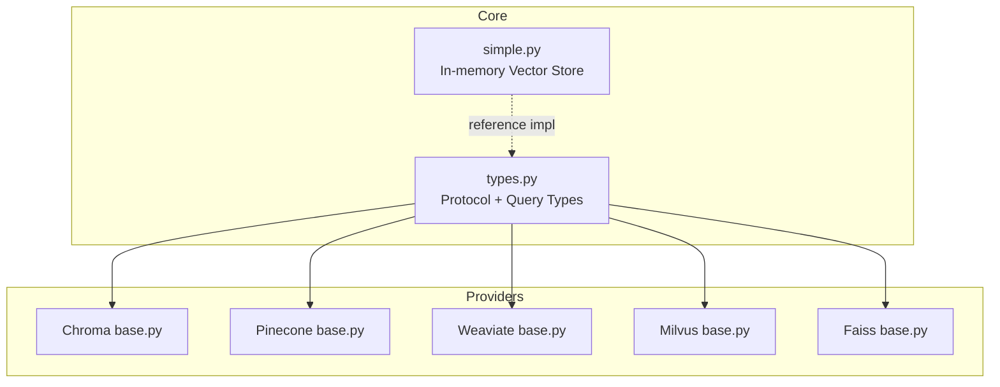
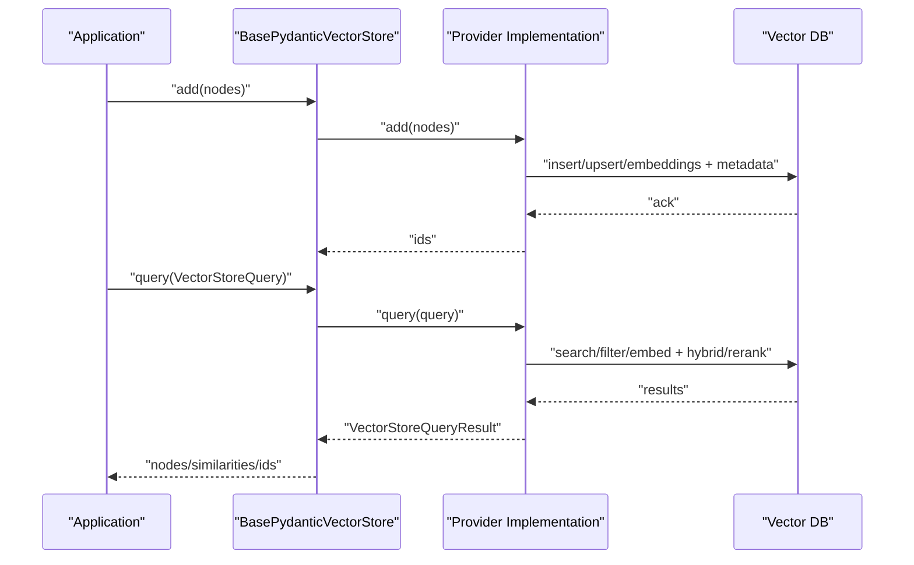
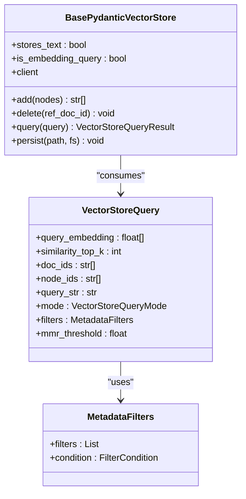
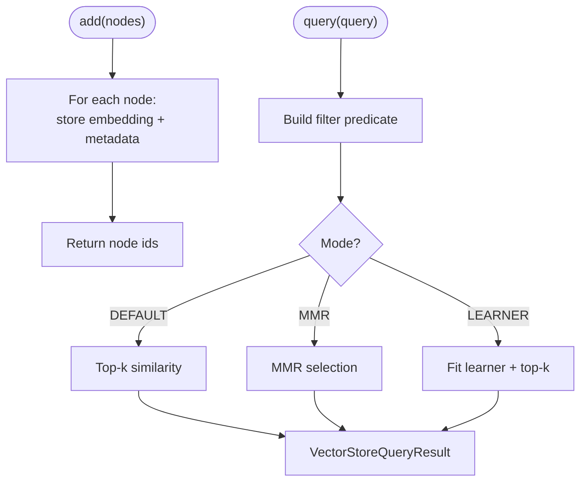
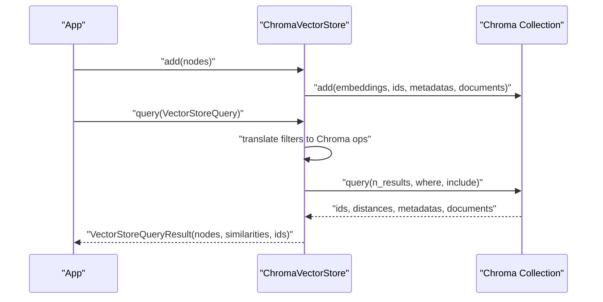
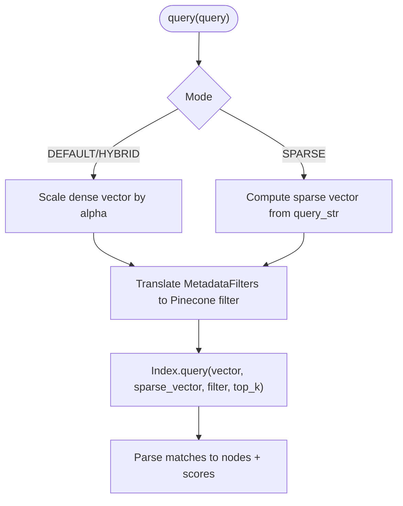
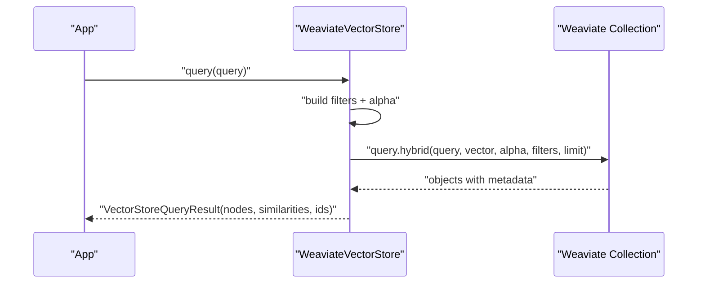
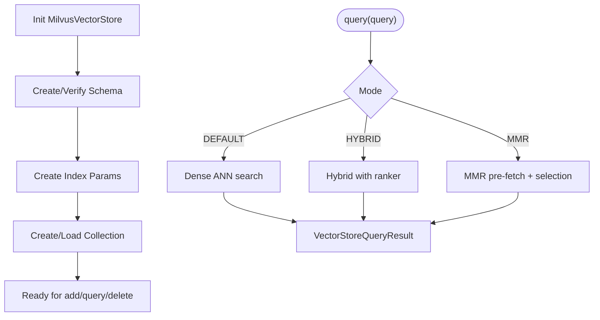
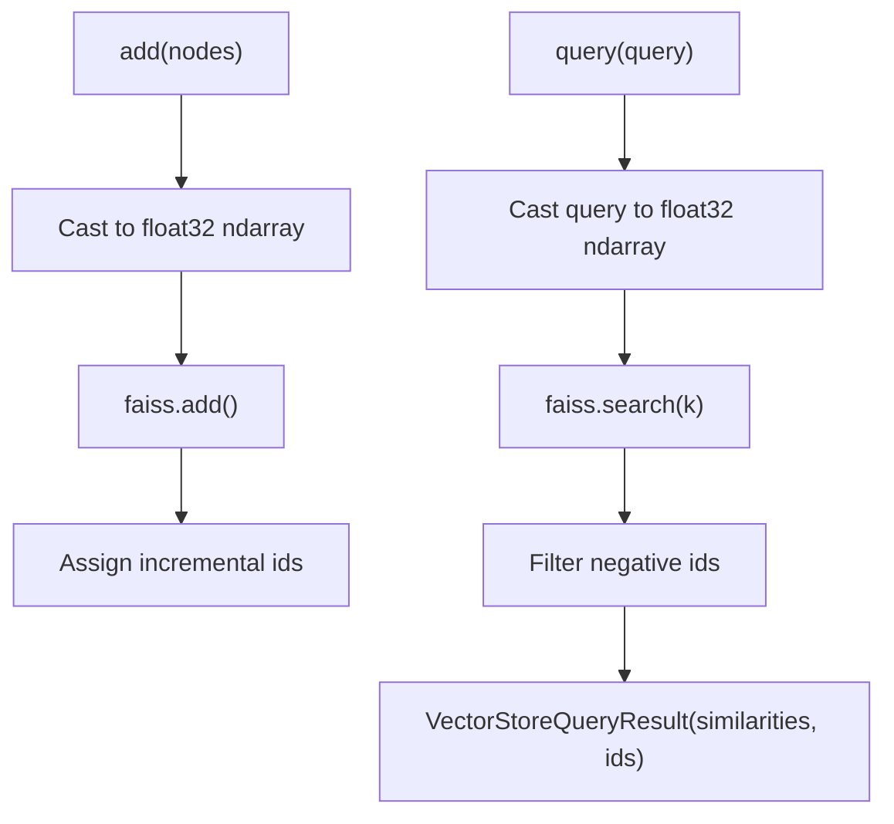
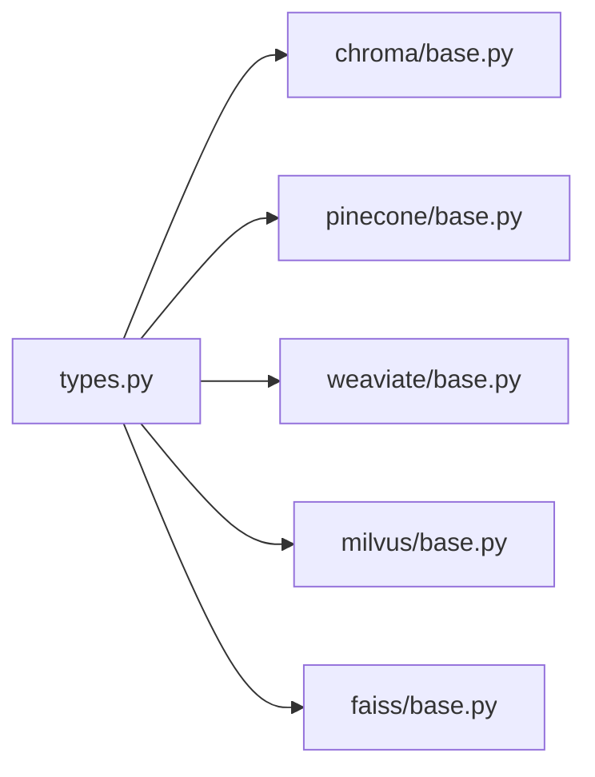

# Vector Stores

<cite>
**Referenced Files in This Document**
- [types.py](file://llama-index-core/llama_index/core/vector_stores/types.py)
- [simple.py](file://llama-index-core/llama_index/core/vector_stores/simple.py)
- [base.py](file://llama-index-integrations/vector_stores/llama-index-vector-stores-chroma/llama_index/vector_stores/chroma/base.py)
- [base.py](file://llama-index-integrations/vector_stores/llama-index-vector-stores-pinecone/llama_index/vector_stores/pinecone/base.py)
- [base.py](file://llama-index-integrations/vector_stores/llama-index-vector-stores-weaviate/llama_index/vector_stores/weaviate/base.py)
- [base.py](file://llama-index-integrations/vector_stores/llama-index-vector-stores-milvus/llama_index/vector_stores/milvus/base.py)
- [base.py](file://llama-index-integrations/vector_stores/llama-index-vector-stores-faiss/llama_index/vector_stores/faiss/base.py)
</cite>

## Table of Contents
1. [Introduction](#introduction)
2. [Project Structure](#project-structure)
3. [Core Components](#core-components)
4. [Architecture Overview](#architecture-overview)
5. [Detailed Component Analysis](#detailed-component-analysis)
6. [Dependency Analysis](#dependency-analysis)
7. [Performance Considerations](#performance-considerations)
8. [Troubleshooting Guide](#troubleshooting-guide)
9. [Conclusion](#conclusion)
10. [Appendices](#appendices)

## Introduction
This document explains vector store integrations in LlamaIndex with a focus on the unified vector store interface and provider-specific implementations. It covers:
- The shared protocol and query model used across providers
- Provider-specific configuration, indexing, metadata filtering, similarity metrics, and scaling
- Practical guidance for setup, batch operations, and query tuning
- Hybrid search, clustering, and cloud vector services
- Selection criteria and migration strategies

## Project Structure
LlamaIndex provides a core vector store protocol and a set of integrations for popular vector databases. The core protocol defines the interface; provider packages implement it against their respective backends.

**Diagram sources**
- [types.py](file://llama-index-core/llama_index/core/vector_stores/types.py#L268-L439)
- [simple.py](file://llama-index-core/llama_index/core/vector_stores/simple.py#L64-L355)
- [base.py](file://llama-index-integrations/vector_stores/llama-index-vector-stores-chroma/llama_index/vector_stores/chroma/base.py#L120-L709)
- [base.py](file://llama-index-integrations/vector_stores/llama-index-vector-stores-pinecone/llama_index/vector_stores/pinecone/base.py#L114-L552)
- [base.py](file://llama-index-integrations/vector_stores/llama-index-vector-stores-weaviate/llama_index/vector_stores/weaviate/base.py#L113-L556)
- [base.py](file://llama-index-integrations/vector_stores/llama-index-vector-stores-milvus/llama_index/vector_stores/milvus/base.py#L119-L800)
- [base.py](file://llama-index-integrations/vector_stores/llama-index-vector-stores-faiss/llama_index/vector_stores/faiss/base.py#L33-L223)

**Section sources**
- [types.py](file://llama-index-core/llama_index/core/vector_stores/types.py#L1-L439)
- [simple.py](file://llama-index-core/llama_index/core/vector_stores/simple.py#L1-L355)

## Core Components
- Unified Protocol: The BasePydanticVectorStore protocol defines the canonical interface for adding, deleting, querying, and persisting nodes. It standardizes query modes, metadata filters, and result shapes.
- Query Model: VectorStoreQuery encapsulates embeddings, text queries, filters, and modes (e.g., DEFAULT, SPARSE, HYBRID, MMR). Providers translate this into backend-specific calls.
- Metadata Filters: MetadataFilters and FilterOperator define a portable filter DSL across providers, with provider-specific translation layers.

Key elements:
- Protocol methods: add, delete, query, persist, async variants
- Query modes: DEFAULT, SPARSE, HYBRID, TEXT_SEARCH, SEMANTIC_HYBRID, MMR
- Filters: EQ, GT, LT, NE, GTE, LTE, IN, NIN, ANY, ALL, TEXT_MATCH, TEXT_MATCH_INSENSITIVE, CONTAINS, IS_EMPTY
- Result shape: VectorStoreQueryResult with nodes, similarities, ids

**Section sources**
- [types.py](file://llama-index-core/llama_index/core/vector_stores/types.py#L268-L439)
- [types.py](file://llama-index-core/llama_index/core/vector_stores/types.py#L240-L267)
- [types.py](file://llama-index-core/llama_index/core/vector_stores/types.py#L94-L201)

## Architecture Overview
The unified interface enables pluggable vector stores. At runtime, a provider translates the generic query into backend-specific operations.

**Diagram sources**
- [types.py](file://llama-index-core/llama_index/core/vector_stores/types.py#L268-L439)
- [base.py](file://llama-index-integrations/vector_stores/llama-index-vector-stores-chroma/llama_index/vector_stores/chroma/base.py#L371-L425)
- [base.py](file://llama-index-integrations/vector_stores/llama-index-vector-stores-pinecone/llama_index/vector_stores/pinecone/base.py#L451-L552)
- [base.py](file://llama-index-integrations/vector_stores/llama-index-vector-stores-weaviate/llama_index/vector_stores/weaviate/base.py#L521-L534)
- [base.py](file://llama-index-integrations/vector_stores/llama-index-vector-stores-milvus/llama_index/vector_stores/milvus/base.py#L784-L800)
- [base.py](file://llama-index-integrations/vector_stores/llama-index-vector-stores-faiss/llama_index/vector_stores/faiss/base.py#L183-L223)

## Detailed Component Analysis

### Unified Vector Store Protocol
- Purpose: Define a single interface for all vector stores.
- Core responsibilities:
  - Add nodes with embeddings
  - Delete by document id or node ids with optional filters
  - Query with embeddings/text, filters, and modes
  - Persist/load state when applicable
- Async support: Optional async methods fall back to sync if not implemented.

**Diagram sources**
- [types.py](file://llama-index-core/llama_index/core/vector_stores/types.py#L268-L439)
- [types.py](file://llama-index-core/llama_index/core/vector_stores/types.py#L240-L267)
- [types.py](file://llama-index-core/llama_index/core/vector_stores/types.py#L142-L201)

**Section sources**
- [types.py](file://llama-index-core/llama_index/core/vector_stores/types.py#L268-L439)

### Simple Vector Store (Reference Implementation)
- In-memory dictionary-backed store for small-scale or testing use.
- Stores embeddings, node ids, and metadata; supports MMR and learner modes.
- Demonstrates the minimal contract: add, delete, query, persist.

**Diagram sources**
- [simple.py](file://llama-index-core/llama_index/core/vector_stores/simple.py#L174-L316)

**Section sources**
- [simple.py](file://llama-index-core/llama_index/core/vector_stores/simple.py#L64-L355)

### Chroma Vector Store
- Embeddings and metadata stored in a Chroma collection.
- Supports MMR with configurable prefetch factor and threshold.
- Metadata filters translated to Chroma’s $and/$or/$in/$nin/$gt/$lt/$eq/$ne/$gte/$lte operators.

Key configuration and features:
- Initialization via collection instance or ephemeral/persistent client
- Batched add with chunking
- MMR search with distance-to-score conversion
- Hybrid-like filtering via where clauses

**Diagram sources**
- [base.py](file://llama-index-integrations/vector_stores/llama-index-vector-stores-chroma/llama_index/vector_stores/chroma/base.py#L284-L425)

**Section sources**
- [base.py](file://llama-index-integrations/vector_stores/llama-index-vector-stores-chroma/llama_index/vector_stores/chroma/base.py#L120-L709)

### Pinecone Vector Store
- Stores dense vectors and optional sparse vectors.
- Supports SPARSE, HYBRID modes; translates filters to Pinecone $and/$or/$in/$nin/$gt/$lt/$eq/$ne/$gte/$lte.
- Upserts with batching; supports namespaces.

Important notes:
- Requires a valid index name; initializes client accordingly.
- For SPARSE/HYBRID, generates sparse vectors from text using a tokenizer or default sparse model.
- Query requires a vector; if none provided, constructs a zero vector of appropriate dimension.

**Diagram sources**
- [base.py](file://llama-index-integrations/vector_stores/llama-index-vector-stores-pinecone/llama_index/vector_stores/pinecone/base.py#L451-L552)

**Section sources**
- [base.py](file://llama-index-integrations/vector_stores/llama-index-vector-stores-pinecone/llama_index/vector_stores/pinecone/base.py#L114-L552)

### Weaviate Vector Store
- Uses Weaviate collections with dynamic schema creation.
- Supports hybrid search with configurable alpha; parses results to nodes.
- Metadata filters mapped to Weaviate Filter API; supports async client.

Highlights:
- Lazy schema creation for async clients
- Hybrid query path with distance/score metadata
- Robust delete semantics by doc_id and filters

**Diagram sources**
- [base.py](file://llama-index-integrations/vector_stores/llama-index-vector-stores-weaviate/llama_index/vector_stores/weaviate/base.py#L521-L534)

**Section sources**
- [base.py](file://llama-index-integrations/vector_stores/llama-index-vector-stores-weaviate/llama_index/vector_stores/weaviate/base.py#L113-L556)

### Milvus Vector Store
- Rich configuration for dense and sparse embeddings, similarity metrics, and hybrid ranking.
- Supports index management strategies, collection properties (TTL, mmap), and partitioning.
- Provides MMR and hybrid search with configurable rankers (RRFRanker, WeightedRanker).

Key capabilities:
- Schema creation with optional built-in sparse functions
- Upsert vs insert modes
- Flexible metadata filtering via standard and scalar filters
- Async client support

**Diagram sources**
- [base.py](file://llama-index-integrations/vector_stores/llama-index-vector-stores-milvus/llama_index/vector_stores/milvus/base.py#L119-L800)

**Section sources**
- [base.py](file://llama-index-integrations/vector_stores/llama-index-vector-stores-milvus/llama_index/vector_stores/milvus/base.py#L119-L800)

### FAISS Vector Store
- Pure in-memory index for dense vectors; does not store text.
- Minimal persistence via local file writes/read.
- Query returns indices and distances; metadata filtering not supported.

**Diagram sources**
- [base.py](file://llama-index-integrations/vector_stores/llama-index-vector-stores-faiss/llama_index/vector_stores/faiss/base.py#L183-L223)

**Section sources**
- [base.py](file://llama-index-integrations/vector_stores/llama-index-vector-stores-faiss/llama_index/vector_stores/faiss/base.py#L33-L223)

## Dependency Analysis
- Core protocol dependency: All provider implementations depend on BasePydanticVectorStore and related types.
- Provider-specific SDKs: Chroma, Pinecone, Weaviate, Milvus, FAISS each require their own client libraries.
- Filter translation: Each provider converts MetadataFilters to its native filter language.

**Diagram sources**
- [types.py](file://llama-index-core/llama_index/core/vector_stores/types.py#L268-L439)
- [base.py](file://llama-index-integrations/vector_stores/llama-index-vector-stores-chroma/llama_index/vector_stores/chroma/base.py#L120-L709)
- [base.py](file://llama-index-integrations/vector_stores/llama-index-vector-stores-pinecone/llama_index/vector_stores/pinecone/base.py#L114-L552)
- [base.py](file://llama-index-integrations/vector_stores/llama-index-vector-stores-weaviate/llama_index/vector_stores/weaviate/base.py#L113-L556)
- [base.py](file://llama-index-integrations/vector_stores/llama-index-vector-stores-milvus/llama_index/vector_stores/milvus/base.py#L119-L800)
- [base.py](file://llama-index-integrations/vector_stores/llama-index-vector-stores-faiss/llama_index/vector_stores/faiss/base.py#L33-L223)

**Section sources**
- [types.py](file://llama-index-core/llama_index/core/vector_stores/types.py#L268-L439)

## Performance Considerations
- Indexing and similarity metrics
  - Milvus supports IP, L2, COSINE; choose based on embedding normalization and downstream similarity interpretation.
  - Pinecone and Weaviate expose metric/index settings; align with embedding norms.
- Hybrid search
  - Pinecone and Weaviate support hybrid modes; tune alpha to balance lexical and vector signals.
  - Milvus supports hybrid ranking with RRFRanker or WeightedRanker; configure ranker parameters.
- MMR
  - Chroma and Milvus support MMR; tune mmr_threshold and prefetch factors to balance quality and latency.
- Batch operations
  - Chroma: chunked inserts with MAX_CHUNK_SIZE.
  - Pinecone: configurable batch_size for upsert.
  - Milvus: iter_batch for insert/upsert; supports partitioning.
  - FAISS: local persistence; consider index type and dimensionality for speed.
- Scaling
  - Cloud providers (Pinecone, Weaviate, Milvus) offer managed clusters; configure replicas/shards and consistency levels.
  - Milvus supports collection properties like TTL and mmap for lifecycle and memory management.

[No sources needed since this section provides general guidance]

## Troubleshooting Guide
Common issues and remedies:
- Missing provider SDK
  - Install the required package for the chosen provider (e.g., chromadb, pinecone-client, weaviate-client, pymilvus, faiss).
- Filter conflicts
  - Providers reject specifying filters via both generic query and provider-specific kwargs; use one approach consistently.
- MMR parameter validation
  - Chroma/Milvus require mmr_threshold in [0,1]; avoid both mmr_prefetch_factor and mmr_prefetch_k simultaneously.
- Sparse/Hybrid mode prerequisites
  - Pinecone requires query_str for SPARSE/HYBRID; ensure tokenizer or sparse model is configured.
- FAISS limitations
  - Metadata filtering not implemented; FAISS returns indices and distances only.
  - Delete not implemented; use alternative providers if deletions by doc_id are required.

**Section sources**
- [base.py](file://llama-index-integrations/vector_stores/llama-index-vector-stores-chroma/llama_index/vector_stores/chroma/base.py#L401-L425)
- [base.py](file://llama-index-integrations/vector_stores/llama-index-vector-stores-pinecone/llama_index/vector_stores/pinecone/base.py#L460-L482)
- [base.py](file://llama-index-integrations/vector_stores/llama-index-vector-stores-faiss/llama_index/vector_stores/faiss/base.py#L196-L198)

## Conclusion
LlamaIndex’s unified vector store interface enables seamless switching among many providers while preserving consistent functionality. By leveraging the shared protocol, metadata filters, and query modes, applications can integrate diverse vector databases—from local FAISS to managed cloud services—without changing application logic. Provider-specific features (e.g., MMR, hybrid ranking, sparse vectors, and advanced indexing) remain accessible through provider adapters.

[No sources needed since this section summarizes without analyzing specific files]

## Appendices

### Provider Feature Matrix (selected)
- Chroma: MMR, metadata filters, batched add, persistent/ephemeral clients
- Pinecone: sparse vectors, hybrid search, namespaces, batched upsert
- Weaviate: hybrid search, dynamic schema, async client, robust delete
- Milvus: dense/sparse, flexible metrics, hybrid rankers, partitioning, TTL/mmap
- FAISS: pure dense vectors, local persistence, no text storage

[No sources needed since this section provides general guidance]