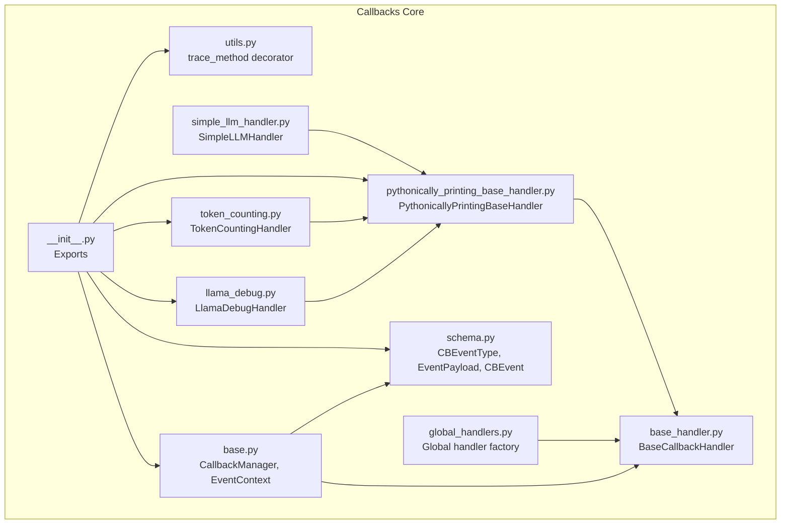
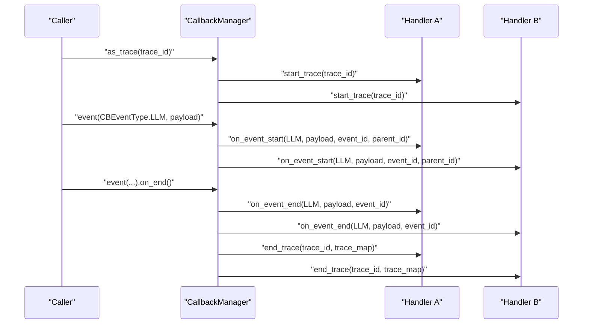
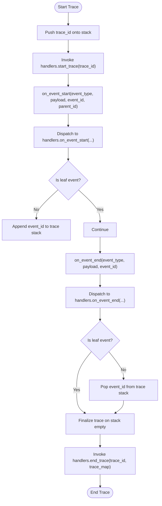
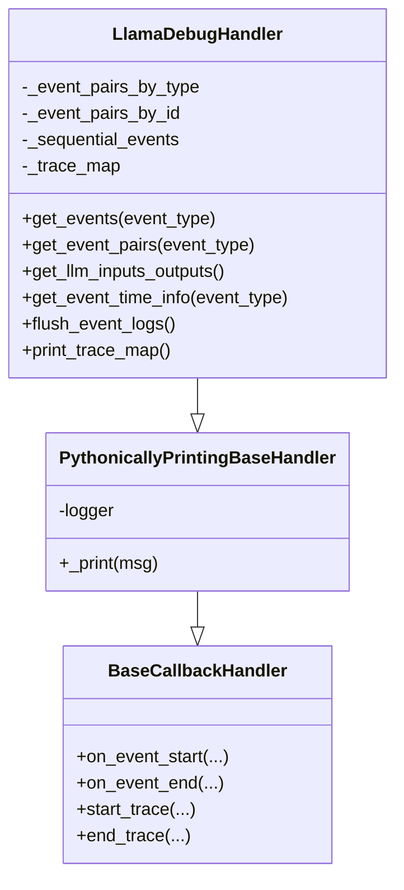
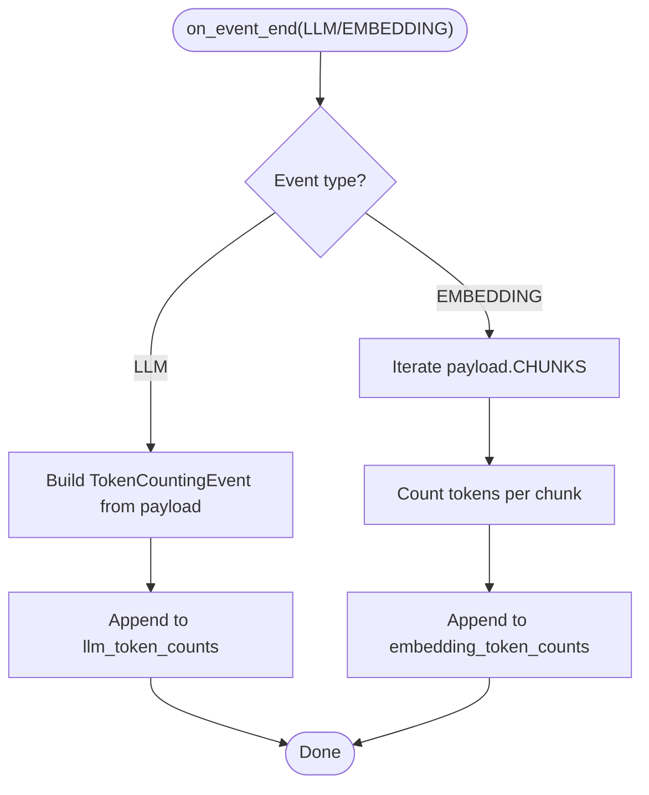
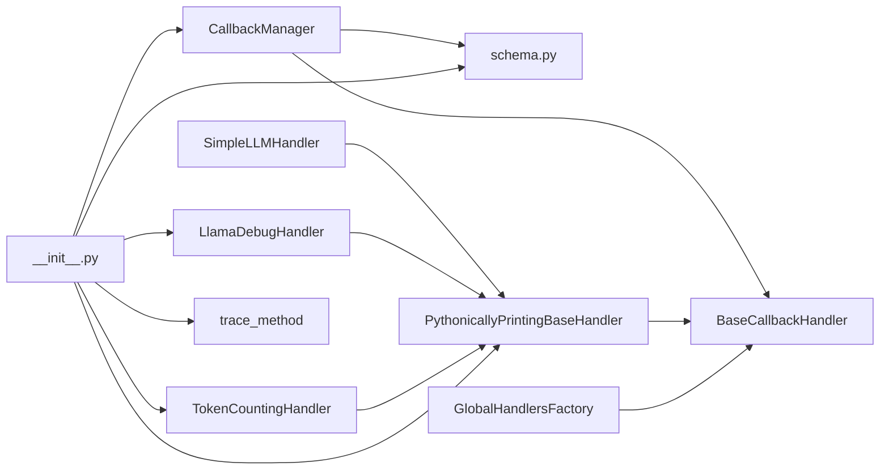

# Callback System and Debugging

<cite>
**Referenced Files in This Document**
- [base.py](file://llama-index-core/llama_index/core/callbacks/base.py)
- [base_handler.py](file://llama-index-core/llama_index/core/callbacks/base_handler.py)
- [schema.py](file://llama-index-core/llama_index/core/callbacks/schema.py)
- [global_handlers.py](file://llama-index-core/llama_index/core/callbacks/global_handlers.py)
- [llama_debug.py](file://llama-index-core/llama_index/core/callbacks/llama_debug.py)
- [token_counting.py](file://llama-index-core/llama_index/core/callbacks/token_counting.py)
- [pythonically_printing_base_handler.py](file://llama-index-core/llama_index/core/callbacks/pythonically_printing_base_handler.py)
- [simple_llm_handler.py](file://llama-index-core/llama_index/core/callbacks/simple_llm_handler.py)
- [utils.py](file://llama-index-core/llama_index/core/callbacks/utils.py)
- [__init__.py](file://llama-index-core/llama_index/core/callbacks/__init__.py)
- [test_llama_debug.py](file://llama-index-core/tests/callbacks/test_llama_debug.py)
- [test_token_counter.py](file://llama-index-core/tests/callbacks/test_token_counter.py)
</cite>

## Table of Contents
1. [Introduction](#introduction)
2. [Project Structure](#project-structure)
3. [Core Components](#core-components)
4. [Architecture Overview](#architecture-overview)
5. [Detailed Component Analysis](#detailed-component-analysis)
6. [Dependency Analysis](#dependency-analysis)
7. [Performance Considerations](#performance-considerations)
8. [Troubleshooting Guide](#troubleshooting-guide)
9. [Conclusion](#conclusion)
10. [Appendices](#appendices)

## Introduction
This document explains the LlamaIndex callback system and debugging capabilities. It covers the callback architecture, base callback handlers, global handlers, and specialized handlers for token counting and debugging. It documents the callback lifecycle, event types, and handler registration patterns. It also provides practical guidance for implementing custom callback handlers, monitoring token usage, and debugging LLM interactions in development and production.

## Project Structure
The callback system lives under the core callbacks module and includes:
- Base callback manager and handler abstractions
- Event types and payloads
- Global handler factory for integrations
- Specialized handlers for debugging and token counting
- Utilities for tracing methods and printing via logging

**Diagram sources**
- [base.py](file://llama-index-core/llama_index/core/callbacks/base.py#L28-L303)
- [base_handler.py](file://llama-index-core/llama_index/core/callbacks/base_handler.py#L12-L56)
- [schema.py](file://llama-index-core/llama_index/core/callbacks/schema.py#L16-L102)
- [utils.py](file://llama-index-core/llama_index/core/callbacks/utils.py#L11-L62)
- [pythonically_printing_base_handler.py](file://llama-index-core/llama_index/core/callbacks/pythonically_printing_base_handler.py#L10-L39)
- [simple_llm_handler.py](file://llama-index-core/llama_index/core/callbacks/simple_llm_handler.py#L10-L71)
- [llama_debug.py](file://llama-index-core/llama_index/core/callbacks/llama_debug.py#L17-L211)
- [token_counting.py](file://llama-index-core/llama_index/core/callbacks/token_counting.py#L143-L270)
- [global_handlers.py](file://llama-index-core/llama_index/core/callbacks/global_handlers.py#L6-L150)
- [__init__.py](file://llama-index-core/llama_index/core/callbacks/__init__.py#L1-L18)

**Section sources**
- [__init__.py](file://llama-index-core/llama_index/core/callbacks/__init__.py#L1-L18)

## Core Components
- CallbackManager: Central orchestrator for event lifecycle and trace management. It maintains a stack of active events, tracks parent-child relationships, and dispatches events to registered handlers. It supports context-managed event and trace lifecycles.
- BaseCallbackHandler: Abstract base defining the contract for handlers: on_event_start, on_event_end, start_trace, end_trace, with configurable lists of ignored event types at start/end.
- Event types and payloads: CBEventType enumerates major stages (e.g., LLM, QUERY, RETRIEVE, EMBEDDING, CHUNKING, TREE, SUB_QUESTION, TEMPLATING, FUNCTION_CALL, RERANKING, EXCEPTION, AGENT_STEP). EventPayload defines standardized keys for payloads (e.g., PROMPT, MESSAGES, COMPLETION, RESPONSE, QUERY_STR, EMBEDDINGS, TOP_K, MODEL_NAME, TEMPLATE, EXCEPTION).
- PythonicallyPrintingBaseHandler: A convenience base that routes prints to logging, enabling rich logging integrations.
- Specialized handlers:
  - SimpleLLMHandler: Prints LLM prompts and completions for quick inspection.
  - LlamaDebugHandler: Captures and organizes events by type and ID, computes timing statistics, and prints trace maps for debugging.
  - TokenCountingHandler: Counts tokens for LLM and embedding events, aggregates totals, and optionally prints verbose usage.
- Global handler factory: Provides a centralized way to configure external integrations (e.g., wandb, openinference, arize-phoenix, honeyhive, promptlayer, deepeval, argilla, langfuse, agentops, literalai, opik) via a simple mode string.

**Section sources**
- [base.py](file://llama-index-core/llama_index/core/callbacks/base.py#L28-L303)
- [base_handler.py](file://llama-index-core/llama_index/core/callbacks/base_handler.py#L12-L56)
- [schema.py](file://llama-index-core/llama_index/core/callbacks/schema.py#L16-L102)
- [pythonically_printing_base_handler.py](file://llama-index-core/llama_index/core/callbacks/pythonically_printing_base_handler.py#L10-L39)
- [simple_llm_handler.py](file://llama-index-core/llama_index/core/callbacks/simple_llm_handler.py#L10-L71)
- [llama_debug.py](file://llama-index-core/llama_index/core/callbacks/llama_debug.py#L17-L211)
- [token_counting.py](file://llama-index-core/llama_index/core/callbacks/token_counting.py#L143-L270)
- [global_handlers.py](file://llama-index-core/llama_index/core/callbacks/global_handlers.py#L6-L150)

## Architecture Overview
The callback system is event-driven and trace-aware:
- Events are typed and carry payloads.
- CallbackManager manages the lifecycle of events and traces.
- Handlers receive callbacks for event start/end and trace start/end.
- Specialized handlers can filter events and focus on specific domains (debugging, token counting).

**Diagram sources**
- [base.py](file://llama-index-core/llama_index/core/callbacks/base.py#L193-L248)
- [base_handler.py](file://llama-index-core/llama_index/core/callbacks/base_handler.py#L24-L55)

## Detailed Component Analysis

### Base Callback Manager and Lifecycle
- Event lifecycle:
  - on_event_start creates or assigns an event_id, resolves parent_id from the current trace stack, records parent-child relationships, invokes handlers (skipping ignored types), and updates the trace stack for non-leaf events.
  - on_event_end invokes handlers for end events and pops from the trace stack for non-leaf events.
- Trace lifecycle:
  - start_trace initializes/reset trace state and invokes handlers’ start_trace.
  - end_trace finalizes trace state and invokes handlers’ end_trace with the trace_map.
- Context managers:
  - event: wraps a single event with automatic on_start/on_end.
  - as_trace: wraps a block with automatic start_trace/end_trace and ensures cleanup on exceptions.

**Diagram sources**
- [base.py](file://llama-index-core/llama_index/core/callbacks/base.py#L88-L143)
- [base.py](file://llama-index-core/llama_index/core/callbacks/base.py#L193-L248)

**Section sources**
- [base.py](file://llama-index-core/llama_index/core/callbacks/base.py#L28-L303)

### Base Callback Handler Contract
- Defines the required methods and allows specifying event types to ignore during start and end phases.
- Ensures consistent behavior across all specialized handlers.

**Section sources**
- [base_handler.py](file://llama-index-core/llama_index/core/callbacks/base_handler.py#L12-L56)

### Event Types and Payloads
- CBEventType enumerates major stages of a pipeline.
- EventPayload standardizes keys for payloads across handlers.

**Section sources**
- [schema.py](file://llama-index-core/llama_index/core/callbacks/schema.py#L16-L102)

### Pythonically Printing Base Handler
- Routes output to logging for better integration with log handlers and formatters.
- Enables consistent logging behavior across handlers.

**Section sources**
- [pythonically_printing_base_handler.py](file://llama-index-core/llama_index/core/callbacks/pythonically_printing_base_handler.py#L10-L39)

### Simple LLM Handler
- Prints prompts and completions for LLM events.
- Useful for quick inspection of LLM inputs/outputs.

**Section sources**
- [simple_llm_handler.py](file://llama-index-core/llama_index/core/callbacks/simple_llm_handler.py#L10-L71)

### LlamaDebug Handler
- Captures events by type and ID, maintains a sequential list, and computes timing statistics per event pair.
- Provides methods to retrieve events, compute stats, and print trace maps for debugging.
- Supports ignoring specific event types at start/end.

**Diagram sources**
- [base_handler.py](file://llama-index-core/llama_index/core/callbacks/base_handler.py#L12-L56)
- [pythonically_printing_base_handler.py](file://llama-index-core/llama_index/core/callbacks/pythonically_printing_base_handler.py#L10-L39)
- [llama_debug.py](file://llama-index-core/llama_index/core/callbacks/llama_debug.py#L17-L211)

**Section sources**
- [llama_debug.py](file://llama-index-core/llama_index/core/callbacks/llama_debug.py#L17-L211)

### Token Counting Handler
- Aggregates token usage for LLM and embedding events.
- Extracts token counts from response metadata or falls back to tokenizer estimates.
- Exposes totals and resets counts.

**Diagram sources**
- [token_counting.py](file://llama-index-core/llama_index/core/callbacks/token_counting.py#L197-L244)

**Section sources**
- [token_counting.py](file://llama-index-core/llama_index/core/callbacks/token_counting.py#L143-L270)

### Global Handlers Factory
- Provides a centralized way to configure external integrations by mode string.
- Raises informative errors when required packages are missing.
- Supports modes like wandb, openinference, arize-phoenix, honeyhive, promptlayer, deepeval, simple, argilla, langfuse, agentops, literalai, opik.

**Section sources**
- [global_handlers.py](file://llama-index-core/llama_index/core/callbacks/global_handlers.py#L6-L150)

### Tracing Utility
- trace_method decorator wraps methods with a trace, ensuring lifecycle events are emitted around method execution.
- Works for both sync and async methods.

**Section sources**
- [utils.py](file://llama-index-core/llama_index/core/callbacks/utils.py#L11-L62)

## Dependency Analysis
- CallbackManager depends on BaseCallbackHandler, CBEventType, EventPayload, and context variables for trace stacks.
- Specialized handlers depend on PythonicallyPrintingBaseHandler and schema enums.
- Global handlers import integration-specific handlers conditionally and raise import errors when unavailable.
- Exports in __init__.py expose public APIs for consumers.

**Diagram sources**
- [base.py](file://llama-index-core/llama_index/core/callbacks/base.py#L28-L303)
- [schema.py](file://llama-index-core/llama_index/core/callbacks/schema.py#L16-L102)
- [base_handler.py](file://llama-index-core/llama_index/core/callbacks/base_handler.py#L12-L56)
- [pythonically_printing_base_handler.py](file://llama-index-core/llama_index/core/callbacks/pythonically_printing_base_handler.py#L10-L39)
- [simple_llm_handler.py](file://llama-index-core/llama_index/core/callbacks/simple_llm_handler.py#L10-L71)
- [llama_debug.py](file://llama-index-core/llama_index/core/callbacks/llama_debug.py#L17-L211)
- [token_counting.py](file://llama-index-core/llama_index/core/callbacks/token_counting.py#L143-L270)
- [global_handlers.py](file://llama-index-core/llama_index/core/callbacks/global_handlers.py#L6-L150)
- [__init__.py](file://llama-index-core/llama_index/core/callbacks/__init__.py#L1-L18)

**Section sources**
- [__init__.py](file://llama-index-core/llama_index/core/callbacks/__init__.py#L1-L18)

## Performance Considerations
- Event filtering: Use event_starts_to_ignore and event_ends_to_ignore to reduce overhead for noisy or irrelevant event types.
- Token counting: TokenCountingHandler performs lightweight counting and optional verbose prints; avoid enabling verbose in hot paths if logging is expensive.
- Logging: Prefer PythonicallyPrintingBaseHandler to route prints to logging for efficient sinks and formatters.
- Trace depth: Deep nested traces increase memory usage; keep traces scoped to meaningful units.
- Global handler uniqueness: CallbackManager prevents duplicate global handler types, avoiding redundant work.

[No sources needed since this section provides general guidance]

## Troubleshooting Guide
- Missing global handler package: Global handlers factory raises import errors when required packages are not installed. Install the appropriate integration package and retry.
- Ignored events: If your handler does not receive events, verify that the event type is not in event_starts_to_ignore or event_ends_to_ignore.
- Verbose logging: If token counting or debug prints are too verbose, disable verbose flags or adjust logging levels.
- Trace mismatch: Ensure traces are properly started and ended; use as_trace context manager to guarantee cleanup.
- Method tracing: If trace_method does not find the callback manager attribute, ensure the decorated object has the expected attribute or override callback_manager_attr.

**Section sources**
- [global_handlers.py](file://llama-index-core/llama_index/core/callbacks/global_handlers.py#L25-L29)
- [global_handlers.py](file://llama-index-core/llama_index/core/callbacks/global_handlers.py#L38-L41)
- [global_handlers.py](file://llama-index-core/llama_index/core/callbacks/global_handlers.py#L62-L65)
- [global_handlers.py](file://llama-index-core/llama_index/core/callbacks/global_handlers.py#L84-L87)
- [global_handlers.py](file://llama-index-core/llama_index/core/callbacks/global_handlers.py#L119-L122)
- [global_handlers.py](file://llama-index-core/llama_index/core/callbacks/global_handlers.py#L141-L144)
- [utils.py](file://llama-index-core/llama_index/core/callbacks/utils.py#L33-L39)
- [base.py](file://llama-index-core/llama_index/core/callbacks/base.py#L193-L211)

## Conclusion
The LlamaIndex callback system provides a robust, extensible foundation for instrumentation, debugging, and monitoring. CallbackManager coordinates event and trace lifecycles, while specialized handlers enable focused capabilities such as debugging and token accounting. By leveraging global handlers and the tracing utility, teams can integrate with external systems and gain deep insights into LLM workflows with minimal friction.

[No sources needed since this section summarizes without analyzing specific files]

## Appendices

### Practical Examples and Patterns

- Implementing a custom logging handler:
  - Subclass PythonicallyPrintingBaseHandler and override on_event_start/on_event_end to emit structured logs.
  - Register the handler with CallbackManager or set a global handler via the factory.

- Metrics collection:
  - Extend TokenCountingHandler to persist totals to a metrics backend or augment payloads with usage metadata.

- Custom business logic:
  - Use trace_method to wrap domain methods and capture end-to-end traces.
  - Combine with CallbackManager.event for granular event-level hooks.

- Cost monitoring:
  - Use TokenCountingHandler totals to estimate costs and alert on thresholds.
  - Aggregate totals across runs and export to dashboards.

- Debugging LLM interactions:
  - Use LlamaDebugHandler to capture LLM inputs/outputs and print trace maps.
  - Inspect event pairs and timing statistics to identify bottlenecks.

- Monitoring callback execution:
  - Enable verbose logging for handlers during development.
  - Use logging sinks (e.g., rich handlers) for readable output.

- Production best practices:
  - Filter noisy events to reduce overhead.
  - Avoid verbose prints in hot paths.
  - Use global handlers for standardized integrations.

[No sources needed since this section provides general guidance]