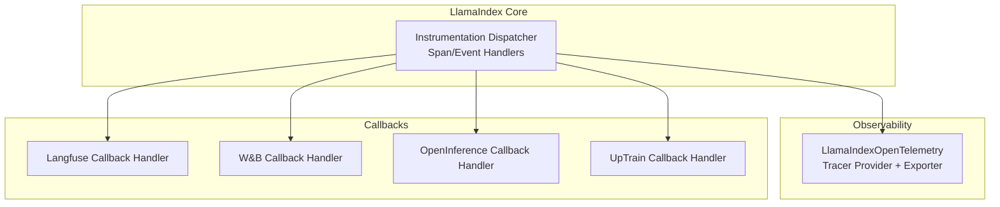
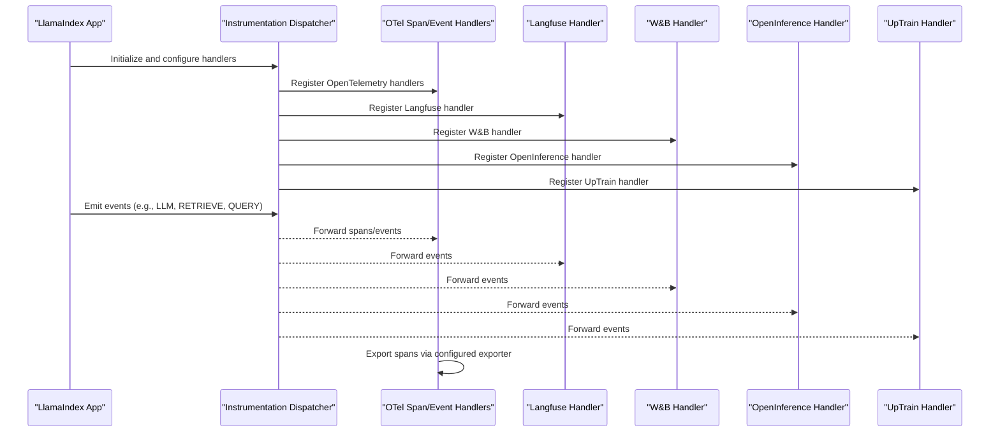
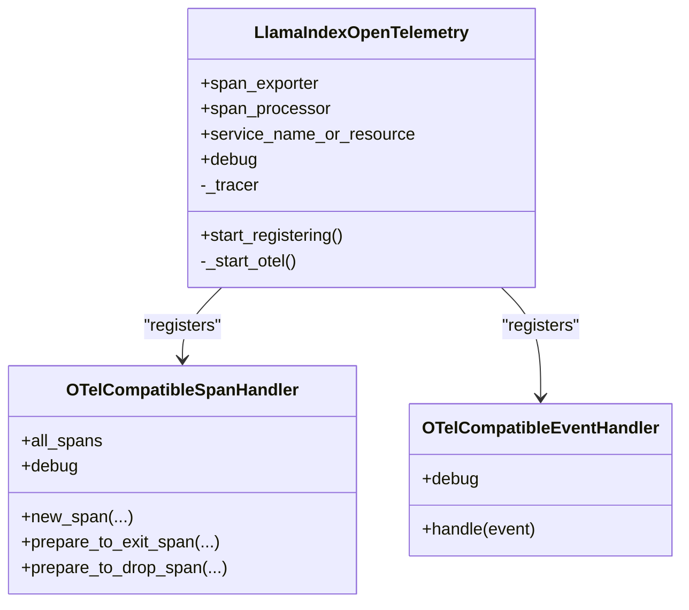
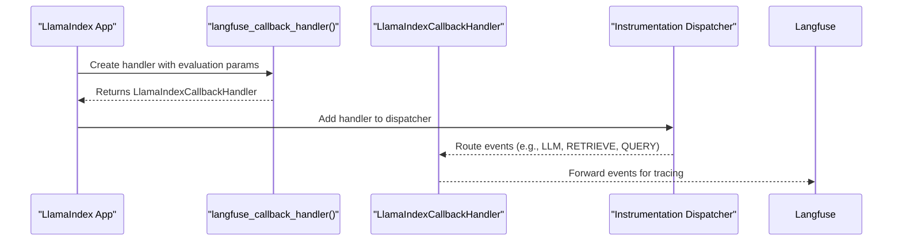
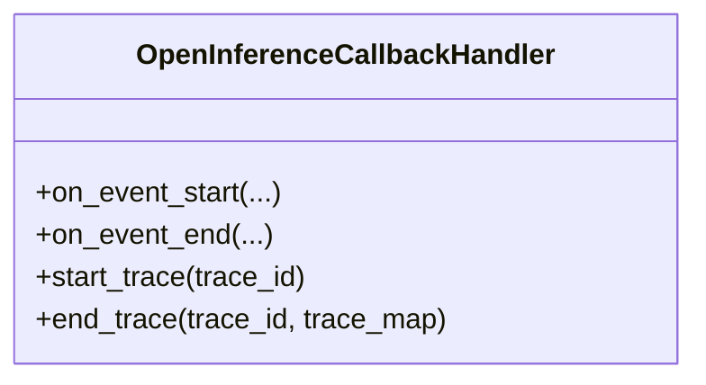
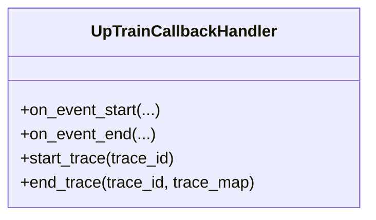
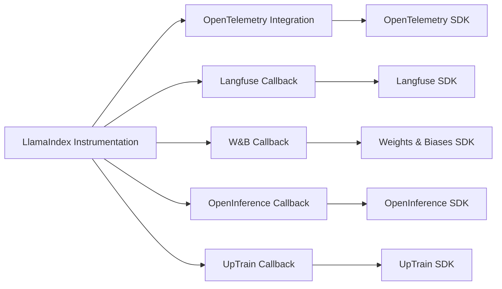

# Monitoring Integrations and Dashboards

<cite>
**Referenced Files in This Document**
- [README.md](file://llama-index-integrations/observability/llama-index-observability-otel/README.md)
- [base.py](file://llama-index-integrations/observability/llama-index-observability-otel/llama_index/observability/otel/base.py)
- [utils.py](file://llama-index-integrations/observability/llama-index-observability-otel/llama_index/observability/otel/utils.py)
- [__init__.py](file://llama-index-integrations/observability/llama-index-observability-otel/llama_index/observability/otel/__init__.py)
- [base.py](file://llama-index-integrations/callbacks/llama-index-callbacks-langfuse/llama_index/callbacks/langfuse/base.py)
- [__init__.py](file://llama-index-integrations/callbacks/llama-index-callbacks-langfuse/llama_index/callbacks/langfuse/__init__.py)
- [base.py](file://llama-index-integrations/callbacks/llama-index-callbacks-wandb/llama_index/callbacks/wandb/base.py)
- [__init__.py](file://llama-index-integrations/callbacks/llama-index-callbacks-wandb/llama_index/callbacks/wandb/__init__.py)
- [base.py](file://llama-index-integrations/callbacks/llama-index-callbacks-openinference/llama_index/callbacks/openinference/base.py)
- [__init__.py](file://llama-index-integrations/callbacks/llama-index-callbacks-openinference/llama_index/callbacks/openinference/__init__.py)
- [base.py](file://llama-index-integrations/callbacks/llama-index-callbacks-uptrain/llama_index/callbacks/uptrain/base.py)
- [__init__.py](file://llama-index-integrations/callbacks/llama-index-callbacks-uptrain/llama_index/callbacks/uptrain/__init__.py)
</cite>

## Table of Contents
1. [Introduction](#introduction)
2. [Project Structure](#project-structure)
3. [Core Components](#core-components)
4. [Architecture Overview](#architecture-overview)
5. [Detailed Component Analysis](#detailed-component-analysis)
6. [Dependency Analysis](#dependency-analysis)
7. [Performance Considerations](#performance-considerations)
8. [Troubleshooting Guide](#troubleshooting-guide)
9. [Conclusion](#conclusion)
10. [Appendices](#appendices)

## Introduction
This document explains how to instrument LlamaIndex applications for observability and build production-ready monitoring stacks. It focuses on integrating with:
- OpenTelemetry via the dedicated observability package
- Langfuse, Weights & Biases (W&B), OpenInference, and UpTrain via callback integrations

It covers configuration patterns, authentication setup, data export strategies, dashboard creation, alerting, custom metrics, sampling, performance optimization, troubleshooting, privacy, and cost controls. Guidance is grounded in the repository’s integration packages and callback handlers.

## Project Structure
The monitoring-related integrations live under:
- Observability (OpenTelemetry): llama-index-integrations/observability/llama-index-observability-otel
- Callbacks (Langfuse, W&B, OpenInference, UpTrain): llama-index-integrations/callbacks/*



**Diagram sources**
- [base.py](file://llama-index-integrations/observability/llama-index-observability-otel/llama_index/observability/otel/base.py#L209-L269)
- [base.py](file://llama-index-integrations/callbacks/llama-index-callbacks-langfuse/llama_index/callbacks/langfuse/base.py#L8-L12)
- [base.py](file://llama-index-integrations/callbacks/llama-index-callbacks-wandb/llama_index/callbacks/wandb/base.py#L87-L177)
- [base.py](file://llama-index-integrations/callbacks/llama-index-callbacks-openinference/llama_index/callbacks/openinference/base.py)
- [base.py](file://llama-index-integrations/callbacks/llama-index-callbacks-uptrain/llama_index/callbacks/uptrain/base.py)

**Section sources**
- [README.md](file://llama-index-integrations/observability/llama-index-observability-otel/README.md#L1-L76)

## Core Components
- OpenTelemetry integration: Provides a configuration class to register OpenTelemetry-compatible span and event handlers with LlamaIndex instrumentation.
- Langfuse integration: Exposes a factory to create a LlamaIndex callback handler compatible with Langfuse.
- Weights & Biases integration: Provides a callback handler that logs trace events, token usage, and optionally persists indices as artifacts.
- OpenInference integration: Exposes a callback handler for standardized LLM traces.
- UpTrain integration: Exposes a callback handler for evaluation and quality assurance workflows.

Key responsibilities:
- OpenTelemetry: Configure tracer provider, span processor, exporter, and register handlers with the LlamaIndex dispatcher.
- Callbacks: Capture lifecycle events, payloads, timing, and optional artifacts; integrate with external services.

**Section sources**
- [base.py](file://llama-index-integrations/observability/llama-index-observability-otel/llama_index/observability/otel/base.py#L209-L269)
- [base.py](file://llama-index-integrations/callbacks/llama-index-callbacks-langfuse/llama_index/callbacks/langfuse/base.py#L8-L12)
- [base.py](file://llama-index-integrations/callbacks/llama-index-callbacks-wandb/llama_index/callbacks/wandb/base.py#L87-L177)
- [base.py](file://llama-index-integrations/callbacks/llama-index-callbacks-openinference/llama_index/callbacks/openinference/base.py)
- [base.py](file://llama-index-integrations/callbacks/llama-index-callbacks-uptrain/llama_index/callbacks/uptrain/base.py)

## Architecture Overview
The monitoring pipeline connects LlamaIndex instrumentation to external systems through two primary mechanisms:
- OpenTelemetry: Centralized tracing with configurable exporters and processors.
- Callbacks: Per-event hooks that forward data to Langfuse, W&B, OpenInference, or UpTrain.



**Diagram sources**
- [base.py](file://llama-index-integrations/observability/llama-index-observability-otel/llama_index/observability/otel/base.py#L242-L269)
- [base.py](file://llama-index-integrations/callbacks/llama-index-callbacks-langfuse/llama_index/callbacks/langfuse/base.py#L8-L12)
- [base.py](file://llama-index-integrations/callbacks/llama-index-callbacks-wandb/llama_index/callbacks/wandb/base.py#L178-L242)
- [base.py](file://llama-index-integrations/callbacks/llama-index-callbacks-openinference/llama_index/callbacks/openinference/base.py)
- [base.py](file://llama-index-integrations/callbacks/llama-index-callbacks-uptrain/llama_index/callbacks/uptrain/base.py)

## Detailed Component Analysis

### OpenTelemetry Integration
The OpenTelemetry integration wraps LlamaIndex instrumentation with OpenTelemetry tracing. It registers:
- An OpenTelemetry-compatible span handler
- An OpenTelemetry-compatible event handler
- A tracer provider with configurable exporter and processor

Configuration highlights:
- Span exporter: defaults to console; supports OTLP and other exporters
- Processor: simple or batch
- Service/resource: customizable service name or full resource
- Debug mode: optional verbose logging of span lifecycle and event recording



**Diagram sources**
- [base.py](file://llama-index-integrations/observability/llama-index-observability-otel/llama_index/observability/otel/base.py#L209-L269)
- [base.py](file://llama-index-integrations/observability/llama-index-observability-otel/llama_index/observability/otel/base.py#L44-L160)

Implementation notes:
- The span handler maintains a registry of active spans and attaches events recorded by the event handler.
- Events are filtered to supported OpenTelemetry attribute types before export.
- The tracer provider is configured with a resource and span processor/exporter.

**Section sources**
- [base.py](file://llama-index-integrations/observability/llama-index-observability-otel/llama_index/observability/otel/base.py#L25-L160)
- [base.py](file://llama-index-integrations/observability/llama-index-observability-otel/llama_index/observability/otel/base.py#L209-L269)
- [utils.py](file://llama-index-integrations/observability/llama-index-observability-otel/llama_index/observability/otel/utils.py#L1-L26)
- [__init__.py](file://llama-index-integrations/observability/llama-index-observability-otel/llama_index/observability/otel/__init__.py#L1-L6)
- [README.md](file://llama-index-integrations/observability/llama-index-observability-otel/README.md#L9-L76)

### Langfuse Integration
The Langfuse integration exposes a factory that returns a LlamaIndex callback handler compatible with Langfuse. This handler integrates with LlamaIndex’s callback system to capture and forward trace events.



**Diagram sources**
- [base.py](file://llama-index-integrations/callbacks/llama-index-callbacks-langfuse/llama_index/callbacks/langfuse/base.py#L8-L12)
- [__init__.py](file://llama-index-integrations/callbacks/llama-index-callbacks-langfuse/llama_index/callbacks/langfuse/__init__.py#L1-L4)

**Section sources**
- [base.py](file://llama-index-integrations/callbacks/llama-index-callbacks-langfuse/llama_index/callbacks/langfuse/base.py#L1-L12)
- [__init__.py](file://llama-index-integrations/callbacks/llama-index-callbacks-langfuse/llama_index/callbacks/langfuse/__init__.py#L1-L4)

### Weights & Biases (W&B) Integration
The W&B callback handler:
- Logs trace events and builds a trace tree
- Tracks token usage for LLM steps
- Optionally persists indices as artifacts and loads them back from artifacts
- Initializes a W&B run automatically if none exists

```mermaid
flowchart TD
Start(["Start Trace"]) --> OnStart["on_event_start()<br/>Record event pairs"]
OnStart --> OnEnd["on_event_end()<br/>Record event pairs"]
OnEnd --> BuildTrace["log_trace_tree()<br/>Build WBTraceTree"]
BuildTrace --> LogRun["wandb.run.log({\"trace\": root_trace})"]
LogRun --> PersistIdx{"Persist Index?"}
PersistIdx --> |Yes| UploadArtifact["Upload storage context as artifact"]
PersistIdx --> |No| End(["End Trace"])
UploadArtifact --> End
```

**Diagram sources**
- [base.py](file://llama-index-integrations/callbacks/llama-index-callbacks-wandb/llama_index/callbacks/wandb/base.py#L178-L265)
- [base.py](file://llama-index-integrations/callbacks/llama-index-callbacks-wandb/llama_index/callbacks/wandb/base.py#L266-L342)

**Section sources**
- [base.py](file://llama-index-integrations/callbacks/llama-index-callbacks-wandb/llama_index/callbacks/wandb/base.py#L87-L177)
- [base.py](file://llama-index-integrations/callbacks/llama-index-callbacks-wandb/llama_index/callbacks/wandb/base.py#L178-L265)
- [base.py](file://llama-index-integrations/callbacks/llama-index-callbacks-wandb/llama_index/callbacks/wandb/base.py#L266-L342)
- [__init__.py](file://llama-index-integrations/callbacks/llama-index-callbacks-wandb/llama_index/callbacks/wandb/__init__.py#L1-L4)

### OpenInference Integration
The OpenInference integration exposes a callback handler designed to emit standardized LLM traces aligned with the OpenInference specification. This enables interoperability with downstream tools that consume OpenInference-formatted telemetry.



**Diagram sources**
- [base.py](file://llama-index-integrations/callbacks/llama-index-callbacks-openinference/llama_index/callbacks/openinference/base.py)
- [__init__.py](file://llama-index-integrations/callbacks/llama-index-callbacks-openinference/llama_index/callbacks/openinference/__init__.py#L1-L4)

**Section sources**
- [base.py](file://llama-index-integrations/callbacks/llama-index-callbacks-openinference/llama_index/callbacks/openinference/base.py)
- [__init__.py](file://llama-index-integrations/callbacks/llama-index-callbacks-openinference/llama_index/callbacks/openinference/__init__.py#L1-L4)

### UpTrain Integration
The UpTrain integration exposes a callback handler suitable for evaluation and quality assurance workflows. It integrates with LlamaIndex’s callback system to capture and forward relevant events.



**Diagram sources**
- [base.py](file://llama-index-integrations/callbacks/llama-index-callbacks-uptrain/llama_index/callbacks/uptrain/base.py)
- [__init__.py](file://llama-index-integrations/callbacks/llama-index-callbacks-uptrain/llama_index/callbacks/uptrain/__init__.py#L1-L4)

**Section sources**
- [base.py](file://llama-index-integrations/callbacks/llama-index-callbacks-uptrain/llama_index/callbacks/uptrain/base.py)
- [__init__.py](file://llama-index-integrations/callbacks/llama-index-callbacks-uptrain/llama_index/callbacks/uptrain/__init__.py#L1-L4)

## Dependency Analysis
- OpenTelemetry integration depends on:
  - LlamaIndex instrumentation dispatcher
  - OpenTelemetry SDK (tracer provider, span processor, exporter)
  - Internal event/span handlers adapted to OpenTelemetry
- Callback integrations depend on:
  - LlamaIndex callback framework
  - External SDKs (Langfuse, W&B, OpenInference, UpTrain)



**Diagram sources**
- [base.py](file://llama-index-integrations/observability/llama-index-observability-otel/llama_index/observability/otel/base.py#L16-L22)
- [base.py](file://llama-index-integrations/callbacks/llama-index-callbacks-langfuse/llama_index/callbacks/langfuse/base.py#L5)
- [base.py](file://llama-index-integrations/callbacks/llama-index-callbacks-wandb/llama_index/callbacks/wandb/base.py#L122-L132)
- [base.py](file://llama-index-integrations/callbacks/llama-index-callbacks-openinference/llama_index/callbacks/openinference/base.py)
- [base.py](file://llama-index-integrations/callbacks/llama-index-callbacks-uptrain/llama_index/callbacks/uptrain/base.py)

**Section sources**
- [base.py](file://llama-index-integrations/observability/llama-index-observability-otel/llama_index/observability/otel/base.py#L16-L22)
- [base.py](file://llama-index-integrations/callbacks/llama-index-callbacks-langfuse/llama_index/callbacks/langfuse/base.py#L5)
- [base.py](file://llama-index-integrations/callbacks/llama-index-callbacks-wandb/llama_index/callbacks/wandb/base.py#L122-L132)
- [base.py](file://llama-index-integrations/callbacks/llama-index-callbacks-openinference/llama_index/callbacks/openinference/base.py)
- [base.py](file://llama-index-integrations/callbacks/llama-index-callbacks-uptrain/llama_index/callbacks/uptrain/base.py)

## Performance Considerations
- OpenTelemetry
  - Prefer batch processors for production to reduce overhead
  - Use appropriate exporters (e.g., OTLP over HTTP/GRPC) depending on backend capacity
  - Enable debug mode only during development to avoid console noise
- Callbacks
  - W&B handler performs token counting and trace tree construction; disable or limit where unnecessary
  - Artifact persistence is expensive; use selectively for critical checkpoints
- Sampling
  - Consider sampling low-volume events or traces to reduce telemetry volume
  - Use OpenTelemetry sampling policies at the exporter level when supported
- Memory and CPU
  - Avoid logging large payloads; rely on summaries or counts
  - Defer heavy operations until after trace completion

[No sources needed since this section provides general guidance]

## Troubleshooting Guide
- OpenTelemetry
  - If spans are not exported, verify the exporter URL and credentials; confirm processor type and resource/service name
  - Use debug mode to inspect span lifecycle and event attachment
- W&B
  - Ensure a W&B run is initialized; the handler attempts to initialize one automatically but explicit run arguments can override behavior
  - If artifact uploads fail, check permissions and network connectivity
- Langfuse/OpenInference/UpTrain
  - Confirm the callback handler is registered with the dispatcher
  - Validate external SDK installation and credentials
- General
  - Verify that events are emitted inside spans; events outside spans are ignored by the OpenTelemetry-compatible event handler

**Section sources**
- [base.py](file://llama-index-integrations/observability/llama-index-observability-otel/llama_index/observability/otel/base.py#L162-L207)
- [base.py](file://llama-index-integrations/callbacks/llama-index-callbacks-wandb/llama_index/callbacks/wandb/base.py#L536-L579)
- [README.md](file://llama-index-integrations/observability/llama-index-observability-otel/README.md#L9-L76)

## Conclusion
By combining OpenTelemetry for centralized tracing and callback integrations for specialized platforms, teams can build robust, production-grade observability stacks around LlamaIndex applications. Choose exporters and processors suited to your backend, configure callback handlers thoughtfully, and apply sampling and cost controls to maintain performance and budget discipline.

[No sources needed since this section summarizes without analyzing specific files]

## Appendices

### Configuration Patterns and Authentication
- OpenTelemetry
  - Customize service name/resource and exporter; select simple or batch processor
  - Example usage and customization patterns are demonstrated in the package README
- Langfuse
  - Use the provided factory to create a compatible callback handler; pass evaluation parameters as needed
- W&B
  - Provide run arguments to control project, entity, tags, and other run settings; handler initializes a run if none exists
- OpenInference
  - Register the callback handler to emit standardized traces
- UpTrain
  - Register the callback handler to participate in evaluation workflows

**Section sources**
- [README.md](file://llama-index-integrations/observability/llama-index-observability-otel/README.md#L9-L76)
- [base.py](file://llama-index-integrations/callbacks/llama-index-callbacks-langfuse/llama_index/callbacks/langfuse/base.py#L8-L12)
- [base.py](file://llama-index-integrations/callbacks/llama-index-callbacks-wandb/llama_index/callbacks/wandb/base.py#L115-L177)
- [base.py](file://llama-index-integrations/callbacks/llama-index-callbacks-openinference/llama_index/callbacks/openinference/base.py)
- [base.py](file://llama-index-integrations/callbacks/llama-index-callbacks-uptrain/llama_index/callbacks/uptrain/base.py)

### Data Export Strategies
- OpenTelemetry
  - Console exporter for local testing; OTLP exporter for production backends
- W&B
  - Logs trace trees and optionally persists indices as artifacts
- Langfuse/OpenInference/UpTrain
  - Forward events to respective SDKs for downstream visualization and alerting

**Section sources**
- [base.py](file://llama-index-integrations/observability/llama-index-observability-otel/llama_index/observability/otel/base.py#L224-L256)
- [base.py](file://llama-index-integrations/callbacks/llama-index-callbacks-wandb/llama_index/callbacks/wandb/base.py#L243-L265)
- [base.py](file://llama-index-integrations/callbacks/llama-index-callbacks-langfuse/llama_index/callbacks/langfuse/base.py#L8-L12)
- [base.py](file://llama-index-integrations/callbacks/llama-index-callbacks-openinference/llama_index/callbacks/openinference/base.py)
- [base.py](file://llama-index-integrations/callbacks/llama-index-callbacks-uptrain/llama_index/callbacks/uptrain/base.py)

### Dashboard Creation and Alerting
- OpenTelemetry
  - Use your backend’s dashboard to visualize traces and metrics; configure alerts on latency, error rates, and throughput
- W&B
  - Leverage built-in runs and artifacts dashboards; use trace trees for interactive debugging
- Langfuse/OpenInference/UpTrain
  - Utilize platform-specific dashboards and alerting rules for LLM quality and performance

[No sources needed since this section provides general guidance]

### Practical Examples
- OpenTelemetry
  - See usage and customization examples in the package README
- W&B
  - Initialize handler, run a pipeline, and optionally persist artifacts
- Langfuse/OpenInference/UpTrain
  - Register the callback handler and run your LlamaIndex workflows

**Section sources**
- [README.md](file://llama-index-integrations/observability/llama-index-observability-otel/README.md#L9-L76)
- [base.py](file://llama-index-integrations/callbacks/llama-index-callbacks-wandb/llama_index/callbacks/wandb/base.py#L178-L242)
- [base.py](file://llama-index-integrations/callbacks/llama-index-callbacks-langfuse/llama_index/callbacks/langfuse/base.py#L8-L12)
- [base.py](file://llama-index-integrations/callbacks/llama-index-callbacks-openinference/llama_index/callbacks/openinference/base.py)
- [base.py](file://llama-index-integrations/callbacks/llama-index-callbacks-uptrain/llama_index/callbacks/uptrain/base.py)

### Data Privacy and Cost Optimization
- Privacy
  - Avoid logging sensitive inputs; sanitize payloads before export
  - Use secure exporters and restrict access to telemetry backends
- Cost
  - Apply sampling and throttling
  - Limit artifact persistence and trace tree depth
  - Prefer batch exporters and adjust queue sizes

[No sources needed since this section provides general guidance]