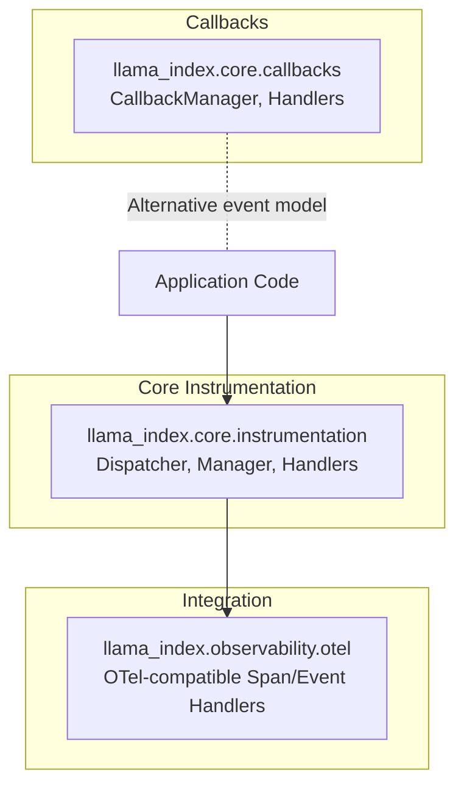
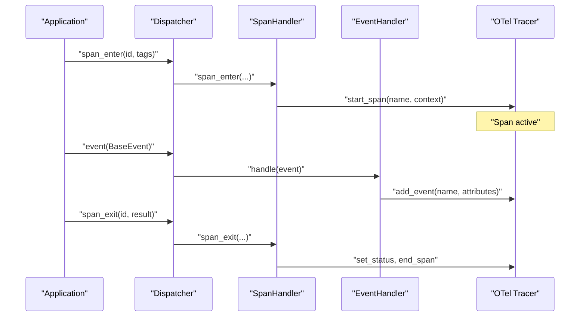
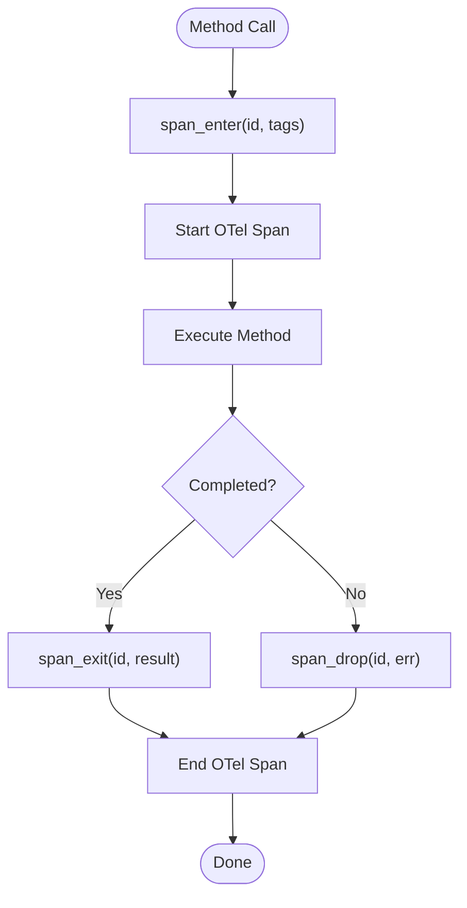
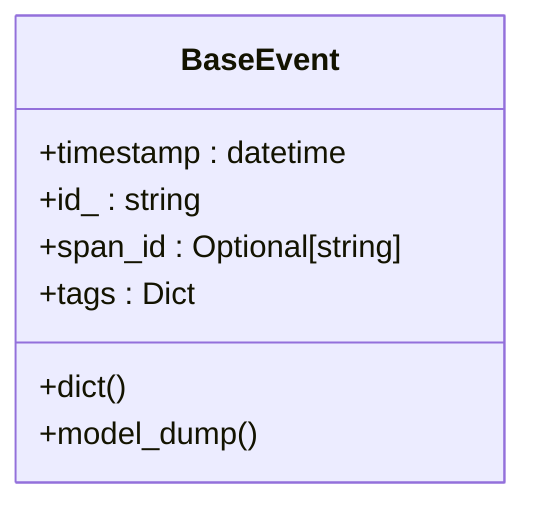
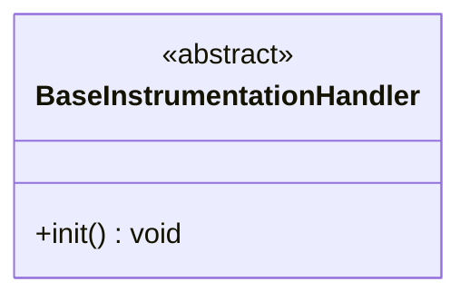
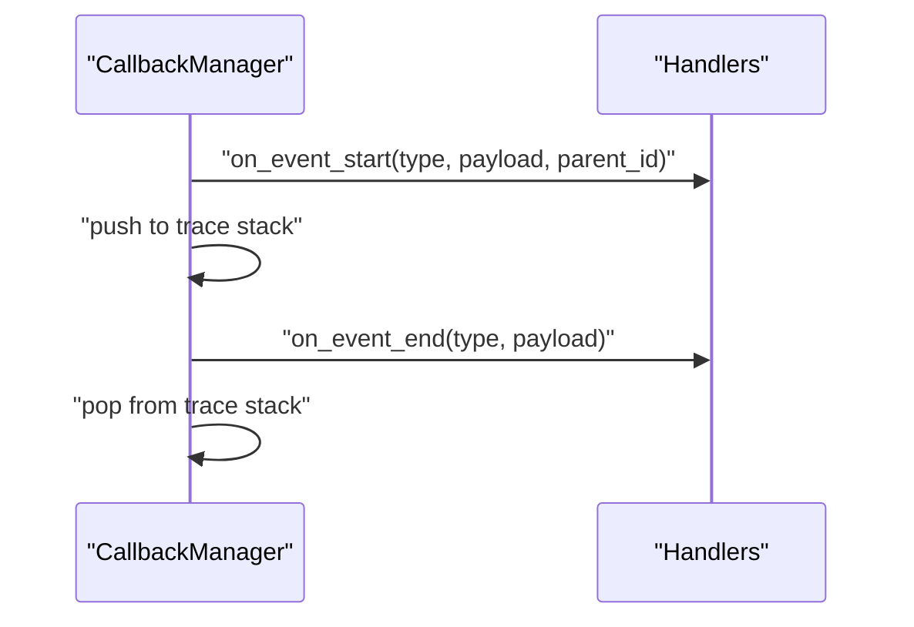
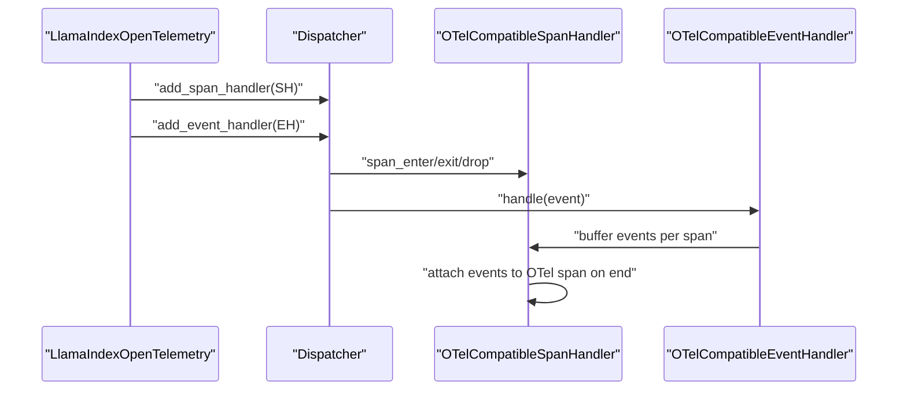
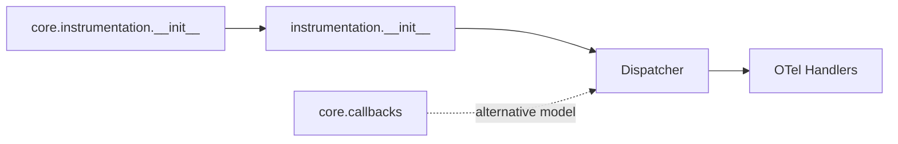

# Monitoring and Instrumentation

<cite>
**Referenced Files in This Document**
- [__init__.py](file://llama-index-core/llama_index/core/instrumentation/__init__.py)
- [dispatcher.py](file://llama-index-core/llama_index/core/instrumentation/dispatcher.py)
- [base_handler.py](file://llama-index-core/llama_index/core/instrumentation/base_handler.py)
- [__init__.py](file://llama-index-core/llama_index/core/callbacks/__init__.py)
- [base.py](file://llama-index-core/llama_index/core/callbacks/base.py)
- [__init__.py](file://llama-index-instrumentation/src/llama_index_instrumentation/__init__.py)
- [dispatcher.py](file://llama-index-instrumentation/src/llama_index_instrumentation/dispatcher.py)
- [event.py](file://llama-index-instrumentation/src/llama_index_instrumentation/base/event.py)
- [handler.py](file://llama-index-instrumentation/src/llama_index_instrumentation/base/handler.py)
- [base.py](file://llama-index-integrations/observability/llama-index-observability-otel/llama_index/observability/otel/base.py)
</cite>

## Table of Contents
1. [Introduction](#introduction)
2. [Project Structure](#project-structure)
3. [Core Components](#core-components)
4. [Architecture Overview](#architecture-overview)
5. [Detailed Component Analysis](#detailed-component-analysis)
6. [Dependency Analysis](#dependency-analysis)
7. [Performance Considerations](#performance-considerations)
8. [Troubleshooting Guide](#troubleshooting-guide)
9. [Conclusion](#conclusion)
10. [Appendices](#appendices)

## Introduction
This document explains how LlamaIndex implements observability and instrumentation for monitoring, tracing, and performance tracking. It covers the event tracking system, performance metrics collection, and custom instrumentation development. It documents the callback system (callback manager, custom handlers, event processing), and shows how to integrate with monitoring solutions, tracing systems, logging frameworks, and alerting mechanisms. Practical examples demonstrate production-grade setups, profiling, and troubleshooting workflows, including distributed tracing, metrics aggregation, log correlation, and dashboard integration.

## Project Structure
LlamaIndex’s observability is split across:
- Core instrumentation and dispatching: centralized under the instrumentation module
- Callback system for legacy-style event hooks
- Integration with OpenTelemetry via a dedicated observability package

**Diagram sources**
- [__init__.py](file://llama-index-core/llama_index/core/instrumentation/__init__.py#L1-L14)
- [dispatcher.py](file://llama-index-core/llama_index/core/instrumentation/dispatcher.py#L1-L9)
- [base.py](file://llama-index-core/llama_index/core/callbacks/base.py#L28-L303)
- [base.py](file://llama-index-integrations/observability/llama-index-observability-otel/llama_index/observability/otel/base.py#L209-L269)

**Section sources**
- [__init__.py](file://llama-index-core/llama_index/core/instrumentation/__init__.py#L1-L14)
- [dispatcher.py](file://llama-index-core/llama_index/core/instrumentation/dispatcher.py#L1-L9)
- [base.py](file://llama-index-core/llama_index/core/callbacks/base.py#L28-L303)
- [base.py](file://llama-index-integrations/observability/llama-index-observability-otel/llama_index/observability/otel/base.py#L209-L269)

## Core Components
- Dispatcher and Manager: central dispatching engine for events and spans, with hierarchical propagation and concurrency safety
- Span decorators: automatic tracing around method invocations with context propagation
- Event and Span handlers: pluggable components that receive notifications for span lifecycle and event emissions
- CallbackManager: legacy event-driven callback system for tracing and metrics collection
- OpenTelemetry integration: OTel-compatible span and event handlers to export telemetry to external systems

Key capabilities:
- Distributed tracing across threads and async tasks
- Event tagging and contextual metadata
- Automatic span creation and correlation with events
- Extensible handler model for logs, metrics, and tracing backends

**Section sources**
- [__init__.py](file://llama-index-instrumentation/src/llama_index_instrumentation/__init__.py#L13-L42)
- [dispatcher.py](file://llama-index-instrumentation/src/llama_index_instrumentation/dispatcher.py#L48-L426)
- [event.py](file://llama-index-instrumentation/src/llama_index_instrumentation/base/event.py#L10-L33)
- [handler.py](file://llama-index-instrumentation/src/llama_index_instrumentation/base/handler.py#L4-L9)
- [base.py](file://llama-index-core/llama_index/core/callbacks/base.py#L28-L303)
- [base.py](file://llama-index-integrations/observability/llama-index-observability-otel/llama_index/observability/otel/base.py#L44-L269)

## Architecture Overview
The instrumentation architecture centers on a dispatcher tree that routes events and span lifecycle signals to registered handlers. Handlers can be OTel-compatible, enabling seamless export to tracing backends. The callback system offers an alternative event model for metrics and debugging.

**Diagram sources**
- [dispatcher.py](file://llama-index-instrumentation/src/llama_index_instrumentation/dispatcher.py#L181-L263)
- [base.py](file://llama-index-integrations/observability/llama-index-observability-otel/llama_index/observability/otel/base.py#L83-L134)
- [base.py](file://llama-index-integrations/observability/llama-index-observability-otel/llama_index/observability/otel/base.py#L178-L207)

## Detailed Component Analysis

### Dispatcher and Span Lifecycle
The dispatcher coordinates span lifecycle and event dispatching. It maintains:
- Active span context for correlating events
- Hierarchical propagation to parent dispatchers
- Concurrency-safe context copying for threads and async tasks
- Decorators for automatic span wrapping around methods

**Diagram sources**
- [dispatcher.py](file://llama-index-instrumentation/src/llama_index_instrumentation/dispatcher.py#L264-L404)
- [base.py](file://llama-index-integrations/observability/llama-index-observability-otel/llama_index/observability/otel/base.py#L83-L134)

**Section sources**
- [dispatcher.py](file://llama-index-instrumentation/src/llama_index_instrumentation/dispatcher.py#L48-L426)
- [base.py](file://llama-index-integrations/observability/llama-index-observability-otel/llama_index/observability/otel/base.py#L44-L160)

### Event Tracking and Tagging
Events carry timestamps, identifiers, optional span association, and tags. Tags can be attached globally during instrumentation to enrich downstream handlers.

**Diagram sources**
- [event.py](file://llama-index-instrumentation/src/llama_index_instrumentation/base/event.py#L10-L33)

**Section sources**
- [event.py](file://llama-index-instrumentation/src/llama_index_instrumentation/base/event.py#L10-L33)
- [dispatcher.py](file://llama-index-instrumentation/src/llama_index_instrumentation/dispatcher.py#L34-L41)

### Handler Model and Custom Instrumentation
Handlers implement interfaces to receive span lifecycle and event notifications. The base handler interface defines initialization semantics. Custom instrumentation can be built by implementing these interfaces and registering them with a dispatcher.

**Diagram sources**
- [handler.py](file://llama-index-instrumentation/src/llama_index_instrumentation/base/handler.py#L4-L9)

**Section sources**
- [handler.py](file://llama-index-instrumentation/src/llama_index_instrumentation/base/handler.py#L4-L9)
- [__init__.py](file://llama-index-instrumentation/src/llama_index_instrumentation/__init__.py#L13-L42)

### Callback System (Legacy Event Hooks)
The callback manager provides a traditional event-driven model for tracing and metrics. It tracks event stacks, supports nested traces, and integrates with handlers for logging, token counting, and debugging.

**Diagram sources**
- [base.py](file://llama-index-core/llama_index/core/callbacks/base.py#L88-L143)

**Section sources**
- [__init__.py](file://llama-index-core/llama_index/core/callbacks/__init__.py#L1-L18)
- [base.py](file://llama-index-core/llama_index/core/callbacks/base.py#L28-L303)

### OpenTelemetry Integration
The OTel integration registers compatible span and event handlers with the dispatcher. It sets up a tracer provider, attaches span processors, and exports spans to configured exporters. Events are buffered per span and attached to OTel spans upon completion.

**Diagram sources**
- [base.py](file://llama-index-integrations/observability/llama-index-observability-otel/llama_index/observability/otel/base.py#L209-L269)
- [base.py](file://llama-index-integrations/observability/llama-index-observability-otel/llama_index/observability/otel/base.py#L44-L160)
- [base.py](file://llama-index-integrations/observability/llama-index-observability-otel/llama_index/observability/otel/base.py#L162-L207)

**Section sources**
- [base.py](file://llama-index-integrations/observability/llama-index-observability-otel/llama_index/observability/otel/base.py#L209-L269)

## Dependency Analysis
- Core instrumentation re-exports dispatcher and manager from the instrumentation package, enabling unified access
- Callback system remains independent but interoperates with instrumentation via shared event types
- OTel integration depends on core instrumentation and registers handlers with the dispatcher

**Diagram sources**
- [__init__.py](file://llama-index-core/llama_index/core/instrumentation/__init__.py#L1-L14)
- [__init__.py](file://llama-index-instrumentation/src/llama_index_instrumentation/__init__.py#L1-L12)
- [base.py](file://llama-index-core/llama_index/core/callbacks/base.py#L28-L303)
- [base.py](file://llama-index-integrations/observability/llama-index-observability-otel/llama_index/observability/otel/base.py#L209-L269)

**Section sources**
- [__init__.py](file://llama-index-core/llama_index/core/instrumentation/__init__.py#L1-L14)
- [__init__.py](file://llama-index-instrumentation/src/llama_index_instrumentation/__init__.py#L1-L12)
- [base.py](file://llama-index-core/llama_index/core/callbacks/base.py#L28-L303)
- [base.py](file://llama-index-integrations/observability/llama-index-observability-otel/llama_index/observability/otel/base.py#L209-L269)

## Performance Considerations
- Asynchronous event dispatching uses non-blocking tasks to avoid blocking the main execution path
- Span decorators support both sync and async functions and handle futures correctly
- Context copying ensures thread and coroutine safety without global locks
- OTel integration batches spans for efficient export; choose “batch” processor for production and “simple” for debugging
- Event tagging avoids expensive serialization by falling back to string representation when needed

[No sources needed since this section provides general guidance]

## Troubleshooting Guide
Common issues and remedies:
- No events appear in tracing: ensure a span handler is registered and active; verify the dispatcher is initialized and handlers are attached
- Events missing on span end: confirm span lifecycle methods are invoked and OTel span handler is buffering events until completion
- Duplicate spans on inheritance: use the provided mixin to automatically decorate overridden methods consistently
- Debugging spans: enable debug mode on OTel-compatible handlers to print span start/end and event registration messages
- Callback vs instrumentation mismatch: use the appropriate model depending on whether you need legacy-style callbacks or modern instrumentation

**Section sources**
- [base.py](file://llama-index-integrations/observability/llama-index-observability-otel/llama_index/observability/otel/base.py#L54-L57)
- [dispatcher.py](file://llama-index-instrumentation/src/llama_index_instrumentation/dispatcher.py#L44-L84)
- [base.py](file://llama-index-integrations/observability/llama-index-observability-otel/llama_index/observability/otel/base.py#L101-L107)

## Conclusion
LlamaIndex provides a robust observability framework combining modern instrumentation with a flexible handler model and a mature callback system. The dispatcher-based approach enables distributed tracing, event tagging, and seamless integration with OpenTelemetry. By leveraging OTel-compatible handlers, teams can export telemetry to production-grade backends, correlate logs and traces, and build dashboards for operational excellence.

[No sources needed since this section summarizes without analyzing specific files]

## Appendices

### Practical Setup Examples
- Enable OpenTelemetry integration: initialize the OTel integration, configure the exporter and processor, and register handlers with the dispatcher
- Add custom instrumentation: implement a custom span or event handler, attach it to the dispatcher, and use span decorators on target methods
- Production deployment checklist:
  - Choose “batch” span processor and a production exporter
  - Set service name/resource appropriately
  - Use event tagging for contextual metadata
  - Correlate logs with trace IDs and span IDs
  - Monitor span durations and error rates via dashboards

**Section sources**
- [base.py](file://llama-index-integrations/observability/llama-index-observability-otel/llama_index/observability/otel/base.py#L209-L269)
- [dispatcher.py](file://llama-index-instrumentation/src/llama_index_instrumentation/dispatcher.py#L264-L404)
- [event.py](file://llama-index-instrumentation/src/llama_index_instrumentation/base/event.py#L10-L33)