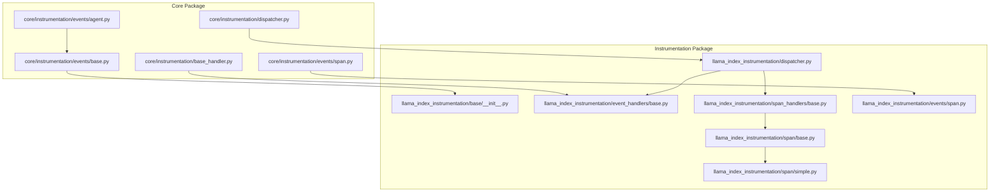
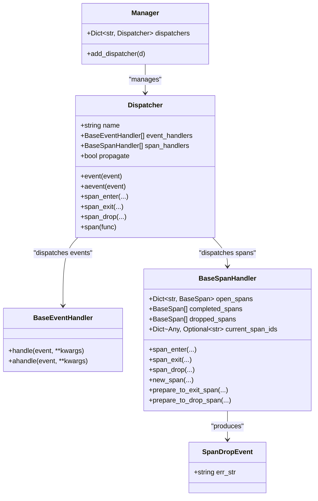
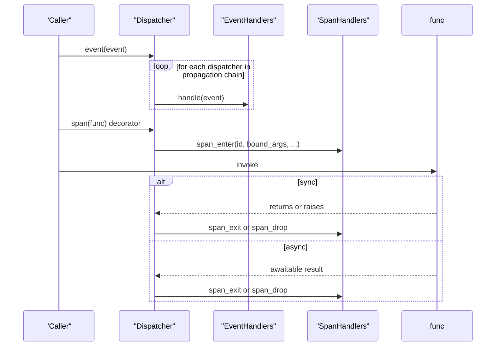
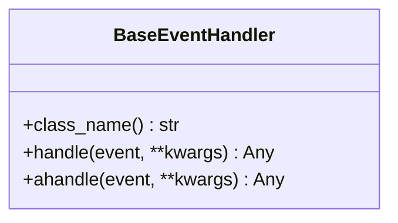
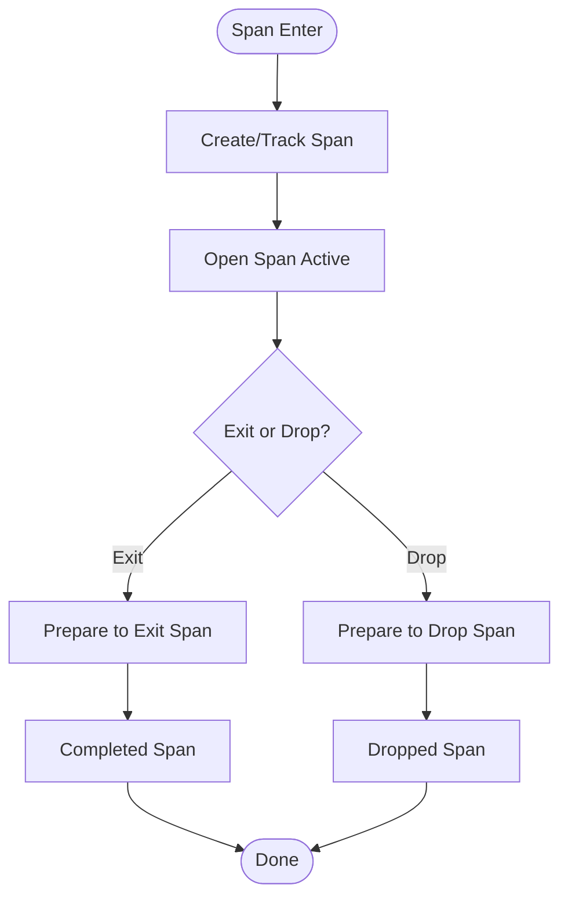
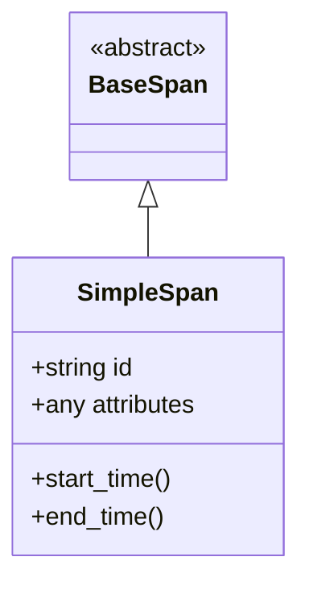
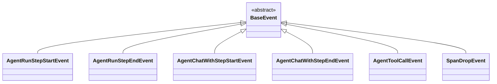
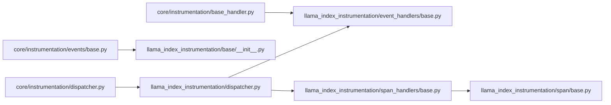

# Observability Framework and Event Tracking

<cite>
**Referenced Files in This Document**
- [dispatcher.py](file://llama-index-instrumentation/src/llama_index_instrumentation/dispatcher.py)
- [base.py](file://llama-index-instrumentation/src/llama_index_instrumentation/base/__init__.py)
- [event_handlers/base.py](file://llama-index-instrumentation/src/llama_index_instrumentation/event_handlers/base.py)
- [span_handlers/base.py](file://llama-index-instrumentation/src/llama_index_instrumentation/span_handlers/base.py)
- [events/span.py](file://llama-index-instrumentation/src/llama_index_instrumentation/events/span.py)
- [span/base.py](file://llama-index-instrumentation/src/llama_index_instrumentation/span/base.py)
- [span/simple.py](file://llama-index-instrumentation/src/llama_index_instrumentation/span/simple.py)
- [dispatcher.py](file://llama-index-core/llama_index/core/instrumentation/dispatcher.py)
- [base_handler.py](file://llama-index-core/llama_index/core/instrumentation/base_handler.py)
- [events/base.py](file://llama-index-core/llama_index/core/instrumentation/events/base.py)
- [events/span.py](file://llama-index-core/llama_index/core/instrumentation/events/span.py)
- [events/agent.py](file://llama-index-core/llama_index/core/instrumentation/events/agent.py)
- [observability/otel/README.md](file://llama-index-integrations/observability/llama-index-observability-otel/README.md)
- [examples/observability/Langfuse-Instrumentation.ipynb](file://docs/examples/observability/Langfuse-Instrumentation.ipynb)
- [examples/observability/OpenInferenceCallback.ipynb](file://docs/examples/observability/OpenInferenceCallback.ipynb)
- [examples/observability/OpenLLMetry.ipynb](file://docs/examples/observability/OpenLLMetry.ipynb)
- [examples/observability/WandbCallbackHandler.ipynb](file://docs/examples/observability/WandbCallbackHandler.ipynb)
- [examples/observability/OpikCallback.ipynb](file://docs/examples/observability/OpikCallback.ipynb)
- [examples/observability/AimCallback.ipynb](file://docs/examples/observability/AimCallback.ipynb)
- [examples/observability/HoneyHiveLlamaIndexTracer.ipynb](file://docs/examples/observability/HoneyHiveLlamaIndexTracer.ipynb)
- [examples/observability/TokenCountingHandler.ipynb](file://docs/examples/observability/TokenCountingHandler.ipynb)
- [examples/observability/PromptLayerHandler.ipynb](file://docs/examples/observability/PromptLayerHandler.ipynb)
- [examples/observability/MLflow.ipynb](file://docs/examples/observability/MLflow.ipynb)
- [examples/observability/Deepeval.ipynb](file://docs/examples/observability/Deepeval.ipynb)
- [examples/observability/UpTrainCallback.ipynb](file://docs/examples/observability/UpTrainCallback.ipynb)
- [examples/observability/LlamaDebugHandler.ipynb](file://docs/examples/observability/LlamaDebugHandler.ipynb)
</cite>

## Table of Contents
1. [Introduction](#introduction)
2. [Project Structure](#project-structure)
3. [Core Components](#core-components)
4. [Architecture Overview](#architecture-overview)
5. [Detailed Component Analysis](#detailed-component-analysis)
6. [Dependency Analysis](#dependency-analysis)
7. [Performance Considerations](#performance-considerations)
8. [Troubleshooting Guide](#troubleshooting-guide)
9. [Conclusion](#conclusion)
10. [Appendices](#appendices)

## Introduction
This document explains the LlamaIndex observability framework and event tracking system. It covers the instrumentation architecture, the dispatcher pattern, event and span lifecycle, and how to integrate with external observability platforms. It also provides practical guidance for distributed tracing, performance monitoring, custom event collection, filtering, sampling, and building custom handlers for tools such as OpenTelemetry, Langfuse, and other monitoring solutions.

## Project Structure
The observability system is split into two complementary packages:
- Core instrumentation APIs and event types exposed via the core package
- Instrumentation primitives, dispatcher, and handler abstractions in the instrumentation package

Key areas:
- Dispatcher and Manager orchestrate event and span dispatching across handler chains
- Event handlers process discrete events (e.g., agent steps, queries, embeddings)
- Span handlers manage tracing spans (enter, exit, drop) and maintain span state
- Example integrations demonstrate usage with popular observability tools

**Diagram sources**
- [dispatcher.py](file://llama-index-core/llama_index/core/instrumentation/dispatcher.py#L1-L9)
- [dispatcher.py](file://llama-index-instrumentation/src/llama_index_instrumentation/dispatcher.py#L1-L426)
- [base.py](file://llama-index-core/llama_index/core/instrumentation/events/base.py#L1-L2)
- [events/span.py](file://llama-index-core/llama_index/core/instrumentation/events/span.py#L1-L2)
- [events/agent.py](file://llama-index-core/llama_index/core/instrumentation/events/agent.py#L1-L132)
- [base.py](file://llama-index-instrumentation/src/llama_index_instrumentation/base/__init__.py#L1-L8)
- [event_handlers/base.py](file://llama-index-instrumentation/src/llama_index_instrumentation/event_handlers/base.py#L1-L25)
- [span_handlers/base.py](file://llama-index-instrumentation/src/llama_index_instrumentation/span_handlers/base.py#L1-L197)
- [events/span.py](file://llama-index-instrumentation/src/llama_index_instrumentation/events/span.py#L1-L19)
- [span/base.py](file://llama-index-instrumentation/src/llama_index_instrumentation/span/base.py#L1-L200)
- [span/simple.py](file://llama-index-instrumentation/src/llama_index_instrumentation/span/simple.py#L1-L200)

**Section sources**
- [dispatcher.py](file://llama-index-core/llama_index/core/instrumentation/dispatcher.py#L1-L9)
- [dispatcher.py](file://llama-index-instrumentation/src/llama_index_instrumentation/dispatcher.py#L1-L426)

## Core Components
- Dispatcher: Central orchestrator for events and spans; supports propagation to parent dispatchers and concurrent handler execution
- Event handlers: Implement event processing logic for discrete events
- Span handlers: Manage tracing spans, including creation, completion, and early drop
- Span lifecycle: Enter, exit, and drop notifications with support for sync and async contexts
- Event types: Typed events for agents, queries, embeddings, reranking, retrieval, synthesis, and spans

Key responsibilities:
- Event dispatching: Synchronous and asynchronous handler invocation
- Span management: Context-aware span creation with hierarchical parent-child relationships
- Handler chaining: Propagation across dispatcher hierarchy
- Thread safety: Lock-protected span collections and context copying for threads

**Section sources**
- [dispatcher.py](file://llama-index-instrumentation/src/llama_index_instrumentation/dispatcher.py#L48-L426)
- [event_handlers/base.py](file://llama-index-instrumentation/src/llama_index_instrumentation/event_handlers/base.py#L9-L25)
- [span_handlers/base.py](file://llama-index-instrumentation/src/llama_index_instrumentation/span_handlers/base.py#L46-L197)
- [events/span.py](file://llama-index-instrumentation/src/llama_index_instrumentation/events/span.py#L4-L19)
- [events/agent.py](file://llama-index-core/llama_index/core/instrumentation/events/agent.py#L13-L132)

## Architecture Overview
The observability architecture follows a dispatcher pattern with two handler categories:
- Event handlers: consume discrete events (e.g., agent steps, query start/end)
- Span handlers: manage tracing spans around function calls

**Diagram sources**
- [dispatcher.py](file://llama-index-instrumentation/src/llama_index_instrumentation/dispatcher.py#L48-L426)
- [span_handlers/base.py](file://llama-index-instrumentation/src/llama_index_instrumentation/span_handlers/base.py#L46-L197)
- [events/span.py](file://llama-index-instrumentation/src/llama_index_instrumentation/events/span.py#L4-L19)

## Detailed Component Analysis

### Dispatcher and Manager
- Responsibilities:
  - Dispatch events to all attached event handlers, optionally propagating to parent dispatchers
  - Dispatch span lifecycle events to span handlers
  - Support synchronous and asynchronous event delivery
  - Decorate functions to automatically emit span enter/exit/drop events
  - Manage a tree of dispatchers via a Manager

- Concurrency and context:
  - Uses context copying for thread-safe span tracking
  - Supports both sync and async wrappers for decorated functions
  - Maintains active span ID per context

**Diagram sources**
- [dispatcher.py](file://llama-index-instrumentation/src/llama_index_instrumentation/dispatcher.py#L126-L262)
- [dispatcher.py](file://llama-index-instrumentation/src/llama_index_instrumentation/dispatcher.py#L264-L404)

**Section sources**
- [dispatcher.py](file://llama-index-instrumentation/src/llama_index_instrumentation/dispatcher.py#L48-L117)
- [dispatcher.py](file://llama-index-instrumentation/src/llama_index_instrumentation/dispatcher.py#L126-L262)
- [dispatcher.py](file://llama-index-instrumentation/src/llama_index_instrumentation/dispatcher.py#L264-L404)

### Event Handlers
- Purpose: Implement event processing logic for discrete events
- Contract: Synchronous handle and optional async ahandle
- Typical usage: Persist events, forward to external systems, or compute metrics

**Diagram sources**
- [event_handlers/base.py](file://llama-index-instrumentation/src/llama_index_instrumentation/event_handlers/base.py#L9-L25)

**Section sources**
- [event_handlers/base.py](file://llama-index-instrumentation/src/llama_index_instrumentation/event_handlers/base.py#L9-L25)

### Span Handlers
- Purpose: Manage tracing spans with lifecycle hooks
- State: Tracks open, completed, and dropped spans; thread-safe via locks
- Lifecycle: span_enter, prepare_to_exit_span, prepare_to_drop_span
- Thread support: Custom Thread wrapper copies context for thread-safe span tracking

**Diagram sources**
- [span_handlers/base.py](file://llama-index-instrumentation/src/llama_index_instrumentation/span_handlers/base.py#L88-L143)

**Section sources**
- [span_handlers/base.py](file://llama-index-instrumentation/src/llama_index_instrumentation/span_handlers/base.py#L46-L197)

### Span Types and Base Span
- BaseSpan: Abstract span interface used by span handlers
- SimpleSpan: Concrete span implementation for basic tracing needs

**Diagram sources**
- [span/base.py](file://llama-index-instrumentation/src/llama_index_instrumentation/span/base.py#L1-L200)
- [span/simple.py](file://llama-index-instrumentation/src/llama_index_instrumentation/span/simple.py#L1-L200)

**Section sources**
- [span/base.py](file://llama-index-instrumentation/src/llama_index_instrumentation/span/base.py#L1-L200)
- [span/simple.py](file://llama-index-instrumentation/src/llama_index_instrumentation/span/simple.py#L1-L200)

### Event Types
- Agent events: AgentRunStepStartEvent, AgentRunStepEndEvent, AgentChatWithStepStartEvent, AgentChatWithStepEndEvent, AgentToolCallEvent
- SpanDropEvent: Emitted when a span is dropped due to an exception

**Diagram sources**
- [events/agent.py](file://llama-index-core/llama_index/core/instrumentation/events/agent.py#L13-L132)
- [events/span.py](file://llama-index-instrumentation/src/llama_index_instrumentation/events/span.py#L4-L19)

**Section sources**
- [events/agent.py](file://llama-index-core/llama_index/core/instrumentation/events/agent.py#L13-L132)
- [events/span.py](file://llama-index-instrumentation/src/llama_index_instrumentation/events/span.py#L4-L19)

### Integration with External Observability Platforms
- OpenTelemetry: Use the dedicated integration package for emitting traces and metrics
- Langfuse: Instrumentation examples show how to capture and forward spans/events
- OpenInference: Callback integration for standardized LLM observability
- Other tools: Wandb, Opik, Aim, HoneyHive, PromptLayer, MLflow, UpTrain, Deepeval, LlamaDebug

Practical guidance:
- Initialize a Dispatcher and attach span handlers that export to your platform
- Optionally attach event handlers for custom event collection
- Use the span decorator on functions to automatically capture traces
- Configure sampling and filtering at the handler level

**Section sources**
- [observability/otel/README.md](file://llama-index-integrations/observability/llama-index-observability-otel/README.md)
- [examples/observability/Langfuse-Instrumentation.ipynb](file://docs/examples/observability/Langfuse-Instrumentation.ipynb)
- [examples/observability/OpenInferenceCallback.ipynb](file://docs/examples/observability/OpenInferenceCallback.ipynb)
- [examples/observability/OpenLLMetry.ipynb](file://docs/examples/observability/OpenLLMetry.ipynb)
- [examples/observability/WandbCallbackHandler.ipynb](file://docs/examples/observability/WandbCallbackHandler.ipynb)
- [examples/observability/OpikCallback.ipynb](file://docs/examples/observability/OpikCallback.ipynb)
- [examples/observability/AimCallback.ipynb](file://docs/examples/observability/AimCallback.ipynb)
- [examples/observability/HoneyHiveLlamaIndexTracer.ipynb](file://docs/examples/observability/HoneyHiveLlamaIndexTracer.ipynb)
- [examples/observability/TokenCountingHandler.ipynb](file://docs/examples/observability/TokenCountingHandler.ipynb)
- [examples/observability/PromptLayerHandler.ipynb](file://docs/examples/observability/PromptLayerHandler.ipynb)
- [examples/observability/MLflow.ipynb](file://docs/examples/observability/MLflow.ipynb)
- [examples/observability/Deepeval.ipynb](file://docs/examples/observability/Deepeval.ipynb)
- [examples/observability/UpTrainCallback.ipynb](file://docs/examples/observability/UpTrainCallback.ipynb)
- [examples/observability/LlamaDebugHandler.ipynb](file://docs/examples/observability/LlamaDebugHandler.ipynb)

## Dependency Analysis
- Core instrumentation re-exports dispatcher, handlers, and event types from the instrumentation package
- Dispatcher depends on BaseEvent, BaseEventHandler, BaseSpanHandler, and span utilities
- Span handlers depend on BaseSpan and thread utilities for context copying

**Diagram sources**
- [dispatcher.py](file://llama-index-core/llama_index/core/instrumentation/dispatcher.py#L1-L9)
- [base.py](file://llama-index-core/llama_index/core/instrumentation/events/base.py#L1-L2)
- [base_handler.py](file://llama-index-core/llama_index/core/instrumentation/base_handler.py#L1-L2)
- [dispatcher.py](file://llama-index-instrumentation/src/llama_index_instrumentation/dispatcher.py#L1-L426)
- [base.py](file://llama-index-instrumentation/src/llama_index_instrumentation/base/__init__.py#L1-L8)
- [event_handlers/base.py](file://llama-index-instrumentation/src/llama_index_instrumentation/event_handlers/base.py#L1-L25)
- [span_handlers/base.py](file://llama-index-instrumentation/src/llama_index_instrumentation/span_handlers/base.py#L1-L197)
- [span/base.py](file://llama-index-instrumentation/src/llama_index_instrumentation/span/base.py#L1-L200)

**Section sources**
- [dispatcher.py](file://llama-index-core/llama_index/core/instrumentation/dispatcher.py#L1-L9)
- [base.py](file://llama-index-core/llama_index/core/instrumentation/events/base.py#L1-L2)
- [base_handler.py](file://llama-index-core/llama_index/core/instrumentation/base_handler.py#L1-L2)
- [dispatcher.py](file://llama-index-instrumentation/src/llama_index_instrumentation/dispatcher.py#L1-L426)

## Performance Considerations
- Handler overhead: Each event and span dispatch invokes all handlers; keep handlers efficient and avoid heavy I/O
- Asynchronous dispatch: Use aevent and async span wrappers to minimize blocking
- Propagation cost: Disabling propagation reduces handler traversal across dispatcher hierarchies
- Span state: Lock-protected collections prevent contention but add synchronization overhead; batch exports where possible
- Context copying: Thread wrapper copies context for thread safety; avoid excessive thread spawning
- Sampling: Implement sampling at the handler level to reduce telemetry volume

[No sources needed since this section provides general guidance]

## Troubleshooting Guide
Common issues and remedies:
- Exceptions during span exit: SpanDropEvent is emitted and span_drop is invoked; ensure handlers handle drops gracefully
- Context mismatches: When resetting active span ID fails due to context differences, logs a debug message; verify context usage in async/sync mixed environments
- Handler exceptions: Dispatcher and span handlers catch and suppress exceptions to avoid breaking caller code; review handler logs for failures
- Propagation behavior: Verify propagate flag to control whether events/spans reach parent dispatchers

**Section sources**
- [dispatcher.py](file://llama-index-instrumentation/src/llama_index_instrumentation/dispatcher.py#L318-L333)
- [dispatcher.py](file://llama-index-instrumentation/src/llama_index_instrumentation/dispatcher.py#L137-L138)
- [dispatcher.py](file://llama-index-instrumentation/src/llama_index_instrumentation/dispatcher.py#L203-L204)
- [dispatcher.py](file://llama-index-instrumentation/src/llama_index_instrumentation/dispatcher.py#L230-L231)

## Conclusion
The LlamaIndex observability framework provides a robust, extensible dispatcher-based system for capturing events and tracing spans. With clear handler abstractions, context-aware span management, and integration examples for popular observability tools, teams can implement distributed tracing, performance monitoring, and custom event collection tailored to their needs. Careful attention to handler efficiency, propagation, and sampling ensures minimal performance impact while maintaining rich observability.

[No sources needed since this section summarizes without analyzing specific files]

## Appendices

### Practical Setup Examples
- Distributed tracing: Use span decorators on critical functions and attach a span handler that exports to your platform
- Performance monitoring: Combine event handlers for latency and error metrics with span handlers for end-to-end traces
- Custom event collection: Implement BaseEventHandler to persist domain-specific events to your backend
- Sampling and filtering: Apply sampling logic inside handlers or pre-filter events before dispatching

[No sources needed since this section provides general guidance]