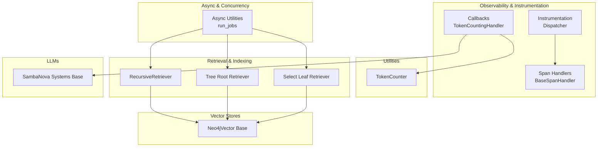
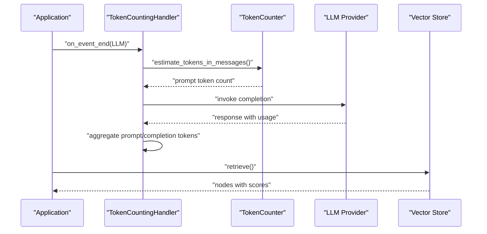
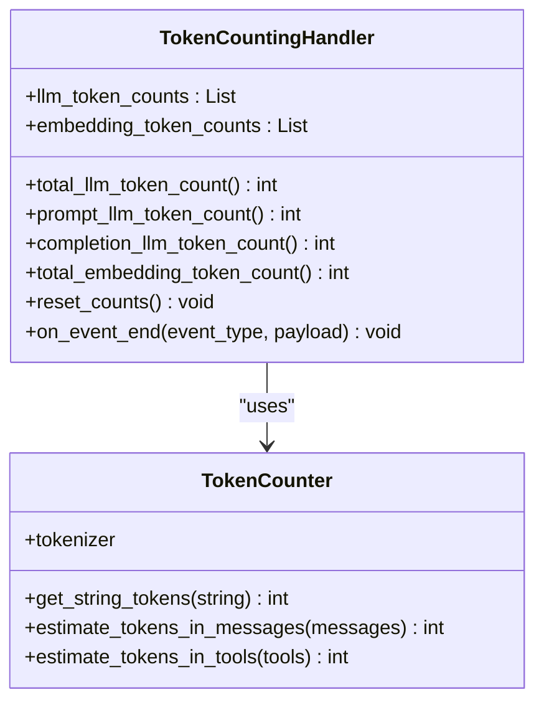
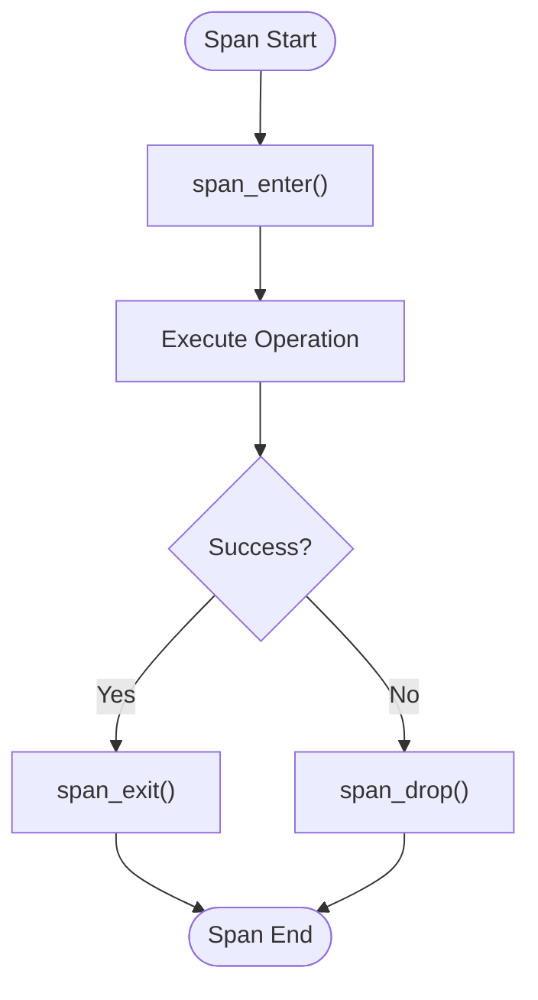
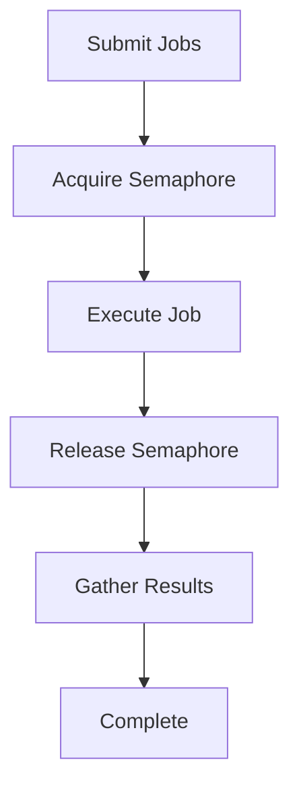
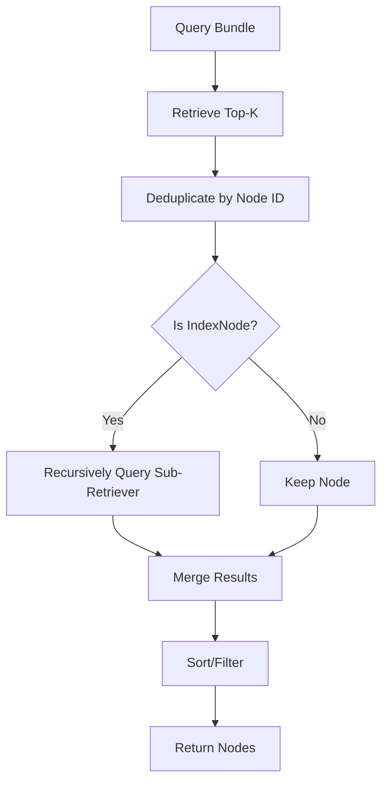
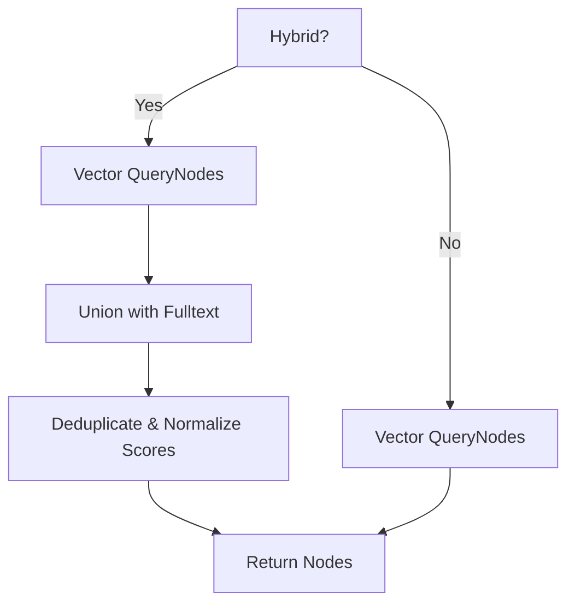
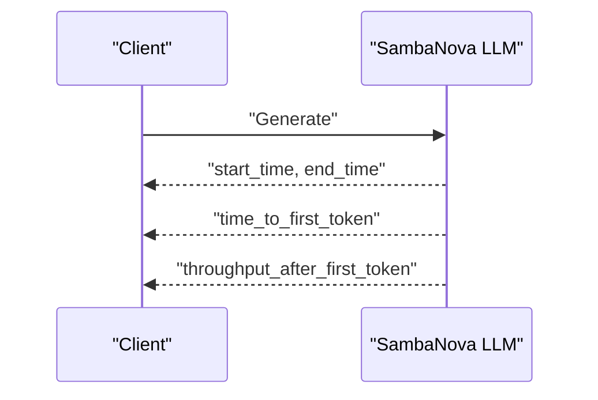
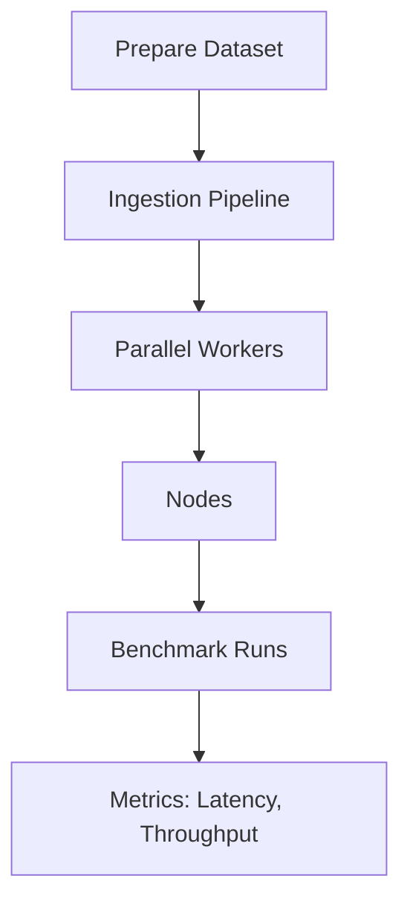
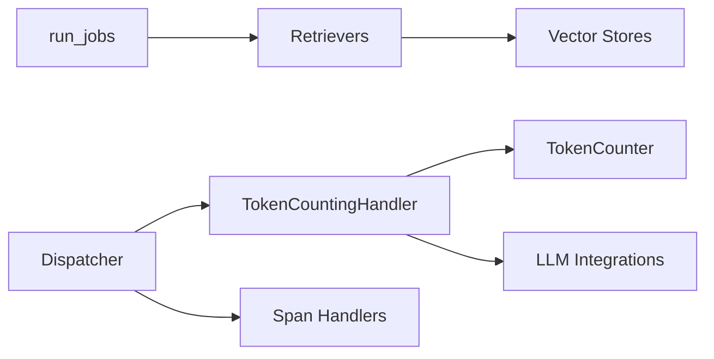

# Performance Optimization and Profiling

<cite>
**Referenced Files in This Document**
- [token_counting.py](file://llama-index-core/llama_index/core/callbacks/token_counting.py)
- [token_counting.py](file://llama-index-core/llama_index/core/utilities/token_counting.py)
- [token_counting_migration.md](file://docs/src/content/docs/framework/module_guides/observability/callbacks/token_counting_migration.md)
- [dispatcher.py](file://llama-index-instrumentation/src/llama_index_instrumentation/dispatcher.py)
- [base.py](file://llama-index-integrations/observability/llama-index-observability-otel/src/llama_index/observability/otel/base.py)
- [async_utils.py](file://llama-index-core/llama_index/core/async_utils.py)
- [parallel_execution_ingestion_pipeline.ipynb](file://docs/examples/ingestion/parallel_execution_ingestion_pipeline.ipynb)
- [recursive_retriever.py](file://llama-index-core/llama_index/core/retrievers/recursive_retriever.py)
- [tree_root_retriever.py](file://llama-index-core/llama_index/core/indices/tree/tree_root_retriever.py)
- [select_leaf_retriever.py](file://llama-index-core/llama_index/core/indices/tree/select_leaf_retriever.py)
- [base.py](file://llama-index-integrations/vector_stores/llama-index-vector-stores-neo4jvector/src/llama_index/vector_stores/neo4jvector/base.py)
- [base.py](file://llama-index-integrations/llms/llama-index-llms-sambanovasystems/src/llama_index/llms/sambanovasystems/base.py)
- [base.py](file://llama-index-core/llama_index/core/callbacks/base.py)
- [base.py](file://llama-index-instrumentation/src/llama_index_instrumentation/span_handlers/base.py)
- [base.py](file://llama-index-core/llama_index/core/playground/base.py)
- [README.md](file://llama-datasets/mini_mt_bench_singlegrading/README.md)
- [baselines.py](file://llama-datasets/mini_mt_bench_singlegrading/baselines.py)
- [README.md](file://llama-datasets/mt_bench_humanjudgement/README.md)
- [README.md](file://docs/src/content/docs/framework/getting_started/async_python.md)
</cite>

## Table of Contents
1. [Introduction](#introduction)
2. [Project Structure](#project-structure)
3. [Core Components](#core-components)
4. [Architecture Overview](#architecture-overview)
5. [Detailed Component Analysis](#detailed-component-analysis)
6. [Dependency Analysis](#dependency-analysis)
7. [Performance Considerations](#performance-considerations)
8. [Troubleshooting Guide](#troubleshooting-guide)
9. [Conclusion](#conclusion)
10. [Appendices](#appendices)

## Introduction
This document provides a comprehensive guide to performance optimization and profiling in LlamaIndex applications. It explains token counting mechanisms, cost monitoring, and resource utilization tracking. It covers performance profiling techniques, bottleneck identification, and optimization strategies for retrieval, indexing, and query processing workflows. It also details memory management, caching strategies, and concurrent execution patterns, and includes practical examples for benchmarking, load testing, and capacity planning. Finally, it outlines monitoring KPIs, latency optimization, throughput improvements, production monitoring, alerting, and automated scaling considerations.

## Project Structure
LlamaIndex’s performance-related capabilities are distributed across several modules:
- Token counting and cost monitoring via callbacks and utilities
- Instrumentation and tracing via a dispatcher and span handlers
- Asynchronous execution utilities and concurrency controls
- Retrieval and indexing components with performance-sensitive paths
- Vector store integrations with query performance characteristics
- Benchmark datasets and notebooks for load testing and capacity planning

**Diagram sources**
- [token_counting.py](file://llama-index-core/llama_index/core/callbacks/token_counting.py#L143-L270)
- [token_counting.py](file://llama-index-core/llama_index/core/utilities/token_counting.py#L10-L104)
- [dispatcher.py](file://llama-index-instrumentation/src/llama_index_instrumentation/dispatcher.py#L48-L426)
- [base.py](file://llama-index-instrumentation/src/llama_index_instrumentation/span_handlers/base.py#L167-L196)
- [async_utils.py](file://llama-index-core/llama_index/core/async_utils.py#L137-L174)
- [recursive_retriever.py](file://llama-index-core/llama_index/core/retrievers/recursive_retriever.py#L71-L108)
- [tree_root_retriever.py](file://llama-index-core/llama_index/core/indices/tree/tree_root_retriever.py#L39-L50)
- [select_leaf_retriever.py](file://llama-index-core/llama_index/core/indices/tree/select_leaf_retriever.py#L402-L428)
- [base.py](file://llama-index-integrations/vector_stores/llama-index-vector-stores-neo4jvector/src/llama_index/vector_stores/neo4jvector/base.py#L41-L76)
- [base.py](file://llama-index-integrations/llms/llama-index-llms-sambanovasystems/src/llama_index/llms/sambanovasystems/base.py#L1319-L1340)

**Section sources**
- [token_counting.py](file://llama-index-core/llama_index/core/callbacks/token_counting.py#L1-L270)
- [token_counting.py](file://llama-index-core/llama_index/core/utilities/token_counting.py#L1-L104)
- [dispatcher.py](file://llama-index-instrumentation/src/llama_index_instrumentation/dispatcher.py#L1-L426)
- [base.py](file://llama-index-instrumentation/src/llama_index_instrumentation/span_handlers/base.py#L167-L196)
- [async_utils.py](file://llama-index-core/llama_index/core/async_utils.py#L112-L174)
- [recursive_retriever.py](file://llama-index-core/llama_index/core/retrievers/recursive_retriever.py#L71-L108)
- [tree_root_retriever.py](file://llama-index-core/llama_index/core/indices/tree/tree_root_retriever.py#L39-L50)
- [select_leaf_retriever.py](file://llama-index-core/llama_index/core/indices/tree/select_leaf_retriever.py#L402-L428)
- [base.py](file://llama-index-integrations/vector_stores/llama-index-vector-stores-neo4jvector/src/llama_index/vector_stores/neo4jvector/base.py#L41-L76)
- [base.py](file://llama-index-integrations/llms/llama-index-llms-sambanovasystems/src/llama_index/llms/sambanovasystems/base.py#L1319-L1340)

## Core Components
- Token counting and cost monitoring:
  - TokenCountingHandler callback aggregates LLM and embedding token usage and exposes totals for cost tracking.
  - TokenCounter utility estimates tokens for messages and tools.
- Instrumentation and tracing:
  - Dispatcher manages span lifecycle and dispatches events to handlers.
  - Span handlers define enter/exit/drop behavior for spans.
- Concurrency and async execution:
  - run_jobs orchestrates bounded concurrency with semaphores and optional progress bars.
- Retrieval and indexing:
  - Retrievers and tree-based indexers expose performance-sensitive paths for optimization.
- Vector stores:
  - Store-specific query logic impacts retrieval performance and throughput.
- LLM providers:
  - Provider integrations expose timing metrics useful for latency optimization.

**Section sources**
- [token_counting.py](file://llama-index-core/llama_index/core/callbacks/token_counting.py#L143-L270)
- [token_counting.py](file://llama-index-core/llama_index/core/utilities/token_counting.py#L10-L104)
- [dispatcher.py](file://llama-index-instrumentation/src/llama_index_instrumentation/dispatcher.py#L181-L326)
- [base.py](file://llama-index-instrumentation/src/llama_index_instrumentation/span_handlers/base.py#L167-L196)
- [async_utils.py](file://llama-index-core/llama_index/core/async_utils.py#L137-L174)
- [recursive_retriever.py](file://llama-index-core/llama_index/core/retrievers/recursive_retriever.py#L71-L108)
- [tree_root_retriever.py](file://llama-index-core/llama_index/core/indices/tree/tree_root_retriever.py#L39-L50)
- [select_leaf_retriever.py](file://llama-index-core/llama_index/core/indices/tree/select_leaf_retriever.py#L402-L428)
- [base.py](file://llama-index-integrations/vector_stores/llama-index-vector-stores-neo4jvector/src/llama_index/vector_stores/neo4jvector/base.py#L41-L76)
- [base.py](file://llama-index-integrations/llms/llama-index-llms-sambanovasystems/src/llama_index/llms/sambanovasystems/base.py#L1319-L1340)

## Architecture Overview
The performance architecture centers on callbacks and instrumentation to capture token usage and timing, combined with async orchestration and bounded concurrency to improve throughput. Retrieval and indexing paths are optimized via deduplication, recursive traversal, and efficient vector store queries.

**Diagram sources**
- [token_counting.py](file://llama-index-core/llama_index/core/callbacks/token_counting.py#L79-L141)
- [token_counting.py](file://llama-index-core/llama_index/core/utilities/token_counting.py#L35-L85)
- [base.py](file://llama-index-integrations/llms/llama-index-llms-sambanovasystems/src/llama_index/llms/sambanovasystems/base.py#L1319-L1340)

## Detailed Component Analysis

### Token Counting and Cost Monitoring
- TokenCountingHandler:
  - Captures LLM prompt/completion tokens and embedding chunk tokens.
  - Provides totals for cost monitoring and budgeting.
- TokenCounter:
  - Estimates tokens for messages and tools to support pre-execution cost estimation.

**Diagram sources**
- [token_counting.py](file://llama-index-core/llama_index/core/callbacks/token_counting.py#L143-L270)
- [token_counting.py](file://llama-index-core/llama_index/core/utilities/token_counting.py#L10-L104)

**Section sources**
- [token_counting.py](file://llama-index-core/llama_index/core/callbacks/token_counting.py#L143-L270)
- [token_counting.py](file://llama-index-core/llama_index/core/utilities/token_counting.py#L10-L104)
- [token_counting_migration.md](file://docs/src/content/docs/framework/module_guides/observability/callbacks/token_counting_migration.md#L1-L60)

### Instrumentation and Tracing
- Dispatcher:
  - Manages span lifecycle with span_enter/span_exit/span_drop.
  - Dispatches events to registered handlers and supports propagation.
- Span Handlers:
  - Define behavior for entering, exiting, and dropping spans.
- OTel Integration:
  - Provider-specific span handlers finalize spans and attach events/status.

**Diagram sources**
- [dispatcher.py](file://llama-index-instrumentation/src/llama_index_instrumentation/dispatcher.py#L181-L326)
- [base.py](file://llama-index-instrumentation/src/llama_index_instrumentation/span_handlers/base.py#L167-L196)
- [base.py](file://llama-index-integrations/observability/llama-index-observability-otel/src/llama_index/observability/otel/base.py#L113-L151)

**Section sources**
- [dispatcher.py](file://llama-index-instrumentation/src/llama_index_instrumentation/dispatcher.py#L48-L426)
- [base.py](file://llama-index-instrumentation/src/llama_index_instrumentation/span_handlers/base.py#L167-L196)
- [base.py](file://llama-index-integrations/observability/llama-index-observability-otel/src/llama_index/observability/otel/base.py#L113-L151)

### Concurrency and Async Execution
- run_jobs:
  - Orchestrates bounded concurrency using a semaphore and gathers results.
  - Supports optional progress bars for long-running jobs.
- Async Python Concepts:
  - Cooperative concurrency and alternatives for blocking code.

**Diagram sources**
- [async_utils.py](file://llama-index-core/llama_index/core/async_utils.py#L137-L174)
- [README.md](file://docs/src/content/docs/framework/getting_started/async_python.md#L22-L82)

**Section sources**
- [async_utils.py](file://llama-index-core/llama_index/core/async_utils.py#L112-L174)
- [README.md](file://docs/src/content/docs/framework/getting_started/async_python.md#L22-L82)

### Retrieval and Indexing Workflows
- RecursiveRetriever:
  - Deduplicates nodes by ID and recursively queries nested indices.
- Tree-based Retrievers:
  - TreeRootRetriever and SelectLeafRetriever traverse index structures efficiently.

**Diagram sources**
- [recursive_retriever.py](file://llama-index-core/llama_index/core/retrievers/recursive_retriever.py#L71-L108)
- [tree_root_retriever.py](file://llama-index-core/llama_index/core/indices/tree/tree_root_retriever.py#L39-L50)
- [select_leaf_retriever.py](file://llama-index-core/llama_index/core/indices/tree/select_leaf_retriever.py#L402-L428)

**Section sources**
- [recursive_retriever.py](file://llama-index-core/llama_index/core/retrievers/recursive_retriever.py#L71-L108)
- [tree_root_retriever.py](file://llama-index-core/llama_index/core/indices/tree/tree_root_retriever.py#L39-L50)
- [select_leaf_retriever.py](file://llama-index-core/llama_index/core/indices/tree/select_leaf_retriever.py#L402-L428)

### Vector Store Query Performance
- Neo4jVector:
  - Hybrid vs vector-only search logic affects retrieval quality and speed.
  - Proper scoring normalization improves throughput.

**Diagram sources**
- [base.py](file://llama-index-integrations/vector_stores/llama-index-vector-stores-neo4jvector/src/llama_index/vector_stores/neo4jvector/base.py#L41-L76)

**Section sources**
- [base.py](file://llama-index-integrations/vector_stores/llama-index-vector-stores-neo4jvector/src/llama_index/vector_stores/neo4jvector/base.py#L41-L76)

### LLM Timing Metrics for Latency Optimization
- SambaNova Systems:
  - Exposes detailed timing metrics including model execution time, time to first token, and throughput after first token.

**Diagram sources**
- [base.py](file://llama-index-integrations/llms/llama-index-llms-sambanovasystems/src/llama_index/llms/sambanovasystems/base.py#L1319-L1340)

**Section sources**
- [base.py](file://llama-index-integrations/llms/llama-index-llms-sambanovasystems/src/llama_index/llms/sambanovasystems/base.py#L1319-L1340)

### Benchmarking, Load Testing, and Capacity Planning
- Parallel ingestion pipeline notebook demonstrates:
  - Profiling with cProfile and pstats.
  - Batched parallel execution with configurable workers.
- Mini MT Bench and MT Bench Human Judgement datasets:
  - Provide structured benchmarks for evaluating RAG pipelines under load.
  - Baselines demonstrate batch sizing and sleep strategies for rate-limited APIs.

**Diagram sources**
- [parallel_execution_ingestion_pipeline.ipynb](file://docs/examples/ingestion/parallel_execution_ingestion_pipeline.ipynb#L1-L200)
- [README.md](file://llama-datasets/mini_mt_bench_singlegrading/README.md#L23-L69)
- [baselines.py](file://llama-datasets/mini_mt_bench_singlegrading/baselines.py#L39-L84)
- [README.md](file://llama-datasets/mt_bench_humanjudgement/README.md#L23-L69)

**Section sources**
- [parallel_execution_ingestion_pipeline.ipynb](file://docs/examples/ingestion/parallel_execution_ingestion_pipeline.ipynb#L1-L200)
- [README.md](file://llama-datasets/mini_mt_bench_singlegrading/README.md#L23-L69)
- [baselines.py](file://llama-datasets/mini_mt_bench_singlegrading/baselines.py#L39-L84)
- [README.md](file://llama-datasets/mt_bench_humanjudgement/README.md#L23-L69)

## Dependency Analysis
- Callbacks depend on instrumentation for trace lifecycle and event delivery.
- Retrievers depend on index structures and vector stores for node retrieval.
- Async utilities coordinate concurrency across retrieval and ingestion.
- LLM integrations expose provider-specific metrics for latency profiling.

**Diagram sources**
- [token_counting.py](file://llama-index-core/llama_index/core/callbacks/token_counting.py#L143-L270)
- [token_counting.py](file://llama-index-core/llama_index/core/utilities/token_counting.py#L10-L104)
- [async_utils.py](file://llama-index-core/llama_index/core/async_utils.py#L137-L174)
- [recursive_retriever.py](file://llama-index-core/llama_index/core/retrievers/recursive_retriever.py#L71-L108)
- [base.py](file://llama-index-integrations/vector_stores/llama-index-vector-stores-neo4jvector/src/llama_index/vector_stores/neo4jvector/base.py#L41-L76)
- [dispatcher.py](file://llama-index-instrumentation/src/llama_index_instrumentation/dispatcher.py#L48-L426)
- [base.py](file://llama-index-instrumentation/src/llama_index_instrumentation/span_handlers/base.py#L167-L196)

**Section sources**
- [token_counting.py](file://llama-index-core/llama_index/core/callbacks/token_counting.py#L143-L270)
- [token_counting.py](file://llama-index-core/llama_index/core/utilities/token_counting.py#L10-L104)
- [async_utils.py](file://llama-index-core/llama_index/core/async_utils.py#L137-L174)
- [recursive_retriever.py](file://llama-index-core/llama_index/core/retrievers/recursive_retriever.py#L71-L108)
- [base.py](file://llama-index-integrations/vector_stores/llama-index-vector-stores-neo4jvector/src/llama_index/vector_stores/neo4jvector/base.py#L41-L76)
- [dispatcher.py](file://llama-index-instrumentation/src/llama_index_instrumentation/dispatcher.py#L48-L426)
- [base.py](file://llama-index-instrumentation/src/llama_index_instrumentation/span_handlers/base.py#L167-L196)

## Performance Considerations
- Token counting and cost control:
  - Use TokenCountingHandler to monitor prompt, completion, and embedding token usage.
  - Estimate tokens with TokenCounter to avoid unexpected costs.
- Concurrency and throughput:
  - Use run_jobs with appropriate worker limits to balance throughput and resource usage.
  - Prefer async patterns for I/O-bound operations; offload blocking code using asyncio.to_thread when necessary.
- Retrieval optimization:
  - Deduplicate nodes to reduce repeated computation.
  - Choose efficient retriever modes and vector store configurations (hybrid vs vector-only).
- LLM latency:
  - Track time-to-first-token and throughput-after-first-token to tune batching and provider settings.
- Benchmarking and capacity planning:
  - Use dataset benchmarks and notebooks to measure latency and throughput under load.
  - Adjust batch sizes and sleep intervals for rate-limited APIs.

[No sources needed since this section provides general guidance]

## Troubleshooting Guide
- Token counting anomalies:
  - Verify that TokenCountingHandler is attached to the callback manager and that verbose mode is enabled for diagnostics.
- Instrumentation issues:
  - Ensure Dispatcher is configured with proper span handlers and propagation settings.
- Concurrency bottlenecks:
  - Increase worker limits gradually and monitor resource usage; use progress bars to track progress.
- Retrieval inefficiencies:
  - Confirm deduplication logic is active and index structures are properly built.
- LLM provider errors:
  - Inspect provider-specific timing metrics and adjust request rates accordingly.

**Section sources**
- [token_counting.py](file://llama-index-core/llama_index/core/callbacks/token_counting.py#L143-L270)
- [dispatcher.py](file://llama-index-instrumentation/src/llama_index_instrumentation/dispatcher.py#L48-L426)
- [async_utils.py](file://llama-index-core/llama_index/core/async_utils.py#L137-L174)
- [recursive_retriever.py](file://llama-index-core/llama_index/core/retrievers/recursive_retriever.py#L71-L108)
- [base.py](file://llama-index-integrations/llms/llama-index-llms-sambanovasystems/src/llama_index/llms/sambanovasystems/base.py#L1319-L1340)

## Conclusion
By combining token counting, instrumentation, and async orchestration with targeted retrieval and vector store optimizations, LlamaIndex applications can achieve significant performance gains. Use the provided components and patterns to profile, monitor, and optimize latency and throughput, and leverage benchmark datasets for robust capacity planning and production-grade alerting.

[No sources needed since this section summarizes without analyzing specific files]

## Appendices
- Practical examples:
  - Token counting migration guide and usage examples.
  - Parallel ingestion pipeline profiling with cProfile.
  - Benchmark datasets and baseline scripts for load testing.

**Section sources**
- [token_counting_migration.md](file://docs/src/content/docs/framework/module_guides/observability/callbacks/token_counting_migration.md#L1-L60)
- [parallel_execution_ingestion_pipeline.ipynb](file://docs/examples/ingestion/parallel_execution_ingestion_pipeline.ipynb#L1-L200)
- [README.md](file://llama-datasets/mini_mt_bench_singlegrading/README.md#L23-L69)
- [baselines.py](file://llama-datasets/mini_mt_bench_singlegrading/baselines.py#L39-L84)
- [README.md](file://llama-datasets/mt_bench_humanjudgement/README.md#L23-L69)