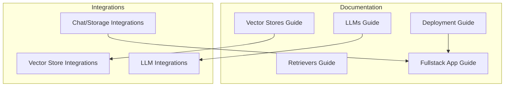
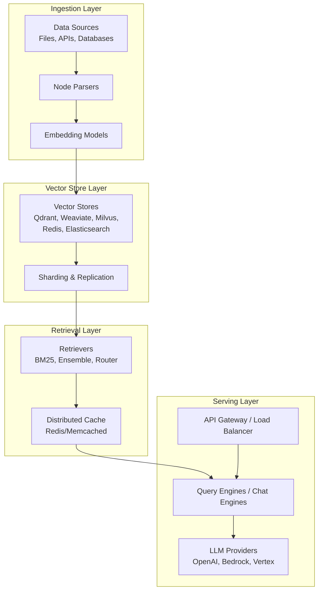
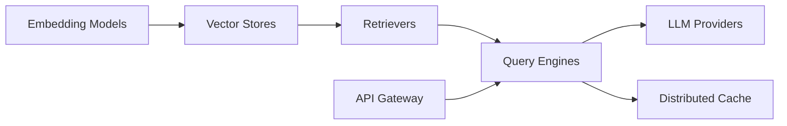

# Infrastructure and Capacity Planning

<cite>
**Referenced Files in This Document**
- [vector_stores.md](file://docs/src/content/docs/framework/community/integrations/vector_stores.md)
- [llms.md](file://docs/src/content/docs/framework/module_guides/models/llms.md)
- [retrievers.md](file://docs/src/content/docs/framework/module_guides/querying/retriever/retrievers.md)
- [deployment.md](file://docs/src/content/docs/framework/understanding/deployment/deployment.md)
- [Qdrant_hybrid_rag_multitenant_sharding.ipynb](file://docs/examples/vector_stores/Qdrant_hybrid_rag_multitenant_sharding.ipynb)
- [base.py](file://llama-index-integrations/storage/chat_store/llama-index-storage-chat-store-yugabytedb/llama_index/storage/chat_store/yugabytedb/base.py)
- [base.py](file://llama-index-integrations/storage/chat_store/llama-index-storage-chat-store-dynamodb/llama_index/storage/chat_store/dynamodb/base.py)
- [vector_stores_neptune.py](file://llama-index-integrations/vector_stores/llama-index-vector-stores-neptune/tests/test_vector_stores_neptune.py)
- [fullstack_with_delphic.md](file://docs/src/content/docs/framework/understanding/putting_it_all_together/apps/fullstack_with_delphic.md)
</cite>

## Table of Contents
1. [Introduction](#introduction)
2. [Project Structure](#project-structure)
3. [Core Components](#core-components)
4. [Architecture Overview](#architecture-overview)
5. [Detailed Component Analysis](#detailed-component-analysis)
6. [Dependency Analysis](#dependency-analysis)
7. [Performance Considerations](#performance-considerations)
8. [Troubleshooting Guide](#troubleshooting-guide)
9. [Conclusion](#conclusion)
10. [Appendices](#appendices)

## Introduction
This document provides infrastructure and capacity planning guidance for deploying LlamaIndex at scale. It focuses on:
- Scalable deployment topology and resource allocation
- Infrastructure requirements for vector stores, LLM providers, and data processing pipelines
- Capacity planning methodologies grounded in data volume, query patterns, and performance targets
- Cost optimization strategies including pooling, auto-scaling, and reserved capacity
- Practical examples for distributed caching, load balancing, and sharding
- Vendor-specific considerations for cloud platforms, databases, and networking
- Disaster recovery, backups, and high availability for production systems

## Project Structure
The repository organizes infrastructure and deployment guidance primarily under:
- Community integrations and examples for vector stores and connectors
- Module guides for LLMs and retrievers
- Deployment and full-stack application examples
- Integration packages for vector stores, LLMs, and storage backends

**Section sources**
- [vector_stores.md](file://docs/src/content/docs/framework/community/integrations/vector_stores.md#L1-L1259)
- [llms.md](file://docs/src/content/docs/framework/module_guides/models/llms.md#L1-L86)
- [retrievers.md](file://docs/src/content/docs/framework/module_guides/querying/retriever/retrievers.md#L1-L75)
- [deployment.md](file://docs/src/content/docs/framework/understanding/deployment/deployment.md#L1-L6)
- [fullstack_with_delphic.md](file://docs/src/content/docs/framework/understanding/putting_it_all_together/apps/fullstack_with_delphic.md#L700-L737)

## Core Components
- Vector stores: The backbone of retrieval, supporting diverse cloud and open-source databases. Examples include Qdrant, Weaviate, Pinecone, Milvus, Redis, Elasticsearch, and managed offerings like AlloyDB and Google Cloud SQL for PostgreSQL.
- LLM providers: Unified interface for OpenAI, Hugging Face, Anthropic, Bedrock, and others, enabling streaming, async, and sync endpoints.
- Retrievers: Modular retrieval techniques including BM25, ensemble, recursive, router, and auto-retrieval patterns.
- Storage/backends: Chat stores, document stores, and index stores with vendor-specific parameters for reliability and performance.

**Section sources**
- [vector_stores.md](file://docs/src/content/docs/framework/community/integrations/vector_stores.md#L10-L1259)
- [llms.md](file://docs/src/content/docs/framework/module_guides/models/llms.md#L1-L86)
- [retrievers.md](file://docs/src/content/docs/framework/module_guides/querying/retriever/retrievers.md#L1-L75)

## Architecture Overview
A scalable LlamaIndex architecture typically separates concerns across ingestion, embedding, vector storage, retrieval, and serving layers. The diagram below illustrates a cloud-native topology with horizontal scaling, caching, and sharding.

[No sources needed since this diagram shows conceptual workflow, not actual code structure]

## Detailed Component Analysis

### Vector Stores: Infrastructure Requirements and Scaling
- Cloud-native vector stores (e.g., Qdrant, Weaviate, Milvus) offer managed clusters with built-in sharding and replication. Plan for:
  - Shard count proportional to dataset size and concurrency
  - Replication factor for high availability
  - Network egress costs and regional placement
- Managed SQL with vector extensions (e.g., AlloyDB, Cloud SQL for PostgreSQL) centralize compute and storage:
  - Provision vector indexes aligned with embedding dimensions
  - Use read replicas for read-heavy workloads
- Open-source stacks (e.g., Elasticsearch, Redis Stack) require operational expertise:
  - Tune JVM heap and persistence settings
  - Configure index templates and analyzers
  - Use persistent volumes and snapshots for durability

Practical example references:
- Qdrant hybrid RAG with multitenant sharding and locality via shard keys
- YugabyteDB chat store parameters for load balancing and topology-aware routing
- DynamoDB chat store TTL and retry configuration for reliability

**Section sources**
- [vector_stores.md](file://docs/src/content/docs/framework/community/integrations/vector_stores.md#L772-L811)
- [vector_stores.md](file://docs/src/content/docs/framework/community/integrations/vector_stores.md#L955-L966)
- [vector_stores.md](file://docs/src/content/docs/framework/community/integrations/vector_stores.md#L1016-L1031)
- [Qdrant_hybrid_rag_multitenant_sharding.ipynb](file://docs/examples/vector_stores/Qdrant_hybrid_rag_multitenant_sharding.ipynb#L345-L357)
- [base.py](file://llama-index-integrations/storage/chat_store/llama-index-storage-chat-store-yugabytedb/llama_index/storage/chat_store/yugabytedb/base.py#L139-L168)
- [base.py](file://llama-index-integrations/storage/chat_store/llama-index-storage-chat-store-dynamodb/llama_index/storage/chat_store/dynamodb/base.py#L124-L159)

### LLM Providers: Sizing and Throughput
- Select providers aligned with latency and throughput targets; streaming and async endpoints reduce tail latency.
- Tokenization and prompt engineering impact cost and latency; align tokenizer with chosen LLM.
- Use provider-specific SDKs and connection pooling to optimize cold starts and retries.

**Section sources**
- [llms.md](file://docs/src/content/docs/framework/module_guides/models/llms.md#L1-L86)

### Retrievers: Hybrid and Ensemble Patterns
- Combine semantic search with keyword/BM25 and reranking to improve precision and recall.
- Use ensemble and router retrievers to route queries to specialized indexes.
- Implement metadata filters and hybrid search to reduce candidate sets and improve latency.

**Section sources**
- [retrievers.md](file://docs/src/content/docs/framework/module_guides/querying/retriever/retrievers.md#L1-L75)

### Storage Backends: Reliability and Durability
- Chat stores and document stores often rely on managed databases with built-in HA and backup:
  - YugabyteDB: topology keys, load balancing, and TTL controls
  - DynamoDB: TTL attributes and retry/backoff policies
- For in-memory or ephemeral stores, pair with persistent storage and snapshot mechanisms.

**Section sources**
- [base.py](file://llama-index-integrations/storage/chat_store/llama-index-storage-chat-store-yugabytedb/llama_index/storage/chat_store/yugabytedb/base.py#L139-L168)
- [base.py](file://llama-index-integrations/storage/chat_store/llama-index-storage-chat-store-dynamodb/llama_index/storage/chat_store/dynamodb/base.py#L124-L159)

### Vector Store Implementation Notes
- Ensure vector store classes conform to the expected base interface for compatibility and testing.
- Example: Neptune Analytics vector store inherits from the base vector store type.

**Section sources**
- [vector_stores_neptune.py](file://llama-index-integrations/vector_stores/llama-index-vector-stores-neptune/tests/test_vector_stores_neptune.py#L1-L7)

## Dependency Analysis
The following diagram maps key dependencies among components in a typical LlamaIndex deployment.

[No sources needed since this diagram shows conceptual relationships, not specific code structure]

## Performance Considerations
- Latency-sensitive queries benefit from:
  - Distributed caching for frequent queries and embeddings
  - Load balancing across query engines and retrievers
  - Asynchronous and streaming LLM calls
- Throughput scaling:
  - Horizontal sharding in vector stores
  - Read replicas and connection pooling
  - Batch embedding and bulk upserts
- Memory and CPU:
  - Tune embedding model batch sizes and device utilization
  - Offload heavy post-processing to async workers

[No sources needed since this section provides general guidance]

## Troubleshooting Guide
Common operational issues and mitigations:
- Vector store connectivity and timeouts:
  - Verify credentials, endpoints, and network ACLs
  - Increase timeouts and retries for transient failures
- Retrieval quality degradation:
  - Rebuild or re-index vector collections after embedding model updates
  - Adjust hybrid search weights and filters
- LLM rate limits and cold starts:
  - Use connection pools and warm-up routines
  - Implement circuit breakers and fallback strategies
- Data consistency:
  - Use transactional writes for embeddings and metadata
  - Enable snapshots and backups for vector stores and storage backends

**Section sources**
- [base.py](file://llama-index-integrations/storage/chat_store/llama-index-storage-chat-store-dynamodb/llama_index/storage/chat_store/dynamodb/base.py#L124-L159)

## Conclusion
Scaling LlamaIndex requires thoughtful alignment between data ingestion, vector storage, retrieval, and serving layers. Choose vector stores and LLM providers that match your latency, throughput, and cost targets, and apply sharding, caching, and load balancing to meet SLAs. Implement robust backup, disaster recovery, and high availability strategies, and continuously monitor and iterate on capacity planning based on observed usage patterns.

[No sources needed since this section summarizes without analyzing specific files]

## Appendices

### Practical Design Examples
- Sharding and locality with Qdrant:
  - Use shard keys to keep tenants co-located within shards for reduced latency and improved locality.
- YugabyteDB chat store:
  - Configure load balancing and topology keys for regional resilience and lower latency.
- DynamoDB chat store:
  - Apply TTL for ephemeral sessions and tune retry/backoff for transient errors.

**Section sources**
- [Qdrant_hybrid_rag_multitenant_sharding.ipynb](file://docs/examples/vector_stores/Qdrant_hybrid_rag_multitenant_sharding.ipynb#L345-L357)
- [base.py](file://llama-index-integrations/storage/chat_store/llama-index-storage-chat-store-yugabytedb/llama_index/storage/chat_store/yugabytedb/base.py#L139-L168)
- [base.py](file://llama-index-integrations/storage/chat_store/llama-index-storage-chat-store-dynamodb/llama_index/storage/chat_store/dynamodb/base.py#L124-L159)

### Deployment Topologies
- Cloud-native:
  - Use managed vector stores and serverless compute for autoscaling.
- Hybrid:
  - Combine managed services with on-premises vector stores for compliance or latency.
- Edge:
  - Run lightweight local embeddings and retrieval for offline or constrained environments.

[No sources needed since this section provides general guidance]

### Vendor-Specific Guidance
- Vector stores:
  - Managed solutions (e.g., Qdrant Cloud, Weaviate Cloud) simplify HA and scaling.
  - Self-managed stacks (e.g., Elasticsearch, Redis Stack) require ops expertise.
- LLM providers:
  - Align provider regions with vector store locations to minimize latency.
  - Use provider SDKs and connection pooling to optimize performance.
- Networking:
  - Place API gateways and load balancers close to compute to reduce RTT.
  - Prefer private links/VPC peering for internal traffic.

[No sources needed since this section provides general guidance]