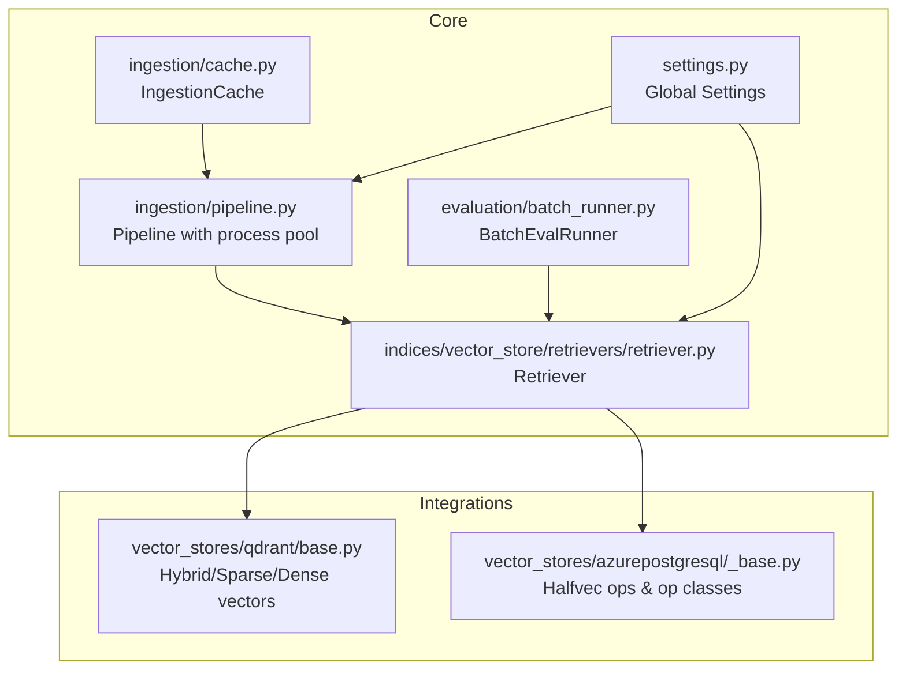
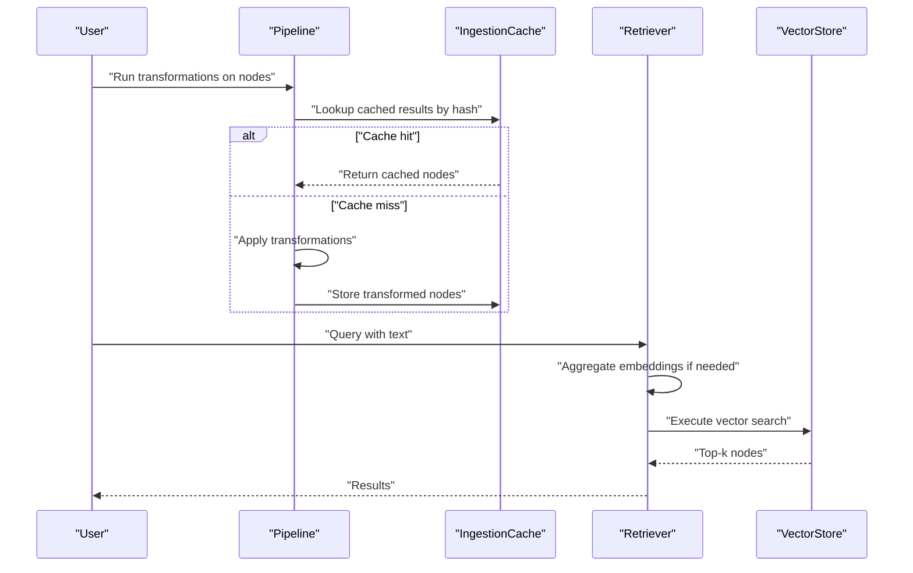
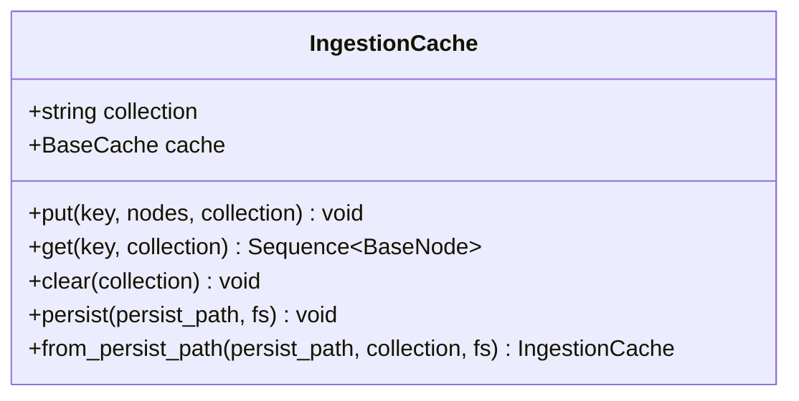
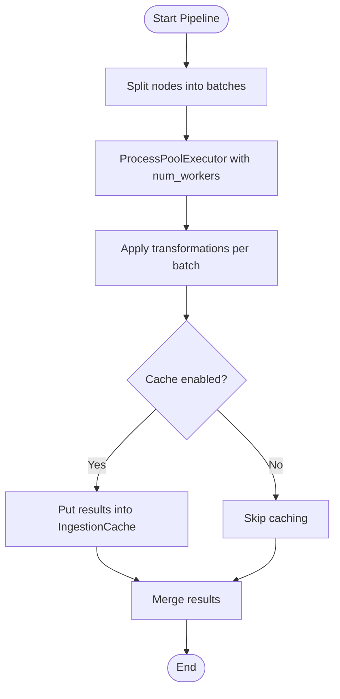
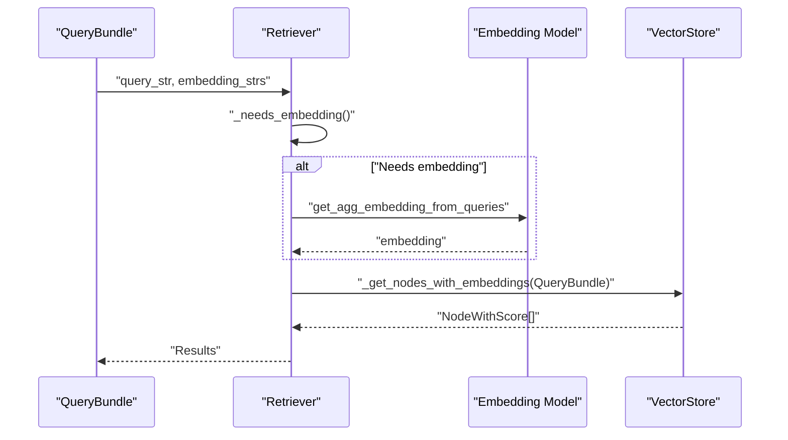
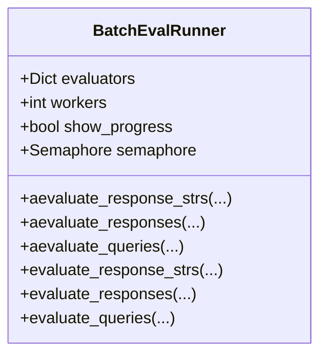
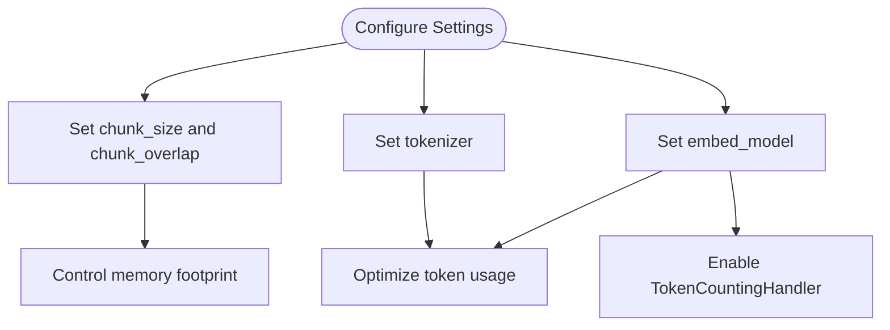
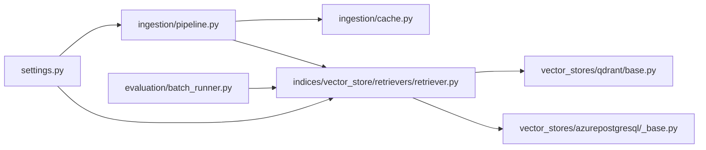

# Optimization Strategies

<cite>
**Referenced Files in This Document**
- [cache.py](file://llama-index-core/llama_index/core/ingestion/cache.py)
- [pipeline.py](file://llama-index-core/llama_index/core/ingestion/pipeline.py)
- [batch_runner.py](file://llama-index-core/llama_index/core/evaluation/batch_runner.py)
- [settings.py](file://llama-index-core/llama_index/core/settings.py)
- [retriever.py](file://llama-index-core/llama_index/core/indices/vector_store/retrievers/retriever.py)
- [base.py](file://llama-index-integrations/vector_stores/llama-index-vector-stores-qdrant/llama_index/vector_stores/qdrant/base.py)
- [base.py](file://llama-index-integrations/vector_stores/llama-index-vector-stores-azurepostgresql/llama_index/vector_stores/azure_postgres/common/_base.py)
- [test_cache.py](file://llama-index-core/tests/ingestion/test_cache.py)
- [token_counting_migration.md](file://docs/src/content/docs/framework/module_guides/observability/callbacks/token_counting_migration.md)
</cite>

## Table of Contents
1. [Introduction](#introduction)
2. [Project Structure](#project-structure)
3. [Core Components](#core-components)
4. [Architecture Overview](#architecture-overview)
5. [Detailed Component Analysis](#detailed-component-analysis)
6. [Dependency Analysis](#dependency-analysis)
7. [Performance Considerations](#performance-considerations)
8. [Troubleshooting Guide](#troubleshooting-guide)
9. [Conclusion](#conclusion)
10. [Appendices](#appendices)

## Introduction
This document presents a comprehensive guide to optimization strategies in LlamaIndex with a focus on caching mechanisms, batch processing, memory management, and resource optimization. It explains how the system caches data transformations, embedding generation, and retrieval results, and how to leverage batching and efficient data structures to reduce latency and cost. Practical guidance is provided for tuning parameters, configuring components, and adopting best practices across different use cases.

## Project Structure
The optimization-related capabilities span several modules:
- Ingestion pipeline and caching for data transformations
- Batch evaluation and parallel execution
- Settings and configuration for embeddings, tokenization, and chunk sizing
- Vector store integrations supporting efficient vector operations
- Retrieval logic that optimizes embedding computation and query execution

**Diagram sources**
- [cache.py](file://llama-index-core/llama_index/core/ingestion/cache.py#L17-L75)
- [pipeline.py](file://llama-index-core/llama_index/core/ingestion/pipeline.py#L729-L755)
- [batch_runner.py](file://llama-index-core/llama_index/core/evaluation/batch_runner.py#L75-L444)
- [settings.py](file://llama-index-core/llama_index/core/settings.py#L17-L248)
- [retriever.py](file://llama-index-core/llama_index/core/indices/vector_store/retrievers/retriever.py#L98-L133)
- [base.py](file://llama-index-integrations/vector_stores/llama-index-vector-stores-qdrant/llama_index/vector_stores/qdrant/base.py#L336-L368)
- [base.py](file://llama-index-integrations/vector_stores/llama-index-vector-stores-azurepostgresql/llama_index/vector_stores/azure_postgres/common/_base.py#L550-L573)

**Section sources**
- [cache.py](file://llama-index-core/llama_index/core/ingestion/cache.py#L1-L79)
- [pipeline.py](file://llama-index-core/llama_index/core/ingestion/pipeline.py#L729-L755)
- [batch_runner.py](file://llama-index-core/llama_index/core/evaluation/batch_runner.py#L75-L444)
- [settings.py](file://llama-index-core/llama_index/core/settings.py#L17-L248)
- [retriever.py](file://llama-index-core/llama_index/core/indices/vector_store/retrievers/retriever.py#L98-L133)
- [base.py](file://llama-index-integrations/vector_stores/llama-index-vector-stores-qdrant/llama_index/vector_stores/qdrant/base.py#L336-L368)
- [base.py](file://llama-index-integrations/vector_stores/llama-index-vector-stores-azurepostgresql/llama_index/vector_stores/azure_postgres/common/_base.py#L550-L573)

## Core Components
- IngestionCache: Stores transformed nodes keyed by transformation hashes to avoid recomputation during ingestion.
- Pipeline: Supports parallel transformation via process pools and optional caching of intermediate results.
- BatchEvalRunner: Provides asynchronous batch evaluation with concurrency control and retries.
- Settings: Centralized configuration for LLMs, embeddings, tokenization, and chunk sizing.
- Retriever: Computes aggregated embeddings for query strings and retrieves nodes efficiently.
- Vector Store Integrations: Efficient vector operations, hybrid/sparse/dense support, and operator classes for optimized similarity search.

**Section sources**
- [cache.py](file://llama-index-core/llama_index/core/ingestion/cache.py#L17-L75)
- [pipeline.py](file://llama-index-core/llama_index/core/ingestion/pipeline.py#L729-L755)
- [batch_runner.py](file://llama-index-core/llama_index/core/evaluation/batch_runner.py#L75-L444)
- [settings.py](file://llama-index-core/llama_index/core/settings.py#L17-L248)
- [retriever.py](file://llama-index-core/llama_index/core/indices/vector_store/retrievers/retriever.py#L98-L133)

## Architecture Overview
The optimization architecture integrates caching, batching, and efficient vector operations across ingestion and retrieval:

**Diagram sources**
- [pipeline.py](file://llama-index-core/llama_index/core/ingestion/pipeline.py#L729-L755)
- [cache.py](file://llama-index-core/llama_index/core/ingestion/cache.py#L27-L46)
- [retriever.py](file://llama-index-core/llama_index/core/indices/vector_store/retrievers/retriever.py#L98-L133)

## Detailed Component Analysis

### Caching System Architecture
LlamaIndex provides a pluggable caching layer for ingestion transformations and supports persistence for simple caches. The cache stores serialized node representations under a stable key derived from input nodes and transformation parameters.

Key characteristics:
- Stable hashing of transformations ensures cache hits for identical inputs.
- Nodes are persisted as JSON dictionaries and deserialized on retrieval.
- Optional persistence for simple caches enables reuse across runs.

**Diagram sources**
- [cache.py](file://llama-index-core/llama_index/core/ingestion/cache.py#L17-L75)

Practical guidance:
- Enable caching in the ingestion pipeline to avoid recomputation of expensive transformations.
- Persist the cache when using simple cache backends to speed up subsequent runs.
- Use collection scoping to isolate caches per dataset or pipeline stage.

**Section sources**
- [cache.py](file://llama-index-core/llama_index/core/ingestion/cache.py#L17-L75)
- [test_cache.py](file://llama-index-core/tests/ingestion/test_cache.py#L15-L47)

### Batch Processing Patterns
The ingestion pipeline leverages process pools to transform nodes in parallel, distributing work across CPU cores and optionally integrating caching to minimize redundant work.

**Diagram sources**
- [pipeline.py](file://llama-index-core/llama_index/core/ingestion/pipeline.py#L729-L755)

Best practices:
- Tune num_workers to match available CPU cores and I/O characteristics.
- Prefer batching for embedding generation and retrieval queries to amortize overhead.
- Combine process pools with caching to maximize throughput.

**Section sources**
- [pipeline.py](file://llama-index-core/llama_index/core/ingestion/pipeline.py#L729-L755)

### Retrieval and Embedding Optimization
The retriever aggregates embeddings for query strings when needed and delegates to vector stores for efficient similarity search. Vector store integrations expose advanced features such as hybrid/sparse/dense vectors and operator classes for optimized distance computations.

**Diagram sources**
- [retriever.py](file://llama-index-core/llama_index/core/indices/vector_store/retrievers/retriever.py#L98-L133)
- [base.py](file://llama-index-integrations/vector_stores/llama-index-vector-stores-qdrant/llama_index/vector_stores/qdrant/base.py#L336-L368)
- [base.py](file://llama-index-integrations/vector_stores/llama-index-vector-stores-azurepostgresql/llama_index/vector_stores/azure_postgres/common/_base.py#L550-L573)

Guidance:
- Aggregate embeddings for multi-string queries to reduce repeated calls.
- Choose vector store operators aligned with embedding dimensionality and similarity metrics.
- Use hybrid/sparse/dense configurations when supported to improve recall and efficiency.

**Section sources**
- [retriever.py](file://llama-index-core/llama_index/core/indices/vector_store/retrievers/retriever.py#L98-L133)
- [base.py](file://llama-index-integrations/vector_stores/llama-index-vector-stores-qdrant/llama_index/vector_stores/qdrant/base.py#L336-L368)
- [base.py](file://llama-index-integrations/vector_stores/llama-index-vector-stores-azurepostgresql/llama_index/vector_stores/azure_postgres/common/_base.py#L550-L573)

### Batch Evaluation Runner
BatchEvalRunner orchestrates parallel evaluation with concurrency control, retry logic, and flexible input validation. It supports evaluating responses, response strings, and queries against a query engine.

**Diagram sources**
- [batch_runner.py](file://llama-index-core/llama_index/core/evaluation/batch_runner.py#L75-L444)

Operational tips:
- Adjust workers to balance throughput and resource contention.
- Use semaphores to cap concurrent operations and prevent overload.
- Validate inputs consistently to ensure equal-length arrays and proper kwargs.

**Section sources**
- [batch_runner.py](file://llama-index-core/llama_index/core/evaluation/batch_runner.py#L75-L444)

### Memory Management and Resource Optimization
- Chunk sizing and overlap: Configure via settings to balance context retention and memory usage.
- Token counting: Migrate to callback-based counting for accurate and configurable tracking.
- Vector store operators: Select appropriate operator classes and halfvec configurations for reduced memory footprint and faster similarity search.

**Diagram sources**
- [settings.py](file://llama-index-core/llama_index/core/settings.py#L137-L183)
- [settings.py](file://llama-index-core/llama_index/core/settings.py#L106-L134)
- [settings.py](file://llama-index-core/llama_index/core/settings.py#L58-L75)
- [token_counting_migration.md](file://docs/src/content/docs/framework/module_guides/observability/callbacks/token_counting_migration.md#L1-L11)

**Section sources**
- [settings.py](file://llama-index-core/llama_index/core/settings.py#L137-L183)
- [settings.py](file://llama-index-core/llama_index/core/settings.py#L106-L134)
- [settings.py](file://llama-index-core/llama_index/core/settings.py#L58-L75)
- [token_counting_migration.md](file://docs/src/content/docs/framework/module_guides/observability/callbacks/token_counting_migration.md#L1-L11)

## Dependency Analysis
The optimization components interact as follows:
- Pipeline depends on IngestionCache and transformations; it can optionally disable cache for specific runs.
- Retriever depends on embedding models and vector stores; vector store integrations influence performance and memory usage.
- BatchEvalRunner depends on query engines and evaluators; concurrency and retries are controlled via semaphores and retry decorators.
- Settings centralizes configuration for tokenization, chunk sizing, and embedding models.

**Diagram sources**
- [pipeline.py](file://llama-index-core/llama_index/core/ingestion/pipeline.py#L729-L755)
- [cache.py](file://llama-index-core/llama_index/core/ingestion/cache.py#L17-L75)
- [retriever.py](file://llama-index-core/llama_index/core/indices/vector_store/retrievers/retriever.py#L98-L133)
- [batch_runner.py](file://llama-index-core/llama_index/core/evaluation/batch_runner.py#L75-L444)
- [settings.py](file://llama-index-core/llama_index/core/settings.py#L17-L248)
- [base.py](file://llama-index-integrations/vector_stores/llama-index-vector-stores-qdrant/llama_index/vector_stores/qdrant/base.py#L336-L368)
- [base.py](file://llama-index-integrations/vector_stores/llama-index-vector-stores-azurepostgresql/llama_index/vector_stores/azure_postgres/common/_base.py#L550-L573)

**Section sources**
- [pipeline.py](file://llama-index-core/llama_index/core/ingestion/pipeline.py#L729-L755)
- [cache.py](file://llama-index-core/llama_index/core/ingestion/cache.py#L17-L75)
- [retriever.py](file://llama-index-core/llama_index/core/indices/vector_store/retrievers/retriever.py#L98-L133)
- [batch_runner.py](file://llama-index-core/llama_index/core/evaluation/batch_runner.py#L75-L444)
- [settings.py](file://llama-index-core/llama_index/core/settings.py#L17-L248)
- [base.py](file://llama-index-integrations/vector_stores/llama-index-vector-stores-qdrant/llama_index/vector_stores/qdrant/base.py#L336-L368)
- [base.py](file://llama-index-integrations/vector_stores/llama-index-vector-stores-azurepostgresql/llama_index/vector_stores/azure_postgres/common/_base.py#L550-L573)

## Performance Considerations
- Caching: Use IngestionCache to avoid recomputation; persist simple caches for long-lived benefits.
- Batching: Increase batch sizes for embedding and retrieval to amortize fixed costs; tune worker counts to CPU capacity.
- Vector operations: Choose operator classes and halfvec configurations aligned with embedding dimensionality and similarity metric.
- Token usage: Migrate to callback-based token counting for accurate tracking and cost control.
- Chunk sizing: Adjust chunk_size and chunk_overlap to balance context coverage and memory footprint.

[No sources needed since this section provides general guidance]

## Troubleshooting Guide
Common issues and remedies:
- Cache misses unexpectedly: Verify transformation hash stability and ensure consistent input ordering.
- Out-of-memory errors during ingestion: Reduce chunk_size or increase overlap minimally; consider disabling cache temporarily to diagnose bottlenecks.
- Slow retrieval: Confirm embedding aggregation is computed only when needed; ensure vector store operator classes are configured correctly.
- Token counting discrepancies: Switch to TokenCountingHandler callback and configure per-index counters.

**Section sources**
- [test_cache.py](file://llama-index-core/tests/ingestion/test_cache.py#L15-L47)
- [token_counting_migration.md](file://docs/src/content/docs/framework/module_guides/observability/callbacks/token_counting_migration.md#L1-L11)

## Conclusion
By combining IngestionCache, parallel pipelines, batch evaluation, and efficient vector store configurations, LlamaIndex enables robust optimization across latency, memory, and cost. Centralized settings streamline configuration, while callback-based token counting provides precise control over resource usage. Adopt the recommended patterns and tuning parameters to align performance with your workload characteristics.

[No sources needed since this section summarizes without analyzing specific files]

## Appendices
- Practical examples:
  - Implement custom caching for expensive transformations by hashing inputs and storing node outputs.
  - Optimize embedding workflows by aggregating embeddings for multi-string queries and batching requests.
  - Reduce memory footprint by adjusting chunk_size and chunk_overlap and selecting appropriate vector store operator classes.

[No sources needed since this section provides general guidance]