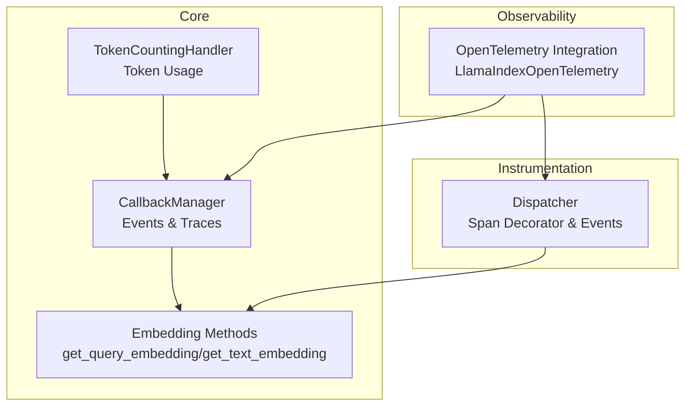
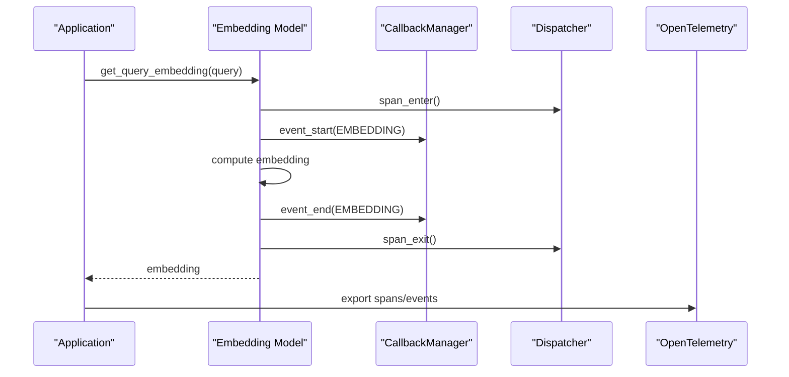
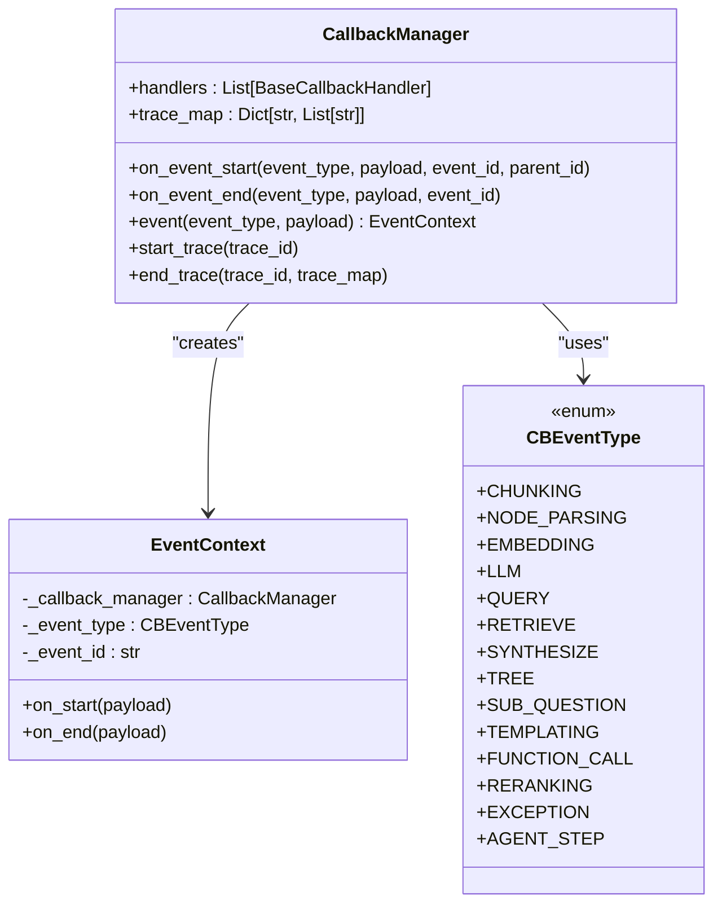
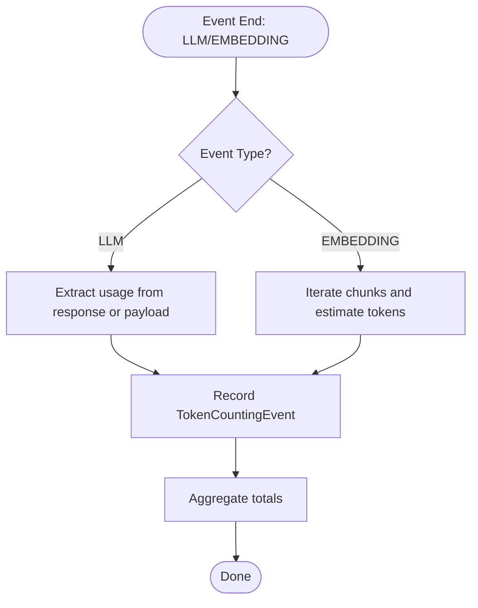
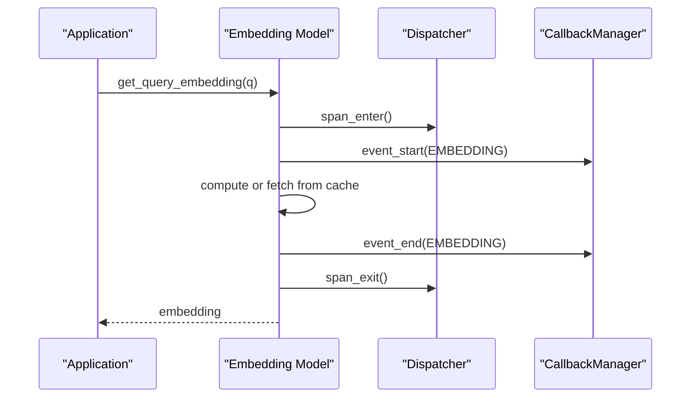
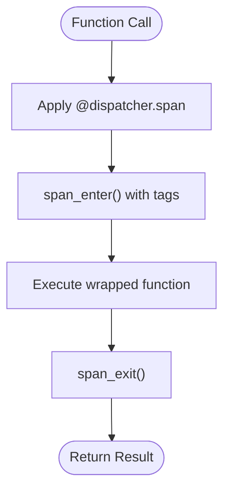
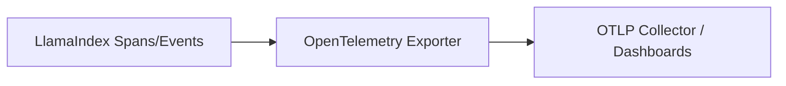
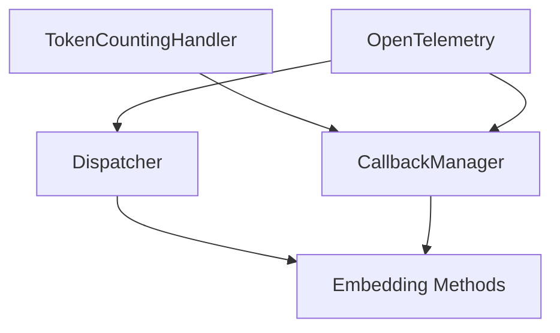

# Performance Profiling and Monitoring

<cite>
**Referenced Files in This Document**
- [dispatcher.py](file://llama-index-core/llama_index/core/instrumentation/dispatcher.py)
- [base.py](file://llama-index-core/llama_index/core/callbacks/base.py)
- [schema.py](file://llama-index-core/llama_index/core/callbacks/schema.py)
- [token_counting.py](file://llama-index-core/llama_index/core/callbacks/token_counting.py)
- [base.py](file://llama-index-core/llama_index/core/base/embeddings/base.py)
- [otel/__init__.py](file://llama-index-integrations/observability/llama-index-observability-otel/llama_index/observability/otel/__init__.py)
- [base.py](file://llama-index-integrations/observability/llama-index-observability-otel/llama_index/observability/otel/base.py)
- [utils.py](file://llama-index-integrations/observability/llama-index-observability-otel/llama_index/observability/otel/utils.py)
- [test_dispatcher.py](file://llama-index-instrumentation/tests/test_dispatcher.py)
- [test_manager.py](file://llama-index-instrumentation/tests/test_manager.py)
- [README.md](file://llama-datasets/mini_mt_bench_singlegrading/README.md)
</cite>

## Table of Contents
1. [Introduction](#introduction)
2. [Project Structure](#project-structure)
3. [Core Components](#core-components)
4. [Architecture Overview](#architecture-overview)
5. [Detailed Component Analysis](#detailed-component-analysis)
6. [Dependency Analysis](#dependency-analysis)
7. [Performance Considerations](#performance-considerations)
8. [Troubleshooting Guide](#troubleshooting-guide)
9. [Conclusion](#conclusion)
10. [Appendices](#appendices)

## Introduction
This document explains how to profile and monitor performance in LlamaIndex applications. It focuses on:
- Instrumentation frameworks for tracking performance metrics, latency, and resource utilization
- Callback systems for monitoring LLM calls, embedding operations, and retrieval performance
- Profiling tools and techniques for identifying bottlenecks in data ingestion, query processing, and response synthesis
- Monitoring dashboard setup, alerting configuration, and performance baseline establishment
- Practical examples of using built-in profilers, integrating external monitoring tools, and setting up automated performance testing
- Metrics collection strategies, performance regression detection, and optimization validation workflows
- Troubleshooting common performance issues and implementing continuous performance improvement processes

## Project Structure
LlamaIndex provides two complementary mechanisms for performance profiling and monitoring:
- Core callback and tracing infrastructure for event-driven telemetry
- An instrumentation dispatcher for span-based performance measurement
- Optional observability integrations (e.g., OpenTelemetry) for exporting telemetry to external systems

**Diagram sources**
- [base.py](file://llama-index-core/llama_index/core/callbacks/base.py#L28-L303)
- [token_counting.py](file://llama-index-core/llama_index/core/callbacks/token_counting.py#L143-L270)
- [base.py](file://llama-index-core/llama_index/core/base/embeddings/base.py#L130-L438)
- [dispatcher.py](file://llama-index-core/llama_index/core/instrumentation/dispatcher.py#L1-L9)
- [otel/__init__.py](file://llama-index-integrations/observability/llama-index-observability-otel/llama_index/observability/otel/__init__.py#L1-L6)

**Section sources**
- [base.py](file://llama-index-core/llama_index/core/callbacks/base.py#L28-L303)
- [token_counting.py](file://llama-index-core/llama_index/core/callbacks/token_counting.py#L143-L270)
- [base.py](file://llama-index-core/llama_index/core/base/embeddings/base.py#L130-L438)
- [dispatcher.py](file://llama-index-core/llama_index/core/instrumentation/dispatcher.py#L1-L9)
- [otel/__init__.py](file://llama-index-integrations/observability/llama-index-observability-otel/llama_index/observability/otel/__init__.py#L1-L6)

## Core Components
- CallbackManager: Centralized event and trace orchestration with hierarchical event stacking and trace maps
- TokenCountingHandler: Aggregates token usage for LLM and embedding events
- Embedding methods: Instrumented via dispatcher spans and callback events for embedding operations
- Dispatcher: Provides span decorators and event dispatching for performance measurement
- OpenTelemetry Integration: Bridges LlamaIndex telemetry to external observability platforms

Key responsibilities:
- Track latency and throughput across ingestion, retrieval, synthesis, and embedding stages
- Aggregate token usage and cost signals
- Export telemetry to external systems for dashboards and alerts

**Section sources**
- [base.py](file://llama-index-core/llama_index/core/callbacks/base.py#L28-L303)
- [schema.py](file://llama-index-core/llama_index/core/callbacks/schema.py#L16-L102)
- [token_counting.py](file://llama-index-core/llama_index/core/callbacks/token_counting.py#L143-L270)
- [base.py](file://llama-index-core/llama_index/core/base/embeddings/base.py#L130-L438)
- [dispatcher.py](file://llama-index-core/llama_index/core/instrumentation/dispatcher.py#L1-L9)
- [otel/__init__.py](file://llama-index-integrations/observability/llama-index-observability-otel/llama_index/observability/otel/__init__.py#L1-L6)

## Architecture Overview
The performance monitoring architecture combines callback-driven telemetry with span-based instrumentation and optional observability export.

**Diagram sources**
- [base.py](file://llama-index-core/llama_index/core/base/embeddings/base.py#L130-L179)
- [base.py](file://llama-index-core/llama_index/core/callbacks/base.py#L88-L143)
- [dispatcher.py](file://llama-index-core/llama_index/core/instrumentation/dispatcher.py#L1-L9)
- [otel/__init__.py](file://llama-index-integrations/observability/llama-index-observability-otel/llama_index/observability/otel/__init__.py#L1-L6)

## Detailed Component Analysis

### CallbackManager and Event Schema
- Manages event lifecycle with hierarchical tracing using context variables
- Supports nested event stacks and trace maps for parent-child relationships
- Defines standardized event types and payloads for consistent metric collection

**Diagram sources**
- [base.py](file://llama-index-core/llama_index/core/callbacks/base.py#L28-L303)
- [schema.py](file://llama-index-core/llama_index/core/callbacks/schema.py#L16-L102)

**Section sources**
- [base.py](file://llama-index-core/llama_index/core/callbacks/base.py#L28-L303)
- [schema.py](file://llama-index-core/llama_index/core/callbacks/schema.py#L16-L102)

### TokenCountingHandler
- Counts tokens for LLM prompts and completions, and for embedding chunks
- Extracts token usage from provider responses when available, otherwise estimates
- Aggregates totals per session and supports resetting counts

**Diagram sources**
- [token_counting.py](file://llama-index-core/llama_index/core/callbacks/token_counting.py#L197-L244)

**Section sources**
- [token_counting.py](file://llama-index-core/llama_index/core/callbacks/token_counting.py#L143-L270)

### Embedding Instrumentation
- Embedding methods wrap computation with dispatcher spans and callback events
- Emits start/end events around embedding calls to capture latency and payload metadata
- Integrates with cache to avoid redundant computations

**Diagram sources**
- [base.py](file://llama-index-core/llama_index/core/base/embeddings/base.py#L130-L179)
- [base.py](file://llama-index-core/llama_index/core/callbacks/base.py#L88-L143)
- [dispatcher.py](file://llama-index-core/llama_index/core/instrumentation/dispatcher.py#L1-L9)

**Section sources**
- [base.py](file://llama-index-core/llama_index/core/base/embeddings/base.py#L130-L438)
- [base.py](file://llama-index-core/llama_index/core/callbacks/base.py#L88-L143)

### Dispatcher Span Decorator
- Adds deterministic span creation around functions/methods
- Propagates active instrumentation tags and maintains span hierarchy
- Ensures idempotent decoration and proper span lifecycle

**Diagram sources**
- [dispatcher.py](file://llama-index-core/llama_index/core/instrumentation/dispatcher.py#L264-L292)
- [test_dispatcher.py](file://llama-index-instrumentation/tests/test_dispatcher.py#L747-L768)
- [test_manager.py](file://llama-index-instrumentation/tests/test_manager.py#L1-L13)

**Section sources**
- [dispatcher.py](file://llama-index-core/llama_index/core/instrumentation/dispatcher.py#L264-L292)
- [test_dispatcher.py](file://llama-index-instrumentation/tests/test_dispatcher.py#L747-L768)
- [test_manager.py](file://llama-index-instrumentation/tests/test_manager.py#L1-L13)

### OpenTelemetry Integration
- Exposes LlamaIndexOpenTelemetry for exporting spans and events to OpenTelemetry-compatible backends
- Enables correlation between LlamaIndex spans and downstream telemetry

**Diagram sources**
- [otel/__init__.py](file://llama-index-integrations/observability/llama-index-observability-otel/llama_index/observability/otel/__init__.py#L1-L6)
- [base.py](file://llama-index-integrations/observability/llama-index-observability-otel/llama_index/observability/otel/base.py#L1-L200)
- [utils.py](file://llama-index-integrations/observability/llama-index-observability-otel/llama_index/observability/otel/utils.py#L1-L200)

**Section sources**
- [otel/__init__.py](file://llama-index-integrations/observability/llama-index-observability-otel/llama_index/observability/otel/__init__.py#L1-L6)
- [base.py](file://llama-index-integrations/observability/llama-index-observability-otel/llama_index/observability/otel/base.py#L1-L200)
- [utils.py](file://llama-index-integrations/observability/llama-index-observability-otel/llama_index/observability/otel/utils.py#L1-L200)

## Dependency Analysis
- Embedding methods depend on both dispatcher spans and callback events for comprehensive coverage
- TokenCountingHandler depends on callback payloads and provider response usage fields
- OpenTelemetry integration bridges internal spans/events to external observability systems

**Diagram sources**
- [base.py](file://llama-index-core/llama_index/core/base/embeddings/base.py#L130-L438)
- [base.py](file://llama-index-core/llama_index/core/callbacks/base.py#L28-L303)
- [token_counting.py](file://llama-index-core/llama_index/core/callbacks/token_counting.py#L143-L270)
- [dispatcher.py](file://llama-index-core/llama_index/core/instrumentation/dispatcher.py#L1-L9)
- [otel/__init__.py](file://llama-index-integrations/observability/llama-index-observability-otel/llama_index/observability/otel/__init__.py#L1-L6)

**Section sources**
- [base.py](file://llama-index-core/llama_index/core/base/embeddings/base.py#L130-L438)
- [base.py](file://llama-index-core/llama_index/core/callbacks/base.py#L28-L303)
- [token_counting.py](file://llama-index-core/llama_index/core/callbacks/token_counting.py#L143-L270)
- [dispatcher.py](file://llama-index-core/llama_index/core/instrumentation/dispatcher.py#L1-L9)
- [otel/__init__.py](file://llama-index-integrations/observability/llama-index-observability-otel/llama_index/observability/otel/__init__.py#L1-L6)

## Performance Considerations
- Use callback events to measure latency across ingestion, retrieval, and synthesis stages
- Leverage token counting for cost-awareness and throughput modeling
- Apply dispatcher spans to isolate hotspots in embedding and LLM calls
- Export telemetry via OpenTelemetry for centralized dashboards and alerting
- Establish baselines using datasets and packs to detect regressions

[No sources needed since this section provides general guidance]

## Troubleshooting Guide
Common issues and resolutions:
- Missing token counts: Ensure TokenCountingHandler is attached and provider responses include usage fields
- Inconsistent trace maps: Verify nested event contexts and proper start/end calls
- High embedding latency: Check cache effectiveness and batching strategies
- Dashboard gaps: Confirm OpenTelemetry exporter configuration and backend connectivity

**Section sources**
- [token_counting.py](file://llama-index-core/llama_index/core/callbacks/token_counting.py#L143-L270)
- [base.py](file://llama-index-core/llama_index/core/callbacks/base.py#L88-L143)
- [base.py](file://llama-index-core/llama_index/core/base/embeddings/base.py#L130-L438)
- [otel/__init__.py](file://llama-index-integrations/observability/llama-index-observability-otel/llama_index/observability/otel/__init__.py#L1-L6)

## Conclusion
By combining callback-driven telemetry, span-based instrumentation, and observability exports, LlamaIndex enables robust performance profiling and monitoring. Use the provided components to establish baselines, detect regressions, and continuously optimize system performance across ingestion, retrieval, and synthesis workflows.

[No sources needed since this section summarizes without analyzing specific files]

## Appendices

### Practical Examples and Workflows
- Benchmarking with datasets: Use the Mini MT Bench Single Grading dataset pack to run evaluations and collect performance metrics
- Automated performance testing: Configure batch sizes and sleep intervals to avoid rate limits while collecting throughput and latency
- Dashboard and alerting: Export spans and events to OpenTelemetry-compatible backends for visualization and alerting

**Section sources**
- [README.md](file://llama-datasets/mini_mt_bench_singlegrading/README.md#L23-L69)
- [otel/__init__.py](file://llama-index-integrations/observability/llama-index-observability-otel/llama_index/observability/otel/__init__.py#L1-L6)