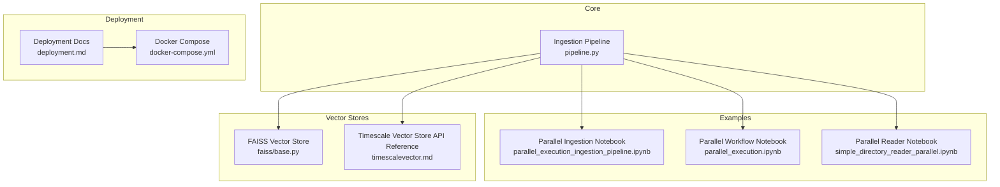
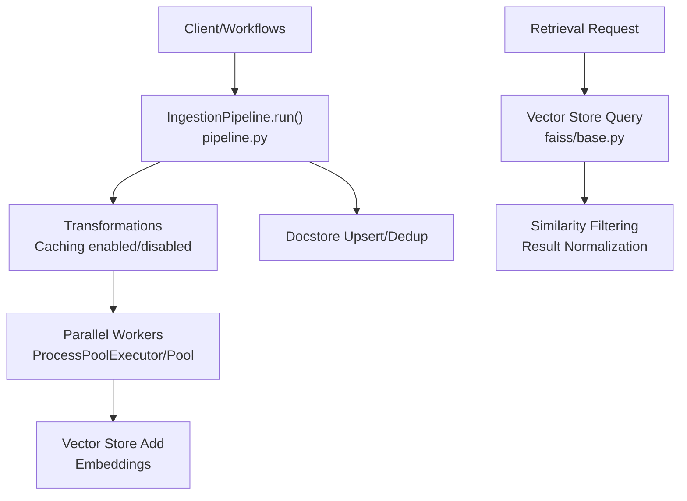
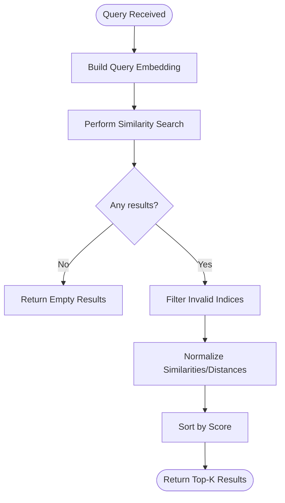
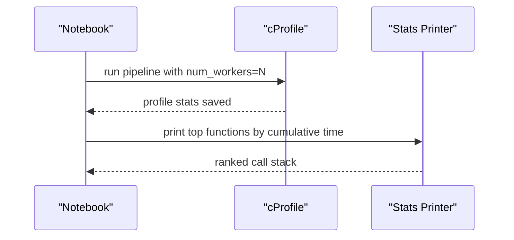
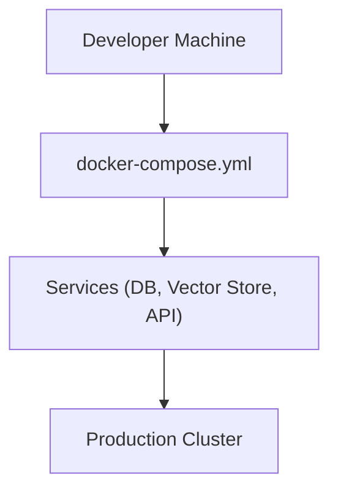
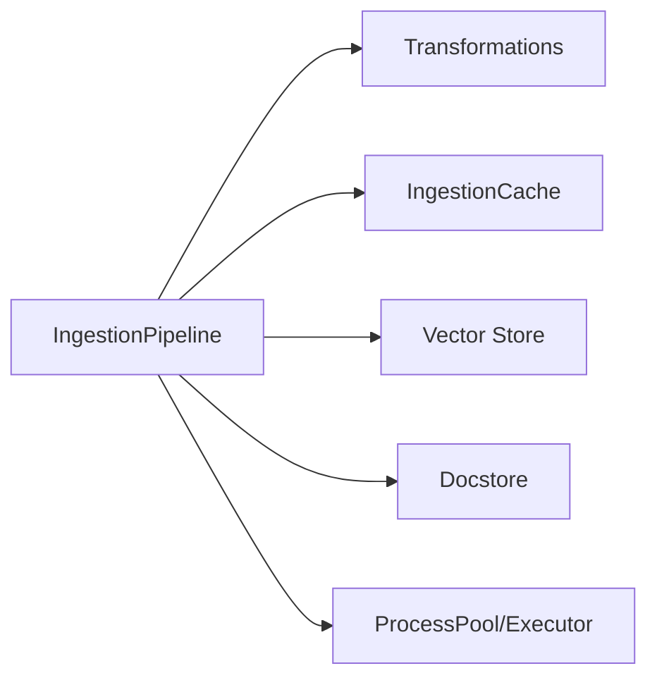

# Performance and Scaling

<cite>
**Referenced Files in This Document**
- [pipeline.py](file://llama-index-core/llama_index/core/ingestion/pipeline.py)
- [parallel_execution_ingestion_pipeline.ipynb](file://docs/examples/ingestion/parallel_execution_ingestion_pipeline.ipynb)
- [parallel_execution.ipynb](file://docs/examples/workflow/parallel_execution.ipynb)
- [simple_directory_reader_parallel.ipynb](file://docs/examples/data_connectors/simple_directory_reader_parallel.ipynb)
- [faiss/base.py](file://llama-index-integrations/vector_stores/llama-index-vector-stores-faiss/llama_index/vector_stores/faiss/base.py)
- [timescalevector.md](file://docs/api_reference/api_reference/storage/vector_store/timescalevector.md)
- [deployment.md](file://docs/src/content/docs/framework/understanding/deployment/deployment.md)
- [docker-compose.yml](file://llama-index-core/tests/docker-compose.yml)
</cite>

## Table of Contents
1. [Introduction](#introduction)
2. [Project Structure](#project-structure)
3. [Core Components](#core-components)
4. [Architecture Overview](#architecture-overview)
5. [Detailed Component Analysis](#detailed-component-analysis)
6. [Dependency Analysis](#dependency-analysis)
7. [Performance Considerations](#performance-considerations)
8. [Troubleshooting Guide](#troubleshooting-guide)
9. [Conclusion](#conclusion)
10. [Appendices](#appendices)

## Introduction
This document focuses on performance and scaling strategies for LlamaIndex deployments. It covers caching mechanisms, batch processing, memory management, and resource optimization techniques. It also documents production deployment patterns including containerization, scaling strategies, error handling, and monitoring setup. Practical guidance is provided for scaling vector stores, optimizing retrieval performance, and managing memory usage. Infrastructure requirements, scalability considerations, and deployment topology options are addressed, along with cost optimization, resource allocation, and performance tuning for different deployment scenarios. Finally, capacity planning, load testing, and production maintenance procedures are outlined.

## Project Structure
This section highlights the repository areas most relevant to performance and scaling:
- Ingestion pipeline with parallel execution and caching
- Benchmarking and profiling notebooks demonstrating throughput improvements
- Vector store integrations with retrieval logic
- Deployment and containerization assets
- API reference for vector store components

**Diagram sources**
- [pipeline.py](file://llama-index-core/llama_index/core/ingestion/pipeline.py#L466-L575)
- [parallel_execution_ingestion_pipeline.ipynb](file://docs/examples/ingestion/parallel_execution_ingestion_pipeline.ipynb#L296-L328)
- [parallel_execution.ipynb](file://docs/examples/workflow/parallel_execution.ipynb#L176-L212)
- [simple_directory_reader_parallel.ipynb](file://docs/examples/data_connectors/simple_directory_reader_parallel.ipynb#L225-L252)
- [faiss/base.py](file://llama-index-integrations/vector_stores/llama-index-vector-stores-faiss/llama_index/vector_stores/faiss/base.py#L203-L222)
- [timescalevector.md](file://docs/api_reference/api_reference/storage/vector_store/timescalevector.md#L1-L4)
- [deployment.md](file://docs/src/content/docs/framework/understanding/deployment/deployment.md#L1-L6)
- [docker-compose.yml](file://llama-index-core/tests/docker-compose.yml)

**Section sources**
- [pipeline.py](file://llama-index-core/llama_index/core/ingestion/pipeline.py#L466-L575)
- [parallel_execution_ingestion_pipeline.ipynb](file://docs/examples/ingestion/parallel_execution_ingestion_pipeline.ipynb#L296-L328)
- [parallel_execution.ipynb](file://docs/examples/workflow/parallel_execution.ipynb#L176-L212)
- [simple_directory_reader_parallel.ipynb](file://docs/examples/data_connectors/simple_directory_reader_parallel.ipynb#L225-L252)
- [faiss/base.py](file://llama-index-integrations/vector_stores/llama-index-vector-stores-faiss/llama_index/vector_stores/faiss/base.py#L203-L222)
- [timescalevector.md](file://docs/api_reference/api_reference/storage/vector_store/timescalevector.md#L1-L4)
- [deployment.md](file://docs/src/content/docs/framework/understanding/deployment/deployment.md#L1-L6)
- [docker-compose.yml](file://llama-index-core/tests/docker-compose.yml)

## Core Components
- Ingestion Pipeline: Provides transformation chaining, caching, deduplication, and parallel execution via process pools. It supports batching nodes and distributing workloads across CPU cores.
- Vector Store Retrieval: Implements efficient similarity search and result filtering for retrieval-heavy workloads.
- Parallel Execution Examples: Demonstrates throughput gains with multi-worker setups and profiling insights.
- Deployment Assets: Containerization templates and deployment documentation to support scalable production environments.

Key capabilities:
- Transformation caching to avoid recomputation
- Batch splitting and worker distribution
- Async and sync orchestration
- Vector store query result normalization

**Section sources**
- [pipeline.py](file://llama-index-core/llama_index/core/ingestion/pipeline.py#L71-L143)
- [pipeline.py](file://llama-index-core/llama_index/core/ingestion/pipeline.py#L440-L448)
- [pipeline.py](file://llama-index-core/llama_index/core/ingestion/pipeline.py#L530-L553)
- [faiss/base.py](file://llama-index-integrations/vector_stores/llama-index-vector-stores-faiss/llama_index/vector_stores/faiss/base.py#L203-L222)

## Architecture Overview
The performance-oriented architecture centers around the ingestion pipeline orchestrating transformations and embeddings, with optional caching and parallelism. Vector store retrieval is optimized for similarity search and result filtering. Production deployments leverage containerization and orchestration assets.

**Diagram sources**
- [pipeline.py](file://llama-index-core/llama_index/core/ingestion/pipeline.py#L466-L575)
- [pipeline.py](file://llama-index-core/llama_index/core/ingestion/pipeline.py#L530-L553)
- [faiss/base.py](file://llama-index-integrations/vector_stores/llama-index-vector-stores-faiss/llama_index/vector_stores/faiss/base.py#L203-L222)

## Detailed Component Analysis

### Ingestion Pipeline: Caching, Batching, and Parallelism
The ingestion pipeline coordinates transformations, caching, and parallel execution. It supports:
- Transformation caching keyed by node content and transformation configuration
- Node batching for balanced workload distribution
- Multi-process parallelism with automatic CPU-bound worker sizing
- Async and sync orchestration paths

```mermaid
sequenceDiagram
participant Client as "Caller"
participant Pipe as "IngestionPipeline"
participant Cache as "IngestionCache"
participant Exec as "ProcessPool/Executor"
participant VS as "Vector Store"
Client->>Pipe : run(documents, num_workers, cache_collection)
Pipe->>Pipe : prepare inputs and dedupe
alt num_workers > 1
Pipe->>Exec : split nodes into batches
loop for each batch
Exec->>Pipe : run_transformations(batch)
Pipe->>Cache : get(hash) / put(hash, nodes)
Pipe-->>Exec : transformed nodes
end
Exec-->>Pipe : gather results
else single-threaded
Pipe->>Cache : get(hash) / put(hash, nodes)
end
Pipe->>VS : add(embeddings)
Pipe-->>Client : transformed nodes
```

**Diagram sources**
- [pipeline.py](file://llama-index-core/llama_index/core/ingestion/pipeline.py#L466-L575)
- [pipeline.py](file://llama-index-core/llama_index/core/ingestion/pipeline.py#L530-L553)
- [pipeline.py](file://llama-index-core/llama_index/core/ingestion/pipeline.py#L71-L143)

Practical guidance:
- Enable caching to avoid repeated transformations on identical inputs.
- Use num_workers equal to CPU core count for CPU-bound tasks; adjust based on observed throughput.
- Split large document sets into batches to balance memory and throughput.

**Section sources**
- [pipeline.py](file://llama-index-core/llama_index/core/ingestion/pipeline.py#L71-L143)
- [pipeline.py](file://llama-index-core/llama_index/core/ingestion/pipeline.py#L440-L448)
- [pipeline.py](file://llama-index-core/llama_index/core/ingestion/pipeline.py#L530-L553)

### Vector Store Retrieval: Similarity Search and Filtering
Vector store retrieval implementations filter out invalid indices and normalize distances/similarities for consistent scoring.

**Diagram sources**
- [faiss/base.py](file://llama-index-integrations/vector_stores/llama-index-vector-stores-faiss/llama_index/vector_stores/faiss/base.py#L203-L222)

**Section sources**
- [faiss/base.py](file://llama-index-integrations/vector_stores/llama-index-vector-stores-faiss/llama_index/vector_stores/faiss/base.py#L203-L222)

### Parallel Execution Examples: Throughput and Profiling
Notebooks demonstrate:
- Parallel ingestion pipeline throughput improvements
- Workflow parallelism with worker limits
- Reader parallelism with profiling stats

**Diagram sources**
- [parallel_execution_ingestion_pipeline.ipynb](file://docs/examples/ingestion/parallel_execution_ingestion_pipeline.ipynb#L296-L328)
- [parallel_execution_ingestion_pipeline.ipynb](file://docs/examples/ingestion/parallel_execution_ingestion_pipeline.ipynb#L670-L673)
- [parallel_execution.ipynb](file://docs/examples/workflow/parallel_execution.ipynb#L176-L212)
- [simple_directory_reader_parallel.ipynb](file://docs/examples/data_connectors/simple_directory_reader_parallel.ipynb#L225-L252)

**Section sources**
- [parallel_execution_ingestion_pipeline.ipynb](file://docs/examples/ingestion/parallel_execution_ingestion_pipeline.ipynb#L296-L328)
- [parallel_execution_ingestion_pipeline.ipynb](file://docs/examples/ingestion/parallel_execution_ingestion_pipeline.ipynb#L670-L673)
- [parallel_execution.ipynb](file://docs/examples/workflow/parallel_execution.ipynb#L176-L212)
- [simple_directory_reader_parallel.ipynb](file://docs/examples/data_connectors/simple_directory_reader_parallel.ipynb#L225-L252)

### Deployment and Containerization
Deployment assets include:
- Deployment documentation placeholder
- Docker Compose templates for local and CI environments

**Diagram sources**
- [deployment.md](file://docs/src/content/docs/framework/understanding/deployment/deployment.md#L1-L6)
- [docker-compose.yml](file://llama-index-core/tests/docker-compose.yml)

**Section sources**
- [deployment.md](file://docs/src/content/docs/framework/understanding/deployment/deployment.md#L1-L6)
- [docker-compose.yml](file://llama-index-core/tests/docker-compose.yml)

## Dependency Analysis
The ingestion pipeline depends on:
- Transform components and embedding models
- Ingestion cache for memoization
- Vector store for persistence
- Docstore for deduplication/upserts
- Parallel execution primitives for throughput

**Diagram sources**
- [pipeline.py](file://llama-index-core/llama_index/core/ingestion/pipeline.py#L466-L575)

**Section sources**
- [pipeline.py](file://llama-index-core/llama_index/core/ingestion/pipeline.py#L466-L575)

## Performance Considerations
- Caching
  - Use transformation hashing to cache intermediate results and avoid recomputation.
  - Persist cache to disk for multi-run consistency.
- Batch Processing
  - Split large node lists into batches proportional to worker count.
  - Tune batch sizes to balance memory footprint and throughput.
- Parallelism
  - Limit num_workers to CPU core count; observe saturation and overhead.
  - Prefer process-based parallelism for CPU-bound tasks; use async for I/O-bound steps.
- Vector Store Scaling
  - Choose vector store backends aligned with query latency and scale targets.
  - Optimize similarity search and result normalization for consistent performance.
- Memory Management
  - Monitor memory during parallel ingestion; reduce batch size or increase workers judiciously.
  - Use streaming or chunked processing for very large datasets.
- Cost Optimization
  - Right-size compute resources; autoscale based on load.
  - Use caching and batching to reduce redundant operations.
- Monitoring and Observability
  - Profile hotspots using cProfile and notebook-based stats.
  - Track vector store query latency and throughput.

[No sources needed since this section provides general guidance]

## Troubleshooting Guide
Common issues and remedies:
- Excessive num_workers causing contention
  - Reduce workers to match CPU cores; validate throughput trends.
- Cache misses due to unstable transformation configs
  - Ensure deterministic transformation serialization; stabilize dynamic attributes.
- Slow retrieval performance
  - Verify vector store indexing and metric configuration; confirm similarity normalization.
- Out-of-memory errors during parallel ingestion
  - Decrease batch size or worker count; monitor memory usage per process.

**Section sources**
- [pipeline.py](file://llama-index-core/llama_index/core/ingestion/pipeline.py#L530-L553)
- [faiss/base.py](file://llama-index-integrations/vector_stores/llama-index-vector-stores-faiss/llama_index/vector_stores/faiss/base.py#L203-L222)

## Conclusion
By combining transformation caching, batch processing, and controlled parallelism, LlamaIndex achieves strong throughput and predictable latency. Vector store retrieval is optimized for similarity search and result normalization. Production deployments benefit from containerization and orchestration assets. Profiling and benchmarking notebooks provide practical insights for capacity planning and tuning across diverse deployment scenarios.

[No sources needed since this section summarizes without analyzing specific files]

## Appendices
- Vector Store References
  - Timescale Vector Store API reference for configuration and usage guidance.
- Deployment References
  - Deployment documentation placeholder and Docker Compose templates for local and CI environments.

**Section sources**
- [timescalevector.md](file://docs/api_reference/api_reference/storage/vector_store/timescalevector.md#L1-L4)
- [deployment.md](file://docs/src/content/docs/framework/understanding/deployment/deployment.md#L1-L6)
- [docker-compose.yml](file://llama-index-core/tests/docker-compose.yml)