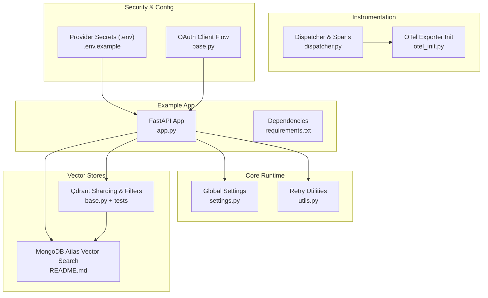
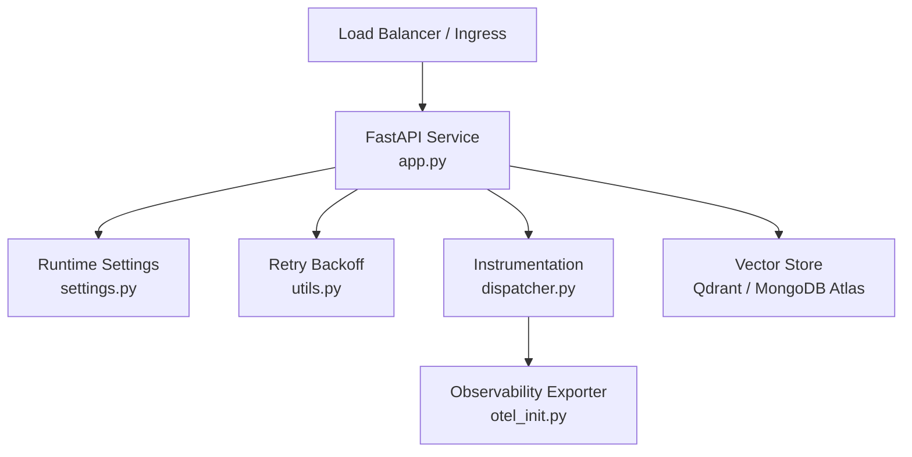
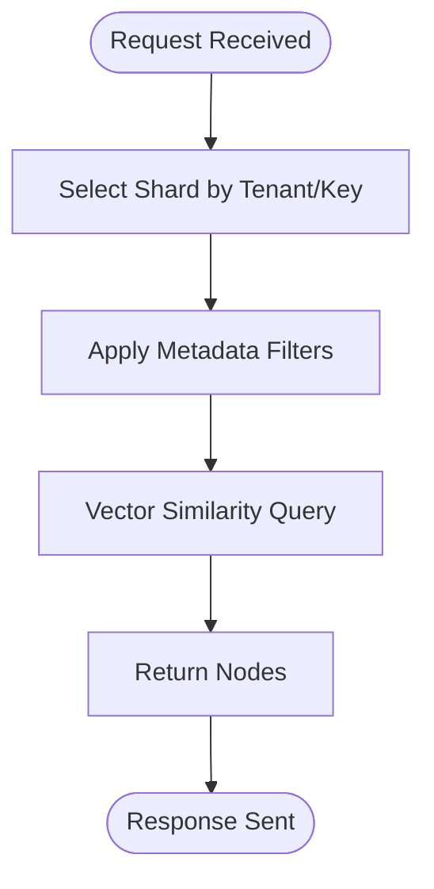
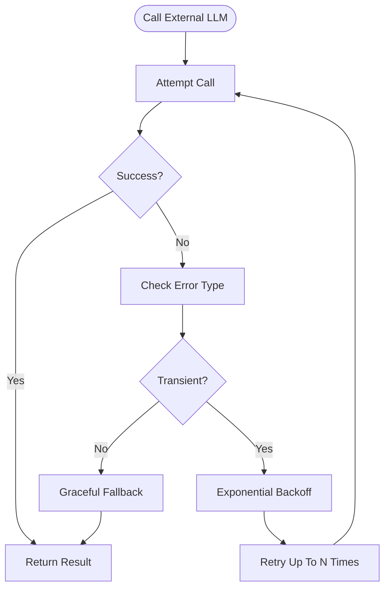
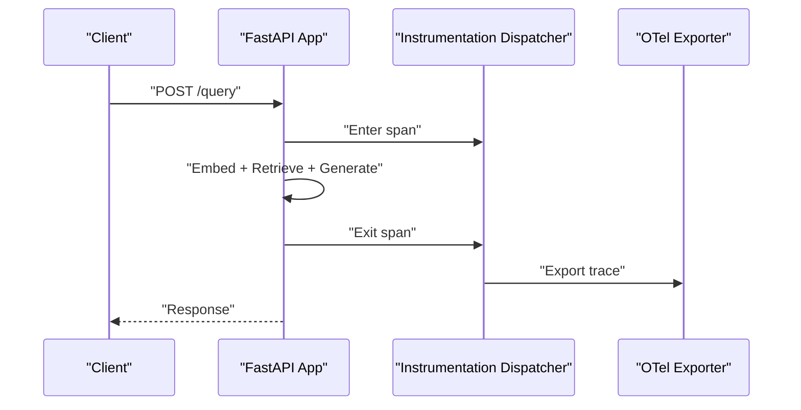
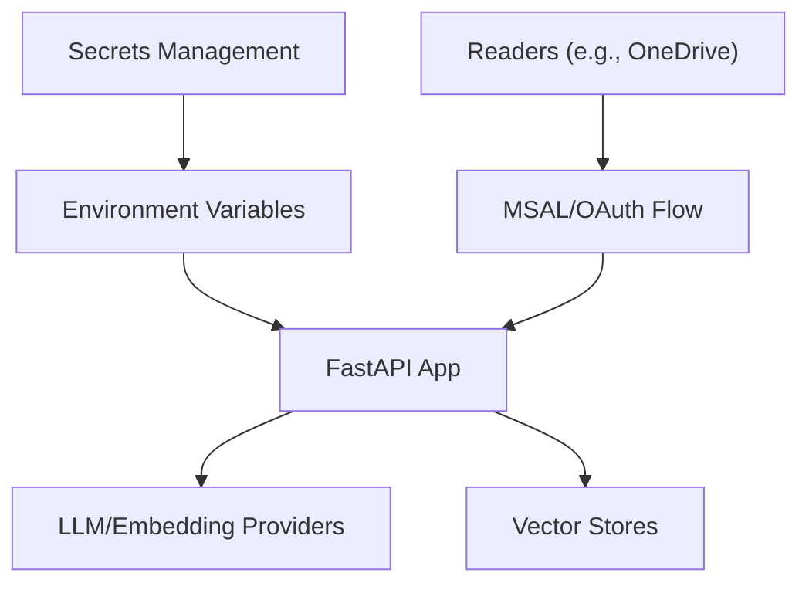
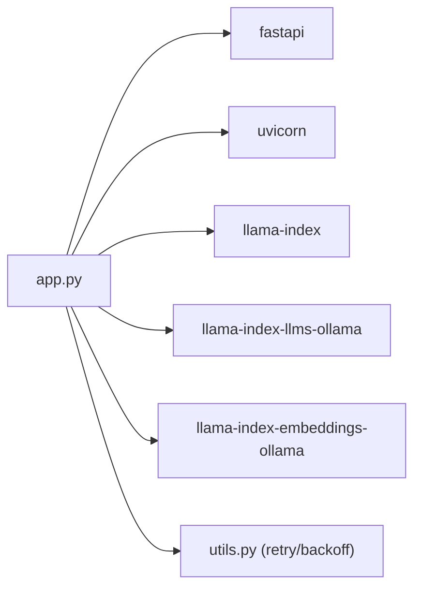
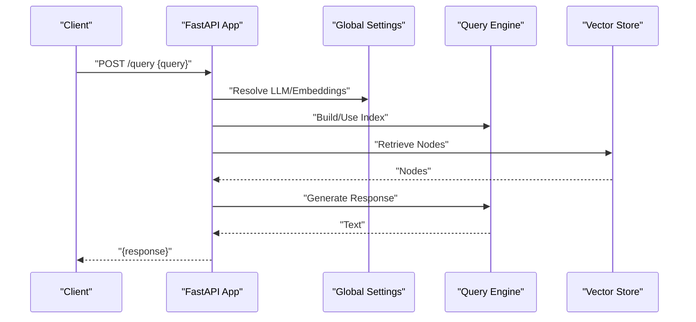

# Production Deployment

<cite>
**Referenced Files in This Document**
- [app.py](file://examples/fastapi_rag_ollama/app.py)
- [README.md](file://examples/fastapi_rag_ollama/README.md)
- [requirements.txt](file://examples/fastapi_rag_ollama/requirements.txt)
- [settings.py](file://llama-index-core/llama_index/core/settings.py)
- [utils.py](file://llama-index-core/llama_index/core/utils.py)
- [test_utils.py](file://llama-index-core/tests/test_utils.py)
- [dispatcher.py](file://llama-index-instrumentation/src/llama_index_instrumentation/dispatcher.py)
- [otel_init.py](file://llama-index-integrations/observability/llama-index-observability-otel/llama_index/observability/otel/__init__.py)
- [base.py](file://llama-index-integrations/vector_stores/llama-index-vector-stores-qdrant/llama_index/vector_stores/qdrant/base.py)
- [test_vector_stores_qdrant.py](file://llama-index-integrations/vector_stores/llama-index-vector-stores-qdrant/tests/test_vector_stores_qdrant.py)
- [base.py](file://llama-index-integrations/storage/chat_store/llama-index-storage-chat-store-yugabytedb/llama_index/storage/chat_store/yugabytedb/base.py)
- [README.md](file://llama-index-integrations/storage/chat_store/llama-index-storage-chat-store-yugabytedb/README.md)
- [base.py](file://llama-index-integrations/readers/llama-index-readers-microsoft-onedrive/llama_index/readers/microsoft_onedrive/base.py)
- [deployment.md](file://docs/src/content/docs/framework/understanding/deployment/deployment.md)
- [.env.example](file://llama-index-integrations/embeddings/llama-index-embeddings-isaacus/.env.example)
- [README.md](file://llama-index-integrations/vector_stores/llama-index-vector-stores-mongodb/README.md)
</cite>

## Table of Contents
1. [Introduction](#introduction)
2. [Project Structure](#project-structure)
3. [Core Components](#core-components)
4. [Architecture Overview](#architecture-overview)
5. [Detailed Component Analysis](#detailed-component-analysis)
6. [Dependency Analysis](#dependency-analysis)
7. [Performance Considerations](#performance-considerations)
8. [Troubleshooting Guide](#troubleshooting-guide)
9. [Conclusion](#conclusion)
10. [Appendices](#appendices)

## Introduction
This document provides production deployment guidance for LlamaIndex-based Retrieval-Augmented Generation (RAG) systems. It focuses on containerization, orchestration, scaling strategies, error handling, and observability. It synthesizes patterns present in the repository’s examples, instrumentation, vector store integrations, and configuration examples to help teams operate reliable, scalable, and observable RAG services in production.

## Project Structure
The repository includes:
- A minimal FastAPI + LlamaIndex RAG example demonstrating a production-style structure for building a query API backed by a local LLM and embeddings.
- Instrumentation primitives for tracing and event dispatching.
- Vector store integrations with sharding and multi-tenant capabilities suitable for horizontal scaling.
- Environment configuration examples for external providers.
- General deployment documentation placeholders.

**Diagram sources**
- [app.py](file://examples/fastapi_rag_ollama/app.py#L1-L30)
- [requirements.txt](file://examples/fastapi_rag_ollama/requirements.txt#L1-L7)
- [settings.py](file://llama-index-core/llama_index/core/settings.py#L1-L249)
- [utils.py](file://llama-index-core/llama_index/core/utils.py#L289-L327)
- [dispatcher.py](file://llama-index-instrumentation/src/llama_index_instrumentation/dispatcher.py#L1-L426)
- [otel_init.py](file://llama-index-integrations/observability/llama-index-observability-otel/llama_index/observability/otel/__init__.py#L1-L6)
- [base.py](file://llama-index-integrations/vector_stores/llama-index-vector-stores-qdrant/llama_index/vector_stores/qdrant/base.py#L1679-L1713)
- [test_vector_stores_qdrant.py](file://llama-index-integrations/vector_stores/llama-index-vector-stores-qdrant/tests/test_vector_stores_qdrant.py#L301-L557)
- [.env.example](file://llama-index-integrations/embeddings/llama-index-embeddings-isaacus/.env.example#L1-L8)
- [base.py](file://llama-index-integrations/readers/llama-index-readers-microsoft-onedrive/llama_index/readers/microsoft_onedrive/base.py#L108-L140)
- [README.md](file://llama-index-integrations/vector_stores/llama-index-vector-stores-mongodb/README.md#L89-L110)

**Section sources**
- [app.py](file://examples/fastapi_rag_ollama/app.py#L1-L30)
- [README.md](file://examples/fastapi_rag_ollama/README.md#L1-L58)
- [settings.py](file://llama-index-core/llama_index/core/settings.py#L1-L249)
- [dispatcher.py](file://llama-index-instrumentation/src/llama_index_instrumentation/dispatcher.py#L1-L426)
- [base.py](file://llama-index-integrations/vector_stores/llama-index-vector-stores-qdrant/llama_index/vector_stores/qdrant/base.py#L1679-L1713)
- [.env.example](file://llama-index-integrations/embeddings/llama-index-embeddings-isaacus/.env.example#L1-L8)

## Core Components
- Global runtime configuration: centralizes LLM, embedding, tokenizer, and transformations for predictable initialization and reuse across requests.
- Retry and backoff utilities: provide robustness against transient failures from LLM providers and network layers.
- Instrumentation dispatcher: enables tracing spans and event dispatching for observability.
- Vector store sharding and filtering: supports horizontal scaling and multi-tenant isolation.
- Example FastAPI app: demonstrates a production-style API surface backed by LlamaIndex.

Key implementation references:
- Global settings singleton and property-based resolution for LLM and embeddings.
- Retry decorator and backoff loop for async functions.
- Dispatcher span lifecycle and event propagation.
- Qdrant sharding validation and shard-specific queries.
- Example FastAPI app wiring LLM and embeddings, loading data at startup, and exposing a query endpoint.

**Section sources**
- [settings.py](file://llama-index-core/llama_index/core/settings.py#L17-L249)
- [utils.py](file://llama-index-core/llama_index/core/utils.py#L289-L327)
- [dispatcher.py](file://llama-index-instrumentation/src/llama_index_instrumentation/dispatcher.py#L181-L403)
- [base.py](file://llama-index-integrations/vector_stores/llama-index-vector-stores-qdrant/llama_index/vector_stores/qdrant/base.py#L1700-L1713)
- [app.py](file://examples/fastapi_rag_ollama/app.py#L1-L30)

## Architecture Overview
A production-grade RAG pipeline typically comprises:
- API gateway/load balancer
- Stateless query engine service (FastAPI + LlamaIndex)
- Vector store (Qdrant/MongoDB Atlas) with sharding and multi-tenant filters
- Optional caching and rate limiting
- Observability stack (tracing, metrics, logs)

**Diagram sources**
- [app.py](file://examples/fastapi_rag_ollama/app.py#L1-L30)
- [settings.py](file://llama-index-core/llama_index/core/settings.py#L17-L249)
- [utils.py](file://llama-index-core/llama_index/core/utils.py#L289-L327)
- [dispatcher.py](file://llama-index-instrumentation/src/llama_index_instrumentation/dispatcher.py#L181-L403)
- [otel_init.py](file://llama-index-integrations/observability/llama-index-observability-otel/llama_index/observability/otel/__init__.py#L1-L6)

## Detailed Component Analysis

### Containerization and Orchestration
- Containerize the FastAPI app with a minimal base image, install dependencies from requirements.txt, and expose the Uvicorn server.
- Use environment variables for provider credentials and runtime configuration.
- For orchestration, define a deployment manifest that sets resource requests/limits, readiness/liveness probes, and autoscaling policies.

Practical anchors:
- Example app entrypoint and dependencies.
- Provider secrets via environment variables.

**Section sources**
- [README.md](file://examples/fastapi_rag_ollama/README.md#L15-L58)
- [requirements.txt](file://examples/fastapi_rag_ollama/requirements.txt#L1-L7)
- [.env.example](file://llama-index-integrations/embeddings/llama-index-embeddings-isaacus/.env.example#L1-L8)

### Scaling Strategies

#### Horizontal Scaling
- Scale the query engine pods behind a load balancer. Ensure stateless design: keep persistent state in the vector store and shared caches.
- Use sharding and tenant-aware filters to distribute load across shards and reduce hotspots.

Evidence from vector store integrations:
- Qdrant supports shard selection and targeted queries.
- Tests demonstrate shard-specific filtering and deletion.

**Diagram sources**
- [base.py](file://llama-index-integrations/vector_stores/llama-index-vector-stores-qdrant/llama_index/vector_stores/qdrant/base.py#L1679-L1713)
- [test_vector_stores_qdrant.py](file://llama-index-integrations/vector_stores/llama-index-vector-stores-qdrant/tests/test_vector_stores_qdrant.py#L301-L557)

**Section sources**
- [base.py](file://llama-index-integrations/vector_stores/llama-index-vector-stores-qdrant/llama_index/vector_stores/qdrant/base.py#L1679-L1713)
- [test_vector_stores_qdrant.py](file://llama-index-integrations/vector_stores/llama-index-vector-stores-qdrant/tests/test_vector_stores_qdrant.py#L301-L557)

#### Vertical Scaling
- Increase CPU/RAM for the query engine to handle larger context windows or concurrent requests.
- Tune embedding and LLM model resources according to latency targets and cost constraints.

[No sources needed since this section provides general guidance]

### Error Handling, Circuit Breakers, and Graceful Degradation
- Implement retries with exponential backoff for transient failures from LLM providers and network layers.
- Use circuit breaker patterns to prevent cascading failures during upstream outages.
- Gracefully degrade by falling back to cached results, smaller context windows, or simpler retrieval strategies.

**Diagram sources**
- [utils.py](file://llama-index-core/llama_index/core/utils.py#L289-L327)
- [test_utils.py](file://llama-index-core/tests/test_utils.py#L58-L146)

**Section sources**
- [utils.py](file://llama-index-core/llama_index/core/utils.py#L289-L327)
- [test_utils.py](file://llama-index-core/tests/test_utils.py#L58-L146)

### Monitoring and Observability
- Use the instrumentation dispatcher to emit spans around critical operations (e.g., embedding, retrieval, generation).
- Export traces to an observability backend via the OTel exporter initializer.
- Collect metrics for request latency, error rates, and throughput; correlate with spans for debugging.

**Diagram sources**
- [dispatcher.py](file://llama-index-instrumentation/src/llama_index_instrumentation/dispatcher.py#L181-L403)
- [otel_init.py](file://llama-index-integrations/observability/llama-index-observability-otel/llama_index/observability/otel/__init__.py#L1-L6)

**Section sources**
- [dispatcher.py](file://llama-index-instrumentation/src/llama_index_instrumentation/dispatcher.py#L181-L403)
- [otel_init.py](file://llama-index-integrations/observability/llama-index-observability-otel/llama_index/observability/otel/__init__.py#L1-L6)

### Security, Access Control, and Compliance
- Manage provider credentials via environment variables and secret managers; avoid hardcoding tokens.
- Enforce least privilege for vector store connections and reader integrations (e.g., OAuth flows).
- Apply network policies, TLS termination, and audit logging at the ingress and service mesh level.

**Diagram sources**
- [.env.example](file://llama-index-integrations/embeddings/llama-index-embeddings-isaacus/.env.example#L1-L8)
- [base.py](file://llama-index-integrations/readers/llama-index-readers-microsoft-onedrive/llama_index/readers/microsoft_onedrive/base.py#L108-L140)
- [README.md](file://llama-index-integrations/vector_stores/llama-index-vector-stores-mongodb/README.md#L89-L110)

**Section sources**
- [.env.example](file://llama-index-integrations/embeddings/llama-index-embeddings-isaacus/.env.example#L1-L8)
- [base.py](file://llama-index-integrations/readers/llama-index-readers-microsoft-onedrive/llama_index/readers/microsoft_onedrive/base.py#L108-L140)
- [README.md](file://llama-index-integrations/vector_stores/llama-index-vector-stores-mongodb/README.md#L89-L110)

### Practical Examples: Deploying RAG Applications
- Build and run the FastAPI example locally, then containerize and deploy behind a load balancer.
- Configure environment variables for provider credentials and runtime settings.
- Set up health checks and autoscaling based on CPU or request metrics.

**Section sources**
- [README.md](file://examples/fastapi_rag_ollama/README.md#L20-L58)
- [app.py](file://examples/fastapi_rag_ollama/app.py#L1-L30)
- [settings.py](file://llama-index-core/llama_index/core/settings.py#L17-L249)

## Dependency Analysis
The example app depends on:
- FastAPI and Uvicorn for the HTTP server
- LlamaIndex core for indexing and querying
- LlamaIndex integrations for LLM and embeddings
- Retry utilities for resilience

**Diagram sources**
- [app.py](file://examples/fastapi_rag_ollama/app.py#L1-L30)
- [requirements.txt](file://examples/fastapi_rag_ollama/requirements.txt#L1-L7)
- [utils.py](file://llama-index-core/llama_index/core/utils.py#L289-L327)

**Section sources**
- [app.py](file://examples/fastapi_rag_ollama/app.py#L1-L30)
- [requirements.txt](file://examples/fastapi_rag_ollama/requirements.txt#L1-L7)
- [utils.py](file://llama-index-core/llama_index/core/utils.py#L289-L327)

## Performance Considerations
- Optimize embedding and retrieval costs by selecting appropriate models and vector store configurations.
- Use sharding and tenant-aware filters to minimize cross-shard scans.
- Tune chunk size and overlap to balance recall and latency.
- Employ caching for frequent queries and warm embeddings where feasible.

[No sources needed since this section provides general guidance]

## Troubleshooting Guide
- Use the retry utilities to diagnose transient failures and adjust backoff parameters.
- Inspect instrumentation spans to locate slow steps in the pipeline.
- Validate vector store sharding and filters to ensure correct shard targeting.

**Section sources**
- [utils.py](file://llama-index-core/llama_index/core/utils.py#L289-L327)
- [dispatcher.py](file://llama-index-instrumentation/src/llama_index_instrumentation/dispatcher.py#L181-L403)
- [test_vector_stores_qdrant.py](file://llama-index-integrations/vector_stores/llama-index-vector-stores-qdrant/tests/test_vector_stores_qdrant.py#L301-L557)

## Conclusion
By combining a production-style FastAPI app, resilient retry/backoff mechanisms, sharded vector stores, and comprehensive instrumentation, teams can deploy reliable RAG services. Scaling is achieved through horizontal partitioning and careful resource allocation, while observability and security practices ensure operational excellence and compliance.

[No sources needed since this section summarizes without analyzing specific files]

## Appendices

### Appendix A: Example API Workflow

**Diagram sources**
- [app.py](file://examples/fastapi_rag_ollama/app.py#L25-L29)
- [settings.py](file://llama-index-core/llama_index/core/settings.py#L32-L74)