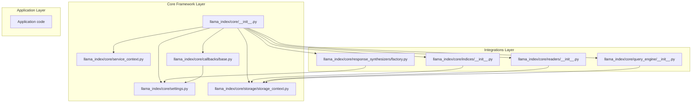
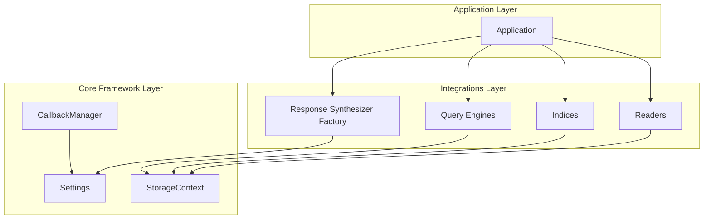
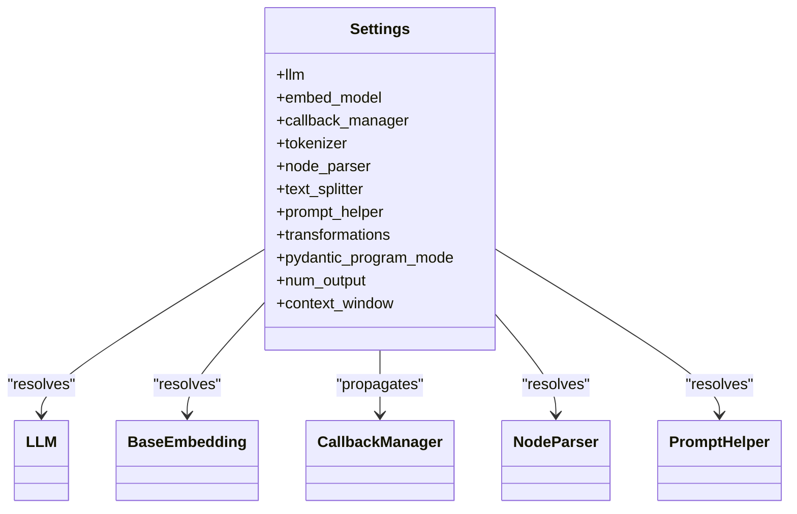
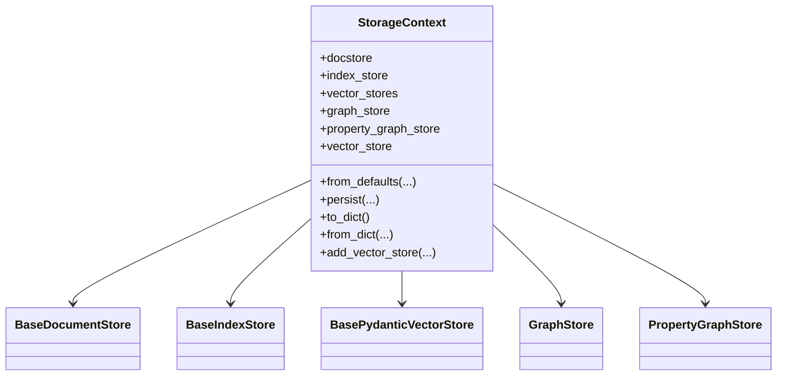
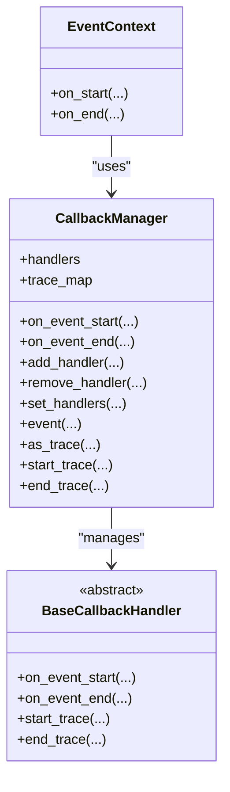
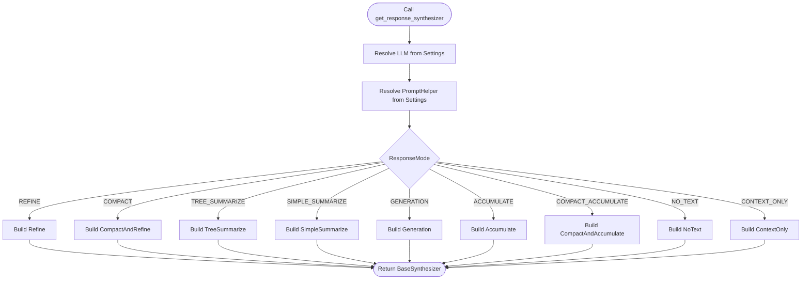
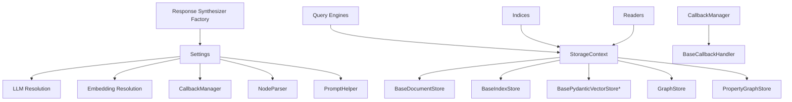

# Architecture Overview

<cite>
**Referenced Files in This Document**
- [llama_index/core/__init__.py](file://llama-index-core/llama_index/core/__init__.py)
- [llama_index/core/settings.py](file://llama-index-core/llama_index/core/settings.py)
- [llama_index/core/service_context.py](file://llama-index-core/llama_index/core/service_context.py)
- [llama_index/core/callbacks/base_handler.py](file://llama-index-core/llama_index/core/callbacks/base_handler.py)
- [llama_index/core/callbacks/base.py](file://llama-index-core/llama_index/core/callbacks/base.py)
- [llama_index/core/storage/storage_context.py](file://llama-index-core/llama_index/core/storage/storage_context.py)
- [llama_index/core/storage/docstore/types.py](file://llama-index-core/llama_index/core/storage/docstore/types.py)
- [llama_index/core/storage/index_store/types.py](file://llama-index-core/llama_index/core/storage/index_store/types.py)
- [llama_index/core/indices/__init__.py](file://llama-index-core/llama_index/core/indices/__init__.py)
- [llama_index/core/query_engine/__init__.py](file://llama-index-core/llama_index/core/query_engine/__init__.py)
- [llama_index/core/readers/__init__.py](file://llama-index-core/llama_index/core/readers/__init__.py)
- [llama_index/core/response_synthesizers/factory.py](file://llama-index-core/llama_index/core/response_synthesizers/factory.py)
</cite>

## Table of Contents
1. [Introduction](#introduction)
2. [Project Structure](#project-structure)
3. [Core Components](#core-components)
4. [Architecture Overview](#architecture-overview)
5. [Detailed Component Analysis](#detailed-component-analysis)
6. [Dependency Analysis](#dependency-analysis)
7. [Performance Considerations](#performance-considerations)
8. [Troubleshooting Guide](#troubleshooting-guide)
9. [Conclusion](#conclusion)

## Introduction
This document presents a comprehensive architecture overview of LlamaIndex’s system design. It describes the layered architecture with a core framework layer, an integrations layer, and an application layer. It documents the plugin-based extensibility system, the component factory pattern, and the event-driven callback architecture. It explains the relationships among settings, indices, readers, and storage systems, and provides system context diagrams that show how components interact and data flows through the pipeline. Design patterns used include factory, strategy, observer, and builder. Finally, it addresses scalability considerations, modularity principles, and how the architecture supports both simple and complex use cases.

## Project Structure
LlamaIndex is organized around a core Python package that exposes top-level imports and orchestrates subsystems for indices, readers, storage, callbacks, and query engines. The core package aggregates indices, readers, storage contexts, settings, and response synthesizers, enabling a layered approach where higher-level application logic composes lower-level building blocks.

**Diagram sources**
- [llama_index/core/__init__.py](file://llama-index-core/llama_index/core/__init__.py#L1-L162)
- [llama_index/core/settings.py](file://llama-index-core/llama_index/core/settings.py#L1-L249)
- [llama_index/core/service_context.py](file://llama-index-core/llama_index/core/service_context.py#L1-L49)
- [llama_index/core/callbacks/base.py](file://llama-index-core/llama_index/core/callbacks/base.py#L1-L303)
- [llama_index/core/storage/storage_context.py](file://llama-index-core/llama_index/core/storage/storage_context.py#L1-L278)
- [llama_index/core/indices/__init__.py](file://llama-index-core/llama_index/core/indices/__init__.py#L1-L88)
- [llama_index/core/query_engine/__init__.py](file://llama-index-core/llama_index/core/query_engine/__init__.py#L1-L88)
- [llama_index/core/readers/__init__.py](file://llama-index-core/llama_index/core/readers/__init__.py#L1-L33)
- [llama_index/core/response_synthesizers/factory.py](file://llama-index-core/llama_index/core/response_synthesizers/factory.py#L1-L152)

**Section sources**
- [llama_index/core/__init__.py](file://llama-index-core/llama_index/core/__init__.py#L1-L162)

## Core Components
- Settings: Centralized configuration provider with lazy initialization for LLM, embeddings, callback manager, tokenizer, node parser, prompt helper, and transformations. It integrates with the callback manager and prompt helper to propagate configuration downstream.
- StorageContext: Aggregates document store, index store, vector stores (including image store), graph store, and property graph store. Provides persistence and convenience constructors for default and namespaced vector stores.
- Indices: A broad set of index types (keyword table, tree, vector store, knowledge graph, property graph, etc.) exposed via the indices package init.
- Readers: Data connectors that produce Document objects, including directory reader and downloadable loaders.
- Query Engines: A variety of query engines (retriever-based, router-based, multi-step, knowledge graph, SQL, multimodal) exposed via the query engine package init.
- Response Synthesizers: Factory that constructs synthesizers based on response modes and templates, integrating with Settings for LLM and prompt helper.
- Callback Manager: Event-driven observer system that tracks trace stacks, emits start/end events, and coordinates handler lifecycles.

**Section sources**
- [llama_index/core/settings.py](file://llama-index-core/llama_index/core/settings.py#L1-L249)
- [llama_index/core/storage/storage_context.py](file://llama-index-core/llama_index/core/storage/storage_context.py#L1-L278)
- [llama_index/core/indices/__init__.py](file://llama-index-core/llama_index/core/indices/__init__.py#L1-L88)
- [llama_index/core/readers/__init__.py](file://llama-index-core/llama_index/core/readers/__init__.py#L1-L33)
- [llama_index/core/query_engine/__init__.py](file://llama-index-core/llama_index/core/query_engine/__init__.py#L1-L88)
- [llama_index/core/response_synthesizers/factory.py](file://llama-index-core/llama_index/core/response_synthesizers/factory.py#L1-L152)
- [llama_index/core/callbacks/base.py](file://llama-index-core/llama_index/core/callbacks/base.py#L1-L303)

## Architecture Overview
LlamaIndex follows a layered architecture:
- Core Framework Layer: Provides foundational services (Settings, StorageContext, CallbackManager).
- Integrations Layer: Exposes indices, readers, query engines, and response synthesizers as pluggable components.
- Application Layer: Composes components to build end-to-end pipelines for ingestion and querying.

The system emphasizes modularity and extensibility:
- Plugin-based extensibility: Users can supply custom LLMs, embeddings, node parsers, and vector stores; Settings resolves them lazily.
- Component factory pattern: Response synthesizer factory selects implementations based on response mode and templates.
- Event-driven callback architecture: CallbackManager observes lifecycle events across operations, enabling tracing and instrumentation.

**Diagram sources**
- [llama_index/core/settings.py](file://llama-index-core/llama_index/core/settings.py#L1-L249)
- [llama_index/core/storage/storage_context.py](file://llama-index-core/llama_index/core/storage/storage_context.py#L1-L278)
- [llama_index/core/callbacks/base.py](file://llama-index-core/llama_index/core/callbacks/base.py#L1-L303)
- [llama_index/core/indices/__init__.py](file://llama-index-core/llama_index/core/indices/__init__.py#L1-L88)
- [llama_index/core/query_engine/__init__.py](file://llama-index-core/llama_index/core/query_engine/__init__.py#L1-L88)
- [llama_index/core/readers/__init__.py](file://llama-index-core/llama_index/core/readers/__init__.py#L1-L33)
- [llama_index/core/response_synthesizers/factory.py](file://llama-index-core/llama_index/core/response_synthesizers/factory.py#L1-L152)

## Detailed Component Analysis

### Settings and Global Configuration
Settings centralizes configuration resolution and propagation:
- Lazy initialization ensures resources (LLM, embeddings, callback manager, tokenizer, node parser, prompt helper) are created only when accessed.
- Properties expose resolved instances and integrate with downstream components (e.g., callback manager propagation).
- Provides aliases for related configuration (e.g., text_splitter for node parser).

**Diagram sources**
- [llama_index/core/settings.py](file://llama-index-core/llama_index/core/settings.py#L1-L249)

**Section sources**
- [llama_index/core/settings.py](file://llama-index-core/llama_index/core/settings.py#L1-L249)

### StorageContext and Persistence
StorageContext aggregates storage backends and provides:
- Default construction with in-memory stores or persistent stores from a directory.
- Namespaced vector stores for multiple namespaces (e.g., images).
- Persist and restore routines for docstore, index store, graph store, property graph store, and vector stores.

**Diagram sources**
- [llama_index/core/storage/storage_context.py](file://llama-index-core/llama_index/core/storage/storage_context.py#L1-L278)
- [llama_index/core/storage/docstore/types.py](file://llama-index-core/llama_index/core/storage/docstore/types.py#L1-L273)
- [llama_index/core/storage/index_store/types.py](file://llama-index-core/llama_index/core/storage/index_store/types.py#L1-L56)

**Section sources**
- [llama_index/core/storage/storage_context.py](file://llama-index-core/llama_index/core/storage/storage_context.py#L1-L278)
- [llama_index/core/storage/docstore/types.py](file://llama-index-core/llama_index/core/storage/docstore/types.py#L1-L273)
- [llama_index/core/storage/index_store/types.py](file://llama-index-core/llama_index/core/storage/index_store/types.py#L1-L56)

### Callback Manager and Event-Driven Architecture
The callback system implements an observer pattern:
- BaseCallbackHandler defines the contract for event start/end and trace lifecycle.
- CallbackManager manages handlers, maintains trace stacks, and coordinates event emission.
- EventContext wraps per-event lifecycle for convenient start/end usage.

**Diagram sources**
- [llama_index/core/callbacks/base_handler.py](file://llama-index-core/llama_index/core/callbacks/base_handler.py#L1-L56)
- [llama_index/core/callbacks/base.py](file://llama-index-core/llama_index/core/callbacks/base.py#L1-L303)

**Section sources**
- [llama_index/core/callbacks/base_handler.py](file://llama-index-core/llama_index/core/callbacks/base_handler.py#L1-L56)
- [llama_index/core/callbacks/base.py](file://llama-index-core/llama_index/core/callbacks/base.py#L1-L303)

### Response Synthesizer Factory Pattern
The response synthesizer factory demonstrates a factory pattern:
- Selects synthesizer implementations based on response mode and templates.
- Resolves LLM and prompt helper from Settings when not provided.
- Supports streaming, async, and structured output configurations.

**Diagram sources**
- [llama_index/core/response_synthesizers/factory.py](file://llama-index-core/llama_index/core/response_synthesizers/factory.py#L1-L152)

**Section sources**
- [llama_index/core/response_synthesizers/factory.py](file://llama-index-core/llama_index/core/response_synthesizers/factory.py#L1-L152)

### Indices, Readers, and Query Engines
- Indices: A wide range of index types are exposed via the indices package init, enabling different indexing strategies.
- Readers: Data connectors produce Documents for ingestion.
- Query Engines: A rich set of engines enable retrieval, routing, composition, and specialized queries.

**Diagram sources**
- [llama_index/core/indices/__init__.py](file://llama-index-core/llama_index/core/indices/__init__.py#L1-L88)
- [llama_index/core/readers/__init__.py](file://llama-index-core/llama_index/core/readers/__init__.py#L1-L33)
- [llama_index/core/query_engine/__init__.py](file://llama-index-core/llama_index/core/query_engine/__init__.py#L1-L88)
- [llama_index/core/storage/storage_context.py](file://llama-index-core/llama_index/core/storage/storage_context.py#L1-L278)

**Section sources**
- [llama_index/core/indices/__init__.py](file://llama-index-core/llama_index/core/indices/__init__.py#L1-L88)
- [llama_index/core/readers/__init__.py](file://llama-index-core/llama_index/core/readers/__init__.py#L1-L33)
- [llama_index/core/query_engine/__init__.py](file://llama-index-core/llama_index/core/query_engine/__init__.py#L1-L88)

## Dependency Analysis
- Settings depends on LLM resolution, embedding resolution, callback manager, tokenizer, node parser, and prompt helper. It propagates callback manager to downstream components.
- StorageContext aggregates multiple storage backends and supports persistence and restoration.
- CallbackManager depends on BaseCallbackHandler and maintains trace stacks and trace maps.
- Response Synthesizer Factory depends on Settings for LLM and prompt helper resolution.
- Indices, Readers, and Query Engines depend on StorageContext for persistence and retrieval.

**Diagram sources**
- [llama_index/core/settings.py](file://llama-index-core/llama_index/core/settings.py#L1-L249)
- [llama_index/core/storage/storage_context.py](file://llama-index-core/llama_index/core/storage/storage_context.py#L1-L278)
- [llama_index/core/callbacks/base.py](file://llama-index-core/llama_index/core/callbacks/base.py#L1-L303)
- [llama_index/core/response_synthesizers/factory.py](file://llama-index-core/llama_index/core/response_synthesizers/factory.py#L1-L152)
- [llama_index/core/indices/__init__.py](file://llama-index-core/llama_index/core/indices/__init__.py#L1-L88)
- [llama_index/core/query_engine/__init__.py](file://llama-index-core/llama_index/core/query_engine/__init__.py#L1-L88)
- [llama_index/core/readers/__init__.py](file://llama-index-core/llama_index/core/readers/__init__.py#L1-L33)

**Section sources**
- [llama_index/core/settings.py](file://llama-index-core/llama_index/core/settings.py#L1-L249)
- [llama_index/core/storage/storage_context.py](file://llama-index-core/llama_index/core/storage/storage_context.py#L1-L278)
- [llama_index/core/callbacks/base.py](file://llama-index-core/llama_index/core/callbacks/base.py#L1-L303)
- [llama_index/core/response_synthesizers/factory.py](file://llama-index-core/llama_index/core/response_synthesizers/factory.py#L1-L152)
- [llama_index/core/indices/__init__.py](file://llama-index-core/llama_index/core/indices/__init__.py#L1-L88)
- [llama_index/core/query_engine/__init__.py](file://llama-index-core/llama_index/core/query_engine/__init__.py#L1-L88)
- [llama_index/core/readers/__init__.py](file://llama-index-core/llama_index/core/readers/__init__.py#L1-L33)

## Performance Considerations
- Lazy initialization in Settings reduces startup overhead by deferring resource creation until needed.
- Namespaced vector stores in StorageContext enable efficient multi-modal or multi-domain retrieval without cross-contamination.
- CallbackManager’s trace stack and trace map minimize contention in concurrent environments by copying context variables per operation.
- Batch APIs in storage backends (e.g., BaseDocumentStore, BaseIndexStore) support bulk operations to reduce I/O overhead.
- Streaming and async options in response synthesizers enable scalable generation pipelines.

## Troubleshooting Guide
- ServiceContext deprecation: The legacy ServiceContext is deprecated in favor of Settings and local module injection. Migrate by using Settings or passing modules directly to interfaces.
- Handler uniqueness: CallbackManager enforces unique handler types to avoid ambiguous event handling; ensure distinct handler classes are registered.
- Trace lifecycle: Use EventContext or CallbackManager’s event/as_trace context managers to guarantee proper event start/end pairing and trace completion.

**Section sources**
- [llama_index/core/service_context.py](file://llama-index-core/llama_index/core/service_context.py#L1-L49)
- [llama_index/core/callbacks/base.py](file://llama-index-core/llama_index/core/callbacks/base.py#L1-L303)

## Conclusion
LlamaIndex’s architecture balances modularity and extensibility through a layered design. The Settings singleton provides centralized configuration with lazy initialization, while StorageContext aggregates storage backends and offers persistence. The callback system enables event-driven tracing and instrumentation. The response synthesizer factory and the broad sets of indices, readers, and query engines form a flexible integrations layer that supports simple and complex use cases. Together, these patterns deliver scalability, maintainability, and a robust foundation for building retrieval-augmented applications.