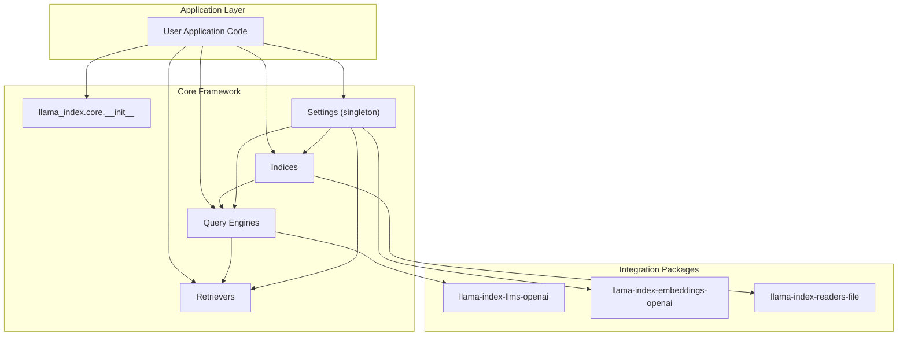
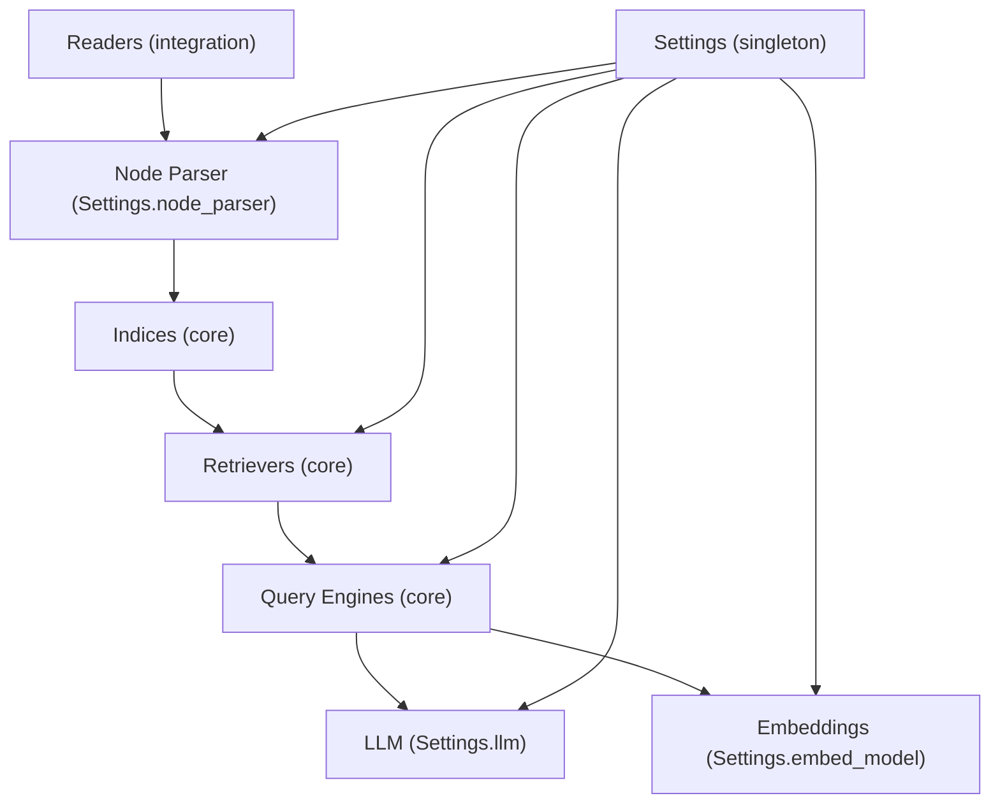
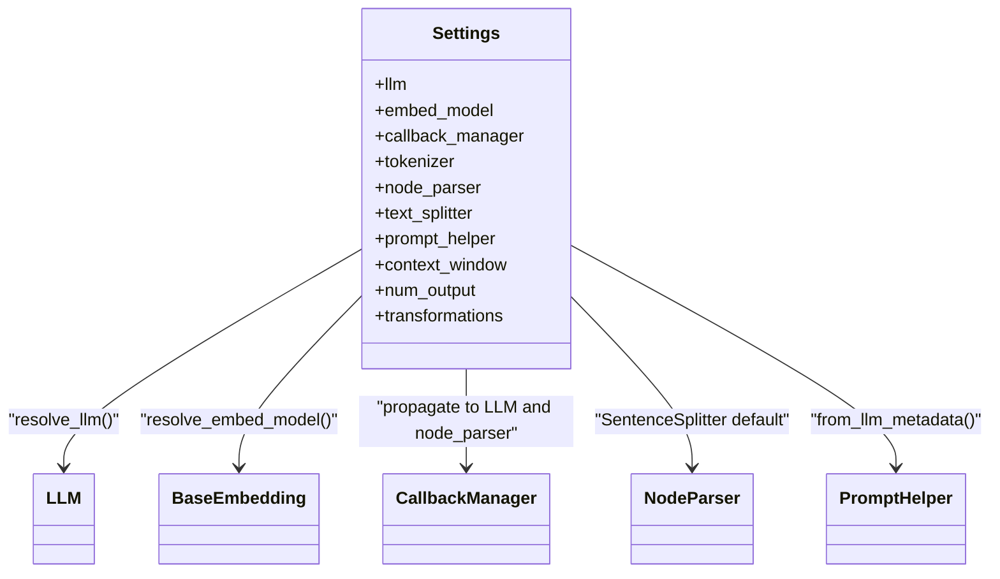
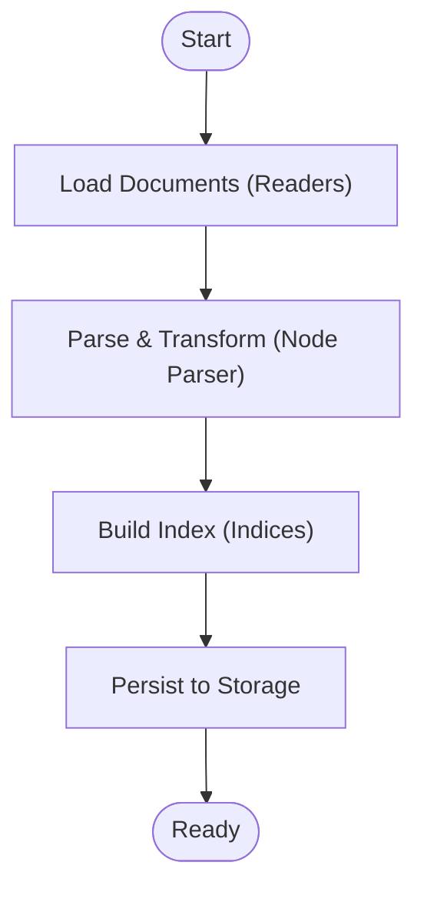
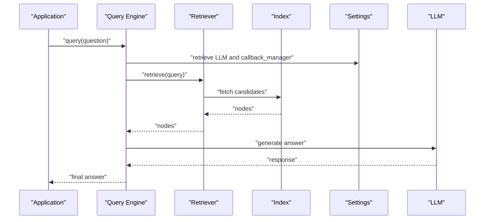
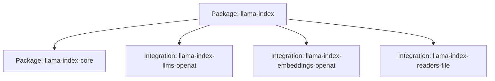

# Architecture Overview

<cite>
**Referenced Files in This Document**
- [README.md](file://README.md)
- [pyproject.toml](file://pyproject.toml)
- [llama_index-core/pyproject.toml](file://llama-index-core/pyproject.toml)
- [llama_index-core/llama_index/core/__init__.py](file://llama-index-core/llama_index/core/__init__.py)
- [llama-index-core/llama_index/core/settings.py](file://llama-index-core/llama_index/core/settings.py)
- [llama-index-core/llama_index/core/service_context.py](file://llama-index-core/llama_index/core/service_context.py)
- [llama-index-core/llama_index/core/indices/__init__.py](file://llama-index-core/llama_index/core/indices/__init__.py)
- [llama-index-core/llama_index/core/query_engine/__init__.py](file://llama-index-core/llama_index/core/query_engine/__init__.py)
- [llama-index-core/llama_index/core/retrievers/__init__.py](file://llama-index-core/llama_index/core/retrievers/__init__.py)
- [llama-index-integrations/embeddings/llama-index-embeddings-openai/llama_index/embeddings/openai/__init__.py](file://llama-index-integrations/embeddings/llama-index-embeddings-openai/llama_index/embeddings/openai/__init__.py)
- [llama-index-integrations/llms/llama-index-llms-openai/llama_index/llms/openai/__init__.py](file://llama-index-integrations/llms/llama-index-llms-openai/llama_index/llms/openai/__init__.py)
- [llama-index-integrations/readers/llama-index-readers-file/llama_index/readers/file/__init__.py](file://llama-index-integrations/readers/llama-index-readers-file/llama_index/readers/file/__init__.py)
</cite>

## Table of Contents
1. [Introduction](#introduction)
2. [Project Structure](#project-structure)
3. [Core Components](#core-components)
4. [Architecture Overview](#architecture-overview)
5. [Detailed Component Analysis](#detailed-component-analysis)
6. [Dependency Analysis](#dependency-analysis)
7. [Performance Considerations](#performance-considerations)
8. [Troubleshooting Guide](#troubleshooting-guide)
9. [Conclusion](#conclusion)

## Introduction
This document describes the architecture of the LlamaIndex framework with a focus on the modular monorepo design, the separation between the core framework, integration packages, and application layers, and how the Settings singleton coordinates global configuration across components. It also explains the dual package approach (llama-index vs llama-index-core), the namespace pattern for imports, and the plugin architecture that enables extensibility. The goal is to make the system understandable for both beginners and advanced users.

## Project Structure
LlamaIndex is organized as a monorepo with:
- Core framework under llama-index-core: foundational abstractions, indices, query engines, retrievers, and global configuration.
- Integration packages under llama-index-integrations: vendor-specific implementations for LLMs, embeddings, readers, vector stores, and more.
- Application layer: user code that composes core and selected integrations to build RAG pipelines.

Key characteristics:
- Namespaced imports: imports containing core refer to the core package; imports without core refer to integration packages.
- Dual package strategy: a “starter” distribution (llama-index) bundles core plus selected integrations; a “core-only” distribution (llama-index-core) lets users pick and choose integrations.

```mermaid
graph TB
subgraph "Application Layer"
App["User Application Code"]
end
subgraph "Integration Packages"
IntLLM["llama-index-llms-openai"]
IntEmb["llama-index-embeddings-openai"]
IntRead["llama-index-readers-file"]
end
subgraph "Core Framework"
CoreInit["llama_index.core.__init__"]
Settings["Settings (singleton)"]
Indices["Indices"]
QEngines["Query Engines"]
Retrievers["Retrievers"]
end
App --> CoreInit
App --> Settings
App --> Indices
App --> QEngines
App --> Retrievers
QEngines --> Retrievers
Indices --> QEngines
Settings --> QEngines
Settings --> Indices
Settings --> Retrievers
QEngines --> IntLLM
Settings --> IntEmb
Indices --> IntRead
```

**Diagram sources**
- [llama_index-core/llama_index/core/__init__.py](file://llama-index-core/llama_index/core/__init__.py#L1-L162)
- [llama-index-core/llama_index/core/settings.py](file://llama-index-core/llama_index/core/settings.py#L1-L249)
- [llama-index-core/llama_index/core/indices/__init__.py](file://llama-index-core/llama_index/core/indices/__init__.py#L1-L88)
- [llama-index-core/llama_index/core/query_engine/__init__.py](file://llama-index-core/llama_index/core/query_engine/__init__.py#L1-L88)
- [llama-index-core/llama_index/core/retrievers/__init__.py](file://llama-index-core/llama_index/core/retrievers/__init__.py#L1-L89)
- [llama-index-integrations/llms/llama-index-llms-openai/llama_index/llms/openai/__init__.py](file://llama-index-integrations/llms/llama-index-llms-openai/llama_index/llms/openai/__init__.py#L1-L5)
- [llama-index-integrations/embeddings/llama-index-embeddings-openai/llama_index/embeddings/openai/__init__.py](file://llama-index-integrations/embeddings/llama-index-embeddings-openai/llama_index/embeddings/openai/__init__.py#L1-L14)
- [llama-index-integrations/readers/llama-index-readers-file/llama_index/readers/file/__init__.py](file://llama-index-integrations/readers/llama-index-readers-file/llama_index/readers/file/__init__.py#L1-L50)

**Section sources**
- [README.md](file://README.md#L11-L35)
- [pyproject.toml](file://pyproject.toml#L42-L50)
- [llama-index-core/pyproject.toml](file://llama-index-core/pyproject.toml#L34-L84)

## Core Components
- Global configuration: Settings singleton encapsulates LLM, embedding model, callback manager, tokenizer, node parser, prompt helper, and transformations. It lazily resolves defaults and propagates callback manager to dependent components.
- Indices: A broad set of index types (keyword, tree, vector, knowledge graph, property graph, etc.) exposed via core indices module.
- Query engines: High-level orchestration around retrievers and indices, including router, multi-step, knowledge graph, SQL, and multimodal query engines.
- Retrievers: Pluggable retrieval strategies (vector, keyword, recursive, auto-merging, fusion, etc.) that feed query engines.

These components are designed to be composable: applications configure Settings once, then construct indices and query engines that internally use the configured components.

**Section sources**
- [llama-index-core/llama_index/core/settings.py](file://llama-index-core/llama_index/core/settings.py#L17-L249)
- [llama-index-core/llama_index/core/__init__.py](file://llama-index-core/llama_index/core/__init__.py#L17-L88)
- [llama-index-core/llama_index/core/indices/__init__.py](file://llama-index-core/llama_index/core/indices/__init__.py#L1-L88)
- [llama-index-core/llama_index/core/query_engine/__init__.py](file://llama-index-core/llama_index/core/query_engine/__init__.py#L1-L88)
- [llama-index-core/llama_index/core/retrievers/__init__.py](file://llama-index-core/llama_index/core/retrievers/__init__.py#L1-L89)

## Architecture Overview
The architecture centers on a global Settings singleton that standardizes configuration across the framework. Applications import from core for foundational types and from integration packages for vendor-specific implementations. The data flow typically follows:
- Data ingestion via readers → node parsing and transformations → indexing → retrieval → query engine orchestration → response synthesis.

```mermaid
graph TB
Reader["Readers (integration)"] --> Parser["Node Parser (Settings.node_parser)"]
Parser --> Index["Indices (core)"]
Index --> Retriever["Retrievers (core)"]
Retriever --> QEngine["Query Engines (core)"]
QEngine --> LLM["LLM (Settings.llm)"]
QEngine --> Embed["Embeddings (Settings.embed_model)"]
Settings["Settings (singleton)"] --> LLM
Settings --> Embed
Settings --> Parser
Settings --> Retriever
Settings --> QEngine
```

**Diagram sources**
- [llama-index-core/llama_index/core/settings.py](file://llama-index-core/llama_index/core/settings.py#L32-L74)
- [llama-index-core/llama_index/core/indices/__init__.py](file://llama-index-core/llama_index/core/indices/__init__.py#L1-L88)
- [llama-index-core/llama_index/core/retrievers/__init__.py](file://llama-index-core/llama_index/core/retrievers/__init__.py#L1-L89)
- [llama-index-core/llama_index/core/query_engine/__init__.py](file://llama-index-core/llama_index/core/query_engine/__init__.py#L1-L88)
- [llama-index-integrations/readers/llama-index-readers-file/llama_index/readers/file/__init__.py](file://llama-index-integrations/readers/llama-index-readers-file/llama_index/readers/file/__init__.py#L1-L50)

## Detailed Component Analysis

### Settings Singleton Pattern
Settings is a singleton dataclass that lazily initializes and exposes:
- LLM and pydantic program mode
- Embedding model
- Callback manager
- Tokenizer
- Node parser and aliases (node_parser/text_splitter)
- Prompt helper and derived context window/num_output
- Transformations list (defaults to [node_parser])

Behavior highlights:
- Lazy resolution: components are resolved on first access.
- Callback propagation: callback manager is attached to LLM and node parser when present.
- Compatibility: maintains backward-compatible globals for tokenizer and callback handler.

```mermaid
classDiagram
class Settings {
+llm
+embed_model
+callback_manager
+tokenizer
+node_parser
+text_splitter
+prompt_helper
+context_window
+num_output
+transformations
}
class LLM {
}
class BaseEmbedding {
}
class CallbackManager {
}
class NodeParser {
}
class PromptHelper {
}
Settings --> LLM : "resolve_llm()"
Settings --> BaseEmbedding : "resolve_embed_model()"
Settings --> CallbackManager : "propagate to LLM and node_parser"
Settings --> NodeParser : "SentenceSplitter default"
Settings --> PromptHelper : "from_llm_metadata()"
```

**Diagram sources**
- [llama-index-core/llama_index/core/settings.py](file://llama-index-core/llama_index/core/settings.py#L17-L249)

**Section sources**
- [llama-index-core/llama_index/core/settings.py](file://llama-index-core/llama_index/core/settings.py#L17-L249)
- [llama-index-core/llama_index/core/service_context.py](file://llama-index-core/llama_index/core/service_context.py#L1-L49)

### Data Processing Pipeline
The pipeline integrates readers, parsers, and indices:
- Readers (integration): load diverse data formats.
- Node parser (Settings.node_parser): splits text into nodes.
- Indices (core): store and organize nodes for retrieval.

```mermaid
flowchart TD
Start(["Start"]) --> Load["Load Documents (Readers)"]
Load --> Parse["Parse & Transform (Node Parser)"]
Parse --> Index["Build Index (Indices)"]
Index --> Persist["Persist to Storage"]
Persist --> End(["Ready"])
```

**Diagram sources**
- [llama-index-integrations/readers/llama-index-readers-file/llama_index/readers/file/__init__.py](file://llama-index-integrations/readers/llama-index-readers-file/llama_index/readers/file/__init__.py#L1-L50)
- [llama-index-core/llama_index/core/settings.py](file://llama-index-core/llama_index/core/settings.py#L137-L151)
- [llama-index-core/llama_index/core/indices/__init__.py](file://llama-index-core/llama_index/core/indices/__init__.py#L1-L88)

**Section sources**
- [llama-index-core/llama_index/core/settings.py](file://llama-index-core/llama_index/core/settings.py#L137-L151)
- [llama-index-core/llama_index/core/indices/__init__.py](file://llama-index-core/llama_index/core/indices/__init__.py#L1-L88)
- [llama-index-integrations/readers/llama-index-readers-file/llama_index/readers/file/__init__.py](file://llama-index-integrations/readers/llama-index-readers-file/llama_index/readers/file/__init__.py#L1-L50)

### Indexing Systems
Core indices expose a wide variety of index types:
- Keyword-based, tree-based, vector-based, document summary, knowledge graph, property graph, SQL struct store, and more.

Applications select an index type appropriate to their data and retrieval needs. Indices are persisted and reloaded via storage contexts.

**Section sources**
- [llama-index-core/llama_index/core/indices/__init__.py](file://llama-index-core/llama_index/core/indices/__init__.py#L1-L88)
- [llama-index-core/llama_index/core/__init__.py](file://llama-index-core/llama_index/core/__init__.py#L24-L48)

### Retrieval Engines
Retrievers implement different strategies:
- Vector retrievers, keyword retrievers, recursive, auto-merging, fusion, router, and SQL retrievers.

They are consumed by query engines to fetch relevant context for answers.

**Section sources**
- [llama-index-core/llama_index/core/retrievers/__init__.py](file://llama-index-core/llama_index/core/retrievers/__init__.py#L1-L89)
- [llama-index-core/llama_index/core/query_engine/__init__.py](file://llama-index-core/llama_index/core/query_engine/__init__.py#L1-L88)

### Query Processing
Query engines orchestrate retrieval and synthesis:
- Router engines, multi-step engines, knowledge graph engines, SQL engines, and multimodal engines.
- They rely on Settings for LLM and embeddings and on retrievers for candidate selection.

```mermaid
sequenceDiagram
participant App as "Application"
participant QE as "Query Engine"
participant Ret as "Retriever"
participant Ind as "Index"
participant Set as "Settings"
participant LLM as "LLM"
App->>QE : "query(question)"
QE->>Set : "retrieve LLM and callback_manager"
QE->>Ret : "retrieve(query)"
Ret->>Ind : "fetch candidates"
Ind-->>Ret : "nodes"
Ret-->>QE : "nodes"
QE->>LLM : "generate answer"
LLM-->>QE : "response"
QE-->>App : "final answer"
```

**Diagram sources**
- [llama-index-core/llama_index/core/query_engine/__init__.py](file://llama-index-core/llama_index/core/query_engine/__init__.py#L1-L88)
- [llama-index-core/llama_index/core/retrievers/__init__.py](file://llama-index-core/llama_index/core/retrievers/__init__.py#L1-L89)
- [llama-index-core/llama_index/core/settings.py](file://llama-index-core/llama_index/core/settings.py#L32-L74)

**Section sources**
- [llama-index-core/llama_index/core/query_engine/__init__.py](file://llama-index-core/llama_index/core/query_engine/__init__.py#L1-L88)
- [llama-index-core/llama_index/core/retrievers/__init__.py](file://llama-index-core/llama_index/core/retrievers/__init__.py#L1-L89)
- [llama-index-core/llama_index/core/settings.py](file://llama-index-core/llama_index/core/settings.py#L32-L74)

### Plugin Architecture and Integration Packages
Integrations plug into the core via well-defined interfaces:
- LLMs: OpenAI integration exports OpenAI, AsyncOpenAI, SyncOpenAI, Tokenizer.
- Embeddings: OpenAI embeddings integration exports OpenAIEmbedding and related types.
- Readers: File reader integration exports many document loaders.

Applications import from integration namespaces to configure Settings or construct components.

**Section sources**
- [llama-index-integrations/llms/llama-index-llms-openai/llama_index/llms/openai/__init__.py](file://llama-index-integrations/llms/llama-index-llms-openai/llama_index/llms/openai/__init__.py#L1-L5)
- [llama-index-integrations/embeddings/llama-index-embeddings-openai/llama_index/embeddings/openai/__init__.py](file://llama-index-integrations/embeddings/llama-index-embeddings-openai/llama_index/embeddings/openai/__init__.py#L1-L14)
- [llama-index-integrations/readers/llama-index-readers-file/llama_index/readers/file/__init__.py](file://llama-index-integrations/readers/llama-index-readers-file/llama_index/readers/file/__init__.py#L1-L50)

### Dual Package Approach and Namespace Pattern
- Dual packages:
  - llama-index: starter package bundling core and selected integrations.
  - llama-index-core: core-only package for customized setups.
- Namespace pattern:
  - Imports with core imply core package usage.
  - Imports without core imply integration packages.

This design simplifies onboarding (one install) while enabling advanced users to mix-and-match integrations.

**Section sources**
- [README.md](file://README.md#L11-L35)
- [pyproject.toml](file://pyproject.toml#L42-L50)
- [llama-index-core/pyproject.toml](file://llama-index-core/pyproject.toml#L34-L84)

## Dependency Analysis
High-level dependencies:
- Core depends on internal abstractions and utilities.
- Integrations depend on core interfaces and resolve components via Settings.
- The top-level llama-index package depends on llama-index-core and several integrations.

```mermaid
graph TB
LlamaIndex["Package: llama-index"] --> Core["Package: llama-index-core"]
LlamaIndex --> IntLLM["Integration: llama-index-llms-openai"]
LlamaIndex --> IntEmb["Integration: llama-index-embeddings-openai"]
LlamaIndex --> IntRead["Integration: llama-index-readers-file"]
```

**Diagram sources**
- [pyproject.toml](file://pyproject.toml#L42-L50)
- [llama-index-core/pyproject.toml](file://llama-index-core/pyproject.toml#L34-L84)

**Section sources**
- [pyproject.toml](file://pyproject.toml#L42-L50)
- [llama-index-core/pyproject.toml](file://llama-index-core/pyproject.toml#L34-L84)

## Performance Considerations
- Lazy initialization in Settings avoids unnecessary overhead until components are accessed.
- Callback manager propagation ensures consistent telemetry and tracing across LLM and node parser.
- Choosing appropriate indices and retrievers impacts retrieval speed and accuracy.
- Tokenizer alignment with the LLM helps avoid context truncation issues.

[No sources needed since this section provides general guidance]

## Troubleshooting Guide
Common issues and resolutions:
- Deprecated ServiceContext: Use Settings instead; the old class raises explicit errors guiding migration.
- Missing or mismatched tokenizer: Align Settings.tokenizer with the selected LLM’s expected tokenizer.
- Chunk size/overlap misconfiguration: Use Settings.chunk_size and Settings.chunk_overlap to tune node parser behavior.

**Section sources**
- [llama-index-core/llama_index/core/service_context.py](file://llama-index-core/llama_index/core/service_context.py#L13-L48)
- [llama-index-core/llama_index/core/settings.py](file://llama-index-core/llama_index/core/settings.py#L154-L183)

## Conclusion
LlamaIndex’s architecture balances simplicity and flexibility. The core framework provides robust, composable building blocks, while the Settings singleton centralizes configuration. The dual package approach and namespace pattern enable both quick starts and precise customization. Integration packages plug seamlessly into the core via well-defined interfaces, supporting a rich ecosystem of vendors and providers.