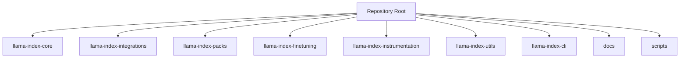
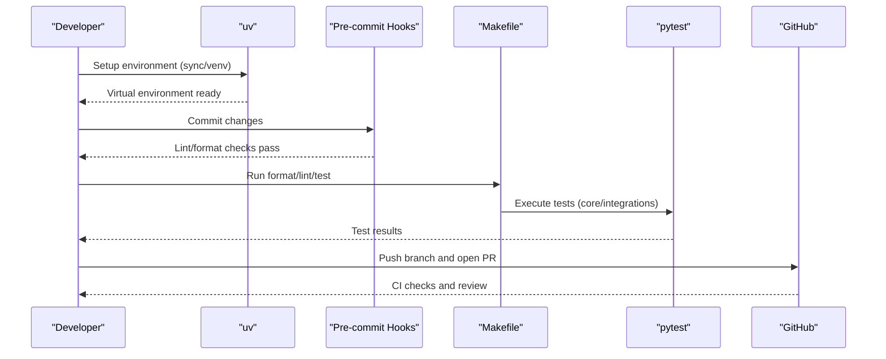
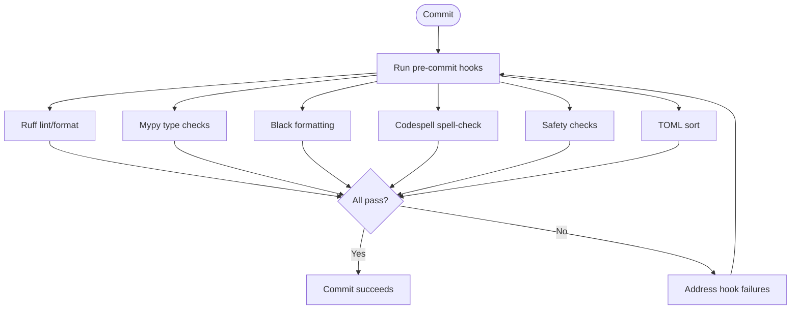
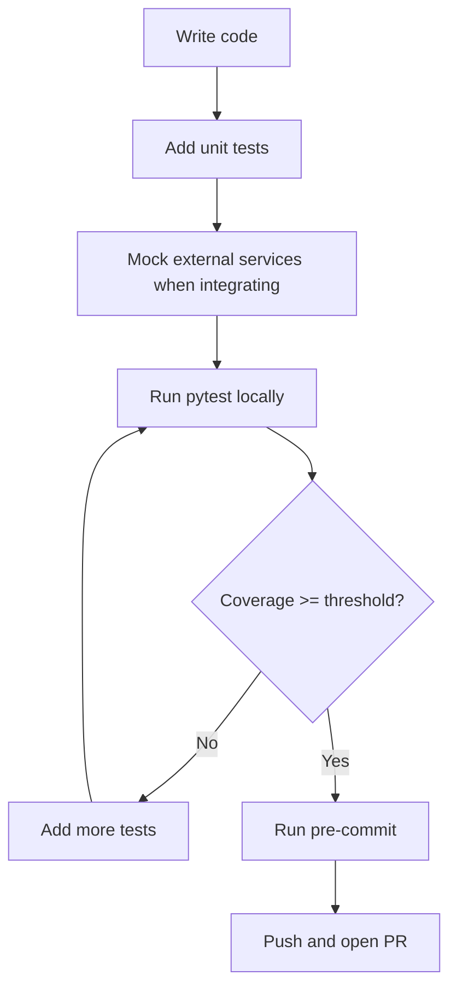
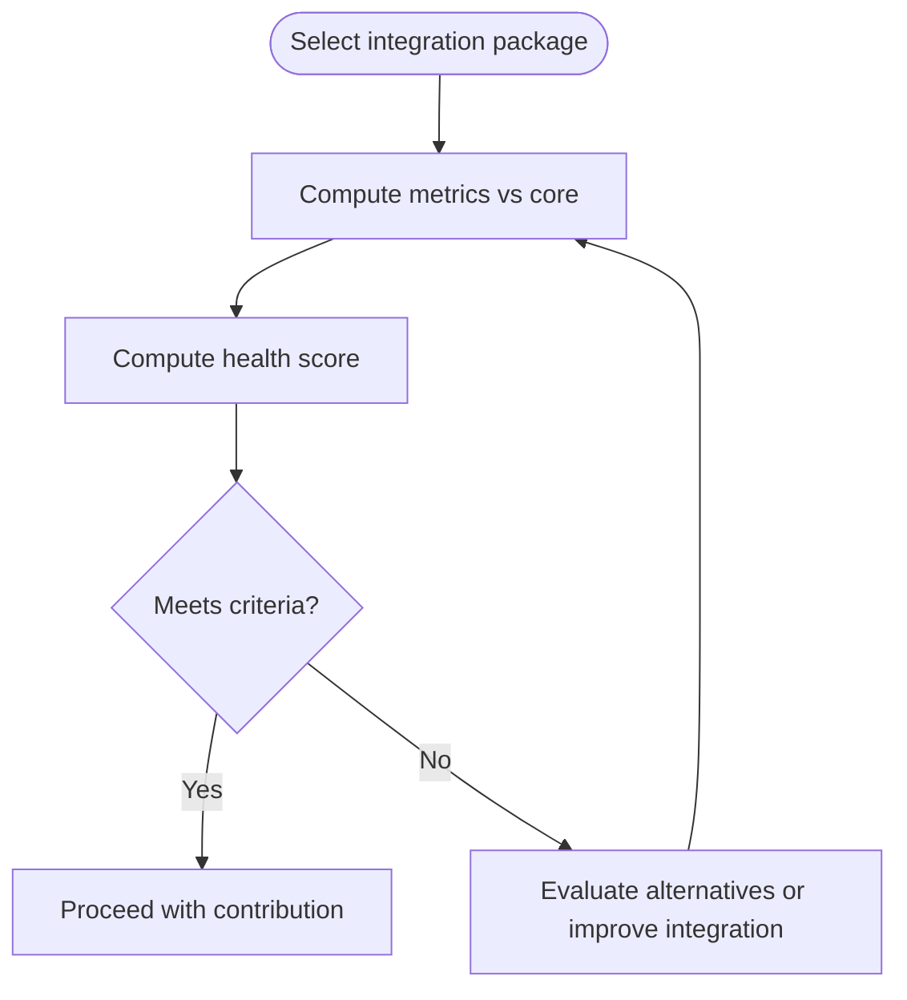
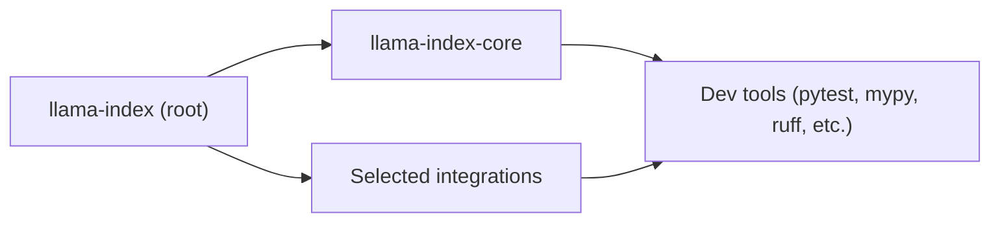

# Contributing Guide

<cite>
**Referenced Files in This Document**
- [CONTRIBUTING.md](file://CONTRIBUTING.md)
- [CODE_OF_CONDUCT.md](file://CODE_OF_CONDUCT.md)
- [README.md](file://README.md)
- [SECURITY.md](file://SECURITY.md)
- [CITATION.cff](file://CITATION.cff)
- [Makefile](file://Makefile)
- [pyproject.toml](file://pyproject.toml)
- [.pre-commit-config.yaml](file://.pre-commit-config.yaml)
- [llama-index-core/tests/conftest.py](file://llama-index-core/tests/conftest.py)
- [llama-index-core/pyproject.toml](file://llama-index-core/pyproject.toml)
- [llama-index-integrations/README.md](file://llama-index-integrations/README.md)
- [scripts/integration_health_check.py](file://scripts/integration_health_check.py)
</cite>

## Table of Contents
1. [Introduction](#introduction)
2. [Project Structure](#project-structure)
3. [Core Components](#core-components)
4. [Architecture Overview](#architecture-overview)
5. [Detailed Component Analysis](#detailed-component-analysis)
6. [Dependency Analysis](#dependency-analysis)
7. [Performance Considerations](#performance-considerations)
8. [Troubleshooting Guide](#troubleshooting-guide)
9. [Conclusion](#conclusion)
10. [Appendices](#appendices)

## Introduction
This guide explains how to contribute effectively to LlamaIndex. It covers the development workflow, code standards, testing requirements, continuous integration expectations, and contribution processes. It also documents community standards, communication channels, and maintainer responsibilities. Whether you are extending core modules, building integrations, fixing bugs, or improving documentation, this guide provides a practical path forward.

## Project Structure
LlamaIndex is organized as a monorepo containing:
- Core package: llama-index-core
- Integrations: llama-index-integrations (and related packages under llama-index-integrations)
- Supporting packages: llama-index-packs, llama-index-finetuning, llama-index-instrumentation, llama-index-utils, and more
- CLI: llama-index-cli
- Documentation: docs
- Scripts and utilities: scripts

Key characteristics:
- Each package is a separate Python project with its own pyproject.toml and tests.
- The umbrella package depends on core and selected integrations.
- Development uses uv for environment management and pre-commit for code quality.

**Section sources**
- [README.md](file://README.md#L1-L224)
- [llama-index-integrations/README.md](file://llama-index-integrations/README.md#L1-L5)

## Core Components
- Contribution workflow and environment setup: uv, Makefile targets, and pre-commit hooks.
- Testing: pytest with fixtures and optional integration tests.
- Code quality: pre-commit hooks (ruff, mypy, black, codespell, etc.), plus Makefile lint/format targets.
- Security policy and responsible disclosure.
- Community standards and enforcement.

**Section sources**
- [CONTRIBUTING.md](file://CONTRIBUTING.md#L1-L231)
- [Makefile](file://Makefile#L1-L33)
- [.pre-commit-config.yaml](file://.pre-commit-config.yaml#L1-L121)
- [llama-index-core/tests/conftest.py](file://llama-index-core/tests/conftest.py#L1-L192)
- [SECURITY.md](file://SECURITY.md#L1-L88)

## Architecture Overview
The contribution workflow spans development, testing, and review:

**Diagram sources**
- [CONTRIBUTING.md](file://CONTRIBUTING.md#L26-L71)
- [Makefile](file://Makefile#L6-L32)
- [llama-index-core/tests/conftest.py](file://llama-index-core/tests/conftest.py#L169-L192)

## Detailed Component Analysis

### Development Workflow and Environment Setup
- Use uv to manage environments and dependencies across packages.
- Quick start steps include forking, cloning, syncing uv environments, navigating to a target package, and running tests.
- Activate virtual environments explicitly if desired.

Recommended commands:
- Initialize global environment for hooks and linters: uv sync
- Run tests in a specific package: uv run -- pytest
- Create/activate a virtual environment: uv venv; source .venv/bin/activate

**Section sources**
- [CONTRIBUTING.md](file://CONTRIBUTING.md#L26-L71)

### Code Standards and Pre-commit
- Pre-commit enforces:
  - Formatting: ruff-format, black-docs
  - Linting: ruff, mypy
  - Spell checking: codespell
  - Safety: detect-private-key, check-merge-conflict
  - TOML sorting: toml-sort
- Makefile targets:
  - format: runs black via pre-commit
  - lint: runs pre-commit with multiple hooks
- Tool configurations:
  - ruff: configured with select and ignore rules, target version
  - mypy: disallow-untyped-defs, namespace packages, ignore missing imports
  - codespell: ignores static assets and hidden files

**Diagram sources**
- [.pre-commit-config.yaml](file://.pre-commit-config.yaml#L1-L121)
- [Makefile](file://Makefile#L6-L11)
- [pyproject.toml](file://pyproject.toml#L111-L212)
- [llama-index-core/pyproject.toml](file://llama-index-core/pyproject.toml#L124-L132)

**Section sources**
- [.pre-commit-config.yaml](file://.pre-commit-config.yaml#L1-L121)
- [Makefile](file://Makefile#L6-L11)
- [pyproject.toml](file://pyproject.toml#L111-L212)
- [llama-index-core/pyproject.toml](file://llama-index-core/pyproject.toml#L124-L132)

### Testing Requirements and Patterns
- Testing framework: pytest
- Core package test configuration:
  - autouse fixtures for environment variables and mocking
  - markers for integration tests
  - optional integration tests gated by a CLI flag
- Coverage expectations:
  - CI fails if coverage is below a stated threshold (e.g., 50%); ensure tests accompany new code
- Running tests:
  - From package root: uv run -- pytest
  - Use Makefile targets for focused areas (core, integrations, packs, etc.)

**Section sources**
- [CONTRIBUTING.md](file://CONTRIBUTING.md#L204-L214)
- [llama-index-core/tests/conftest.py](file://llama-index-core/tests/conftest.py#L1-L192)
- [Makefile](file://Makefile#L13-L29)

### Continuous Integration and Release Signals
- CI status badges are present in the repository README.
- The repository includes a script to assess integration health (download trends, commit activity, test coverage) relative to core.
- Use this script to evaluate the maturity and maintenance signal of an integration before contributing.

**Diagram sources**
- [scripts/integration_health_check.py](file://scripts/integration_health_check.py#L1-L463)

**Section sources**
- [README.md](file://README.md#L1-L224)
- [scripts/integration_health_check.py](file://scripts/integration_health_check.py#L1-L463)

### Submitting Pull Requests
- Fork the repository, create a feature branch, and ensure tests pass locally.
- Keep PRs focused and small; include tests and documentation updates where applicable.
- CI will run tests and linters; address failing checks promptly.

**Section sources**
- [CONTRIBUTING.md](file://CONTRIBUTING.md#L172-L191)

### Bug Reports and Feature Requests
- Use GitHub Issues for bug reports and feature requests.
- For first-time friendly issues, look for “good first issue” labels.
- Provide reproducible examples and context to help maintainers triage effectively.

**Section sources**
- [CONTRIBUTING.md](file://CONTRIBUTING.md#L98-L108)

### Code Review Process
- Maintainers review PRs for correctness, adherence to standards, and alignment with project goals.
- Expect feedback on style, tests, and API design; iterate until approved.
- CI must pass and coverage thresholds met.

**Section sources**
- [CONTRIBUTING.md](file://CONTRIBUTING.md#L172-L191)

### Licensing and Contributor Agreement
- License: MIT (per project metadata).
- Citation: Use the provided citation file when referencing LlamaIndex in academic or commercial contexts.
- By contributing, you agree to license your work under the project’s license.

**Section sources**
- [pyproject.toml](file://pyproject.toml#L61-L73)
- [CITATION.cff](file://CITATION.cff#L1-L11)

### Community Standards and Communication
- Follow the Code of Conduct in all interactions.
- Report violations via the designated contact channel.
- Engage constructively in discussions and reviews.

**Section sources**
- [CODE_OF_CONDUCT.md](file://CODE_OF_CONDUCT.md#L1-L129)

### Security and Responsible Disclosure
- Review the Security Policy before reporting vulnerabilities.
- Scope includes the umbrella package and first-degree dependencies listed.
- Do not disclose potential issues publicly until addressed.

**Section sources**
- [SECURITY.md](file://SECURITY.md#L1-L88)

### Development Environment Setup and Debugging
- Use uv to create and manage per-package environments.
- Activate environments explicitly if needed.
- Use pytest fixtures and mocks to isolate tests and avoid flaky network-dependent tests.
- For integration tests, use the provided marker and CLI flag to opt-in.

**Section sources**
- [CONTRIBUTING.md](file://CONTRIBUTING.md#L26-L71)
- [llama-index-core/tests/conftest.py](file://llama-index-core/tests/conftest.py#L169-L192)

### Contributing Integrations, Documentation, and Bug Fixes
- Integrations should meaningfully integrate with existing framework components; maintainers may decline integrations that do not align.
- Documentation improvements are encouraged; ensure docs remain accurate and consistent.
- Bug fixes should include regression tests and minimal reproduction steps.

**Section sources**
- [CONTRIBUTING.md](file://CONTRIBUTING.md#L88-L113)

## Dependency Analysis
- The umbrella package depends on core and several integrations.
- Each subpackage defines its own dev dependencies and tool configurations.
- Pre-commit and Makefile targets coordinate across packages.

**Diagram sources**
- [pyproject.toml](file://pyproject.toml#L42-L48)
- [llama-index-core/pyproject.toml](file://llama-index-core/pyproject.toml#L6-L31)

**Section sources**
- [pyproject.toml](file://pyproject.toml#L42-L48)
- [llama-index-core/pyproject.toml](file://llama-index-core/pyproject.toml#L6-L31)

## Performance Considerations
- Keep PRs scoped to reduce CI time and review overhead.
- Prefer deterministic tests and mocks to avoid flaky runs.
- Use the provided Makefile targets to run focused subsets of tests.

[No sources needed since this section provides general guidance]

## Troubleshooting Guide
Common issues and resolutions:
- Pre-commit failures:
  - Re-run pre-commit to apply automatic fixes where possible.
  - Review hook-specific errors and adjust code accordingly.
- Test failures:
  - Ensure environment variables are set appropriately.
  - Use provided fixtures to mock external dependencies.
  - Run integration tests only when explicitly enabled.
- Coverage failures:
  - Add tests for new logic; aim for comprehensive coverage.

**Section sources**
- [.pre-commit-config.yaml](file://.pre-commit-config.yaml#L1-L121)
- [llama-index-core/tests/conftest.py](file://llama-index-core/tests/conftest.py#L121-L167)

## Conclusion
Contributions to LlamaIndex are welcome across core extensions, integrations, documentation, and bug fixes. Follow the development workflow, adhere to code standards enforced by pre-commit and Makefile targets, and ensure tests and coverage meet expectations. Engage respectfully with the community and maintainers, and use the security policy for responsible disclosure.

[No sources needed since this section summarizes without analyzing specific files]

## Appendices

### Quick Reference: Commands and Paths
- Environment setup: uv sync, uv venv, source .venv/bin/activate
- Formatting and linting: make format, make lint
- Tests: uv run -- pytest, make test-core, make test-integrations
- Integration health: python scripts/integration_health_check.py <path>

**Section sources**
- [CONTRIBUTING.md](file://CONTRIBUTING.md#L26-L71)
- [Makefile](file://Makefile#L6-L32)
- [scripts/integration_health_check.py](file://scripts/integration_health_check.py#L1-L463)