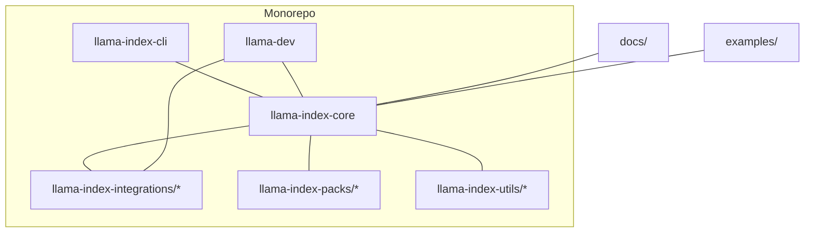
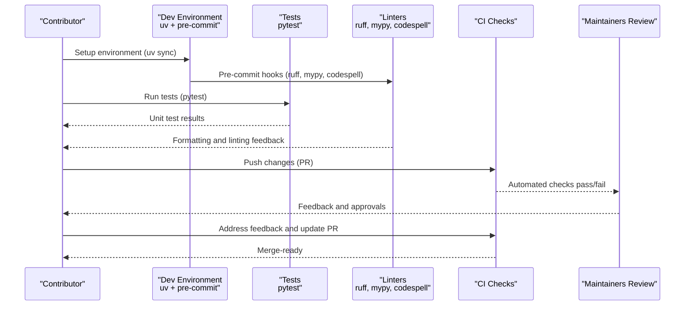
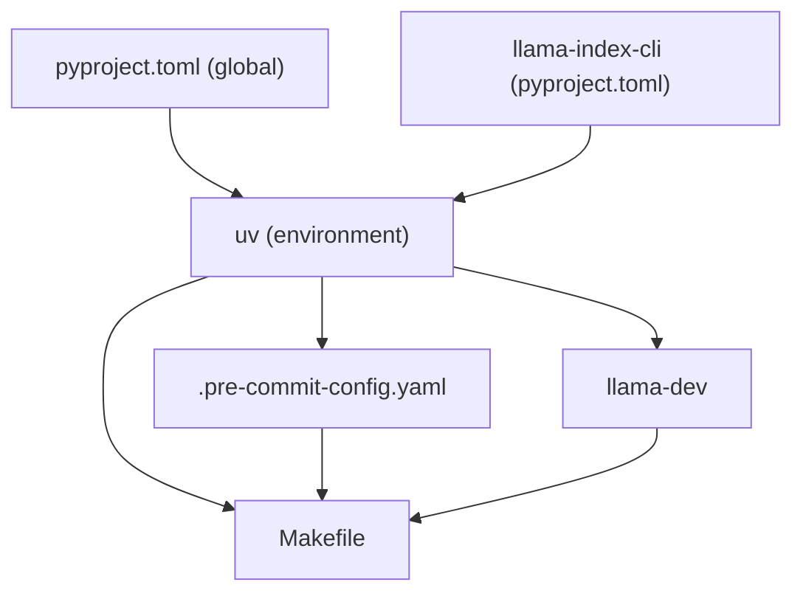

# Contribution Guidelines

<cite>
**Referenced Files in This Document**
- [CONTRIBUTING.md](file://CONTRIBUTING.md)
- [README.md](file://README.md)
- [Makefile](file://Makefile)
- [pyproject.toml](file://pyproject.toml)
- [.pre-commit-config.yaml](file://.pre-commit-config.yaml)
- [llama-index-cli/pyproject.toml](file://llama-index-cli/pyproject.toml)
- [llama-index-cli/README.md](file://llama-index-cli/README.md)
- [llama-dev/README.md](file://llama-dev/README.md)
- [scripts/integration_health_check.py](file://scripts/integration_health_check.py)
- [scripts/publish_packages.sh](file://scripts/publish_packages.sh)
- [CODE_OF_CONDUCT.md](file://CODE_OF_CONDUCT.md)
- [SECURITY.md](file://SECURITY.md)
</cite>

## Table of Contents
1. [Introduction](#introduction)
2. [Project Structure](#project-structure)
3. [Core Components](#core-components)
4. [Architecture Overview](#architecture-overview)
5. [Detailed Component Analysis](#detailed-component-analysis)
6. [Dependency Analysis](#dependency-analysis)
7. [Performance Considerations](#performance-considerations)
8. [Troubleshooting Guide](#troubleshooting-guide)
9. [Conclusion](#conclusion)
10. [Appendices](#appendices)

## Introduction
This document consolidates the contribution guidelines for LlamaIndex, focusing on how to contribute to both the core framework and the ecosystem of integration packages. It explains the development environment setup, testing and quality standards, package initialization for new integrations, documentation generation, CLI tools for development and releases, community workflows, issue and feature request processes, code style and commit conventions, and the review process with maintainer responsibilities.

## Project Structure
LlamaIndex is organized as a monorepo with multiple packages:
- Core framework: llama-index-core
- Integration packages: llama-index-integrations (organized by functional categories such as llms, embeddings, readers, vector_stores, etc.)
- Supporting packages: llama-index-cli, llama-dev, llama-index-packs, llama-index-utils, and more
- Documentation and examples: docs and examples

Key entry points for contributors:
- Contribution guide and quick start: CONTRIBUTING.md
- High-level overview and ecosystem links: README.md
- Development tooling and automation: Makefile, .pre-commit-config.yaml, llama-dev, and CLI tools
- Packaging and publishing: scripts/publish_packages.sh and per-package pyproject.toml files

**Diagram sources**
- [README.md](file://README.md#L1-L224)
- [CONTRIBUTING.md](file://CONTRIBUTING.md#L195-L231)

**Section sources**
- [README.md](file://README.md#L1-L224)
- [CONTRIBUTING.md](file://CONTRIBUTING.md#L195-L231)

## Core Components
This section outlines the contribution pathways and expectations for both core framework and integration contributions.

- Core framework contributions
  - Focus areas include data loaders, node parsers, text splitters, vector stores, query engines, retrievers, and other core modules.
  - Contributions should align with existing framework interfaces and extend functionality in a cohesive manner.
  - Reference: [CONTRIBUTING.md](file://CONTRIBUTING.md#L116-L170)

- Integration contributions
  - New integrations should meaningfully integrate with existing LlamaIndex framework components.
  - Maintainer discretion applies; some integrations may be declined.
  - Reference: [CONTRIBUTING.md](file://CONTRIBUTING.md#L83-L113), [README.md](file://README.md#L80-L90)

- Community contribution workflow
  - Explore issues labeled “good first issue” and join the Discord community.
  - Reference: [CONTRIBUTING.md](file://CONTRIBUTING.md#L98-L113)

**Section sources**
- [CONTRIBUTING.md](file://CONTRIBUTING.md#L75-L113)
- [README.md](file://README.md#L80-L90)

## Architecture Overview
The contribution workflow spans development, testing, quality checks, and release automation.

**Diagram sources**
- [CONTRIBUTING.md](file://CONTRIBUTING.md#L26-L72)
- [Makefile](file://Makefile#L10-L14)
- [.pre-commit-config.yaml](file://.pre-commit-config.yaml#L1-L121)

**Section sources**
- [CONTRIBUTING.md](file://CONTRIBUTING.md#L26-L72)
- [Makefile](file://Makefile#L10-L14)
- [.pre-commit-config.yaml](file://.pre-commit-config.yaml#L1-L121)

## Detailed Component Analysis

### Development Environment Setup
- Package manager and environment
  - Use uv for environment management and dependency synchronization.
  - Global virtual environment for pre-commit hooks and linters.
  - Reference: [CONTRIBUTING.md](file://CONTRIBUTING.md#L9-L72)

- Poetry vs uv
  - Poetry is used for dependency management in individual packages; uv is used for monorepo-wide development and CLI tooling.
  - Reference: [README.md](file://README.md#L179-L189)

- Pre-commit hooks
  - Enforced via pre-commit configuration for formatting, linting, type checking, spell-checking, and safety checks.
  - Reference: [.pre-commit-config.yaml](file://.pre-commit-config.yaml#L1-L121)

- Running tests
  - Use pytest within each package; for monorepo-wide testing, use llama-dev or Makefile targets.
  - Reference: [CONTRIBUTING.md](file://CONTRIBUTING.md#L204-L214), [Makefile](file://Makefile#L13-L32), [llama-dev/README.md](file://llama-dev/README.md#L61-L80)

**Section sources**
- [CONTRIBUTING.md](file://CONTRIBUTING.md#L9-L72)
- [README.md](file://README.md#L179-L189)
- [.pre-commit-config.yaml](file://.pre-commit-config.yaml#L1-L121)
- [Makefile](file://Makefile#L13-L32)
- [llama-dev/README.md](file://llama-dev/README.md#L61-L80)

### Testing Frameworks and Procedures
- Unit testing
  - pytest is the primary test runner; ensure tests are added for new features and bug fixes.
  - Reference: [CONTRIBUTING.md](file://CONTRIBUTING.md#L204-L214)

- Coverage expectations
  - CI fails if test coverage is below a threshold; add comprehensive tests.
  - Reference: [CONTRIBUTING.md](file://CONTRIBUTING.md#L212-L214)

- Monorepo testing
  - Use llama-dev for smart detection of changed packages and dependents, or Makefile targets for specific subsets.
  - Reference: [llama-dev/README.md](file://llama-dev/README.md#L61-L80), [Makefile](file://Makefile#L16-L29)

**Section sources**
- [CONTRIBUTING.md](file://CONTRIBUTING.md#L204-L214)
- [llama-dev/README.md](file://llama-dev/README.md#L61-L80)
- [Makefile](file://Makefile#L16-L29)

### Code Quality Standards
- Formatting and linting
  - ruff for linting and formatting; mypy for static type checking; codespell for spelling; pre-commit enforces these automatically.
  - Reference: [.pre-commit-config.yaml](file://.pre-commit-config.yaml#L24-L109), [pyproject.toml](file://pyproject.toml#L111-L209)

- Style conventions
  - Google-style docstrings enforced by pydocstyle; Ruff selected rules configured to balance strictness and practicality.
  - Reference: [pyproject.toml](file://pyproject.toml#L31-L32)

- Pre-commit installation
  - Install hooks locally to catch issues early; Makefile target supports running linters across the repo.
  - Reference: [Makefile](file://Makefile#L10-L11), [.pre-commit-config.yaml](file://.pre-commit-config.yaml#L1-L121)

**Section sources**
- [.pre-commit-config.yaml](file://.pre-commit-config.yaml#L24-L109)
- [pyproject.toml](file://pyproject.toml#L31-L32)
- [pyproject.toml](file://pyproject.toml#L111-L209)
- [Makefile](file://Makefile#L10-L11)

### Package Initialization for New Integrations
- CLI scaffolding
  - Use the LlamaIndex CLI to initialize a new package with standardized structure and configuration.
  - Reference: [llama-index-cli/README.md](file://llama-index-cli/README.md#L29-L30), [llama-index-cli/pyproject.toml](file://llama-index-cli/pyproject.toml#L27-L50)

- Integration health scoring
  - A script evaluates integration health relative to core using metrics like downloads, commits, and test coverage.
  - Reference: [scripts/integration_health_check.py](file://scripts/integration_health_check.py#L1-L463)

**Section sources**
- [llama-index-cli/README.md](file://llama-index-cli/README.md#L29-L30)
- [llama-index-cli/pyproject.toml](file://llama-index-cli/pyproject.toml#L27-L50)
- [scripts/integration_health_check.py](file://scripts/integration_health_check.py#L1-L463)

### Documentation Generation
- Local documentation builds
  - Use sphinx-autobuild to build and watch docs for real-time preview.
  - Reference: [Makefile](file://Makefile#L31-L32)

**Section sources**
- [Makefile](file://Makefile#L31-L32)

### CLI Tools for Development
- LlamaIndex CLI
  - Provides commands for RAG, downloading packs/datasets, upgrading files, and initializing new packages.
  - Reference: [llama-index-cli/README.md](file://llama-index-cli/README.md#L14-L30), [llama-index-cli/pyproject.toml](file://llama-index-cli/pyproject.toml#L27-L50)

- LlamaDev CLI
  - Automates package discovery, running commands across packages, and running targeted tests with coverage and parallelism.
  - Reference: [llama-dev/README.md](file://llama-dev/README.md#L1-L99)

**Section sources**
- [llama-index-cli/README.md](file://llama-index-cli/README.md#L14-L30)
- [llama-index-cli/pyproject.toml](file://llama-index-cli/pyproject.toml#L27-L50)
- [llama-dev/README.md](file://llama-dev/README.md#L1-L99)

### Release Preparation and Publishing
- Publishing pipeline
  - A shell script coordinates publishing of multiple packages with retries and failure tracking.
  - Reference: [scripts/publish_packages.sh](file://scripts/publish_packages.sh#L1-L114)

- Poetry-based packaging
  - Per-package pyproject.toml defines dependencies and build configuration; Poetry is used for dependency management and publishing workflows.
  - Reference: [README.md](file://README.md#L179-L189), [pyproject.toml](file://pyproject.toml#L1-L229)

**Section sources**
- [scripts/publish_packages.sh](file://scripts/publish_packages.sh#L1-L114)
- [README.md](file://README.md#L179-L189)
- [pyproject.toml](file://pyproject.toml#L1-L229)

### Community Contribution Workflow
- Issue reporting and triage
  - Use GitHub Issues; look for “good first issue” for newcomers.
  - Reference: [CONTRIBUTING.md](file://CONTRIBUTING.md#L98-L113)

- Feature requests
  - Propose ideas via discussions or issues; maintainers evaluate feasibility and alignment with the framework.
  - Reference: [CONTRIBUTING.md](file://CONTRIBUTING.md#L94-L96)

- Communication
  - Join the Discord community to connect with maintainers and other contributors.
  - Reference: [CONTRIBUTING.md](file://CONTRIBUTING.md#L218-L223)

**Section sources**
- [CONTRIBUTING.md](file://CONTRIBUTING.md#L94-L113)
- [CONTRIBUTING.md](file://CONTRIBUTING.md#L218-L223)

### Code Style Requirements and Commit Message Conventions
- Code style
  - Enforced via pre-commit hooks (ruff, mypy, codespell) and pyproject.toml configurations.
  - Reference: [.pre-commit-config.yaml](file://.pre-commit-config.yaml#L24-L109), [pyproject.toml](file://pyproject.toml#L111-L209)

- Commit messages
  - No specific commit message convention is defined in the repository; follow common best practices (e.g., imperative mood, concise subject, optional body) and keep commits focused.

**Section sources**
- [.pre-commit-config.yaml](file://.pre-commit-config.yaml#L24-L109)
- [pyproject.toml](file://pyproject.toml#L111-L209)

### Pull Request Guidelines and Review Process
- PR lifecycle
  - Fork, branch, develop, test, and open a PR; address reviewer feedback promptly.
  - Reference: [CONTRIBUTING.md](file://CONTRIBUTING.md#L172-L191)

- Review process
  - Maintainers review contributions for correctness, adherence to style, and alignment with project goals; approval required before merging.
  - Reference: [CONTRIBUTING.md](file://CONTRIBUTING.md#L172-L191)

**Section sources**
- [CONTRIBUTING.md](file://CONTRIBUTING.md#L172-L191)

### Security and Conduct
- Code of Conduct
  - Adheres to Contributor Covenant; violations are handled according to established enforcement guidelines.
  - Reference: [CODE_OF_CONDUCT.md](file://CODE_OF_CONDUCT.md#L1-L129)

- Security policy
  - Defines in-scope and out-of-scope targets, threat model, and reporting channels for security issues.
  - Reference: [SECURITY.md](file://SECURITY.md#L1-L88)

**Section sources**
- [CODE_OF_CONDUCT.md](file://CODE_OF_CONDUCT.md#L1-L129)
- [SECURITY.md](file://SECURITY.md#L1-L88)

## Dependency Analysis
The development stack relies on a combination of uv for environment management, Poetry for per-package dependency management, and pre-commit hooks for code quality. The Makefile and llama-dev complement these tools for automated testing and package orchestration.

**Diagram sources**
- [pyproject.toml](file://pyproject.toml#L1-L229)
- [.pre-commit-config.yaml](file://.pre-commit-config.yaml#L1-L121)
- [Makefile](file://Makefile#L1-L33)
- [llama-dev/README.md](file://llama-dev/README.md#L1-L99)
- [llama-index-cli/pyproject.toml](file://llama-index-cli/pyproject.toml#L1-L73)

**Section sources**
- [pyproject.toml](file://pyproject.toml#L1-L229)
- [.pre-commit-config.yaml](file://.pre-commit-config.yaml#L1-L121)
- [Makefile](file://Makefile#L1-L33)
- [llama-dev/README.md](file://llama-dev/README.md#L1-L99)
- [llama-index-cli/pyproject.toml](file://llama-index-cli/pyproject.toml#L1-L73)

## Performance Considerations
- Prefer mocking external systems in tests to avoid flaky runs and reduce CI time.
- Use llama-dev’s change detection to run tests only on modified packages and their dependents.
- Keep commit sizes small to improve review turnaround and CI performance.

[No sources needed since this section provides general guidance]

## Troubleshooting Guide
- Pre-commit hook failures
  - Reinstall hooks and fix formatting/lint/type errors reported by pre-commit.
  - Reference: [Makefile](file://Makefile#L10-L11), [.pre-commit-config.yaml](file://.pre-commit-config.yaml#L1-L121)

- Test failures
  - Run targeted tests with pytest; use llama-dev or Makefile to isolate failing packages.
  - Reference: [CONTRIBUTING.md](file://CONTRIBUTING.md#L204-L214), [llama-dev/README.md](file://llama-dev/README.md#L61-L80), [Makefile](file://Makefile#L16-L29)

- Publishing issues
  - Use the publishing script to handle retries and dependency resolution; inspect logs for transient failures.
  - Reference: [scripts/publish_packages.sh](file://scripts/publish_packages.sh#L1-L114)

**Section sources**
- [Makefile](file://Makefile#L10-L11)
- [.pre-commit-config.yaml](file://.pre-commit-config.yaml#L1-L121)
- [CONTRIBUTING.md](file://CONTRIBUTING.md#L204-L214)
- [llama-dev/README.md](file://llama-dev/README.md#L61-L80)
- [Makefile](file://Makefile#L16-L29)
- [scripts/publish_packages.sh](file://scripts/publish_packages.sh#L1-L114)

## Conclusion
Contributions to LlamaIndex are welcomed across core framework enhancements and ecosystem integrations. Follow the environment setup, testing, and quality standards outlined here, leverage the provided CLI tools for efficient development, and engage with the community via GitHub and Discord. Maintainers review submissions with a focus on meaningful integration, code quality, and alignment with the project’s goals.

[No sources needed since this section summarizes without analyzing specific files]

## Appendices

### Appendix A: Quick Reference Checklist
- Set up environment with uv and pre-commit
- Write and run tests; ensure coverage meets thresholds
- Format, lint, and type-check with pre-commit
- Open a PR and respond to feedback
- Use CLI tools for scaffolding and automation

[No sources needed since this section provides general guidance]