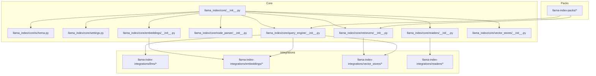
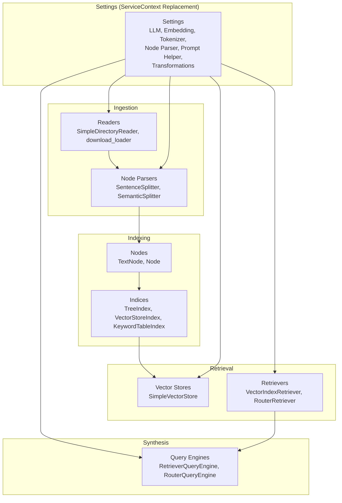
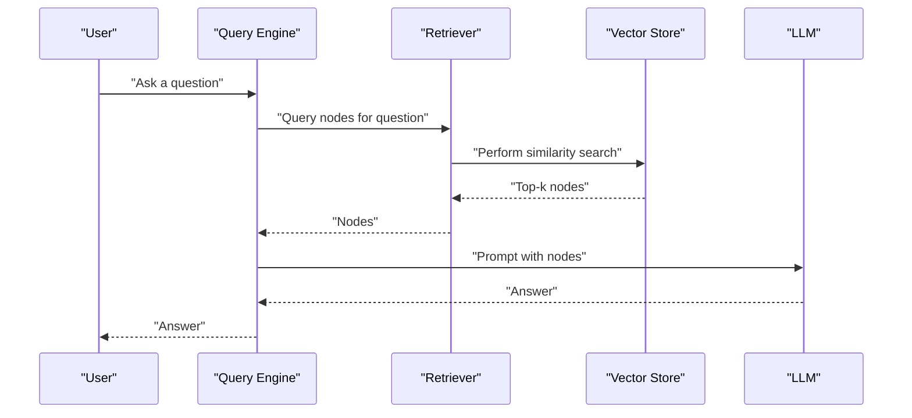
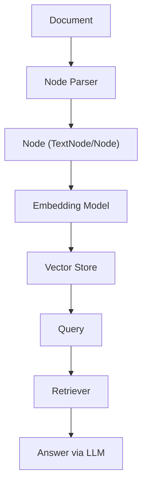
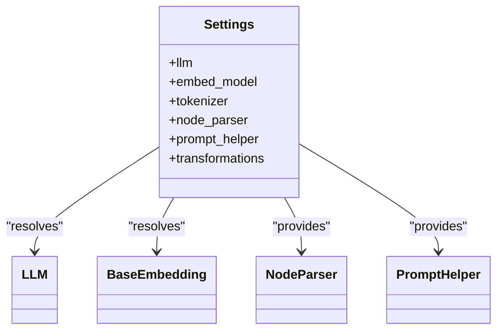
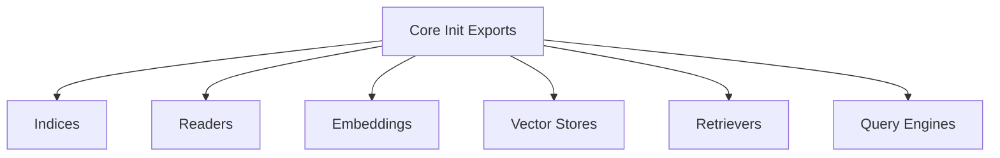

# Core Concepts and Terminology

<cite>
**Referenced Files in This Document**
- [__init__.py](file://llama-index-core/llama_index/core/__init__.py)
- [schema.py](file://llama-index-core/llama_index/core/schema.py)
- [settings.py](file://llama-index-core/llama_index/core/settings.py)
- [service_context.py](file://llama-index-core/llama_index/core/service_context.py)
- [readers/__init__.py](file://llama-index-core/llama_index/core/readers/__init__.py)
- [node_parser/__init__.py](file://llama-index-core/llama_index/core/node_parser/__init__.py)
- [retrievers/__init__.py](file://llama-index-core/llama_index/core/retrievers/__init__.py)
- [query_engine/__init__.py](file://llama-index-core/llama_index/core/query_engine/__init__.py)
- [embeddings/__init__.py](file://llama-index-core/llama_index/core/embeddings/__init__.py)
- [vector_stores/__init__.py](file://llama-index-core/llama_index/core/vector_stores/__init__.py)
</cite>

## Table of Contents
1. [Introduction](#introduction)
2. [Project Structure](#project-structure)
3. [Core Components](#core-components)
4. [Architecture Overview](#architecture-overview)
5. [Detailed Component Analysis](#detailed-component-analysis)
6. [Dependency Analysis](#dependency-analysis)
7. [Performance Considerations](#performance-considerations)
8. [Troubleshooting Guide](#troubleshooting-guide)
9. [Conclusion](#conclusion)
10. [Appendices](#appendices)

## Introduction
This document explains LlamaIndex’s core concepts and terminology with a focus on Retrieval-Augmented Generation (RAG), embeddings, vector stores, indices, nodes, and documents. It also clarifies how readers, parsers, indices, retrievers, and query engines relate to each other, and introduces the framework’s modular architecture: core, integrations, and packs. Special attention is given to terminology consistent with the codebase, including “ServiceContext replacement,” “plugin system,” and “component factory pattern.”

## Project Structure
LlamaIndex organizes functionality into clearly separated modules:
- Core: foundational abstractions and building blocks (documents, nodes, indices, retrievers, query engines, embeddings, vector stores, settings)
- Integrations: vendor-specific adapters and connectors (LLMs, embeddings, vector stores, readers, etc.)
- Packs: reusable, prebuilt configurations and workflows (query engines, retrievers, retrieval fusion, etc.)

**Diagram sources**
- [__init__.py](file://llama-index-core/llama_index/core/__init__.py#L1-L162)
- [schema.py](file://llama-index-core/llama_index/core/schema.py#L1-L1408)
- [settings.py](file://llama-index-core/llama_index/core/settings.py#L1-L249)
- [readers/__init__.py](file://llama-index-core/llama_index/core/readers/__init__.py#L1-L33)
- [node_parser/__init__.py](file://llama-index-core/llama_index/core/node_parser/__init__.py#L1-L73)
- [retrievers/__init__.py](file://llama-index-core/llama_index/core/retrievers/__init__.py#L1-L89)
- [query_engine/__init__.py](file://llama-index-core/llama_index/core/query_engine/__init__.py#L1-L88)
- [embeddings/__init__.py](file://llama-index-core/llama_index/core/embeddings/__init__.py#L1-L16)
- [vector_stores/__init__.py](file://llama-index-core/llama_index/core/vector_stores/__init__.py#L1-L28)

**Section sources**
- [__init__.py](file://llama-index-core/llama_index/core/__init__.py#L1-L162)

## Core Components
This section defines the fundamental building blocks used throughout LlamaIndex.

- Documents and Nodes
  - Document: the atomic unit of source data (e.g., a PDF page, a web page, a CSV row). In the schema, a Document is a typed entity used widely across ingestion and indexing.
  - Node: a chunked, transformed piece of a Document, suitable for embedding and retrieval. The schema defines BaseNode and concrete implementations like TextNode and Node (multimodal). Nodes carry content, metadata, optional embeddings, and relationships to other nodes or documents.

- Embeddings
  - Embeddings represent semantic vectors for text or multimodal content. The embeddings module exposes BaseEmbedding and utilities to resolve embedding models, enabling flexible selection of providers.

- Vector Stores
  - Vector stores persist and query embeddings. The vector_stores module exposes query primitives and filters, enabling hybrid retrieval with metadata filtering.

- Indices
  - Indices organize nodes into structures optimized for retrieval and querying (e.g., tree, keyword table, vector store-backed index). The core init aggregates index types and loader utilities.

- Readers and Parsers
  - Readers ingest raw data sources and produce Documents.
  - Parsers split Documents into Nodes and apply transformations (e.g., sentence splitting, semantic splitting).

- Retrievers and Query Engines
  - Retrievers fetch relevant Nodes for a query.
  - Query Engines orchestrate retrieval, synthesis, and routing to produce final answers.

- Settings and ServiceContext Replacement
  - ServiceContext is deprecated. Its role is now filled by Settings, a singleton dataclass that lazily resolves and wires LLMs, embeddings, tokenizers, node parsers, prompt helpers, and transformations.

**Section sources**
- [schema.py](file://llama-index-core/llama_index/core/schema.py#L263-L800)
- [embeddings/__init__.py](file://llama-index-core/llama_index/core/embeddings/__init__.py#L1-L16)
- [vector_stores/__init__.py](file://llama-index-core/llama_index/core/vector_stores/__init__.py#L1-L28)
- [__init__.py](file://llama-index-core/llama_index/core/__init__.py#L24-L48)
- [readers/__init__.py](file://llama-index-core/llama_index/core/readers/__init__.py#L1-L33)
- [node_parser/__init__.py](file://llama-index-core/llama_index/core/node_parser/__init__.py#L1-L73)
- [retrievers/__init__.py](file://llama-index-core/llama_index/core/retrievers/__init__.py#L1-L89)
- [query_engine/__init__.py](file://llama-index-core/llama_index/core/query_engine/__init__.py#L1-L88)
- [settings.py](file://llama-index-core/llama_index/core/settings.py#L17-L249)
- [service_context.py](file://llama-index-core/llama_index/core/service_context.py#L1-L49)

## Architecture Overview
The LlamaIndex architecture follows a modular, composable design centered around a Settings-driven “ServiceContext replacement.” This design enables:
- Plugin system: pluggable LLMs, embeddings, vector stores, readers, and parsers
- Component factory pattern: lazy resolution of components via Settings
- Clear separation of concerns: ingestion (readers/parsers), indexing (indices), retrieval (retrievers), and synthesis (query engines)

**Diagram sources**
- [readers/__init__.py](file://llama-index-core/llama_index/core/readers/__init__.py#L14-L32)
- [node_parser/__init__.py](file://llama-index-core/llama_index/core/node_parser/__init__.py#L1-L73)
- [schema.py](file://llama-index-core/llama_index/core/schema.py#L263-L800)
- [vector_stores/__init__.py](file://llama-index-core/llama_index/core/vector_stores/__init__.py#L1-L28)
- [retrievers/__init__.py](file://llama-index-core/llama_index/core/retrievers/__init__.py#L1-L89)
- [query_engine/__init__.py](file://llama-index-core/llama_index/core/query_engine/__init__.py#L1-L88)
- [settings.py](file://llama-index-core/llama_index/core/settings.py#L17-L249)

## Detailed Component Analysis

### Retrieval-Augmented Generation (RAG)
RAG combines retrieval and generation:
- Retrieve relevant context (Nodes) from indices using retrievers
- Pass retrieved context to an LLM via a query engine to synthesize an answer

**Diagram sources**
- [retrievers/__init__.py](file://llama-index-core/llama_index/core/retrievers/__init__.py#L1-L89)
- [vector_stores/__init__.py](file://llama-index-core/llama_index/core/vector_stores/__init__.py#L1-L28)
- [query_engine/__init__.py](file://llama-index-core/llama_index/core/query_engine/__init__.py#L1-L88)

### Nodes, Documents, and Embeddings
- Documents are ingested by readers and parsed into Nodes.
- Nodes carry content and optional embeddings.
- Embeddings enable semantic similarity search in vector stores.

**Diagram sources**
- [readers/__init__.py](file://llama-index-core/llama_index/core/readers/__init__.py#L14-L32)
- [node_parser/__init__.py](file://llama-index-core/llama_index/core/node_parser/__init__.py#L1-L73)
- [schema.py](file://llama-index-core/llama_index/core/schema.py#L263-L800)
- [embeddings/__init__.py](file://llama-index-core/llama_index/core/embeddings/__init__.py#L1-L16)
- [vector_stores/__init__.py](file://llama-index-core/llama_index/core/vector_stores/__init__.py#L1-L28)

### ServiceContext Replacement and Settings
- ServiceContext is deprecated. Use Settings to configure LLMs, embeddings, tokenizers, node parsers, prompt helpers, and transformations.
- Settings acts as a central “component factory” that lazily resolves defaults and wires components together.

**Diagram sources**
- [settings.py](file://llama-index-core/llama_index/core/settings.py#L17-L249)
- [service_context.py](file://llama-index-core/llama_index/core/service_context.py#L1-L49)

**Section sources**
- [settings.py](file://llama-index-core/llama_index/core/settings.py#L17-L249)
- [service_context.py](file://llama-index-core/llama_index/core/service_context.py#L1-L49)

### Readers, Parsers, Indices, Retrievers, Query Engines
- Readers: load Documents from various sources.
- Parsers: split Documents into Nodes.
- Indices: organize Nodes for efficient retrieval.
- Retrievers: fetch relevant Nodes for a query.
- Query Engines: orchestrate retrieval and synthesis.

**Diagram sources**
- [readers/__init__.py](file://llama-index-core/llama_index/core/readers/__init__.py#L14-L32)
- [node_parser/__init__.py](file://llama-index-core/llama_index/core/node_parser/__init__.py#L1-L73)
- [schema.py](file://llama-index-core/llama_index/core/schema.py#L263-L800)
- [vector_stores/__init__.py](file://llama-index-core/llama_index/core/vector_stores/__init__.py#L1-L28)
- [retrievers/__init__.py](file://llama-index-core/llama_index/core/retrievers/__init__.py#L1-L89)
- [query_engine/__init__.py](file://llama-index-core/llama_index/core/query_engine/__init__.py#L1-L88)

**Section sources**
- [readers/__init__.py](file://llama-index-core/llama_index/core/readers/__init__.py#L1-L33)
- [node_parser/__init__.py](file://llama-index-core/llama_index/core/node_parser/__init__.py#L1-L73)
- [schema.py](file://llama-index-core/llama_index/core/schema.py#L263-L800)
- [vector_stores/__init__.py](file://llama-index-core/llama_index/core/vector_stores/__init__.py#L1-L28)
- [retrievers/__init__.py](file://llama-index-core/llama_index/core/retrievers/__init__.py#L1-L89)
- [query_engine/__init__.py](file://llama-index-core/llama_index/core/query_engine/__init__.py#L1-L88)

## Dependency Analysis
The core module exports a curated set of indices, readers, embeddings, and utilities. This establishes the primary dependency surface for applications.

**Diagram sources**
- [__init__.py](file://llama-index-core/llama_index/core/__init__.py#L24-L88)

**Section sources**
- [__init__.py](file://llama-index-core/llama_index/core/__init__.py#L24-L88)

## Performance Considerations
- Chunk size and overlap: controlled via Settings.node_parser and exposed via Settings.chunk_size and Settings.chunk_overlap. Tuning impacts recall vs. latency.
- Prompt helper and context window: Settings.prompt_helper and Settings.context_window influence token budget and cost.
- Embedding model choice: embedding speed and quality vary by provider; Settings embed_model allows swapping providers without changing downstream logic.
- Vector store filters: metadata filtering reduces candidate sets early, improving latency.

[No sources needed since this section provides general guidance]

## Troubleshooting Guide
- ServiceContext is deprecated
  - Symptom: instantiating ServiceContext raises an error.
  - Fix: migrate to Settings and pass components directly to APIs or configure Settings globally.
  - Reference: [service_context.py](file://llama-index-core/llama_index/core/service_context.py#L13-L38)

- Missing chunk size or overlap
  - Symptom: accessing Settings.chunk_size or Settings.chunk_overlap on incompatible node parsers raises an error.
  - Fix: ensure a compatible NodeParser is configured (e.g., SentenceSplitter) or set it explicitly via Settings.node_parser.
  - Reference: [settings.py](file://llama-index-core/llama_index/core/settings.py#L154-L183)

- Tokenizer compatibility
  - Symptom: unexpected tokenization behavior with certain tokenizer libraries.
  - Fix: set Settings.tokenizer to a compatible callable or use the provided utilities.
  - Reference: [settings.py](file://llama-index-core/llama_index/core/settings.py#L108-L133)

**Section sources**
- [service_context.py](file://llama-index-core/llama_index/core/service_context.py#L13-L38)
- [settings.py](file://llama-index-core/llama_index/core/settings.py#L108-L133)
- [settings.py](file://llama-index-core/llama_index/core/settings.py#L154-L183)

## Conclusion
LlamaIndex’s design centers on modularity and flexibility:
- Readers and parsers transform raw data into Nodes
- Indices and vector stores enable efficient retrieval
- Retrievers and query engines orchestrate synthesis
- Settings replaces ServiceContext as the central “ServiceContext replacement”
- The plugin system and component factory pattern let you swap providers and tune behavior without rewriting application logic

## Appendices

### Glossary of Core Terms
- Retrieval-Augmented Generation (RAG): A paradigm combining retrieval of relevant context with generation to answer queries.
- Embeddings: Numerical vectors capturing semantic meaning for text or multimodal content.
- Vector Stores: Persistent stores supporting similarity search and metadata filtering.
- Indices: Structures organizing Nodes for efficient retrieval (e.g., tree, keyword table, vector-backed).
- Nodes: Chunked, transformed pieces of Documents with content, metadata, and optional embeddings.
- Documents: Atomic units of source data (e.g., pages, rows).
- ServiceContext replacement: The migration from ServiceContext to Settings for configuration.
- Plugin system: Extensible adapters for LLMs, embeddings, vector stores, readers, and parsers.
- Component factory pattern: Lazy resolution and wiring of components via Settings.

[No sources needed since this section provides general guidance]