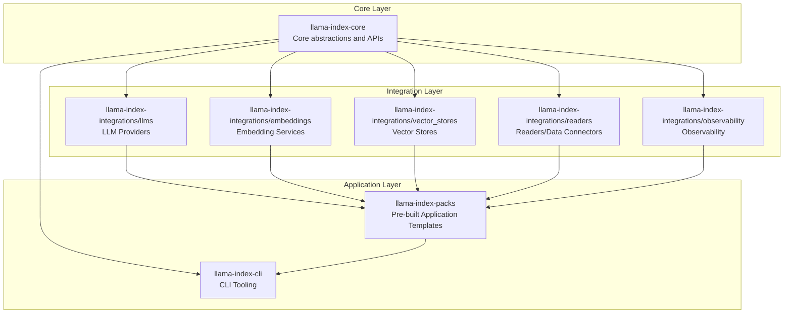
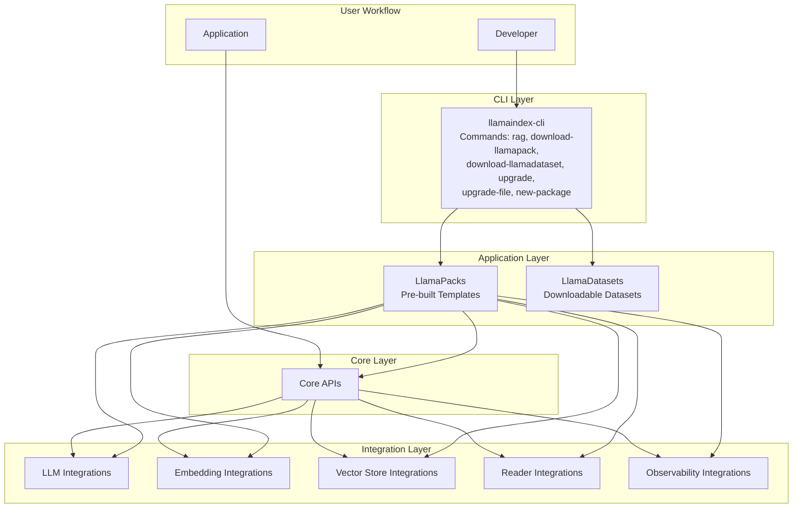
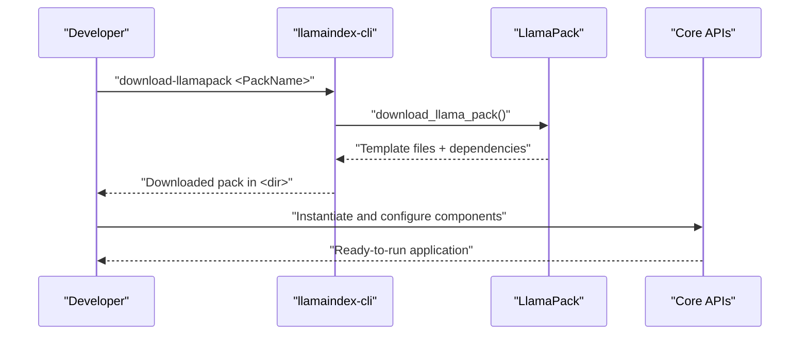
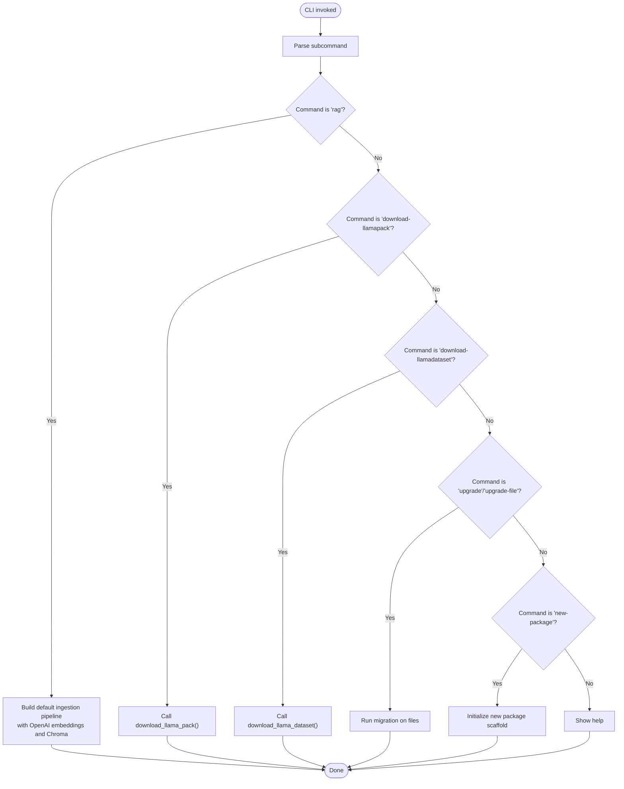
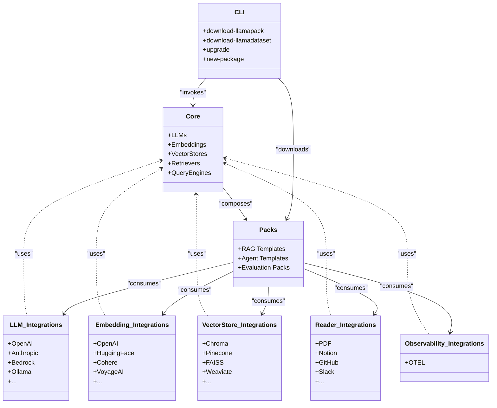
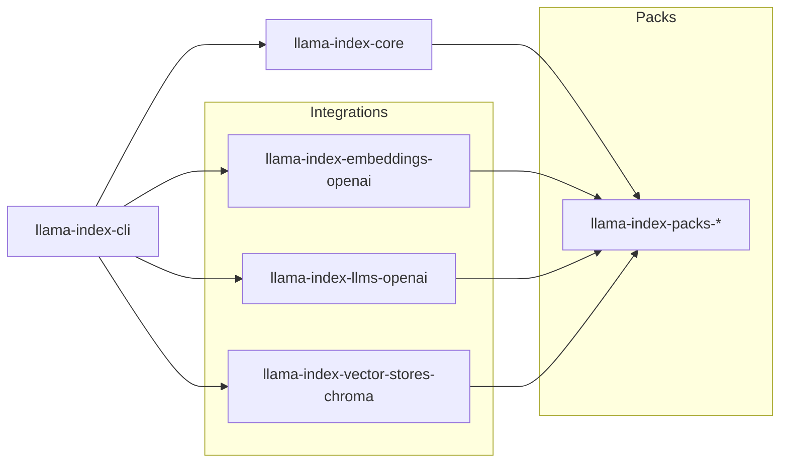

# Ecosystem Overview

<cite>
**Referenced Files in This Document**
- [README.md](file://README.md)
- [CONTRIBUTING.md](file://CONTRIBUTING.md)
- [llama-index-cli/README.md](file://llama-index-cli/README.md)
- [llama-index-cli/pyproject.toml](file://llama-index-cli/pyproject.toml)
- [llama-index-cli/llama_index/cli/command_line.py](file://llama-index-cli/llama_index/cli/command_line.py)
- [llama-index-core/README.md](file://llama-index-core/README.md)
- [llama-index-integrations/README.md](file://llama-index-integrations/README.md)
- [llama-index-packs/README.md](file://llama-index-packs/README.md)
- [llama-index-integrations/llms](file://llama-index-integrations/llms)
- [llama-index-integrations/embeddings](file://llama-index-integrations/embeddings)
- [llama-index-integrations/vector_stores](file://llama-index-integrations/vector_stores)
- [llama-index-integrations/readers](file://llama-index-integrations/readers)
- [llama-index-integrations/observability](file://llama-index-integrations/observability)
- [llama-index-packs](file://llama-index-packs)
</cite>

## Table of Contents
1. [Introduction](#introduction)
2. [Project Structure](#project-structure)
3. [Core Components](#core-components)
4. [Architecture Overview](#architecture-overview)
5. [Detailed Component Analysis](#detailed-component-analysis)
6. [Dependency Analysis](#dependency-analysis)
7. [Performance Considerations](#performance-considerations)
8. [Troubleshooting Guide](#troubleshooting-guide)
9. [Conclusion](#conclusion)
10. [Appendices](#appendices)

## Introduction
This document provides a comprehensive ecosystem overview of LlamaIndex, focusing on:
- The extensive integration ecosystem with over 300 integration packages spanning LLM providers, embedding services, vector stores, readers, and observability tools
- The LlamaPacks system with 50+ pre-built application templates
- The role of CLI tools in scaffolding, packaging, and deployment workflows
- The relationship among the core framework, integrations, and applications
- The dual nature of the ecosystem supporting both production deployments and rapid prototyping
- Contribution model, package structure, and how new integrations are added
- Guidance for choosing components and understanding the ecosystem’s evolution

## Project Structure
LlamaIndex is organized as a monorepo with three primary layers:
- Core framework: foundational abstractions and building blocks for Retrieval-Augmented Generation (RAG) and related modules
- Integrations: independently versioned packages that plug into the core via standardized interfaces
- Applications and Packs: reusable templates and higher-level compositions built on top of core and integrations

**Diagram sources**
- [llama-index-core/README.md](file://llama-index-core/README.md#L1-L11)
- [llama-index-integrations/README.md](file://llama-index-integrations/README.md#L1-L5)
- [llama-index-packs/README.md](file://llama-index-packs/README.md#L1-L33)
- [llama-index-cli/README.md](file://llama-index-cli/README.md#L1-L31)

**Section sources**
- [README.md](file://README.md#L11-L24)
- [llama-index-core/README.md](file://llama-index-core/README.md#L1-L11)
- [llama-index-integrations/README.md](file://llama-index-integrations/README.md#L1-L5)
- [llama-index-packs/README.md](file://llama-index-packs/README.md#L1-L33)
- [llama-index-cli/README.md](file://llama-index-cli/README.md#L1-L31)

## Core Components
- Core framework: Provides foundational abstractions for LLMs, embeddings, vector stores, storage, retrieval, query engines, and orchestration. It is designed to be extended through subclassing and composition.
- Integrations: Independent packages that implement standardized interfaces for LLM providers, embedding providers, vector stores, readers, and observability. These packages are maintained separately but remain compatible with core.
- Packs: Pre-built application templates that bundle together core components and integrations to accelerate development and deployment.

Key characteristics:
- Namespacing: Import statements with “core” indicate core usage; those without imply integration packages
- Extensibility: Integrations must meaningfully integrate with existing core components
- Monorepo: Packages are organized per category under dedicated directories

**Section sources**
- [README.md](file://README.md#L21-L35)
- [llama-index-core/README.md](file://llama-index-core/README.md#L1-L11)
- [CONTRIBUTING.md](file://CONTRIBUTING.md#L195-L215)

## Architecture Overview
The ecosystem supports a layered architecture:
- Core defines the contract and orchestration
- Integrations implement provider-specific logic
- Packs compose integrations into ready-to-use applications
- CLI enables scaffolding, downloading packs/datasets, upgrading code, and initializing new packages

**Diagram sources**
- [llama-index-cli/llama_index/cli/command_line.py](file://llama-index-cli/llama_index/cli/command_line.py#L149-L277)
- [llama-index-cli/README.md](file://llama-index-cli/README.md#L9-L31)
- [llama-index-packs/README.md](file://llama-index-packs/README.md#L1-L33)
- [llama-index-integrations/README.md](file://llama-index-integrations/README.md#L1-L5)

## Detailed Component Analysis

### Integration Ecosystem (300+ packages)
The integration layer is organized by functional categories, each with numerous independently versioned packages:
- LLM providers: Over 60 integrations for cloud and self-hosted LLMs
- Embedding providers: Over 60 integrations for diverse embedding services
- Vector stores: Over 70 integrations for vector databases and search engines
- Readers/data connectors: Over 120 integrations for structured/unstructured data sources
- Observability: One observability integration focused on telemetry

```mermaid
graph TB
subgraph "LLMs"
L1["OpenAI"]
L2["Anthropic"]
L3["Bedrock"]
L4["Ollama"]
L5["Vertex"]
L6["Others..."]
end
subgraph "Embeddings"
E1["OpenAI Embeddings"]
E2["Hugging Face"]
E3["Cohere"]
E4["Voyage AI"]
E5["Others..."]
end
subgraph "Vector Stores"
V1["Chroma"]
V2["Pinecone"]
V3["FAISS"]
V4["Weaviate"]
V5["Qdrant"]
V6["Others..."]
end
subgraph "Readers"
R1["PDF"]
R2["Notion"]
R3["GitHub"]
R4["Slack"]
R5["Web"]
R6["Others..."]
end
subgraph "Observability"
O1["OTEL"]
end
CORE["Core"] --> L1
CORE --> L2
CORE --> L3
CORE --> L4
CORE --> L5
CORE --> L6
CORE --> E1
CORE --> E2
CORE --> E3
CORE --> E4
CORE --> E5
CORE --> V1
CORE --> V2
CORE --> V3
CORE --> V4
CORE --> V5
CORE --> V6
CORE --> R1
CORE --> R2
CORE --> R3
CORE --> R4
CORE --> R5
CORE --> R6
CORE --> O1
```

**Diagram sources**
- [llama-index-integrations/llms](file://llama-index-integrations/llms)
- [llama-index-integrations/embeddings](file://llama-index-integrations/embeddings)
- [llama-index-integrations/vector_stores](file://llama-index-integrations/vector_stores)
- [llama-index-integrations/readers](file://llama-index-integrations/readers)
- [llama-index-integrations/observability](file://llama-index-integrations/observability)

**Section sources**
- [README.md](file://README.md#L17-L19)
- [llama-index-integrations/README.md](file://llama-index-integrations/README.md#L1-L5)

### LlamaPacks (50+ pre-built application templates)
LlamaPacks are reusable application templates that encapsulate a complete RAG or agent workflow. Users can:
- Install packs via pip for immediate use
- Download packs as templates to customize and extend

**Diagram sources**
- [llama-index-cli/llama_index/cli/command_line.py](file://llama-index-cli/llama_index/cli/command_line.py#L30-L44)
- [llama-index-packs/README.md](file://llama-index-packs/README.md#L13-L32)

**Section sources**
- [llama-index-packs/README.md](file://llama-index-packs/README.md#L1-L33)

### CLI Tools
The CLI provides commands to streamline development and operations:
- rag: Interactive RAG assistant backed by a default ingestion pipeline
- download-llamapack: Download a pack template for customization
- download-llamadataset: Download datasets for evaluation and experimentation
- upgrade and upgrade-file: Migrate legacy code to newer APIs
- new-package: Initialize a new integration package scaffold

**Diagram sources**
- [llama-index-cli/llama_index/cli/command_line.py](file://llama-index-cli/llama_index/cli/command_line.py#L149-L277)
- [llama-index-cli/README.md](file://llama-index-cli/README.md#L9-L31)

**Section sources**
- [llama-index-cli/README.md](file://llama-index-cli/README.md#L1-L31)
- [llama-index-cli/pyproject.toml](file://llama-index-cli/pyproject.toml#L43-L47)

### Relationship Between Core, Integrations, and Applications
- Core defines the contracts and orchestration for LLMs, embeddings, vector stores, retrievers, and query engines
- Integrations implement provider-specific logic adhering to core contracts
- Applications/Packs compose core and integrations into production-ready templates
- CLI bridges development and deployment by enabling downloads, upgrades, and scaffolding

**Diagram sources**
- [llama-index-core/README.md](file://llama-index-core/README.md#L1-L11)
- [llama-index-integrations/README.md](file://llama-index-integrations/README.md#L1-L5)
- [llama-index-packs/README.md](file://llama-index-packs/README.md#L1-L33)
- [llama-index-cli/README.md](file://llama-index-cli/README.md#L9-L31)

**Section sources**
- [README.md](file://README.md#L21-L35)
- [llama-index-core/README.md](file://llama-index-core/README.md#L1-L11)
- [llama-index-integrations/README.md](file://llama-index-integrations/README.md#L1-L5)
- [llama-index-packs/README.md](file://llama-index-packs/README.md#L1-L33)
- [llama-index-cli/README.md](file://llama-index-cli/README.md#L9-L31)

## Dependency Analysis
- CLI depends on core and several integration packages to provide defaults for embeddings and vector stores
- Integrations are decoupled from core and published independently
- Packs depend on core and selected integrations to deliver turnkey solutions

**Diagram sources**
- [llama-index-cli/pyproject.toml](file://llama-index-cli/pyproject.toml#L43-L47)

**Section sources**
- [llama-index-cli/pyproject.toml](file://llama-index-cli/pyproject.toml#L43-L47)

## Performance Considerations
- Modular design: Select only the integrations you need to minimize overhead
- Streaming and lazy loading: Use lazy data loaders and streaming transformations for large-scale ingestion
- Caching: Leverage ingestion caching and persistent vector stores for faster reloads
- Observability: Integrate observability to monitor latency, throughput, and error rates in production
- Vector indexing: Choose vector stores optimized for your workload (disk-backed vs. cloud-native)

[No sources needed since this section provides general guidance]

## Troubleshooting Guide
Common issues and resolutions:
- Missing default dependencies for CLI RAG: Install required packages (e.g., embeddings, vector stores) to enable the default pipeline
- Package initialization errors: Use the CLI’s new-package command to scaffold a compliant integration package
- Upgrading legacy code: Use upgrade and upgrade-file commands to migrate to newer APIs

**Section sources**
- [llama-index-cli/llama_index/cli/command_line.py](file://llama-index-cli/llama_index/cli/command_line.py#L70-L146)
- [llama-index-cli/README.md](file://llama-index-cli/README.md#L9-L31)

## Conclusion
LlamaIndex’s ecosystem balances flexibility and productivity:
- Core provides robust, extensible abstractions
- Integrations offer broad compatibility with third-party providers
- Packs accelerate delivery with production-grade templates
- CLI streamlines development, packaging, and deployment workflows

This structure supports both rapid prototyping and production-grade RAG systems, enabling teams to iterate quickly while maintaining scalability and reliability.

[No sources needed since this section summarizes without analyzing specific files]

## Appendices

### Choosing Between Components
- Prototyping: Start with the default CLI RAG pipeline and minimal integrations; iterate rapidly with Packs and datasets
- Production: Compose core with targeted integrations, add observability, and deploy with persistent vector stores and caching
- Evaluation: Use datasets and evaluation packs to benchmark and compare configurations

**Section sources**
- [README.md](file://README.md#L105-L177)
- [llama-index-cli/README.md](file://llama-index-cli/README.md#L9-L31)
- [llama-index-packs/README.md](file://llama-index-packs/README.md#L1-L33)

### Contribution Model and Package Structure
- Contribution types: Core extensions, new integrations, tools/readers/packs/datasets, features, bug fixes, documentation improvements
- Development guidelines: Monorepo structure, testing with pytest, coverage expectations, and environment setup with uv
- Integration quality: Must meaningfully integrate with core components; maintainers may decline integrations that do not align

**Section sources**
- [CONTRIBUTING.md](file://CONTRIBUTING.md#L75-L113)
- [CONTRIBUTING.md](file://CONTRIBUTING.md#L172-L191)
- [CONTRIBUTING.md](file://CONTRIBUTING.md#L195-L215)