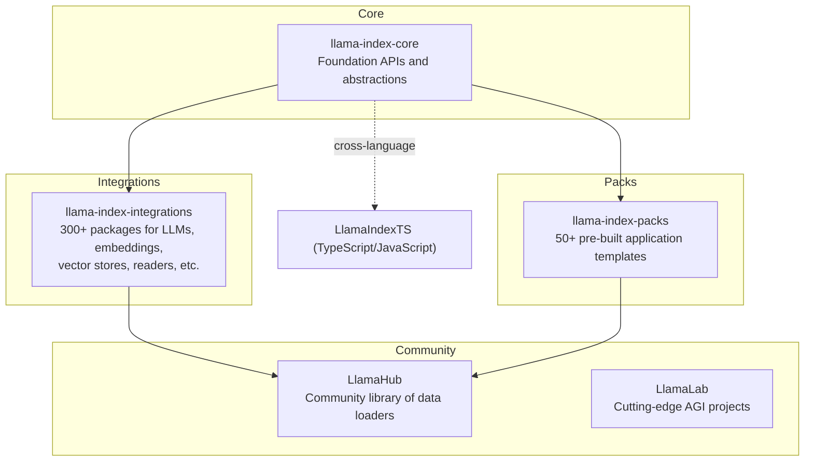
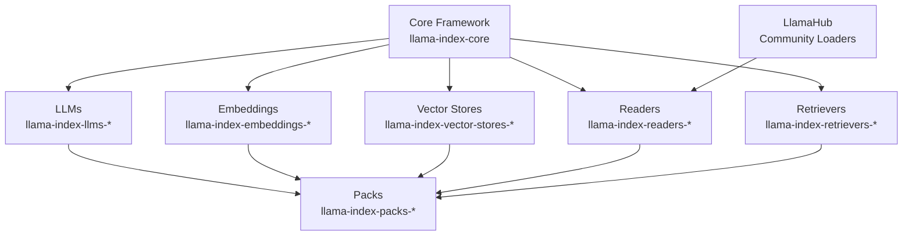
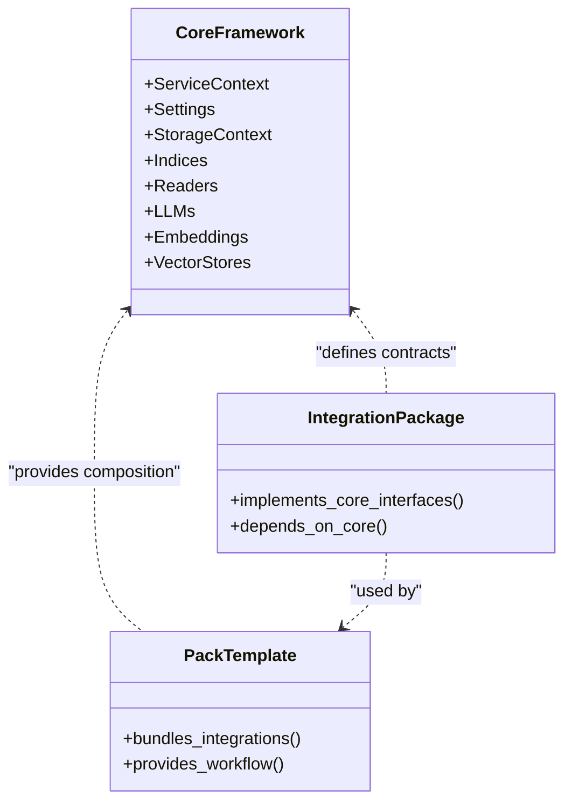
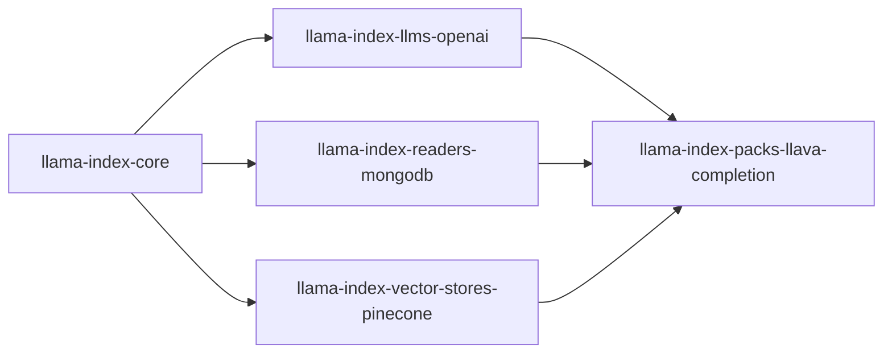

# Ecosystem Overview

<cite>
**Referenced Files in This Document**
- [README.md](file://README.md)
- [CONTRIBUTING.md](file://CONTRIBUTING.md)
- [llama-index-integrations/README.md](file://llama-index-integrations/README.md)
- [llama-index-packs/README.md](file://llama-index-packs/README.md)
- [scripts/integration_health_check.py](file://scripts/integration_health_check.py)
- [llama-index-integrations/llms/llama-index-llms-openai/pyproject.toml](file://llama-index-integrations/llms/llama-index-llms-openai/pyproject.toml)
- [llama-index-integrations/readers/llama-index-readers-mongodb/pyproject.toml](file://llama-index-integrations/readers/llama-index-readers-mongodb/pyproject.toml)
- [llama-index-integrations/vector_stores/llama-index-vector-stores-pinecone/pyproject.toml](file://llama-index-integrations/vector_stores/llama-index-vector-stores-pinecone/pyproject.toml)
- [llama-index-packs/llama-index-packs-llava-completion/pyproject.toml](file://llama-index-packs/llama-index-packs-llava-completion/pyproject.toml)
- [llama-index-core/llama_index/core/__init__.py](file://llama-index-core/llama_index/core/__init__.py)
</cite>

## Table of Contents
1. [Introduction](#introduction)
2. [Project Structure](#project-structure)
3. [Core Components](#core-components)
4. [Architecture Overview](#architecture-overview)
5. [Detailed Component Analysis](#detailed-component-analysis)
6. [Dependency Analysis](#dependency-analysis)
7. [Performance Considerations](#performance-considerations)
8. [Troubleshooting Guide](#troubleshooting-guide)
9. [Conclusion](#conclusion)
10. [Appendices](#appendices)

## Introduction
This document presents a comprehensive overview of the LlamaIndex ecosystem, focusing on how the community-driven integrations, curated application templates, and the core framework work together to enable flexible, modular LLM application development. It explains the three main ecosystem components, highlights the breadth of available integrations and packs, and provides guidance for selecting appropriate components based on use cases and ecosystem maturity.

## Project Structure
The LlamaIndex ecosystem is organized as a monorepo with:
- Core framework packages that define foundational abstractions and APIs
- A large catalog of integration packages for LLMs, embeddings, vector stores, readers, retrievers, and more
- Pre-built application templates (LlamaPacks) that bundle reusable patterns
- Community libraries and tools that extend the ecosystem

```mermaid
graph TB
subgraph "Core"
CORE["llama-index-core<br/>Foundation APIs and abstractions"]
end
subgraph "Integrations"
INTEGRATIONS["llama-index-integrations<br/>300+ packages for LLMs, embeddings,<br/>vector stores, readers, etc."]
end
subgraph "Packs"
PACKS["llama-index-packs<br/>50+ pre-built application templates"]
end
subgraph "Community"
LLAMAHUB["LlamaHub<br/>Community library of data loaders"]
LLAMALAB["LlamaLab<br/>Cutting-edge AGI projects"]
end
CORE --> INTEGRATIONS
CORE --> PACKS
INTEGRATIONS --> LLAMAHUB
PACKS --> LLAMAHUB
CORE -. "cross-language" .-> TS["LlamaIndexTS (TypeScript/JavaScript)"]
```

**Section sources**
- [README.md](file://README.md#L51-L55)
- [llama-index-integrations/README.md](file://llama-index-integrations/README.md#L1-L5)
- [llama-index-packs/README.md](file://llama-index-packs/README.md#L1-L33)

## Core Components
The ecosystem comprises three pillars:

- LlamaHub: A community library of data loaders and integrations that complements core capabilities with third-party connectors and adapters.
- LlamaLab: A space for cutting-edge AGI projects that leverage LlamaIndex, showcasing advanced patterns and research-grade applications.
- LlamaPacks: Pre-built application templates that encapsulate common RAG and agent patterns, enabling rapid prototyping and production-ready blueprints.

These components work together with the core framework to offer:
- Over 300 integration packages across LLM providers, embeddings, vector stores, readers, retrievers, and observability tools
- 50+ pre-built application templates (packs) for common use cases
- Seamless interoperability between core and ecosystem packages

**Section sources**
- [README.md](file://README.md#L16-L19)
- [README.md](file://README.md#L51-L55)
- [llama-index-packs/README.md](file://llama-index-packs/README.md#L1-L33)

## Architecture Overview
The ecosystem architecture emphasizes modularity and composability:
- Core defines standardized interfaces and service contexts
- Integrations plug into core via clearly defined extension points
- Packs assemble integrations into cohesive application blueprints
- LlamaHub curates community-contributed loaders and adapters
- LlamaLab incubates advanced, research-grade projects

```mermaid
graph TB
CORE["Core Framework<br/>llama-index-core"]
INT_LLM["LLMs<br/>llama-index-llms-*"]
INT_EMB["Embeddings<br/>llama-index-embeddings-*"]
INT_VS["Vector Stores<br/>llama-index-vector-stores-*"]
INT_RD["Readers<br/>llama-index-readers-*"]
INT_RT["Retrievers<br/>llama-index-retrievers-*"]
PACKS["Packs<br/>llama-index-packs-*"]
HUB["LlamaHub<br/>Community Loaders"]
CORE --> INT_LLM
CORE --> INT_EMB
CORE --> INT_VS
CORE --> INT_RD
CORE --> INT_RT
INT_LLM --> PACKS
INT_EMB --> PACKS
INT_VS --> PACKS
INT_RD --> PACKS
INT_RT --> PACKS
HUB --> INT_RD
```

**Diagram sources**
- [README.md](file://README.md#L16-L19)
- [llama-index-integrations/README.md](file://llama-index-integrations/README.md#L1-L5)
- [llama-index-packs/README.md](file://llama-index-packs/README.md#L1-L33)

**Section sources**
- [README.md](file://README.md#L16-L19)
- [llama-index-integrations/README.md](file://llama-index-integrations/README.md#L1-L5)
- [llama-index-packs/README.md](file://llama-index-packs/README.md#L1-L33)

## Detailed Component Analysis

### LlamaHub Community Library
LlamaHub serves as the central hub for community-contributed data loaders and integrations. It complements core capabilities by offering:
- Extensive readers for diverse data sources and formats
- Adapters and bridges to external systems
- Curated examples and best practices

LlamaHub integrates with the broader ecosystem by:
- Providing import paths that align with core namespaces
- Enabling discovery and installation of compatible integrations
- Supporting rapid iteration and community feedback loops

**Section sources**
- [README.md](file://README.md#L53-L53)

### LlamaLab Cutting-Edge Projects
LlamaLab hosts advanced AGI projects that demonstrate novel patterns and capabilities built on top of LlamaIndex. These projects:
- Showcase bleeding-edge research and experimentation
- Serve as inspiration and reference implementations
- Encourage collaboration and knowledge exchange within the community

**Section sources**
- [README.md](file://README.md#L54-L54)

### LlamaPacks Application Templates
LlamaPacks are pre-configured, reusable application blueprints that accelerate development. They:
- Bundle integrations into coherent workflows
- Provide templates for common use cases (e.g., multimodal, graph RAG, agent patterns)
- Support both installation and local customization

Usage patterns include:
- Installing a pack directly via pip
- Downloading a pack locally for modification and iteration

**Section sources**
- [llama-index-packs/README.md](file://llama-index-packs/README.md#L1-L33)

### Core Framework and Ecosystem Packages
The core framework exposes standardized APIs and service contexts that ecosystem packages implement against. This design enables:
- Consistent behavior across integrations
- Easy swapping of providers and backends
- Predictable composition of components

```mermaid
classDiagram
class CoreFramework {
+ServiceContext
+Settings
+StorageContext
+Indices
+Readers
+LLMs
+Embeddings
+VectorStores
}
class IntegrationPackage {
+implements_core_interfaces()
+depends_on_core()
}
class PackTemplate {
+bundles_integrations()
+provides_workflow()
}
CoreFramework <.. IntegrationPackage : "defines contracts"
CoreFramework <.. PackTemplate : "provides composition"
IntegrationPackage ..> PackTemplate : "used by"
```

**Diagram sources**
- [llama-index-core/llama_index/core/__init__.py](file://llama-index-core/llama_index/core/__init__.py#L24-L88)
- [README.md](file://README.md#L25-L35)

**Section sources**
- [README.md](file://README.md#L21-L35)
- [llama-index-core/llama_index/core/__init__.py](file://llama-index-core/llama_index/core/__init__.py#L24-L88)

### Cross-Language Compatibility and LlamaIndexTS
LlamaIndex supports cross-language compatibility through LlamaIndexTS, the TypeScript/JavaScript implementation. This enables teams to:
- Use familiar JavaScript ecosystems alongside Python integrations
- Maintain consistent patterns across language boundaries
- Leverage complementary toolchains and deployment targets

**Section sources**
- [README.md](file://README.md#L39-L39)

## Dependency Analysis
The ecosystem relies on a modular dependency model:
- Integrations declare a strict dependency on the core framework
- Packs may depend on multiple integrations and core
- LlamaHub acts as a registry of compatible packages

```mermaid
graph LR
CORE["llama-index-core"]
OPENAI["llama-index-llms-openai"]
MONGO["llama-index-readers-mongodb"]
PINECONE["llama-index-vector-stores-pinecone"]
LAVACA["llama-index-packs-llava-completion"]
CORE --> OPENAI
CORE --> MONGO
CORE --> PINECONE
OPENAI --> LAVACA
MONGO --> LAVACA
PINECONE --> LAVACA
```

**Diagram sources**
- [llama-index-integrations/llms/llama-index-llms-openai/pyproject.toml](file://llama-index-integrations/llms/llama-index-llms-openai/pyproject.toml#L36-L36)
- [llama-index-integrations/readers/llama-index-readers-mongodb/pyproject.toml](file://llama-index-integrations/readers/llama-index-readers-mongodb/pyproject.toml#L36-L38)
- [llama-index-integrations/vector_stores/llama-index-vector-stores-pinecone/pyproject.toml](file://llama-index-integrations/vector_stores/llama-index-vector-stores-pinecone/pyproject.toml#L35-L37)
- [llama-index-packs/llama-index-packs-llava-completion/pyproject.toml](file://llama-index-packs/llama-index-packs-llava-completion/pyproject.toml#L41-L44)

**Section sources**
- [llama-index-integrations/llms/llama-index-llms-openai/pyproject.toml](file://llama-index-integrations/llms/llama-index-llms-openai/pyproject.toml#L36-L36)
- [llama-index-integrations/readers/llama-index-readers-mongodb/pyproject.toml](file://llama-index-integrations/readers/llama-index-readers-mongodb/pyproject.toml#L36-L38)
- [llama-index-integrations/vector_stores/llama-index-vector-stores-pinecone/pyproject.toml](file://llama-index-integrations/vector_stores/llama-index-vector-stores-pinecone/pyproject.toml#L35-L37)
- [llama-index-packs/llama-index-packs-llava-completion/pyproject.toml](file://llama-index-packs/llama-index-packs-llava-completion/pyproject.toml#L41-L44)

## Performance Considerations
- Choose integrations aligned with your scale and latency requirements
- Prefer mature integrations with strong test coverage and active maintenance
- Use packs as starting points and optimize only the components that matter for your workload
- Monitor integration health and adoption signals to inform selection decisions

[No sources needed since this section provides general guidance]

## Troubleshooting Guide
- Verify integration compatibility with your core version
- Check pack dependencies and ensure all required integrations are installed
- Use community channels and LlamaHub for support and examples
- For new integrations, follow contribution guidelines and ensure tests meet quality thresholds

**Section sources**
- [CONTRIBUTING.md](file://CONTRIBUTING.md#L172-L191)
- [README.md](file://README.md#L80-L86)

## Conclusion
The LlamaIndex ecosystem thrives on modularity, community contribution, and practical applicability. With over 300 integration packages, 50+ application templates, and strong cross-language support, teams can compose tailored solutions without being locked into monolithic stacks. By leveraging core interfaces and community-curated packages, developers can iterate faster, maintain cleaner architectures, and benefit from shared knowledge and best practices.

[No sources needed since this section summarizes without analyzing specific files]

## Appendices

### Selection Guidance: Choosing Integrations and Packs
- Use core as the foundation; add only the integrations you need
- Evaluate ecosystem maturity using signals like download trends, commit activity, and test coverage
- Start with a pack for common patterns; customize as needed
- Align provider choices with your infrastructure, compliance, and cost constraints

**Section sources**
- [README.md](file://README.md#L16-L19)
- [llama-index-packs/README.md](file://llama-index-packs/README.md#L1-L33)
- [scripts/integration_health_check.py](file://scripts/integration_health_check.py#L33-L41)

### Community Contributions and Governance
- Contributions are welcomed across core, integrations, and community tools
- Integrations should meaningfully integrate with existing framework components
- Follow established development guidelines and testing standards
- Engage with the community via documented channels

**Section sources**
- [CONTRIBUTING.md](file://CONTRIBUTING.md#L75-L113)
- [CONTRIBUTING.md](file://CONTRIBUTING.md#L172-L191)
- [README.md](file://README.md#L80-L86)