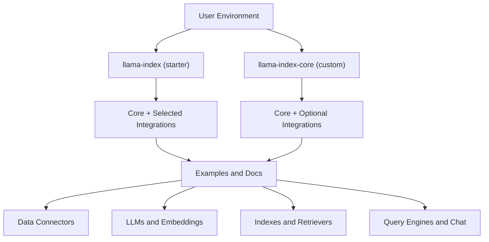
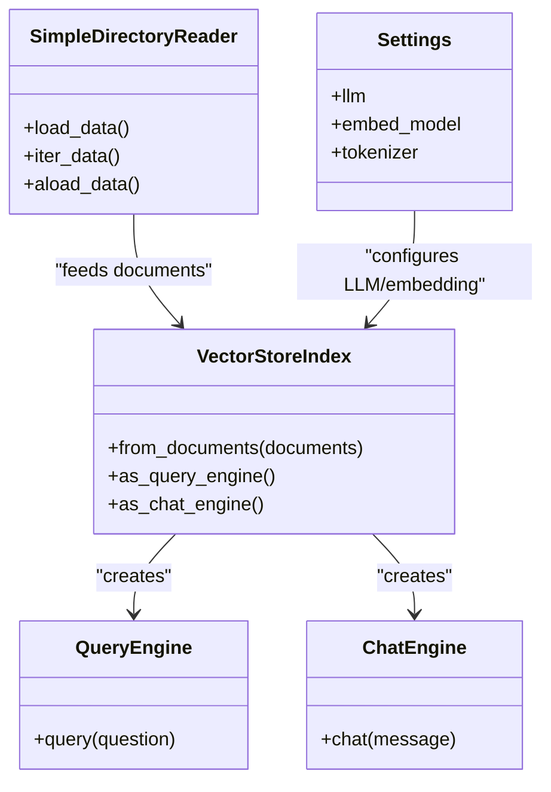
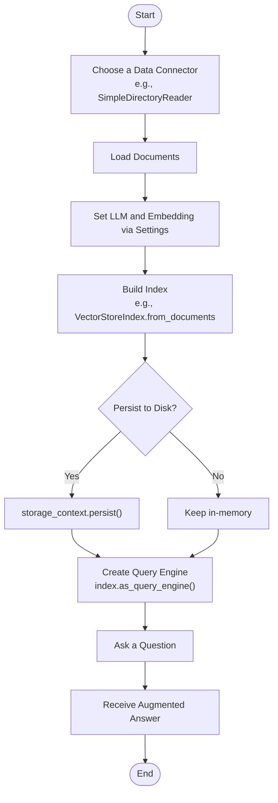
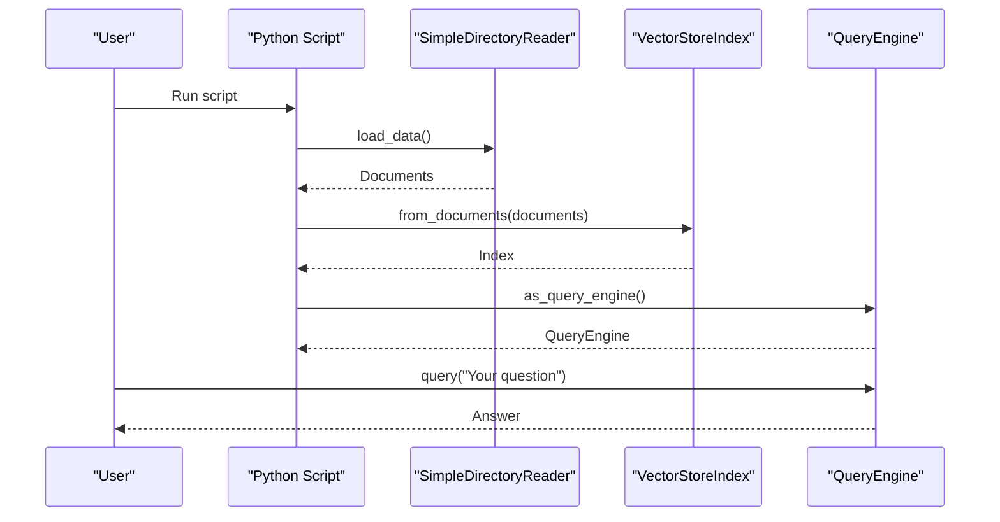
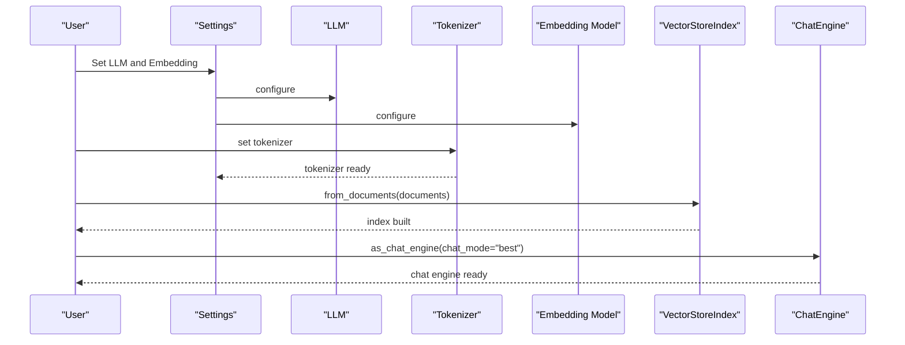
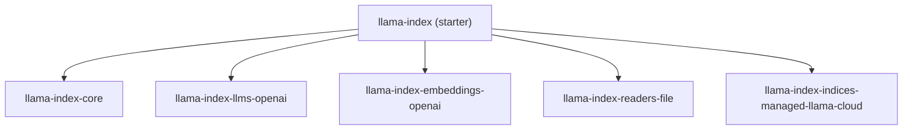

# Getting Started Guide

<cite>
**Referenced Files in This Document**
- [README.md](file://README.md)
- [pyproject.toml](file://pyproject.toml)
- [docs/examples/data_connectors/simple_directory_reader.ipynb](file://docs/examples/data_connectors/simple_directory_reader.ipynb)
- [docs/examples/cookbooks/llama3_cookbook.ipynb](file://docs/examples/cookbooks/llama3_cookbook.ipynb)
- [docs/examples/chat_engine/chat_engine_best.ipynb](file://docs/examples/chat_engine/chat_engine_best.ipynb)
- [docs/examples/index.md](file://docs/examples/index.md)
- [llama-index-core/llama_index/core/__init__.py](file://llama-index-core/llama_index/core/__init__.py)
</cite>

## Table of Contents
1. [Introduction](#introduction)
2. [Project Structure](#project-structure)
3. [Core Components](#core-components)
4. [Architecture Overview](#architecture-overview)
5. [Detailed Component Analysis](#detailed-component-analysis)
6. [Dependency Analysis](#dependency-analysis)
7. [Performance Considerations](#performance-considerations)
8. [Troubleshooting Guide](#troubleshooting-guide)
9. [Conclusion](#conclusion)
10. [Appendices](#appendices)

## Introduction
This Getting Started Guide helps you build your first Retrieval-Augmented Generation (RAG) application with LlamaIndex. It covers:
- Prerequisites and installation options
- Environment setup for both beginners and advanced users
- Step-by-step workflows from data ingestion to querying
- Practical examples using common data sources
- Differences between basic usage and advanced customization
- Troubleshooting and next steps

## Project Structure
LlamaIndex provides:
- A ready-to-use bundle package for quick starts
- A modular core package plus optional integrations for advanced setups
- Extensive examples and notebooks demonstrating real-world usage

Key entry points:
- Starter bundle: installs core plus selected integrations
- Customized setup: install core and add only the integrations you need

**Diagram sources**
- [README.md](file://README.md#L11-L24)
- [pyproject.toml](file://pyproject.toml#L34-L50)

**Section sources**
- [README.md](file://README.md#L11-L24)
- [pyproject.toml](file://pyproject.toml#L34-L50)

## Core Components
Beginner-friendly building blocks you will use:
- Data connectors to ingest your files and sources
- Indexes to structure and store your data
- LLMs and embeddings to power retrieval and generation
- Query engines and chat engines to interact with your data

**Diagram sources**
- [docs/examples/data_connectors/simple_directory_reader.ipynb](file://docs/examples/data_connectors/simple_directory_reader.ipynb#L242-L315)
- [docs/examples/cookbooks/llama3_cookbook.ipynb](file://docs/examples/cookbooks/llama3_cookbook.ipynb#L359-L447)
- [llama-index-core/llama_index/core/__init__.py](file://llama-index-core/llama_index/core/__init__.py#L24-L48)

**Section sources**
- [docs/examples/data_connectors/simple_directory_reader.ipynb](file://docs/examples/data_connectors/simple_directory_reader.ipynb#L242-L315)
- [docs/examples/cookbooks/llama3_cookbook.ipynb](file://docs/examples/cookbooks/llama3_cookbook.ipynb#L359-L447)
- [llama-index-core/llama_index/core/__init__.py](file://llama-index-core/llama_index/core/__init__.py#L24-L48)

## Architecture Overview
Recommended workflow from data ingestion to querying:

**Diagram sources**
- [README.md](file://README.md#L105-L177)
- [docs/examples/data_connectors/simple_directory_reader.ipynb](file://docs/examples/data_connectors/simple_directory_reader.ipynb#L242-L315)
- [docs/examples/cookbooks/llama3_cookbook.ipynb](file://docs/examples/cookbooks/llama3_cookbook.ipynb#L359-L447)

**Section sources**
- [README.md](file://README.md#L105-L177)

## Detailed Component Analysis

### Quick Start (Immediate Results)
Follow this minimal path to get an answer in minutes:
- Install the starter package
- Prepare a folder of text files
- Load, index, and query

Practical steps:
- Install the starter package
- Place your files in a directory
- Load with a data connector
- Build a vector index
- Create a query engine
- Ask a question

**Diagram sources**
- [README.md](file://README.md#L105-L177)
- [docs/examples/data_connectors/simple_directory_reader.ipynb](file://docs/examples/data_connectors/simple_directory_reader.ipynb#L242-L315)

**Section sources**
- [README.md](file://README.md#L105-L177)
- [docs/examples/data_connectors/simple_directory_reader.ipynb](file://docs/examples/data_connectors/simple_directory_reader.ipynb#L242-L315)

### Guided Tutorial (Learning Concepts)
Step-by-step with explanations and optional integrations:
- Choose an LLM and embedding provider
- Configure tokenizers and stopping criteria
- Build a RAG pipeline
- Explore chat modes and agents

Common data sources:
- Local files (PDFs, text, CSV)
- Cloud databases and vector stores
- Web pages and APIs

**Diagram sources**
- [docs/examples/cookbooks/llama3_cookbook.ipynb](file://docs/examples/cookbooks/llama3_cookbook.ipynb#L359-L447)
- [docs/examples/chat_engine/chat_engine_best.ipynb](file://docs/examples/chat_engine/chat_engine_best.ipynb#L117-L142)

**Section sources**
- [docs/examples/cookbooks/llama3_cookbook.ipynb](file://docs/examples/cookbooks/llama3_cookbook.ipynb#L359-L447)
- [docs/examples/chat_engine/chat_engine_best.ipynb](file://docs/examples/chat_engine/chat_engine_best.ipynb#L117-L142)
- [docs/examples/index.md](file://docs/examples/index.md#L7-L68)

### Advanced Setup (Production Environments)
- Use llama-index-core and add only required integrations
- Persist indexes and manage storage contexts
- Scale with external vector stores and cloud providers
- Integrate observability and monitoring

Recommended production checklist:
- Pin versions in your environment
- Use persistent storage contexts
- Centralize configuration via Settings
- Add logging and callback handlers
- Secure API keys and credentials

**Section sources**
- [README.md](file://README.md#L11-L24)
- [pyproject.toml](file://pyproject.toml#L34-L50)

## Dependency Analysis
High-level dependencies for the starter package:
- Core package for fundamental building blocks
- Optional integrations for LLMs, embeddings, readers, and managed indices

**Diagram sources**
- [pyproject.toml](file://pyproject.toml#L34-L50)

**Section sources**
- [pyproject.toml](file://pyproject.toml#L34-L50)

## Performance Considerations
- Choose appropriate chunk sizes and overlap for your documents
- Select efficient vector stores for scale
- Tune LLM parameters for cost and latency
- Use async loading and iteration for large datasets
- Persist indexes to avoid re-computation

[No sources needed since this section provides general guidance]

## Troubleshooting Guide
Common issues and fixes:
- Missing API keys: ensure environment variables are set before importing LLMs
- Permission errors on persistent storage: verify write permissions to the storage directory
- Large model downloads: use quantization or inference endpoints for local models
- Tokenizer mismatches: align tokenizer with your chosen LLM
- Slow ingestion: use async loading or parallel readers

Helpful references:
- Environment setup and persistence examples
- Data connector configuration and iteration patterns

**Section sources**
- [README.md](file://README.md#L105-L177)
- [docs/examples/data_connectors/simple_directory_reader.ipynb](file://docs/examples/data_connectors/simple_directory_reader.ipynb#L376-L439)

## Conclusion
You now have multiple pathways to start with LlamaIndex:
- Quick Start for immediate results
- Guided Tutorial to learn concepts and patterns
- Advanced Setup for production-grade deployments

Continue by exploring the examples and integrating the components that match your use case.

[No sources needed since this section summarizes without analyzing specific files]

## Appendices

### A. Installation Options
- Starter bundle: installs core plus selected integrations
- Customized: install core and add only what you need

**Section sources**
- [README.md](file://README.md#L11-L24)
- [pyproject.toml](file://pyproject.toml#L34-L50)

### B. Recommended Beginner Workflow
- Install starter package
- Prepare a small dataset
- Load with a data connector
- Build a vector index
- Create a query engine
- Query and iterate

**Section sources**
- [README.md](file://README.md#L105-L177)
- [docs/examples/data_connectors/simple_directory_reader.ipynb](file://docs/examples/data_connectors/simple_directory_reader.ipynb#L242-L315)

### C. Next Steps and Resources
- Explore examples by category
- Review agent and workflow patterns
- Integrate with your preferred LLM and embedding providers

**Section sources**
- [docs/examples/index.md](file://docs/examples/index.md#L1-L68)