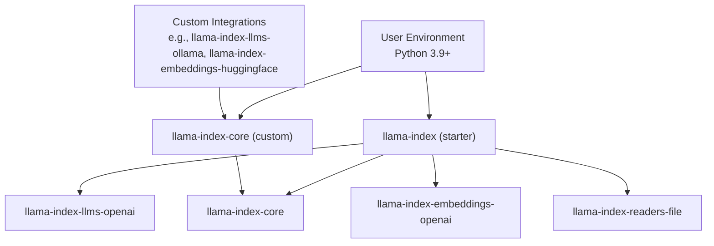
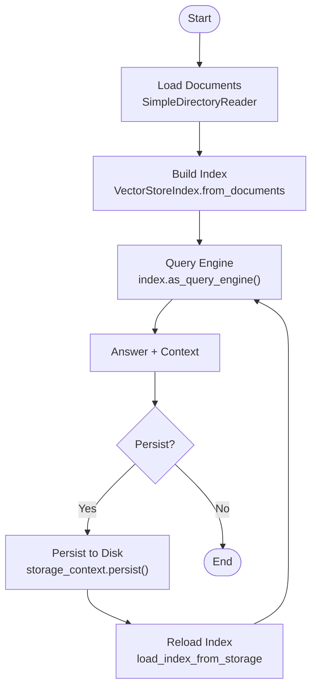
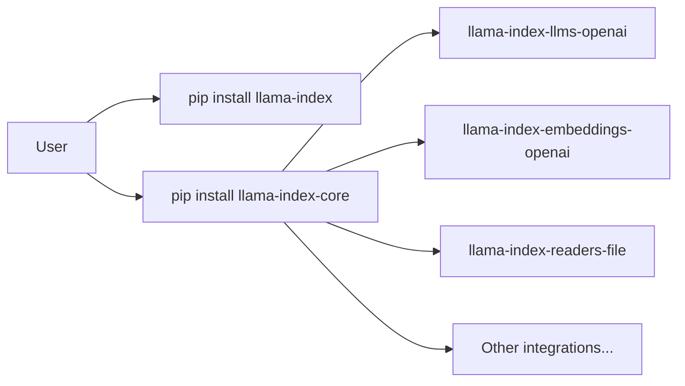
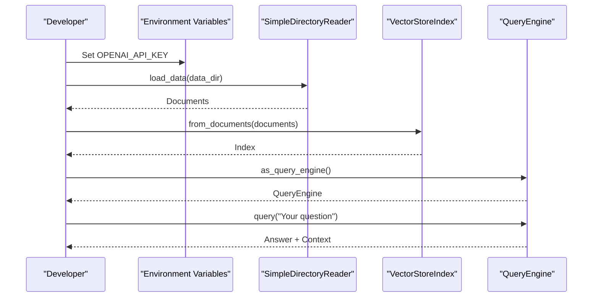
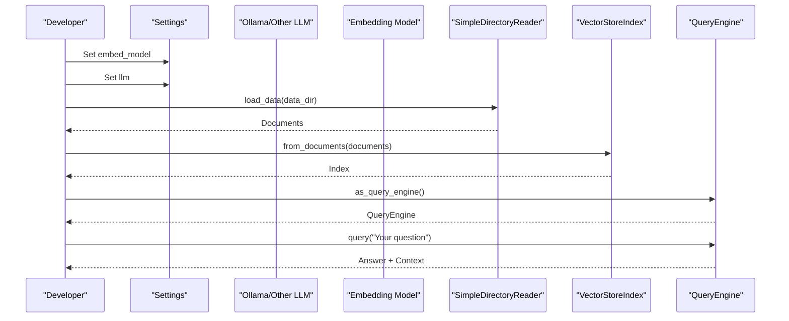
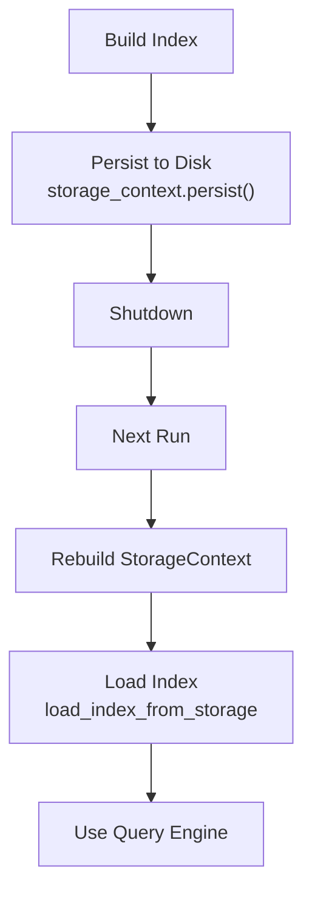
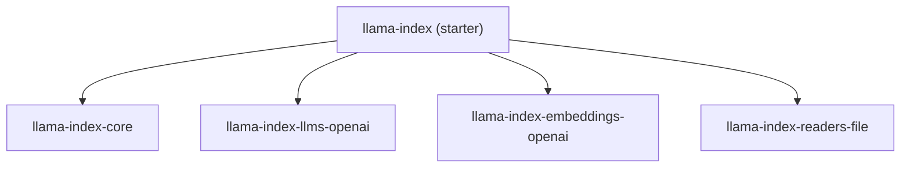

# Getting Started Guide

<cite>
**Referenced Files in This Document**
- [README.md](file://README.md)
- [pyproject.toml](file://pyproject.toml)
- [installation.mdx](file://docs/src/content/docs/framework/getting_started/installation.mdx)
- [starter_example.mdx](file://docs/src/content/docs/framework/getting_started/starter_example.mdx)
- [starter_example_local.mdx](file://docs/src/content/docs/framework/getting_started/starter_example_local.mdx)
- [app.py](file://examples/fastapi_rag_ollama/app.py)
- [README.md](file://examples/fastapi_rag_ollama/README.md)
</cite>

## Table of Contents
1. [Introduction](#introduction)
2. [Project Structure](#project-structure)
3. [Core Components](#core-components)
4. [Architecture Overview](#architecture-overview)
5. [Detailed Component Analysis](#detailed-component-analysis)
6. [Dependency Analysis](#dependency-analysis)
7. [Performance Considerations](#performance-considerations)
8. [Troubleshooting Guide](#troubleshooting-guide)
9. [Conclusion](#conclusion)
10. [Appendices](#appendices)

## Introduction
This guide helps you build your first Retrieval-Augmented Generation (RAG) application with LlamaIndex. It covers:
- Two installation approaches: the starter bundle (beginners) and the customized approach (advanced users)
- Step-by-step environment setup, package installation, and running your first query
- Practical examples for OpenAI and non-OpenAI LLMs
- Essential configuration (API keys, model selection)
- The basic workflow: data loading → index creation → querying → persistence
- Troubleshooting tips and best practices

## Project Structure
At a high level, LlamaIndex offers:
- A starter bundle package that installs core and commonly used integrations
- A core package plus optional integrations for fine-grained control

```mermaid
graph TB
A["User Environment<br/>Python 3.9+"] --> B["llama-index (starter)"]
A --> C["llama-index-core (custom)"]
B --> D["llama-index-core"]
B --> E["llama-index-llms-openai"]
B --> F["llama-index-embeddings-openai"]
B --> G["llama-index-readers-file"]
C --> D
H["Custom Integrations<br/>e.g., llama-index-llms-ollama, llama-index-embeddings-huggingface"] --> C
```

**Diagram sources**
- [README.md](file://README.md#L11-L20)
- [pyproject.toml](file://pyproject.toml#L41-L50)

**Section sources**
- [README.md](file://README.md#L11-L20)
- [pyproject.toml](file://pyproject.toml#L41-L50)

## Core Components
- Data connectors: Load data from files and other sources
- Indexing: Build a retrievable representation of your data
- Query engine: Retrieve relevant chunks and synthesize answers
- Persistence: Save and reload indices efficiently

Key building blocks you will use:
- Data loading: e.g., SimpleDirectoryReader
- Indexing: e.g., VectorStoreIndex
- Querying: e.g., index.as_query_engine().query(...)
- Persistence: e.g., index.storage_context.persist(), load_index_from_storage()

**Section sources**
- [starter_example.mdx](file://docs/src/content/docs/framework/getting_started/starter_example.mdx#L127-L171)
- [starter_example_local.mdx](file://docs/src/content/docs/framework/getting_started/starter_example_local.mdx#L132-L193)

## Architecture Overview
The RAG pipeline follows a predictable flow: ingest data, build an index, query it, and persist results.

```mermaid
flowchart TD
Start(["Start"]) --> Load["Load Documents<br/>SimpleDirectoryReader"]
Load --> Index["Build Index<br/>VectorStoreIndex.from_documents"]
Index --> Query["Query Engine<br/>index.as_query_engine()"]
Query --> Answer["Answer + Context"]
Answer --> Persist{"Persist?"}
Persist --> |Yes| Save["Persist to Disk<br/>storage_context.persist()"]
Persist --> |No| End(["End"])
Save --> Reload["Reload Index<br/>load_index_from_storage"]
Reload --> Query
```

**Diagram sources**
- [starter_example.mdx](file://docs/src/content/docs/framework/getting_started/starter_example.mdx#L127-L171)
- [starter_example.mdx](file://docs/src/content/docs/framework/getting_started/starter_example.mdx#L175-L189)
- [starter_example_local.mdx](file://docs/src/content/docs/framework/getting_started/starter_example_local.mdx#L132-L193)
- [starter_example_local.mdx](file://docs/src/content/docs/framework/getting_started/starter_example_local.mdx#L197-L219)

## Detailed Component Analysis

### Installation Approaches
- Starter bundle (recommended for beginners): Install a single package that includes core and common integrations
- Customized approach (recommended for advanced users): Install core and only the integrations you need

```mermaid
flowchart LR
U["User"] --> S["pip install llama-index"]
U --> C["pip install llama-index-core"]
C --> I1["llama-index-llms-openai"]
C --> I2["llama-index-embeddings-openai"]
C --> I3["llama-index-readers-file"]
C --> I4["Other integrations..."]
```

**Diagram sources**
- [installation.mdx](file://docs/src/content/docs/framework/getting_started/installation.mdx#L13-L57)
- [pyproject.toml](file://pyproject.toml#L41-L50)

**Section sources**
- [installation.mdx](file://docs/src/content/docs/framework/getting_started/installation.mdx#L13-L57)
- [README.md](file://README.md#L95-L101)

### OpenAI LLM Usage (Beginner Path)
- Set your OpenAI API key as an environment variable
- Load documents and build a VectorStoreIndex
- Query the index with a query engine

```mermaid
sequenceDiagram
participant Dev as "Developer"
participant Env as "Environment Variables"
participant Reader as "SimpleDirectoryReader"
participant Index as "VectorStoreIndex"
participant QE as "QueryEngine"
Dev->>Env : Set OPENAI_API_KEY
Dev->>Reader : load_data(data_dir)
Reader-->>Dev : Documents
Dev->>Index : from_documents(documents)
Index-->>Dev : Index
Dev->>QE : as_query_engine()
QE-->>Dev : QueryEngine
Dev->>QE : query("Your question")
QE-->>Dev : Answer + Context
```

**Diagram sources**
- [starter_example.mdx](file://docs/src/content/docs/framework/getting_started/starter_example.mdx#L20-L39)
- [starter_example.mdx](file://docs/src/content/docs/framework/getting_started/starter_example.mdx#L127-L171)

**Section sources**
- [starter_example.mdx](file://docs/src/content/docs/framework/getting_started/starter_example.mdx#L20-L39)
- [starter_example.mdx](file://docs/src/content/docs/framework/getting_started/starter_example.mdx#L127-L171)

### Non-OpenAI LLM Usage (Local and Other Providers)
- Configure Settings with a non-OpenAI LLM and embedding model
- Use Ollama for local inference or other providers as needed
- Reuse the same index and query engine pattern

```mermaid
sequenceDiagram
participant Dev as "Developer"
participant Settings as "Settings"
participant LLM as "Ollama/Other LLM"
participant Embed as "Embedding Model"
participant Reader as "SimpleDirectoryReader"
participant Index as "VectorStoreIndex"
participant QE as "QueryEngine"
Dev->>Settings : Set embed_model
Dev->>Settings : Set llm
Dev->>Reader : load_data(data_dir)
Reader-->>Dev : Documents
Dev->>Index : from_documents(documents)
Index-->>Dev : Index
Dev->>QE : as_query_engine()
QE-->>Dev : QueryEngine
Dev->>QE : query("Your question")
QE-->>Dev : Answer + Context
```

**Diagram sources**
- [starter_example_local.mdx](file://docs/src/content/docs/framework/getting_started/starter_example_local.mdx#L140-L159)
- [starter_example_local.mdx](file://docs/src/content/docs/framework/getting_started/starter_example_local.mdx#L132-L193)
- [app.py](file://examples/fastapi_rag_ollama/app.py#L11-L18)

**Section sources**
- [starter_example_local.mdx](file://docs/src/content/docs/framework/getting_started/starter_example_local.mdx#L140-L159)
- [starter_example_local.mdx](file://docs/src/content/docs/framework/getting_started/starter_example_local.mdx#L132-L193)
- [app.py](file://examples/fastapi_rag_ollama/app.py#L11-L18)

### Persistence and Reloading
- Persist the index to disk after building it
- Reload the index later to avoid reprocessing documents

```mermaid
flowchart TD
A["Build Index"] --> B["Persist to Disk<br/>storage_context.persist()"]
B --> C["Shutdown"]
C --> D["Next Run"]
D --> E["Rebuild StorageContext"]
E --> F["Load Index<br/>load_index_from_storage"]
F --> G["Use Query Engine"]
```

**Diagram sources**
- [starter_example.mdx](file://docs/src/content/docs/framework/getting_started/starter_example.mdx#L175-L189)
- [starter_example_local.mdx](file://docs/src/content/docs/framework/getting_started/starter_example_local.mdx#L197-L219)

**Section sources**
- [starter_example.mdx](file://docs/src/content/docs/framework/getting_started/starter_example.mdx#L175-L189)
- [starter_example_local.mdx](file://docs/src/content/docs/framework/getting_started/starter_example_local.mdx#L197-L219)

### Practical Examples

#### Beginner 5-Line Pattern (OpenAI)
- Set API key
- Load documents
- Build index
- Create query engine
- Run a query

See the example paths:
- [Beginner example paths](file://docs/src/content/docs/framework/getting_started/starter_example.mdx#L127-L171)

#### Advanced Customization (Non-OpenAI)
- Configure Settings with Ollama and HuggingFace embeddings
- Build index and query engine
- Persist and reload as needed

See the example paths:
- [Advanced example paths](file://docs/src/content/docs/framework/getting_started/starter_example_local.mdx#L132-L193)
- [FastAPI + Ollama example](file://examples/fastapi_rag_ollama/app.py#L11-L18)

## Dependency Analysis
The starter bundle aggregates commonly used components. Core dependencies include:
- llama-index-core
- llama-index-llms-openai
- llama-index-embeddings-openai
- llama-index-readers-file

```mermaid
graph TB
Root["llama-index (starter)"] --> Core["llama-index-core"]
Root --> OpenAILLM["llama-index-llms-openai"]
Root --> OpenAIEmb["llama-index-embeddings-openai"]
Root --> FileReader["llama-index-readers-file"]
```

**Diagram sources**
- [pyproject.toml](file://pyproject.toml#L41-L50)

**Section sources**
- [pyproject.toml](file://pyproject.toml#L41-L50)

## Performance Considerations
- Prefer asynchronous patterns for improved throughput when supported by your LLM provider
- Tune context windows and chunk sizes for your LLM and embedding model
- Persist indices to avoid repeated ingestion and embedding costs
- Use appropriate vector stores for scale and performance needs

[No sources needed since this section provides general guidance]

## Troubleshooting Guide
Common setup issues and resolutions:
- Missing API key for OpenAI: Set the OPENAI_API_KEY environment variable before running
- Local model availability: Ensure your local LLM (e.g., Ollama) is running and models are pulled
- Permission errors on persistent storage: Verify write permissions to the storage directory
- Version mismatches: Align core and integration versions as per the starter bundle or your custom selection

**Section sources**
- [installation.mdx](file://docs/src/content/docs/framework/getting_started/installation.mdx#L30-L39)
- [starter_example_local.mdx](file://docs/src/content/docs/framework/getting_started/starter_example_local.mdx#L16-L25)

## Conclusion
You now have the essentials to install LlamaIndex, configure your first RAG pipeline, and run queries against your data. Start with the starter bundle for simplicity, then move to the customized approach as your needs grow. Persist your indices, experiment with different LLMs and embeddings, and follow the best practices outlined here.

[No sources needed since this section summarizes without analyzing specific files]

## Appendices

### Quick Reference: Basic Commands
- Install starter bundle: pip install llama-index
- Install core + integrations: pip install llama-index-core llama-index-llms-ollama llama-index-embeddings-huggingface
- Set environment variables for API keys
- Build index and query as shown in the examples

**Section sources**
- [installation.mdx](file://docs/src/content/docs/framework/getting_started/installation.mdx#L13-L57)
- [starter_example.mdx](file://docs/src/content/docs/framework/getting_started/starter_example.mdx#L127-L171)
- [starter_example_local.mdx](file://docs/src/content/docs/framework/getting_started/starter_example_local.mdx#L132-L193)