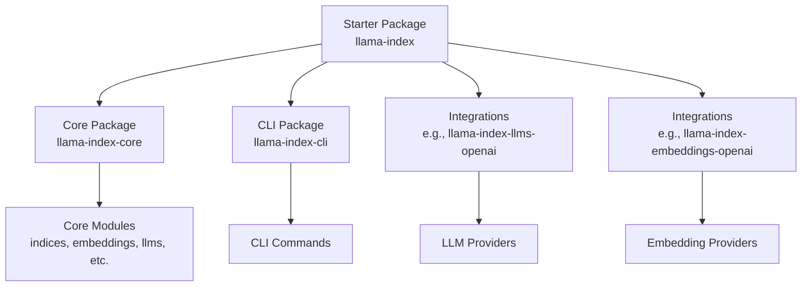
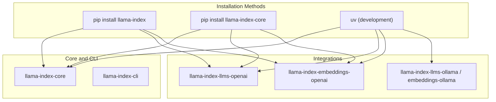
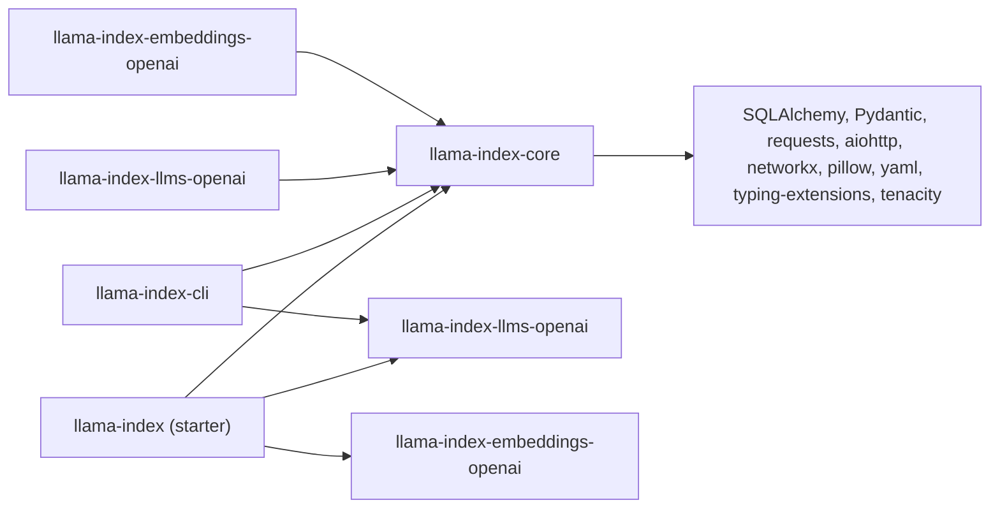

# Installation and Setup

<cite>
**Referenced Files in This Document**
- [README.md](file://README.md)
- [pyproject.toml](file://pyproject.toml)
- [llama-index-core/pyproject.toml](file://llama-index-core/pyproject.toml)
- [llama-index-cli/pyproject.toml](file://llama-index-cli/pyproject.toml)
- [llama-index-integrations/llms/llama-index-llms-openai/pyproject.toml](file://llama-index-integrations/llms/llama-index-llms-openai/pyproject.toml)
- [llama-index-integrations/embeddings/llama-index-embeddings-openai/pyproject.toml](file://llama-index-integrations/embeddings/llama-index-embeddings-openai/pyproject.toml)
- [examples/fastapi_rag_ollama/requirements.txt](file://examples/fastapi_rag_ollama/requirements.txt)
- [CONTRIBUTING.md](file://CONTRIBUTING.md)
- [docs/DOCS_README.md](file://docs/DOCS_README.md)
</cite>

## Table of Contents
1. [Introduction](#introduction)
2. [Project Structure](#project-structure)
3. [Core Components](#core-components)
4. [Architecture Overview](#architecture-overview)
5. [Detailed Component Analysis](#detailed-component-analysis)
6. [Dependency Analysis](#dependency-analysis)
7. [Performance Considerations](#performance-considerations)
8. [Troubleshooting Guide](#troubleshooting-guide)
9. [Conclusion](#conclusion)
10. [Appendices](#appendices)

## Introduction
This document provides comprehensive installation and setup guidance for LlamaIndex across multiple environments and use cases. It covers:
- Multiple installation methods: pip, conda, and development setup
- System requirements, Python version compatibility, and environment preparation
- Platform-specific considerations for Windows, macOS, and Linux
- Virtual environment setup, dependency management, and optional components
- Configuration of environment variables, API keys, and service credentials
- Troubleshooting guidance for common installation issues
- Verification steps to confirm successful setup
- Examples of setting up different types of environments from development to production

## Project Structure
LlamaIndex is a monorepo containing multiple packages:
- Starter package: a curated bundle that includes core and selected integrations
- Core package: the foundational LlamaIndex library
- CLI package: command-line utilities
- Integrations: modular packages for LLMs, embeddings, readers, vector stores, and more
- Examples: runnable examples demonstrating setups and configurations

**Diagram sources**
- [README.md](file://README.md#L11-L24)
- [pyproject.toml](file://pyproject.toml#L34-L50)
- [llama-index-core/pyproject.toml](file://llama-index-core/pyproject.toml#L33-L84)
- [llama-index-cli/pyproject.toml](file://llama-index-cli/pyproject.toml#L27-L47)

**Section sources**
- [README.md](file://README.md#L11-L24)
- [pyproject.toml](file://pyproject.toml#L34-L50)

## Core Components
Key packages and their roles:
- Starter package: includes core and a curated set of integrations for a quick start
- Core package: foundational APIs and modules for indices, embeddings, LLMs, and more
- CLI package: command-line tools for scaffolding and upgrades
- Integrations: provider-specific packages enabling LLMs, embeddings, readers, and vector stores

Installation methods and package choices are described in the sections below.

**Section sources**
- [README.md](file://README.md#L11-L24)
- [pyproject.toml](file://pyproject.toml#L34-L50)
- [llama-index-core/pyproject.toml](file://llama-index-core/pyproject.toml#L33-L84)
- [llama-index-cli/pyproject.toml](file://llama-index-cli/pyproject.toml#L27-L47)

## Architecture Overview
The installation architecture supports:
- Pip-based installation for both starter and core packages
- Optional integration packages aligned with core
- Development workflows using uv for environment management
- Example-driven setups for common stacks (e.g., Ollama)

**Diagram sources**
- [README.md](file://README.md#L95-L101)
- [pyproject.toml](file://pyproject.toml#L42-L49)
- [llama-index-core/pyproject.toml](file://llama-index-core/pyproject.toml#L55-L84)
- [llama-index-integrations/llms/llama-index-llms-openai/pyproject.toml](file://llama-index-integrations/llms/llama-index-llms-openai/pyproject.toml#L36)
- [llama-index-integrations/embeddings/llama-index-embeddings-openai/pyproject.toml](file://llama-index-integrations/embeddings/llama-index-embeddings-openai/pyproject.toml#L35)
- [examples/fastapi_rag_ollama/requirements.txt](file://examples/fastapi_rag_ollama/requirements.txt#L1-L7)

## Detailed Component Analysis

### System Requirements and Python Compatibility
- Minimum Python version: >=3.9
- Maximum Python version: <4.0
- Some packages specify stricter minimums (e.g., CLI requires >=3.10)

These constraints appear across:
- Starter package: requires Python >=3.9,<4.0
- Core package: requires Python >=3.9,<4.0
- CLI package: requires Python >=3.10,<4.0

**Section sources**
- [pyproject.toml](file://pyproject.toml#L72)
- [llama-index-core/pyproject.toml](file://llama-index-core/pyproject.toml#L38)
- [llama-index-cli/pyproject.toml](file://llama-index-cli/pyproject.toml#L32)

### Pip Installation Methods

#### Method 1: Starter Package (Recommended for most users)
- Install the curated starter package that includes core and selected integrations
- Typical command: pip install llama-index

This method is ideal for getting started quickly with a standard set of components.

**Section sources**
- [README.md](file://README.md#L14-L16)
- [README.md](file://README.md#L95-L101)

#### Method 2: Core + Select Integrations (Customized)
- Install core and add only the integrations you need
- Example commands show installing core plus specific LLM and embedding integrations

This method offers flexibility to tailor dependencies to your stack.

**Section sources**
- [README.md](file://README.md#L95-L101)
- [llama-index-core/pyproject.toml](file://llama-index-core/pyproject.toml#L55-L84)

#### Method 3: Example-Based Setup (Ollama)
- Example requirements demonstrate installing the starter package plus Ollama-related integrations and the Ollama client

This illustrates how to combine the starter package with provider-specific integrations.

**Section sources**
- [examples/fastapi_rag_ollama/requirements.txt](file://examples/fastapi_rag_ollama/requirements.txt#L1-L7)

### Conda Installation
- The repository does not define explicit conda installation steps
- Recommendation: use conda to create an environment matching the Python version requirements, then install via pip as described above

Guidance summary:
- Create a conda environment with Python >=3.9 and <4.0
- Activate the environment
- Install using pip (starter or core + integrations)

**Section sources**
- [pyproject.toml](file://pyproject.toml#L72)
- [llama-index-core/pyproject.toml](file://llama-index-core/pyproject.toml#L38)

### Development Setup (uv)
- The project uses uv for development workflows
- Global environment setup and per-project virtual environments are supported
- Editable installs are handled automatically by uv

Typical development steps:
- Install uv
- Sync global environment
- Create/activate project-specific virtual environment
- Run tests and development tasks

**Section sources**
- [CONTRIBUTING.md](file://CONTRIBUTING.md#L11-L34)
- [CONTRIBUTING.md](file://CONTRIBUTING.md#L55-L68)

### Virtual Environment Setup
- Recommended practice: use isolated virtual environments per project
- For pip-based installs, create and activate a virtual environment before installing packages
- For uv-based development, uv venv creates and manages environments per project

**Section sources**
- [CONTRIBUTING.md](file://CONTRIBUTING.md#L55-L68)

### Optional Components and Integrations
Common optional integrations include:
- LLM providers: e.g., OpenAI, Replicate, Ollama
- Embedding providers: e.g., OpenAI, Hugging Face
- Readers and vector stores: e.g., file readers, managed indices

These are typically installed as separate packages and paired with core.

**Section sources**
- [README.md](file://README.md#L95-L101)
- [pyproject.toml](file://pyproject.toml#L42-L49)
- [llama-index-integrations/llms/llama-index-llms-openai/pyproject.toml](file://llama-index-integrations/llms/llama-index-llms-openai/pyproject.toml#L36)
- [llama-index-integrations/embeddings/llama-index-embeddings-openai/pyproject.toml](file://llama-index-integrations/embeddings/llama-index-embeddings-openai/pyproject.toml#L35)

### Configuration of Environment Variables, API Keys, and Credentials
- Many integrations require API keys or tokens configured via environment variables
- Examples in the repository demonstrate setting provider-specific environment variables before importing and using LlamaIndex components

Common patterns:
- Set provider API keys as environment variables prior to running code
- Configure LLMs, embeddings, and related services accordingly

**Section sources**
- [README.md](file://README.md#L108-L123)
- [README.md](file://README.md#L120-L152)

### Platform-Specific Considerations
- Windows, macOS, and Linux are supported as long as the Python version requirements are met
- The repository includes platform-specific installation guidance for uv on Windows and macOS
- Ensure that any native dependencies required by integrations are available on your platform

**Section sources**
- [CONTRIBUTING.md](file://CONTRIBUTING.md#L18-L24)

### Verification Steps
- Build asset verification: the core package includes static assets; verification can be performed using attestations
- Example verification script demonstrates verifying cached assets against the repository

Verification guidance:
- Use the provided script to verify the integrity of included static assets

**Section sources**
- [README.md](file://README.md#L191-L208)

### Example Environments

#### Development Environment
- Use uv to create and manage a development environment
- Sync global environment and create per-project virtual environments
- Install packages in editable mode for iteration

**Section sources**
- [CONTRIBUTING.md](file://CONTRIBUTING.md#L26-L68)

#### Production Environment
- Use the starter package for a quick production setup
- Pin versions appropriately and deploy with your application runtime
- Ensure environment variables for API keys are configured securely

**Section sources**
- [README.md](file://README.md#L14-L16)
- [README.md](file://README.md#L108-L123)

#### Example Stack: FastAPI + Ollama
- Install the starter package and Ollama-related integrations
- Include the Ollama client for local inference

**Section sources**
- [examples/fastapi_rag_ollama/requirements.txt](file://examples/fastapi_rag_ollama/requirements.txt#L1-L7)

## Dependency Analysis
LlamaIndex packages declare dependencies that influence installation choices:
- Starter package depends on core and several integrations
- Core package depends on foundational libraries (e.g., SQLAlchemy, Pydantic, requests)
- CLI package depends on core and a subset of integrations
- Provider integrations depend on their respective SDKs and core

**Diagram sources**
- [pyproject.toml](file://pyproject.toml#L42-L49)
- [llama-index-core/pyproject.toml](file://llama-index-core/pyproject.toml#L55-L84)
- [llama-index-cli/pyproject.toml](file://llama-index-cli/pyproject.toml#L43-L47)
- [llama-index-integrations/llms/llama-index-llms-openai/pyproject.toml](file://llama-index-integrations/llms/llama-index-llms-openai/pyproject.toml#L36)
- [llama-index-integrations/embeddings/llama-index-embeddings-openai/pyproject.toml](file://llama-index-integrations/embeddings/llama-index-embeddings-openai/pyproject.toml#L35)

**Section sources**
- [pyproject.toml](file://pyproject.toml#L42-L49)
- [llama-index-core/pyproject.toml](file://llama-index-core/pyproject.toml#L55-L84)
- [llama-index-cli/pyproject.toml](file://llama-index-cli/pyproject.toml#L43-L47)
- [llama-index-integrations/llms/llama-index-llms-openai/pyproject.toml](file://llama-index-integrations/llms/llama-index-llms-openai/pyproject.toml#L36)
- [llama-index-integrations/embeddings/llama-index-embeddings-openai/pyproject.toml](file://llama-index-integrations/embeddings/llama-index-embeddings-openai/pyproject.toml#L35)

## Performance Considerations
- Choose provider integrations that match your performance and cost targets
- Keep dependencies aligned with core to avoid conflicts
- For production deployments, pin versions and monitor resource usage

[No sources needed since this section provides general guidance]

## Troubleshooting Guide
Common installation issues and resolutions:
- Python version mismatch: ensure Python >=3.9 and <4.0; some packages require >=3.10
- Missing environment variables: many integrations require API keys configured as environment variables
- Dependency conflicts: prefer the starter package for a tested combination; otherwise, align versions with core
- Verification failures: use the provided verification script to confirm integrity of included assets

**Section sources**
- [pyproject.toml](file://pyproject.toml#L72)
- [llama-index-core/pyproject.toml](file://llama-index-core/pyproject.toml#L38)
- [llama-index-cli/pyproject.toml](file://llama-index-cli/pyproject.toml#L32)
- [README.md](file://README.md#L191-L208)
- [README.md](file://README.md#L108-L123)

## Conclusion
LlamaIndex supports flexible installation approaches:
- Starter package for quick starts
- Core plus selective integrations for customization
- Development workflows using uv
Follow the system requirements, configure environment variables for providers, and use verification steps to ensure a reliable setup. The examples in this repository illustrate practical combinations for common scenarios.

[No sources needed since this section summarizes without analyzing specific files]

## Appendices

### Appendix A: Quick Reference

- Python version: >=3.9,<4.0 (some packages require >=3.10)
- Pip install starter: pip install llama-index
- Pip install core + integrations: pip install llama-index-core and provider-specific packages
- Conda: create environment with compatible Python, then pip install
- Development: uv sync and uv venv
- Verification: run the provided verification script for included assets

**Section sources**
- [pyproject.toml](file://pyproject.toml#L72)
- [llama-index-core/pyproject.toml](file://llama-index-core/pyproject.toml#L38)
- [llama-index-cli/pyproject.toml](file://llama-index-cli/pyproject.toml#L32)
- [README.md](file://README.md#L191-L208)
- [CONTRIBUTING.md](file://CONTRIBUTING.md#L26-L68)